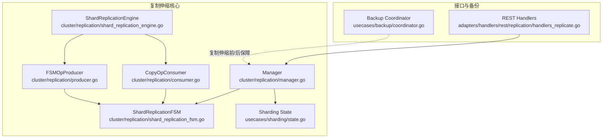
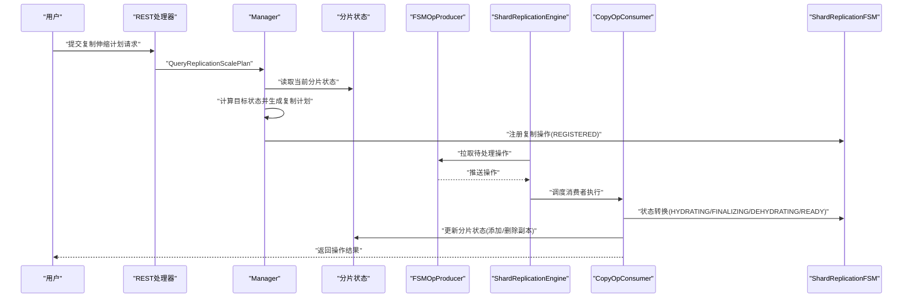
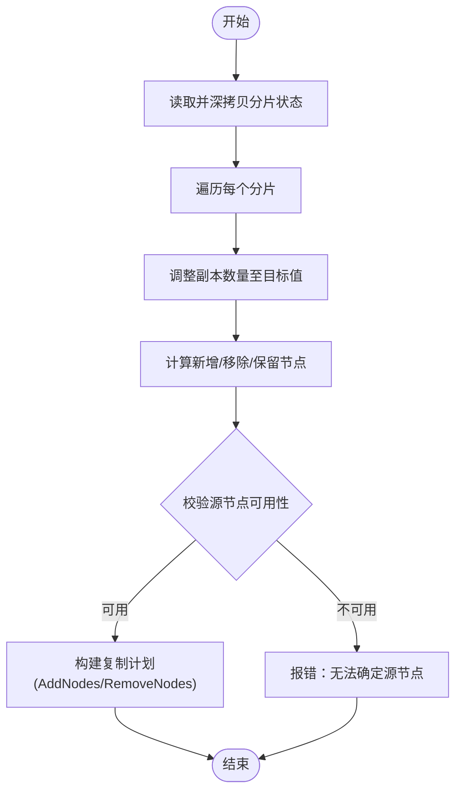
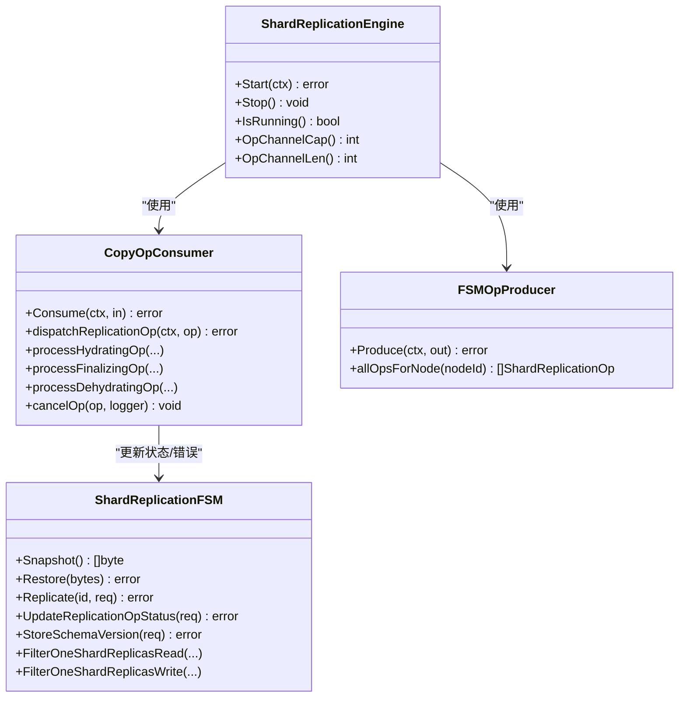
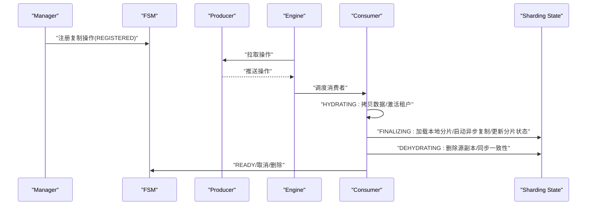
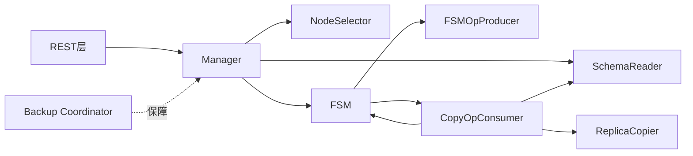

# 复制伸缩

<cite>
**本文引用的文件**
- [cluster/replication/manager.go](file://cluster/replication/manager.go)
- [cluster/replication/shard_replication_fsm.go](file://cluster/replication/shard_replication_fsm.go)
- [cluster/replication/shard_replication_engine.go](file://cluster/replication/shard_replication_engine.go)
- [cluster/replication/consumer.go](file://cluster/replication/consumer.go)
- [cluster/replication/producer.go](file://cluster/replication/producer.go)
- [usecases/sharding/state.go](file://usecases/sharding/state.go)
- [adapters/handlers/rest/replication/handlers_replicate.go](file://adapters/handlers/rest/replication/handlers_replicate.go)
- [usecases/backup/coordinator.go](file://usecases/backup/coordinator.go)
- [cluster/replication/shard_replication_apply.go](file://cluster/replication/shard_replication_apply.go)
- [test/acceptance/replication/replica_replication/scale/scale_test.go](file://test/acceptance/replication/replica_replication/scale/scale_test.go)
</cite>

## 目录
1. [简介](#简介)
2. [项目结构](#项目结构)
3. [核心组件](#核心组件)
4. [架构总览](#架构总览)
5. [详细组件分析](#详细组件分析)
6. [依赖关系分析](#依赖关系分析)
7. [性能考量](#性能考量)
8. [故障排查指南](#故障排查指南)
9. [结论](#结论)
10. [附录](#附录)

## 简介
本技术文档围绕 Weaviate 的复制伸缩系统，系统性阐述动态复制因子调整的实现原理、复制计划生成与执行策略、节点加入/移除的自动化流程（含数据迁移、负载重分配与一致性维护）、容量规划方法（性能基准与容量预测）、伸缩过程中的数据安全（备份、回滚与故障恢复）、最佳实践与风险控制，以及性能优化与成本效益分析。文档以代码级可视化图示与路径引用相结合的方式，帮助读者从整体到细节全面理解复制伸缩的设计与实现。

## 项目结构
Weaviate 的复制伸缩能力由“复制管理器”“状态机”“引擎（生产者-消费者）”“分片状态”“REST 接口”“备份协调器”等模块协同完成。下图展示与复制伸缩直接相关的关键模块及其交互关系：

图表来源
- [cluster/replication/manager.go](file://cluster/replication/manager.go#L35-L61)
- [cluster/replication/shard_replication_fsm.go](file://cluster/replication/shard_replication_fsm.go#L61-L106)
- [cluster/replication/shard_replication_engine.go](file://cluster/replication/shard_replication_engine.go#L48-L133)
- [cluster/replication/consumer.go](file://cluster/replication/consumer.go#L48-L114)
- [cluster/replication/producer.go](file://cluster/replication/producer.go#L21-L51)
- [usecases/sharding/state.go](file://usecases/sharding/state.go#L34-L44)
- [adapters/handlers/rest/replication/handlers_replicate.go](file://adapters/handlers/rest/replication/handlers_replicate.go#L493-L521)
- [usecases/backup/coordinator.go](file://usecases/backup/coordinator.go#L78-L136)

章节来源
- [cluster/replication/manager.go](file://cluster/replication/manager.go#L35-L61)
- [cluster/replication/shard_replication_fsm.go](file://cluster/replication/shard_replication_fsm.go#L61-L106)
- [cluster/replication/shard_replication_engine.go](file://cluster/replication/shard_replication_engine.go#L48-L133)
- [cluster/replication/consumer.go](file://cluster/replication/consumer.go#L48-L114)
- [cluster/replication/producer.go](file://cluster/replication/producer.go#L21-L51)
- [usecases/sharding/state.go](file://usecases/sharding/state.go#L34-L44)
- [adapters/handlers/rest/replication/handlers_replicate.go](file://adapters/handlers/rest/replication/handlers_replicate.go#L493-L521)
- [usecases/backup/coordinator.go](file://usecases/backup/coordinator.go#L78-L136)

## 核心组件
- 复制管理器（Manager）
  - 负责接收复制伸缩请求、生成复制计划、查询/更新复制操作状态、与分片状态交互。
  - 关键职责：查询复制计划、查询/更新复制操作状态、查询分片状态、触发复制操作、取消/删除复制操作等。
- 分片复制有限状态机（ShardReplicationFSM）
  - 维护复制操作的生命周期状态、索引操作与状态映射、过滤读写副本、查询/更新操作状态。
- 引擎（ShardReplicationEngine）
  - 基于生产者-消费者模式驱动复制任务，通过背压通道控制并发，支持优雅启停与错误处理。
- 消费者（CopyOpConsumer）
  - 实际执行复制状态机的各阶段（注册、水化、脱水、收尾、就绪），负责异步复制、同步一致性、错误登记与回退。
- 生产者（FSMOpProducer）
  - 周期性从 FSM 拉取应由当前节点处理的复制任务，实现“拉式”复制。
- 分片状态（Sharding State）
  - 描述集合的物理/虚拟分片、副本归属、复制因子、多租户分区等；提供副本增删与复制因子调整逻辑。
- REST 处理器
  - 提供复制伸缩计划查询与应用的 HTTP 接口。
- 备份协调器（Backup Coordinator）
  - 在复制伸缩前后提供分布式备份/恢复能力，确保数据安全与可回滚。

章节来源
- [cluster/replication/manager.go](file://cluster/replication/manager.go#L35-L61)
- [cluster/replication/shard_replication_fsm.go](file://cluster/replication/shard_replication_fsm.go#L61-L106)
- [cluster/replication/shard_replication_engine.go](file://cluster/replication/shard_replication_engine.go#L48-L133)
- [cluster/replication/consumer.go](file://cluster/replication/consumer.go#L48-L114)
- [cluster/replication/producer.go](file://cluster/replication/producer.go#L21-L51)
- [usecases/sharding/state.go](file://usecases/sharding/state.go#L34-L44)
- [adapters/handlers/rest/replication/handlers_replicate.go](file://adapters/handlers/rest/replication/handlers_replicate.go#L493-L521)
- [usecases/backup/coordinator.go](file://usecases/backup/coordinator.go#L78-L136)

## 架构总览
复制伸缩的端到端流程如下：
- 用户通过 REST 接口提交复制因子调整请求；
- 管理器读取当前分片状态，计算目标状态，生成复制计划；
- 管理器将复制操作注册到 FSM，并由引擎的生产者周期性拉取；
- 消费者按状态机顺序执行复制：水化（拷贝数据）→ 收尾（加载本地分片、启动异步复制、更新分片状态）→ 脱水（移动场景下删除源节点副本）→ 就绪；
- 引擎在消费者失败时进行重试、错误登记与必要回退；
- 备份协调器在伸缩前后提供备份/恢复保障。

图表来源
- [adapters/handlers/rest/replication/handlers_replicate.go](file://adapters/handlers/rest/replication/handlers_replicate.go#L493-L521)
- [cluster/replication/manager.go](file://cluster/replication/manager.go#L337-L436)
- [usecases/sharding/state.go](file://usecases/sharding/state.go#L224-L270)
- [cluster/replication/producer.go](file://cluster/replication/producer.go#L67-L103)
- [cluster/replication/shard_replication_engine.go](file://cluster/replication/shard_replication_engine.go#L144-L218)
- [cluster/replication/consumer.go](file://cluster/replication/consumer.go#L341-L439)
- [cluster/replication/shard_replication_fsm.go](file://cluster/replication/shard_replication_fsm.go#L121-L144)

章节来源
- [adapters/handlers/rest/replication/handlers_replicate.go](file://adapters/handlers/rest/replication/handlers_replicate.go#L493-L521)
- [cluster/replication/manager.go](file://cluster/replication/manager.go#L337-L436)
- [usecases/sharding/state.go](file://usecases/sharding/state.go#L224-L270)
- [cluster/replication/producer.go](file://cluster/replication/producer.go#L67-L103)
- [cluster/replication/shard_replication_engine.go](file://cluster/replication/shard_replication_engine.go#L144-L218)
- [cluster/replication/consumer.go](file://cluster/replication/consumer.go#L341-L439)
- [cluster/replication/shard_replication_fsm.go](file://cluster/replication/shard_replication_fsm.go#L121-L144)

## 详细组件分析

### 动态复制因子调整与复制计划生成
- 计划生成流程
  - 管理器解析请求，读取当前分片状态并深拷贝；
  - 对每个分片调用副本调整逻辑，得到目标副本集合；
  - 计算“变更集”（新增/移除/保留），为每个需要新增的副本随机选择一个“源节点”，并校验“无法确定源节点”的边界条件；
  - 生成复制计划并返回给客户端。
- 关键点
  - 新增副本时随机选择源节点，避免热点集中；
  - 若目标副本数小于现有副本数，仅允许移除多余副本；
  - 若目标副本数为 0 或与现有副本数一致则不生成动作；
  - 严格校验“剩余节点为空但需新增副本”的非法情况。

图表来源
- [cluster/replication/manager.go](file://cluster/replication/manager.go#L337-L436)
- [usecases/sharding/state.go](file://usecases/sharding/state.go#L224-L270)

章节来源
- [cluster/replication/manager.go](file://cluster/replication/manager.go#L337-L436)
- [usecases/sharding/state.go](file://usecases/sharding/state.go#L224-L270)

### 复制计划执行策略（状态机与引擎）
- 状态机（FSM）
  - 维护复制操作的生命周期状态（已注册、水化、脱水、收尾、就绪、取消、删除）；
  - 提供状态变更、错误登记、取消/删除控制、按节点/集合/分片查询操作等功能；
  - 提供读写副本过滤逻辑，保障读写一致性。
- 引擎（Engine）
  - 生产者周期性从 FSM 拉取应由当前节点处理的操作；
  - 消费者池化执行复制状态机，支持背压、超时、重试与优雅关闭；
  - 通过指标回调与度量集成，便于可观测性。
- 消费者（Consumer）
  - 注册→水化（拷贝数据/激活租户/等待模式版本）→收尾（加载本地分片、启动异步复制、更新分片状态）→脱水（移动场景下删除源副本、同步一致性）→就绪；
  - 在异常情况下进行回退（停止异步复制、同步分片状态、必要时删除操作）。

图表来源
- [cluster/replication/shard_replication_fsm.go](file://cluster/replication/shard_replication_fsm.go#L61-L106)
- [cluster/replication/consumer.go](file://cluster/replication/consumer.go#L48-L114)
- [cluster/replication/shard_replication_engine.go](file://cluster/replication/shard_replication_engine.go#L48-L133)
- [cluster/replication/producer.go](file://cluster/replication/producer.go#L21-L51)

章节来源
- [cluster/replication/shard_replication_fsm.go](file://cluster/replication/shard_replication_fsm.go#L61-L106)
- [cluster/replication/consumer.go](file://cluster/replication/consumer.go#L48-L114)
- [cluster/replication/shard_replication_engine.go](file://cluster/replication/shard_replication_engine.go#L48-L133)
- [cluster/replication/producer.go](file://cluster/replication/producer.go#L21-L51)

### 节点加入/删除自动化流程
- 加入新节点（复制因子提升）
  - 生成“新增副本”动作，随机选择源节点；
  - 水化阶段拷贝数据，收尾阶段加载本地分片并启动双向异步复制；
  - 更新分片状态，使新副本参与读写。
- 删除节点（复制因子降低/移动场景）
  - 生成“移除副本”动作；
  - 移动场景下先脱水（在源节点删除副本并同步一致性），再收尾（在目标节点完成最终一致性）；
  - 非移动场景下直接删除副本并同步一致性。
- 负载重分配
  - 通过随机选择源节点避免热点；
  - 引擎的背压与限流避免系统过载；
  - 读写副本过滤确保在操作期间的读写一致性。

图表来源
- [cluster/replication/manager.go](file://cluster/replication/manager.go#L62-L75)
- [cluster/replication/shard_replication_apply.go](file://cluster/replication/shard_replication_apply.go#L27-L40)
- [cluster/replication/consumer.go](file://cluster/replication/consumer.go#L527-L679)
- [usecases/sharding/state.go](file://usecases/sharding/state.go#L155-L193)

章节来源
- [cluster/replication/manager.go](file://cluster/replication/manager.go#L62-L75)
- [cluster/replication/shard_replication_apply.go](file://cluster/replication/shard_replication_apply.go#L27-L40)
- [cluster/replication/consumer.go](file://cluster/replication/consumer.go#L527-L679)
- [usecases/sharding/state.go](file://usecases/sharding/state.go#L155-L193)

### 容量规划与性能基准
- 容量规划
  - 基于分片状态的复制因子与副本集合，结合节点存储候选集合，确保目标副本数不超过可用节点数；
  - 多租户场景下，副本集合与租户活动状态联动，避免冻结/冻结中状态的分区被误操作。
- 性能基准
  - 仓库提供通用性能基准脚本与压力测试样例，可用于评估插入/搜索/删除等操作在不同规模下的表现；
  - 可基于这些工具对复制伸缩场景进行回归测试，监控吞吐与延迟变化。

章节来源
- [usecases/sharding/state.go](file://usecases/sharding/state.go#L224-L270)
- [test/acceptance/replication/replica_replication/scale/scale_test.go](file://test/acceptance/replication/replica_replication/scale/scale_test.go#L189-L215)

### 数据安全与回滚机制
- 备份协调器
  - 在复制伸缩前后协调分布式备份/恢复，确保跨节点一致性；
  - 支持“准备阶段”“传输阶段”“最终化阶段”等多阶段状态与度量；
  - 具备取消检测与回退能力，避免部分节点失败导致的数据不一致。
- 回滚与故障恢复
  - 复制消费者在异常时会停止异步复制、同步分片状态、必要时删除操作；
  - 备份协调器提供统一的元数据与状态持久化，便于在失败后恢复或回滚。

章节来源
- [usecases/backup/coordinator.go](file://usecases/backup/coordinator.go#L161-L234)
- [usecases/backup/coordinator.go](file://usecases/backup/coordinator.go#L236-L378)
- [cluster/replication/consumer.go](file://cluster/replication/consumer.go#L441-L484)

### 最佳实践与风险控制
- 最佳实践
  - 伸缩前先执行备份，确保可回滚；
  - 控制并发与速率，避免对集群造成瞬时压力；
  - 使用多租户场景下的租户活动状态管理，避免对冻结分区进行伸缩；
  - 在移动场景下优先采用“脱水→删除”的顺序，确保一致性。
- 风险控制
  - 严格校验源节点可用性，避免“无剩余节点却要新增副本”的非法状态；
  - 消费者具备超时、重试与取消/删除控制，防止资源泄漏；
  - 读写副本过滤确保在操作期间的读写一致性。

章节来源
- [cluster/replication/manager.go](file://cluster/replication/manager.go#L375-L425)
- [cluster/replication/consumer.go](file://cluster/replication/consumer.go#L341-L439)
- [cluster/replication/shard_replication_fsm.go](file://cluster/replication/shard_replication_fsm.go#L284-L330)

## 依赖关系分析
- 组件耦合
  - Manager 依赖 SchemaReader 与 NodeSelector，用于读取分片状态与选择候选节点；
  - Engine 依赖 Producer 与 Consumer，形成稳定的生产-消费链路；
  - Consumer 依赖 ReplicaCopier、FSMUpdater、SchemaReader 等，完成数据复制与状态更新；
  - FSM 提供统一的状态与过滤能力，贯穿整个复制生命周期。
- 外部依赖
  - REST 层负责请求接入与响应封装；
  - 备份协调器提供跨节点一致性保障。

图表来源
- [adapters/handlers/rest/replication/handlers_replicate.go](file://adapters/handlers/rest/replication/handlers_replicate.go#L493-L521)
- [cluster/replication/manager.go](file://cluster/replication/manager.go#L35-L61)
- [cluster/replication/consumer.go](file://cluster/replication/consumer.go#L48-L114)
- [usecases/backup/coordinator.go](file://usecases/backup/coordinator.go#L78-L136)

章节来源
- [adapters/handlers/rest/replication/handlers_replicate.go](file://adapters/handlers/rest/replication/handlers_replicate.go#L493-L521)
- [cluster/replication/manager.go](file://cluster/replication/manager.go#L35-L61)
- [cluster/replication/consumer.go](file://cluster/replication/consumer.go#L48-L114)
- [usecases/backup/coordinator.go](file://usecases/backup/coordinator.go#L78-L136)

## 性能考量
- 并发与背压
  - 引擎使用有界通道与令牌桶限制并发，避免过度占用资源；
  - 生产者周期性轮询，miss 的 tick 会被丢弃，天然实现背压。
- 状态机与重试
  - 消费者对状态转换采用指数退避重试，失败时登记错误并通知 FSM；
  - 超时控制与上下文取消确保不会无限阻塞。
- 读写一致性
  - FSM 提供读写副本过滤，避免在操作期间对正在水化/脱水的副本进行读写；
  - 异步复制配合上界时间戳，确保在水化/脱水阶段的写入被正确传播。

章节来源
- [cluster/replication/shard_replication_engine.go](file://cluster/replication/shard_replication_engine.go#L70-L95)
- [cluster/replication/producer.go](file://cluster/replication/producer.go#L67-L103)
- [cluster/replication/consumer.go](file://cluster/replication/consumer.go#L380-L439)
- [cluster/replication/shard_replication_fsm.go](file://cluster/replication/shard_replication_fsm.go#L284-L330)

## 故障排查指南
- 常见问题
  - “无法确定源节点”：当目标副本数大于可用节点数或剩余节点为空时发生；
  - 操作被取消/删除：在 READY 前的取消/删除操作会触发回退与清理；
  - 异步复制初始化失败：消费者会进行有限次数的重试并记录错误。
- 排查步骤
  - 通过 REST 查询复制详情，确认操作状态与历史；
  - 检查引擎日志与指标，定位背压与超时问题；
  - 使用备份协调器检查元数据与状态，必要时回滚。

章节来源
- [cluster/replication/manager.go](file://cluster/replication/manager.go#L122-L185)
- [cluster/replication/consumer.go](file://cluster/replication/consumer.go#L441-L484)
- [usecases/backup/coordinator.go](file://usecases/backup/coordinator.go#L441-L468)

## 结论
Weaviate 的复制伸缩系统通过“管理器-状态机-引擎-消费者-生产者”的协作，实现了动态复制因子调整的自动化与高可靠。其设计强调一致性、可观测性与可回滚性：在伸缩前后通过备份协调器保障数据安全，在执行过程中通过 FSM 与消费者的状态机确保读写一致性与幂等性。结合性能基准与容量规划，可在不同规模与负载下实现稳定、可控的复制伸缩。

## 附录
- 接口与测试参考
  - REST 复制伸缩接口与应用流程参考路径：
    - [adapters/handlers/rest/replication/handlers_replicate.go](file://adapters/handlers/rest/replication/handlers_replicate.go#L493-L521)
  - 伸缩测试用例参考路径：
    - [test/acceptance/replication/replica_replication/scale/scale_test.go](file://test/acceptance/replication/replica_replication/scale/scale_test.go#L189-L215)