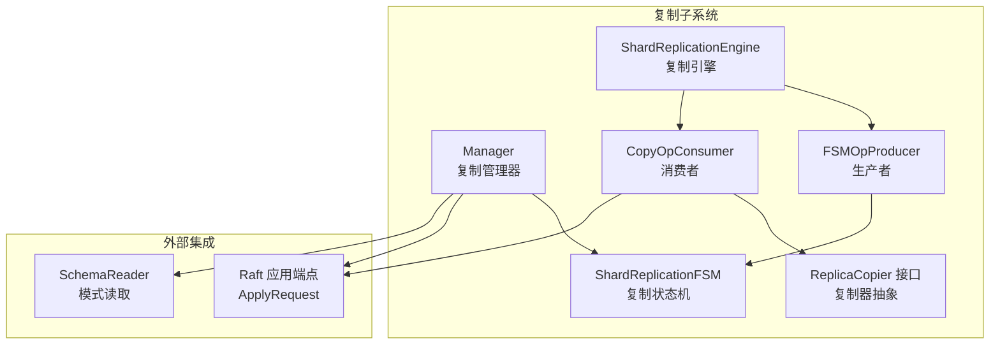
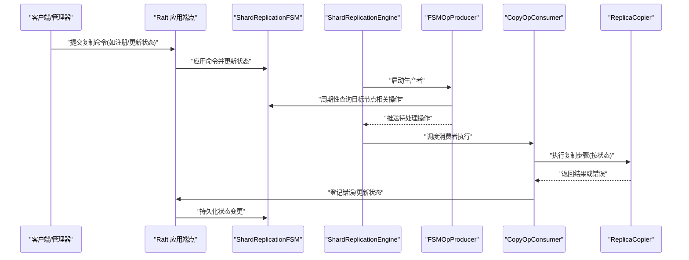
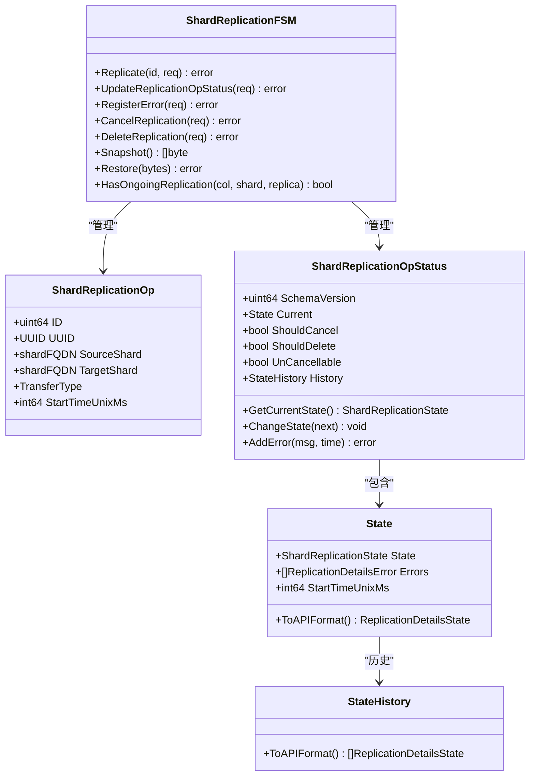
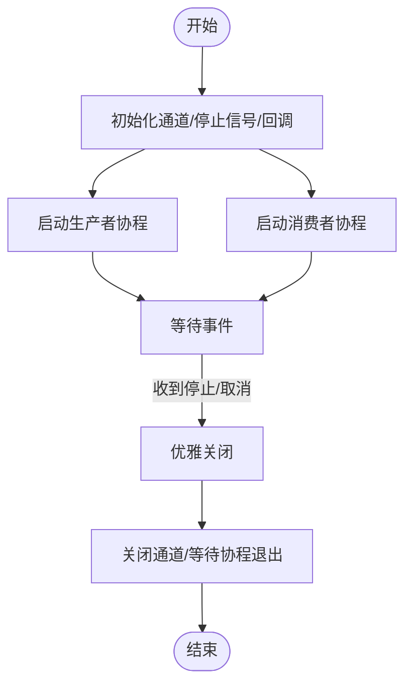
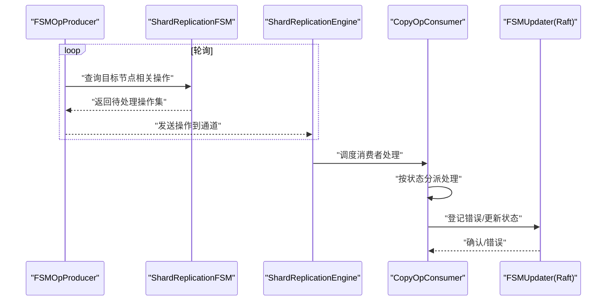
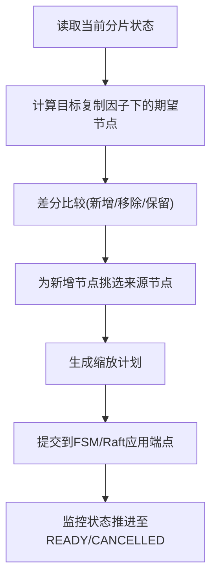
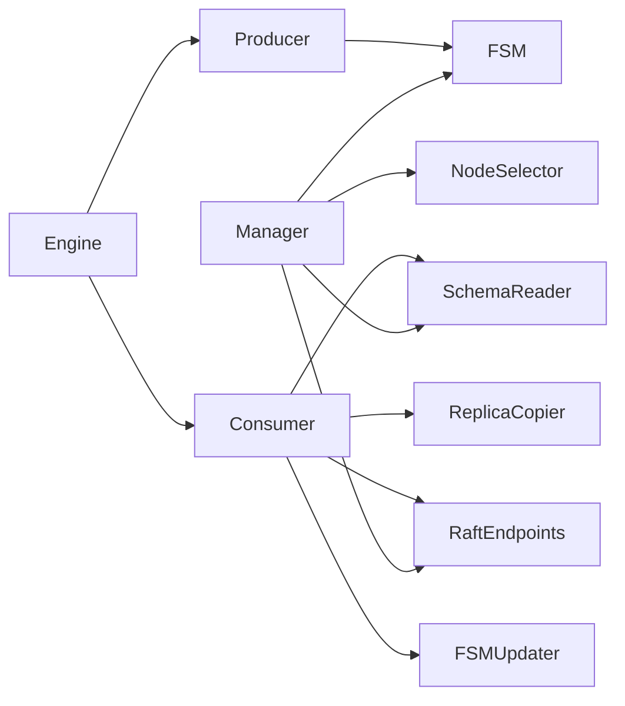
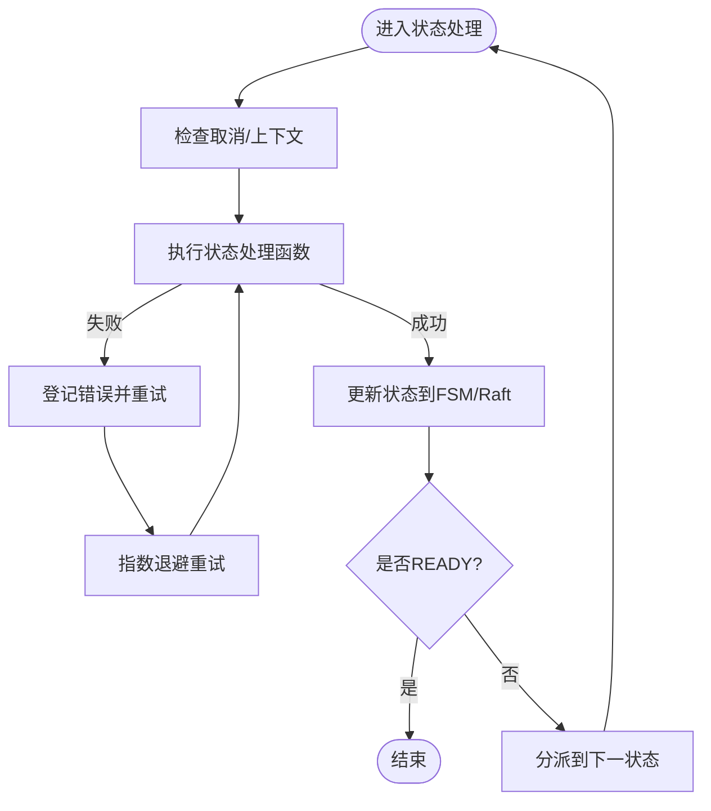

# 复制机制

<cite>
**本文引用的文件**
- [cluster/replication/shard_replication_fsm.go](file://cluster/replication/shard_replication_fsm.go)
- [cluster/replication/shard_replication_op_state.go](file://cluster/replication/shard_replication_op_state.go)
- [cluster/replication/shard_replication_apply.go](file://cluster/replication/shard_replication_apply.go)
- [cluster/replication/manager.go](file://cluster/replication/manager.go)
- [cluster/replication/engine.go](file://cluster/replication/engine.go)
- [cluster/replication/producer.go](file://cluster/replication/producer.go)
- [cluster/replication/consumer.go](file://cluster/replication/consumer.go)
- [cluster/replication/copier/types/types.go](file://cluster/replication/copier/types/types.go)
- [cluster/replication/utils.go](file://cluster/replication/utils.go)
- [cluster/replication/validate.go](file://cluster/replication/validate.go)
- [cluster/raft_replication_apply_endpoints.go](file://cluster/raft_replication_apply_endpoints.go)
- [adapters/handlers/rest/operations/replication/get_replication_scale_plan_parameters.go](file://adapters/handlers/rest/operations/replication/get_replication_scale_plan_parameters.go)
</cite>

## 目录
1. [简介](#简介)
2. [项目结构](#项目结构)
3. [核心组件](#核心组件)
4. [架构总览](#架构总览)
5. [详细组件分析](#详细组件分析)
6. [依赖关系分析](#依赖关系分析)
7. [性能考量](#性能考量)
8. [故障排查指南](#故障排查指南)
9. [结论](#结论)
10. [附录](#附录)

## 简介
本文件系统性阐述 Weaviate 的复制机制，聚焦“领导者-追随者”复制模型在分片级的实现。Weaviate 通过一个基于 Raft 的集群状态机（FSM）协调跨节点的分片复制，采用“拉取式”消费者模式：每个目标节点负责拉取其自身的复制任务，由生产者周期性地从 FSM 中筛选出应由该节点处理的操作并投递到通道；消费者以有限并发池执行具体复制步骤，并通过状态机驱动状态流转与持久化。

复制状态机（FSM）定义了分片复制的生命周期状态与状态历史，支持错误聚合、取消与删除控制、以及按集合/分片/节点维度的查询与过滤。复制配置的动态调整通过“缩放计划”生成器在不破坏一致性前提下计算节点增删与来源选择，结合 Raft 命令应用完成最终落地。

## 项目结构
围绕复制机制的关键目录与文件如下：
- 状态机与生命周期管理：FSM 定义、状态历史、状态更新与持久化
- 引擎与生产/消费：引擎协调生产者与消费者，通道背压，生命周期与度量
- 生产者：从 FSM 拉取目标节点相关的复制任务
- 消费者：按状态机状态执行复制步骤，含异步复制等待与错误登记
- 管理器：对外暴露复制命令入口，校验请求并委派给 FSM
- 类型与工具：复制器接口抽象、日志字段、参数校验等

图示来源
- [cluster/replication/manager.go](file://cluster/replication/manager.go#L62-L75)
- [cluster/replication/shard_replication_fsm.go](file://cluster/replication/shard_replication_fsm.go#L61-L106)
- [cluster/replication/engine.go](file://cluster/replication/engine.go#L135-L218)
- [cluster/replication/producer.go](file://cluster/replication/producer.go#L67-L103)
- [cluster/replication/consumer.go](file://cluster/replication/consumer.go#L177-L200)
- [cluster/raft_replication_apply_endpoints.go](file://cluster/raft_replication_apply_endpoints.go#L159-L213)

章节来源
- [cluster/replication/manager.go](file://cluster/replication/manager.go#L62-L75)
- [cluster/replication/shard_replication_fsm.go](file://cluster/replication/shard_replication_fsm.go#L61-L106)
- [cluster/replication/engine.go](file://cluster/replication/engine.go#L135-L218)
- [cluster/replication/producer.go](file://cluster/replication/producer.go#L67-L103)
- [cluster/replication/consumer.go](file://cluster/replication/consumer.go#L177-L200)
- [cluster/raft_replication_apply_endpoints.go](file://cluster/raft_replication_apply_endpoints.go#L159-L213)

## 核心组件
- 复制状态机（FSM）
  - 维护复制操作的索引映射、按目标/源/集合/分片/节点的多维视图
  - 提供状态历史、当前状态、错误聚合、取消/删除标记
  - 支持快照序列化/反序列化，用于引擎重启后的状态恢复
- 管理器（Manager）
  - 对外命令入口：注册复制、更新状态、登记错误、查询详情、缩放计划等
  - 在应用层校验请求合法性后委派给 FSM
- 复制引擎（Engine）
  - 协调生产者与消费者，提供缓冲通道、并发限制、优雅停机、度量回调
- 生产者（FSMOpProducer）
  - 基于时间轮询从 FSM 获取“应由当前节点处理”的复制任务
- 消费者（CopyOpConsumer）
  - 按状态机状态执行复制步骤，内置指数退避、超时、异步复制等待与错误登记
- 复制器接口（ReplicaCopier）
  - 抽象本地加载、异步复制初始化/目标节点设置/回滚等能力，避免循环依赖

章节来源
- [cluster/replication/shard_replication_fsm.go](file://cluster/replication/shard_replication_fsm.go#L61-L106)
- [cluster/replication/shard_replication_op_state.go](file://cluster/replication/shard_replication_op_state.go#L88-L107)
- [cluster/replication/manager.go](file://cluster/replication/manager.go#L62-L75)
- [cluster/replication/engine.go](file://cluster/replication/engine.go#L135-L218)
- [cluster/replication/producer.go](file://cluster/replication/producer.go#L67-L103)
- [cluster/replication/consumer.go](file://cluster/replication/consumer.go#L177-L200)
- [cluster/replication/copier/types/types.go](file://cluster/replication/copier/types/types.go#L23-L49)

## 架构总览
Weaviate 的复制采用“领导者-追随者”模型：Raft 集群作为全局一致性的来源，复制管理器通过 ApplyRequest 将复制命令写入 Raft 日志，FSM 在各节点上维护复制状态；复制引擎以“拉取式”方式在目标节点侧执行复制，消费者根据状态机状态推进到下一阶段，直至 READY 或 CANCELLED。

图示来源
- [cluster/raft_replication_apply_endpoints.go](file://cluster/raft_replication_apply_endpoints.go#L159-L213)
- [cluster/replication/shard_replication_apply.go](file://cluster/replication/shard_replication_apply.go#L121-L144)
- [cluster/replication/producer.go](file://cluster/replication/producer.go#L67-L103)
- [cluster/replication/consumer.go](file://cluster/replication/consumer.go#L341-L439)

## 详细组件分析

### 复制状态机（FSM）设计与工作原理
- 数据结构
  - 多维索引：按 UUID、源/目标节点、集合、集合+分片、FQDN 等建立映射，便于快速查询与过滤
  - 状态与历史：当前状态、状态历史、错误列表、取消/删除标记、不可取消标记
  - 快照：序列化状态以支持引擎重启恢复
- 状态转换
  - 通过更新状态请求驱动状态推进，同时维护历史记录
  - 错误达到上限时触发取消流程
- 事件处理
  - 错误登记：消费者在状态处理失败时登记错误并返回可重试/永久错误
  - 取消/删除：支持仅取消与取消+删除两种路径，不可取消状态阻止取消
- 状态持久化
  - 通过 Raft 应用端点将状态更新与错误登记写入日志，确保跨节点一致

图示来源
- [cluster/replication/shard_replication_fsm.go](file://cluster/replication/shard_replication_fsm.go#L27-L84)
- [cluster/replication/shard_replication_op_state.go](file://cluster/replication/shard_replication_op_state.go#L88-L107)
- [cluster/replication/shard_replication_apply.go](file://cluster/replication/shard_replication_apply.go#L27-L40)

章节来源
- [cluster/replication/shard_replication_fsm.go](file://cluster/replication/shard_replication_fsm.go#L61-L106)
- [cluster/replication/shard_replication_op_state.go](file://cluster/replication/shard_replication_op_state.go#L88-L107)
- [cluster/replication/shard_replication_apply.go](file://cluster/replication/shard_replication_apply.go#L121-L144)

### 复制引擎生命周期管理
- 启动与停止
  - 启动：创建带缓冲的通道、启动生产者与消费者协程，监听上下文取消与错误通道
  - 停止：关闭停止信号通道，等待生产者/消费者退出，释放资源
- 并发与背压
  - 通过有界通道与令牌桶控制并发，避免过载
  - 生产者在通道满时阻塞，天然形成背压
- 监控与度量
  - 回调钩子记录引擎、生产者、消费者的启停事件

图示来源
- [cluster/replication/engine.go](file://cluster/replication/engine.go#L135-L218)

章节来源
- [cluster/replication/engine.go](file://cluster/replication/engine.go#L135-L218)

### 生产者与消费者协作
- 生产者
  - 周期性轮询 FSM，筛选“应由当前节点处理”的复制操作（目标节点或源节点的特定状态）
  - 使用带缓冲通道传递给消费者，实现背压
- 消费者
  - 按状态机状态分派到对应处理函数（注册、水化、去水化、收尾、取消）
  - 内置指数退避与超时，失败时登记错误并继续重试
  - 异步复制场景中轮询检查同步进度，超过阈值后登记错误并终止

图示来源
- [cluster/replication/producer.go](file://cluster/replication/producer.go#L67-L103)
- [cluster/replication/consumer.go](file://cluster/replication/consumer.go#L341-L439)
- [cluster/raft_replication_apply_endpoints.go](file://cluster/raft_replication_apply_endpoints.go#L159-L213)

章节来源
- [cluster/replication/producer.go](file://cluster/replication/producer.go#L67-L103)
- [cluster/replication/consumer.go](file://cluster/replication/consumer.go#L341-L439)

### 复制配置动态调整：缩放计划与节点增删
- 缩放计划生成
  - 读取当前分片拓扑，计算目标复制因子下的期望节点集合
  - 差分比较确定新增/移除节点，并为每个分片选择一个来源节点
- 参数校验
  - REST 层对复制因子进行最小值校验，保证至少为 1
- 执行与落地
  - 管理器将缩放计划转换为一系列复制操作，FSM 记录并推进状态
  - Raft 应用端点将状态变更持久化

图示来源
- [cluster/replication/manager.go](file://cluster/replication/manager.go#L337-L436)
- [adapters/handlers/rest/operations/replication/get_replication_scale_plan_parameters.go](file://adapters/handlers/rest/operations/replication/get_replication_scale_plan_parameters.go#L107-L135)

章节来源
- [cluster/replication/manager.go](file://cluster/replication/manager.go#L337-L436)
- [adapters/handlers/rest/operations/replication/get_replication_scale_plan_parameters.go](file://adapters/handlers/rest/operations/replication/get_replication_scale_plan_parameters.go#L107-L135)

### 复制失败处理、重试与故障恢复
- 失败处理
  - 消费者在状态处理失败时登记错误，FSM 维护错误列表与历史
  - 达到最大错误数后触发取消流程
- 重试机制
  - 状态处理使用指数退避策略，支持上下文取消与操作取消检测
- 故障恢复
  - FSM 支持快照/恢复，引擎重启后可恢复状态
  - 异步复制场景中，若长时间无法获取同步状态则登记错误并终止

章节来源
- [cluster/replication/shard_replication_op_state.go](file://cluster/replication/shard_replication_op_state.go#L119-L129)
- [cluster/replication/consumer.go](file://cluster/replication/consumer.go#L380-L439)
- [cluster/replication/shard_replication_fsm.go](file://cluster/replication/shard_replication_fsm.go#L112-L146)

## 依赖关系分析
- 组件耦合
  - Manager 依赖 FSM、SchemaReader、NodeSelector
  - Engine 依赖 Producer、Consumer、回调接口
  - Consumer 依赖 ReplicaCopier、FSMUpdater、SchemaReader
- 外部依赖
  - Raft 应用端点用于命令提交与状态持久化
  - Prometheus 指标用于观测 FSM 状态分布与引擎生命周期

图示来源
- [cluster/replication/manager.go](file://cluster/replication/manager.go#L41-L48)
- [cluster/replication/engine.go](file://cluster/replication/engine.go#L112-L133)
- [cluster/replication/consumer.go](file://cluster/replication/consumer.go#L146-L174)
- [cluster/raft_replication_apply_endpoints.go](file://cluster/raft_replication_apply_endpoints.go#L159-L213)

章节来源
- [cluster/replication/manager.go](file://cluster/replication/manager.go#L41-L48)
- [cluster/replication/engine.go](file://cluster/replication/engine.go#L112-L133)
- [cluster/replication/consumer.go](file://cluster/replication/consumer.go#L146-L174)
- [cluster/raft_replication_apply_endpoints.go](file://cluster/raft_replication_apply_endpoints.go#L159-L213)

## 性能考量
- 并发与背压
  - 使用有界通道与令牌桶限制并发，避免资源耗尽
  - 生产者在通道满时阻塞，形成天然背压
- 状态推进与指标
  - 通过 Prometheus Gauge 实时观测各状态操作数量，辅助容量规划
- 异步复制优化
  - 异步复制状态轮询间隔与最大重试次数可调，平衡一致性与延迟
- I/O 与网络
  - 复制器接口抽象避免循环依赖，便于替换实现与优化

章节来源
- [cluster/replication/engine.go](file://cluster/replication/engine.go#L135-L218)
- [cluster/replication/consumer.go](file://cluster/replication/consumer.go#L37-L46)
- [cluster/replication/shard_replication_fsm.go](file://cluster/replication/shard_replication_fsm.go#L99-L103)

## 故障排查指南
- 常见问题定位
  - 状态停滞：检查消费者日志与错误登记，确认是否达到最大错误数触发取消
  - 异步复制卡住：查看异步状态轮询日志，确认哈希树初始化是否完成
  - 节点增删失败：核对缩放计划生成逻辑与来源节点选择
- 关键接口与路径
  - 查询复制详情：按 UUID/集合/分片/目标节点查询
  - 更新状态与登记错误：通过 Raft 应用端点提交
  - 参数校验：REST 层对复制因子进行最小值校验

章节来源
- [cluster/replication/manager.go](file://cluster/replication/manager.go#L122-L245)
- [cluster/raft_replication_apply_endpoints.go](file://cluster/raft_replication_apply_endpoints.go#L159-L213)
- [adapters/handlers/rest/operations/replication/get_replication_scale_plan_parameters.go](file://adapters/handlers/rest/operations/replication/get_replication_scale_plan_parameters.go#L107-L135)

## 结论
Weaviate 的复制机制以 Raft 为核心，结合状态机与“拉取式”消费者模式，在目标节点侧高效推进分片复制。FSM 提供强一致的状态管理与可观测性，引擎与生产/消费者协同实现可控并发与优雅停机。动态缩放通过计划生成与来源选择保障一致性与可扩展性。通过指数退避、错误登记与快照恢复，系统具备良好的容错与恢复能力。

## 附录
- 最佳实践
  - 合理设置并发与通道容量，避免过载
  - 监控 FSM 状态分布与引擎度量，及时发现异常
  - 异步复制场景中关注哈希树初始化耗时，必要时调优轮询参数
  - 缩放前先评估来源节点负载，避免热点迁移
- 关键流程图（算法实现）
  - 状态推进与错误登记流程

图示来源
- [cluster/replication/consumer.go](file://cluster/replication/consumer.go#L380-L439)
- [cluster/raft_replication_apply_endpoints.go](file://cluster/raft_replication_apply_endpoints.go#L159-L213)