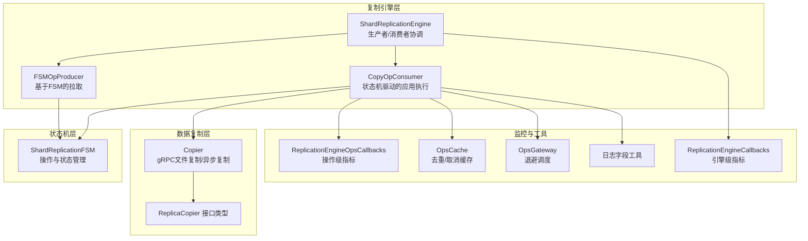
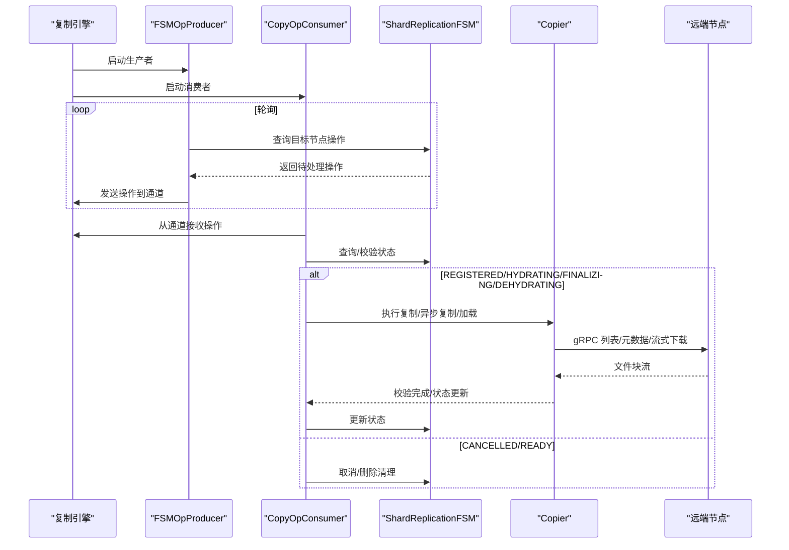
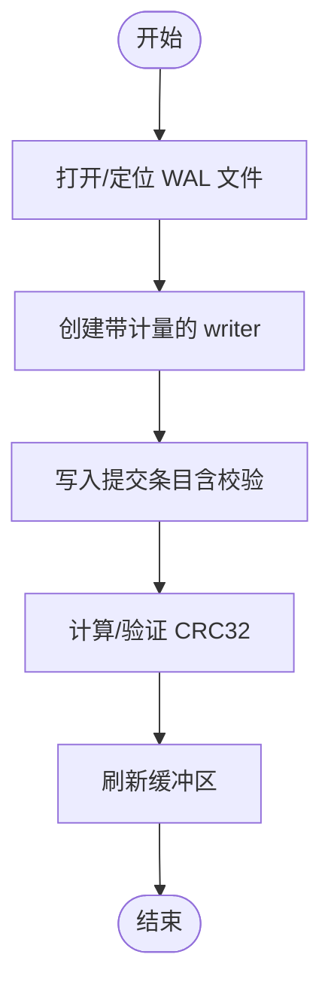
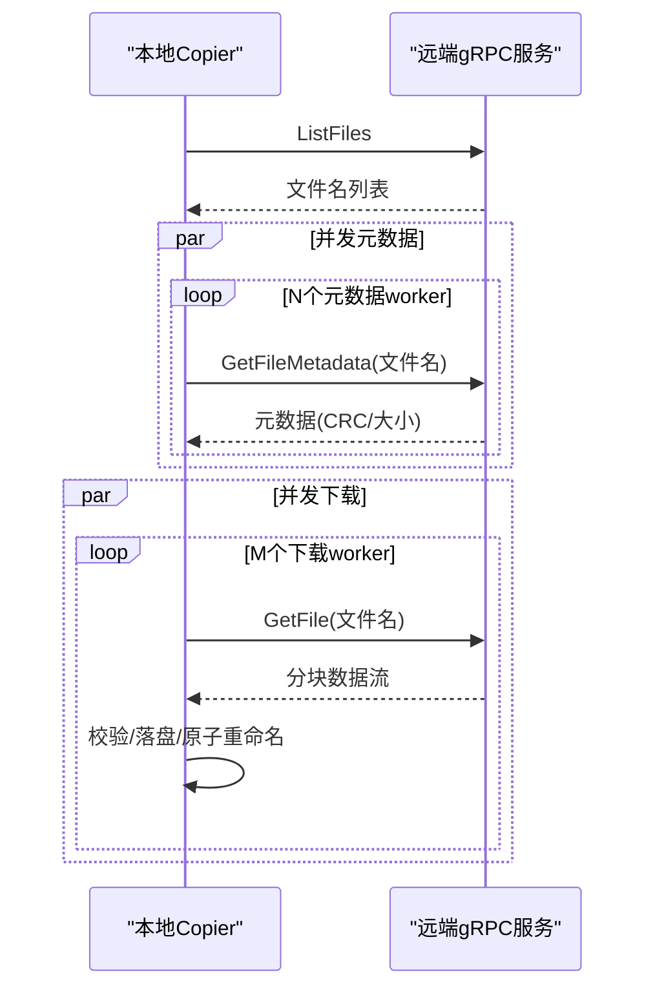
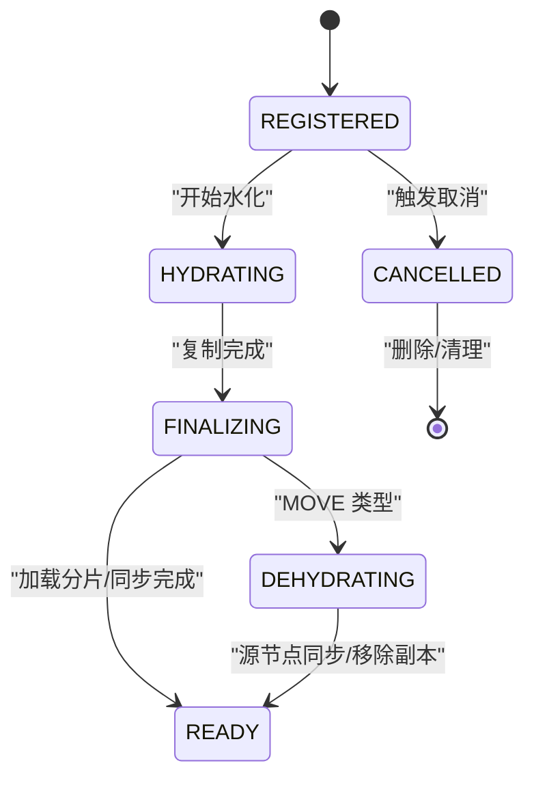
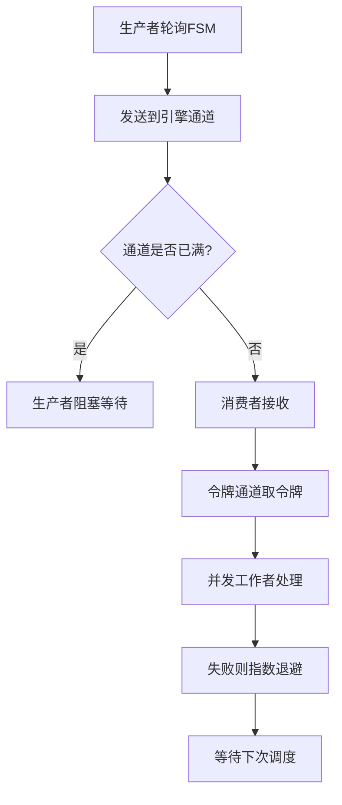
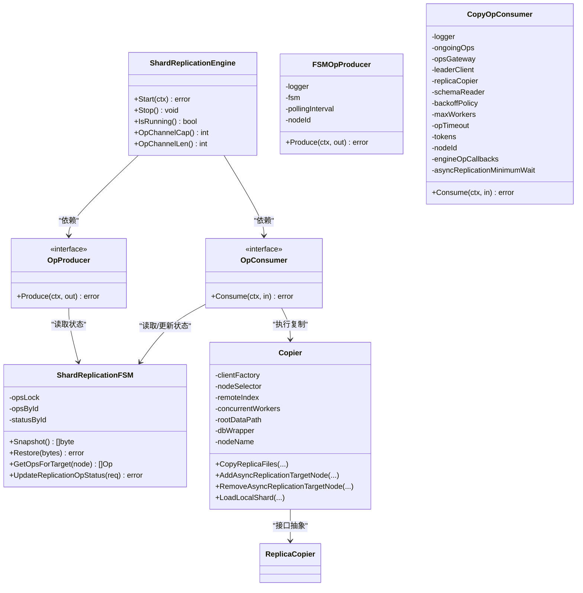

# 复制管道

<cite>
**本文引用的文件**
- [cluster/replication/shard_replication_engine.go](file://cluster/replication/shard_replication_engine.go)
- [cluster/replication/producer.go](file://cluster/replication/producer.go)
- [cluster/replication/consumer.go](file://cluster/replication/consumer.go)
- [cluster/replication/shard_replication_fsm.go](file://cluster/replication/shard_replication_fsm.go)
- [cluster/replication/shard_replication_apply.go](file://cluster/replication/shard_replication_apply.go)
- [cluster/replication/metrics/metrics.go](file://cluster/replication/metrics/metrics.go)
- [cluster/replication/consumer_ops_cache.go](file://cluster/replication/consumer_ops_cache.go)
- [cluster/replication/consumer_ops_gateway.go](file://cluster/replication/consumer_ops_gateway.go)
- [cluster/replication/copier/copier.go](file://cluster/replication/copier/copier.go)
- [cluster/replication/copier/types/types.go](file://cluster/replication/copier/types/types.go)
- [adapters/repos/db/lsmkv/commitlogger.go](file://adapters/repos/db/lsmkv/commitlogger.go)
- [adapters/repos/db/metrics.go](file://adapters/repos/db/metrics.go)
- [usecases/replica/metrics.go](file://usecases/replica/metrics.go)
- [cluster/replication/utils.go](file://cluster/replication/utils.go)
</cite>

## 目录
1. [简介](#简介)
2. [项目结构](#项目结构)
3. [核心组件](#核心组件)
4. [架构总览](#架构总览)
5. [详细组件分析](#详细组件分析)
6. [依赖关系分析](#依赖关系分析)
7. [性能考量](#性能考量)
8. [故障排查指南](#故障排查指南)
9. [结论](#结论)
10. [附录](#附录)

## 简介
本文件面向 Weaviate 的复制管道系统，围绕“数据捕获—传输—应用”三阶段进行技术性解析，覆盖以下主题：
- 数据捕获：WAL（预写日志）记录与变更事件捕获流程
- 数据传输：序列化、网络传输、并发与背压控制
- 数据应用：反序列化、顺序保证、冲突解决策略
- 缓冲与背压：通道容量、令牌限流、网关退避
- 性能监控与调优：指标体系与观测建议
- 故障检测、重连与一致性保障：状态机、超时与幂等处理

## 项目结构
复制管道位于集群模块的 replication 子系统中，采用生产者-消费者模型，结合有限缓冲通道与工作池实现背压与并行处理；数据复制通过 gRPC 客户端从源节点拉取文件并校验完整性；状态机负责操作生命周期管理与读写过滤。

图示来源
- [cluster/replication/shard_replication_engine.go](file://cluster/replication/shard_replication_engine.go#L111-L133)
- [cluster/replication/producer.go](file://cluster/replication/producer.go#L29-L51)
- [cluster/replication/consumer.go](file://cluster/replication/consumer.go#L62-L114)
- [cluster/replication/shard_replication_fsm.go](file://cluster/replication/shard_replication_fsm.go#L61-L106)
- [cluster/replication/copier/copier.go](file://cluster/replication/copier/copier.go#L46-L83)
- [cluster/replication/metrics/metrics.go](file://cluster/replication/metrics/metrics.go#L19-L106)

章节来源
- [cluster/replication/shard_replication_engine.go](file://cluster/replication/shard_replication_engine.go#L32-L133)
- [cluster/replication/producer.go](file://cluster/replication/producer.go#L21-L51)
- [cluster/replication/consumer.go](file://cluster/replication/consumer.go#L48-L114)
- [cluster/replication/shard_replication_fsm.go](file://cluster/replication/shard_replication_fsm.go#L27-L106)
- [cluster/replication/metrics/metrics.go](file://cluster/replication/metrics/metrics.go#L142-L228)

## 核心组件
- 复制引擎（ShardReplicationEngine）
  - 负责启动/停止生产者与消费者，协调生命周期，提供背压与可观测性回调
- 生产者（FSMOpProducer）
  - 周期性轮询 FSM 获取分配给当前节点的操作，发送到通道
- 消费者（CopyOpConsumer）
  - 基于状态机驱动的状态转换，执行复制、异步复制、加载分片、更新分片状态
- 状态机（ShardReplicationFSM）
  - 维护操作与状态映射、快照/恢复、读写过滤
- 复制器（Copier）
  - 通过 gRPC 列表/元数据/流式下载文件，校验 CRC32 并落盘；管理本地/远端异步复制配置
- 监控（ReplicationEngineOpsCallbacks/ReplicationEngineCallbacks）
  - 提供操作级与引擎级指标回调，支持 Prometheus 指标注册
- 工具（OpsCache/OpsGateway/日志工具）
  - 去重/取消缓存、退避调度、日志字段拼装

章节来源
- [cluster/replication/shard_replication_engine.go](file://cluster/replication/shard_replication_engine.go#L48-L133)
- [cluster/replication/producer.go](file://cluster/replication/producer.go#L21-L132)
- [cluster/replication/consumer.go](file://cluster/replication/consumer.go#L48-L175)
- [cluster/replication/shard_replication_fsm.go](file://cluster/replication/shard_replication_fsm.go#L61-L106)
- [cluster/replication/copier/copier.go](file://cluster/replication/copier/copier.go#L46-L83)
- [cluster/replication/metrics/metrics.go](file://cluster/replication/metrics/metrics.go#L19-L106)
- [cluster/replication/consumer_ops_cache.go](file://cluster/replication/consumer_ops_cache.go#L19-L107)
- [cluster/replication/consumer_ops_gateway.go](file://cluster/replication/consumer_ops_gateway.go#L26-L105)
- [cluster/replication/utils.go](file://cluster/replication/utils.go#L16-L39)

## 架构总览
复制管道以“引擎—生产者—消费者—状态机—复制器”的链路组织，形成如下闭环：
- 引擎通过通道连接生产者与消费者，限制并发与在制品数量
- 生产者从 FSM 拉取目标节点相关的操作，按轮询间隔推送
- 消费者根据状态机状态执行具体动作（复制文件、启动/停止异步复制、更新分片状态）
- 复制器通过 gRPC 与远端节点交互，确保数据一致性与完整性
- 监控回调贯穿引擎与操作生命周期，提供可观测性

图示来源
- [cluster/replication/shard_replication_engine.go](file://cluster/replication/shard_replication_engine.go#L135-L218)
- [cluster/replication/producer.go](file://cluster/replication/producer.go#L67-L103)
- [cluster/replication/consumer.go](file://cluster/replication/consumer.go#L179-L339)
- [cluster/replication/shard_replication_fsm.go](file://cluster/replication/shard_replication_fsm.go#L108-L146)
- [cluster/replication/copier/copier.go](file://cluster/replication/copier/copier.go#L85-L185)

## 详细组件分析

### 数据捕获机制（WAL 记录与变更事件）
- WAL（预写日志）记录
  - 在 LSMKV 层实现 commitlogger，负责写入 WAL、校验和计算与计量
  - 写入路径包含文件句柄、缓冲写入器、带计量的 writer，以及 CRC32 校验
- 变更事件捕获
  - 复制管道中的“变更事件”由 FSM 管理，复制引擎通过生产者周期性从 FSM 拉取目标节点的操作
  - 生产者在轮询期间仅推送处于可消费状态的操作，并尊重通道背压

图示来源
- [adapters/repos/db/lsmkv/commitlogger.go](file://adapters/repos/db/lsmkv/commitlogger.go#L248-L301)

章节来源
- [adapters/repos/db/lsmkv/commitlogger.go](file://adapters/repos/db/lsmkv/commitlogger.go#L248-L301)
- [cluster/replication/producer.go](file://cluster/replication/producer.go#L67-L103)
- [cluster/replication/shard_replication_fsm.go](file://cluster/replication/shard_replication_fsm.go#L108-L146)

### 数据传输管道（序列化、网络传输、流控制）
- 序列化与传输
  - 复制器通过 gRPC 客户端与远端节点交互：先列出文件名，再并发获取元数据，最后并发下载文件块
  - 下载阶段使用临时文件 + 校验和 + 原子重命名，确保一致性
- 流控制与并发
  - 使用固定大小的文件名通道与元数据通道，避免无界增长
  - 元数据与下载阶段均使用工作池（goroutine 数量受控），并通过错误组聚合错误
- 背压与一致性
  - 源节点在复制前暂停文件活动，复制后恢复，降低并发写入对一致性的影响

图示来源
- [cluster/replication/copier/copier.go](file://cluster/replication/copier/copier.go#L85-L185)
- [cluster/replication/copier/copier.go](file://cluster/replication/copier/copier.go#L254-L379)

章节来源
- [cluster/replication/copier/copier.go](file://cluster/replication/copier/copier.go#L85-L185)
- [cluster/replication/copier/copier.go](file://cluster/replication/copier/copier.go#L254-L379)

### 数据应用阶段（反序列化、顺序保证、冲突解决）
- 反序列化与应用
  - 消费者根据状态机状态执行不同动作：注册/水化/最终化/脱水/取消
  - 水化阶段复制文件，最终化阶段加载本地分片并启动/停止异步复制，脱水阶段在源节点同步并移除副本
- 顺序保证
  - 通过状态机状态转换保证严格顺序：REGISTERED → HYDRATING → FINALIZING → READY 或 DEHYDRATING
  - 每一步完成后才更新状态机，避免并发状态不一致
- 冲突解决
  - 对同一 FQDN 的目标/源副本存在互斥规则：MOVE 与其他操作互斥，COPY 可并行但需检查现有状态
  - 操作去重：通过 OpsCache 避免重复执行；取消信号通过 OpsCache 传播至工作池

图示来源
- [cluster/replication/consumer.go](file://cluster/replication/consumer.go#L341-L439)
- [cluster/replication/shard_replication_fsm.go](file://cluster/replication/shard_replication_fsm.go#L261-L275)

章节来源
- [cluster/replication/consumer.go](file://cluster/replication/consumer.go#L341-L439)
- [cluster/replication/shard_replication_fsm.go](file://cluster/replication/shard_replication_fsm.go#L261-L275)
- [cluster/replication/consumer_ops_cache.go](file://cluster/replication/consumer_ops_cache.go#L19-L107)

### 缓冲机制与背压控制（内存与流量整形）
- 引擎缓冲
  - 引擎内部通道容量由 opBufferSize 控制，阻塞生产者以保护消费者
  - 提供 OpChannelCap/OpChannelLen 用于观测背压
- 消费者限流
  - 令牌通道限制最大并发工作者数，避免资源耗尽
  - OpsGateway 基于指数退避控制同一流水线的再次调度时间，缓解瞬时拥塞
- 网络层背压
  - gRPC 客户端侧使用固定大小的通道与工作池，避免内存膨胀
  - 源节点暂停文件活动，减少并发写入带来的竞争

图示来源
- [cluster/replication/shard_replication_engine.go](file://cluster/replication/shard_replication_engine.go#L247-L260)
- [cluster/replication/consumer.go](file://cluster/replication/consumer.go#L93-L104)
- [cluster/replication/consumer_ops_gateway.go](file://cluster/replication/consumer_ops_gateway.go#L56-L105)

章节来源
- [cluster/replication/shard_replication_engine.go](file://cluster/replication/shard_replication_engine.go#L247-L260)
- [cluster/replication/consumer.go](file://cluster/replication/consumer.go#L93-L104)
- [cluster/replication/consumer_ops_gateway.go](file://cluster/replication/consumer_ops_gateway.go#L56-L105)

### 性能监控指标与调优
- 操作级指标（ReplicationEngineOpsCallbacks）
  - pending/ongoing gauges 与 complete/failed/cancelled counters，按节点标签区分
  - 生命周期：注册为 pending → 开始为 ongoing → 成功/失败/取消分别更新 ongoing 与对应 counter
- 引擎级指标（ReplicationEngineCallbacks）
  - 引擎、生产者、消费者的运行状态 gauge，便于快速判断组件健康
- 数据库与异步复制指标
  - 异步复制迭代次数、耗时、对象计数、哈希树差异耗时等
  - 协议层指标：文件 IO 写入次数与字节计量
- 调优建议
  - 根据通道长度与 pending/ongoing 指标调整 opBufferSize 与 maxWorkers
  - 观察异步复制耗时直方图，优化源节点暂停窗口与并发度
  - 结合 WAL 写入计量评估磁盘 I/O 峰值

章节来源
- [cluster/replication/metrics/metrics.go](file://cluster/replication/metrics/metrics.go#L142-L228)
- [cluster/replication/metrics/metrics.go](file://cluster/replication/metrics/metrics.go#L338-L380)
- [adapters/repos/db/metrics.go](file://adapters/repos/db/metrics.go#L46-L86)
- [adapters/repos/db/lsmkv/commitlogger.go](file://adapters/repos/db/lsmkv/commitlogger.go#L258-L267)

### 故障检测、重连与一致性保障
- 故障检测
  - 消费者在状态转换失败时注册错误到 FSM，并通过指数退避重试
  - 异步复制状态查询失败时进行有限次重试，超过阈值后永久失败
- 重连与超时
  - gRPC 客户端工厂按节点地址创建连接；下载阶段设置超时上下文
  - 源节点暂停/恢复文件活动，降低并发写入导致的数据竞争
- 一致性保障
  - 文件下载后进行 CRC32 校验，失败则丢弃临时文件
  - 加载本地分片前等待模式版本更新，确保 schema 一致性
  - 读写过滤：根据 FSM 状态动态决定可用副本（如 FINALIZING 时允许写入）

章节来源
- [cluster/replication/consumer.go](file://cluster/replication/consumer.go#L380-L439)
- [cluster/replication/consumer.go](file://cluster/replication/consumer.go#L766-L805)
- [cluster/replication/copier/copier.go](file://cluster/replication/copier/copier.go#L99-L111)
- [cluster/replication/copier/copier.go](file://cluster/replication/copier/copier.go#L279-L379)
- [cluster/replication/shard_replication_fsm.go](file://cluster/replication/shard_replication_fsm.go#L302-L330)

## 依赖关系分析

图示来源
- [cluster/replication/shard_replication_engine.go](file://cluster/replication/shard_replication_engine.go#L48-L133)
- [cluster/replication/producer.go](file://cluster/replication/producer.go#L21-L51)
- [cluster/replication/consumer.go](file://cluster/replication/consumer.go#L48-L114)
- [cluster/replication/shard_replication_fsm.go](file://cluster/replication/shard_replication_fsm.go#L61-L106)
- [cluster/replication/copier/copier.go](file://cluster/replication/copier/copier.go#L46-L83)

章节来源
- [cluster/replication/shard_replication_engine.go](file://cluster/replication/shard_replication_engine.go#L48-L133)
- [cluster/replication/producer.go](file://cluster/replication/producer.go#L21-L51)
- [cluster/replication/consumer.go](file://cluster/replication/consumer.go#L48-L114)
- [cluster/replication/shard_replication_fsm.go](file://cluster/replication/shard_replication_fsm.go#L61-L106)
- [cluster/replication/copier/copier.go](file://cluster/replication/copier/copier.go#L46-L83)

## 性能考量
- 并发与背压
  - 合理设置 opBufferSize 与 maxWorkers，避免通道过小导致生产者频繁阻塞或过大导致内存占用过高
  - 通过 OpsGateway 的指数退避降低热点操作的抖动
- I/O 与网络
  - WAL 写入采用缓冲与计量，关注磁盘写入延迟与吞吐
  - gRPC 下载阶段使用 CPU 限制的错误组，避免过度并发造成磁盘争用
- 异步复制
  - 通过最小等待时间与上限时间边界，平衡一致性与延迟
  - 关注异步复制耗时直方图，识别慢节点与网络瓶颈

## 故障排查指南
- 常见问题定位
  - 操作长时间 pending：检查引擎通道长度与消费者工作池饱和度
  - 失败率上升：查看操作级失败计数与状态转换错误注册
  - 复制卡住：检查 gRPC 下载通道与 CRC32 校验失败日志
- 快速恢复
  - 通过取消/删除接口清理异常状态，重新进入状态机循环
  - 观察异步复制状态查询失败次数，必要时增大重试上限或缩短轮询间隔

章节来源
- [cluster/replication/metrics/metrics.go](file://cluster/replication/metrics/metrics.go#L142-L228)
- [cluster/replication/consumer.go](file://cluster/replication/consumer.go#L766-L805)
- [cluster/replication/shard_replication_apply.go](file://cluster/replication/shard_replication_apply.go#L185-L240)

## 结论
Weaviate 的复制管道通过生产者-消费者模型与状态机驱动，实现了高可靠、可观测、可扩展的跨节点数据复制能力。WAL 记录与文件级校验确保数据一致性，gRPC 并发下载与指数退避提供稳定的传输体验。通过完善的指标体系与错误处理策略，系统能够在复杂场景下保持稳定与可维护性。

## 附录
- 日志字段工具：统一输出操作与状态字段，便于审计与排障
- 接口抽象：ReplicaCopier 抽象屏蔽底层实现细节，便于替换与测试

章节来源
- [cluster/replication/utils.go](file://cluster/replication/utils.go#L16-L39)
- [cluster/replication/copier/types/types.go](file://cluster/replication/copier/types/types.go#L23-L50)