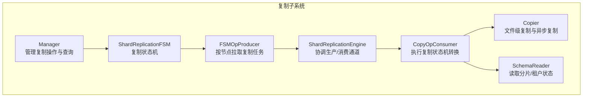
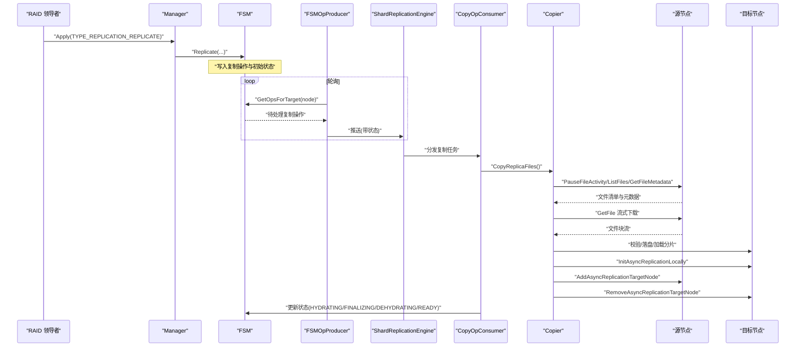
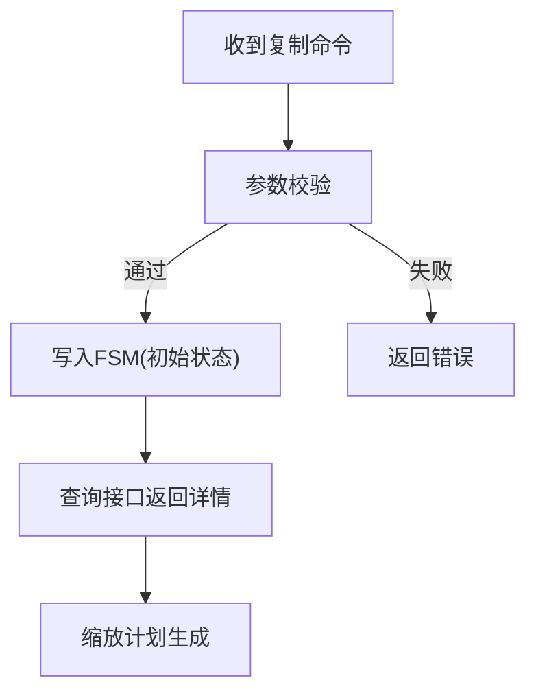
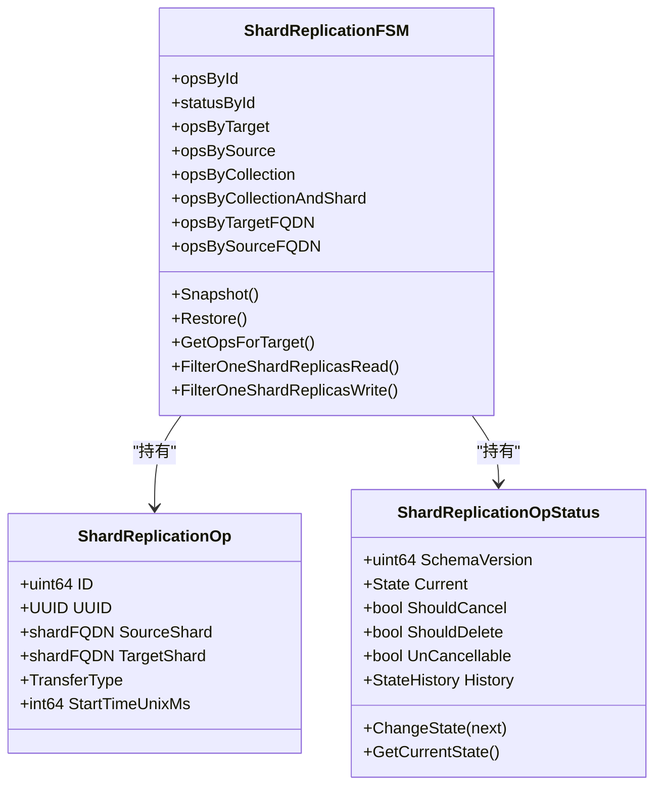
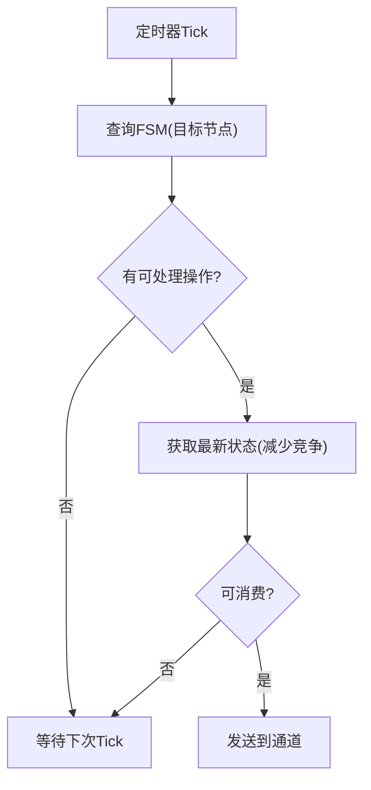
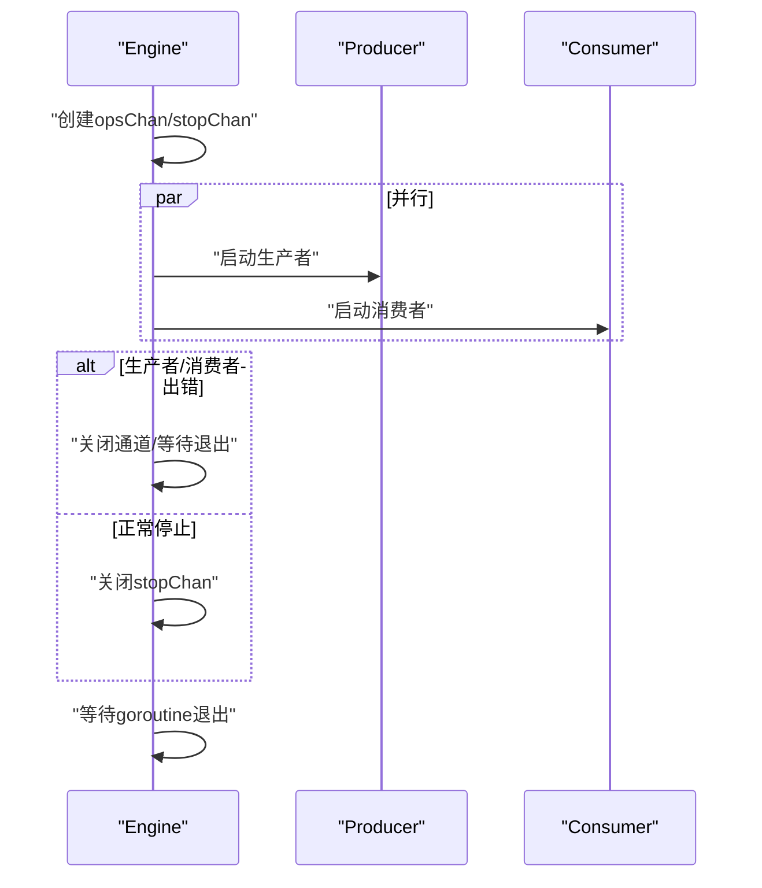
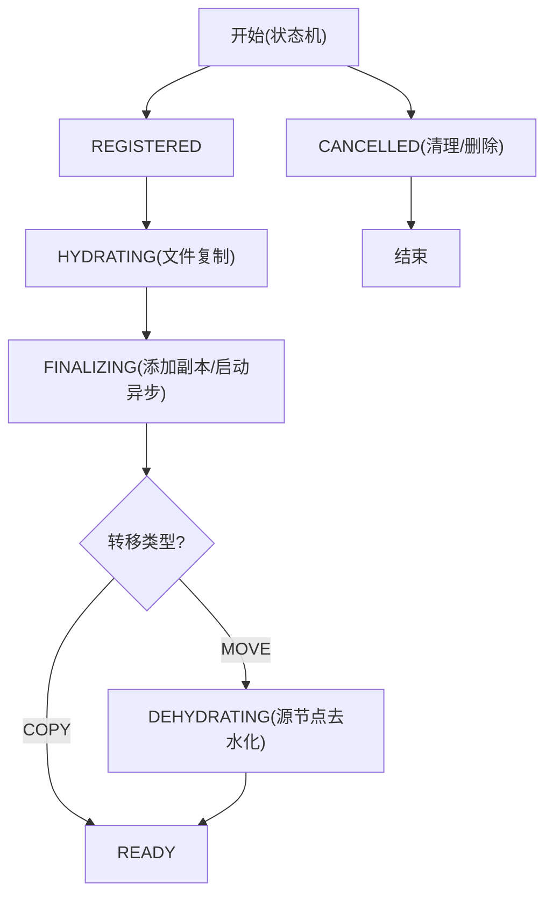
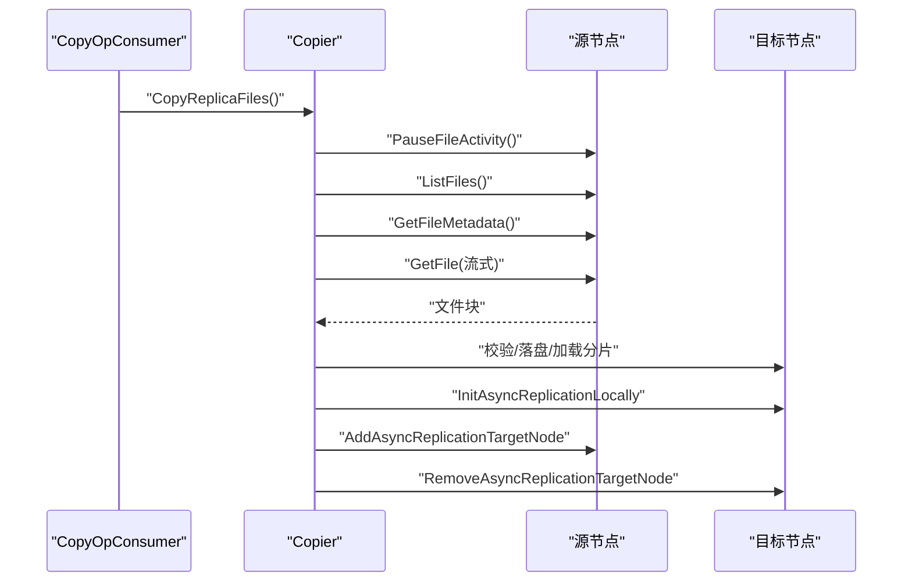
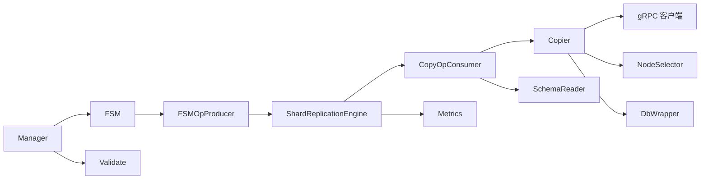

# 数据复制

<cite>
**本文引用的文件**
- [manager.go](file://cluster/replication/manager.go)
- [producer.go](file://cluster/replication/producer.go)
- [consumer.go](file://cluster/replication/consumer.go)
- [shard_replication_engine.go](file://cluster/replication/shard_replication_engine.go)
- [shard_replication_fsm.go](file://cluster/replication/shard_replication_fsm.go)
- [shard_replication_op_state.go](file://cluster/replication/shard_replication_op_state.go)
- [validate.go](file://cluster/replication/validate.go)
- [utils.go](file://cluster/replication/utils.go)
- [copier.go](file://cluster/replication/copier/copier.go)
- [metrics.go](file://cluster/replication/metrics/metrics.go)
- [message.proto](file://cluster/proto/api/message.proto)
- [client.go](file://adapters/clients/client.go)
</cite>

## 目录
1. [引言](#引言)
2. [项目结构](#项目结构)
3. [核心组件](#核心组件)
4. [架构总览](#架构总览)
5. [详细组件分析](#详细组件分析)
6. [依赖关系分析](#依赖关系分析)
7. [性能考量](#性能考量)
8. [故障排查指南](#故障排查指南)
9. [结论](#结论)
10. [附录](#附录)

## 引言
本技术文档围绕 Weaviate 的数据复制系统展开，重点解释其主从复制机制与异步复制策略，覆盖从数据捕获、传输到应用的完整复制管道；阐述复制一致性、延迟控制、冲突解决与数据完整性校验；说明复制监控与健康检查（进度跟踪、故障检测）；并给出配置优化、性能调优与故障恢复策略，以及多数据中心部署与灾难恢复的实践建议。

## 项目结构
Weaviate 的复制子系统位于 cluster/replication 目录，采用“状态机 + 生产者-消费者引擎”的架构模式，结合 gRPC 文件传输与异步复制，实现跨节点的分片副本复制与一致性维护。

图表来源
- [manager.go](file://cluster/replication/manager.go#L35-L637)
- [shard_replication_fsm.go](file://cluster/replication/shard_replication_fsm.go#L61-L405)
- [producer.go](file://cluster/replication/producer.go#L31-L132)
- [shard_replication_engine.go](file://cluster/replication/shard_replication_engine.go#L48-L271)
- [consumer.go](file://cluster/replication/consumer.go#L65-L868)
- [copier.go](file://cluster/replication/copier/copier.go#L47-L576)

章节来源
- [manager.go](file://cluster/replication/manager.go#L35-L637)
- [shard_replication_fsm.go](file://cluster/replication/shard_replication_fsm.go#L61-L405)
- [producer.go](file://cluster/replication/producer.go#L31-L132)
- [shard_replication_engine.go](file://cluster/replication/shard_replication_engine.go#L48-L271)
- [consumer.go](file://cluster/replication/consumer.go#L65-L868)
- [copier.go](file://cluster/replication/copier/copier.go#L47-L576)

## 核心组件
- 管理器（Manager）：接收来自集群 RAFT 的复制命令，进行参数校验与状态机写入，并提供复制详情查询与缩放计划生成。
- 复制状态机（ShardReplicationFSM）：持久化存储复制操作及其状态历史，支持快照/恢复、按目标/源/集合/分片维度检索。
- 生产者（FSMOpProducer）：周期性从状态机拉取分配给当前节点的任务，基于时间轮询与背压通道推送至消费端。
- 引擎（ShardReplicationEngine）：协调生产者与消费者生命周期，提供优雅停机、并发度与缓冲区控制。
- 消费者（CopyOpConsumer）：根据状态机推进复制状态（注册→水化→最终化→去水化→就绪/取消），执行文件复制、异步复制启停、分片加载与一致性同步。
- 复制器（Copier）：通过 gRPC 列表/元数据/流式下载文件，本地落盘校验，支持异步复制的本地初始化/回滚与远端目标节点添加/移除。
- 度量与回调（metrics）：提供复制引擎与操作级别的 Prometheus 指标回调，便于观测与告警。
- 协议与客户端（message.proto, client.go）：定义复制相关 Apply/Query 类型与重试客户端，保障跨节点通信的可靠性。

章节来源
- [manager.go](file://cluster/replication/manager.go#L35-L637)
- [shard_replication_fsm.go](file://cluster/replication/shard_replication_fsm.go#L61-L405)
- [producer.go](file://cluster/replication/producer.go#L31-L132)
- [shard_replication_engine.go](file://cluster/replication/shard_replication_engine.go#L48-L271)
- [consumer.go](file://cluster/replication/consumer.go#L65-L868)
- [copier.go](file://cluster/replication/copier/copier.go#L47-L576)
- [metrics.go](file://cluster/replication/metrics/metrics.go#L19-L380)
- [message.proto](file://cluster/proto/api/message.proto#L39-L156)
- [client.go](file://adapters/clients/client.go#L26-L129)

## 架构总览
Weaviate 的复制采用“领导者-追随者”模型：复制操作由 RAFT 领导者发起，状态机记录在各节点；每个节点以“拉取”方式处理分配给自身的复制任务。复制过程分为两类：
- 同步阶段：文件级复制（暂停源节点文件活动、列举文件、元数据获取、并发下载、校验与落盘）。
- 异步阶段：在目标节点开启异步复制，确保复制窗口内的增量变更被传播，最终完成一致性收敛。

图表来源
- [manager.go](file://cluster/replication/manager.go#L62-L75)
- [producer.go](file://cluster/replication/producer.go#L73-L102)
- [shard_replication_engine.go](file://cluster/replication/shard_replication_engine.go#L144-L218)
- [consumer.go](file://cluster/replication/consumer.go#L341-L439)
- [copier.go](file://cluster/replication/copier/copier.go#L85-L185)

章节来源
- [manager.go](file://cluster/replication/manager.go#L62-L75)
- [producer.go](file://cluster/replication/producer.go#L73-L102)
- [shard_replication_engine.go](file://cluster/replication/shard_replication_engine.go#L144-L218)
- [consumer.go](file://cluster/replication/consumer.go#L341-L439)
- [copier.go](file://cluster/replication/copier/copier.go#L85-L185)

## 详细组件分析

### 管理器（Manager）
职责
- 接收复制命令（复制/取消/删除/缩放等），进行参数校验与状态机写入。
- 提供复制详情查询（按 UUID/集合/分片/目标节点/全量）。
- 生成复制缩放计划（基于当前/期望分片副本分布，选择源节点与目标节点映射）。

关键流程
- 命令解包与校验：对复制请求进行集合存在性、源/目标节点合法性、副本是否已存在等校验。
- 状态机写入：将复制操作写入 FSM，并记录初始状态。
- 查询接口：按多种维度返回复制操作的当前状态与历史。

图表来源
- [manager.go](file://cluster/replication/manager.go#L62-L75)
- [validate.go](file://cluster/replication/validate.go#L29-L67)
- [manager.go](file://cluster/replication/manager.go#L337-L436)

章节来源
- [manager.go](file://cluster/replication/manager.go#L62-L75)
- [validate.go](file://cluster/replication/validate.go#L29-L67)
- [manager.go](file://cluster/replication/manager.go#L337-L436)

### 复制状态机（ShardReplicationFSM）
职责
- 存储复制操作（含源/目标分片、转移类型、开始时间）与状态历史。
- 支持快照/恢复，便于引擎重启后恢复运行状态。
- 提供多维索引：按目标节点、源节点、集合、集合+分片、FQDN 等快速检索。
- 过滤读写可用副本：在复制过程中动态调整可读/可写的副本集合。

图表来源
- [shard_replication_fsm.go](file://cluster/replication/shard_replication_fsm.go#L27-L84)
- [shard_replication_op_state.go](file://cluster/replication/shard_replication_op_state.go#L87-L107)
- [shard_replication_fsm.go](file://cluster/replication/shard_replication_fsm.go#L61-L405)

章节来源
- [shard_replication_fsm.go](file://cluster/replication/shard_replication_fsm.go#L61-L405)
- [shard_replication_op_state.go](file://cluster/replication/shard_replication_op_state.go#L87-L107)

### 生产者（FSMOpProducer）
职责
- 周期性轮询状态机，筛选分配给当前节点的复制操作。
- 使用带缓冲通道作为背压机制，避免消费者过载。
- 在负载高时“丢弃”部分 tick，实现自适应节流。

图表来源
- [producer.go](file://cluster/replication/producer.go#L73-L102)
- [producer.go](file://cluster/replication/producer.go#L119-L131)

章节来源
- [producer.go](file://cluster/replication/producer.go#L73-L102)
- [producer.go](file://cluster/replication/producer.go#L119-L131)

### 引擎（ShardReplicationEngine）
职责
- 统一启动/停止生产者与消费者，协调通道与错误传播。
- 控制最大并发工作线程数与通道容量，实现背压与资源保护。
- 提供运行状态指标与通道长度/容量观测。

图表来源
- [shard_replication_engine.go](file://cluster/replication/shard_replication_engine.go#L144-L218)

章节来源
- [shard_replication_engine.go](file://cluster/replication/shard_replication_engine.go#L144-L218)

### 消费者（CopyOpConsumer）
职责
- 根据当前状态机推进复制状态：REGISTERED → HYDRATING → FINALIZING → DEHYDRATING → READY/CANCELLED。
- 执行文件复制、异步复制启停、分片加载与一致性同步。
- 支持超时、重试、取消与删除清理，保证幂等与最终一致性。

状态机推进流程

图表来源
- [consumer.go](file://cluster/replication/consumer.go#L341-L439)
- [consumer.go](file://cluster/replication/consumer.go#L527-L764)

章节来源
- [consumer.go](file://cluster/replication/consumer.go#L341-L439)
- [consumer.go](file://cluster/replication/consumer.go#L527-L764)

### 复制器（Copier）
职责
- 通过 gRPC 完成文件级复制：暂停源节点文件活动、列举文件、元数据获取、并发下载、校验与落盘。
- 管理异步复制：在目标节点初始化异步复制，在源节点添加/移除目标节点覆盖，必要时回滚。
- 加载本地分片并进行目录 fsync 保证落盘一致性。

图表来源
- [copier.go](file://cluster/replication/copier/copier.go#L85-L185)
- [copier.go](file://cluster/replication/copier/copier.go#L462-L496)

章节来源
- [copier.go](file://cluster/replication/copier/copier.go#L85-L185)
- [copier.go](file://cluster/replication/copier/copier.go#L462-L496)

### 协议与客户端
- 协议（message.proto）：定义 Apply/Query 类型，包含复制相关命令（复制、更新状态、注册错误、取消、删除、缩放计划等）。
- 客户端（client.go）：封装 HTTP 重试逻辑，统一错误分类与退避策略，提升跨节点调用的稳定性。

章节来源
- [message.proto](file://cluster/proto/api/message.proto#L39-L156)
- [client.go](file://adapters/clients/client.go#L26-L129)

## 依赖关系分析
- 管理器依赖状态机与模式校验模块，负责命令入口与查询出口。
- 生产者依赖状态机与节点标识，负责任务拉取与背压。
- 引擎协调生产者与消费者，提供生命周期与可观测性。
- 消费者依赖复制器与模式读取器，负责状态推进与一致性维护。
- 复制器依赖 gRPC 客户端工厂、节点选择器与数据库包装器，完成文件传输与异步复制管理。
- 度量模块为引擎与操作提供 Prometheus 回调，形成闭环监控。

图表来源
- [manager.go](file://cluster/replication/manager.go#L35-L637)
- [validate.go](file://cluster/replication/validate.go#L29-L67)
- [producer.go](file://cluster/replication/producer.go#L31-L132)
- [shard_replication_engine.go](file://cluster/replication/shard_replication_engine.go#L48-L271)
- [consumer.go](file://cluster/replication/consumer.go#L65-L868)
- [copier.go](file://cluster/replication/copier/copier.go#L47-L576)
- [metrics.go](file://cluster/replication/metrics/metrics.go#L19-L380)

章节来源
- [manager.go](file://cluster/replication/manager.go#L35-L637)
- [validate.go](file://cluster/replication/validate.go#L29-L67)
- [producer.go](file://cluster/replication/producer.go#L31-L132)
- [shard_replication_engine.go](file://cluster/replication/shard_replication_engine.go#L48-L271)
- [consumer.go](file://cluster/replication/consumer.go#L65-L868)
- [copier.go](file://cluster/replication/copier/copier.go#L47-L576)
- [metrics.go](file://cluster/replication/metrics/metrics.go#L19-L380)

## 性能考量
- 并发与背压
  - 引擎通道容量与最大工作线程数共同决定吞吐上限；通道满时生产者阻塞，自然实现背压。
  - 消费者使用令牌通道限制并发，避免资源争用导致抖动。
- 文件复制效率
  - 元数据与下载双通道并发，提高带宽利用率；本地文件 CRC 校验确保一致性。
  - 下载前预分配文件大小，降低碎片写入开销。
- 异步复制窗口
  - 通过上界时间戳与最小等待时间，平衡复制窗口内增量传播与最终一致性收敛。
- 指标与可观测性
  - Pending/Ongoing/Complete/Failed/Cancelled 操作计数与引擎运行状态指标，便于容量规划与异常定位。

章节来源
- [shard_replication_engine.go](file://cluster/replication/shard_replication_engine.go#L70-L104)
- [consumer.go](file://cluster/replication/consumer.go#L177-L339)
- [copier.go](file://cluster/replication/copier/copier.go#L140-L185)
- [metrics.go](file://cluster/replication/metrics/metrics.go#L142-L228)

## 故障排查指南
- 常见错误与处理
  - 参数非法：校验失败时返回“坏请求”，需检查集合/分片/节点合法性。
  - 已存在/未找到：目标副本已存在或源副本缺失时，需先清理或确认分片状态。
  - 最大错误数：单状态错误超过阈值会触发终止，需查看历史错误定位根因。
- 取消与删除
  - 支持仅取消（保留状态）、取消并删除（彻底清理），消费者在适当时机执行清理与回滚。
- 异步复制状态
  - 通过异步复制状态轮询与错误容忍策略，逐步定位初始化耗时或网络问题。
- 通道与背压
  - 观察引擎通道长度/容量，若长期接近上限，应考虑增大通道容量或降低并发。

章节来源
- [validate.go](file://cluster/replication/validate.go#L29-L67)
- [shard_replication_op_state.go](file://cluster/replication/shard_replication_op_state.go#L23-L27)
- [consumer.go](file://cluster/replication/consumer.go#L441-L484)
- [consumer.go](file://cluster/replication/consumer.go#L766-L785)
- [shard_replication_engine.go](file://cluster/replication/shard_replication_engine.go#L247-L260)

## 结论
Weaviate 的复制系统通过状态机驱动的生产者-消费者引擎，结合文件级复制与异步复制，实现了跨节点的可靠分片副本管理。系统具备完善的监控与可观测性、灵活的缩放计划与容错机制，适合在多数据中心与复杂网络条件下稳定运行。通过合理的配置与调优，可在保证一致性的前提下获得良好的性能表现。

## 附录
- 复制一致性与延迟
  - 一致性：通过状态机推进与分片加载/同步，确保目标节点与源节点状态一致。
  - 延迟：文件复制阶段为主，异步复制阶段用于收敛增量；可通过并发与网络优化降低整体延迟。
- 冲突解决与数据完整性
  - 冲突：异步复制通过上界时间戳与最小等待时间避免重复写入；最终化阶段强制等待版本收敛。
  - 完整性：CRC 校验与 fsync 保证落盘一致性。
- 监控与健康检查
  - 指标：Pending/Ongoing/Complete/Failed/Cancelled 操作计数与引擎运行状态。
  - 健康：通道长度/容量、异步复制状态轮询、错误计数与最大错误阈值。
- 配置优化与调优
  - 并发：根据 CPU/IO 能力设置最大工作线程数；通道容量与轮询间隔平衡吞吐与延迟。
  - 网络：合理设置异步复制最小等待时间与上界时间戳，适应不同 RTT 场景。
- 故障恢复策略
  - 重启恢复：状态机快照/恢复，引擎重启后继续处理未完成任务。
  - 取消/删除：支持细粒度清理，避免悬挂状态。
- 多数据中心与灾难恢复
  - 缩放计划：基于当前/期望副本分布生成迁移路径，自动选择源节点。
  - DR：通过复制与异步复制实现跨数据中心数据冗余，结合备份与恢复演练验证 RTO/RPO。

章节来源
- [manager.go](file://cluster/replication/manager.go#L337-L436)
- [consumer.go](file://cluster/replication/consumer.go#L593-L746)
- [copier.go](file://cluster/replication/copier/copier.go#L498-L532)
- [metrics.go](file://cluster/replication/metrics/metrics.go#L142-L380)