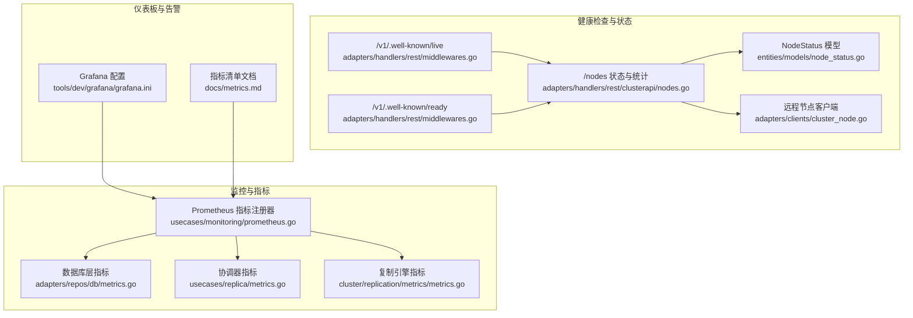
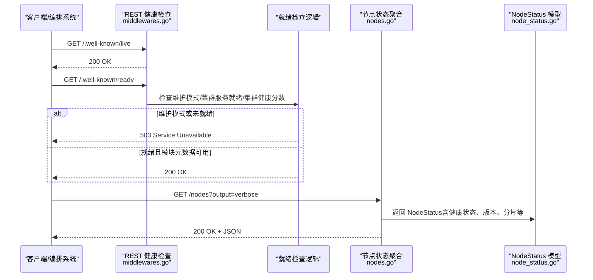
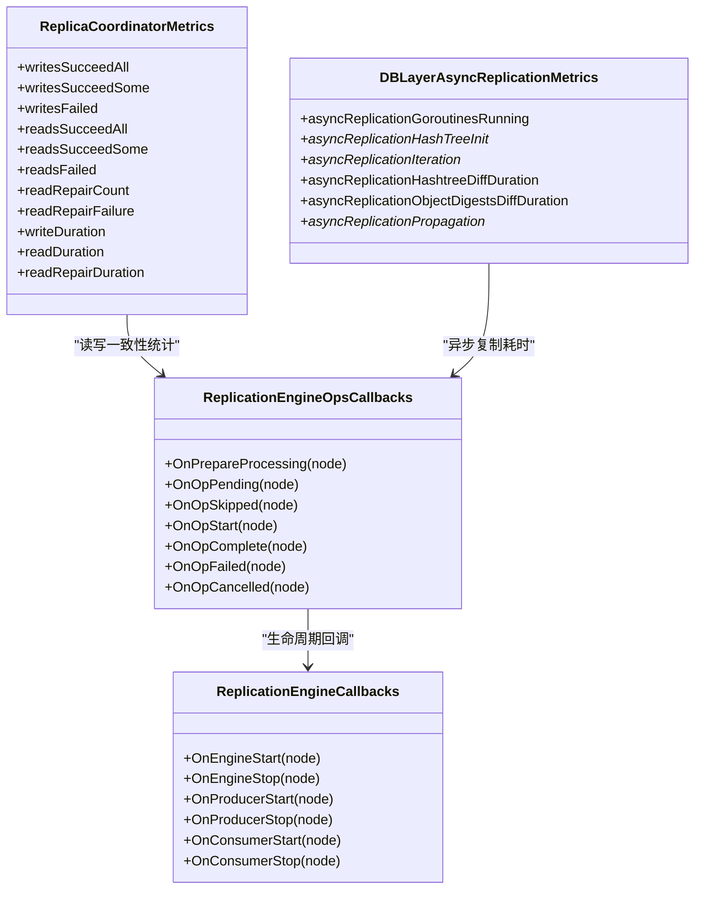
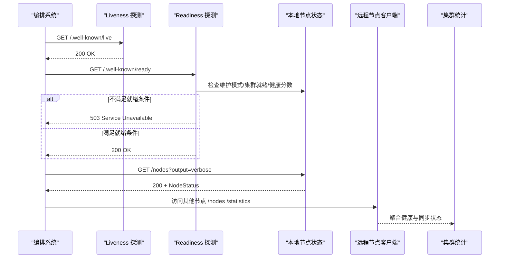
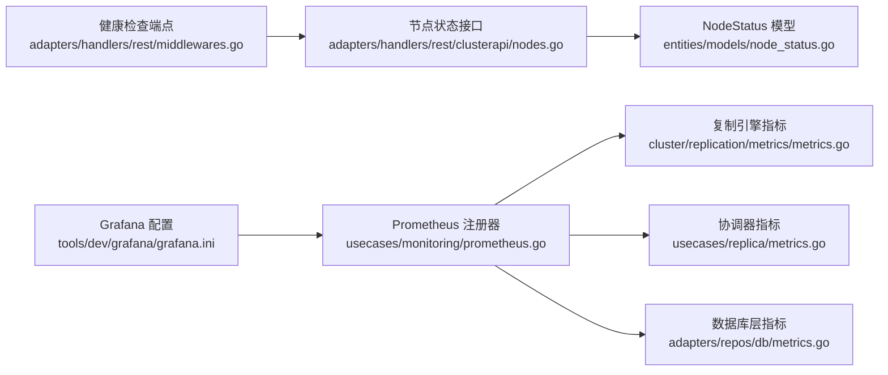

# 监控与健康检查

<cite>
**本文引用的文件**
- [metrics.md](file://docs/metrics.md)
- [prometheus.go](file://usecases/monitoring/prometheus.go)
- [metrics.go](file://adapters/repos/db/metrics.go)
- [metrics.go](file://usecases/replica/metrics.go)
- [metrics.go](file://cluster/replication/metrics/metrics.go)
- [nodes.go](file://adapters/handlers/rest/clusterapi/nodes.go)
- [nodes.go](file://adapters/repos/db/nodes.go)
- [node_status.go](file://entities/models/node_status.go)
- [middlewares.go](file://adapters/handlers/rest/middlewares.go)
- [operations_client.go](file://client/operations/operations_client.go)
- [weaviate_wellknown_liveness_responses.go](file://client/operations/weaviate_wellknown_liveness_responses.go)
- [weaviate_wellknown_readiness_responses.go](file://client/operations/weaviate_wellknown_readiness_responses.go)
- [health.go](file://adapters/handlers/grpc/v1/health.go)
- [health_weaviate.pb.go](file://grpc/generated/protocol/v1/health_weaviate.pb.go)
- [handlers_nodes.go](file://adapters/handlers/rest/handlers_nodes.go)
- [cluster_node.go](file://adapters/clients/cluster_node.go)
- [grafana.ini](file://tools/dev/grafana/grafana.ini)
</cite>

## 目录
1. [简介](#简介)
2. [项目结构](#项目结构)
3. [核心组件](#核心组件)
4. [架构总览](#架构总览)
5. [详细组件分析](#详细组件分析)
6. [依赖关系分析](#依赖关系分析)
7. [性能考量](#性能考量)
8. [故障排查指南](#故障排查指南)
9. [结论](#结论)
10. [附录](#附录)

## 简介
本文件面向 Weaviate 的复制监控与健康检查系统，系统性阐述复制状态监控指标的设计与实现，覆盖复制延迟、吞吐量、错误率等关键指标；详述健康检查机制，包括节点存活检测、复制进度跟踪与异常告警；解释监控数据的采集与存储策略（Prometheus 指标体系与标签设计）、历史数据分析思路；给出监控仪表板配置与可视化方法（实时监控与趋势分析）；最后提供监控告警的配置与通知机制（阈值设置与告警升级策略），并总结性能优化与扩展性建议。

## 项目结构
Weaviate 的监控与健康检查由多层组件协同完成：
- 指标定义与注册：统一的 Prometheus 指标注册器与命名空间，集中于监控子系统。
- 复制引擎指标：复制引擎生命周期与操作状态的指标，用于观测复制任务的排队、进行中、完成与失败情况。
- 数据库层指标：批量写入、对象存储、向量索引、启动阶段等指标，以及异步复制相关指标。
- 协调器指标：副本一致性级别（CL）相关的读写成功/失败统计与耗时直方图。
- 健康检查与状态接口：REST 与 gRPC 健康检查端点，以及节点状态聚合接口。
- 仪表板与告警：Grafana 配置与告警规则参数化。

**图表来源**
- [prometheus.go](file://usecases/monitoring/prometheus.go#L1-L120)
- [metrics.go](file://adapters/repos/db/metrics.go#L1-L120)
- [metrics.go](file://usecases/replica/metrics.go#L1-L80)
- [metrics.go](file://cluster/replication/metrics/metrics.go#L1-L120)
- [middlewares.go](file://adapters/handlers/rest/middlewares.go#L233-L260)
- [nodes.go](file://adapters/handlers/rest/clusterapi/nodes.go#L47-L146)
- [node_status.go](file://entities/models/node_status.go#L30-L60)
- [cluster_node.go](file://adapters/clients/cluster_node.go#L51-L99)
- [grafana.ini](file://tools/dev/grafana/grafana.ini#L771-L806)
- [metrics.md](file://docs/metrics.md#L1-L120)

**章节来源**
- [prometheus.go](file://usecases/monitoring/prometheus.go#L1-L200)
- [metrics.go](file://adapters/repos/db/metrics.go#L1-L120)
- [metrics.go](file://usecases/replica/metrics.go#L1-L80)
- [metrics.go](file://cluster/replication/metrics/metrics.go#L1-L120)
- [middlewares.go](file://adapters/handlers/rest/middlewares.go#L233-L260)
- [nodes.go](file://adapters/handlers/rest/clusterapi/nodes.go#L47-L146)
- [node_status.go](file://entities/models/node_status.go#L30-L60)
- [cluster_node.go](file://adapters/clients/cluster_node.go#L51-L99)
- [grafana.ini](file://tools/dev/grafana/grafana.ini#L771-L806)
- [metrics.md](file://docs/metrics.md#L1-L120)

## 核心组件
- Prometheus 指标注册器与命名空间：集中定义各类指标（批处理、对象、查询、LSM、队列、向量索引、启动、备份恢复、模块使用、分布式任务、HTTP/gRPC 服务器、集群存储、模式管理、运行时配置等），并提供按类/分片维度的标签化与删除清理能力。
- 复制引擎指标：跟踪复制引擎、生产者、消费者运行状态，以及排队/进行中/完成/失败/取消等操作计数与状态标签。
- 数据库层指标：批量写入耗时、对象存储耗时、向量索引耗时、过滤向量各阶段耗时、启动阶段耗时、异步复制各阶段计数与耗时直方图。
- 协调器指标：按一致性级别（ALL/QUORUM/ONE）统计读写成功/部分成功/失败次数，以及读修复次数与耗时直方图。
- 健康检查与状态接口：REST 与 gRPC 健康检查端点，以及节点状态聚合接口，支持输出最小/详细级别，返回节点健康状态、版本、Git Hash、分片统计、批处理统计、运行模式等。
- 指标清单文档：明确指标分类（仪表板/运营/告警/分析/可废弃/已废弃）、标签基数与使用场景，指导仪表板与告警配置。

**章节来源**
- [prometheus.go](file://usecases/monitoring/prometheus.go#L120-L420)
- [metrics.go](file://cluster/replication/metrics/metrics.go#L142-L228)
- [metrics.go](file://adapters/repos/db/metrics.go#L46-L120)
- [metrics.go](file://usecases/replica/metrics.go#L30-L130)
- [middlewares.go](file://adapters/handlers/rest/middlewares.go#L233-L260)
- [nodes.go](file://adapters/handlers/rest/clusterapi/nodes.go#L80-L146)
- [metrics.md](file://docs/metrics.md#L1-L200)

## 架构总览
Weaviate 的监控与健康检查采用“指标采集 + 健康检查端点 + 统一仪表板”的架构。Prometheus 通过 HTTP 抓取指标，Grafana 作为可视化与告警平台消费指标；健康检查端点用于容器编排系统（如 Kubernetes）进行存活与就绪探测。

**图表来源**
- [middlewares.go](file://adapters/handlers/rest/middlewares.go#L233-L260)
- [nodes.go](file://adapters/handlers/rest/clusterapi/nodes.go#L80-L146)
- [node_status.go](file://entities/models/node_status.go#L30-L60)

**章节来源**
- [middlewares.go](file://adapters/handlers/rest/middlewares.go#L233-L260)
- [nodes.go](file://adapters/handlers/rest/clusterapi/nodes.go#L80-L146)
- [node_status.go](file://entities/models/node_status.go#L30-L60)

## 详细组件分析

### 复制监控指标体系
- 复制引擎生命周期指标：排队、进行中、完成、失败、取消计数，引擎/生产者/消费者运行状态标签化，便于定位复制任务积压与异常。
- 协调器一致性指标：按 CL 统计写入/读取的成功/部分成功/失败次数，以及读修复次数与耗时直方图，支撑复制一致性与可用性的度量。
- 数据库层异步复制指标：哈希树初始化、比较迭代、差异计算、传播执行的计数与耗时直方图，支持复制延迟与吞吐量分析。

**图表来源**
- [metrics.go](file://cluster/replication/metrics/metrics.go#L142-L228)
- [metrics.go](file://cluster/replication/metrics/metrics.go#L338-L379)
- [metrics.go](file://usecases/replica/metrics.go#L30-L130)
- [metrics.go](file://adapters/repos/db/metrics.go#L46-L120)

**章节来源**
- [metrics.go](file://cluster/replication/metrics/metrics.go#L142-L228)
- [metrics.go](file://cluster/replication/metrics/metrics.go#L338-L379)
- [metrics.go](file://usecases/replica/metrics.go#L30-L130)
- [metrics.go](file://adapters/repos/db/metrics.go#L46-L120)

### 健康检查机制
- 存活检测：/v1/.well-known/live 始终返回 200，用于容器编排的存活探测。
- 就绪检测：/v1/.well-known/ready 在维护模式、集群服务未就绪、集群健康分数非零或模块元数据不可用时返回 503，否则 200。
- 节点状态：/nodes 支持输出最小/详细级别，返回节点健康状态、版本、Git Hash、分片统计、批处理统计、运行模式等；支持按类/分片筛选。
- 远程节点状态：通过远程节点客户端访问其他节点的 /nodes 与 /nodes/statistics 接口，聚合集群健康状态与同步状态。

**图表来源**
- [middlewares.go](file://adapters/handlers/rest/middlewares.go#L233-L260)
- [nodes.go](file://adapters/handlers/rest/clusterapi/nodes.go#L80-L146)
- [cluster_node.go](file://adapters/clients/cluster_node.go#L51-L99)
- [handlers_nodes.go](file://adapters/handlers/rest/handlers_nodes.go#L78-L106)

**章节来源**
- [middlewares.go](file://adapters/handlers/rest/middlewares.go#L233-L260)
- [nodes.go](file://adapters/handlers/rest/clusterapi/nodes.go#L80-L146)
- [cluster_node.go](file://adapters/clients/cluster_node.go#L51-L99)
- [handlers_nodes.go](file://adapters/handlers/rest/handlers_nodes.go#L78-L106)

### 监控数据采集与存储策略
- 指标注册与命名空间：统一的 Prometheus 注册器，支持命名空间前缀与分组（按类/分片）以降低标签基数。
- 指标类型选择：关键路径使用直方图/计数器，避免高基数标签；运营与告警指标尽量收敛标签集合。
- 删除与清理：提供按分片与类维度的指标删除函数，确保动态扩缩容后指标不会残留。
- 历史数据分析：结合 Grafana 时间序列查询与 PromQL，支持趋势分析与异常检测。

**章节来源**
- [prometheus.go](file://usecases/monitoring/prometheus.go#L291-L372)
- [metrics.md](file://docs/metrics.md#L1-L120)

### 仪表板配置与可视化
- 指标清单：依据文档对指标进行分类，明确仪表板/运营/告警/分析用途与标签基数，指导仪表板开发。
- Grafana 参数：通过 grafana.ini 配置告警评估超时、最小评估间隔、并发渲染限制等，保障仪表板性能与稳定性。
- 可视化建议：围绕复制延迟（异步复制耗时直方图）、吞吐量（批处理/传播计数）、错误率（失败/取消计数）、一致性（协调器成功/失败）、健康状态（引擎/生产者/消费者运行状态）构建面板。

**章节来源**
- [metrics.md](file://docs/metrics.md#L1-L200)
- [grafana.ini](file://tools/dev/grafana/grafana.ini#L771-L806)

### 告警配置与通知机制
- 告警指标：聚焦关键路径与症状指标（如复制失败/取消计数增长、传播耗时异常、引擎/消费者停止、节点健康状态异常等）。
- 阈值与升级：建议采用多级阈值（轻微/严重/危急），结合时间窗口与比率变化，配合升级策略（静默期、重复抑制、通知渠道分级）。
- 与编排集成：就绪探针返回 503 时，编排系统会将 Pod 标记为不可服务，避免流量进入不健康实例。

**章节来源**
- [metrics.go](file://cluster/replication/metrics/metrics.go#L142-L228)
- [metrics.go](file://adapters/repos/db/metrics.go#L173-L384)
- [middlewares.go](file://adapters/handlers/rest/middlewares.go#L233-L260)

## 依赖关系分析
- 指标注册器依赖 Prometheus 客户端库，提供统一的指标生命周期管理。
- 复制引擎指标与协调器指标共同依赖复制引擎生命周期回调，形成从底层到上层的指标链路。
- 健康检查端点依赖节点状态聚合与模型定义，远程节点客户端负责跨节点通信。
- 仪表板与告警依赖指标清单文档与 Grafana 配置。

**图表来源**
- [prometheus.go](file://usecases/monitoring/prometheus.go#L120-L420)
- [metrics.go](file://cluster/replication/metrics/metrics.go#L142-L228)
- [metrics.go](file://usecases/replica/metrics.go#L30-L130)
- [metrics.go](file://adapters/repos/db/metrics.go#L46-L120)
- [middlewares.go](file://adapters/handlers/rest/middlewares.go#L233-L260)
- [nodes.go](file://adapters/handlers/rest/clusterapi/nodes.go#L80-L146)
- [node_status.go](file://entities/models/node_status.go#L30-L60)
- [grafana.ini](file://tools/dev/grafana/grafana.ini#L771-L806)

**章节来源**
- [prometheus.go](file://usecases/monitoring/prometheus.go#L120-L420)
- [metrics.go](file://cluster/replication/metrics/metrics.go#L142-L228)
- [metrics.go](file://usecases/replica/metrics.go#L30-L130)
- [metrics.go](file://adapters/repos/db/metrics.go#L46-L120)
- [middlewares.go](file://adapters/handlers/rest/middlewares.go#L233-L260)
- [nodes.go](file://adapters/handlers/rest/clusterapi/nodes.go#L80-L146)
- [node_status.go](file://entities/models/node_status.go#L30-L60)
- [grafana.ini](file://tools/dev/grafana/grafana.ini#L771-L806)

## 性能考量
- 标签基数控制：优先使用少量有界标签，避免每租户/每类/每路由的标签爆炸；将探索性分析移至日志/追踪或外部存储。
- 指标粒度：关键路径使用直方图/计数器，减少高基数标签；运营与告警指标尽量收敛标签集合。
- 清理策略：提供按分片与类维度的指标删除函数，避免扩缩容后指标残留导致内存与查询压力。
- 评估与渲染：通过 Grafana 配置最小评估间隔与并发渲染限制，避免在大规模告警时过载。

**章节来源**
- [metrics.md](file://docs/metrics.md#L25-L36)
- [prometheus.go](file://usecases/monitoring/prometheus.go#L291-L372)
- [grafana.ini](file://tools/dev/grafana/grafana.ini#L771-L806)

## 故障排查指南
- 存活与就绪：确认 /v1/.well-known/live  stably 返回 200；若 /v1/.well-known/ready 返回 503，检查维护模式、集群服务就绪状态、集群健康分数与模块元数据可用性。
- 节点状态：通过 /nodes 获取节点健康状态、版本、Git Hash、分片统计、批处理统计、运行模式；必要时使用 verbose 输出获取详细信息。
- 复制异常：关注复制引擎运行状态、排队/进行中/完成/失败/取消计数，以及异步复制耗时直方图；结合协调器一致性指标判断一致性问题。
- 远程节点：使用远程节点客户端访问其他节点的 /nodes 与 /nodes/statistics，核验集群同步状态与健康状况。

**章节来源**
- [middlewares.go](file://adapters/handlers/rest/middlewares.go#L233-L260)
- [nodes.go](file://adapters/handlers/rest/clusterapi/nodes.go#L80-L146)
- [cluster_node.go](file://adapters/clients/cluster_node.go#L51-L99)
- [handlers_nodes.go](file://adapters/handlers/rest/handlers_nodes.go#L78-L106)

## 结论
Weaviate 的复制监控与健康检查体系通过统一的 Prometheus 指标注册器、分层的复制与协调器指标、完善的健康检查端点与节点状态聚合，实现了对复制延迟、吞吐量、错误率与一致性状态的全面可观测。结合指标清单文档与 Grafana 配置，可快速搭建实时监控与趋势分析仪表板，并通过合理的阈值与升级策略实现高效告警。在性能方面，通过标签基数控制、指标粒度与清理策略，以及 Grafana 的评估与渲染参数化，确保系统在高负载下的稳定性与可扩展性。

## 附录
- 指标清单与使用类别参考：[指标文档](file://docs/metrics.md#L1-L200)
- Prometheus 指标注册与删除：[监控注册器](file://usecases/monitoring/prometheus.go#L291-L372)
- 复制引擎与协调器指标：[复制引擎指标](file://cluster/replication/metrics/metrics.go#L142-L228)、[协调器指标](file://usecases/replica/metrics.go#L30-L130)
- 数据库层异步复制指标：[数据库层指标](file://adapters/repos/db/metrics.go#L173-L384)
- 健康检查端点与节点状态：[中间件](file://adapters/handlers/rest/middlewares.go#L233-L260)、[节点接口](file://adapters/handlers/rest/clusterapi/nodes.go#L80-L146)、[节点模型](file://entities/models/node_status.go#L30-L60)
- 远程节点访问与集群统计：[远程节点客户端](file://adapters/clients/cluster_node.go#L51-L99)、[集群统计处理器](file://adapters/handlers/rest/handlers_nodes.go#L78-L106)
- gRPC 健康检查协议：[健康检查服务](file://adapters/handlers/grpc/v1/health.go)、[协议定义](file://grpc/generated/protocol/v1/health_weaviate.pb.go#L109-L151)
- Grafana 告警与评估配置：[Grafana 配置](file://tools/dev/grafana/grafana.ini#L771-L806)