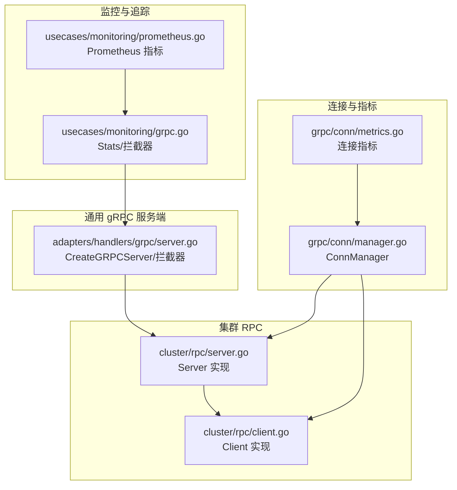
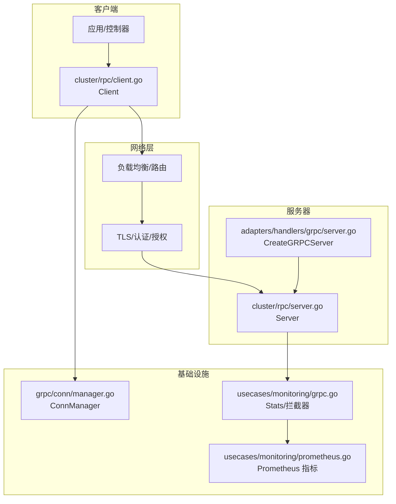
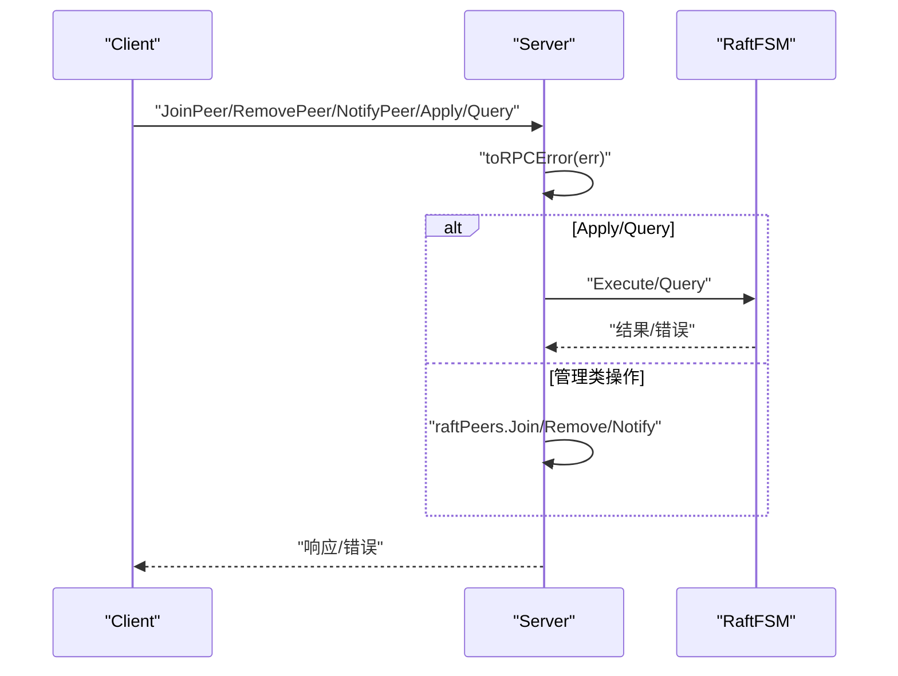
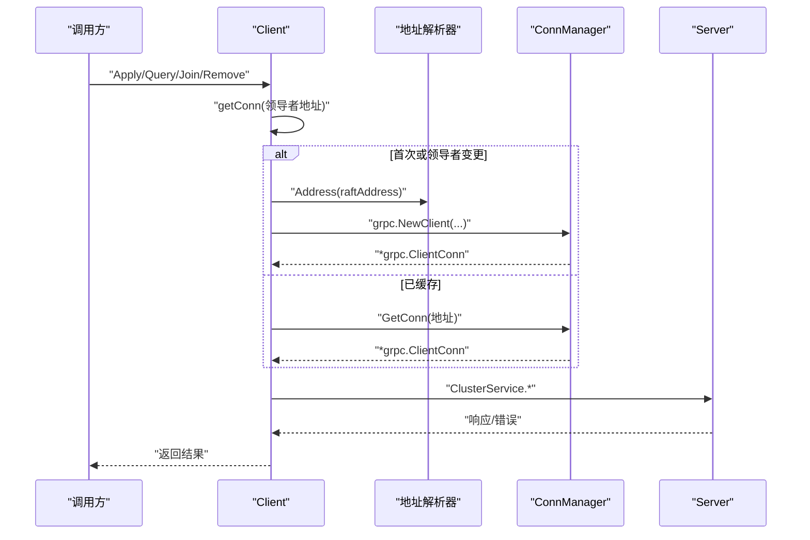
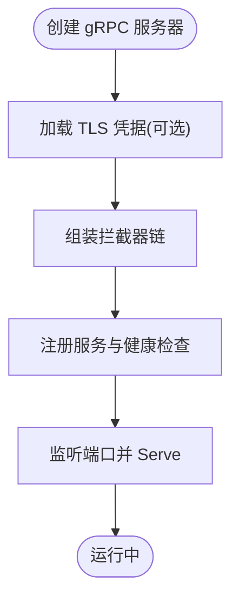
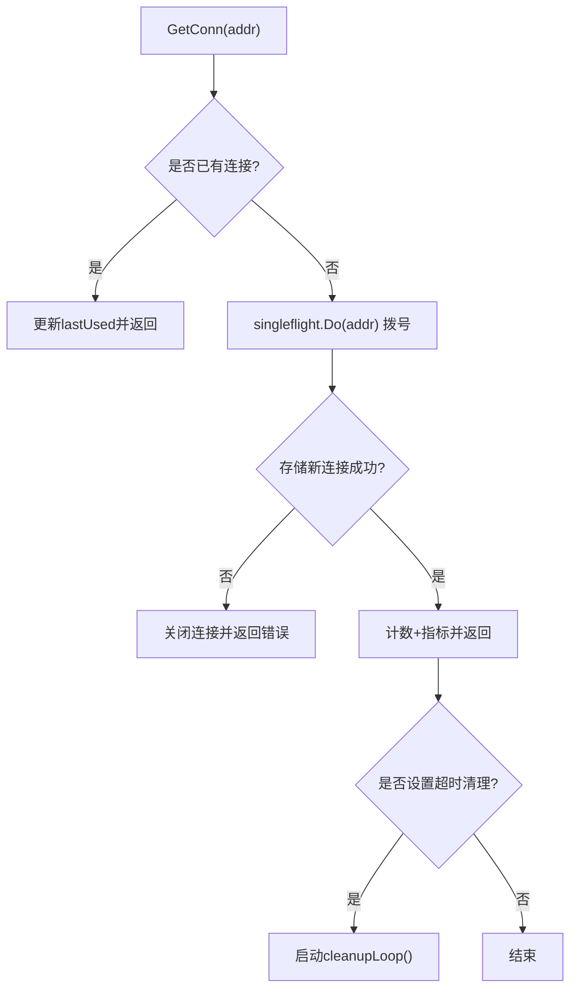
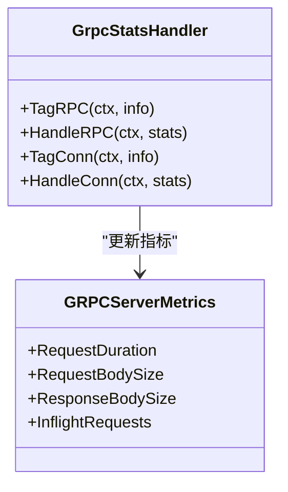
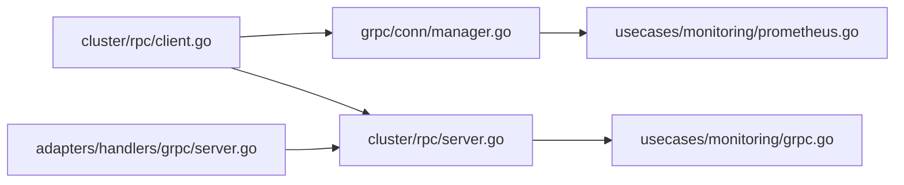

# RPC 通信机制

<cite>
**本文引用的文件**
- [cluster/rpc/server.go](file://cluster/rpc/server.go)
- [cluster/rpc/client.go](file://cluster/rpc/client.go)
- [grpc/conn/manager.go](file://grpc/conn/manager.go)
- [grpc/conn/metrics.go](file://grpc/conn/metrics.go)
- [adapters/handlers/grpc/server.go](file://adapters/handlers/grpc/server.go)
- [usecases/monitoring/grpc.go](file://usecases/monitoring/grpc.go)
- [usecases/monitoring/prometheus.go](file://usecases/monitoring/prometheus.go)
- [cluster/utils/retry.go](file://cluster/utils/retry.go)
- [grpc/conn/manager_test.go](file://grpc/conn/manager_test.go)
- [adapters/handlers/grpc/server.go（REST 集成）](file://adapters/handlers/rest/clusterapi/grpc/server.go)
</cite>

## 目录
1. [简介](#简介)
2. [项目结构](#项目结构)
3. [核心组件](#核心组件)
4. [架构总览](#架构总览)
5. [详细组件分析](#详细组件分析)
6. [依赖关系分析](#依赖关系分析)
7. [性能考虑](#性能考虑)
8. [故障排查指南](#故障排查指南)
9. [结论](#结论)
10. [附录](#附录)

## 简介
本文件系统性梳理 Weaviate 的 RPC 通信机制，覆盖 gRPC 服务器与客户端实现、服务注册、连接管理、消息路由、调用生命周期、安全机制（认证、授权、传输加密）、负载均衡与故障转移（连接池、重试、熔断）、性能优化（连接复用、批量处理、压缩）以及监控与调试（指标、日志、追踪）。内容基于仓库中集群 RPC 与通用 gRPC 处理器的实际实现进行归纳总结。

## 项目结构
围绕 RPC 通信的关键目录与文件：
- 集群 RPC：cluster/rpc/server.go、cluster/rpc/client.go
- 通用 gRPC 服务端：adapters/handlers/grpc/server.go
- gRPC 连接管理与指标：grpc/conn/manager.go、grpc/conn/metrics.go
- 监控与追踪：usecases/monitoring/grpc.go、usecases/monitoring/prometheus.go
- 重试工具：cluster/utils/retry.go
- 测试与示例：grpc/conn/manager_test.go、adapters/handlers/rest/clusterapi/grpc/server.go

图表来源
- [cluster/rpc/server.go](file://cluster/rpc/server.go#L143-L179)
- [cluster/rpc/client.go](file://cluster/rpc/client.go#L125-L128)
- [adapters/handlers/grpc/server.go](file://adapters/handlers/grpc/server.go#L50-L125)
- [grpc/conn/manager.go](file://grpc/conn/manager.go#L75-L102)
- [grpc/conn/metrics.go](file://grpc/conn/metrics.go#L28-L63)
- [usecases/monitoring/grpc.go](file://usecases/monitoring/grpc.go#L48-L68)
- [usecases/monitoring/prometheus.go](file://usecases/monitoring/prometheus.go#L254-L289)

章节来源
- [cluster/rpc/server.go](file://cluster/rpc/server.go#L14-L82)
- [cluster/rpc/client.go](file://cluster/rpc/client.go#L125-L128)
- [adapters/handlers/grpc/server.go](file://adapters/handlers/grpc/server.go#L50-L125)
- [grpc/conn/manager.go](file://grpc/conn/manager.go#L75-L102)
- [grpc/conn/metrics.go](file://grpc/conn/metrics.go#L28-L63)
- [usecases/monitoring/grpc.go](file://usecases/monitoring/grpc.go#L48-L68)
- [usecases/monitoring/prometheus.go](file://usecases/monitoring/prometheus.go#L254-L289)

## 核心组件
- 集群 gRPC 服务器：负责注册并处理集群管理与状态查询请求，支持 Sentry 错误追踪、OpenTelemetry 追踪、自定义最大消息尺寸等。
- 集群 gRPC 客户端：封装对领导者节点的调用，内置默认服务配置（含重试策略）、连接缓存与切换、错误映射。
- 通用 gRPC 服务端：创建并配置 gRPC 服务器，注入认证、基本认证、运维模式、维护模式、Sentry、Prometheus 指标与追踪拦截器，并注册 v0/v1 服务与健康检查。
- 连接管理器：提供连接复用、容量限制、空闲清理、单飞（singleflight）避免重复拨号、指标统计。
- 监控与追踪：通过 stats.Handler 与拦截器采集请求时延、请求/响应大小、并发请求数；Prometheus 暴露指标；OpenTelemetry 追踪。

章节来源
- [cluster/rpc/server.go](file://cluster/rpc/server.go#L49-L82)
- [cluster/rpc/client.go](file://cluster/rpc/client.go#L100-L128)
- [adapters/handlers/grpc/server.go](file://adapters/handlers/grpc/server.go#L50-L125)
- [grpc/conn/manager.go](file://grpc/conn/manager.go#L121-L170)
- [usecases/monitoring/grpc.go](file://usecases/monitoring/grpc.go#L48-L68)

## 架构总览
下图展示集群 RPC 与通用 gRPC 的交互关系及关键扩展点。

图表来源
- [cluster/rpc/client.go](file://cluster/rpc/client.go#L134-L141)
- [cluster/rpc/server.go](file://cluster/rpc/server.go#L143-L179)
- [adapters/handlers/grpc/server.go](file://adapters/handlers/grpc/server.go#L50-L125)
- [grpc/conn/manager.go](file://grpc/conn/manager.go#L75-L102)
- [usecases/monitoring/grpc.go](file://usecases/monitoring/grpc.go#L48-L68)
- [usecases/monitoring/prometheus.go](file://usecases/monitoring/prometheus.go#L254-L289)

## 详细组件分析

### 集群 gRPC 服务器（Server）
- 服务注册：在启动时注册 ClusterService 并监听指定地址。
- 请求处理：提供 JoinPeer、RemovePeer、NotifyPeer、Apply、Query 等方法，内部委托给 Raft 接口执行或查询。
- 错误传播：将业务错误映射为 gRPC 状态码，区分领导者变更、未开放、多租户禁用、未找到等场景。
- 中间件：可选 Sentry 拦截器、监控拦截器、OpenTelemetry 追踪、最大消息尺寸限制。

图表来源
- [cluster/rpc/server.go](file://cluster/rpc/server.go#L84-L132)
- [cluster/rpc/server.go](file://cluster/rpc/server.go#L188-L208)

章节来源
- [cluster/rpc/server.go](file://cluster/rpc/server.go#L49-L82)
- [cluster/rpc/server.go](file://cluster/rpc/server.go#L143-L179)
- [cluster/rpc/server.go](file://cluster/rpc/server.go#L188-L208)

### 集群 gRPC 客户端（Client）
- 连接缓存：按领导者地址缓存 gRPC 连接，避免重复拨号；在领导者变更时关闭旧连接并建立新连接。
- 默认服务配置：包含针对 Apply/Query 与 Join/Remove/Notify 的不同重试策略（次数、退避、可重试状态码）。
- 错误映射：将 gRPC 错误转换为类型化错误，便于上层判断（如 NotFound）。

图表来源
- [cluster/rpc/client.go](file://cluster/rpc/client.go#L134-L141)
- [cluster/rpc/client.go](file://cluster/rpc/client.go#L182-L188)
- [cluster/rpc/client.go](file://cluster/rpc/client.go#L194-L201)
- [cluster/rpc/client.go](file://cluster/rpc/client.go#L207-L215)
- [cluster/rpc/client.go](file://cluster/rpc/client.go#L237-L280)
- [grpc/conn/manager.go](file://grpc/conn/manager.go#L75-L102)

章节来源
- [cluster/rpc/client.go](file://cluster/rpc/client.go#L100-L128)
- [cluster/rpc/client.go](file://cluster/rpc/client.go#L134-L141)
- [cluster/rpc/client.go](file://cluster/rpc/client.go#L182-L188)
- [cluster/rpc/client.go](file://cluster/rpc/client.go#L194-L201)
- [cluster/rpc/client.go](file://cluster/rpc/client.go#L207-L215)
- [cluster/rpc/client.go](file://cluster/rpc/client.go#L237-L280)

### 通用 gRPC 服务端（CreateGRPCServer）
- TLS 支持：根据配置加载证书文件启用 TLS。
- 拦截器链：认证、基本认证（仅部分服务前缀）、Sentry、Prometheus 指标、IP 注入、运维模式、维护模式、OpenTelemetry 追踪、流式认证。
- 服务注册：注册 v0/v1 Weaviate 服务与健康检查服务。

图表来源
- [adapters/handlers/grpc/server.go](file://adapters/handlers/grpc/server.go#L50-L125)
- [adapters/handlers/grpc/server.go](file://adapters/handlers/grpc/server.go#L348-L361)

章节来源
- [adapters/handlers/grpc/server.go](file://adapters/handlers/grpc/server.go#L50-L125)
- [adapters/handlers/grpc/server.go](file://adapters/handlers/grpc/server.go#L159-L185)
- [adapters/handlers/grpc/server.go](file://adapters/handlers/grpc/server.go#L197-L224)

### 连接管理器（ConnManager）
- 连接复用：读锁快速命中已存在连接，更新最近使用时间。
- 单飞拨号：使用 singleflight 避免同一地址并发拨号。
- 容量控制：最大打开连接数限制，必要时驱逐最久未使用的过期连接。
- 空闲清理：后台定时扫描并关闭超时未使用的连接。
- 指标统计：创建、复用、关闭、拒绝、驱逐、当前打开连接数。

图表来源
- [grpc/conn/manager.go](file://grpc/conn/manager.go#L75-L102)
- [grpc/conn/manager.go](file://grpc/conn/manager.go#L121-L170)
- [grpc/conn/manager.go](file://grpc/conn/manager.go#L229-L242)
- [grpc/conn/manager.go](file://grpc/conn/manager.go#L244-L300)

章节来源
- [grpc/conn/manager.go](file://grpc/conn/manager.go#L75-L102)
- [grpc/conn/manager.go](file://grpc/conn/manager.go#L121-L170)
- [grpc/conn/manager.go](file://grpc/conn/manager.go#L229-L300)
- [grpc/conn/metrics.go](file://grpc/conn/metrics.go#L28-L63)

### 监控与追踪
- Stats Handler：统计并发请求数、请求/响应包大小。
- 拦截器：统一记录请求耗时与状态，结合 Prometheus 暴露直方图与计数器。
- OpenTelemetry：在通用 gRPC 服务端注入追踪拦截器。

图表来源
- [usecases/monitoring/grpc.go](file://usecases/monitoring/grpc.go#L78-L116)
- [usecases/monitoring/prometheus.go](file://usecases/monitoring/prometheus.go#L254-L289)

章节来源
- [usecases/monitoring/grpc.go](file://usecases/monitoring/grpc.go#L48-L68)
- [usecases/monitoring/grpc.go](file://usecases/monitoring/grpc.go#L126-L133)
- [usecases/monitoring/prometheus.go](file://usecases/monitoring/prometheus.go#L254-L289)

### 安全机制
- 传输加密：通用 gRPC 服务端支持从文件加载 TLS 证书启用加密。
- 认证与授权：通用 gRPC 服务端注入认证拦截器，处理未认证与权限不足错误；支持匿名访问配置。
- 基本认证：对特定服务前缀启用 Basic 认证拦截器，校验元数据中的 Authorization 头。
- 连接级认证：连接管理器提供 Basic Auth 客户端拦截器，自动附加 Authorization 头。

章节来源
- [adapters/handlers/grpc/server.go](file://adapters/handlers/grpc/server.go#L59-L68)
- [adapters/handlers/grpc/server.go](file://adapters/handlers/grpc/server.go#L159-L175)
- [adapters/handlers/grpc/server.go](file://adapters/handlers/grpc/server.go#L177-L185)
- [adapters/handlers/grpc/server.go](file://adapters/handlers/grpc/server.go#L226-L346)
- [grpc/conn/manager.go](file://grpc/conn/manager.go#L357-L384)

### 负载均衡与故障转移
- 客户端侧重试：默认服务配置为 Apply/Query 与 Join/Remove/Notify 分别设定不同的最大重试次数、初始/最大退避时间与可重试状态码。
- 连接池与复用：ConnManager 提供连接缓存、容量限制与空闲清理，减少拨号开销。
- 领导者切换：Client 在领导者地址变化时主动关闭旧连接并建立新连接。
- 运维模式与只读/写入限制：通用 gRPC 服务端根据配置拒绝不合适的读写请求。

章节来源
- [cluster/rpc/client.go](file://cluster/rpc/client.go#L30-L93)
- [cluster/rpc/client.go](file://cluster/rpc/client.go#L237-L280)
- [grpc/conn/manager.go](file://grpc/conn/manager.go#L121-L170)
- [adapters/handlers/grpc/server.go](file://adapters/handlers/grpc/server.go#L197-L224)

### 性能优化建议
- 连接复用：优先使用 ConnManager 缓存连接，避免频繁拨号。
- 批量处理：通用 gRPC 服务端对 BatchObjects 特定指标进行观测，建议在上层聚合请求以提升吞吐。
- 压缩策略：启用 gzip 压缩（已在导入中安装），合理设置最大消息尺寸以平衡带宽与延迟。
- 指标驱动：结合 Prometheus 指标与追踪，定位热点方法与异常延迟。

章节来源
- [adapters/handlers/grpc/server.go](file://adapters/handlers/grpc/server.go#L38-L39)
- [adapters/handlers/grpc/server.go](file://adapters/handlers/grpc/server.go#L52-L55)
- [adapters/handlers/grpc/server.go](file://adapters/handlers/grpc/server.go#L127-L157)

### 监控与调试
- 指标采集：Stats Handler 与拦截器分别统计并发、请求/响应大小与时延。
- Prometheus 暴露：通过 NewGRPCServerMetrics 暴露直方图与计数器。
- 日志与追踪：Sentry 与 OpenTelemetry 在通用 gRPC 服务端启用，便于端到端问题定位。
- 连接指标：ConnManager 统计连接创建、复用、关闭、拒绝与驱逐，辅助排查连接泄漏与资源瓶颈。

章节来源
- [usecases/monitoring/grpc.go](file://usecases/monitoring/grpc.go#L48-L68)
- [usecases/monitoring/prometheus.go](file://usecases/monitoring/prometheus.go#L254-L289)
- [grpc/conn/metrics.go](file://grpc/conn/metrics.go#L28-L63)
- [adapters/handlers/grpc/server.go](file://adapters/handlers/grpc/server.go#L84-L100)

## 依赖关系分析
- 服务器与客户端：cluster/rpc/server.go 作为服务端，cluster/rpc/client.go 作为客户端，二者通过 gRPC 协议交互。
- 通用服务端：adapters/handlers/grpc/server.go 创建并配置通用 gRPC 服务器，向集群 RPC 服务器提供外部入口。
- 连接与监控：grpc/conn/manager.go 为客户端与服务器提供连接复用与清理；usecases/monitoring/* 提供指标与追踪能力。
- 重试工具：cluster/utils/retry.go 提供统一的退避策略，用于读取一致性等场景。

图表来源
- [cluster/rpc/client.go](file://cluster/rpc/client.go#L125-L128)
- [grpc/conn/manager.go](file://grpc/conn/manager.go#L75-L102)
- [cluster/rpc/server.go](file://cluster/rpc/server.go#L143-L179)
- [adapters/handlers/grpc/server.go](file://adapters/handlers/grpc/server.go#L50-L125)
- [usecases/monitoring/grpc.go](file://usecases/monitoring/grpc.go#L48-L68)
- [usecases/monitoring/prometheus.go](file://usecases/monitoring/prometheus.go#L254-L289)

章节来源
- [cluster/rpc/client.go](file://cluster/rpc/client.go#L125-L128)
- [grpc/conn/manager.go](file://grpc/conn/manager.go#L75-L102)
- [cluster/rpc/server.go](file://cluster/rpc/server.go#L143-L179)
- [adapters/handlers/grpc/server.go](file://adapters/handlers/grpc/server.go#L50-L125)
- [usecases/monitoring/grpc.go](file://usecases/monitoring/grpc.go#L48-L68)
- [usecases/monitoring/prometheus.go](file://usecases/monitoring/prometheus.go#L254-L289)

## 性能考虑
- 连接复用：优先使用 ConnManager 缓存连接，降低握手与上下文切换成本。
- 重试策略：Apply/Query 使用更保守的重试参数，Join/Remove/Notify 使用较短退避，避免阻塞关键路径。
- 批量与压缩：对大对象批量写入启用压缩与合理分片，减少网络往返。
- 指标与告警：基于 Prometheus 指标设置阈值告警，结合追踪定位慢调用。

[本节为通用指导，无需列出具体文件来源]

## 故障排查指南
- 连接问题：检查 ConnManager 的拒绝与驱逐指标，确认是否存在连接数上限或空闲清理导致的抖动。
- 重试失败：核对默认服务配置中的重试参数与可重试状态码，确认是否因非幂等操作被错误重试。
- 认证失败：验证 Basic 认证拦截器是否正确匹配服务前缀，检查 Authorization 头格式与凭据。
- 运维模式：当处于只读/写入/扩展模式时，相关读写请求会被拒绝，需调整模式或路由至合适节点。
- 监控缺失：确认是否启用了 Sentry 与 OpenTelemetry，以及 Prometheus 指标是否正常暴露。

章节来源
- [grpc/conn/metrics.go](file://grpc/conn/metrics.go#L47-L62)
- [cluster/rpc/client.go](file://cluster/rpc/client.go#L30-L93)
- [adapters/handlers/grpc/server.go](file://adapters/handlers/grpc/server.go#L226-L346)
- [adapters/handlers/grpc/server.go](file://adapters/handlers/grpc/server.go#L197-L224)
- [adapters/handlers/grpc/server.go](file://adapters/handlers/grpc/server.go#L84-L100)

## 结论
Weaviate 的 RPC 通信机制在集群层面通过专用的 Server/Client 实现强一致与一致性读写，在通用层面通过完善的拦截器链路提供认证、授权、监控与追踪能力。连接管理器与默认服务配置共同保障了高可用与高性能。结合 Prometheus 指标与追踪，可实现端到端的可观测性与快速定位问题。

[本节为总结性内容，无需列出具体文件来源]

## 附录
- 测试参考：grpc/conn/manager_test.go 展示了连接缓存、空闲清理、容量限制与拒绝行为的测试用例，可作为集成测试与回归测试的参考。
- REST 集成：adapters/handlers/rest/clusterapi/grpc/server.go 提供了与 REST 集成的 gRPC 服务端启动流程，便于理解整体服务编排。

章节来源
- [grpc/conn/manager_test.go](file://grpc/conn/manager_test.go#L55-L78)
- [grpc/conn/manager_test.go](file://grpc/conn/manager_test.go#L80-L105)
- [grpc/conn/manager_test.go](file://grpc/conn/manager_test.go#L319-L350)
- [adapters/handlers/rest/clusterapi/grpc/server.go](file://adapters/handlers/rest/clusterapi/grpc/server.go#L91-L138)