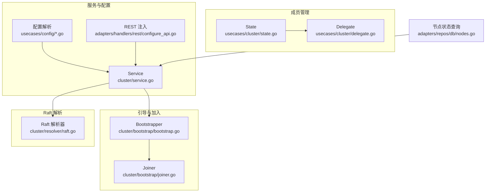
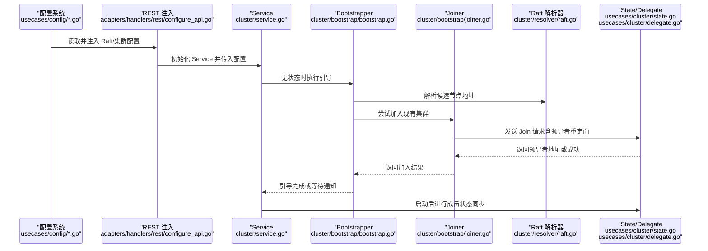
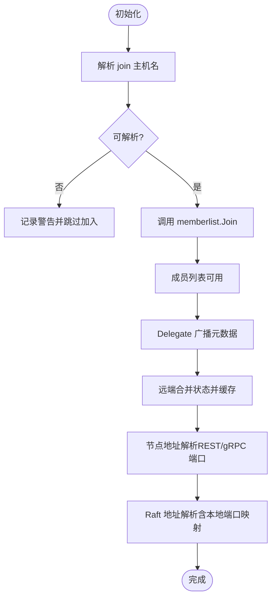
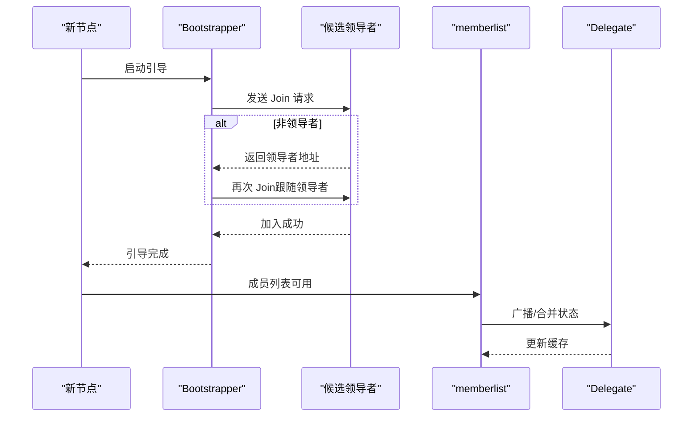
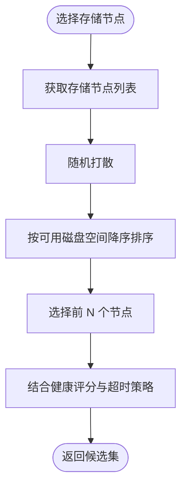
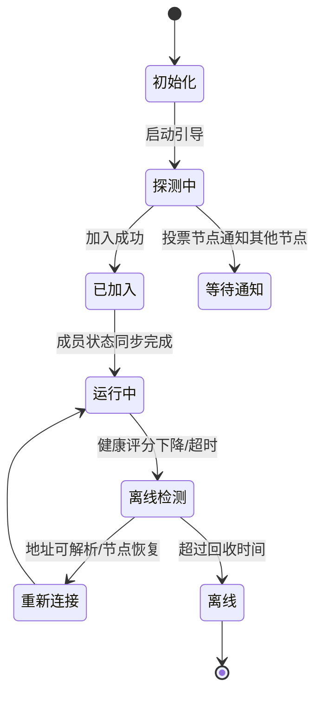
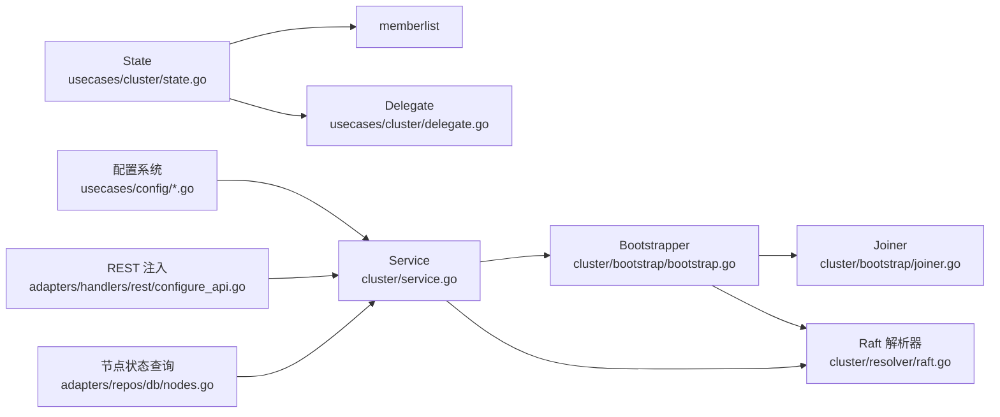

# 节点发现与成员管理

<cite>
**本文引用的文件**
- [usecases/cluster/state.go](file://usecases/cluster/state.go)
- [usecases/cluster/delegate.go](file://usecases/cluster/delegate.go)
- [cluster/bootstrap/bootstrap.go](file://cluster/bootstrap/bootstrap.go)
- [cluster/bootstrap/joiner.go](file://cluster/bootstrap/joiner.go)
- [cluster/resolver/raft.go](file://cluster/resolver/raft.go)
- [cluster/service.go](file://cluster/service.go)
- [usecases/config/config_handler.go](file://usecases/config/config_handler.go)
- [usecases/config/environment.go](file://usecases/config/environment.go)
- [adapters/handlers/rest/configure_api.go](file://adapters/handlers/rest/configure_api.go)
- [adapters/repos/db/nodes.go](file://adapters/repos/db/nodes.go)
</cite>

## 目录
1. [简介](#简介)
2. [项目结构](#项目结构)
3. [核心组件](#核心组件)
4. [架构总览](#架构总览)
5. [详细组件分析](#详细组件分析)
6. [依赖关系分析](#依赖关系分析)
7. [性能考量](#性能考量)
8. [故障排查指南](#故障排查指南)
9. [结论](#结论)
10. [附录](#附录)

## 简介
本文件面向 Weaviate 的节点发现与成员管理系统，系统基于 memberlist 实现集群成员管理，并通过 Raft 协议实现分布式一致性与配置同步。文档聚焦以下主题：
- 节点自动发现：DNS 解析、IP 地址解析与节点地址管理
- 节点加入与离开：加入请求处理、配置更新与状态同步
- 节点选择策略与健康检查：活跃性检测、超时处理与故障恢复
- 节点状态管理：在线状态跟踪、离线检测与重新连接机制
- 节点配置管理最佳实践：静态配置、动态发现与网络拓扑优化
- 安全与访问控制：认证与授权在节点发现与成员管理中的应用

## 项目结构
Weaviate 的节点发现与成员管理由多层协作完成：
- usecases/cluster/state.go：封装 memberlist 的状态机与接口，提供节点解析、主机名与地址映射、健康评分等能力
- usecases/cluster/delegate.go：实现 memberlist 委托与事件回调，负责节点元数据广播、本地状态合并与磁盘空间缓存
- cluster/bootstrap：实现启动阶段的引导逻辑，包含加入现有集群与通知其他节点准备就绪
- cluster/resolver/raft.go：将 memberlist 成员信息映射到 Raft 地址，支持本地多节点端口映射与地址解析
- cluster/service.go：Raft 层入口，协调 RPC 服务、引导与数据库恢复
- usecases/config：环境变量与配置解析，提供 Raft 与集群参数
- adapters/handlers/rest：REST 层将运行时配置注入 Raft 与集群服务
- adapters/repos/db/nodes.go：节点状态查询与错误处理（超时/不可用）

图表来源
- [usecases/cluster/state.go](file://usecases/cluster/state.go#L72-L254)
- [usecases/cluster/delegate.go](file://usecases/cluster/delegate.go#L113-L322)
- [cluster/bootstrap/bootstrap.go](file://cluster/bootstrap/bootstrap.go#L35-L179)
- [cluster/bootstrap/joiner.go](file://cluster/bootstrap/joiner.go#L27-L115)
- [cluster/resolver/raft.go](file://cluster/resolver/raft.go#L26-L119)
- [cluster/service.go](file://cluster/service.go#L46-L255)
- [usecases/config/config_handler.go](file://usecases/config/config_handler.go#L598-L633)
- [usecases/config/environment.go](file://usecases/config/environment.go#L1064-L1117)
- [adapters/handlers/rest/configure_api.go](file://adapters/handlers/rest/configure_api.go#L625-L680)
- [adapters/repos/db/nodes.go](file://adapters/repos/db/nodes.go#L47-L85)

章节来源
- [usecases/cluster/state.go](file://usecases/cluster/state.go#L150-L254)
- [usecases/cluster/delegate.go](file://usecases/cluster/delegate.go#L113-L322)
- [cluster/bootstrap/bootstrap.go](file://cluster/bootstrap/bootstrap.go#L63-L130)
- [cluster/bootstrap/joiner.go](file://cluster/bootstrap/joiner.go#L44-L114)
- [cluster/resolver/raft.go](file://cluster/resolver/raft.go#L46-L119)
- [cluster/service.go](file://cluster/service.go#L149-L209)
- [usecases/config/config_handler.go](file://usecases/config/config_handler.go#L598-L633)
- [usecases/config/environment.go](file://usecases/config/environment.go#L1064-L1117)
- [adapters/handlers/rest/configure_api.go](file://adapters/handlers/rest/configure_api.go#L625-L680)
- [adapters/repos/db/nodes.go](file://adapters/repos/db/nodes.go#L47-L85)

## 核心组件
- State：封装 memberlist，提供节点计数、主机名列表、节点地址解析、健康评分、优雅离开与关闭等能力；支持根据配置类型（LAN/WAN/LOCAL）选择不同的 memberlist 配置与超时策略
- Delegate：实现 memberlist 委托，负责节点元数据广播（含 gRPC/REST 端口）、本地状态合并（磁盘空间消息）、节点加入/离开事件回调与缓存维护
- Bootstrapper/Joiner：引导器负责在无状态时尝试加入现有集群或通知其他节点准备就绪；加入器负责向候选节点发送 Join 请求并处理非领导者重定向
- Raft 解析器：将节点名称解析为 Raft 地址，支持本地多节点场景下的端口映射与地址拼接
- Service：Raft 层入口，负责 RPC 服务开启、Raft 打开、引导/加入、数据库恢复、复制引擎启动时机控制
- 配置系统：从环境变量与配置文件读取 Raft 与集群参数，校验唯一性与格式，注入 REST 层供运行时使用
- 节点状态查询：远程节点状态获取与错误分类（超时/不可用），用于健康检查与故障恢复

章节来源
- [usecases/cluster/state.go](file://usecases/cluster/state.go#L72-L488)
- [usecases/cluster/delegate.go](file://usecases/cluster/delegate.go#L113-L322)
- [cluster/bootstrap/bootstrap.go](file://cluster/bootstrap/bootstrap.go#L35-L179)
- [cluster/bootstrap/joiner.go](file://cluster/bootstrap/joiner.go#L27-L115)
- [cluster/resolver/raft.go](file://cluster/resolver/raft.go#L26-L119)
- [cluster/service.go](file://cluster/service.go#L46-L255)
- [usecases/config/config_handler.go](file://usecases/config/config_handler.go#L598-L633)
- [adapters/repos/db/nodes.go](file://adapters/repos/db/nodes.go#L47-L85)

## 架构总览
下图展示从配置加载到节点加入、引导与状态同步的关键路径。

图表来源
- [usecases/config/environment.go](file://usecases/config/environment.go#L1064-L1117)
- [adapters/handlers/rest/configure_api.go](file://adapters/handlers/rest/configure_api.go#L625-L680)
- [cluster/service.go](file://cluster/service.go#L149-L209)
- [cluster/bootstrap/bootstrap.go](file://cluster/bootstrap/bootstrap.go#L63-L130)
- [cluster/bootstrap/joiner.go](file://cluster/bootstrap/joiner.go#L44-L114)
- [cluster/resolver/raft.go](file://cluster/resolver/raft.go#L106-L119)
- [usecases/cluster/state.go](file://usecases/cluster/state.go#L214-L254)

## 详细组件分析

### 节点自动发现与地址管理
- DNS 与 IP 解析：初始化时对 join 列表中的主机名进行 DNS 解析，若失败则记录警告（首次节点或网络不稳定场景可接受）
- 成员列表与地址映射：State 提供所有成员的主机名列表与节点地址解析（含默认端口推断与元数据端口覆盖）
- 元数据广播：Delegate 在本地状态中广播节点元数据（REST/gRPC 端口），远端节点在合并状态时更新缓存
- Raft 地址解析：Raft 解析器将节点名称映射为 Raft 地址，支持本地多节点端口映射与兜底端口策略

图表来源
- [usecases/cluster/state.go](file://usecases/cluster/state.go#L227-L251)
- [usecases/cluster/delegate.go](file://usecases/cluster/delegate.go#L167-L230)
- [cluster/resolver/raft.go](file://cluster/resolver/raft.go#L58-L85)

章节来源
- [usecases/cluster/state.go](file://usecases/cluster/state.go#L227-L251)
- [usecases/cluster/delegate.go](file://usecases/cluster/delegate.go#L167-L230)
- [cluster/resolver/raft.go](file://cluster/resolver/raft.go#L58-L85)

### 节点加入与离开流程
- 加入请求处理：Bootstrapper 优先尝试加入现有集群；若失败且为投票节点，则通知其他节点准备就绪以触发共同引导
- 领导者重定向：Joiner 在收到“非领导者”响应时，跟随返回的领导者地址再次尝试加入
- 状态同步：加入成功后，通过 memberlist 的 Push/Pull 机制进行本地状态合并与缓存更新
- 优雅离开：State.Leave 标记节点为“正在离开”，仍可见但不参与写操作；随后可调用 Shutdown 关闭 memberlist

图表来源
- [cluster/bootstrap/bootstrap.go](file://cluster/bootstrap/bootstrap.go#L63-L130)
- [cluster/bootstrap/joiner.go](file://cluster/bootstrap/joiner.go#L44-L114)
- [usecases/cluster/delegate.go](file://usecases/cluster/delegate.go#L181-L230)

章节来源
- [cluster/bootstrap/bootstrap.go](file://cluster/bootstrap/bootstrap.go#L63-L130)
- [cluster/bootstrap/joiner.go](file://cluster/bootstrap/joiner.go#L44-L114)
- [usecases/cluster/delegate.go](file://usecases/cluster/delegate.go#L181-L230)
- [usecases/cluster/state.go](file://usecases/cluster/state.go#L448-L471)

### 节点选择策略与健康检查
- 存储节点选择：State.StorageCandidates 与 Delegate.sortCandidates 基于缓存的磁盘空间进行降序排序，避免并发选择相同集合
- 健康评分：State.ClusterHealthScore 提供聚合健康评分，结合 Fast Failure Detection 可加速故障感知
- 超时与重试：引导过程采用抖动与周期性重试，避免同时对多个节点发起请求；Raft 超时乘子与 TCP 超时随配置类型调整
- 故障恢复：当节点地址无法解析时，Raft 解析器记录未解析节点；本地模式下回退到默认端口，具备自愈能力

图表来源
- [usecases/cluster/state.go](file://usecases/cluster/state.go#L353-L374)
- [usecases/cluster/delegate.go](file://usecases/cluster/delegate.go#L259-L277)
- [usecases/cluster/state.go](file://usecases/cluster/state.go#L616-L635)

章节来源
- [usecases/cluster/state.go](file://usecases/cluster/state.go#L353-L374)
- [usecases/cluster/delegate.go](file://usecases/cluster/delegate.go#L259-L277)
- [usecases/cluster/state.go](file://usecases/cluster/state.go#L616-L635)

### 节点状态管理与重新连接
- 在线状态跟踪：Delegate 缓存各节点磁盘空间与时间戳，定期更新；事件回调在节点离开时删除缓存项
- 离线检测：通过 memberlist 的 TCP 超时与健康评分评估节点存活；Fast Failure Detection 可缩短回收时间
- 重新连接：引导器持续尝试加入或通知，直到节点报告就绪或达到引导超时；Raft 解析器在地址解析失败时记录并保留未解析节点

图表来源
- [usecases/cluster/delegate.go](file://usecases/cluster/delegate.go#L299-L322)
- [usecases/cluster/state.go](file://usecases/cluster/state.go#L616-L635)
- [cluster/bootstrap/bootstrap.go](file://cluster/bootstrap/bootstrap.go#L63-L130)

章节来源
- [usecases/cluster/delegate.go](file://usecases/cluster/delegate.go#L299-L322)
- [usecases/cluster/state.go](file://usecases/cluster/state.go#L616-L635)
- [cluster/bootstrap/bootstrap.go](file://cluster/bootstrap/bootstrap.go#L63-L130)

### 节点配置管理最佳实践
- 静态配置：通过环境变量设置 Raft 端口、内部 RPC 端口、消息最大大小、加入列表、引导超时与期望节点数
- 动态发现：加入列表可仅指定节点名，未指定端口时使用默认内部 RPC 端口；支持本地多节点端口映射
- 网络拓扑优化：根据部署环境选择 LAN/WAN/LOCAL 配置类型，合理设置 TCP 超时与健康评分；启用 Fast Failure Detection 以提升测试场景下的故障感知速度
- 参数校验：配置处理器对加入列表元素进行格式校验与去重，确保唯一性与合法性

章节来源
- [usecases/config/environment.go](file://usecases/config/environment.go#L1064-L1117)
- [usecases/config/config_handler.go](file://usecases/config/config_handler.go#L598-L633)
- [adapters/handlers/rest/configure_api.go](file://adapters/handlers/rest/configure_api.go#L625-L680)

### 安全与访问控制
- 认证配置：State 支持基本认证配置（用户名/密码），用于成员管理通信
- 授权策略：节点发现与成员管理本身不直接执行业务授权，但可通过授权模块在上层对节点级操作进行权限控制（如节点状态查询、维护模式等）
- 最佳实践：建议在生产环境中启用认证与最小权限原则，结合网络隔离与 TLS 保护跨节点通信

章节来源
- [usecases/cluster/state.go](file://usecases/cluster/state.go#L113-L124)
- [usecases/cluster/state.go](file://usecases/cluster/state.go#L106-L111)

## 依赖关系分析
- State 依赖 memberlist 作为底层成员管理库，委托与事件回调由 Delegate 实现
- Bootstrapper/Joiner 依赖 RPC 客户端与 Raft 解析器，将节点名称解析为地址并发起加入/通知请求
- Service 组合 Raft、RPC 客户端与复制引擎，协调引导与数据库恢复
- 配置系统贯穿 REST 注入与运行时参数传递，确保各组件参数一致

图表来源
- [usecases/cluster/state.go](file://usecases/cluster/state.go#L72-L254)
- [usecases/cluster/delegate.go](file://usecases/cluster/delegate.go#L113-L322)
- [cluster/bootstrap/bootstrap.go](file://cluster/bootstrap/bootstrap.go#L35-L179)
- [cluster/bootstrap/joiner.go](file://cluster/bootstrap/joiner.go#L27-L115)
- [cluster/resolver/raft.go](file://cluster/resolver/raft.go#L26-L119)
- [cluster/service.go](file://cluster/service.go#L46-L255)
- [usecases/config/config_handler.go](file://usecases/config/config_handler.go#L598-L633)
- [adapters/handlers/rest/configure_api.go](file://adapters/handlers/rest/configure_api.go#L625-L680)
- [adapters/repos/db/nodes.go](file://adapters/repos/db/nodes.go#L47-L85)

章节来源
- [usecases/cluster/state.go](file://usecases/cluster/state.go#L72-L254)
- [cluster/bootstrap/bootstrap.go](file://cluster/bootstrap/bootstrap.go#L35-L179)
- [cluster/service.go](file://cluster/service.go#L46-L255)

## 性能考量
- 成员列表更新频率：Delegate 定期更新本地磁盘空间并广播，避免过于频繁导致 IO 压力
- 引导重试抖动：Bootstrapper 使用抖动与固定周期重试，降低同时对多个节点发起请求带来的拥塞
- TCP 超时与健康评分：根据部署环境选择合适的超时与健康评分策略，平衡快速故障检测与误判
- 本地多节点端口映射：在本地开发场景下，Raft 解析器支持按节点名映射不同端口，避免端口冲突

## 故障排查指南
- 加入失败：检查 join 列表格式与可达性；确认非领导者重定向是否正确跟随；查看引导超时与期望节点数配置
- 地址解析失败：关注 DNS 解析日志；在本地模式下确认端口映射配置；观察未解析节点集合变化
- 节点离线：检查健康评分与 TCP 超时；确认 Fast Failure Detection 设置；验证网络连通性
- 节点状态异常：查看节点状态查询的错误分类（超时/不可用），结合日志定位问题

章节来源
- [cluster/bootstrap/bootstrap.go](file://cluster/bootstrap/bootstrap.go#L63-L130)
- [cluster/bootstrap/joiner.go](file://cluster/bootstrap/joiner.go#L44-L114)
- [cluster/resolver/raft.go](file://cluster/resolver/raft.go#L106-L119)
- [adapters/repos/db/nodes.go](file://adapters/repos/db/nodes.go#L47-L85)

## 结论
Weaviate 的节点发现与成员管理系统通过 memberlist 提供高可用的成员管理与状态同步，结合 Raft 解析器与引导流程实现稳定的集群加入与状态收敛。通过合理的配置与网络拓扑设计、健康检查与超时策略，以及对本地多节点场景的支持，系统能够在复杂环境中保持高可用与可维护性。建议在生产环境中启用认证与最小权限原则，并结合监控与日志进行持续观测与优化。

## 附录
- 关键接口与方法
  - State.Hostnames/AllHostnames/NodeAddress/NodeHostname：节点地址解析与列表获取
  - State.StorageCandidates/SortCandidates：存储节点选择
  - State.Leave/Shutdown：优雅离开与关闭
  - Delegate.NodeMeta/LocalState/MergeRemoteState：成员元数据与状态同步
  - Bootstrapper.Do/ResolveRemoteNodes：引导与地址解析
  - Joiner.Do：加入请求与领导者重定向
  - Raft.ServerAddr/NewTCPTransport：Raft 地址解析与传输配置

章节来源
- [usecases/cluster/state.go](file://usecases/cluster/state.go#L256-L488)
- [usecases/cluster/delegate.go](file://usecases/cluster/delegate.go#L167-L322)
- [cluster/bootstrap/bootstrap.go](file://cluster/bootstrap/bootstrap.go#L153-L179)
- [cluster/bootstrap/joiner.go](file://cluster/bootstrap/joiner.go#L44-L114)
- [cluster/resolver/raft.go](file://cluster/resolver/raft.go#L58-L119)