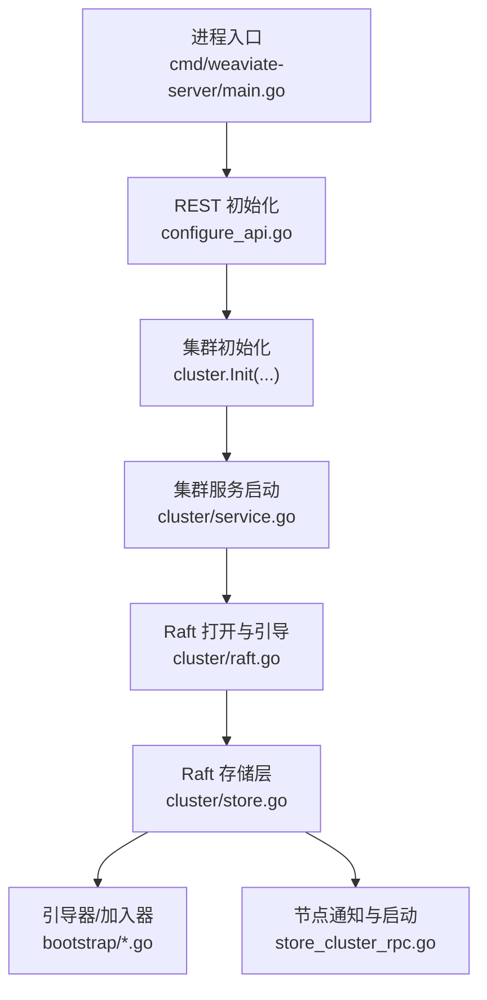
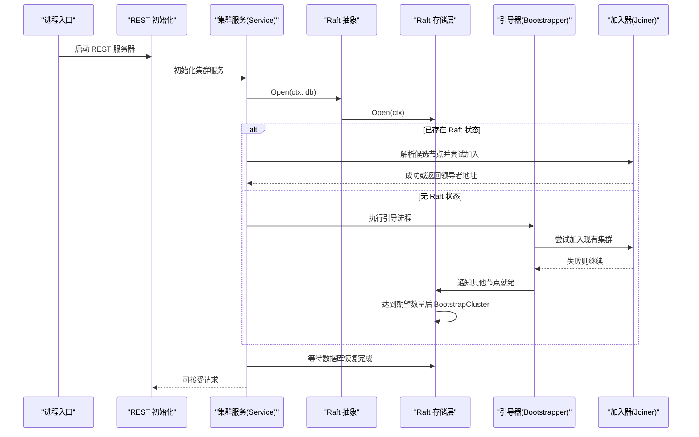
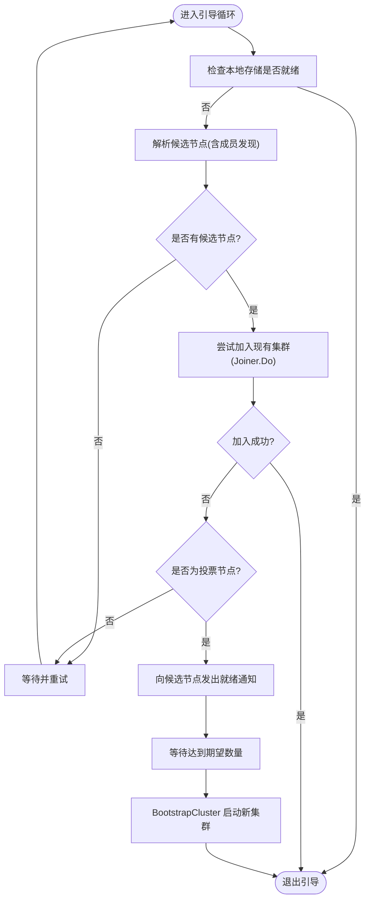
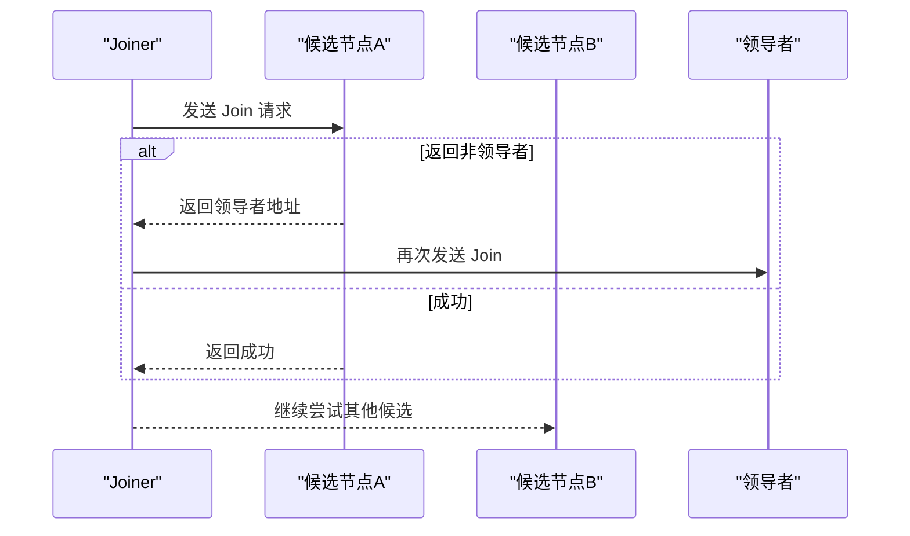
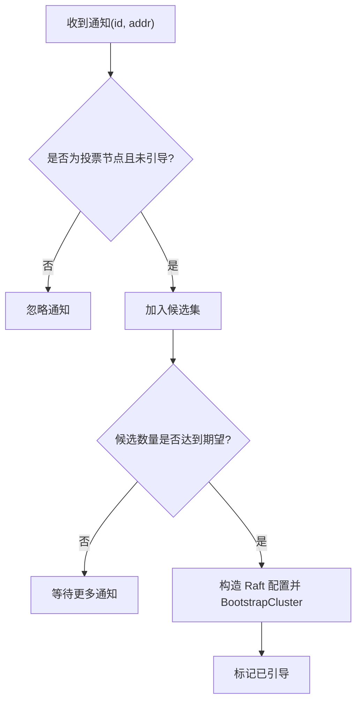
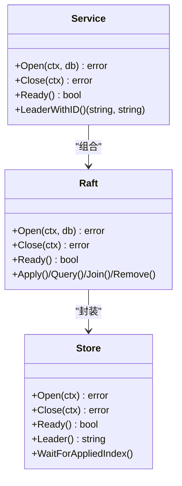
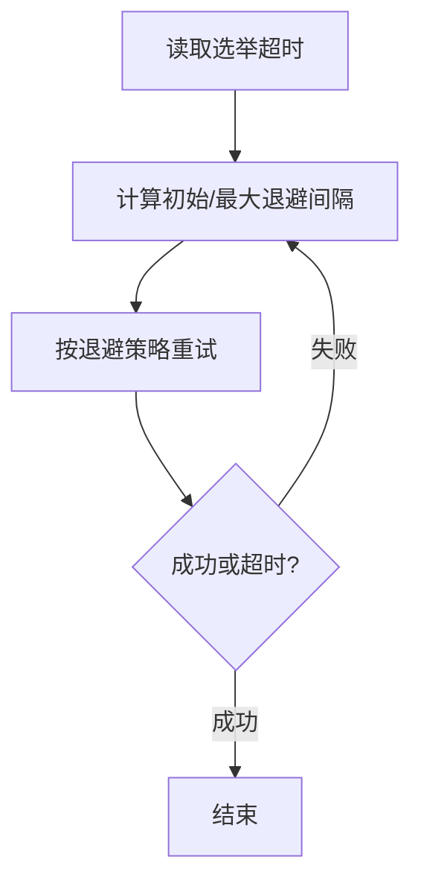
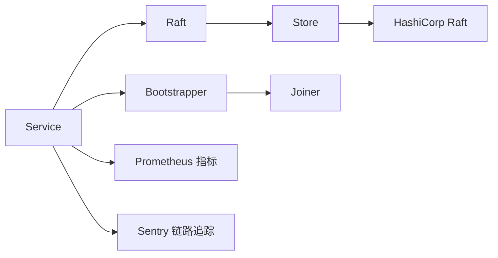

# 集群引导与启动

<cite>
**本文引用的文件**
- [cmd/weaviate-server/main.go](file://cmd/weaviate-server/main.go)
- [adapters/handlers/rest/configure_api.go](file://adapters/handlers/rest/configure_api.go)
- [cluster/service.go](file://cluster/service.go)
- [cluster/store.go](file://cluster/store.go)
- [cluster/store_cluster_rpc.go](file://cluster/store_cluster_rpc.go)
- [cluster/raft.go](file://cluster/raft.go)
- [cluster/bootstrap/bootstrap.go](file://cluster/bootstrap/bootstrap.go)
- [cluster/bootstrap/joiner.go](file://cluster/bootstrap/joiner.go)
- [cluster/backoff.go](file://cluster/backoff.go)
- [cluster/backoff_test.go](file://cluster/backoff_test.go)
</cite>

## 目录
1. [简介](#简介)
2. [项目结构](#项目结构)
3. [核心组件](#核心组件)
4. [架构总览](#架构总览)
5. [详细组件分析](#详细组件分析)
6. [依赖分析](#依赖分析)
7. [性能考虑](#性能考虑)
8. [故障排查指南](#故障排查指南)
9. [结论](#结论)
10. [附录：启动配置指南](#附录启动配置指南)

## 简介
本文件面向 Weaviate 的集群引导与启动过程，系统性阐述从单节点启动到多节点集群形成、领导者选举、新节点自动加入、节点发现与配置同步、状态一致性保障、冲突解决策略、启动错误处理与恢复机制，并提供配置指南与性能优化建议。读者可据此理解 Weaviate 在 Raft 共识协议之上的启动流程与容错设计。

## 项目结构
围绕集群引导与启动的关键模块如下：
- 启动入口与 REST API 初始化：服务进程入口负责解析命令行参数并启动 REST 服务器；REST 初始化阶段调用集群初始化逻辑。
- 集群服务与 Raft 抽象：集群服务负责启动内部 gRPC 服务、打开 Raft 存储、执行引导或重加入流程，并等待数据库恢复完成。
- Raft 存储层：封装底层 Raft 实例、日志/快照存储、TCP 传输、领导者检测与迁移、一致性等待等。
- 引导与加入：包含“引导器”（Bootstrapper）与“加入器”（Joiner），分别处理首次集群形成与加入现有集群。
- 节点通知与集群启动：当无法加入现有集群时，投票节点通过通知机制收集候选节点，达到期望数量后触发 BootstrapCluster。
- 超时与退避：根据选举超时动态配置退避策略，避免频繁重试导致的震荡。

图表来源
- [cmd/weaviate-server/main.go](file://cmd/weaviate-server/main.go#L30-L69)
- [adapters/handlers/rest/configure_api.go](file://adapters/handlers/rest/configure_api.go#L1253-L1271)
- [cluster/service.go](file://cluster/service.go#L149-L209)
- [cluster/raft.go](file://cluster/raft.go#L48-L74)
- [cluster/store.go](file://cluster/store.go#L360-L417)
- [cluster/bootstrap/bootstrap.go](file://cluster/bootstrap/bootstrap.go#L63-L130)
- [cluster/store_cluster_rpc.go](file://cluster/store_cluster_rpc.go#L53-L102)

章节来源
- [cmd/weaviate-server/main.go](file://cmd/weaviate-server/main.go#L30-L69)
- [adapters/handlers/rest/configure_api.go](file://adapters/handlers/rest/configure_api.go#L1253-L1271)

## 核心组件
- 集群服务（Service）
  - 负责启动内部 RPC 服务、打开 Raft 存储、执行引导或重加入、等待数据库恢复、在元数据 FSM 追上后启动复制引擎。
- Raft 抽象（Raft）
  - 对外暴露 Apply/Query/Join/Remove 等操作，确保在领导者节点上执行，非投票节点可在关闭前移除自身。
- Raft 存储层（Store）
  - 封装底层 Raft 实例、日志/快照/传输、领导者检测、一致性等待、旧版模式迁移、健康状态统计。
- 引导器（Bootstrapper）
  - 周期性解析远端节点地址，尝试加入现有集群；若失败且为投票节点，则向其他节点发出“就绪通知”，等待达到期望数量后共同启动。
- 加入器（Joiner）
  - 向候选节点发送 Join 请求；若收到非领导者响应则跟随至领导者再次尝试；若均失败则返回错误。
- 节点通知（Store.Notify）
  - 当候选数量达到期望值时，使用 BootstrapCluster 触发新集群启动。
- 超时与退避（backoff）
  - 根据选举超时动态配置退避策略，避免过早重试引发震荡。

章节来源
- [cluster/service.go](file://cluster/service.go#L46-L117)
- [cluster/raft.go](file://cluster/raft.go#L26-L99)
- [cluster/store.go](file://cluster/store.go#L191-L255)
- [cluster/bootstrap/bootstrap.go](file://cluster/bootstrap/bootstrap.go#L35-L61)
- [cluster/bootstrap/joiner.go](file://cluster/bootstrap/joiner.go#L27-L42)
- [cluster/store_cluster_rpc.go](file://cluster/store_cluster_rpc.go#L53-L102)
- [cluster/backoff.go](file://cluster/backoff.go#L1-L200)
- [cluster/backoff_test.go](file://cluster/backoff_test.go#L23-L53)

## 架构总览
下图展示从进程启动到集群可用的关键交互路径：

图表来源
- [adapters/handlers/rest/configure_api.go](file://adapters/handlers/rest/configure_api.go#L1253-L1271)
- [cluster/service.go](file://cluster/service.go#L149-L209)
- [cluster/raft.go](file://cluster/raft.go#L48-L74)
- [cluster/store.go](file://cluster/store.go#L360-L417)
- [cluster/bootstrap/bootstrap.go](file://cluster/bootstrap/bootstrap.go#L63-L130)
- [cluster/bootstrap/joiner.go](file://cluster/bootstrap/joiner.go#L47-L114)
- [cluster/store_cluster_rpc.go](file://cluster/store_cluster_rpc.go#L53-L102)

## 详细组件分析

### 组件一：引导器（Bootstrapper）
- 职责
  - 周期性检查本地存储是否已就绪；若未就绪则解析候选节点列表，优先尝试加入现有集群；若失败且当前节点为投票节点，则向其他节点发出“就绪通知”，等待达到期望数量后共同启动。
- 关键行为
  - 解析节点地址：结合显式配置与成员发现（memberlist）补充候选集。
  - 加入现有集群：通过 Joiner 发送 Join 请求，若收到非领导者响应则跟随至领导者再次尝试。
  - 通知其他节点：向候选节点广播“就绪通知”，用于触发新集群启动。
- 并发与停止
  - 使用定时器与停止通道实现优雅退出与上下文取消。

图表来源
- [cluster/bootstrap/bootstrap.go](file://cluster/bootstrap/bootstrap.go#L63-L130)
- [cluster/bootstrap/joiner.go](file://cluster/bootstrap/joiner.go#L47-L114)
- [cluster/store_cluster_rpc.go](file://cluster/store_cluster_rpc.go#L53-L102)

章节来源
- [cluster/bootstrap/bootstrap.go](file://cluster/bootstrap/bootstrap.go#L63-L130)
- [cluster/bootstrap/joiner.go](file://cluster/bootstrap/joiner.go#L47-L114)

### 组件二：加入器（Joiner）
- 职责
  - 向候选节点发送 Join 请求；若返回非领导者错误码，则提取领导者地址并直接向领导者发起 Join。
- 错误处理
  - 对空领导者、自指领导者等情况进行保护，避免无效重试。
- 适用场景
  - 引导阶段的“先尝试加入现有集群”步骤，以及后续重加入流程。

图表来源
- [cluster/bootstrap/joiner.go](file://cluster/bootstrap/joiner.go#L47-L114)

章节来源
- [cluster/bootstrap/joiner.go](file://cluster/bootstrap/joiner.go#L47-L114)

### 组件三：节点通知与集群启动（Store.Notify 与 BootstrapCluster）
- 职责
  - 投票节点在引导阶段通过 Notify 收集候选节点；当候选数量达到配置的期望值时，调用 BootstrapCluster 启动新集群。
- 一致性与幂等
  - 若已存在领导者或已引导完成，将忽略通知；仅在满足条件时执行一次 BootstrapCluster。
- 错误处理
  - 对“无法引导”类错误进行告警但不中断流程，允许后续重试。

图表来源
- [cluster/store_cluster_rpc.go](file://cluster/store_cluster_rpc.go#L53-L102)

章节来源
- [cluster/store_cluster_rpc.go](file://cluster/store_cluster_rpc.go#L53-L102)

### 组件四：集群服务与 Raft 抽象（Service/Raft）
- 集群服务（Service）
  - 启动内部 RPC 服务与 Raft 存储；根据是否存在历史状态决定“重加入”或“引导”路径；等待数据库恢复完成后对外提供服务。
- Raft 抽象（Raft）
  - 对外提供 Apply/Query/Join/Remove 等接口，确保在领导者节点上执行；非投票节点在关闭前移除自身以避免影响选举。

图表来源
- [cluster/service.go](file://cluster/service.go#L46-L117)
- [cluster/raft.go](file://cluster/raft.go#L26-L99)
- [cluster/store.go](file://cluster/store.go#L360-L417)

章节来源
- [cluster/service.go](file://cluster/service.go#L149-L209)
- [cluster/raft.go](file://cluster/raft.go#L48-L74)
- [cluster/store.go](file://cluster/store.go#L360-L417)

### 组件五：超时与退避策略（backoff）
- 设计目标
  - 根据选举超时动态设置初始退避间隔与最大间隔，避免在不稳定网络环境下频繁重试引发震荡。
- 测试验证
  - 提供针对不同选举超时的断言，确保初始与最大间隔符合预期比例。

图表来源
- [cluster/backoff.go](file://cluster/backoff.go#L1-L200)
- [cluster/backoff_test.go](file://cluster/backoff_test.go#L23-L53)

章节来源
- [cluster/backoff.go](file://cluster/backoff.go#L1-L200)
- [cluster/backoff_test.go](file://cluster/backoff_test.go#L23-L53)

## 依赖分析
- 组件耦合
  - Service 依赖 Raft 抽象与 Store；Raft 封装 Store；Store 依赖底层 Raft 库与日志/快照存储。
  - Bootstrapper 通过 PeerJoiner 接口与远程节点通信；Joiner 作为其子组件复用该接口。
  - Store.Notify 与 BootstrapCluster 协作完成新集群启动。
- 外部依赖
  - HashiCorp Raft、Prometheus 指标、Sentry 链路追踪等。

图表来源
- [cluster/service.go](file://cluster/service.go#L69-L117)
- [cluster/raft.go](file://cluster/raft.go#L44-L70)
- [cluster/store.go](file://cluster/store.go#L205-L225)
- [cluster/bootstrap/bootstrap.go](file://cluster/bootstrap/bootstrap.go#L29-L33)
- [cluster/bootstrap/joiner.go](file://cluster/bootstrap/joiner.go#L27-L32)

章节来源
- [cluster/service.go](file://cluster/service.go#L69-L117)
- [cluster/raft.go](file://cluster/raft.go#L44-L70)
- [cluster/store.go](file://cluster/store.go#L205-L225)
- [cluster/bootstrap/bootstrap.go](file://cluster/bootstrap/bootstrap.go#L29-L33)
- [cluster/bootstrap/joiner.go](file://cluster/bootstrap/joiner.go#L27-L32)

## 性能考虑
- 传输与 I/O
  - TCP 连接池大小与超时设置影响连接建立与请求往返时间；日志缓存容量减少磁盘 I/O。
- 快照与日志
  - 快照阈值与尾随日志配置影响恢复速度与磁盘占用；合理的快照间隔可降低日志长度。
- 一致性等待
  - 等待版本号追上时采用带超时的轮询，避免无限阻塞；可根据业务延迟调整周期与超时。
- 指标监控
  - 提供 FSM 应用耗时直方图、失败计数、最后应用索引等指标，便于定位性能瓶颈。

章节来源
- [cluster/store.go](file://cluster/store.go#L50-L66)
- [cluster/store.go](file://cluster/store.go#L257-L307)
- [cluster/store.go](file://cluster/store.go#L598-L623)

## 故障排查指南
- 启动失败回滚与重试
  - 引导阶段失败会持续重试，直至达到引导超时；可通过增大引导超时缓解短暂网络抖动。
  - 重加入阶段使用恒定退避策略，避免频繁重试；若仍失败，检查领导者地址是否正确、网络连通性与防火墙策略。
- 部分成功处理
  - 当仅部分节点恢复或领导者尚未产生时，系统会等待领导者出现并完成旧版模式迁移后再对外提供服务。
- 领导者选举与一致性
  - 若长时间无领导者，检查心跳/选举超时配置与网络延迟；必要时提高超时倍数以适应高延迟环境。
- 数据库恢复
  - 等待数据库恢复完成后再对外提供请求；若恢复时间过长，检查磁盘 I/O 与快照/日志状态。

章节来源
- [cluster/service.go](file://cluster/service.go#L171-L199)
- [cluster/store.go](file://cluster/store.go#L466-L518)
- [cluster/store.go](file://cluster/store.go#L576-L596)

## 结论
Weaviate 的集群引导与启动在 Raft 之上实现了稳健的容错与一致性保障：通过“先加入再引导”的双路径策略、基于成员发现的节点发现机制、基于期望数量的自动集群启动、以及完善的错误处理与监控指标，能够在复杂网络环境中可靠地完成单节点启动与多节点集群形成，并在领导者选举与状态同步过程中维持一致性与可用性。

## 附录：启动配置指南
- 启动参数与入口
  - 进程入口负责解析命令行参数并启动 REST 服务器；REST 初始化阶段调用集群初始化函数。
- 网络配置要点
  - Raft 与 RPC 端口需与实际监听地址一致；TCP 传输绑定地址与通告地址需正确配置。
  - 心跳/选举/领导者租约超时应结合网络延迟合理设置；生产环境建议提高超时倍数以增强鲁棒性。
- 资源限制与性能
  - 日志缓存容量、快照阈值与尾随日志、快照间隔等参数需平衡恢复速度与磁盘占用。
  - Prometheus 指标注册与日志级别配置有助于运行时观测与问题定位。
- 引导与重加入
  - 引导超时与重加入退避策略需与网络状况匹配；当存在历史状态时优先重加入，否则进入引导流程。
- 元数据只读投票节点
  - 支持将投票节点配置为仅存储元数据，不加载本地数据，以减少资源占用并提升扩展性。

章节来源
- [cmd/weaviate-server/main.go](file://cmd/weaviate-server/main.go#L30-L69)
- [adapters/handlers/rest/configure_api.go](file://adapters/handlers/rest/configure_api.go#L1253-L1271)
- [cluster/store.go](file://cluster/store.go#L68-L189)
- [cluster/service.go](file://cluster/service.go#L171-L199)
- [cluster/backoff.go](file://cluster/backoff.go#L1-L200)