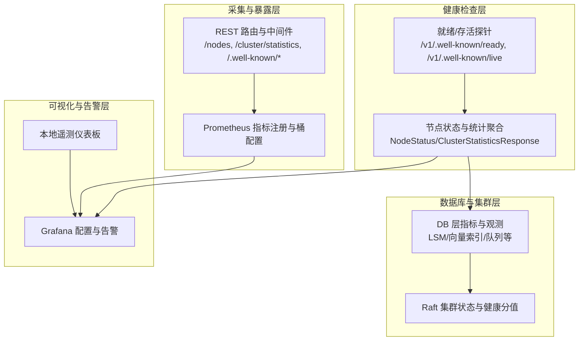
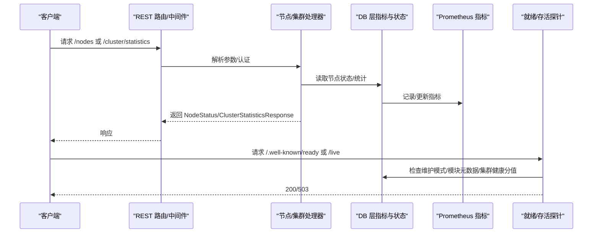
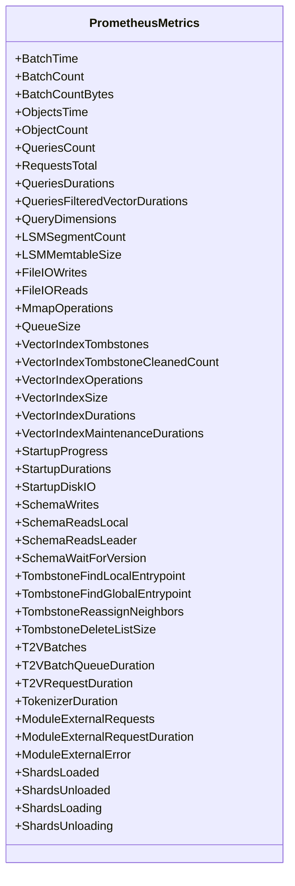
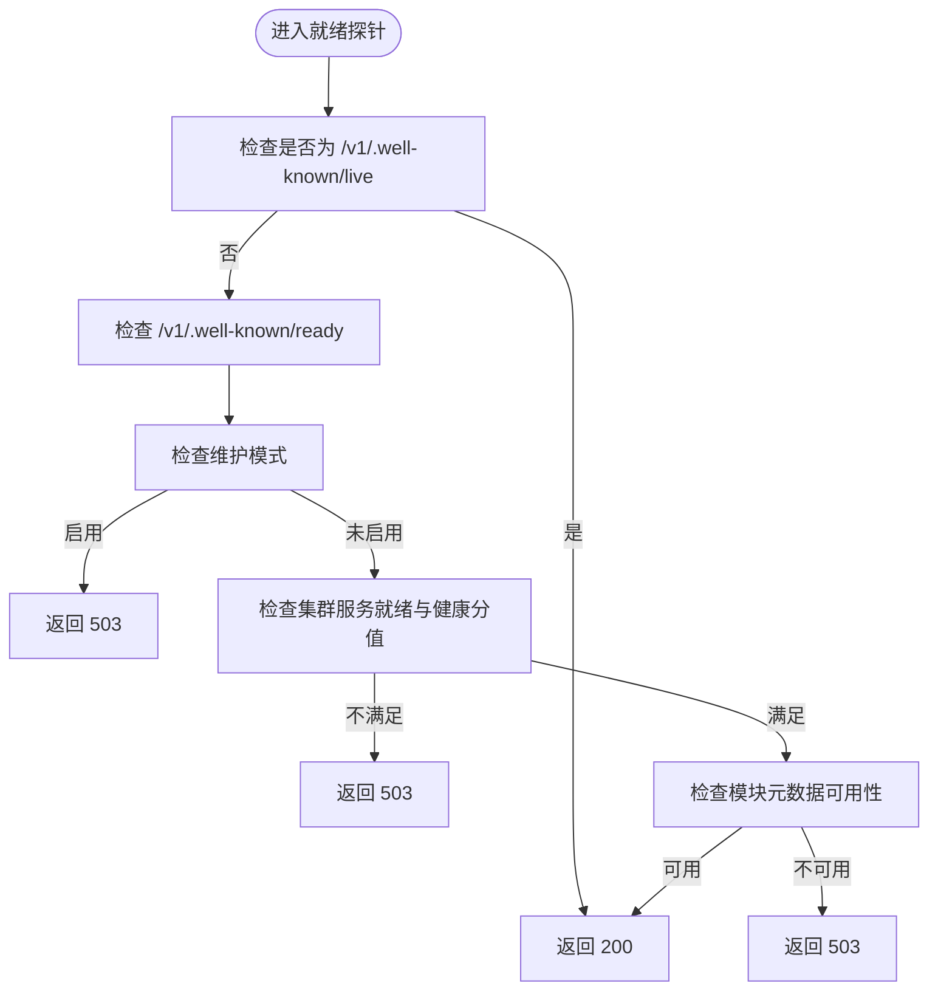
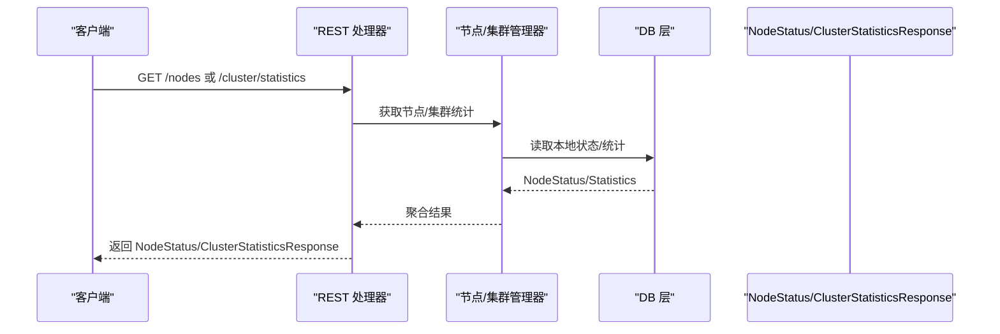
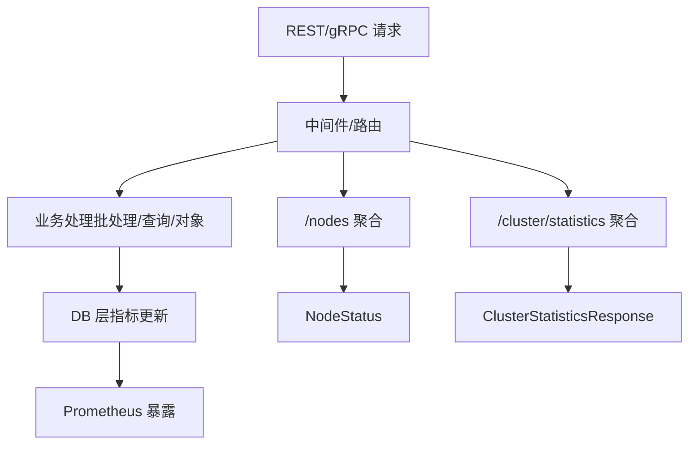
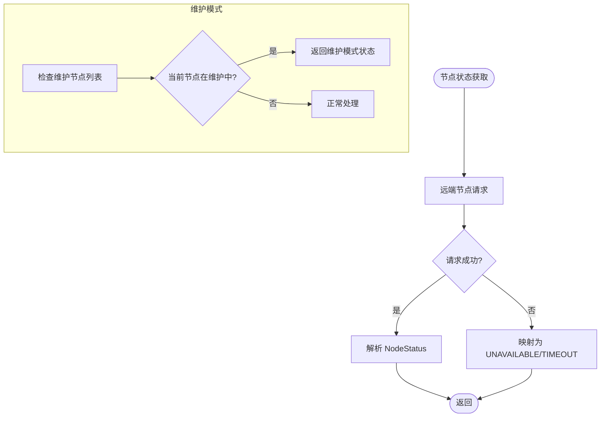
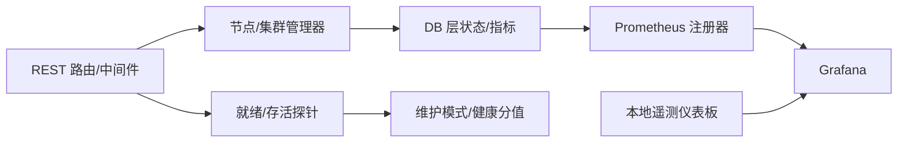

# 集群监控与健康检查

<cite>
**本文引用的文件**
- [docs/metrics.md](file://docs/metrics.md)
- [usecases/monitoring/prometheus.go](file://usecases/monitoring/prometheus.go)
- [adapters/handlers/rest/clusterapi/nodes.go](file://adapters/handlers/rest/clusterapi/nodes.go)
- [adapters/handlers/rest/handlers_nodes.go](file://adapters/handlers/rest/handlers_nodes.go)
- [adapters/handlers/rest/middlewares.go](file://adapters/handlers/rest/middlewares.go)
- [adapters/handlers/rest/operations/weaviate_wellknown_liveness_urlbuilder.go](file://adapters/handlers/rest/operations/weaviate_wellknown_liveness_urlbuilder.go)
- [adapters/handlers/rest/operations/weaviate_wellknown_readiness_urlbuilder.go](file://adapters/handlers/rest/operations/weaviate_wellknown_readiness_urlbuilder.go)
- [adapters/clients/cluster_node.go](file://adapters/clients/cluster_node.go)
- [adapters/repos/db/nodes.go](file://adapters/repos/db/nodes.go)
- [entities/models/node_status.go](file://entities/models/node_status.go)
- [entities/models/cluster_statistics_response.go](file://entities/models/cluster_statistics_response.go)
- [adapters/handlers/rest/operations/cluster/cluster_get_statistics_urlbuilder.go](file://adapters/handlers/rest/operations/cluster/cluster_get_statistics_urlbuilder.go)
- [adapters/handlers/rest/clusterapi/serve.go](file://adapters/handlers/rest/clusterapi/serve.go)
- [adapters/repos/db/metrics.go](file://adapters/repos/db/metrics.go)
- [adapters/repos/db/vector/hnsw/metrics.go](file://adapters/repos/db/vector/hnsw/metrics.go)
- [adapters/repos/db/vector/hfresh/metrics.go](file://adapters/repos/db/vector/hfresh/metrics.go)
- [usecases/replica/metrics.go](file://usecases/replica/metrics.go)
- [usecases/cluster/state.go](file://usecases/cluster/state.go)
- [tools/dev/grafana/grafana.ini](file://tools/dev/grafana/grafana.ini)
- [tools/telemetry-dashboard/main.go](file://tools/telemetry-dashboard/main.go)
- [tools/telemetry-dashboard/README.md](file://tools/telemetry-dashboard/README.md)
- [tools/dev/run_telemetry_dashboard.sh](file://tools/dev/run_telemetry_dashboard.sh)
</cite>

## 目录
1. [简介](#简介)
2. [项目结构](#项目结构)
3. [核心组件](#核心组件)
4. [架构总览](#架构总览)
5. [详细组件分析](#详细组件分析)
6. [依赖关系分析](#依赖关系分析)
7. [性能考量](#性能考量)
8. [故障排查指南](#故障排查指南)
9. [结论](#结论)
10. [附录](#附录)

## 简介
本文件面向 Weaviate 的集群监控与健康检查系统，系统性阐述以下内容：
- 集群状态监控机制：节点健康检查、服务可用性检测、性能指标采集与聚合
- 监控数据采集与存储：指标定义、采集频率与存储策略
- 健康检查实现原理：主动探测、被动监控与异常检测
- 监控告警机制：阈值设定、告警规则与通知策略
- 监控仪表板设计与配置：可视化图表、关键指标展示与趋势分析
- 性能影响与优化策略：采样率、数据压缩与存储优化

## 项目结构
Weaviate 的监控与健康检查由“指标定义层”“采集与暴露层”“健康检查层”“聚合与查询层”“可视化与告警层”构成，贯穿 REST/gRPC 处理链路、数据库层、Raft 集群层与模块层。

图示来源
- [adapters/handlers/rest/clusterapi/nodes.go](file://adapters/handlers/rest/clusterapi/nodes.go#L92-L146)
- [adapters/handlers/rest/middlewares.go](file://adapters/handlers/rest/middlewares.go#L233-L260)
- [usecases/monitoring/prometheus.go](file://usecases/monitoring/prometheus.go#L438-L939)
- [adapters/repos/db/nodes.go](file://adapters/repos/db/nodes.go#L92-L123)

章节来源
- [adapters/handlers/rest/clusterapi/nodes.go](file://adapters/handlers/rest/clusterapi/nodes.go#L92-L146)
- [adapters/handlers/rest/middlewares.go](file://adapters/handlers/rest/middlewares.go#L233-L260)
- [usecases/monitoring/prometheus.go](file://usecases/monitoring/prometheus.go#L438-L939)
- [adapters/repos/db/nodes.go](file://adapters/repos/db/nodes.go#L92-L123)

## 核心组件
- 指标体系与注册
  - 统一的 Prometheus 指标定义与注册，覆盖批处理、对象操作、查询、LSM、向量索引、启动、复制、分布式任务、HTTP/gRPC 服务器、集群存储、Schema 等维度
  - 支持按类/分片分组与关键桶策略，降低标签基数与噪声
- 健康检查与状态
  - 通过 /.well-known/live 与 /.well-known/ready 探针，结合维护模式、模块元数据可用性与集群健康分值综合判定
  - 节点状态返回包含节点名、版本、Git Hash、状态、分片与统计信息、批量统计与运行模式
- 聚合与查询
  - /nodes 与 /cluster/statistics 提供节点与集群统计聚合，支持最小/详细输出与同步一致性判断
- 可视化与告警
  - Grafana 配置项与告警执行策略
  - 本地遥测仪表板用于接收与展示来自实例的遥测数据

章节来源
- [docs/metrics.md](file://docs/metrics.md#L40-L395)
- [usecases/monitoring/prometheus.go](file://usecases/monitoring/prometheus.go#L438-L939)
- [adapters/handlers/rest/middlewares.go](file://adapters/handlers/rest/middlewares.go#L233-L260)
- [adapters/handlers/rest/clusterapi/nodes.go](file://adapters/handlers/rest/clusterapi/nodes.go#L92-L146)
- [adapters/handlers/rest/handlers_nodes.go](file://adapters/handlers/rest/handlers_nodes.go#L82-L106)
- [entities/models/node_status.go](file://entities/models/node_status.go#L204-L250)
- [tools/dev/grafana/grafana.ini](file://tools/dev/grafana/grafana.ini#L741-L806)
- [tools/telemetry-dashboard/main.go](file://tools/telemetry-dashboard/main.go#L32-L257)

## 架构总览
下图展示了从请求到指标采集、健康检查与聚合的关键交互路径。

图示来源
- [adapters/handlers/rest/clusterapi/nodes.go](file://adapters/handlers/rest/clusterapi/nodes.go#L92-L146)
- [adapters/handlers/rest/handlers_nodes.go](file://adapters/handlers/rest/handlers_nodes.go#L82-L106)
- [adapters/handlers/rest/middlewares.go](file://adapters/handlers/rest/middlewares.go#L233-L260)
- [adapters/repos/db/nodes.go](file://adapters/repos/db/nodes.go#L92-L123)

## 详细组件分析

### 指标体系与采集
- 指标分类与用途
  - 仪表板活跃指标：聚焦核心业务指标，标签有限
  - 运营活跃指标：健康/运行状态与后台进程，建议采样
  - 告警指标：最小化、基于症状的低基数指标
  - 分析指标：调试/分析，避免长期滞留于 Prometheus
  - 可废弃/已废弃：逐步迁移与清理
- 关键指标类别
  - 批处理与对象操作：批处理时延、批处理字节、对象计数、并发查询数、请求数、查询时延、过滤向量查询时延、查询维度总数
  - LSM 与文件 I/O：段数量、内存表大小、位图缓冲使用、磁盘读写字节、mmap 操作
  - 向量索引：墓碑数量、清理次数、未预期墓碑、操作总数、索引大小、维度与段总数、后台操作时延与计数、存储操作时延
  - 启动阶段：进度比例、磁盘吞吐、启动时延
  - Schema 与事务：Schema 写/读/等待版本时延
  - 模块与外部调用：模块请求总量、请求时延、批长、请求/响应大小、错误计数
  - 复制与分布式任务：复制待处理/进行中/完成/失败/取消、引擎运行状态、分布式任务运行数
  - HTTP/gRPC 服务器：请求时延、请求/响应体大小、在途请求数
  - 集群存储：FSM 应用时延/失败、最后应用索引、启动应用索引
- 采集与存储策略
  - 采用 Histogram/Simplex 摘要与 Counter/Gauge 组合，按类/分片/操作等维度标注
  - 支持按类/分片分组以降低标签基数
  - 关键桶策略减少噪声，便于成本控制

图示来源
- [usecases/monitoring/prometheus.go](file://usecases/monitoring/prometheus.go#L40-L184)
- [docs/metrics.md](file://docs/metrics.md#L40-L395)

章节来源
- [usecases/monitoring/prometheus.go](file://usecases/monitoring/prometheus.go#L438-L939)
- [docs/metrics.md](file://docs/metrics.md#L40-L395)

### 健康检查与就绪/存活探针
- 存活探针
  - 路径：/.well-known/live，直接返回 200，用于基础可达性检测
- 就绪探针
  - 路径：/.well-known/ready，综合以下因素决定状态码：
    - 维护模式：启用则返回 503
    - 集群服务就绪与健康分值：任一不满足返回 503
    - 模块元数据可用性：不可用返回 503
  - 该逻辑位于中间件中，确保所有请求均被统一处理

图示来源
- [adapters/handlers/rest/middlewares.go](file://adapters/handlers/rest/middlewares.go#L233-L260)
- [adapters/handlers/rest/operations/weaviate_wellknown_liveness_urlbuilder.go](file://adapters/handlers/rest/operations/weaviate_wellknown_liveness_urlbuilder.go#L45-L98)
- [adapters/handlers/rest/operations/weaviate_wellknown_readiness_urlbuilder.go](file://adapters/handlers/rest/operations/weaviate_wellknown_readiness_urlbuilder.go#L45-L98)

章节来源
- [adapters/handlers/rest/middlewares.go](file://adapters/handlers/rest/middlewares.go#L233-L260)
- [adapters/handlers/rest/operations/weaviate_wellknown_liveness_urlbuilder.go](file://adapters/handlers/rest/operations/weaviate_wellknown_liveness_urlbuilder.go#L45-L98)
- [adapters/handlers/rest/operations/weaviate_wellknown_readiness_urlbuilder.go](file://adapters/handlers/rest/operations/weaviate_wellknown_readiness_urlbuilder.go#L45-L98)

### 节点状态与集群统计
- 节点状态
  - 返回字段：节点名、版本、Git Hash、状态（HEALTHY/UNHEALTHY/UNAVAILABLE/TIMEOUT）、分片列表、统计信息、批量统计、运行模式
  - 当远端节点请求失败时，根据错误类型映射为 UNAVAILABLE 或 TIMEOUT
- 集群统计
  - 聚合各节点统计，计算同步一致性（基于 Raft AppliedIndex）
  - 返回结构包含 Statistics 列表与 Synchronized 标记

图示来源
- [adapters/handlers/rest/clusterapi/nodes.go](file://adapters/handlers/rest/clusterapi/nodes.go#L92-L146)
- [adapters/handlers/rest/handlers_nodes.go](file://adapters/handlers/rest/handlers_nodes.go#L82-L106)
- [adapters/repos/db/nodes.go](file://adapters/repos/db/nodes.go#L61-L123)
- [entities/models/node_status.go](file://entities/models/node_status.go#L204-L250)
- [entities/models/cluster_statistics_response.go](file://entities/models/cluster_statistics_response.go#L109-L130)

章节来源
- [adapters/handlers/rest/clusterapi/nodes.go](file://adapters/handlers/rest/clusterapi/nodes.go#L92-L146)
- [adapters/handlers/rest/handlers_nodes.go](file://adapters/handlers/rest/handlers_nodes.go#L82-L106)
- [adapters/repos/db/nodes.go](file://adapters/repos/db/nodes.go#L61-L123)
- [entities/models/node_status.go](file://entities/models/node_status.go#L204-L250)
- [entities/models/cluster_statistics_response.go](file://entities/models/cluster_statistics_response.go#L109-L130)

### 数据采集与聚合流程
- 采集点
  - REST 层：HTTP 请求时延、请求/响应体大小、在途请求数
  - gRPC 层：gRPC 请求时延、请求/响应体大小、在途请求数
  - DB 层：批处理、对象操作、查询、LSM、向量索引、启动、队列、墓碑、Schema、模块调用等
  - 复制与分布式任务：复制协调器读写成功/失败、读修复计数与失败
- 聚合点
  - /nodes：按节点聚合节点状态与统计
  - /cluster/statistics：按节点聚合统计，并基于 Raft AppliedIndex 判断同步一致性

图示来源
- [usecases/monitoring/prometheus.go](file://usecases/monitoring/prometheus.go#L214-L289)
- [adapters/repos/db/metrics.go](file://adapters/repos/db/metrics.go#L68-L86)
- [adapters/handlers/rest/clusterapi/nodes.go](file://adapters/handlers/rest/clusterapi/nodes.go#L92-L146)
- [adapters/handlers/rest/handlers_nodes.go](file://adapters/handlers/rest/handlers_nodes.go#L82-L106)

章节来源
- [usecases/monitoring/prometheus.go](file://usecases/monitoring/prometheus.go#L214-L289)
- [adapters/repos/db/metrics.go](file://adapters/repos/db/metrics.go#L68-L86)
- [adapters/handlers/rest/clusterapi/nodes.go](file://adapters/handlers/rest/clusterapi/nodes.go#L92-L146)
- [adapters/handlers/rest/handlers_nodes.go](file://adapters/handlers/rest/handlers_nodes.go#L82-L106)

### 异常检测与维护模式
- 维护模式
  - 通过配置维护节点列表，启用后该节点对外表现为可存活但不就绪，避免被调度流量
  - 本地维护模式开关与节点级维护模式管理
- 异常检测
  - 远端节点状态获取失败时，依据错误类型映射为 UNAVAILABLE 或 TIMEOUT
  - 集群健康分值大于 0 视为 UNHEALTHY

图示来源
- [adapters/repos/db/nodes.go](file://adapters/repos/db/nodes.go#L61-L84)
- [usecases/cluster/state.go](file://usecases/cluster/state.go#L500-L534)

章节来源
- [adapters/repos/db/nodes.go](file://adapters/repos/db/nodes.go#L61-L84)
- [usecases/cluster/state.go](file://usecases/cluster/state.go#L500-L534)

### 监控告警机制
- 指标分类与告警定位
  - 告警指标集中在“告警”类别，建议使用低基数标签
  - 查询时延等关键指标可作为告警触发条件
- 告警规则与通知
  - Grafana 告警执行策略与超时、重试、最小评估间隔等配置
  - 告警规则需结合业务 SLA 与历史基线设定阈值

章节来源
- [docs/metrics.md](file://docs/metrics.md#L208-L216)
- [tools/dev/grafana/grafana.ini](file://tools/dev/grafana/grafana.ini#L741-L806)

### 监控仪表板设计与配置
- 指标选择
  - 仪表板活跃指标：批处理时延、对象计数、并发查询数、请求总数、查询时延、过滤向量查询时延、LSM 段数/内存表大小、向量索引墓碑/尺寸、启动进度/时延、Schema 读写时延
- 可视化建议
  - 关键指标：查询时延分位、批处理吞吐、LSM 段增长、向量索引后台操作时延、复制/分布式任务队列长度
  - 趋势分析：按时间窗口滚动聚合，观察峰值与异常波动
- 仪表板与本地遥测
  - Grafana 作为主面板，结合本地遥测仪表板用于开发与测试环境

章节来源
- [docs/metrics.md](file://docs/metrics.md#L40-L395)
- [tools/telemetry-dashboard/main.go](file://tools/telemetry-dashboard/main.go#L32-L257)
- [tools/telemetry-dashboard/README.md](file://tools/telemetry-dashboard/README.md#L1-L47)
- [tools/dev/run_telemetry_dashboard.sh](file://tools/dev/run_telemetry_dashboard.sh#L1-L30)

## 依赖关系分析
- 组件耦合
  - REST 路由与中间件依赖节点/集群管理器与 DB 层状态
  - DB 层指标依赖 Prometheus 注册器与分组策略
  - 健康检查依赖维护模式与集群健康分值
- 外部依赖
  - Prometheus 客户端库用于指标注册与暴露
  - Grafana 用于可视化与告警
  - 本地遥测仪表板用于接收与展示遥测数据

图示来源
- [adapters/handlers/rest/clusterapi/nodes.go](file://adapters/handlers/rest/clusterapi/nodes.go#L92-L146)
- [adapters/handlers/rest/middlewares.go](file://adapters/handlers/rest/middlewares.go#L233-L260)
- [adapters/repos/db/nodes.go](file://adapters/repos/db/nodes.go#L92-L123)
- [usecases/monitoring/prometheus.go](file://usecases/monitoring/prometheus.go#L438-L939)
- [tools/telemetry-dashboard/main.go](file://tools/telemetry-dashboard/main.go#L32-L257)

章节来源
- [adapters/handlers/rest/clusterapi/nodes.go](file://adapters/handlers/rest/clusterapi/nodes.go#L92-L146)
- [adapters/handlers/rest/middlewares.go](file://adapters/handlers/rest/middlewares.go#L233-L260)
- [adapters/repos/db/nodes.go](file://adapters/repos/db/nodes.go#L92-L123)
- [usecases/monitoring/prometheus.go](file://usecases/monitoring/prometheus.go#L438-L939)
- [tools/telemetry-dashboard/main.go](file://tools/telemetry-dashboard/main.go#L32-L257)

## 性能考量
- 指标开销控制
  - 使用关键桶策略与低基数标签，避免高基数标签导致的内存与网络压力
  - 对分析型指标建议移出 Prometheus 或缩短保留周期
- 采样与聚合
  - 对高频指标采用采样与摘要，降低存储与查询成本
  - 在聚合层（/nodes、/cluster/statistics）进行一致性校验与去噪
- 存储优化
  - 合理设置抓取间隔与保留策略，避免过长保留期造成存储膨胀
  - 对只读/低频指标采用 Gauge 并限制标签组合

## 故障排查指南
- 就绪探针返回 503
  - 检查维护模式是否启用
  - 检查集群服务就绪与健康分值
  - 检查模块元数据可用性
- 节点状态异常
  - 远端节点请求失败映射为 UNAVAILABLE/TIMEOUT，检查网络连通性与目标节点状态
- 指标缺失或异常
  - 确认 Prometheus 抓取配置与注册器初始化
  - 检查分组策略与标签基数是否过高
- 告警误报/漏报
  - 校验阈值与评估间隔配置
  - 结合历史基线与业务波动调整规则

章节来源
- [adapters/handlers/rest/middlewares.go](file://adapters/handlers/rest/middlewares.go#L233-L260)
- [adapters/repos/db/nodes.go](file://adapters/repos/db/nodes.go#L61-L84)
- [tools/dev/grafana/grafana.ini](file://tools/dev/grafana/grafana.ini#L741-L806)

## 结论
Weaviate 的监控与健康检查体系通过统一的指标定义、严格的标签治理与完善的健康检查探针，实现了对节点与集群状态的可观测性。结合 Grafana 与本地遥测仪表板，可快速定位问题并制定告警策略。建议在生产环境中遵循低基数、采样与聚合的原则，持续优化抓取与保留策略，以平衡可观测性与资源消耗。

## 附录
- 指标清单与类别参考：见 [docs/metrics.md](file://docs/metrics.md#L40-L395)
- Prometheus 指标注册与桶配置：见 [usecases/monitoring/prometheus.go](file://usecases/monitoring/prometheus.go#L438-L939)
- 本地遥测仪表板使用说明：见 [tools/telemetry-dashboard/README.md](file://tools/telemetry-dashboard/README.md#L1-L47)