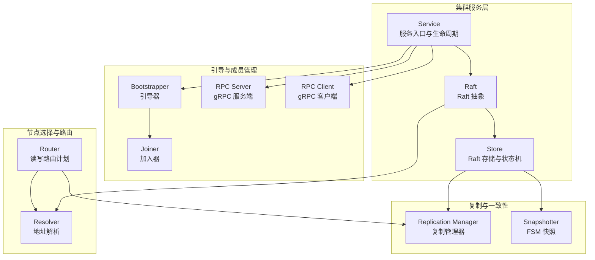
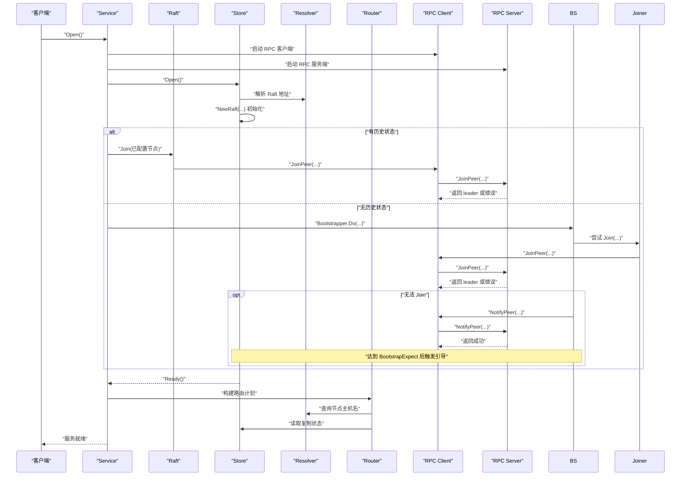
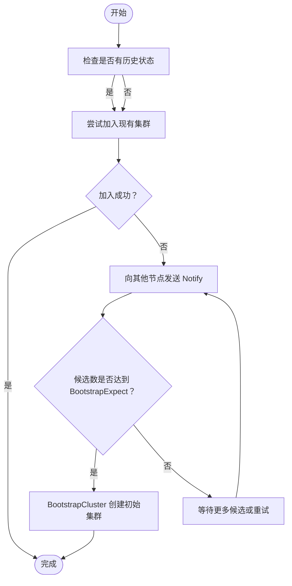
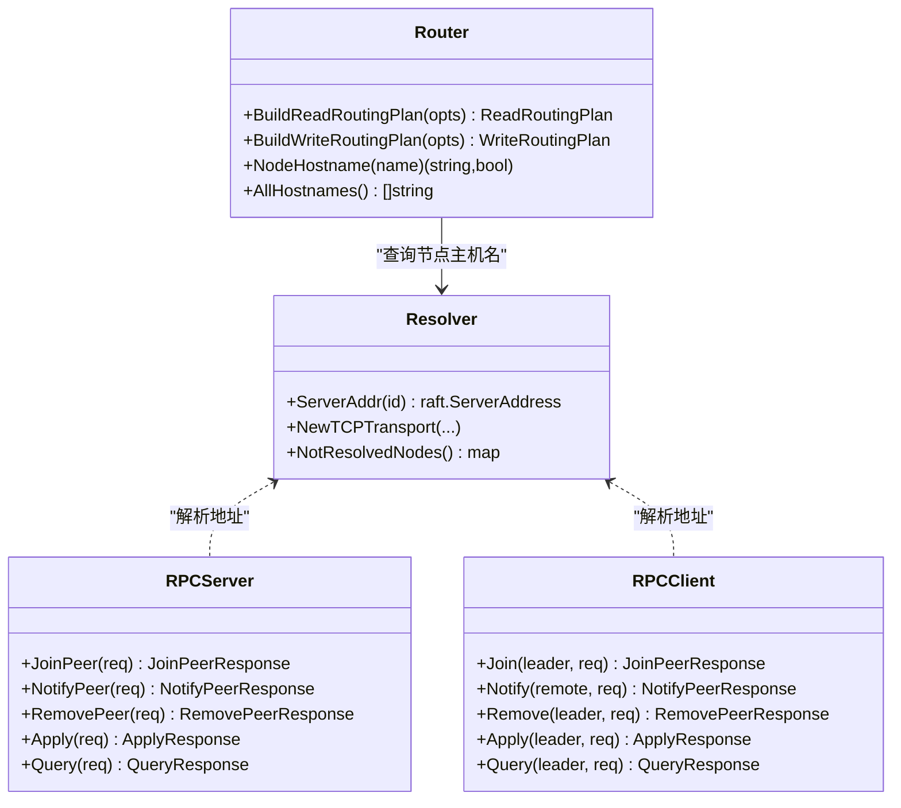
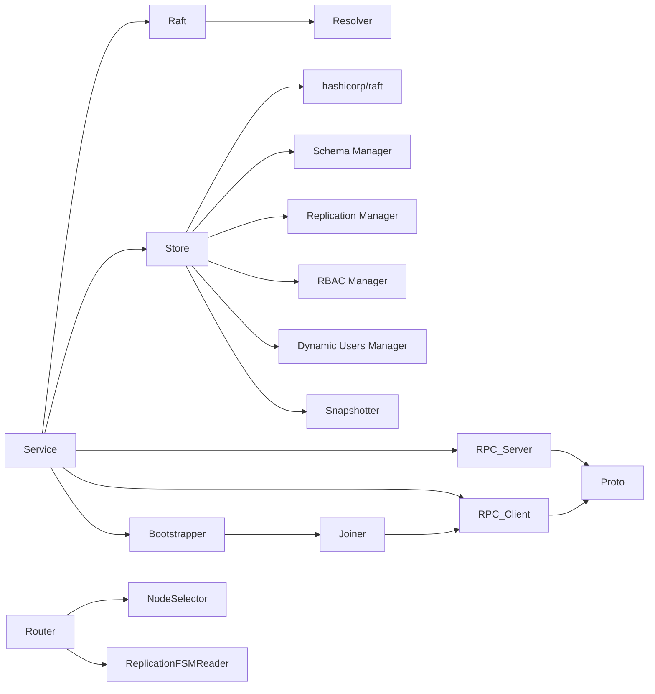

# 集群管理

<cite>
**本文引用的文件**
- [cluster/bootstrap/bootstrap.go](file://cluster/bootstrap/bootstrap.go)
- [cluster/bootstrap/joiner.go](file://cluster/bootstrap/joiner.go)
- [cluster/service.go](file://cluster/service.go)
- [cluster/store.go](file://cluster/store.go)
- [cluster/raft.go](file://cluster/raft.go)
- [cluster/rpc/client.go](file://cluster/rpc/client.go)
- [cluster/rpc/server.go](file://cluster/rpc/server.go)
- [cluster/resolver/raft.go](file://cluster/resolver/raft.go)
- [cluster/router/router.go](file://cluster/router/router.go)
- [cluster/store_cluster_rpc.go](file://cluster/store_cluster_rpc.go)
- [cluster/store_apply.go](file://cluster/store_apply.go)
- [cluster/store_query.go](file://cluster/store_query.go)
- [cluster/proto/api/message.proto](file://cluster/proto/api/message.proto)
- [cluster/fsm/snapshot.go](file://cluster/fsm/snapshot.go)
- [cluster/replication/manager.go](file://cluster/replication/manager.go)
</cite>

## 目录
1. [引言](#引言)
2. [项目结构](#项目结构)
3. [核心组件](#核心组件)
4. [架构总览](#架构总览)
5. [组件详解](#组件详解)
6. [依赖关系分析](#依赖关系分析)
7. [性能考量](#性能考量)
8. [故障排查指南](#故障排查指南)
9. [结论](#结论)
10. [附录](#附录)

## 引言
本文件系统性阐述 Weaviate 的集群管理系统，覆盖集群成员管理（节点发现、加入与离开）、集群引导流程（初始集群创建与新节点加入）、节点选择与 RPC 通信机制（客户端-服务器、请求路由与负载均衡）、集群状态监控与健康检查、故障检测与恢复、配置管理与动态成员变更、集群重组操作指南，并给出部署最佳实践、网络拓扑设计与性能优化建议，以及安全与访问控制策略。

## 项目结构
Weaviate 的集群子系统围绕 Raft 分布式一致性协议构建，采用分层设计：
- 服务入口与生命周期：Service 负责初始化 Raft、启动 RPC 服务、执行引导与关闭流程。
- Raft 抽象：Raft 封装底层 Store，统一对外提供查询与写入接口。
- 存储层：Store 实现 Raft 日志、快照、配置变更与状态机应用；负责数据库加载与一致性等待。
- 引导与成员管理：Bootstrap/Joiner 负责节点加入与引导；RPC Server/Client 提供跨节点通信。
- 节点选择与路由：Resolver 提供地址解析；Router 基于多租户/单租户场景生成读写路由计划。
- 复制与一致性：复制管理器维护副本复制状态机，支持副本扩缩容与迁移。
- 协议与快照：Proto 定义集群 RPC 接口；FSM 快照用于状态持久化与恢复。

图表来源
- [cluster/service.go](file://cluster/service.go#L69-L117)
- [cluster/raft.go](file://cluster/raft.go#L44-L46)
- [cluster/store.go](file://cluster/store.go#L309-L339)
- [cluster/bootstrap/bootstrap.go](file://cluster/bootstrap/bootstrap.go#L36-L61)
- [cluster/bootstrap/joiner.go](file://cluster/bootstrap/joiner.go#L27-L42)
- [cluster/rpc/server.go](file://cluster/rpc/server.go#L64-L82)
- [cluster/rpc/client.go](file://cluster/rpc/client.go#L126-L128)
- [cluster/resolver/raft.go](file://cluster/resolver/raft.go#L46-L56)
- [cluster/router/router.go](file://cluster/router/router.go#L39-L98)
- [cluster/replication/manager.go](file://cluster/replication/manager.go#L41-L48)
- [cluster/fsm/snapshot.go](file://cluster/fsm/snapshot.go#L40-L45)

章节来源
- [cluster/service.go](file://cluster/service.go#L69-L117)
- [cluster/store.go](file://cluster/store.go#L309-L339)
- [cluster/bootstrap/bootstrap.go](file://cluster/bootstrap/bootstrap.go#L36-L61)
- [cluster/rpc/server.go](file://cluster/rpc/server.go#L64-L82)

## 核心组件
- Service：集群服务入口，负责初始化 Raft、RPC 服务、执行引导流程、等待数据库恢复、在 FSM 追上后启动复制引擎。
- Raft：对 Store 的封装，屏蔽底层细节，统一提供查询与写入接口，并在本地即领导者时直接应用以避免网络往返。
- Store：实现 Raft 日志、快照、配置变更与状态机应用；负责数据库加载、一致性等待、领导权转移与关闭清理。
- Bootstrapper/Joiner：负责节点加入与引导，先尝试加入现有集群，失败则通知其他节点准备引导，达到期望数量后触发集群引导。
- RPC Server/Client：提供 gRPC 服务端与客户端，定义 Join/Notify/Remove/Apply/Query 等 RPC 接口，内置重试策略与错误码映射。
- Resolver：根据节点名解析 Raft 地址，支持本地与非本地场景，维护未解析节点集合。
- Router：基于单/多租户模式生成读写路由计划，结合复制状态机与节点选择器进行副本排序与一致性校验。
- Replication Manager：维护副本复制状态机，支持复制计划查询、状态更新、取消与删除等操作。
- Proto：定义 ClusterService 的 RPC 接口与消息类型，涵盖类、别名、权限、用户、复制、分布式任务等命令。
- Snapshotter：提供 FSM 快照与恢复能力，用于状态持久化与恢复。

章节来源
- [cluster/service.go](file://cluster/service.go#L48-L117)
- [cluster/raft.go](file://cluster/raft.go#L29-L46)
- [cluster/store.go](file://cluster/store.go#L194-L255)
- [cluster/bootstrap/bootstrap.go](file://cluster/bootstrap/bootstrap.go#L36-L61)
- [cluster/bootstrap/joiner.go](file://cluster/bootstrap/joiner.go#L27-L42)
- [cluster/rpc/server.go](file://cluster/rpc/server.go#L49-L82)
- [cluster/rpc/client.go](file://cluster/rpc/client.go#L102-L128)
- [cluster/resolver/raft.go](file://cluster/resolver/raft.go#L26-L56)
- [cluster/router/router.go](file://cluster/router/router.go#L39-L98)
- [cluster/replication/manager.go](file://cluster/replication/manager.go#L35-L48)
- [cluster/proto/api/message.proto](file://cluster/proto/api/message.proto#L6-L12)
- [cluster/fsm/snapshot.go](file://cluster/fsm/snapshot.go#L40-L45)

## 架构总览
下图展示从 Service 到 Store、Raft、Resolver、Router、Replication Manager 以及 RPC Server/Client 的交互关系，体现集群管理的关键路径与职责边界。

图表来源
- [cluster/service.go](file://cluster/service.go#L151-L209)
- [cluster/store.go](file://cluster/store.go#L363-L417)
- [cluster/bootstrap/bootstrap.go](file://cluster/bootstrap/bootstrap.go#L64-L130)
- [cluster/bootstrap/joiner.go](file://cluster/bootstrap/joiner.go#L47-L114)
- [cluster/rpc/client.go](file://cluster/rpc/client.go#L134-L141)
- [cluster/rpc/server.go](file://cluster/rpc/server.go#L86-L93)
- [cluster/resolver/raft.go](file://cluster/resolver/raft.go#L60-L85)
- [cluster/router/router.go](file://cluster/router/router.go#L196-L210)

## 组件详解

### 成员管理与引导流程
- 节点发现：通过 Resolver 将节点名解析为 Raft 地址；同时利用成员列表补充 join 配置不完整的情况。
- 加入流程：优先尝试向候选节点发送 JoinPeer 请求；若返回“非领导者”错误且携带 leader 地址，则转而向该 leader 发起加入。
- 引导流程：当节点无历史状态且为投票节点时，先尝试 Join，失败则通过 NotifyPeer 通知其他节点准备引导；当收到的候选数达到 BootstrapExpect 时，调用 BootstrapCluster 完成初始集群创建。
- 关闭流程：非投票节点在关闭前会主动从集群移除自身，确保不影响选举。

图表来源
- [cluster/bootstrap/bootstrap.go](file://cluster/bootstrap/bootstrap.go#L64-L130)
- [cluster/bootstrap/joiner.go](file://cluster/bootstrap/joiner.go#L47-L114)
- [cluster/store_cluster_rpc.go](file://cluster/store_cluster_rpc.go#L56-L102)

章节来源
- [cluster/bootstrap/bootstrap.go](file://cluster/bootstrap/bootstrap.go#L64-L130)
- [cluster/bootstrap/joiner.go](file://cluster/bootstrap/joiner.go#L47-L114)
- [cluster/store_cluster_rpc.go](file://cluster/store_cluster_rpc.go#L26-L102)

### 节点选择与 RPC 通信
- 地址解析：Resolver 根据节点名与端口映射解析 Raft 地址，支持本地与非本地场景，并维护未解析节点集合。
- RPC 服务端：提供 JoinPeer/NotifyPeer/RemovePeer/Apply/Query 等方法；对错误进行标准化映射，便于客户端识别。
- RPC 客户端：封装 gRPC 客户端连接，自动解析 leader 地址并缓存连接；针对不同 RPC 类型设置不同的重试策略与超时参数。
- 请求路由：Router 在单/多租户模式下生成读写路由计划，结合复制状态机与节点选择器进行副本排序与一致性校验。

图表来源
- [cluster/resolver/raft.go](file://cluster/resolver/raft.go#L60-L113)
- [cluster/rpc/server.go](file://cluster/rpc/server.go#L86-L132)
- [cluster/rpc/client.go](file://cluster/rpc/client.go#L134-L280)
- [cluster/router/router.go](file://cluster/router/router.go#L196-L407)

章节来源
- [cluster/resolver/raft.go](file://cluster/resolver/raft.go#L60-L113)
- [cluster/rpc/server.go](file://cluster/rpc/server.go#L86-L132)
- [cluster/rpc/client.go](file://cluster/rpc/client.go#L134-L280)
- [cluster/router/router.go](file://cluster/router/router.go#L196-L407)

### 状态监控、健康检查与故障检测
- Store.Ready：综合判断节点是否已打开、数据库是否加载完成、是否存在有效 leader。
- Store.Stats：聚合 Raft 统计信息、leader 地址/ID、候选节点、最后应用索引等，便于运维观测。
- NotLeader 错误码：RPC Server 对 ErrNotLeader/ErrLeaderNotFound 映射为 gRPC ResourceExhausted，客户端据此重定向到正确 leader。
- 一致性等待：Store.WaitForAppliedIndex 等待指定版本在节点上应用，保障读一致性。
- 故障检测：Resolver 维护未解析节点集合，便于定位网络问题；Raft 配置项可调整心跳/选举/租约超时以适应网络环境。

章节来源
- [cluster/store.go](file://cluster/store.go#L572-L708)
- [cluster/rpc/server.go](file://cluster/rpc/server.go#L188-L209)
- [cluster/resolver/raft.go](file://cluster/resolver/raft.go#L106-L113)

### 配置管理与动态成员变更
- 配置项：包括工作目录、节点 ID/主机、绑定地址、Raft/RPC 端口、消息大小限制、超时与快照参数、投票节点与元数据仅投票节点、BootstrapExpect/Timeout、授权控制器、复制引擎参数等。
- 动态成员变更：通过 Join/Remove RPC 将节点加入/移除 Raft 集群；非投票节点可在关闭前自动移除。
- 集群重组：通过复制管理器提供的查询与状态更新接口，结合 Router 的路由计划，实现副本扩缩容与迁移。

章节来源
- [cluster/store.go](file://cluster/store.go#L68-L189)
- [cluster/store_cluster_rpc.go](file://cluster/store_cluster_rpc.go#L26-L51)
- [cluster/replication/manager.go](file://cluster/replication/manager.go#L337-L436)

### 安全与访问控制
- RBAC：通过 Store 内部的 RBAC 管理器维护角色与权限，Query/Apply 命令支持权限查询与更新。
- 动态用户：支持动态用户创建、删除、密钥轮换、挂起/激活等操作。
- 访问控制：Router 在多租户模式下校验租户存在与活动状态，确保隔离与一致性。

章节来源
- [cluster/store_apply.go](file://cluster/store_apply.go#L270-L310)
- [cluster/store_query.go](file://cluster/store_query.go#L74-L113)
- [cluster/router/router.go](file://cluster/router/router.go#L482-L537)

## 依赖关系分析
- Service 依赖 Raft、Store、RPC Server/Client、Resolver、Replication Manager、Snapshotter。
- Store 依赖 Raft 库、Schema/Replication/RBAC/DynUsers 管理器、Snapshotter。
- Bootstrapper/Joiner 依赖 RPC Client 与 Resolver。
- Router 依赖 NodeSelector、Schema Reader、Replication FSM Reader。
- RPC Server/Client 依赖 Proto 定义的消息类型与 gRPC 框架。

图表来源
- [cluster/service.go](file://cluster/service.go#L69-L117)
- [cluster/store.go](file://cluster/store.go#L309-L339)
- [cluster/bootstrap/bootstrap.go](file://cluster/bootstrap/bootstrap.go#L36-L61)
- [cluster/bootstrap/joiner.go](file://cluster/bootstrap/joiner.go#L27-L42)
- [cluster/rpc/server.go](file://cluster/rpc/server.go#L64-L82)
- [cluster/rpc/client.go](file://cluster/rpc/client.go#L126-L128)
- [cluster/resolver/raft.go](file://cluster/resolver/raft.go#L46-L56)
- [cluster/router/router.go](file://cluster/router/router.go#L39-L98)
- [cluster/replication/manager.go](file://cluster/replication/manager.go#L41-L48)
- [cluster/proto/api/message.proto](file://cluster/proto/api/message.proto#L6-L12)

章节来源
- [cluster/service.go](file://cluster/service.go#L69-L117)
- [cluster/store.go](file://cluster/store.go#L309-L339)

## 性能考量
- RPC 重试策略：Apply/Query 使用较高重试次数与较长回退时间，Join/Remove/Notify 使用较低重试次数与较短回退时间，避免在不可达节点上浪费资源。
- gRPC 最大消息大小：通过配置项设置最大接收消息大小，确保大查询与批量操作顺利传输。
- Raft 超时与快照：合理设置心跳/选举/租约超时与快照阈值/间隔，平衡一致性与性能；可按集群规模与网络延迟调整超时倍数。
- 复制引擎：通过复制引擎的最大工作线程数与异步等待时间控制复制吞吐与资源占用。
- 路由与一致性：Router 在读写路由中结合一致性级别与副本状态，减少不必要的重试与失败。

章节来源
- [cluster/rpc/client.go](file://cluster/rpc/client.go#L30-L93)
- [cluster/store.go](file://cluster/store.go#L88-L123)
- [cluster/router/router.go](file://cluster/router/router.go#L338-L407)

## 故障排查指南
- 无法加入集群：检查 JoinPeer 返回的 leader 地址与 NotLeader 错误码，确认目标节点是否为 leader；查看日志中“尝试加入并失败”的记录。
- 引导失败：确认 BootstrapExpect 与候选节点数量；检查 NotifyPeer 是否被正确处理；查看 BootstrapCluster 的返回错误。
- 一致性等待超时：增大 ConsistencyWaitTimeout 或检查目标版本是否已提交；确认 Raft 配置与网络延迟。
- 未解析节点：使用 Resolver.NotResolvedNodes 获取未解析节点集合，排查 DNS/网络连通性。
- 复制异常：通过复制管理器的查询接口获取复制操作详情与状态，必要时触发取消或强制删除操作。

章节来源
- [cluster/bootstrap/joiner.go](file://cluster/bootstrap/joiner.go#L79-L112)
- [cluster/rpc/server.go](file://cluster/rpc/server.go#L188-L209)
- [cluster/store_cluster_rpc.go](file://cluster/store_cluster_rpc.go#L56-L102)
- [cluster/resolver/raft.go](file://cluster/resolver/raft.go#L106-L113)
- [cluster/replication/manager.go](file://cluster/replication/manager.go#L122-L245)

## 结论
Weaviate 的集群管理以 Raft 为核心，结合 RPC 通信、节点选择与路由、复制状态机与快照机制，实现了高可用、可扩展的分布式架构。通过清晰的引导流程、完善的错误处理与可观测性指标，系统能够在复杂网络环境中保持一致性与稳定性。配合合理的部署与性能调优策略，可满足生产级的集群管理需求。

## 附录
- 部署最佳实践
  - 确保各节点间网络连通与 DNS 解析稳定；在容器/云环境中使用稳定的主机名与端口映射。
  - 合理设置 BootstrapExpect 与超时参数，避免因网络抖动导致的反复引导。
  - 使用非投票节点作为边缘节点，减少对选举的影响；在关闭时自动移除非投票节点。
- 网络拓扑设计
  - 将投票节点分布在不同可用区/机架，降低单点故障风险。
  - 控制 RPC 与 Raft 端口的暴露范围，结合防火墙策略限制访问。
- 性能优化建议
  - 根据集群规模与网络延迟调整 Raft 超时与快照参数；启用合适的快照阈值与间隔。
  - 合理配置复制引擎的工作线程数与异步等待时间，避免资源争用。
  - 使用 Router 的一致性级别与副本排序策略，减少读写路径上的重试与失败。