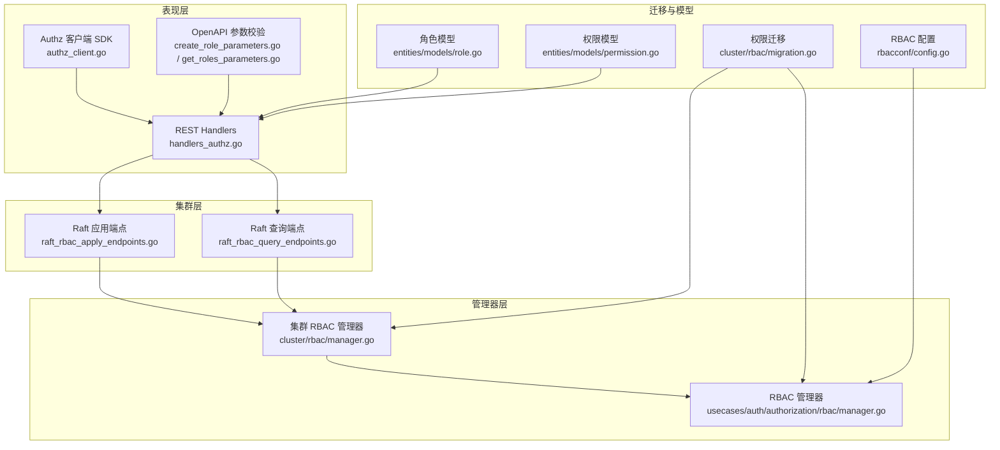
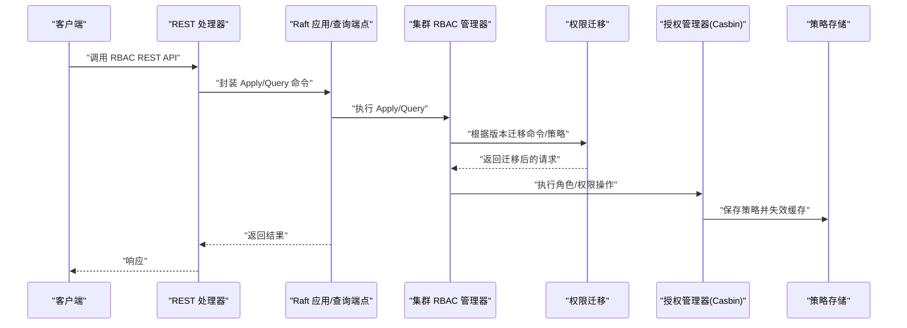
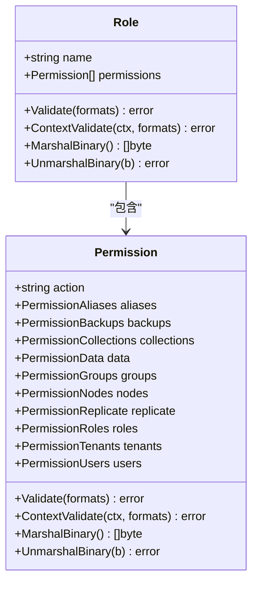
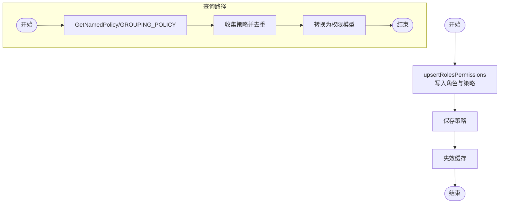
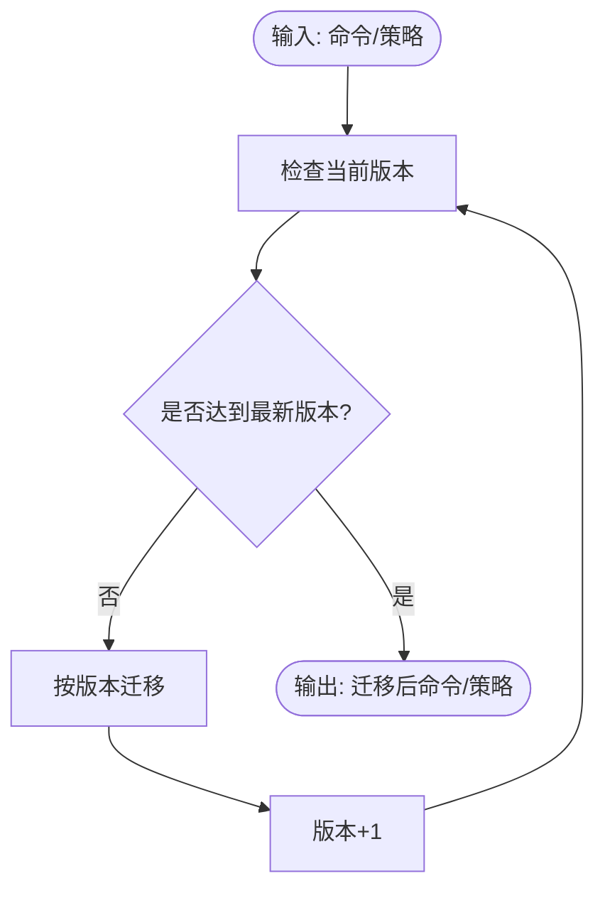
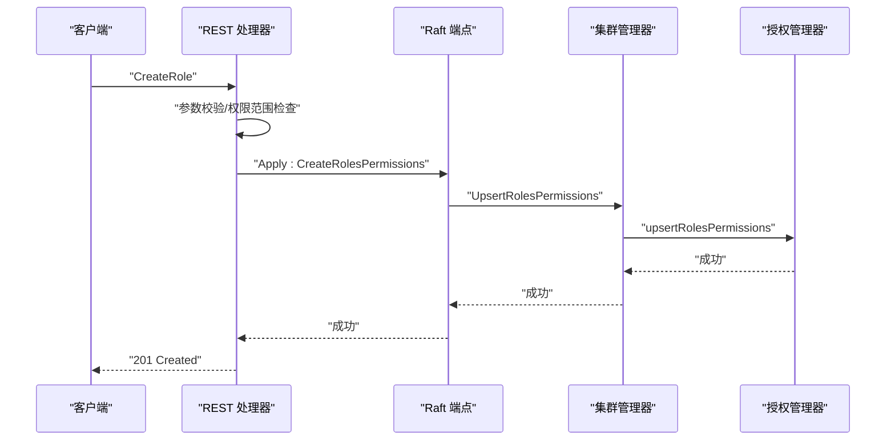
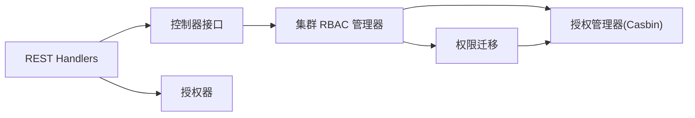

# RBAC 授权管理

<cite>
**本文引用的文件**
- [cluster/rbac/manager.go](file://cluster/rbac/manager.go)
- [cluster/rbac/migration.go](file://cluster/rbac/migration.go)
- [cluster/rbac/migration_test.go](file://cluster/rbac/migration_test.go)
- [usecases/auth/authorization/rbac/manager.go](file://usecases/auth/authorization/rbac/manager.go)
- [adapters/handlers/rest/authz/handlers_authz.go](file://adapters/handlers/rest/authz/handlers_authz.go)
- [adapters/handlers/rest/operations/authz/create_role_parameters.go](file://adapters/handlers/rest/operations/authz/create_role_parameters.go)
- [adapters/handlers/rest/operations/authz/get_roles_parameters.go](file://adapters/handlers/rest/operations/authz/get_roles_parameters.go)
- [client/authz/authz_client.go](file://client/authz/authz_client.go)
- [entities/models/role.go](file://entities/models/role.go)
- [entities/models/permission.go](file://entities/models/permission.go)
- [usecases/auth/authorization/rbac/rbacconf/config.go](file://usecases/auth/authorization/rbac/rbacconf/config.go)
- [cluster/raft_rbac_apply_endpoints.go](file://cluster/raft_rbac_apply_endpoints.go)
- [cluster/raft_rbac_query_endpoints.go](file://cluster/raft_rbac_query_endpoints.go)
</cite>

## 目录
1. [简介](#简介)
2. [项目结构](#项目结构)
3. [核心组件](#核心组件)
4. [架构总览](#架构总览)
5. [详细组件分析](#详细组件分析)
6. [依赖关系分析](#依赖关系分析)
7. [性能考量](#性能考量)
8. [故障排查指南](#故障排查指南)
9. [结论](#结论)
10. [附录：API 接口与配置示例](#附录api-接口与配置示例)

## 简介
本技术文档围绕 Weaviate 的基于角色的访问控制（RBAC）系统进行深入解析，覆盖角色定义、权限分配与继承、用户与角色关联、权限迁移与版本兼容、以及完整的 REST/gRPC 接口说明。文档同时提供面向系统管理员与安全工程师的最佳实践建议与排障指引。

## 项目结构
RBAC 相关能力由多层协作构成：
- 协议与命令层：集群层通过 Raft Apply/Query 命令对 RBAC 状态进行变更与查询，使用统一的命令协议与版本化策略。
- 管理器层：授权管理器负责将模型转换为策略、执行策略增删改查、快照与恢复，并与底层授权引擎交互。
- 迁移层：针对历史版本的策略与命令进行自动迁移，确保跨版本兼容。
- 表现层：REST Handlers 对外暴露 RBAC API；客户端 SDK 提供调用入口；OpenAPI 参数校验保障请求合法性。
- 数据模型层：Role 与 Permission 模型定义了角色与权限的数据结构及校验规则。

图表来源
- [adapters/handlers/rest/authz/handlers_authz.go](file://adapters/handlers/rest/authz/handlers_authz.go#L65-L102)
- [client/authz/authz_client.go](file://client/authz/authz_client.go#L26-L81)
- [cluster/raft_rbac_apply_endpoints.go](file://cluster/raft_rbac_apply_endpoints.go#L24-L127)
- [cluster/raft_rbac_query_endpoints.go](file://cluster/raft_rbac_query_endpoints.go#L25-L171)
- [usecases/auth/authorization/rbac/manager.go](file://usecases/auth/authorization/rbac/manager.go#L40-L56)
- [cluster/rbac/manager.go](file://cluster/rbac/manager.go#L31-L40)
- [cluster/rbac/migration.go](file://cluster/rbac/migration.go#L28-L72)
- [entities/models/role.go](file://entities/models/role.go#L29-L41)
- [entities/models/permission.go](file://entities/models/permission.go#L29-L68)
- [usecases/auth/authorization/rbac/rbacconf/config.go](file://usecases/auth/authorization/rbac/rbacconf/config.go#L16-L24)

章节来源
- [adapters/handlers/rest/authz/handlers_authz.go](file://adapters/handlers/rest/authz/handlers_authz.go#L65-L102)
- [client/authz/authz_client.go](file://client/authz/authz_client.go#L26-L81)
- [cluster/raft_rbac_apply_endpoints.go](file://cluster/raft_rbac_apply_endpoints.go#L24-L127)
- [cluster/raft_rbac_query_endpoints.go](file://cluster/raft_rbac_query_endpoints.go#L25-L171)
- [usecases/auth/authorization/rbac/manager.go](file://usecases/auth/authorization/rbac/manager.go#L40-L56)
- [cluster/rbac/manager.go](file://cluster/rbac/manager.go#L31-L40)
- [cluster/rbac/migration.go](file://cluster/rbac/migration.go#L28-L72)
- [entities/models/role.go](file://entities/models/role.go#L29-L41)
- [entities/models/permission.go](file://entities/models/permission.go#L29-L68)
- [usecases/auth/authorization/rbac/rbacconf/config.go](file://usecases/auth/authorization/rbac/rbacconf/config.go#L16-L24)

## 核心组件
- 角色与权限数据模型
  - 角色模型包含名称与权限列表，具备必填校验与序列化支持。
  - 权限模型定义了动作枚举与各域资源限定（备份、数据、节点、角色、集合、租户、用户、复制、别名等），并提供上下文校验。
- 授权管理器
  - 负责将角色与权限写入底层授权引擎（如 Casbin），并提供查询、删除、缓存失效、快照/恢复等能力。
  - 支持按角色范围（全部/匹配）的授权策略，用于限制角色创建与修改权限的范围。
- 集群 RBAC 管理器
  - 将 REST 请求映射为集群命令（Apply/Query），并执行迁移与版本兼容处理。
  - 提供快照与恢复能力，确保在 Raft 集群中一致持久化 RBAC 状态。
- 权限迁移
  - 针对不同版本的命令与策略进行自动迁移，保证历史数据与新版本行为一致。
- REST Handlers 与客户端
  - 对外暴露完整的 RBAC REST API，包含角色 CRUD、权限增删、角色分配/撤销、用户/组查询等。
  - 客户端 SDK 提供统一的调用入口与参数构建。

章节来源
- [entities/models/role.go](file://entities/models/role.go#L29-L41)
- [entities/models/permission.go](file://entities/models/permission.go#L29-L68)
- [usecases/auth/authorization/rbac/manager.go](file://usecases/auth/authorization/rbac/manager.go#L40-L56)
- [cluster/rbac/manager.go](file://cluster/rbac/manager.go#L31-L40)
- [cluster/rbac/migration.go](file://cluster/rbac/migration.go#L28-L72)
- [adapters/handlers/rest/authz/handlers_authz.go](file://adapters/handlers/rest/authz/handlers_authz.go#L128-L178)
- [client/authz/authz_client.go](file://client/authz/authz_client.go#L43-L81)

## 架构总览
下图展示了从 REST 到集群再到授权引擎的整体流程，以及迁移与版本兼容如何贯穿其中。

图表来源
- [adapters/handlers/rest/authz/handlers_authz.go](file://adapters/handlers/rest/authz/handlers_authz.go#L128-L178)
- [cluster/raft_rbac_apply_endpoints.go](file://cluster/raft_rbac_apply_endpoints.go#L24-L127)
- [cluster/raft_rbac_query_endpoints.go](file://cluster/raft_rbac_query_endpoints.go#L25-L171)
- [cluster/rbac/manager.go](file://cluster/rbac/manager.go#L157-L201)
- [cluster/rbac/migration.go](file://cluster/rbac/migration.go#L28-L72)
- [usecases/auth/authorization/rbac/manager.go](file://usecases/auth/authorization/rbac/manager.go#L115-L135)

## 详细组件分析

### 组件一：角色与权限模型
- 角色模型
  - 字段：名称（必填）、权限列表（必填）
  - 校验：名称必填、权限列表必填；支持上下文校验
- 权限模型
  - 动作枚举覆盖备份、集群、数据、节点、角色、集合、租户、用户、复制、别名等域
  - 各域可指定资源范围（集合、租户、对象、分片、别名等）
  - 提供序列化与反序列化支持

图表来源
- [entities/models/role.go](file://entities/models/role.go#L29-L41)
- [entities/models/permission.go](file://entities/models/permission.go#L29-L68)

章节来源
- [entities/models/role.go](file://entities/models/role.go#L29-L41)
- [entities/models/permission.go](file://entities/models/permission.go#L29-L68)

### 组件二：授权管理器（Casbin 集成）
- 初始化与配置
  - 通过配置初始化授权引擎，支持预定义角色与环境配置应用。
- 核心能力
  - 创建/更新角色与权限：将角色与策略写入引擎并保存策略、失效缓存。
  - 查询角色与权限：支持按角色名或全量查询，聚合策略并转换为权限模型。
  - 删除角色：移除策略与角色分配，保持幂等。
  - 用户/组与角色关联：添加/撤销用户或组的角色，支持前缀规范化。
  - 快照/恢复：序列化策略与分组策略，支持版本升级与环境配置重载。
  - 权限检查：先检查组权限，再检查用户权限，确保继承链正确。

图表来源
- [usecases/auth/authorization/rbac/manager.go](file://usecases/auth/authorization/rbac/manager.go#L115-L135)
- [usecases/auth/authorization/rbac/manager.go](file://usecases/auth/authorization/rbac/manager.go#L137-L189)

章节来源
- [usecases/auth/authorization/rbac/manager.go](file://usecases/auth/authorization/rbac/manager.go#L40-L56)
- [usecases/auth/authorization/rbac/manager.go](file://usecases/auth/authorization/rbac/manager.go#L115-L135)
- [usecases/auth/authorization/rbac/manager.go](file://usecases/auth/authorization/rbac/manager.go#L137-L189)
- [usecases/auth/authorization/rbac/manager.go](file://usecases/auth/authorization/rbac/manager.go#L224-L251)
- [usecases/auth/authorization/rbac/manager.go](file://usecases/auth/authorization/rbac/manager.go#L253-L275)
- [usecases/auth/authorization/rbac/manager.go](file://usecases/auth/authorization/rbac/manager.go#L304-L332)
- [usecases/auth/authorization/rbac/manager.go](file://usecases/auth/authorization/rbac/manager.go#L356-L438)

### 组件三：集群 RBAC 管理器与迁移
- 集群管理器职责
  - 将查询与应用请求封装为命令，调用授权管理器执行。
  - 执行迁移与版本兼容处理，确保旧版本策略与新版本语义一致。
  - 提供快照与恢复能力，便于一致性复制与恢复。
- 权限迁移策略
  - 版本循环：逐版本迁移，直到达到最新版本。
  - 角色权限迁移：将旧版“管理”语义拆分为独立的增删改权限，为用户域的“更新”赋予新的组合语义。
  - 分配/撤销迁移：将旧版用户 ID 映射为带认证类型的前缀形式，适配多认证类型场景。

图表来源
- [cluster/rbac/migration.go](file://cluster/rbac/migration.go#L28-L72)
- [cluster/rbac/migration.go](file://cluster/rbac/migration.go#L138-L170)
- [cluster/rbac/migration.go](file://cluster/rbac/migration.go#L240-L264)

章节来源
- [cluster/rbac/manager.go](file://cluster/rbac/manager.go#L157-L201)
- [cluster/rbac/manager.go](file://cluster/rbac/manager.go#L203-L213)
- [cluster/rbac/manager.go](file://cluster/rbac/manager.go#L215-L235)
- [cluster/rbac/manager.go](file://cluster/rbac/manager.go#L237-L259)
- [cluster/rbac/manager.go](file://cluster/rbac/manager.go#L261-L281)
- [cluster/rbac/manager.go](file://cluster/rbac/manager.go#L283-L300)
- [cluster/rbac/migration.go](file://cluster/rbac/migration.go#L28-L72)
- [cluster/rbac/migration.go](file://cluster/rbac/migration.go#L138-L170)
- [cluster/rbac/migration.go](file://cluster/rbac/migration.go#L240-L264)

### 组件四：REST API 与客户端
- REST Handlers
  - 角色：创建、删除、查询、添加/移除权限、检查权限。
  - 用户/组：分配/撤销角色、查询某用户/组的角色、查询某角色的用户/组。
  - 参数校验：角色名长度与正则、权限实体校验、用户存在性校验等。
- 客户端 SDK
  - 提供完整的 RBAC API 方法，包括角色、权限、用户/组分配等。

图表来源
- [adapters/handlers/rest/authz/handlers_authz.go](file://adapters/handlers/rest/authz/handlers_authz.go#L128-L178)
- [adapters/handlers/rest/operations/authz/create_role_parameters.go](file://adapters/handlers/rest/operations/authz/create_role_parameters.go#L39-L53)
- [client/authz/authz_client.go](file://client/authz/authz_client.go#L206-L245)
- [cluster/raft_rbac_apply_endpoints.go](file://cluster/raft_rbac_apply_endpoints.go#L24-L50)
- [cluster/rbac/manager.go](file://cluster/rbac/manager.go#L157-L201)
- [usecases/auth/authorization/rbac/manager.go](file://usecases/auth/authorization/rbac/manager.go#L115-L135)

章节来源
- [adapters/handlers/rest/authz/handlers_authz.go](file://adapters/handlers/rest/authz/handlers_authz.go#L128-L178)
- [adapters/handlers/rest/operations/authz/create_role_parameters.go](file://adapters/handlers/rest/operations/authz/create_role_parameters.go#L39-L53)
- [adapters/handlers/rest/operations/authz/get_roles_parameters.go](file://adapters/handlers/rest/operations/authz/get_roles_parameters.go#L34-L42)
- [client/authz/authz_client.go](file://client/authz/authz_client.go#L43-L81)

## 依赖关系分析
- 组件耦合
  - REST Handlers 依赖控制器接口与授权器，确保业务逻辑与授权策略解耦。
  - 集群管理器依赖授权管理器与迁移模块，形成清晰的职责边界。
  - 权限迁移模块被集群与授权管理器共同使用，保证版本演进一致性。
- 外部依赖
  - 授权引擎：Casbin，提供策略存储、缓存与授权决策。
  - OpenAPI：参数校验与响应格式约束。
  - Raft：命令执行与状态复制。

图表来源
- [adapters/handlers/rest/authz/handlers_authz.go](file://adapters/handlers/rest/authz/handlers_authz.go#L65-L102)
- [cluster/rbac/manager.go](file://cluster/rbac/manager.go#L31-L40)
- [usecases/auth/authorization/rbac/manager.go](file://usecases/auth/authorization/rbac/manager.go#L40-L56)
- [cluster/rbac/migration.go](file://cluster/rbac/migration.go#L28-L72)

章节来源
- [adapters/handlers/rest/authz/handlers_authz.go](file://adapters/handlers/rest/authz/handlers_authz.go#L65-L102)
- [cluster/rbac/manager.go](file://cluster/rbac/manager.go#L31-L40)
- [usecases/auth/authorization/rbac/manager.go](file://usecases/auth/authorization/rbac/manager.go#L40-L56)
- [cluster/rbac/migration.go](file://cluster/rbac/migration.go#L28-L72)

## 性能考量
- 缓存与持久化
  - 授权引擎采用缓存加速授权判断；策略变更后主动失效缓存，确保一致性。
  - 策略持久化与快照/恢复减少重启时的重建成本。
- 并发与锁
  - 写操作使用只读锁保护，避免写放大；查询路径尽量复用已有缓存。
- 迁移效率
  - 迁移过程按版本逐步推进，避免一次性大改动；对策略进行去重与聚合，降低存储冗余。

## 故障排查指南
- 常见错误与定位
  - 角色名非法：检查角色名长度与正则规则。
  - 权限范围不足：当尝试创建/修改角色或权限时，若超出自身权限范围会拒绝。
  - 用户/组不存在：分配角色前需确认用户或组存在且类型正确。
  - 权限迁移失败：检查命令版本与策略字段是否符合预期。
- 排查步骤
  - 使用查询接口核对角色与权限是否存在。
  - 通过 HasPermission 接口验证具体权限。
  - 查看日志中的操作记录与错误堆栈。
  - 在集群模式下，确认 Raft 主节点状态与复制一致性。

章节来源
- [adapters/handlers/rest/authz/handlers_authz.go](file://adapters/handlers/rest/authz/handlers_authz.go#L135-L154)
- [adapters/handlers/rest/authz/handlers_authz.go](file://adapters/handlers/rest/authz/handlers_authz.go#L180-L225)
- [adapters/handlers/rest/authz/handlers_authz.go](file://adapters/handlers/rest/authz/handlers_authz.go#L227-L279)
- [adapters/handlers/rest/authz/handlers_authz.go](file://adapters/handlers/rest/authz/handlers_authz.go#L281-L310)
- [cluster/rbac/migration.go](file://cluster/rbac/migration.go#L28-L72)

## 结论
Weaviate 的 RBAC 系统以清晰的分层设计实现了角色与权限的全生命周期管理，结合迁移与版本兼容策略，确保在演进过程中保持数据与行为的一致性。通过 REST 与客户端 SDK 提供统一的调用方式，配合严格的参数校验与授权策略，满足生产环境下的安全与可运维需求。

## 附录：API 接口与配置示例

### REST API 概览（节选）
- 角色管理
  - POST /authz/roles：创建角色
  - GET /authz/roles：获取所有角色
  - GET /authz/roles/{id}：获取单个角色
  - DELETE /authz/roles/{id}：删除角色
  - POST /authz/roles/{id}/add-permissions：为角色添加权限
  - POST /authz/roles/{id}/remove-permissions：为角色移除权限
  - POST /authz/roles/{id}/has-permission：检查角色是否拥有某权限
- 用户与组管理
  - POST /authz/users/{id}/assign：为用户分配角色
  - POST /authz/users/{id}/revoke：为用户撤销角色
  - GET /authz/users/{id}/roles/{userType}：查询用户的角色
  - GET /authz/users/{id}/roles：查询用户的角色（已废弃）
  - GET /authz/roles/{id}/user-assignments：查询拥有某角色的用户
  - POST /authz/groups/{id}/assign：为组分配角色
  - POST /authz/groups/{id}/revoke：为组撤销角色
  - GET /authz/groups/{groupType}：列出指定类型的组
  - GET /authz/groups/{id}/roles/{groupType}：查询组的角色
  - GET /authz/roles/{id}/group-assignments：查询拥有某角色的组

章节来源
- [client/authz/authz_client.go](file://client/authz/authz_client.go#L43-L81)
- [adapters/handlers/rest/authz/handlers_authz.go](file://adapters/handlers/rest/authz/handlers_authz.go#L80-L102)

### 关键参数与校验
- 角色名
  - 最大长度：64
  - 正则：以字母开头，允许字母数字与连字符/下划线，最多 255 个字符
- 权限实体
  - 动作枚举：覆盖备份、集群、数据、节点、角色、集合、租户、用户、复制、别名等域
  - 各域资源字段支持集合/租户/对象/分片/别名等范围限定

章节来源
- [adapters/handlers/rest/authz/handlers_authz.go](file://adapters/handlers/rest/authz/handlers_authz.go#L42-L47)
- [adapters/handlers/rest/operations/authz/create_role_parameters.go](file://adapters/handlers/rest/operations/authz/create_role_parameters.go#L39-L53)
- [entities/models/permission.go](file://entities/models/permission.go#L124-L134)

### RBAC 配置项
- 全局启用开关与内置角色
  - enabled：是否启用 RBAC
  - root_users/root_groups：根用户/组，拥有最高权限
  - readonly_groups：只读组
  - viewer_users/admin_users：查看者/管理员用户
  - ip_in_audit：审计日志中是否包含 IP

章节来源
- [usecases/auth/authorization/rbac/rbacconf/config.go](file://usecases/auth/authorization/rbac/rbacconf/config.go#L16-L24)

### 最佳实践建议
- 角色设计
  - 采用最小权限原则，按职责划分角色；避免授予“全部”范围的高危权限。
  - 使用“匹配”范围的角色进行细粒度授权，仅授予必要资源。
- 权限管理
  - 定期审计角色与权限，清理不再使用的角色与空角色。
  - 通过迁移策略平滑升级权限语义，避免破坏现有授权。
- 用户与组管理
  - 优先使用组授权，减少重复角色分配；确保组名与认证类型前缀正确。
  - 对敏感操作（创建/删除角色、分配/撤销用户）设置更严格的身份验证与审计。
- 运维与监控
  - 开启审计日志，记录关键 RBAC 操作；结合 Prometheus 指标监控授权失败率。
  - 在集群环境中定期检查快照与恢复流程，确保一致性。