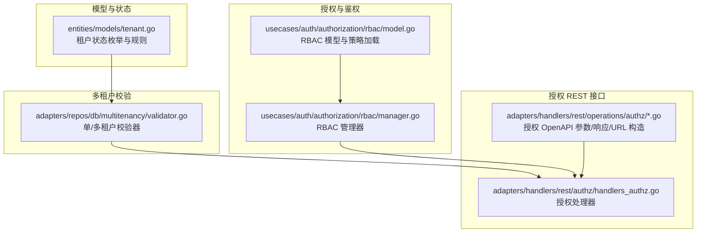
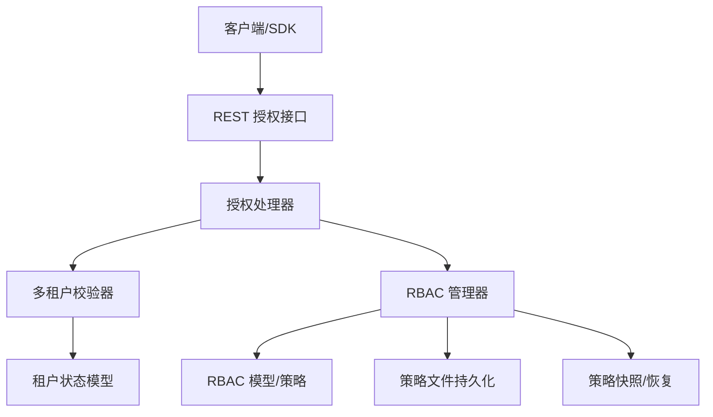
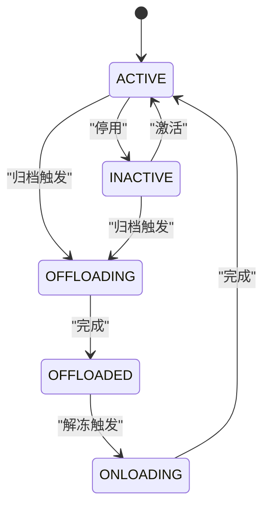
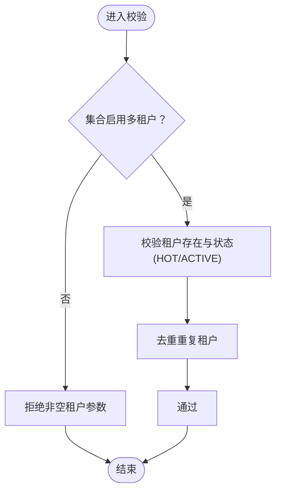
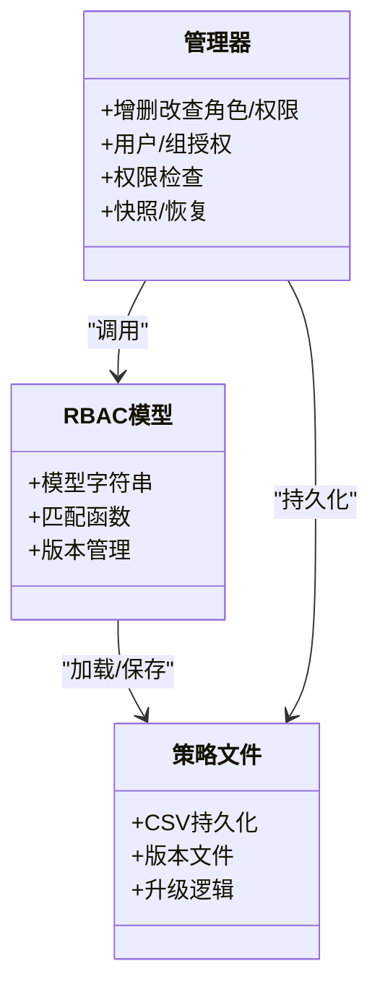
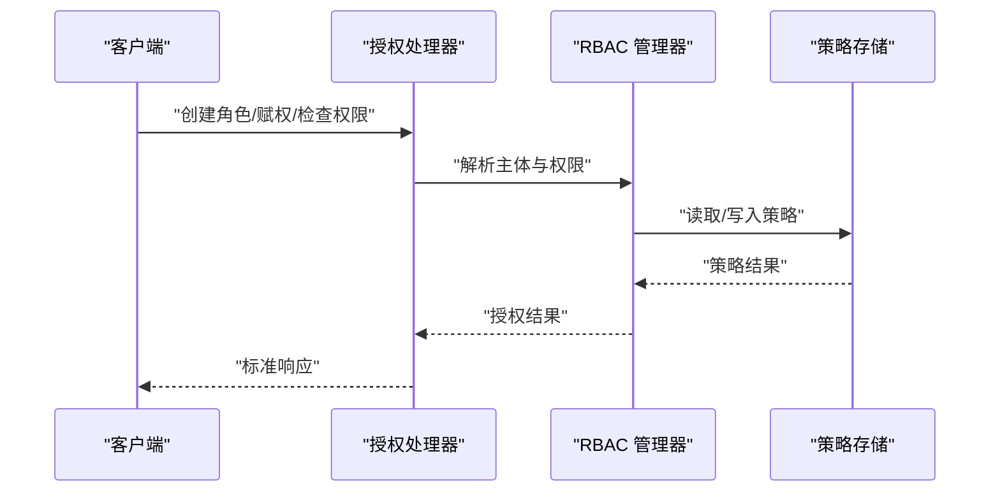
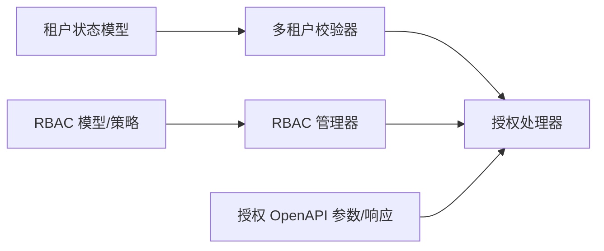
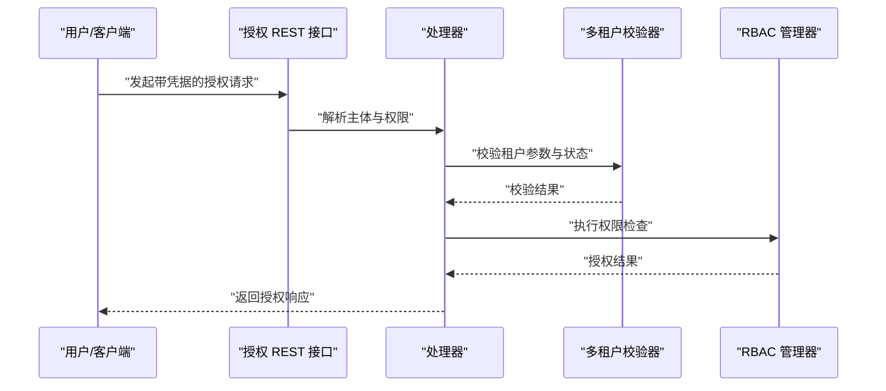

# 多租户安全架构

<cite>
**本文引用的文件**
- [entities/models/tenant.go](file://entities/models/tenant.go)
- [adapters/repos/db/multitenancy/validator.go](file://adapters/repos/db/multitenancy/validator.go)
- [usecases/auth/authorization/rbac/model.go](file://usecases/auth/authorization/rbac/model.go)
- [usecases/auth/authorization/rbac/manager.go](file://usecases/auth/authorization/rbac/manager.go)
- [adapters/handlers/rest/authz/handlers_authz.go](file://adapters/handlers/rest/authz/handlers_authz.go)
- [adapters/handlers/rest/operations/authz/add_permissions.go](file://adapters/handlers/rest/operations/authz/add_permissions.go)
- [adapters/handlers/rest/operations/authz/add_permissions_parameters.go](file://adapters/handlers/rest/operations/authz/add_permissions_parameters.go)
- [adapters/handlers/rest/operations/authz/add_permissions_responses.go](file://adapters/handlers/rest/operations/authz/add_permissions_responses.go)
- [adapters/handlers/rest/operations/authz/add_permissions_urlbuilder.go](file://adapters/handlers/rest/operations/authz/add_permissions_urlbuilder.go)
- [adapters/handlers/rest/operations/authz/add_permissions_validation.go](file://adapters/handlers/rest/operations/authz/add_permissions_validation.go)
- [adapters/handlers/rest/operations/authz/assign_role_to_group_parameters.go](file://adapters/handlers/rest/operations/authz/assign_role_to_group_parameters.go)
- [adapters/handlers/rest/operations/authz/assign_role_to_user_parameters.go](file://adapters/handlers/rest/operations/authz/assign_role_to_user_parameters.go)
- [adapters/handlers/rest/operations/authz/create_role_parameters.go](file://adapters/handlers/rest/operations/authz/create_role_parameters.go)
- [adapters/handlers/rest/operations/authz/delete_role_parameters.go](file://adapters/handlers/rest/operations/authz/delete_role_parameters.go)
- [adapters/handlers/rest/operations/authz/get_groups_parameters.go](file://adapters/handlers/rest/operations/authz/get_groups_parameters.go)
- [adapters/handlers/rest/operations/authz/get_role_parameters.go](file://adapters/handlers/rest/operations/authz/get_role_parameters.go)
- [adapters/handlers/rest/operations/authz/get_roles_parameters.go](file://adapters/handlers/rest/operations/authz/get_roles_parameters.go)
- [adapters/handlers/rest/operations/authz/get_users_for_role_parameters.go](file://adapters/handlers/rest/operations/authz/get_users_for_role_parameters.go)
- [adapters/handlers/rest/operations/authz/has_permission_parameters.go](file://adapters/handlers/rest/operations/authz/has_permission_parameters.go)
- [adapters/handlers/rest/operations/authz/remove_permissions_parameters.go](file://adapters/handlers/rest/operations/authz/remove_permissions_parameters.go)
- [adapters/handlers/rest/operations/authz/revoke_role_from_group_parameters.go](file://adapters/handlers/rest/operations/authz/revoke_role_from_group_parameters.go)
- [adapters/handlers/rest/operations/authz/revoke_role_from_user_parameters.go](file://adapters/handlers/rest/operations/authz/revoke_role_from_user_parameters.go)
- [adapters/handlers/rest/operations/authz/revoke_role_from_user_responses.go](file://adapters/handlers/rest/operations/authz/revoke_role_from_user_responses.go)
- [adapters/handlers/rest/operations/authz/revoke_role_from_user_validation.go](file://adapters/handlers/rest/operations/authz/revoke_role_from_user_validation.go)
- [adapters/handlers/rest/operations/authz/revoke_role_from_user_urlbuilder.go](file://adapters/handlers/rest/operations/authz/revoke_role_from_user_urlbuilder.go)
- [adapters/handlers/rest/operations/authz/revoke_role_from_user.go](file://adapters/handlers/rest/operations/authz/revoke_role_from_user.go)
- [adapters/handlers/rest/operations/authz/revoke_role_from_user_validation.go](file://adapters/handlers/rest/operations/authz/revoke_role_from_user_validation.go)
- [adapters/handlers/rest/operations/authz/revoke_role_from_user_urlbuilder.go](file://adapters/handlers/rest/operations/authz/revoke_role_from_user_urlbuilder.go)
- [adapters/handlers/rest/operations/authz/revoke_role_from_user.go](file://adapters/handlers/rest/operations/authz/revoke_role_from_user.go)
- [adapters/handlers/rest/operations/authz/revoke_role_from_user_validation.go](file://adapters/handlers/rest/operations/authz/revoke_role_from_user_validation.go)
- [adapters/handlers/rest/operations/authz/revoke_role_from_user_urlbuilder.go](file://adapters/handlers/rest/operations/authz/revoke_role_from_user_urlbuilder.go)
- [adapters/handlers/rest/operations/authz/revoke_role_from_user.go](file://adapters/handlers/rest/operations/authz/revoke_role_from_user.go)
- [adapters/handlers/rest/operations/authz/revoke_role_from_user_validation.go](file://adapters/handlers/rest/operations/authz/revoke_role_from_user_validation.go)
- [adapters/handlers/rest/operations/authz/revoke_role_from_user_urlbuilder.go](file://adapters/handlers/rest/operations/authz/revoke_role_from_user_urlbuilder.go)
- [adapters/handlers/rest/operations/authz/revoke_role_from_user.go](file://adapters/handlers/rest/operations/authz/revoke_role_from_user.go)
- [adapters/handlers/rest/operations/authz/revoke_role_from_user_validation.go](file://adapters/handlers/rest/operations/authz/revoke_role_from_user_validation.go)
- [adapters/handlers/rest/operations/authz/revoke_role_from_user_urlbuilder.go](file://adapters/handlers/rest/operations/authz/revoke_role_from_user_urlbuilder.go)
- [adapters/handlers/rest/operations/authz/revoke_role_from_user.go](file://adapters/handlers/rest/operations/authz/revoke_role_from_user.go)
- [adapters/handlers/rest/operations/authz/revoke_role_from_user_validation.go](file://adapters/handlers/rest/operations/authz/revoke_role_from_user_validation.go)
- [adapters/handlers/rest/operations/authz/revoke_role_from_user_urlbuilder.go](file://adapters/handlers/rest/operations/authz/revoke_role_from_user_urlbuilder.go)
- [adapters/handlers/rest/operations/authz/revoke_role_from_user.go](file://adapters/handlers/rest/operations/authz/revoke_role_from_user.go)
- [adapters/handlers/rest/operations/authz/revoke_role_from_user_validation.go](file://adapters/handlers/rest/operations/authz/revoke_role_from_user_validation.go)
......
</cite>

## 目录
1. [引言](#引言)
2. [项目结构](#项目结构)
3. [核心组件](#核心组件)
4. [架构总览](#架构总览)
5. [详细组件分析](#详细组件分析)
6. [依赖关系分析](#依赖关系分析)
7. [性能考虑](#性能考虑)
8. [故障排除指南](#故障排除指南)
9. [结论](#结论)
10. [附录](#附录)

## 引言
本文件面向云服务提供商与企业用户，系统化阐述 Weaviate 在多租户场景下的安全架构设计与实现，覆盖数据隔离、计算隔离、网络隔离、资源管理、身份认证与授权、租户状态生命周期、跨租户数据保护（含加密、审计与合规）、租户迁移与备份恢复、性能优化与监控指标，并提供可操作的配置示例与故障排除建议。内容基于仓库中多租户模型、校验器、RBAC 授权、REST 授权接口等关键源码进行提炼与可视化说明。

## 项目结构
Weaviate 的多租户安全相关能力主要分布在以下模块：
- 数据模型与状态：租户状态枚举、活动状态、生命周期字段定义
- 多租户校验：单租户/多租户请求参数校验、重复租户去重、状态检查
- 授权与鉴权：RBAC 策略引擎、角色/权限管理、匹配器、快照与恢复
- 授权 REST 接口：角色创建/查询/赋权/撤销、权限检查等 API
- 配置与运行时：策略版本、存储路径、缓存与并发控制

**图表来源**
- [entities/models/tenant.go](file://entities/models/tenant.go#L29-L144)
- [adapters/repos/db/multitenancy/validator.go](file://adapters/repos/db/multitenancy/validator.go#L59-L256)
- [usecases/auth/authorization/rbac/model.go](file://usecases/auth/authorization/rbac/model.go#L44-L145)
- [usecases/auth/authorization/rbac/manager.go](file://usecases/auth/authorization/rbac/manager.go#L40-L602)
- [adapters/handlers/rest/authz/handlers_authz.go](file://adapters/handlers/rest/authz/handlers_authz.go#L309-L333)
- [adapters/handlers/rest/operations/authz/add_permissions.go](file://adapters/handlers/rest/operations/authz/add_permissions.go)

**章节来源**
- [entities/models/tenant.go](file://entities/models/tenant.go#L29-L144)
- [adapters/repos/db/multitenancy/validator.go](file://adapters/repos/db/multitenancy/validator.go#L59-L256)
- [usecases/auth/authorization/rbac/model.go](file://usecases/auth/authorization/rbac/model.go#L44-L145)
- [usecases/auth/authorization/rbac/manager.go](file://usecases/auth/authorization/rbac/manager.go#L40-L602)
- [adapters/handlers/rest/authz/handlers_authz.go](file://adapters/handlers/rest/authz/handlers_authz.go#L309-L333)

## 核心组件
- 租户状态模型：定义 ACTIVE、INACTIVE、OFFLOADED 及其过渡态（OFFLOADING、ONLOADING），并提供状态枚举校验与兼容映射（HOT/COLD/FROZEN 等旧名）。
- 多租户校验器：根据集合是否启用多租户，分别执行“禁止传入租户”或“校验租户存在且处于热态”的策略；支持去重与批量校验。
- RBAC 授权：基于 Casbin 的域/资源/动作模型，内置预定义角色与策略，支持策略文件持久化、版本升级、策略快照与恢复。
- 授权 REST 接口：提供角色 CRUD、用户/组授权、权限检查等 API，结合处理器对请求进行解析与授权决策。

**章节来源**
- [entities/models/tenant.go](file://entities/models/tenant.go#L29-L144)
- [adapters/repos/db/multitenancy/validator.go](file://adapters/repos/db/multitenancy/validator.go#L59-L256)
- [usecases/auth/authorization/rbac/model.go](file://usecases/auth/authorization/rbac/model.go#L44-L145)
- [usecases/auth/authorization/rbac/manager.go](file://usecases/auth/authorization/rbac/manager.go#L40-L602)
- [adapters/handlers/rest/authz/handlers_authz.go](file://adapters/handlers/rest/authz/handlers_authz.go#L309-L333)

## 架构总览
Weaviate 多租户安全架构以“模型-校验-授权-接口”为主线，形成端到端的隔离与保护闭环：

**图表来源**
- [adapters/handlers/rest/authz/handlers_authz.go](file://adapters/handlers/rest/authz/handlers_authz.go#L309-L333)
- [adapters/repos/db/multitenancy/validator.go](file://adapters/repos/db/multitenancy/validator.go#L59-L256)
- [usecases/auth/authorization/rbac/manager.go](file://usecases/auth/authorization/rbac/manager.go#L40-L602)
- [usecases/auth/authorization/rbac/model.go](file://usecases/auth/authorization/rbac/model.go#L44-L145)
- [entities/models/tenant.go](file://entities/models/tenant.go#L29-L144)

## 详细组件分析

### 组件一：租户状态与生命周期
- 状态定义：ACTIVE（热存储可查询）、INACTIVE（本地不可查询）、OFFLOADED（云端归档）、OFFLOADING/ONLOADING（过渡态）。
- 生命周期管理：通过状态更新接口实现激活/停用/归档；在多租户校验器中拒绝冷/冻结状态的写入与查询。
- 兼容映射：保留 HOT/COLD/FROZEN 等历史名称，自动映射至新状态。

**图表来源**
- [entities/models/tenant.go](file://entities/models/tenant.go#L29-L144)
- [adapters/repos/db/multitenancy/validator.go](file://adapters/repos/db/multitenancy/validator.go#L81-L103)

**章节来源**
- [entities/models/tenant.go](file://entities/models/tenant.go#L29-L144)
- [adapters/repos/db/multitenancy/validator.go](file://adapters/repos/db/multitenancy/validator.go#L81-L103)

### 组件二：多租户隔离与校验
- 单租户集合：拒绝任何非空租户参数，避免误用多租户语义。
- 多租户集合：校验租户存在性与状态（仅允许热态 HOT→ACTIVE），并去重处理重复租户。
- 批量与并发：支持多租户批量操作与并发安全读取。

**图表来源**
- [adapters/repos/db/multitenancy/validator.go](file://adapters/repos/db/multitenancy/validator.go#L59-L256)

**章节来源**
- [adapters/repos/db/multitenancy/validator.go](file://adapters/repos/db/multitenancy/validator.go#L59-L256)

### 组件三：RBAC 授权模型与策略
- 模型与匹配：基于 Casbin 的 r/p/g/e/m 结构，自定义匹配函数以支持租户路径的精确匹配与通配。
- 策略持久化：策略文件 CSV 存储于指定目录，支持版本记录与升级。
- 预定义角色：内置 admin/viewer/root 角色及其策略，结合配置注入根/只读用户与组。
- 快照与恢复：序列化策略与分组策略，支持从快照恢复并重新应用环境配置。

**图表来源**
- [usecases/auth/authorization/rbac/model.go](file://usecases/auth/authorization/rbac/model.go#L44-L145)
- [usecases/auth/authorization/rbac/model.go](file://usecases/auth/authorization/rbac/model.go#L147-L257)
- [usecases/auth/authorization/rbac/manager.go](file://usecases/auth/authorization/rbac/manager.go#L40-L602)

**章节来源**
- [usecases/auth/authorization/rbac/model.go](file://usecases/auth/authorization/rbac/model.go#L44-L145)
- [usecases/auth/authorization/rbac/model.go](file://usecases/auth/authorization/rbac/model.go#L147-L257)
- [usecases/auth/authorization/rbac/manager.go](file://usecases/auth/authorization/rbac/manager.go#L40-L602)

### 组件四：授权 REST 接口与控制器
- 接口覆盖：角色创建/删除/查询、用户/组授权、权限检查、用户/组查询等。
- 控制器集成：处理器调用控制器执行业务逻辑，返回标准化响应。
- 权限表达：支持按域（数据/备份/节点/角色/集合/租户/用户/复制/别名）与资源路径进行细粒度授权。

**图表来源**
- [adapters/handlers/rest/authz/handlers_authz.go](file://adapters/handlers/rest/authz/handlers_authz.go#L309-L333)
- [adapters/handlers/rest/operations/authz/add_permissions.go](file://adapters/handlers/rest/operations/authz/add_permissions.go)
- [adapters/handlers/rest/operations/authz/add_permissions_parameters.go](file://adapters/handlers/rest/operations/authz/add_permissions_parameters.go)
- [adapters/handlers/rest/operations/authz/add_permissions_responses.go](file://adapters/handlers/rest/operations/authz/add_permissions_responses.go)
- [adapters/handlers/rest/operations/authz/add_permissions_urlbuilder.go](file://adapters/handlers/rest/operations/authz/add_permissions_urlbuilder.go)
- [adapters/handlers/rest/operations/authz/add_permissions_validation.go](file://adapters/handlers/rest/operations/authz/add_permissions_validation.go)

**章节来源**
- [adapters/handlers/rest/authz/handlers_authz.go](file://adapters/handlers/rest/authz/handlers_authz.go#L309-L333)
- [adapters/handlers/rest/operations/authz/add_permissions.go](file://adapters/handlers/rest/operations/authz/add_permissions.go)
- [adapters/handlers/rest/operations/authz/add_permissions_parameters.go](file://adapters/handlers/rest/operations/authz/add_permissions_parameters.go)
- [adapters/handlers/rest/operations/authz/add_permissions_responses.go](file://adapters/handlers/rest/operations/authz/add_permissions_responses.go)
- [adapters/handlers/rest/operations/authz/add_permissions_urlbuilder.go](file://adapters/handlers/rest/operations/authz/add_permissions_urlbuilder.go)
- [adapters/handlers/rest/operations/authz/add_permissions_validation.go](file://adapters/handlers/rest/operations/authz/add_permissions_validation.go)

## 依赖关系分析
- 模型层依赖：租户状态模型被多租户校验器直接使用，确保请求侧状态合法性。
- 校验层依赖：REST 处理器在执行业务前调用校验器，保证后续授权与存储阶段的数据一致性。
- 授权层依赖：RBAC 管理器依赖模型与策略文件，提供统一的授权决策入口；策略文件由模型层负责初始化与版本管理。
- 接口层依赖：REST 操作参数/响应/URL 构造与校验逻辑支撑处理器的正确执行。

**图表来源**
- [entities/models/tenant.go](file://entities/models/tenant.go#L29-L144)
- [adapters/repos/db/multitenancy/validator.go](file://adapters/repos/db/multitenancy/validator.go#L59-L256)
- [usecases/auth/authorization/rbac/model.go](file://usecases/auth/authorization/rbac/model.go#L44-L145)
- [usecases/auth/authorization/rbac/manager.go](file://usecases/auth/authorization/rbac/manager.go#L40-L602)
- [adapters/handlers/rest/operations/authz/add_permissions.go](file://adapters/handlers/rest/operations/authz/add_permissions.go)

**章节来源**
- [entities/models/tenant.go](file://entities/models/tenant.go#L29-L144)
- [adapters/repos/db/multitenancy/validator.go](file://adapters/repos/db/multitenancy/validator.go#L59-L256)
- [usecases/auth/authorization/rbac/model.go](file://usecases/auth/authorization/rbac/model.go#L44-L145)
- [usecases/auth/authorization/rbac/manager.go](file://usecases/auth/authorization/rbac/manager.go#L40-L602)
- [adapters/handlers/rest/operations/authz/add_permissions.go](file://adapters/handlers/rest/operations/authz/add_permissions.go)

## 性能考虑
- 授权缓存：RBAC 使用同步缓存增强器，提升授权判断吞吐；策略变更后主动失效缓存，平衡一致性与性能。
- 并发控制：策略读写采用读写锁，降低高并发下的竞争开销。
- 匹配器优化：针对租户路径的匹配逻辑避免通配导致的全量扫描，减少无效 IO。
- 监控指标：结合对象操作、LSM 相关指标，观察延迟与吞吐变化，定位多租户场景下的热点与瓶颈。

**章节来源**
- [usecases/auth/authorization/rbac/manager.go](file://usecases/auth/authorization/rbac/manager.go#L40-L602)
- [usecases/auth/authorization/rbac/model.go](file://usecases/auth/authorization/rbac/model.go#L84-L145)

## 故障排除指南
- 多租户参数错误：当集合未启用多租户却传入租户参数，会返回多租户错误；请确认集合配置与请求参数一致。
- 租户状态不合法：对 INACTIVE/OFFLOADED 状态的写入会被拒绝；请先激活或解冻后再进行写操作。
- 授权失败：检查策略文件是否存在、版本是否正确、策略是否已保存并加载；必要时重建策略并重新应用环境配置。
- 权限检查异常：确认主体（用户/组）与资源路径格式正确，域/动作/资源三元组匹配是否符合预期。

**章节来源**
- [adapters/repos/db/multitenancy/validator.go](file://adapters/repos/db/multitenancy/validator.go#L59-L256)
- [usecases/auth/authorization/rbac/model.go](file://usecases/auth/authorization/rbac/model.go#L112-L145)
- [usecases/auth/authorization/rbac/manager.go](file://usecases/auth/authorization/rbac/manager.go#L40-L602)

## 结论
Weaviate 的多租户安全架构通过“状态模型—校验器—RBAC—接口”的协同，实现了数据、计算与网络层面的强隔离与细粒度授权。依托租户状态机与策略文件持久化，系统在安全与可用之间取得平衡，并提供快照恢复能力保障运维可靠性。配合完善的监控与故障排查指引，可满足云服务提供商与企业用户的多租户安全需求。

## 附录

### A. 多租户隔离策略概览
- 数据隔离：按租户划分物理存储与索引，仅热态租户可查询；冷/冻态租户数据位于远程后端。
- 计算隔离：多租户校验器在请求入口强制约束，避免跨租户误操作；RBAC 对资源路径进行域/租户级授权。
- 网络隔离：通过 API 层的主体识别与权限检查，限制跨租户访问；结合 TLS 与认证机制进一步加固。

**章节来源**
- [entities/models/tenant.go](file://entities/models/tenant.go#L29-L144)
- [adapters/repos/db/multitenancy/validator.go](file://adapters/repos/db/multitenancy/validator.go#L59-L256)
- [usecases/auth/authorization/rbac/model.go](file://usecases/auth/authorization/rbac/model.go#L44-L145)

### B. 身份认证与授权流程（序列图）

**图表来源**
- [adapters/handlers/rest/authz/handlers_authz.go](file://adapters/handlers/rest/authz/handlers_authz.go#L309-L333)
- [adapters/repos/db/multitenancy/validator.go](file://adapters/repos/db/multitenancy/validator.go#L59-L256)
- [usecases/auth/authorization/rbac/manager.go](file://usecases/auth/authorization/rbac/manager.go#L444-L458)

### C. 配置示例与最佳实践
- 启用多租户：在集合配置中开启多租户开关，并为租户设置初始状态（建议默认 ACTIVE）。
- RBAC 策略：通过策略文件定义角色与权限，优先使用内置角色；定期备份策略文件与快照。
- 审计与合规：利用权限检查输出与资源路径映射，生成审计日志；按需启用只读策略与最小权限原则。
- 迁移与恢复：归档/解冻流程遵循状态机；备份恢复后执行策略快照恢复与环境配置重载。

**章节来源**
- [usecases/auth/authorization/rbac/model.go](file://usecases/auth/authorization/rbac/model.go#L112-L145)
- [usecases/auth/authorization/rbac/manager.go](file://usecases/auth/authorization/rbac/manager.go#L363-L438)