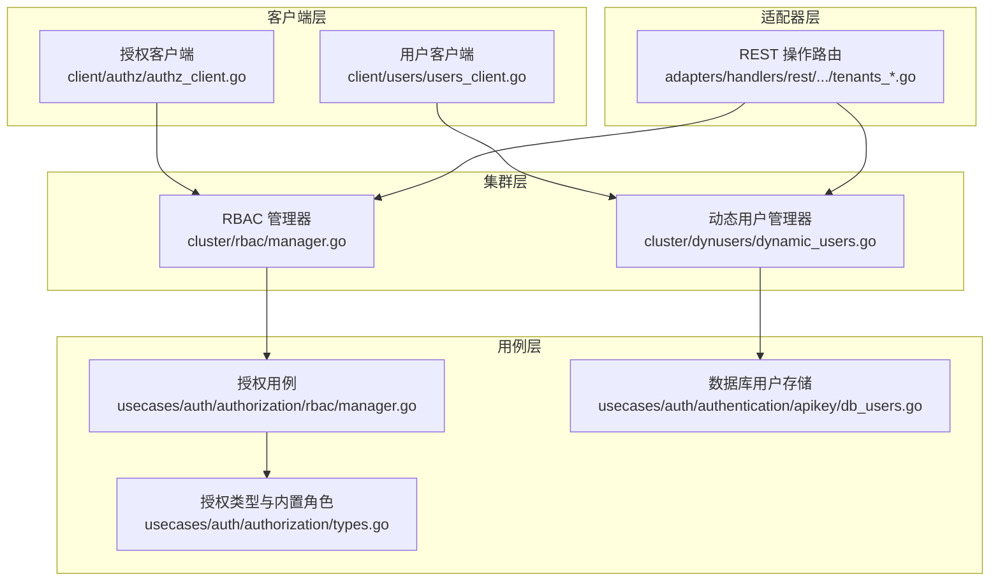
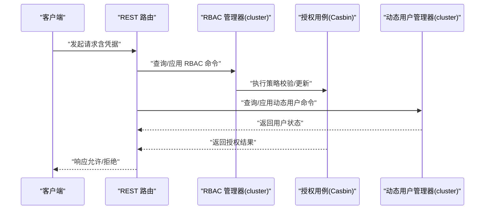
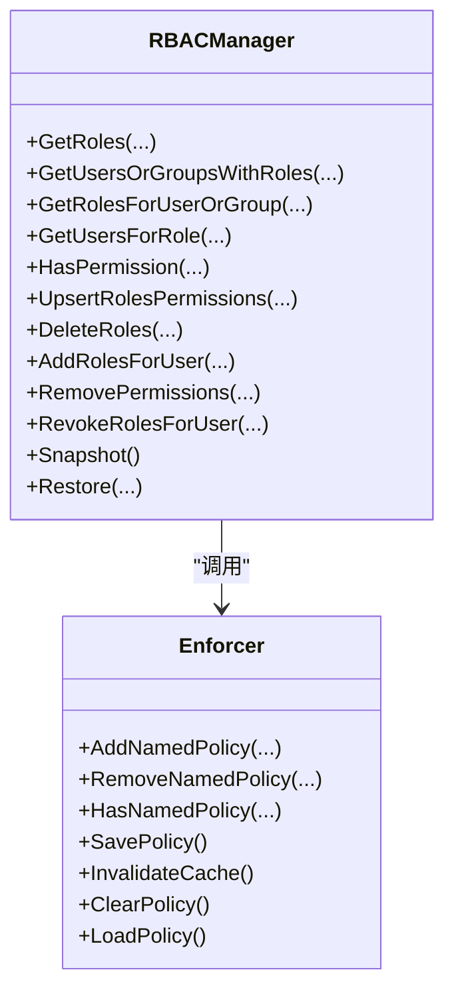
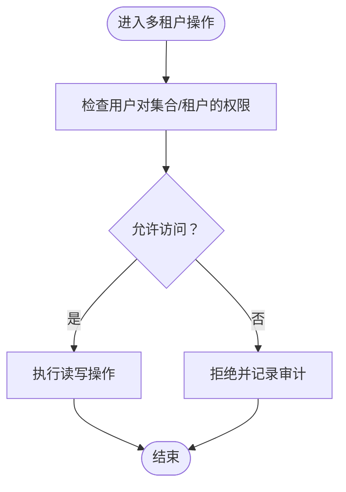
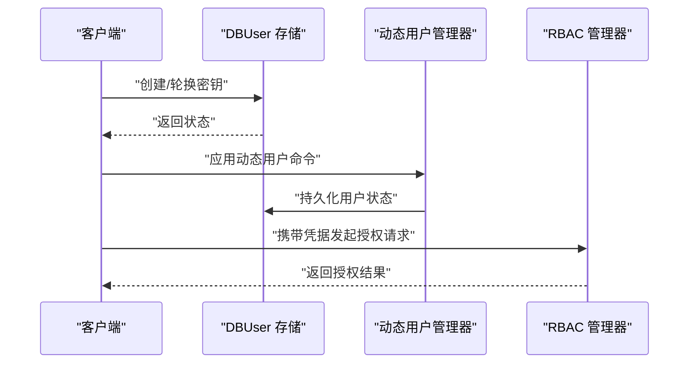
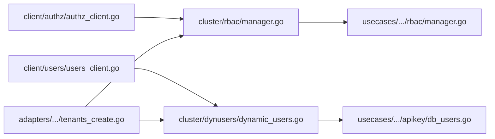

# 安全与权限

<cite>
**本文引用的文件**
- [cluster/rbac/manager.go](file://cluster/rbac/manager.go)
- [usecases/auth/authorization/rbac/manager.go](file://usecases/auth/authorization/rbac/manager.go)
- [client/authz/authz_client.go](file://client/authz/authz_client.go)
- [cluster/dynusers/dynamic_users.go](file://cluster/dynusers/dynamic_users.go)
- [client/users/users_client.go](file://client/users/users_client.go)
- [usecases/auth/authentication/apikey/db_users.go](file://usecases/auth/authentication/apikey/db_users.go)
- [usecases/auth/authorization/types.go](file://usecases/auth/authorization/types.go)
- [adapters/handlers/rest/operations/schema/tenants_create.go](file://adapters/handlers/rest/operations/schema/tenants_create.go)
- [adapters/handlers/rest/operations/schema/tenants_get.go](file://adapters/handlers/rest/operations/schema/tenants_get.go)
</cite>

## 目录
1. [简介](#简介)
2. [项目结构](#项目结构)
3. [核心组件](#核心组件)
4. [架构总览](#架构总览)
5. [详细组件分析](#详细组件分析)
6. [依赖关系分析](#依赖关系分析)
7. [性能考量](#性能考量)
8. [故障排查指南](#故障排查指南)
9. [结论](#结论)
10. [附录](#附录)

## 简介
本文件面向安全工程师与系统管理员，系统化梳理 Weaviate 的安全与权限体系：基于 RBAC 的授权机制（角色、权限与用户管理）、多租户架构（租户隔离、资源限制与计费相关能力）、认证机制（API 密钥、动态用户与 OAuth2 集成）、访问控制策略（细粒度权限与审计日志）、安全配置与最佳实践、威胁模型与防护、安全事件检测与响应、以及合规与审计支持。

## 项目结构
Weaviate 的安全与权限由“集群层”“用例层”“客户端层”“适配器层”协同实现：
- 集群层：负责在 Raft 上持久化与复制 RBAC 策略与动态用户状态，并提供查询与应用接口。
- 用例层：封装 Casbin 引擎，提供角色与权限的增删改查、策略快照与恢复、内置角色与动作集合。
- 客户端层：提供 REST SDK，暴露授权与用户管理 API。
- 适配器层：REST/GraphQL/GRPC 路由与鉴权集成点，贯穿多租户操作。

图表来源
- [cluster/rbac/manager.go](file://cluster/rbac/manager.go#L31-L36)
- [usecases/auth/authorization/rbac/manager.go](file://usecases/auth/authorization/rbac/manager.go#L40-L46)
- [client/authz/authz_client.go](file://client/authz/authz_client.go#L34-L81)
- [cluster/dynusers/dynamic_users.go](file://cluster/dynusers/dynamic_users.go#L26-L29)
- [usecases/auth/authentication/apikey/db_users.go](file://usecases/auth/authentication/apikey/db_users.go#L62-L69)
- [adapters/handlers/rest/operations/schema/tenants_create.go](file://adapters/handlers/rest/operations/schema/tenants_create.go#L40-L55)

章节来源
- [cluster/rbac/manager.go](file://cluster/rbac/manager.go#L1-L300)
- [usecases/auth/authorization/rbac/manager.go](file://usecases/auth/authorization/rbac/manager.go#L1-L200)
- [client/authz/authz_client.go](file://client/authz/authz_client.go#L1-L120)
- [cluster/dynusers/dynamic_users.go](file://cluster/dynusers/dynamic_users.go#L1-L100)
- [client/users/users_client.go](file://client/users/users_client.go#L1-L120)
- [usecases/auth/authentication/apikey/db_users.go](file://usecases/auth/authentication/apikey/db_users.go#L1-L120)
- [usecases/auth/authorization/types.go](file://usecases/auth/authorization/types.go#L1-L120)
- [adapters/handlers/rest/operations/schema/tenants_create.go](file://adapters/handlers/rest/operations/schema/tenants_create.go#L1-L85)
- [adapters/handlers/rest/operations/schema/tenants_get.go](file://adapters/handlers/rest/operations/schema/tenants_get.go#L1-L85)

## 核心组件
- RBAC 授权管理器：封装 Casbin，提供角色创建/更新、权限增删、用户/组角色分配、权限校验、策略快照与恢复。
- 动态用户管理器：在 Raft 上维护数据库用户（db users）生命周期（创建、激活/停用、删除、密钥轮换），并支持快照恢复。
- 授权客户端与用户客户端：提供 REST API 封装，便于外部系统调用授权与用户管理。
- 授权类型与内置角色：定义动作、域、资源路径生成器与内置角色（如 viewer、admin、root、read-only）。
- 多租户 REST 路由：提供租户创建/获取等操作的入口，结合授权策略进行访问控制。

章节来源
- [usecases/auth/authorization/rbac/manager.go](file://usecases/auth/authorization/rbac/manager.go#L40-L60)
- [cluster/rbac/manager.go](file://cluster/rbac/manager.go#L31-L40)
- [cluster/dynusers/dynamic_users.go](file://cluster/dynusers/dynamic_users.go#L26-L33)
- [client/authz/authz_client.go](file://client/authz/authz_client.go#L43-L81)
- [client/users/users_client.go](file://client/users/users_client.go#L42-L61)
- [usecases/auth/authorization/types.go](file://usecases/auth/authorization/types.go#L229-L233)
- [adapters/handlers/rest/operations/schema/tenants_create.go](file://adapters/handlers/rest/operations/schema/tenants_create.go#L40-L55)

## 架构总览
Weaviate 的安全架构以“策略即数据”的方式在集群内持久化与复制：RBAC 策略与动态用户状态通过 Raft 应用到集群节点，授权决策在用例层使用 Casbin 执行；REST/GraphQL/GRPC 在适配器层完成鉴权与路由。

图表来源
- [cluster/rbac/manager.go](file://cluster/rbac/manager.go#L42-L63)
- [usecases/auth/authorization/rbac/manager.go](file://usecases/auth/authorization/rbac/manager.go#L444-L458)
- [cluster/dynusers/dynamic_users.go](file://cluster/dynusers/dynamic_users.go#L35-L45)

## 详细组件分析

### RBAC 授权机制
- 角色与权限
  - 支持创建/更新角色并附加策略（资源、动词、域），或移除指定权限。
  - 提供按角色查询权限、按用户/组查询角色、按角色查询用户/组等查询接口。
- 用户与组
  - 支持为用户或组分配/撤销角色；支持区分 db 用户与 OIDC 组。
- 策略引擎
  - 使用 Casbin 同步缓存执行器，提供策略保存与缓存失效。
- 快照与恢复
  - 对策略与分组策略进行序列化，支持版本升级与环境配置重载。

图表来源
- [cluster/rbac/manager.go](file://cluster/rbac/manager.go#L42-L213)
- [usecases/auth/authorization/rbac/manager.go](file://usecases/auth/authorization/rbac/manager.go#L115-L135)

章节来源
- [cluster/rbac/manager.go](file://cluster/rbac/manager.go#L42-L213)
- [usecases/auth/authorization/rbac/manager.go](file://usecases/auth/authorization/rbac/manager.go#L115-L251)
- [usecases/auth/authorization/types.go](file://usecases/auth/authorization/types.go#L27-L56)

### 多租户架构
- 租户隔离
  - 通过资源路径中的租户维度实现集合级隔离；授权时可限定到具体租户。
- 资源限制与计费
  - 资源路径生成器支持集合/租户/对象等粒度；可通过权限裁剪最小可用范围，实现“最小权限”与成本控制。
- 计费与配额
  - 可基于租户维度统计与审计，结合外部计费系统进行对账与告警。

图表来源
- [usecases/auth/authorization/types.go](file://usecases/auth/authorization/types.go#L477-L489)
- [adapters/handlers/rest/operations/schema/tenants_create.go](file://adapters/handlers/rest/operations/schema/tenants_create.go#L45-L51)
- [adapters/handlers/rest/operations/schema/tenants_get.go](file://adapters/handlers/rest/operations/schema/tenants_get.go#L45-L51)

章节来源
- [usecases/auth/authorization/types.go](file://usecases/auth/authorization/types.go#L477-L489)
- [adapters/handlers/rest/operations/schema/tenants_create.go](file://adapters/handlers/rest/operations/schema/tenants_create.go#L45-L51)
- [adapters/handlers/rest/operations/schema/tenants_get.go](file://adapters/handlers/rest/operations/schema/tenants_get.go#L45-L51)

### 认证机制
- API 密钥管理
  - 数据库用户（db users）支持创建、激活/停用、删除、密钥轮换与标识符管理；采用强哈希与弱哈希组合验证，内存中缓存弱哈希以降低 CPU 开销。
  - 支持导入密钥场景下的阻断策略，防止旧密钥在轮换后继续生效。
- 动态用户管理
  - 通过 Raft 应用动态用户生命周期命令，支持快照与恢复。
- OAuth2 集成
  - 用户/组支持区分 db 与 OIDC 类型；授权时优先检查组权限再回退到用户权限。

图表来源
- [usecases/auth/authentication/apikey/db_users.go](file://usecases/auth/authentication/apikey/db_users.go#L179-L245)
- [cluster/dynusers/dynamic_users.go](file://cluster/dynusers/dynamic_users.go#L35-L105)
- [usecases/auth/authorization/rbac/manager.go](file://usecases/auth/authorization/rbac/manager.go#L444-L458)

章节来源
- [usecases/auth/authentication/apikey/db_users.go](file://usecases/auth/authentication/apikey/db_users.go#L179-L245)
- [cluster/dynusers/dynamic_users.go](file://cluster/dynusers/dynamic_users.go#L35-L105)
- [usecases/auth/authorization/rbac/manager.go](file://usecases/auth/authorization/rbac/manager.go#L444-L458)

### 访问控制策略与审计
- 细粒度权限控制
  - 动作集合覆盖 roles/users/cluster/nodes/backups/collections/data/tenants/replicate/aliases 等域；资源路径支持通配符与精确匹配。
  - 内置角色 viewer/admin/root/read-only 提供不同权限基线。
- 审计日志
  - 授权结果与资源详情可格式化输出，便于审计与排障。

章节来源
- [usecases/auth/authorization/types.go](file://usecases/auth/authorization/types.go#L149-L206)
- [usecases/auth/authorization/types.go](file://usecases/auth/authorization/types.go#L554-L598)
- [usecases/auth/authorization/rbac/manager.go](file://usecases/auth/authorization/rbac/manager.go#L460-L577)

## 依赖关系分析
- 组件耦合
  - RBAC 管理器依赖授权用例（Casbin）与 Raft 快照器；动态用户管理器依赖 DBUser 存储与快照器。
- 外部依赖
  - 授权用例依赖 Casbin；认证存储依赖 Argon2id 与 SHA-256；客户端依赖 OpenAPI 运行时。

图表来源
- [cluster/rbac/manager.go](file://cluster/rbac/manager.go#L31-L36)
- [usecases/auth/authorization/rbac/manager.go](file://usecases/auth/authorization/rbac/manager.go#L40-L46)
- [cluster/dynusers/dynamic_users.go](file://cluster/dynusers/dynamic_users.go#L26-L29)
- [usecases/auth/authentication/apikey/db_users.go](file://usecases/auth/authentication/apikey/db_users.go#L62-L69)
- [client/authz/authz_client.go](file://client/authz/authz_client.go#L34-L81)
- [client/users/users_client.go](file://client/users/users_client.go#L34-L61)
- [adapters/handlers/rest/operations/schema/tenants_create.go](file://adapters/handlers/rest/operations/schema/tenants_create.go#L40-L55)

章节来源
- [cluster/rbac/manager.go](file://cluster/rbac/manager.go#L1-L120)
- [usecases/auth/authorization/rbac/manager.go](file://usecases/auth/authorization/rbac/manager.go#L1-L120)
- [cluster/dynusers/dynamic_users.go](file://cluster/dynusers/dynamic_users.go#L1-L120)
- [client/authz/authz_client.go](file://client/authz/authz_client.go#L1-L120)
- [client/users/users_client.go](file://client/users/users_client.go#L1-L120)
- [adapters/handlers/rest/operations/schema/tenants_create.go](file://adapters/handlers/rest/operations/schema/tenants_create.go#L1-L85)

## 性能考量
- 缓存与批量
  - 授权用例使用同步缓存执行器，减少重复策略加载；批量应用策略时统一保存与失效缓存。
- IO 优化
  - DBUser 存储定期批量落盘，避免高频写入；仅在必要时持久化最后使用时间。
- 并发控制
  - RBAC 与 DBUser 均使用读写锁保护状态；单飞行（singleflight）避免同一用户的重复强哈希计算。

章节来源
- [usecases/auth/authorization/rbac/manager.go](file://usecases/auth/authorization/rbac/manager.go#L41-L55)
- [usecases/auth/authentication/apikey/db_users.go](file://usecases/auth/authentication/apikey/db_users.go#L134-L150)
- [usecases/auth/authentication/apikey/db_users.go](file://usecases/auth/authentication/apikey/db_users.go#L384-L390)

## 故障排查指南
- 常见问题定位
  - RBAC 策略不生效：检查策略是否已保存与缓存失效；确认角色前缀与资源路径格式。
  - 动态用户无法登录：检查用户状态（激活/停用）、密钥是否被撤销、是否为导入密钥且已被阻断。
  - 权限校验失败：核对用户/组权限链路（先组后用户），确认动作与域是否匹配。
- 快照与恢复
  - RBAC 与 DBUser 均支持快照与恢复；恢复后需重新加载策略并应用环境配置。
- 日志与审计
  - 授权结果与资源详情可格式化输出，便于审计与排障。

章节来源
- [usecases/auth/authorization/rbac/manager.go](file://usecases/auth/authorization/rbac/manager.go#L389-L438)
- [usecases/auth/authentication/apikey/db_users.go](file://usecases/auth/authentication/apikey/db_users.go#L449-L471)
- [usecases/auth/authorization/rbac/manager.go](file://usecases/auth/authorization/rbac/manager.go#L460-L577)

## 结论
Weaviate 的安全与权限体系以 RBAC 为核心，结合 Casbin 引擎与 Raft 复制，实现了跨节点一致的策略管理与快速授权决策；通过细粒度的动作与资源路径设计、内置角色与动态用户管理，满足多租户隔离与最小权限原则；配合快照与审计能力，保障了高可用与合规性。

## 附录

### 安全配置指南与最佳实践
- 最小权限
  - 为角色分配最小必要的动作与域；优先使用通配符裁剪到集合/租户/对象级别。
- 密钥治理
  - 定期轮换 API 密钥；启用导入密钥阻断策略；停用不再使用的密钥。
- 组织与身份
  - 优先使用 OIDC 组授权，减少用户级权限分散；严格区分 db 与 OIDC 用户类型。
- 监控与审计
  - 记录授权失败与关键操作；定期审查内置角色与策略变更。

### 威胁模型与防护
- 内部威胁
  - 通过最小权限与审计日志降低内部滥用风险；定期清理无效角色与密钥。
- 外部攻击
  - 强哈希与弱哈希组合验证降低暴力破解；密钥轮换与撤销机制降低泄露影响面。
- 配置漂移
  - 使用快照与恢复确保策略一致性；环境配置重载保证策略与配置同步。

### 合规与审计支持
- 资源路径与动作映射清晰，便于生成合规报告。
- 授权结果与资源详情可格式化输出，满足审计要求。