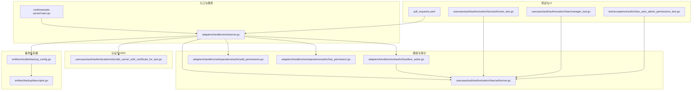
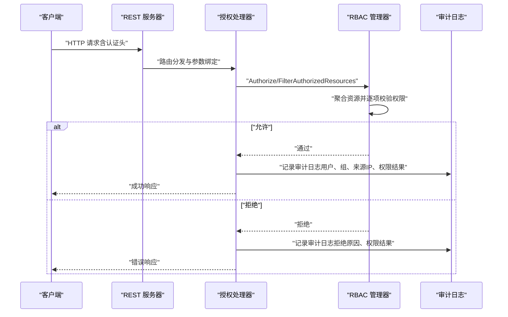
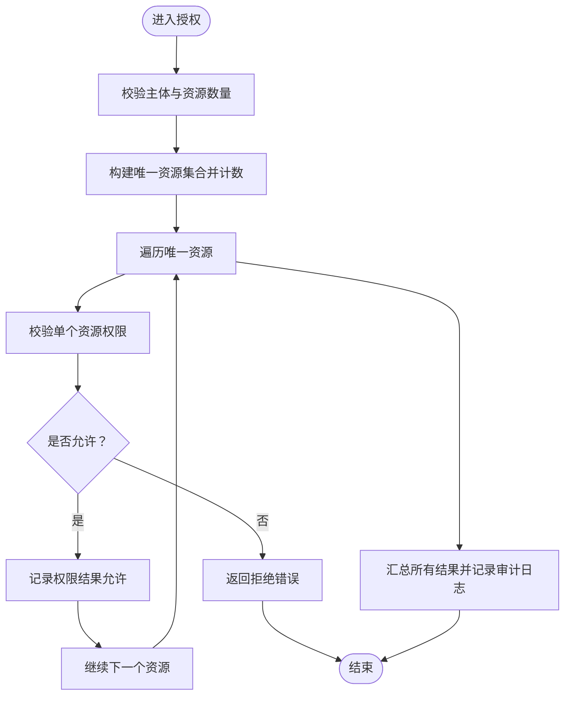
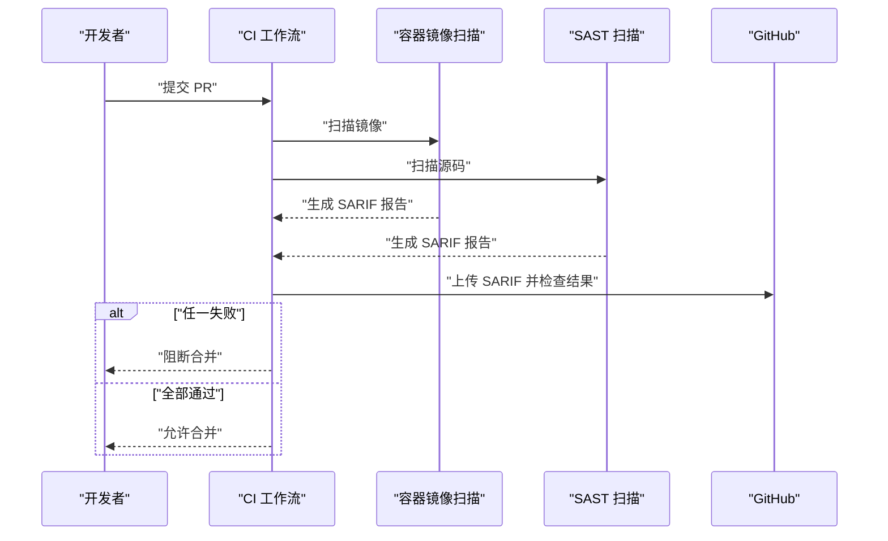
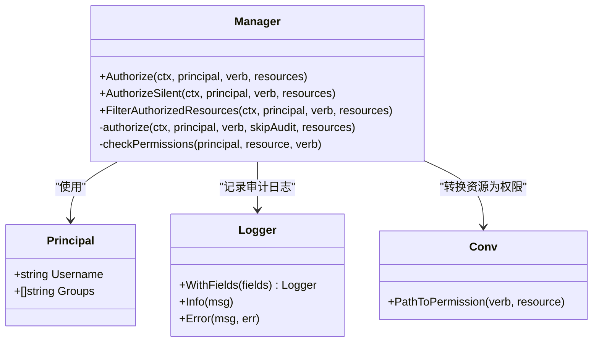

# 安全合规与审计

<cite>
**本文引用的文件**
- [cmd/weaviate-server/main.go](file://cmd/weaviate-server/main.go)
- [adapters/handlers/rest/server.go](file://adapters/handlers/rest/server.go)
- [usecases/auth/authorization/rbac/authorizer.go](file://usecases/auth/authorization/rbac/authorizer.go)
- [usecases/auth/authorization/rbac/manager_test.go](file://usecases/auth/authorization/rbac/manager_test.go)
- [usecases/auth/authorization/rbac/authorizer_test.go](file://usecases/auth/authorization/rbac/authorizer_test.go)
- [adapters/handlers/rest/authz/handlers_authz.go](file://adapters/handlers/rest/authz/handlers_authz.go)
- [adapters/handlers/rest/operations/authz/add_permissions.go](file://adapters/handlers/rest/operations/authz/add_permissions.go)
- [adapters/handlers/rest/operations/authz/has_permission.go](file://adapters/handlers/rest/operations/authz/has_permission.go)
- [client/authz/add_permissions_responses.go](file://client/authz/add_permissions_responses.go)
- [entities/models/backup_config.go](file://entities/models/backup_config.go)
- [entities/backup/descriptor.go](file://entities/backup/descriptor.go)
- [test/acceptance/authz/rbac_auto_admin_permissions_test.go](file://test/acceptance/authz/rbac_auto_admin_permissions_test.go)
- [.github/workflows/pull_requests.yaml](file://.github/workflows/pull_requests.yaml)
- [tools/dev/grafana/grafana.ini](file://tools/dev/grafana/grafana.ini)
- [usecases/auth/authentication/oidc/oidc_server_with_certificate_for_test.go](file://usecases/auth/authentication/oidc/oidc_server_with_certificate_for_test.go)
</cite>

## 目录
1. [简介](#简介)
2. [项目结构](#项目结构)
3. [核心组件](#核心组件)
4. [架构总览](#架构总览)
5. [详细组件分析](#详细组件分析)
6. [依赖关系分析](#依赖关系分析)
7. [性能考量](#性能考量)
8. [故障排查指南](#故障排查指南)
9. [结论](#结论)
10. [附录](#附录)

## 简介
本文件面向合规官与安全团队，系统化梳理 Weaviate 在安全、合规与审计方面的实现与最佳实践。内容覆盖：
- 安全事件监控与审计日志：操作日志、访问日志与异常事件记录
- 合规性满足策略：数据保护法规（如 GDPR）、行业标准（如 SOC 2）与内部安全政策
- 威胁检测与响应：异常行为识别、入侵检测与自动响应策略
- 安全配置自动化与基线检查
- 数据加密：传输加密、静态加密与密钥管理
- 安全漏洞扫描与风险评估：工具集成与流程
- 安全事件报告与通知机制
- 合规证明与审计支持的技术实现

## 项目结构
Weaviate 的安全与审计能力主要分布在以下层次：
- 入口与服务层：REST 服务器与 TLS 配置
- 授权与审计：RBAC 授权器与审计日志字段
- 认证与 OIDC：令牌验证与证书加载
- 备份与存储：备份配置与压缩类型
- 测试与流水线：RBAC 行为测试、CI 安全扫描

**图表来源**
- [cmd/weaviate-server/main.go](file://cmd/weaviate-server/main.go#L30-L66)
- [adapters/handlers/rest/server.go](file://adapters/handlers/rest/server.go#L253-L330)
- [usecases/auth/authorization/rbac/authorizer.go](file://usecases/auth/authorization/rbac/authorizer.go#L28-L99)
- [adapters/handlers/rest/authz/handlers_authz.go](file://adapters/handlers/rest/authz/handlers_authz.go#L208-L225)
- [adapters/handlers/rest/operations/authz/add_permissions.go](file://adapters/handlers/rest/operations/authz/add_permissions.go#L46-L95)
- [adapters/handlers/rest/operations/authz/has_permission.go](file://adapters/handlers/rest/operations/authz/has_permission.go#L45-L84)
- [usecases/auth/authentication/oidc/oidc_server_with_certificate_for_test.go](file://usecases/auth/authentication/oidc/oidc_server_with_certificate_for_test.go#L49-L70)
- [entities/models/backup_config.go](file://entities/models/backup_config.go#L102-L168)
- [entities/backup/descriptor.go](file://entities/backup/descriptor.go#L319-L348)
- [usecases/auth/authorization/rbac/authorizer_test.go](file://usecases/auth/authorization/rbac/authorizer_test.go#L36-L640)
- [usecases/auth/authorization/rbac/manager_test.go](file://usecases/auth/authorization/rbac/manager_test.go#L28-L176)
- [test/acceptance/authz/rbac_auto_admin_permissions_test.go](file://test/acceptance/authz/rbac_auto_admin_permissions_test.go#L79-L115)
- [.github/workflows/pull_requests.yaml](file://.github/workflows/pull_requests.yaml#L61-L99)

**章节来源**
- [cmd/weaviate-server/main.go](file://cmd/weaviate-server/main.go#L30-L66)
- [adapters/handlers/rest/server.go](file://adapters/handlers/rest/server.go#L253-L330)

## 核心组件
- 传输层安全（TLS）
  - 强制 TLS 1.2+，启用现代密码套件与前向保密；支持可选客户端证书校验与自定义证书链。
  - 参考路径：[adapters/handlers/rest/server.go](file://adapters/handlers/rest/server.go#L253-L330)
- 授权与审计（RBAC）
  - 统一的授权入口与静默授权接口；按资源聚合审计日志，避免日志风暴；记录用户、组、来源 IP、权限结果等关键字段。
  - 参考路径：[usecases/auth/authorization/rbac/authorizer.go](file://usecases/auth/authorization/rbac/authorizer.go#L28-L99)
- REST 操作与审计事件
  - 权限变更与校验相关路由在处理后记录审计事件，便于追踪管理员操作与权限变化。
  - 参考路径：[adapters/handlers/rest/authz/handlers_authz.go](file://adapters/handlers/rest/authz/handlers_authz.go#L208-L225)
- 备份与静态数据保护
  - 备份配置支持多种压缩级别与类型，备份描述包含压缩类型与大小信息，便于静态数据保护与恢复审计。
  - 参考路径：[entities/models/backup_config.go](file://entities/models/backup_config.go#L102-L168)、[entities/backup/descriptor.go](file://entities/backup/descriptor.go#L319-L348)
- 认证与 OIDC
  - 支持 OIDC 令牌验证与证书加载；测试场景提供专用证书以确保解析流程可用。
  - 参考路径：[usecases/auth/authentication/oidc/oidc_server_with_certificate_for_test.go](file://usecases/auth/authentication/oidc/oidc_server_with_certificate_for_test.go#L49-L70)

**章节来源**
- [adapters/handlers/rest/server.go](file://adapters/handlers/rest/server.go#L253-L330)
- [usecases/auth/authorization/rbac/authorizer.go](file://usecases/auth/authorization/rbac/authorizer.go#L28-L99)
- [adapters/handlers/rest/authz/handlers_authz.go](file://adapters/handlers/rest/authz/handlers_authz.go#L208-L225)
- [entities/models/backup_config.go](file://entities/models/backup_config.go#L102-L168)
- [entities/backup/descriptor.go](file://entities/backup/descriptor.go#L319-L348)
- [usecases/auth/authentication/oidc/oidc_server_with_certificate_for_test.go](file://usecases/auth/authentication/oidc/oidc_server_with_certificate_for_test.go#L49-L70)

## 架构总览
下图展示从请求进入 REST 层到授权与审计的关键交互。

**图表来源**
- [adapters/handlers/rest/server.go](file://adapters/handlers/rest/server.go#L253-L330)
- [adapters/handlers/rest/authz/handlers_authz.go](file://adapters/handlers/rest/authz/handlers_authz.go#L208-L225)
- [usecases/auth/authorization/rbac/authorizer.go](file://usecases/auth/authorization/rbac/authorizer.go#L28-L99)

## 详细组件分析

### RBAC 授权与审计日志
- 授权流程
  - 支持普通授权与静默授权（不产生审计日志），用于内部调用。
  - 对重复资源进行去重与计数聚合，减少日志冗余。
  - 将权限结果以结构化字段写入日志，包含资源与结果状态。
- 关键字段
  - 用户名、组列表、来源 IP（可选）、请求动作、权限版本号、权限明细数组。
- 资源聚合
  - 对相同资源多次请求进行合并，仅记录一次，但保留计数与最终结果。

**图表来源**
- [usecases/auth/authorization/rbac/authorizer.go](file://usecases/auth/authorization/rbac/authorizer.go#L28-L99)

**章节来源**
- [usecases/auth/authorization/rbac/authorizer.go](file://usecases/auth/authorization/rbac/authorizer.go#L28-L99)
- [usecases/auth/authorization/rbac/authorizer_test.go](file://usecases/auth/authorization/rbac/authorizer_test.go#L36-L640)

### REST 权限变更与校验接口的审计
- 添加权限
  - 路由与处理器在更新角色权限后记录审计事件，包含操作者、角色名与新增权限列表。
  - 参考路径：[adapters/handlers/rest/authz/handlers_authz.go](file://adapters/handlers/rest/authz/handlers_authz.go#L208-L225)、[adapters/handlers/rest/operations/authz/add_permissions.go](file://adapters/handlers/rest/operations/authz/add_permissions.go#L46-L95)
- 权限校验
  - 校验路由在鉴权后处理请求，便于统一审计。
  - 参考路径：[adapters/handlers/rest/operations/authz/has_permission.go](file://adapters/handlers/rest/operations/authz/has_permission.go#L45-L84)
- 响应模型
  - 未授权与禁止响应模型定义了错误载荷格式，便于统一错误审计。
  - 参考路径：[client/authz/add_permissions_responses.go](file://client/authz/add_permissions_responses.go#L260-L301)

**章节来源**
- [adapters/handlers/rest/authz/handlers_authz.go](file://adapters/handlers/rest/authz/handlers_authz.go#L208-L225)
- [adapters/handlers/rest/operations/authz/add_permissions.go](file://adapters/handlers/rest/operations/authz/add_permissions.go#L46-L95)
- [adapters/handlers/rest/operations/authz/has_permission.go](file://adapters/handlers/rest/operations/authz/has_permission.go#L45-L84)
- [client/authz/add_permissions_responses.go](file://client/authz/add_permissions_responses.go#L260-L301)

### 备份与静态数据保护
- 备份配置
  - 支持多种压缩级别与类型枚举，便于选择合适的静态数据保护策略。
  - 参考路径：[entities/models/backup_config.go](file://entities/models/backup_config.go#L102-L168)
- 备份描述
  - 描述对象包含压缩类型与预压缩字节数，便于审计与容量规划。
  - 参考路径：[entities/backup/descriptor.go](file://entities/backup/descriptor.go#L319-L348)

**章节来源**
- [entities/models/backup_config.go](file://entities/models/backup_config.go#L102-L168)
- [entities/backup/descriptor.go](file://entities/backup/descriptor.go#L319-L348)

### 传输加密与 TLS 配置
- TLS 策略
  - 最小版本 TLS 1.2，优先服务端套件与前向保密密码套件，支持 ALPN h2/http1.1。
  - 可选客户端证书校验与自定义证书链加载。
- 参考路径：[adapters/handlers/rest/server.go](file://adapters/handlers/rest/server.go#L253-L330)

**章节来源**
- [adapters/handlers/rest/server.go](file://adapters/handlers/rest/server.go#L253-L330)

### 认证与 OIDC
- OIDC 令牌验证与证书加载
  - 提供测试用证书常量，确保 OIDC 相关流程在测试环境可用。
  - 参考路径：[usecases/auth/authentication/oidc/oidc_server_with_certificate_for_test.go](file://usecases/auth/authentication/oidc/oidc_server_with_certificate_for_test.go#L49-L70)

**章节来源**
- [usecases/auth/authentication/oidc/oidc_server_with_certificate_for_test.go](file://usecases/auth/authentication/oidc/oidc_server_with_certificate_for_test.go#L49-L70)

### 安全配置自动化与基线检查
- 自动化策略建议
  - 使用最小权限原则与定期审计日志轮询，结合 RBAC 资源聚合与静默授权接口，降低审计噪音并提升可观测性。
  - 利用备份压缩类型与大小字段进行静态数据保护基线检查。
- 基线检查清单（示例）
  - TLS 版本与密码套件符合组织基线
  - 审计日志包含用户、组、来源 IP、权限结果字段
  - 备份使用组织批准的压缩级别与类型
  - OIDC 令牌验证与证书链正确配置

**章节来源**
- [usecases/auth/authorization/rbac/authorizer.go](file://usecases/auth/authorization/rbac/authorizer.go#L28-L99)
- [entities/backup/descriptor.go](file://entities/backup/descriptor.go#L319-L348)

### 威胁检测与响应机制
- 异常行为识别
  - 通过审计日志中的来源 IP、用户与组、权限结果字段，建立阈值与规则（如短时间内大量拒绝、跨域越权尝试）。
- 入侵检测
  - 结合 REST 层 TLS 与客户端证书校验，阻断不受信连接。
- 自动响应策略
  - 建议在检测到高风险模式时触发自动封禁、告警与审计增强（例如临时开启静默授权外的所有审计日志）。

**章节来源**
- [adapters/handlers/rest/server.go](file://adapters/handlers/rest/server.go#L253-L330)
- [usecases/auth/authorization/rbac/authorizer.go](file://usecases/auth/authorization/rbac/authorizer.go#L28-L99)

### 合规性要求满足策略
- 数据保护法规（如 GDPR）
  - 审计日志仅记录必要字段（用户、组、来源 IP、权限结果），避免存储个人敏感数据；可通过配置关闭来源 IP 记录以降低数据主体识别风险。
  - 备份静态数据采用组织批准的压缩与加密策略，确保数据最小化与可恢复性。
- 行业标准（如 SOC 2）
  - 通过 RBAC 资源聚合与统一审计事件，满足“可追溯性”与“最小权限”控制目标。
  - TLS 与客户端证书校验满足“传输安全”控制目标。
- 内部安全政策
  - 使用静默授权接口支持内部流程审计，同时对外部接口保持完整审计日志。

**章节来源**
- [usecases/auth/authorization/rbac/authorizer.go](file://usecases/auth/authorization/rbac/authorizer.go#L28-L99)
- [adapters/handlers/rest/server.go](file://adapters/handlers/rest/server.go#L253-L330)

### 安全漏洞扫描与风险评估
- 工具集成
  - CI 中集成容器镜像扫描与 SAST 扫描，并上传 SARIF 报告，失败即阻断合并。
- 风险评估
  - 建议将扫描结果纳入安全仪表板（如 Grafana）进行可视化与趋势分析。

**图表来源**
- [.github/workflows/pull_requests.yaml](file://.github/workflows/pull_requests.yaml#L61-L99)

**章节来源**
- [.github/workflows/pull_requests.yaml](file://.github/workflows/pull_requests.yaml#L61-L99)

### 安全事件报告与通知机制
- 审计事件字段
  - 用户、组、来源 IP、请求动作、权限版本号、权限结果数组等，便于生成合规报告。
- 通知建议
  - 将审计日志接入 SIEM 或安全编排平台，设置高风险事件告警（如批量拒绝、越权尝试）。

**章节来源**
- [usecases/auth/authorization/rbac/authorizer.go](file://usecases/auth/authorization/rbac/authorizer.go#L28-L99)

### 合规证明与审计支持
- 测试与验收
  - RBAC 行为测试覆盖授权、静默授权与资源聚合场景；接受性测试通过真实 HTTP 请求收集授权日志，支撑审计证据链。
- 参考路径：
  - [usecases/auth/authorization/rbac/authorizer_test.go](file://usecases/auth/authorization/rbac/authorizer_test.go#L36-L640)
  - [usecases/auth/authorization/rbac/manager_test.go](file://usecases/auth/authorization/rbac/manager_test.go#L28-L176)
  - [test/acceptance/authz/rbac_auto_admin_permissions_test.go](file://test/acceptance/authz/rbac_auto_admin_permissions_test.go#L79-L115)

**章节来源**
- [usecases/auth/authorization/rbac/authorizer_test.go](file://usecases/auth/authorization/rbac/authorizer_test.go#L36-L640)
- [usecases/auth/authorization/rbac/manager_test.go](file://usecases/auth/authorization/rbac/manager_test.go#L28-L176)
- [test/acceptance/authz/rbac_auto_admin_permissions_test.go](file://test/acceptance/authz/rbac_auto_admin_permissions_test.go#L79-L115)

## 依赖关系分析
RBAC 授权与审计日志的核心依赖关系如下：

**图表来源**
- [usecases/auth/authorization/rbac/authorizer.go](file://usecases/auth/authorization/rbac/authorizer.go#L28-L99)

**章节来源**
- [usecases/auth/authorization/rbac/authorizer.go](file://usecases/auth/authorization/rbac/authorizer.go#L28-L99)

## 性能考量
- 日志聚合
  - RBAC 对重复资源进行聚合，显著降低日志体量与写入开销，同时保留审计完整性。
- 审计噪音控制
  - 提供静默授权接口，用于内部流程审计，避免对外部接口产生过多审计噪声。
- TLS 性能
  - 采用现代密码套件与曲线优化，兼顾安全性与性能；生产部署建议启用硬件加速或专用密码学设备。

**章节来源**
- [usecases/auth/authorization/rbac/authorizer.go](file://usecases/auth/authorization/rbac/authorizer.go#L28-L99)
- [adapters/handlers/rest/server.go](file://adapters/handlers/rest/server.go#L253-L330)

## 故障排查指南
- 授权失败
  - 检查审计日志中“权限结果”字段与“拒绝原因”，确认策略是否匹配资源通配符与动作范围。
  - 使用静默授权接口进行内部诊断，避免干扰外部审计。
- TLS 连接问题
  - 确认 TLS 证书与私钥配置、客户端证书校验开关与最小版本设置。
- CI 安全扫描失败
  - 查看 SARIF 报告定位高危漏洞，修复后再行合并。

**章节来源**
- [usecases/auth/authorization/rbac/authorizer.go](file://usecases/auth/authorization/rbac/authorizer.go#L28-L99)
- [adapters/handlers/rest/server.go](file://adapters/handlers/rest/server.go#L253-L330)
- [.github/workflows/pull_requests.yaml](file://.github/workflows/pull_requests.yaml#L61-L99)

## 结论
Weaviate 在安全合规与审计方面提供了完善的基础设施：统一的 RBAC 授权与审计日志、严格的传输层加密、可审计的备份与静态数据保护、以及与 CI 的安全扫描集成。通过资源聚合、静默授权与 TLS 基线配置，系统在保障安全的同时兼顾性能与可观测性。建议结合组织的合规目标与风险偏好，进一步完善威胁检测与自动响应策略，并将审计事件接入统一的安全运营平台以实现持续改进。

## 附录
- Grafana 安全相关配置（示例）
  - 包括 Cookie 安全、HSTS、严格传输安全等选项，便于在可视化平台侧强化访问安全。
  - 参考路径：[tools/dev/grafana/grafana.ini](file://tools/dev/grafana/grafana.ini#L216-L252)、[tools/dev/grafana/grafana.ini](file://tools/dev/grafana/grafana.ini#L716-L806)

**章节来源**
- [tools/dev/grafana/grafana.ini](file://tools/dev/grafana/grafana.ini#L216-L252)
- [tools/dev/grafana/grafana.ini](file://tools/dev/grafana/grafana.ini#L716-L806)