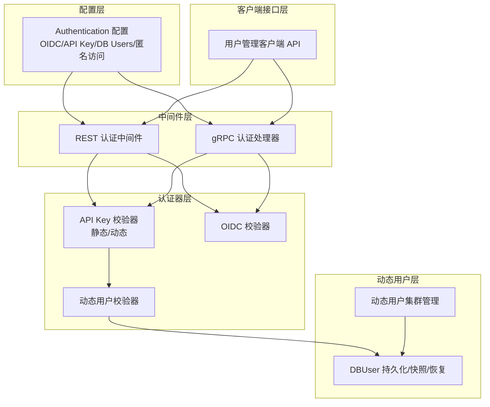
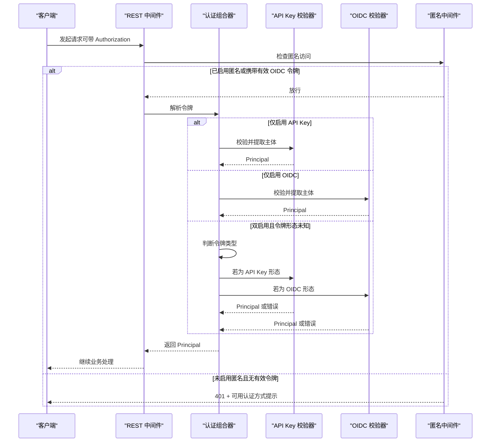
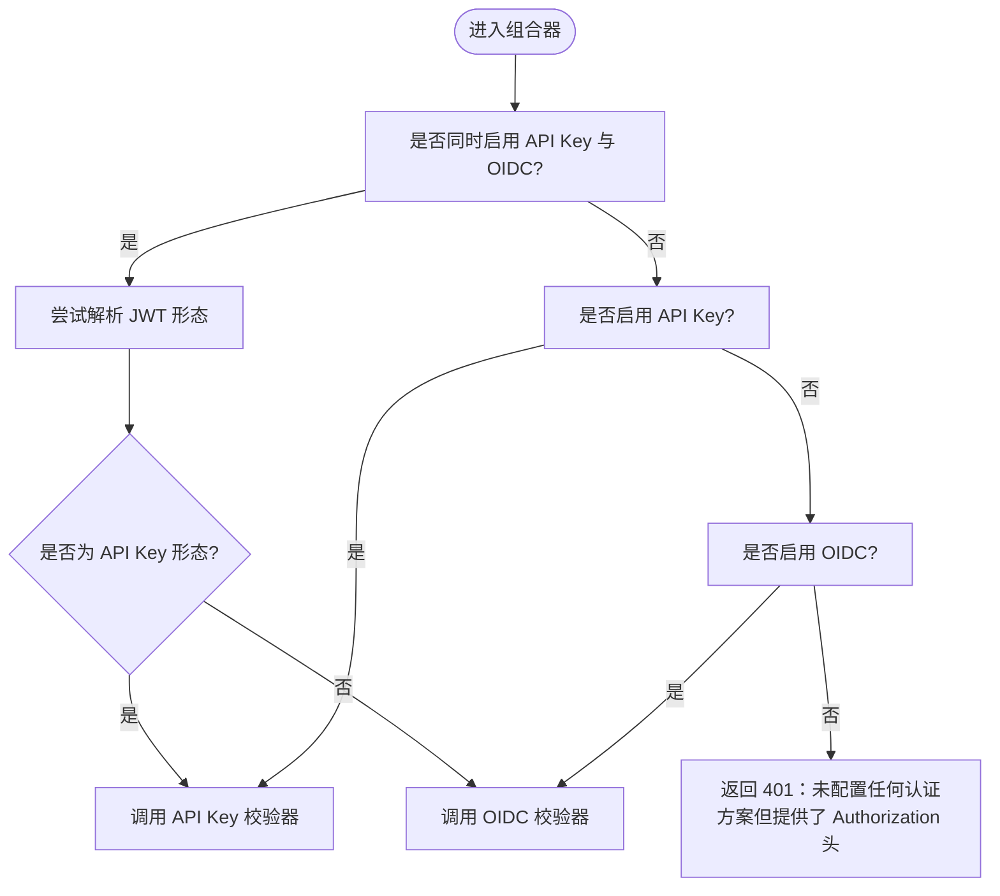
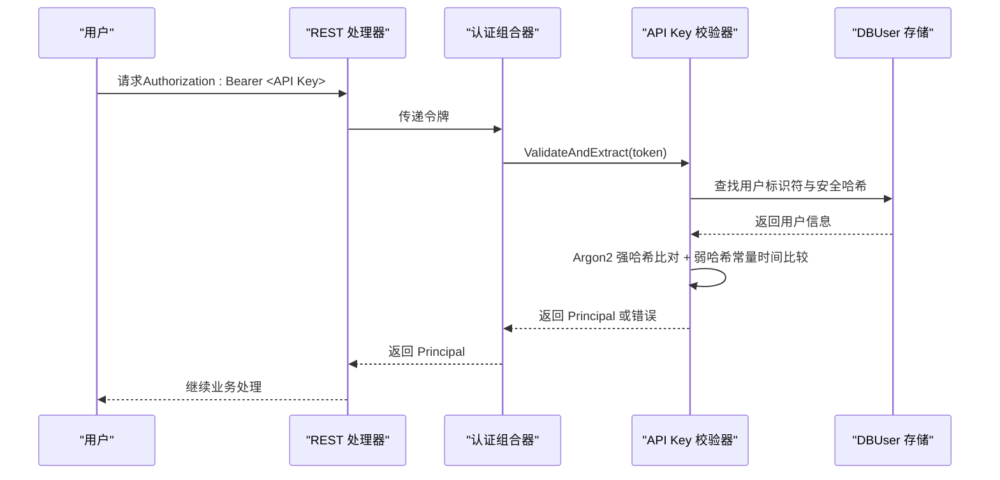
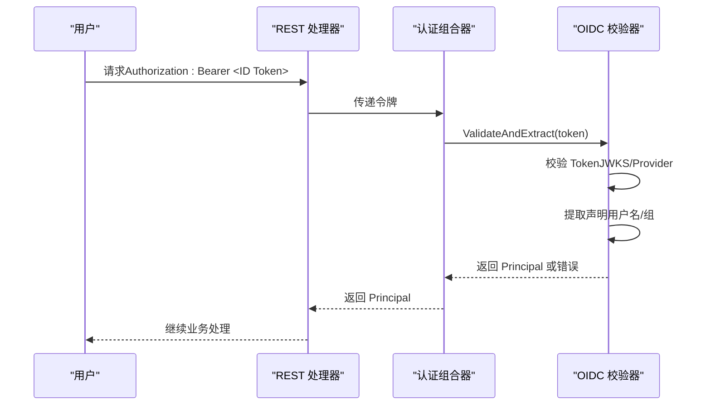
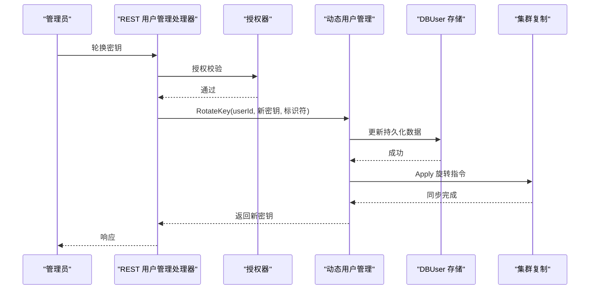
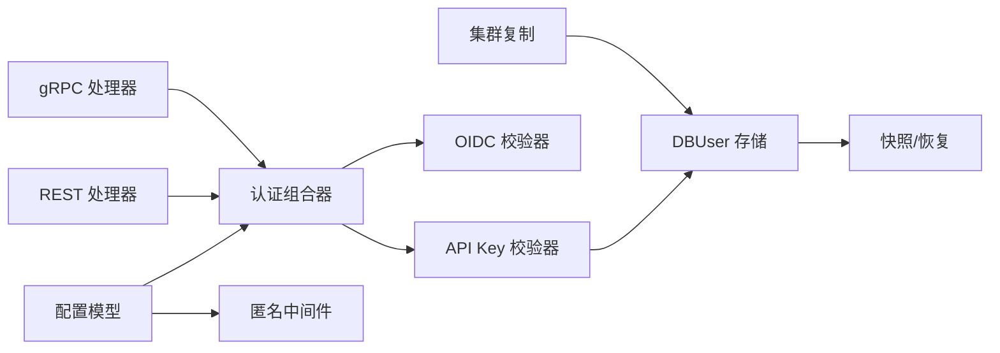

# 认证系统

<cite>
**本文引用的文件**
- [usecases/config/authentication.go](file://usecases/config/authentication.go)
- [usecases/auth/authentication/composer/token_validation.go](file://usecases/auth/authentication/composer/token_validation.go)
- [usecases/auth/authentication/apikey/db_users.go](file://usecases/auth/authentication/apikey/db_users.go)
- [usecases/auth/authentication/apikey/keys/key_generation.go](file://usecases/auth/authentication/apikey/keys/key_generation.go)
- [usecases/auth/authentication/oidc/middleware.go](file://usecases/auth/authentication/oidc/middleware.go)
- [usecases/auth/authentication/anonymous/middleware.go](file://usecases/auth/authentication/anonymous/middleware.go)
- [adapters/handlers/grpc/v1/auth/auth.go](file://adapters/handlers/grpc/v1/auth/auth.go)
- [adapters/handlers/rest/db_users/handlers_db_users.go](file://adapters/handlers/rest/db_users/handlers_db_users.go)
- [cluster/dynusers/dynamic_users.go](file://cluster/dynusers/dynamic_users.go)
- [client/users/users_client.go](file://client/users/users_client.go)
</cite>

## 目录
1. [简介](#简介)
2. [项目结构](#项目结构)
3. [核心组件](#核心组件)
4. [架构总览](#架构总览)
5. [详细组件分析](#详细组件分析)
6. [依赖关系分析](#依赖关系分析)
7. [性能考量](#性能考量)
8. [故障排查指南](#故障排查指南)
9. [结论](#结论)
10. [附录](#附录)

## 简介
本文件为 Weaviate 认证系统的全面技术文档，覆盖以下主题：
- 多种认证方式：API 密钥认证（含静态与动态）、OAuth2/OpenID Connect 集成、匿名访问控制
- 动态用户管理：用户创建、激活、停用、删除、API 密钥轮换与生命周期管理
- 认证中间件与请求拦截机制：REST 与 gRPC 的拦截与组合校验
- 安全最佳实践与配置建议
- 完整的认证流程与时序图，以及配置示例与集成指南

## 项目结构
Weaviate 的认证体系由“配置层”“认证器层”“中间件层”“动态用户层”“客户端接口层”组成：
- 配置层：定义认证模式（OIDC、API Key、DB Users、匿名访问）及其开关与参数
- 认证器层：API Key 校验器、OIDC 校验器、动态用户校验器
- 中间件层：REST 与 gRPC 的认证拦截器，支持动态选择认证方案
- 动态用户层：动态用户与密钥的持久化、快照、恢复与集群复制
- 客户端接口层：用户管理 API 的客户端封装

图表来源
- [usecases/config/authentication.go](file://usecases/config/authentication.go#L20-L83)
- [usecases/auth/authentication/composer/token_validation.go](file://usecases/auth/authentication/composer/token_validation.go#L25-L49)
- [usecases/auth/authentication/apikey/db_users.go](file://usecases/auth/authentication/apikey/db_users.go#L62-L153)
- [usecases/auth/authentication/oidc/middleware.go](file://usecases/auth/authentication/oidc/middleware.go#L37-L108)
- [adapters/handlers/grpc/v1/auth/auth.go](file://adapters/handlers/grpc/v1/auth/auth.go#L46-L71)
- [adapters/handlers/rest/db_users/handlers_db_users.go](file://adapters/handlers/rest/db_users/handlers_db_users.go#L70-L92)
- [cluster/dynusers/dynamic_users.go](file://cluster/dynusers/dynamic_users.go#L26-L171)
- [client/users/users_client.go](file://client/users/users_client.go#L31-L61)

章节来源
- [usecases/config/authentication.go](file://usecases/config/authentication.go#L20-L83)
- [usecases/auth/authentication/composer/token_validation.go](file://usecases/auth/authentication/composer/token_validation.go#L25-L49)
- [usecases/auth/authentication/apikey/db_users.go](file://usecases/auth/authentication/apikey/db_users.go#L62-L153)
- [usecases/auth/authentication/oidc/middleware.go](file://usecases/auth/authentication/oidc/middleware.go#L37-L108)
- [adapters/handlers/grpc/v1/auth/auth.go](file://adapters/handlers/grpc/v1/auth/auth.go#L46-L71)
- [adapters/handlers/rest/db_users/handlers_db_users.go](file://adapters/handlers/rest/db_users/handlers_db_users.go#L70-L92)
- [cluster/dynusers/dynamic_users.go](file://cluster/dynusers/dynamic_users.go#L26-L171)
- [client/users/users_client.go](file://client/users/users_client.go#L31-L61)

## 核心组件
- 认证配置模型：定义 OIDC、API Key、DB Users、匿名访问等配置项，并提供默认值与基本校验
- 认证组合器：根据配置动态选择 API Key 或 OIDC 校验器，或在两者并存时按令牌形态自动分流
- API Key 实现：支持静态 API Key 与动态用户 API Key；动态密钥采用分片标识符与 Argon2 哈希存储
- OIDC 实现：启动时初始化 Provider/JWKS，运行时校验 ID Token 并提取用户名与组信息
- 匿名访问中间件：在未启用匿名访问时拒绝无凭证请求，并提示可用认证方式
- gRPC 认证处理器：从 Metadata 提取 Bearer 令牌并交由认证组合器处理
- 动态用户管理：创建/激活/停用/删除用户，API 密钥轮换，持久化与快照恢复，集群复制
- 用户管理客户端：封装用户创建、查询、轮换密钥、停用/激活/删除等 REST API

章节来源
- [usecases/config/authentication.go](file://usecases/config/authentication.go#L20-L83)
- [usecases/auth/authentication/composer/token_validation.go](file://usecases/auth/authentication/composer/token_validation.go#L25-L69)
- [usecases/auth/authentication/apikey/db_users.go](file://usecases/auth/authentication/apikey/db_users.go#L40-L97)
- [usecases/auth/authentication/apikey/keys/key_generation.go](file://usecases/auth/authentication/apikey/keys/key_generation.go#L41-L78)
- [usecases/auth/authentication/oidc/middleware.go](file://usecases/auth/authentication/oidc/middleware.go#L133-L161)
- [usecases/auth/authentication/anonymous/middleware.go](file://usecases/auth/authentication/anonymous/middleware.go#L36-L70)
- [adapters/handlers/grpc/v1/auth/auth.go](file://adapters/handlers/grpc/v1/auth/auth.go#L46-L71)
- [adapters/handlers/rest/db_users/handlers_db_users.go](file://adapters/handlers/rest/db_users/handlers_db_users.go#L314-L423)
- [cluster/dynusers/dynamic_users.go](file://cluster/dynusers/dynamic_users.go#L35-L105)
- [client/users/users_client.go](file://client/users/users_client.go#L31-L61)

## 架构总览
Weaviate 的认证链路在 REST 与 gRPC 两条路径上复用同一套认证器与配置，通过中间件/处理器完成令牌解析与校验，并在授权前注入 Principal。

图表来源
- [usecases/auth/authentication/composer/token_validation.go](file://usecases/auth/authentication/composer/token_validation.go#L25-L69)
- [usecases/auth/authentication/anonymous/middleware.go](file://usecases/auth/authentication/anonymous/middleware.go#L36-L70)
- [usecases/auth/authentication/apikey/db_users.go](file://usecases/auth/authentication/apikey/db_users.go#L368-L412)
- [usecases/auth/authentication/oidc/middleware.go](file://usecases/auth/authentication/oidc/middleware.go#L133-L161)

## 详细组件分析

### 认证配置与组合器
- 配置模型提供 OIDC、API Key、DB Users、匿名访问的开关与参数，支持默认值与基础校验
- 认证组合器根据配置选择单一或动态认证方案：
  - 仅 API Key：使用 API Key 校验器
  - 仅 OIDC：使用 OIDC 校验器
  - 同时启用：尝试解析令牌类型，若为 API Key 形态走 API Key 校验，否则走 OIDC 校验
  - 未启用任何认证但携带 Authorization 头：返回 401 提示配置问题

图表来源
- [usecases/auth/authentication/composer/token_validation.go](file://usecases/auth/authentication/composer/token_validation.go#L25-L69)

章节来源
- [usecases/config/authentication.go](file://usecases/config/authentication.go#L20-L83)
- [usecases/auth/authentication/composer/token_validation.go](file://usecases/auth/authentication/composer/token_validation.go#L25-L69)

### API 密钥认证与动态用户
- API Key 结构与生成
  - 动态用户 API Key 由三部分组成：用户标识符、随机密钥、版本标识，经 Base64 编码后返回
  - 使用 Argon2 参数生成强哈希，内存占用与迭代次数固定，确保抗暴力破解
  - 解码时严格校验长度与版本标识，防止伪造
- 动态用户存储与校验
  - 存储结构包含：用户映射、安全哈希、标识符映射、活跃状态、密钥撤销、最后使用时间等
  - 校验流程：先按标识符定位用户，再进行强哈希比对与弱哈希常量时间比较，检查用户状态与密钥撤销标记
  - 引入单飞（singleflight）避免并发 Argon2 验证重复计算
  - 支持导入静态密钥场景：导入密钥在轮换后被阻断，确保安全性
- API 密钥轮换
  - 生成新密钥与标识符，更新持久化数据，清除撤销标记与内存中的弱哈希缓存
  - 旧标识符与新标识符可为空以兼容回放命令

图表来源
- [usecases/auth/authentication/apikey/db_users.go](file://usecases/auth/authentication/apikey/db_users.go#L368-L412)
- [usecases/auth/authentication/apikey/keys/key_generation.go](file://usecases/auth/authentication/apikey/keys/key_generation.go#L41-L78)

章节来源
- [usecases/auth/authentication/apikey/db_users.go](file://usecases/auth/authentication/apikey/db_users.go#L40-L97)
- [usecases/auth/authentication/apikey/db_users.go](file://usecases/auth/authentication/apikey/db_users.go#L179-L245)
- [usecases/auth/authentication/apikey/db_users.go](file://usecases/auth/authentication/apikey/db_users.go#L368-L412)
- [usecases/auth/authentication/apikey/keys/key_generation.go](file://usecases/auth/authentication/apikey/keys/key_generation.go#L41-L78)
- [usecases/auth/authentication/apikey/keys/key_generation.go](file://usecases/auth/authentication/apikey/keys/key_generation.go#L91-L118)

### OAuth2/OpenID Connect 集成
- 初始化阶段
  - 校验必要字段（issuer、username_claim 等），支持自定义证书（本地/HTTP/S3）
  - 优先使用 JWKS URL，否则通过 Issuer 自动发现 Provider
- 运行阶段
  - 校验 ID Token，提取声明，解析用户名与组列表
  - 支持跳过 ClientID 校验（谨慎使用）
- 错误处理
  - 未启用 OIDC 时拒绝携带 OIDC 令牌的请求
  - 校验失败返回 401，声明解析异常返回 500

图表来源
- [usecases/auth/authentication/oidc/middleware.go](file://usecases/auth/authentication/oidc/middleware.go#L133-L161)
- [usecases/auth/authentication/oidc/middleware.go](file://usecases/auth/authentication/oidc/middleware.go#L215-L298)

章节来源
- [usecases/auth/authentication/oidc/middleware.go](file://usecases/auth/authentication/oidc/middleware.go#L66-L108)
- [usecases/auth/authentication/oidc/middleware.go](file://usecases/auth/authentication/oidc/middleware.go#L133-L161)
- [usecases/auth/authentication/oidc/middleware.go](file://usecases/auth/authentication/oidc/middleware.go#L215-L298)

### 匿名访问与请求拦截
- 当匿名访问未启用时，若请求携带 Bearer 令牌则直接放行（认为已由 OIDC 校验器验证）
- 若未携带令牌且匿名未启用，则返回 401，并提示可用认证方式（API Keys/OIDC）

章节来源
- [usecases/auth/authentication/anonymous/middleware.go](file://usecases/auth/authentication/anonymous/middleware.go#L36-L70)

### gRPC 认证处理器
- 从 Metadata 中提取 Authorization 头，要求 Bearer 前缀
- 若未提供或不合法，尝试匿名（取决于配置）
- 将令牌交由认证组合器处理，返回 Principal 或错误

章节来源
- [adapters/handlers/grpc/v1/auth/auth.go](file://adapters/handlers/grpc/v1/auth/auth.go#L46-L71)

### 动态用户管理与集群复制
- 用户管理 API
  - 创建用户（支持导入静态密钥）、查询用户、列出用户、轮换密钥、停用/激活/删除用户
  - 校验与授权：基于 RBAC 与管理员名单，限制根用户与管理员名单用户的操作范围
- 动态用户持久化
  - 文件快照与恢复，定期写盘，避免每次请求频繁落盘
  - 内存中维护弱哈希缓存与导入密钥阻断列表，提升校验性能与安全性
- 集群复制
  - 通过 Raft Apply/Query 指令在集群节点间同步用户与密钥状态
  - 支持快照与恢复，保证一致性与高可用

图表来源
- [adapters/handlers/rest/db_users/handlers_db_users.go](file://adapters/handlers/rest/db_users/handlers_db_users.go#L388-L423)
- [usecases/auth/authentication/apikey/db_users.go](file://usecases/auth/authentication/apikey/db_users.go#L215-L245)
- [cluster/dynusers/dynamic_users.go](file://cluster/dynusers/dynamic_users.go#L95-L105)

章节来源
- [adapters/handlers/rest/db_users/handlers_db_users.go](file://adapters/handlers/rest/db_users/handlers_db_users.go#L94-L164)
- [adapters/handlers/rest/db_users/handlers_db_users.go](file://adapters/handlers/rest/db_users/handlers_db_users.go#L314-L423)
- [usecases/auth/authentication/apikey/db_users.go](file://usecases/auth/authentication/apikey/db_users.go#L179-L245)
- [cluster/dynusers/dynamic_users.go](file://cluster/dynusers/dynamic_users.go#L35-L105)

### 用户管理客户端
- 客户端封装了用户创建、查询、轮换密钥、停用/激活/删除等 REST API
- 便于外部工具与 SDK 调用，统一错误处理与响应解析

章节来源
- [client/users/users_client.go](file://client/users/users_client.go#L31-L61)
- [client/users/users_client.go](file://client/users/users_client.go#L109-L143)
- [client/users/users_client.go](file://client/users/users_client.go#L350-L389)

## 依赖关系分析
- 配置层驱动认证器层与中间件层的行为
- 认证组合器在运行时根据令牌形态与配置选择具体校验器
- 动态用户模块与 DBUser 存储紧密耦合，提供持久化与快照能力
- 集群模块负责跨节点同步动态用户状态，确保一致性

图表来源
- [usecases/config/authentication.go](file://usecases/config/authentication.go#L20-L83)
- [usecases/auth/authentication/composer/token_validation.go](file://usecases/auth/authentication/composer/token_validation.go#L25-L69)
- [usecases/auth/authentication/apikey/db_users.go](file://usecases/auth/authentication/apikey/db_users.go#L438-L471)
- [cluster/dynusers/dynamic_users.go](file://cluster/dynusers/dynamic_users.go#L152-L170)

章节来源
- [usecases/config/authentication.go](file://usecases/config/authentication.go#L20-L83)
- [usecases/auth/authentication/composer/token_validation.go](file://usecases/auth/authentication/composer/token_validation.go#L25-L69)
- [usecases/auth/authentication/apikey/db_users.go](file://usecases/auth/authentication/apikey/db_users.go#L438-L471)
- [cluster/dynusers/dynamic_users.go](file://cluster/dynusers/dynamic_users.go#L152-L170)

## 性能考量
- API Key 校验
  - 使用单飞（singleflight）避免同一用户并发 Argon2 重复计算
  - 内存中缓存弱哈希，减少强哈希比对频率
  - 最后使用时间更新采用尽力而为策略，降低写盘频率
- 动态用户持久化
  - 定时写盘（每分钟）以平衡性能与可靠性
  - 快照版本控制，避免不同版本导致的恢复失败
- OIDC 校验
  - 启动时预热 JWKS/Provider，运行时使用远程 KeySet 或 Provider Verifier
  - 支持自定义证书，避免网络与证书链带来的额外开销

## 故障排查指南
- 401 未认证
  - 检查是否启用了匿名访问；若未启用且携带 Bearer 令牌，确认 OIDC 配置正确
  - 若同时启用 API Key 与 OIDC，确认令牌形态是否符合预期
- 令牌无效
  - API Key：确认密钥格式、标识符长度与版本标识；检查用户状态与密钥撤销标记
  - OIDC：确认 issuer、client_id、username_claim 配置；检查 JWKS/Provider 可达性与证书
- 动态用户操作失败
  - 检查 RBAC 与管理员名单权限；确认用户存在且非根用户
  - 密钥轮换后旧密钥应被阻断，如仍可用需检查导入密钥阻断逻辑

章节来源
- [usecases/auth/authentication/anonymous/middleware.go](file://usecases/auth/authentication/anonymous/middleware.go#L36-L70)
- [usecases/auth/authentication/apikey/db_users.go](file://usecases/auth/authentication/apikey/db_users.go#L368-L412)
- [usecases/auth/authentication/oidc/middleware.go](file://usecases/auth/authentication/oidc/middleware.go#L110-L131)
- [adapters/handlers/rest/db_users/handlers_db_users.go](file://adapters/handlers/rest/db_users/handlers_db_users.go#L496-L541)

## 结论
Weaviate 的认证系统通过配置驱动、中间件拦截与认证器组合，实现了灵活的多认证模式支持。API Key 与 OIDC 的并存通过令牌形态自动分流，既保证易用性也兼顾安全性。动态用户管理提供完善的生命周期与安全策略，结合集群复制与快照恢复，满足生产环境的高可用需求。建议在生产环境中启用最小权限原则、定期轮换密钥、审慎使用匿名访问，并对 OIDC 配置进行严格校验与监控。

## 附录

### 配置示例与集成指南
- 启用 OIDC
  - 设置 issuer、client_id、username_claim、jwks_url 或 issuer
  - 可选：skip_client_id_check、groups_claim、certificate
- 启用静态 API Key
  - 在配置中启用 API Key，并提供 users 与 allowed_keys
- 启用动态用户
  - 启用 db_users；通过用户管理 API 创建与轮换密钥
- 启用匿名访问
  - 仅在测试或特定场景下启用；生产环境建议关闭并明确指定认证方式

章节来源
- [usecases/config/authentication.go](file://usecases/config/authentication.go#L62-L83)
- [usecases/auth/authentication/oidc/middleware.go](file://usecases/auth/authentication/oidc/middleware.go#L66-L108)