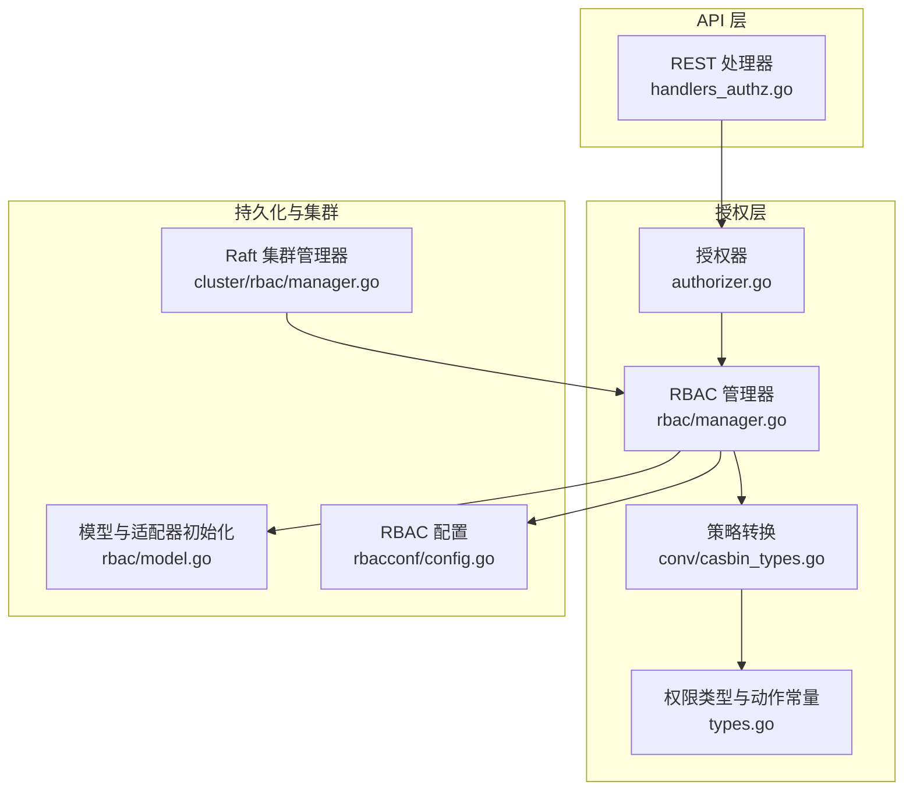
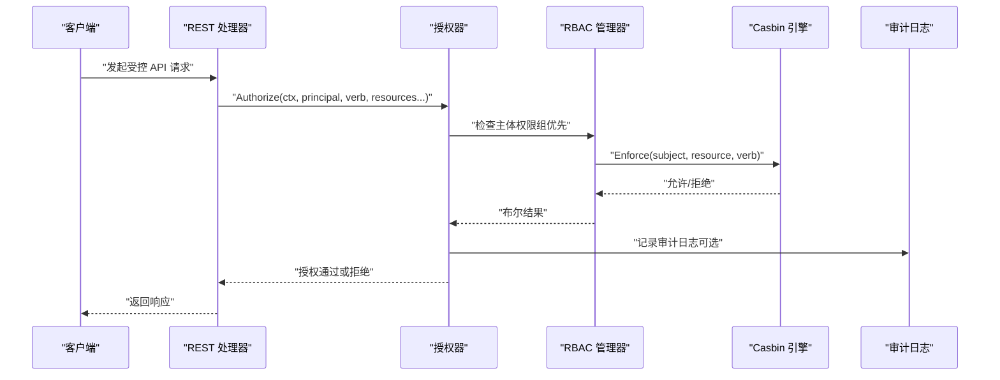
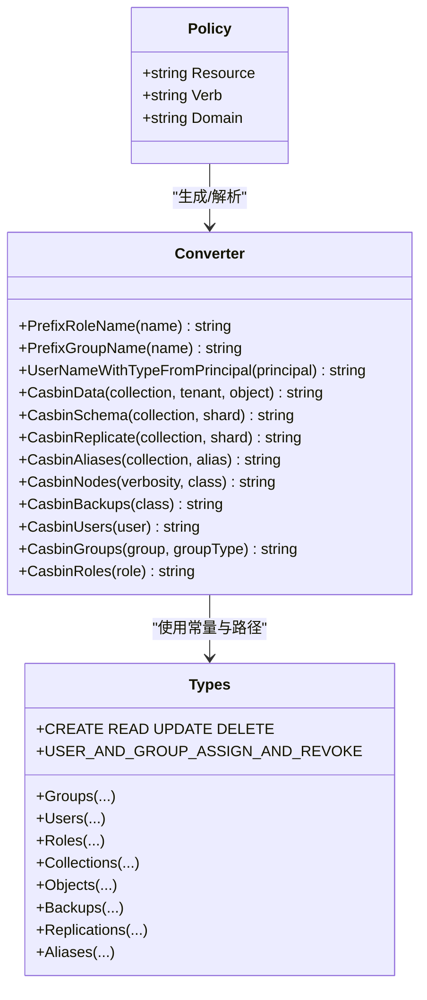
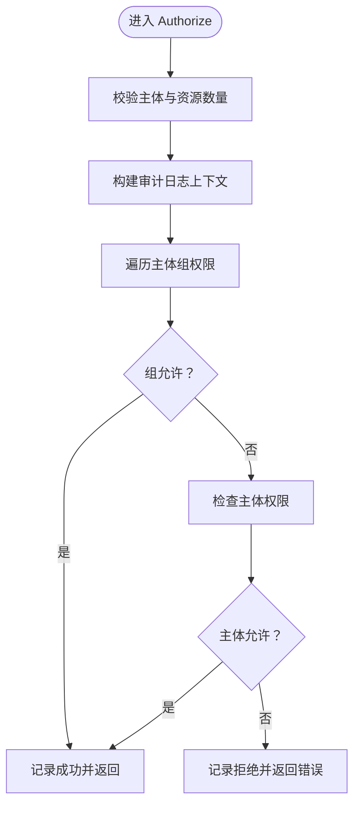
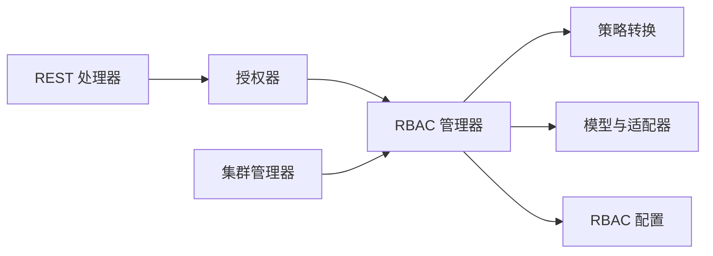

# 访问控制策略

<cite>
**本文引用的文件**
- [usecases/auth/authorization/rbac/manager.go](file://usecases/auth/authorization/rbac/manager.go)
- [usecases/auth/authorization/rbac/authorizer.go](file://usecases/auth/authorization/rbac/authorizer.go)
- [usecases/auth/authorization/conv/casbin_types.go](file://usecases/auth/authorization/conv/casbin_types.go)
- [usecases/auth/authorization/types.go](file://usecases/auth/authorization/types.go)
- [usecases/auth/authorization/rbac/model.go](file://usecases/auth/authorization/rbac/model.go)
- [usecases/auth/authorization/rbac/rbacconf/config.go](file://usecases/auth/authorization/rbac/rbacconf/config.go)
- [adapters/handlers/rest/authz/handlers_authz.go](file://adapters/handlers/rest/authz/handlers_authz.go)
- [cluster/rbac/manager.go](file://cluster/rbac/manager.go)
- [usecases/auth/authorization/rbac/authorizer_test.go](file://usecases/auth/authorization/rbac/authorizer_test.go)
- [test/acceptance/authz/helper.go](file://test/acceptance/authz/helper.go)
- [test/acceptance/authz/rbac_auto_admin_permissions_test.go](file://test/acceptance/authz/rbac_auto_admin_permissions_test.go)
</cite>

## 目录
1. [引言](#引言)
2. [项目结构](#项目结构)
3. [核心组件](#核心组件)
4. [架构总览](#架构总览)
5. [详细组件分析](#详细组件分析)
6. [依赖关系分析](#依赖关系分析)
7. [性能考量](#性能考量)
8. [故障排查指南](#故障排查指南)
9. [结论](#结论)
10. [附录](#附录)

## 引言
本文件面向安全分析师与系统架构师，系统性梳理 Weaviate 的细粒度访问控制（RBAC）策略体系，覆盖对象级、集合级与全局级权限模型，权限表达与 ACL 实现，请求拦截与决策流程，缓存与性能优化，以及审计与日志记录。文档以代码为依据，辅以图示帮助理解。

## 项目结构
Weaviate 的访问控制由“授权器（Authorizer）+ 策略转换（Converter）+ 配置（RBAC 配置）+ REST 处理器（Handlers）+ Raft 集群同步（Cluster RBAC Manager）”构成，形成从 API 层到持久化存储的完整闭环。

**图表来源**
- [adapters/handlers/rest/authz/handlers_authz.go](file://adapters/handlers/rest/authz/handlers_authz.go#L65-L102)
- [usecases/auth/authorization/rbac/authorizer.go](file://usecases/auth/authorization/rbac/authorizer.go#L28-L99)
- [usecases/auth/authorization/rbac/manager.go](file://usecases/auth/authorization/rbac/manager.go#L40-L55)
- [usecases/auth/authorization/conv/casbin_types.go](file://usecases/auth/authorization/conv/casbin_types.go#L26-L62)
- [usecases/auth/authorization/types.go](file://usecases/auth/authorization/types.go#L27-L60)
- [usecases/auth/authorization/rbac/model.go](file://usecases/auth/authorization/rbac/model.go#L84-L145)
- [cluster/rbac/manager.go](file://cluster/rbac/manager.go#L31-L36)
- [usecases/auth/authorization/rbac/rbacconf/config.go](file://usecases/auth/authorization/rbac/rbacconf/config.go#L16-L24)

**章节来源**
- [adapters/handlers/rest/authz/handlers_authz.go](file://adapters/handlers/rest/authz/handlers_authz.go#L65-L102)
- [usecases/auth/authorization/rbac/manager.go](file://usecases/auth/authorization/rbac/manager.go#L40-L55)
- [usecases/auth/authorization/conv/casbin_types.go](file://usecases/auth/authorization/conv/casbin_types.go#L26-L62)
- [usecases/auth/authorization/rbac/model.go](file://usecases/auth/authorization/rbac/model.go#L84-L145)
- [cluster/rbac/manager.go](file://cluster/rbac/manager.go#L31-L36)
- [usecases/auth/authorization/rbac/rbacconf/config.go](file://usecases/auth/authorization/rbac/rbacconf/config.go#L16-L24)

## 核心组件
- 授权器（Authorizer）
  - 提供对外授权接口：Authorize、AuthorizeSilent、FilterAuthorizedResources。
  - 负责聚合重复资源、生成审计日志、按组权限优先于用户权限进行决策。
- RBAC 管理器（Manager）
  - 维护策略持久化（CSV 文件）、角色与用户/组映射、快照与恢复。
  - 对外提供增删改查角色、分配/撤销角色、查询角色与主体等能力。
- 策略转换（Converter）
  - 将外部 Permission 映射为 Casbin 资源路径与动作；反向解析时将资源路径还原为 Permission。
  - 定义资源域与通配规则，确保资源匹配与审计输出格式一致。
- 权限类型与动作（Types）
  - 定义 CRUD 与特殊动作（如角色范围管理、用户/组分配与撤销），并提供资源路径构造工具。
- 模型与适配器（Model）
  - 加载 Casbin 模型、启用缓存、设置 CSV 适配器、注册自定义匹配函数、应用预定义角色。
- 配置（RBAC 配置）
  - 控制是否启用 RBAC、根用户/只读用户/管理员/组等内置角色生效范围。
- REST 处理器（Handlers）
  - 将 API 请求转换为授权调用，校验角色名与权限合法性，处理角色作用域授权。
- Raft 集群管理器（Cluster RBAC Manager）
  - 在集群中分发 Apply/Query 命令，负责策略变更与查询的跨节点一致性。

**章节来源**
- [usecases/auth/authorization/rbac/authorizer.go](file://usecases/auth/authorization/rbac/authorizer.go#L28-L99)
- [usecases/auth/authorization/rbac/manager.go](file://usecases/auth/authorization/rbac/manager.go#L40-L55)
- [usecases/auth/authorization/conv/casbin_types.go](file://usecases/auth/authorization/conv/casbin_types.go#L26-L62)
- [usecases/auth/authorization/types.go](file://usecases/auth/authorization/types.go#L27-L60)
- [usecases/auth/authorization/rbac/model.go](file://usecases/auth/authorization/rbac/model.go#L84-L145)
- [usecases/auth/authorization/rbac/rbacconf/config.go](file://usecases/auth/authorization/rbac/rbacconf/config.go#L16-L24)
- [adapters/handlers/rest/authz/handlers_authz.go](file://adapters/handlers/rest/authz/handlers_authz.go#L104-L126)
- [cluster/rbac/manager.go](file://cluster/rbac/manager.go#L31-L36)

## 架构总览
下图展示一次典型授权请求在系统中的流转：REST 层接收请求，调用授权器，授权器通过 Casbin 执行策略匹配，并在需要时写入审计日志。

**图表来源**
- [adapters/handlers/rest/authz/handlers_authz.go](file://adapters/handlers/rest/authz/handlers_authz.go#L128-L178)
- [usecases/auth/authorization/rbac/authorizer.go](file://usecases/auth/authorization/rbac/authorizer.go#L101-L110)
- [usecases/auth/authorization/rbac/manager.go](file://usecases/auth/authorization/rbac/manager.go#L444-L458)

## 详细组件分析

### 权限模型与动作
- 动作常量
  - CRUD：CREATE、READ、UPDATE、DELETE。
  - 特殊动作：角色范围管理（ROLE_SCOPE_MATCH/ALL）、用户/组分配与撤销（USER_AND_GROUP_ASSIGN_AND_REVOKE）。
- 资源域
  - 全局域：cluster、nodes、backups。
  - 集合域：schema（collections、tenants）、data、replicate、aliases。
  - 主体域：roles、users、groups。
- 资源路径构造
  - 提供工具函数生成集合、租户、对象、复制、别名等路径，支持通配符与精确匹配。
- 内置角色
  - viewer、admin、root、read-only，分别映射不同动作集合。

**章节来源**
- [usecases/auth/authorization/types.go](file://usecases/auth/authorization/types.go#L27-L60)
- [usecases/auth/authorization/types.go](file://usecases/auth/authorization/types.go#L104-L206)
- [usecases/auth/authorization/types.go](file://usecases/auth/authorization/types.go#L229-L233)
- [usecases/auth/authorization/types.go](file://usecases/auth/authorization/types.go#L235-L269)
- [usecases/auth/authorization/types.go](file://usecases/auth/authorization/types.go#L271-L344)
- [usecases/auth/authorization/types.go](file://usecases/auth/authorization/types.go#L346-L398)
- [usecases/auth/authorization/types.go](file://usecases/auth/authorization/types.go#L400-L461)
- [usecases/auth/authorization/types.go](file://usecases/auth/authorization/types.go#L477-L489)
- [usecases/auth/authorization/types.go](file://usecases/auth/authorization/types.go#L491-L519)
- [usecases/auth/authorization/types.go](file://usecases/auth/authorization/types.go#L521-L539)
- [usecases/auth/authorization/types.go](file://usecases/auth/authorization/types.go#L541-L547)
- [usecases/auth/authorization/types.go](file://usecases/auth/authorization/types.go#L553-L598)

### 访问控制列表（ACL）与策略表达
- 主体标识
  - 用户：前缀 + 认证类型 + 用户名（如 db:testuser）。
  - 组：前缀 + 组类型 + 组名（仅支持 OIDC 组）。
  - 角色：前缀 + 角色名。
- 资源标识
  - 使用统一资源路径模板，覆盖 collections、shards、objects、verbosity 等层级。
- 权限表达
  - 策略三元组：主体（用户/组/角色）- 资源（路径）- 动作（verb）。
  - 支持“角色范围”动作扩展，用于限制角色创建/修改权限的上限。

**图表来源**
- [usecases/auth/authorization/conv/casbin_types.go](file://usecases/auth/authorization/conv/casbin_types.go#L26-L62)
- [usecases/auth/authorization/conv/casbin_types.go](file://usecases/auth/authorization/conv/casbin_types.go#L512-L548)
- [usecases/auth/authorization/conv/casbin_types.go](file://usecases/auth/authorization/conv/casbin_types.go#L185-L200)
- [usecases/auth/authorization/conv/casbin_types.go](file://usecases/auth/authorization/conv/casbin_types.go#L147-L183)
- [usecases/auth/authorization/conv/casbin_types.go](file://usecases/auth/authorization/conv/casbin_types.go#L102-L121)
- [usecases/auth/authorization/conv/casbin_types.go](file://usecases/auth/authorization/conv/casbin_types.go#L123-L145)
- [usecases/auth/authorization/conv/casbin_types.go](file://usecases/auth/authorization/conv/casbin_types.go#L131-L145)
- [usecases/auth/authorization/conv/casbin_types.go](file://usecases/auth/authorization/conv/casbin_types.go#L139-L145)
- [usecases/auth/authorization/conv/casbin_types.go](file://usecases/auth/authorization/conv/casbin_types.go#L233-L370)
- [usecases/auth/authorization/types.go](file://usecases/auth/authorization/types.go#L229-L233)

**章节来源**
- [usecases/auth/authorization/conv/casbin_types.go](file://usecases/auth/authorization/conv/casbin_types.go#L26-L62)
- [usecases/auth/authorization/conv/casbin_types.go](file://usecases/auth/authorization/conv/casbin_types.go#L512-L548)
- [usecases/auth/authorization/conv/casbin_types.go](file://usecases/auth/authorization/conv/casbin_types.go#L185-L200)
- [usecases/auth/authorization/conv/casbin_types.go](file://usecases/auth/authorization/conv/casbin_types.go#L147-L183)
- [usecases/auth/authorization/conv/casbin_types.go](file://usecases/auth/authorization/conv/casbin_types.go#L102-L121)
- [usecases/auth/authorization/conv/casbin_types.go](file://usecases/auth/authorization/conv/casbin_types.go#L123-L145)
- [usecases/auth/authorization/conv/casbin_types.go](file://usecases/auth/authorization/conv/casbin_types.go#L131-L145)
- [usecases/auth/authorization/conv/casbin_types.go](file://usecases/auth/authorization/conv/casbin_types.go#L139-L145)
- [usecases/auth/authorization/conv/casbin_types.go](file://usecases/auth/authorization/conv/casbin_types.go#L233-L370)
- [usecases/auth/authorization/types.go](file://usecases/auth/authorization/types.go#L229-L233)

### 权限验证流程与决策
- 请求拦截与参数绑定
  - REST 层将 HTTP 请求绑定为操作参数，提取 Principal 并调用授权器。
- 决策执行
  - 授权器先对主体所属组逐一尝试匹配，若任一组允许则放行；否则再尝试主体自身权限。
  - 对重复资源进行去重计数，最终一次性输出审计日志。
- 过滤模式
  - FilterAuthorizedResources 采用“尽力而为”策略，返回允许的资源子集，不抛出错误。

**图表来源**
- [usecases/auth/authorization/rbac/authorizer.go](file://usecases/auth/authorization/rbac/authorizer.go#L28-L99)
- [usecases/auth/authorization/rbac/manager.go](file://usecases/auth/authorization/rbac/manager.go#L444-L458)

**章节来源**
- [adapters/handlers/rest/authz/handlers_authz.go](file://adapters/handlers/rest/authz/handlers_authz.go#L128-L178)
- [usecases/auth/authorization/rbac/authorizer.go](file://usecases/auth/authorization/rbac/authorizer.go#L28-L99)
- [usecases/auth/authorization/rbac/manager.go](file://usecases/auth/authorization/rbac/manager.go#L444-L458)

### 角色与作用域授权
- 角色创建/更新时，处理器会根据“全部范围（ALL）”或“匹配范围（MATCH）”策略进行授权判定：
  - 全部范围：当前主体必须拥有目标角色的完全权限。
  - 匹配范围：当前主体必须拥有所有即将授予的权限。
- 该机制避免高权限主体越权授予更高权限。

**章节来源**
- [adapters/handlers/rest/authz/handlers_authz.go](file://adapters/handlers/rest/authz/handlers_authz.go#L104-L126)

### 策略持久化与快照恢复
- 存储介质
  - 使用 CSV 适配器持久化策略与分组策略。
- 快照
  - 管理器导出策略与分组策略为快照，版本化保存；恢复时清空旧策略并加载新策略，必要时升级。
- 缓存
  - 启用 Casbin 缓存提升匹配性能。

**章节来源**
- [usecases/auth/authorization/rbac/model.go](file://usecases/auth/authorization/rbac/model.go#L84-L145)
- [usecases/auth/authorization/rbac/manager.go](file://usecases/auth/authorization/rbac/manager.go#L363-L438)

### 审计与日志记录
- 审计字段
  - 包含 action、user、component、request_action、rbac_log_version、source_ip（可选）、groups（可选）等。
- 日志聚合
  - 对相同资源的多次请求进行去重计数，减少日志噪音。
- 测试与验收
  - 提供日志扫描工具，定位授权事件并统计调用次数。

**章节来源**
- [usecases/auth/authorization/rbac/authorizer.go](file://usecases/auth/authorization/rbac/authorizer.go#L37-L96)
- [usecases/auth/authorization/rbac/authorizer_test.go](file://usecases/auth/authorization/rbac/authorizer_test.go#L180-L230)
- [test/acceptance/authz/helper.go](file://test/acceptance/authz/helper.go#L224-L258)
- [test/acceptance/authz/rbac_auto_admin_permissions_test.go](file://test/acceptance/authz/rbac_auto_admin_permissions_test.go#L79-L141)

### 权限冲突与优先级
- 组优先：主体的组权限优先于其个人权限。
- 范围优先：角色范围（ALL/MATCH）决定授权阈值，MATCH 要求主体具备即将授予的所有权限。
- 资源优先：资源路径越精确，优先级越高（由匹配器与通配规则共同决定）。

**章节来源**
- [usecases/auth/authorization/rbac/manager.go](file://usecases/auth/authorization/rbac/manager.go#L444-L458)
- [adapters/handlers/rest/authz/handlers_authz.go](file://adapters/handlers/rest/authz/handlers_authz.go#L104-L126)

### 权限配置示例与策略设计指南
- 示例场景
  - 仅允许读取指定集合元数据与对象数据。
  - 限制用户仅能管理自身拥有的租户。
  - 通过角色范围 MATCH 限制管理员只能授予低于等于自身权限的角色。
- 设计建议
  - 优先使用集合级与租户级权限，避免过度授权。
  - 利用内置角色作为基线，再叠加最小权限策略。
  - 使用审计日志追踪权限变更与访问行为。

[本节为概念性指导，不直接分析具体文件]

## 依赖关系分析
- 组件耦合
  - Handlers 依赖 Authorizer；Authorizer 依赖 Manager；Manager 依赖 Converter、Model、Config。
  - Cluster RBAC Manager 依赖底层 Raft 协议与 Snapshotter，实现跨节点一致性。
- 外部依赖
  - Casbin（策略引擎与缓存）、CSV 适配器（持久化）、Logrus（审计日志）。

**图表来源**
- [adapters/handlers/rest/authz/handlers_authz.go](file://adapters/handlers/rest/authz/handlers_authz.go#L65-L102)
- [usecases/auth/authorization/rbac/authorizer.go](file://usecases/auth/authorization/rbac/authorizer.go#L28-L99)
- [usecases/auth/authorization/rbac/manager.go](file://usecases/auth/authorization/rbac/manager.go#L40-L55)
- [usecases/auth/authorization/conv/casbin_types.go](file://usecases/auth/authorization/conv/casbin_types.go#L26-L62)
- [usecases/auth/authorization/rbac/model.go](file://usecases/auth/authorization/rbac/model.go#L84-L145)
- [cluster/rbac/manager.go](file://cluster/rbac/manager.go#L31-L36)

**章节来源**
- [adapters/handlers/rest/authz/handlers_authz.go](file://adapters/handlers/rest/authz/handlers_authz.go#L65-L102)
- [usecases/auth/authorization/rbac/manager.go](file://usecases/auth/authorization/rbac/manager.go#L40-L55)
- [usecases/auth/authorization/conv/casbin_types.go](file://usecases/auth/authorization/conv/casbin_types.go#L26-L62)
- [usecases/auth/authorization/rbac/model.go](file://usecases/auth/authorization/rbac/model.go#L84-L145)
- [cluster/rbac/manager.go](file://cluster/rbac/manager.go#L31-L36)

## 性能考量
- 缓存
  - 启用 Casbin 缓存，显著降低重复授权的开销。
- 去重与聚合
  - 对重复资源进行去重计数，减少日志与匹配次数。
- 最佳实践
  - 合理设计资源路径，避免过多通配导致匹配成本上升。
  - 控制角色数量与权限粒度，减少策略条目规模。

[本节提供通用性能建议，不直接分析具体文件]

## 故障排查指南
- 常见问题
  - 未认证：主体为空导致拒绝。
  - 资源缺失：未提供至少一个资源路径。
  - 组权限不足：主体虽有用户权限但组权限不允许。
  - 审计日志缺失：IP 审计被禁用或审计开关关闭。
- 定位手段
  - 查看授权日志中的 permissions 字段，确认资源与结果映射。
  - 使用验收测试的日志扫描工具定位授权事件。
- 参考测试
  - 授权失败与审计日志断言、批量资源聚合断言、端点调用次数统计。

**章节来源**
- [usecases/auth/authorization/rbac/authorizer.go](file://usecases/auth/authorization/rbac/authorizer.go#L28-L99)
- [usecases/auth/authorization/rbac/authorizer_test.go](file://usecases/auth/authorization/rbac/authorizer_test.go#L180-L230)
- [test/acceptance/authz/helper.go](file://test/acceptance/authz/helper.go#L224-L258)
- [test/acceptance/authz/rbac_auto_admin_permissions_test.go](file://test/acceptance/authz/rbac_auto_admin_permissions_test.go#L79-L141)

## 结论
Weaviate 的 RBAC 体系以 Casbin 为核心，结合统一的资源路径模型与严格的主体优先级策略，实现了细粒度的多层级权限控制。通过缓存、审计与快照机制，系统在保证安全性的同时兼顾了性能与可运维性。建议在生产环境中遵循最小权限原则，合理划分角色与权限，并持续利用审计日志进行合规与风险监控。

## 附录
- 关键 API 与路径
  - 角色与权限管理：/authz/roles、/authz/roles/{id}/permissions
  - 用户与组授权：/authz/users/{id}/roles、/authz/groups/{id}/roles
  - 权限检查：/authz/roles/{id}/has-permission
- 配置项
  - enabled：是否启用 RBAC。
  - root_users/root_groups：根用户/组列表。
  - readonly_groups/viewer_users/admin_users：内置角色生效范围。
  - ip_in_audit：是否在审计日志中记录来源 IP。

**章节来源**
- [usecases/auth/authorization/rbac/rbacconf/config.go](file://usecases/auth/authorization/rbac/rbacconf/config.go#L16-L24)
- [adapters/handlers/rest/authz/handlers_authz.go](file://adapters/handlers/rest/authz/handlers_authz.go#L65-L102)