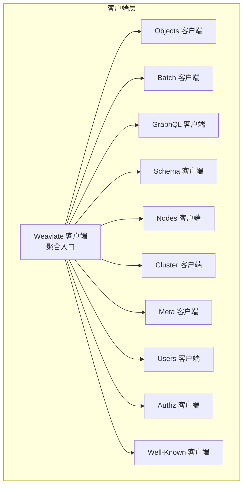
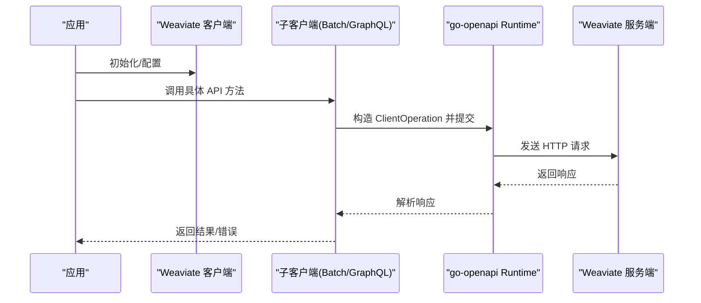
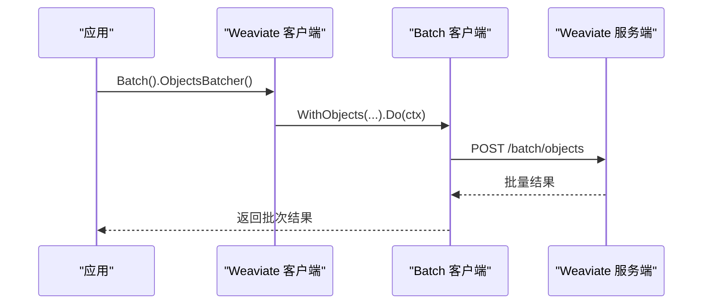
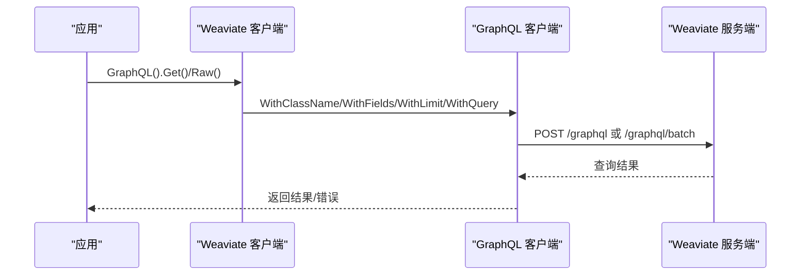
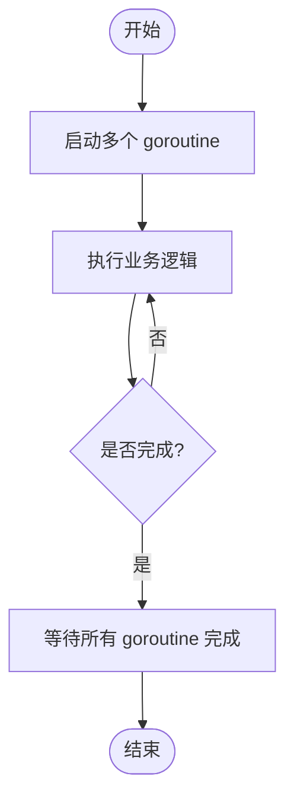
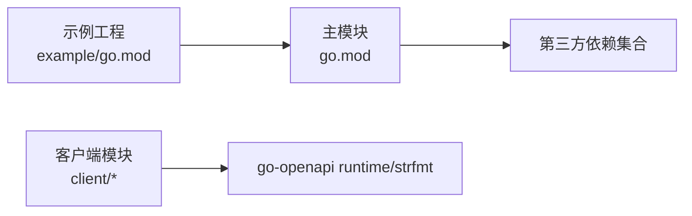

# Go 客户端

<cite>
**本文引用的文件**
- [go.mod](file://go.mod)
- [client/weaviate_client.go](file://client/weaviate_client.go)
- [client/batch/batch_client.go](file://client/batch/batch_client.go)
- [client/graphql/graphql_client.go](file://client/graphql/graphql_client.go)
- [example/go.mod](file://example/go.mod)
- [example/basic_weaviate_test.go](file://example/basic_weaviate_test.go)
- [example/query_existing_data_test.go](file://example/query_existing_data_test.go)
- [example/query_inserted_data_test.go](file://example/query_inserted_data_test.go)
- [example/run_examples.sh](file://example/run_examples.sh)
- [entities/sync/sync_test.go](file://entities/sync/sync_test.go)
- [adapters/repos/db/vector/common/unbounded_channel.go](file://adapters/repos/db/vector/common/unbounded_channel.go)
- [adapters/repos/db/vector/common/unbounded_channel_test.go](file://adapters/repos/db/vector/common/unbounded_channel_test.go)
</cite>

## 目录
1. [简介](#简介)
2. [项目结构](#项目结构)
3. [核心组件](#核心组件)
4. [架构总览](#架构总览)
5. [组件详解](#组件详解)
6. [依赖关系分析](#依赖关系分析)
7. [性能考量](#性能考量)
8. [故障排查指南](#故障排查指南)
9. [结论](#结论)
10. [附录](#附录)

## 简介
本文件面向使用 Weaviate Go 客户端的开发者，系统性介绍 Go 模块导入与初始化、客户端连接与配置、认证与上下文管理、对象与批量操作、GraphQL 查询、并发模式（goroutine、channel、context）、错误与返回值处理最佳实践、与常见 Web 框架（如 Gin、Echo）的集成思路、性能优化（连接池复用、请求超时）、以及单元测试与基准测试编写方法。内容基于仓库中的实际代码生成，确保可追溯与可验证。

## 项目结构
Weaviate Go 客户端位于仓库的 client 目录下，采用按功能域拆分的模块化组织方式：objects、batch、graphql、schema、nodes、cluster、meta、users、authz、well_known 等子包分别对应不同的 API 子域；顶层 client/weaviate_client.go 负责聚合这些子客户端并提供统一入口。

- 核心入口与聚合
  - client/weaviate_client.go 提供 Weaviate 结构体与默认传输配置，负责将各子客户端注入到统一的客户端实例中。
- 功能子模块
  - client/batch/* 提供批量对象与引用的创建、删除等接口。
  - client/graphql/* 提供 GraphQL 查询与批处理查询接口。
- 示例与测试
  - example/* 包含基本连接、对象操作、GraphQL 查询的测试样例，以及一键运行脚本。
  - go.mod 与 example/go.mod 展示了模块依赖与替换规则。

**图表来源**
- [client/weaviate_client.go](file://client/weaviate_client.go#L140-L194)

**章节来源**
- [client/weaviate_client.go](file://client/weaviate_client.go#L1-L194)

## 核心组件
- Weaviate 客户端聚合器
  - 负责创建与配置底层传输（HTTP），并将各子客户端注入其中，支持统一的 SetTransport 以切换传输实现或注入自定义中间件。
- 批量客户端
  - 提供批量对象创建、批量对象删除、批量引用创建等能力，内部通过 go-openapi runtime 提交请求。
- GraphQL 客户端
  - 提供单次 GraphQL 查询与批量 GraphQL 查询能力，适合复杂检索与聚合场景。

**章节来源**
- [client/weaviate_client.go](file://client/weaviate_client.go#L140-L194)
- [client/batch/batch_client.go](file://client/batch/batch_client.go#L26-L180)
- [client/graphql/graphql_client.go](file://client/graphql/graphql_client.go#L26-L137)

## 架构总览
Weaviate Go 客户端采用“聚合器 + 子客户端”的分层架构：聚合器负责传输与配置，子客户端封装具体 API 的参数、序列化与调用流程。调用链路通过 go-openapi runtime 将请求提交至 Weaviate 服务端。

**图表来源**
- [client/batch/batch_client.go](file://client/batch/batch_client.go#L58-L92)
- [client/graphql/graphql_client.go](file://client/graphql/graphql_client.go#L97-L131)

## 组件详解

### 连接与初始化
- 模块与依赖
  - 顶层 go.mod 定义了模块名、Go 版本与依赖集合；example/go.mod 展示了示例工程对主模块的 replace 规则，便于本地开发与测试。
- 客户端初始化
  - client/weaviate_client.go 提供 NewHTTPClient/NewHTTPClientWithConfig/DefaultTransportConfig 等工厂方法，用于创建带默认传输配置的客户端，并可通过 TransportConfig 自定义 Host/BasePath/Schemes。
- 示例参考
  - example/basic_weaviate_test.go 展示了通过 weaviate.Config 创建客户端并进行 Schema 获取与类管理的基本流程。

**章节来源**
- [go.mod](file://go.mod#L1-L274)
- [example/go.mod](file://example/go.mod#L1-L61)
- [client/weaviate_client.go](file://client/weaviate_client.go#L56-L109)
- [example/basic_weaviate_test.go](file://example/basic_weaviate_test.go#L14-L30)

### 认证与上下文管理
- 认证
  - 子客户端方法签名普遍包含 runtime.ClientAuthInfoWriter 参数，表明可通过该机制注入认证信息（如 bearer token）。具体认证策略取决于部署与集成方式。
- 上下文
  - 子客户端方法普遍接收 context.Context 参数，用于控制请求生命周期、超时与取消。示例中广泛使用 context.Background() 或 t.Context()，体现测试与生产环境下的不同上下文来源。

**章节来源**
- [client/batch/batch_client.go](file://client/batch/batch_client.go#L58-L92)
- [client/graphql/graphql_client.go](file://client/graphql/graphql_client.go#L97-L131)
- [example/basic_weaviate_test.go](file://example/basic_weaviate_test.go#L20-L27)

### 对象操作与批量处理
- 对象 CRUD
  - 通过 objects 子客户端进行对象的创建、更新、删除、查询与校验等操作（参见 objects_* 相关文件）。
- 批量处理
  - 批量对象创建：client/batch/batch_client.go 的 BatchObjectsCreate 方法，支持一次请求注册多个对象，具备幂等性（基于 UUID）。
  - 批量对象删除：BatchObjectsDelete 支持基于 where 条件批量删除，受最大返回限制约束。
  - 批量引用创建：BatchReferencesCreate 支持跨对象引用的批量建立。
- 示例参考
  - example/basic_weaviate_test.go 展示了批量插入对象并统计成功条数的流程。
  - example/query_inserted_data_test.go 展示了插入后使用 GraphQL 查询与过滤的流程。

**图表来源**
- [client/batch/batch_client.go](file://client/batch/batch_client.go#L58-L92)

**章节来源**
- [client/batch/batch_client.go](file://client/batch/batch_client.go#L26-L180)
- [example/basic_weaviate_test.go](file://example/basic_weaviate_test.go#L90-L101)
- [example/query_inserted_data_test.go](file://example/query_inserted_data_test.go#L85-L105)

### GraphQL 查询
- 单次查询与批量查询
  - GraphqlPost 用于单次 GraphQL 查询；GraphqlBatch 用于批量执行多个查询，减少网络往返。
- 示例参考
  - example/query_existing_data_test.go 与 example/query_inserted_data_test.go 展示了 Get 查询、Raw 原始查询、聚合统计与字段限制等用法。

**图表来源**
- [client/graphql/graphql_client.go](file://client/graphql/graphql_client.go#L97-L131)

**章节来源**
- [client/graphql/graphql_client.go](file://client/graphql/graphql_client.go#L26-L137)
- [example/query_existing_data_test.go](file://example/query_existing_data_test.go#L37-L66)
- [example/query_inserted_data_test.go](file://example/query_inserted_data_test.go#L109-L118)

### 并发模式：goroutine、channel、context
- goroutine 与 WaitGroup
  - 在测试中广泛使用 goroutine 并配合 WaitGroup 控制并发任务的收尾，保证多协程场景下的正确同步。
- channel
  - 仓库实现了无界通道（unbounded channel），支持缓冲推送、后台消费循环、关闭与取消语义，适用于高吞吐数据流的解耦与背压控制。
- context
  - 广泛用于控制超时、取消与传播取消信号，测试中展示了 LockWithContext、WithCancel、WithTimeout 等典型用法。

**图表来源**
- [adapters/repos/db/vector/common/unbounded_channel.go](file://adapters/repos/db/vector/common/unbounded_channel.go#L90-L122)

**章节来源**
- [entities/sync/sync_test.go](file://entities/sync/sync_test.go#L332-L379)
- [adapters/repos/db/vector/common/unbounded_channel.go](file://adapters/repos/db/vector/common/unbounded_channel.go#L49-L159)
- [adapters/repos/db/vector/common/unbounded_channel_test.go](file://adapters/repos/db/vector/common/unbounded_channel_test.go#L21-L44)

### 错误处理与返回值处理最佳实践
- 返回值结构
  - 子客户端方法返回特定响应类型（如 OK）与 error，调用方应优先检查 error，再读取响应体中的数据或错误字段。
- 错误分类
  - 示例中展示了对无效输入（如空类名）导致的错误断言，体现了对参数校验与服务端返回错误的处理策略。
- 建议
  - 在业务层区分“可恢复错误”与“不可恢复错误”，对可重试错误使用退避策略；对参数错误及时返回用户态错误。

**章节来源**
- [client/batch/batch_client.go](file://client/batch/batch_client.go#L80-L92)
- [example/basic_weaviate_test.go](file://example/basic_weaviate_test.go#L104-L110)

### 与 Web 框架集成（Gin/Echo）
- 集成思路
  - 在框架路由处理器中，使用 context（如 c.Request.Context()）作为客户端调用的上下文，以便在请求级取消与超时控制。
  - 将客户端实例作为全局单例注入到框架，避免重复初始化。
  - 对于长耗时查询或批量写入，建议在 goroutine 中异步执行，并通过 channel 或回调返回结果。
- 注意事项
  - 保持客户端线程安全（当前子客户端通过共享 transport 实现，注意避免在并发中修改共享状态）。
  - 合理设置请求超时，防止阻塞请求生命周期。

[本节为通用集成指导，不直接分析具体文件，故不附加章节来源]

### 性能优化：连接池复用与请求超时
- 连接池复用
  - 通过 SetTransport 更换底层传输实现，可在传输层注入连接池、复用与中间件（如日志、指标、重试）。
- 请求超时
  - 使用 context.WithTimeout/WithCancel 控制请求生命周期，避免长时间占用连接。
- 批量与无界通道
  - 使用批量 API 减少网络往返；使用无界通道解耦生产与消费，提升吞吐。

**章节来源**
- [client/weaviate_client.go](file://client/weaviate_client.go#L175-L193)
- [client/batch/batch_client.go](file://client/batch/batch_client.go#L58-L92)
- [adapters/repos/db/vector/common/unbounded_channel.go](file://adapters/repos/db/vector/common/unbounded_channel.go#L74-L88)

### 单元测试与基准测试
- 单元测试
  - 使用 testify/require/assert 断言连接、Schema 获取、类创建/删除、对象批量插入与 GraphQL 查询等关键路径。
  - 示例测试覆盖错误处理与资源清理（如测试后删除类）。
- 基准测试
  - 可参考 unbounded_channel_test.go 的基准测试模式，围绕 Push/Out 循环进行性能评估，结合 context.WithCancel 控制停止条件。

**章节来源**
- [example/basic_weaviate_test.go](file://example/basic_weaviate_test.go#L14-L118)
- [example/query_existing_data_test.go](file://example/query_existing_data_test.go#L15-L125)
- [example/query_inserted_data_test.go](file://example/query_inserted_data_test.go#L13-L196)
- [adapters/repos/db/vector/common/unbounded_channel_test.go](file://adapters/repos/db/vector/common/unbounded_channel_test.go#L74-L115)

## 依赖关系分析
- 模块依赖
  - 顶层 go.mod 定义了大量第三方依赖（如 AWS、GCS、Azure、OpenTelemetry、Prometheus、gRPC 生态等），为 Weaviate 服务端提供扩展能力。
- 示例工程依赖
  - example/go.mod 通过 replace 将 github.com/weaviate/weaviate 指向本地仓库，便于在示例中直接使用本地客户端。
- 客户端依赖
  - client/* 子模块依赖 go-openapi runtime 与 strfmt，用于 HTTP 传输与数据格式化。

**图表来源**
- [go.mod](file://go.mod#L3-L106)
- [example/go.mod](file://example/go.mod#L5-L13)

**章节来源**
- [go.mod](file://go.mod#L1-L274)
- [example/go.mod](file://example/go.mod#L1-L61)

## 性能考量
- 批量优先：尽量使用批量 API（如 /batch/objects、/graphql/batch）降低网络开销。
- 连接复用：通过 SetTransport 注入自定义传输，启用连接池与复用。
- 超时控制：为每个请求设置合理的 context 超时，避免阻塞。
- 无界通道：在高吞吐场景使用无界通道解耦生产与消费，注意内存与背压控制。

[本节为通用性能建议，不直接分析具体文件，故不附加章节来源]

## 故障排查指南
- 常见问题
  - 连接失败：检查 Host/Scheme/BasePath 是否正确，确认服务端可达。
  - 参数错误：关注返回的错误字段，对必填字段与数据类型进行校验。
  - 超时：适当增大超时时间或拆分批量请求。
- 排查步骤
  - 使用 context.WithCancel/WithTimeout 控制请求生命周期。
  - 在客户端层开启日志与指标，定位慢请求与异常。
  - 对批量操作进行分片与重试，避免一次性超限。

[本节为通用排查建议，不直接分析具体文件，故不附加章节来源]

## 结论
Weaviate Go 客户端以清晰的模块化设计与标准的 go-openapi 集成，提供了从对象 CRUD 到批量处理与 GraphQL 查询的完整能力。通过合理的上下文管理、批量与无界通道的使用，以及示例中的测试与基准模式，开发者可以构建高性能、可维护的应用。建议在生产环境中结合连接池、超时与重试策略，并完善错误处理与可观测性。

## 附录
- 快速运行示例
  - 使用 example/run_examples.sh 提供的 run/test/all/clean 等命令快速执行示例与测试。

**章节来源**
- [example/run_examples.sh](file://example/run_examples.sh#L163-L209)