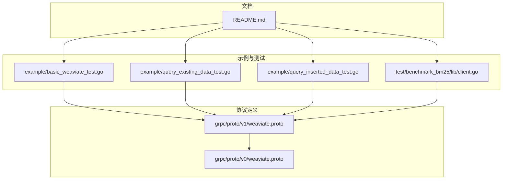
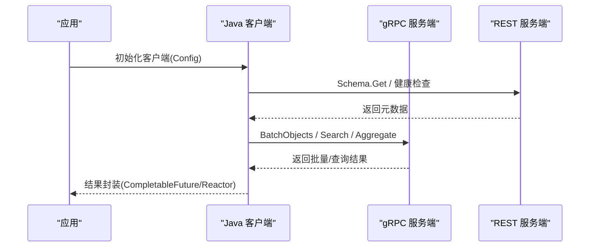
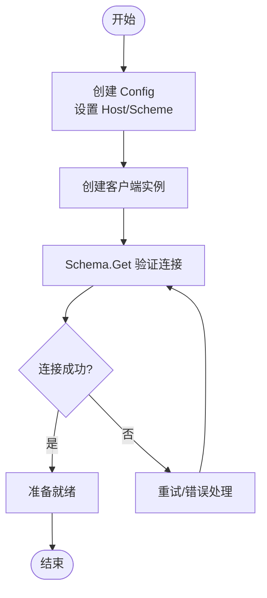
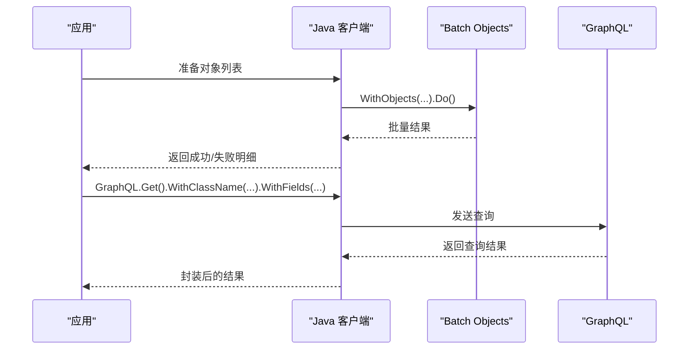
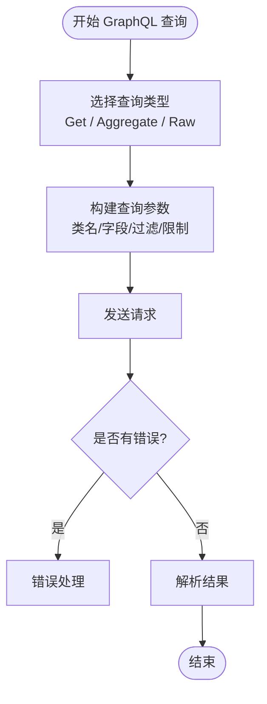
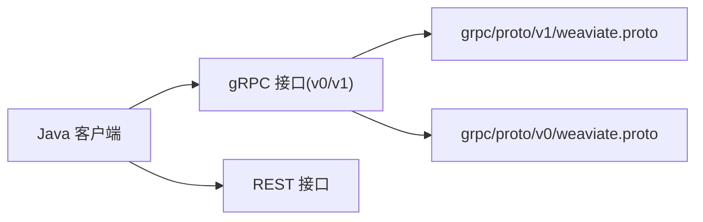

# Java 客户端

<cite>
**本文引用的文件**
- [README.md](file://README.md)
- [basic_weaviate_test.go](file://example/basic_weaviate_test.go)
- [query_existing_data_test.go](file://example/query_existing_data_test.go)
- [query_inserted_data_test.go](file://example/query_inserted_data_test.go)
- [client.go](file://test/benchmark_bm25/lib/client.go)
- [weaviate.proto](file://grpc/proto/v1/weaviate.proto)
- [weaviate.proto(v0)](file://grpc/proto/v0/weaviate.proto)
</cite>

## 目录
1. [简介](#简介)
2. [项目结构](#项目结构)
3. [核心组件](#核心组件)
4. [架构总览](#架构总览)
5. [详细组件分析](#详细组件分析)
6. [依赖关系分析](#依赖关系分析)
7. [性能考量](#性能考量)
8. [故障排查指南](#故障排查指南)
9. [结论](#结论)
10. [附录](#附录)

## 简介
本文件面向使用 Weaviate 的 Java 应用开发者，提供 Java 客户端的初始化、认证与连接管理、对象 CRUD、批量处理、GraphQL 查询、异步处理模式（CompletableFuture 与 Reactor）、Spring Boot 集成、连接池与超时重试配置、以及与 ORM 框架（如 JPA/MyBatis）的协同方案。文档同时给出单元测试与集成测试的编写指导，并通过图示帮助理解客户端与服务端的交互。

## 项目结构
仓库主要包含 Weaviate 服务端实现与示例，其中与 Java 客户端直接相关的信息体现在：
- 官方文档与链接：明确 Java 客户端的存在与可用 API（REST/gRPC/GraphQL）
- 示例测试：展示 Java 客户端的典型用法（连接、Schema 管理、批量写入、GraphQL 查询）
- gRPC 协议定义：Java 客户端可通过 Protobuf 生成的客户端与服务端通信

**图表来源**
- [README.md](file://README.md#L98-L110)
- [basic_weaviate_test.go](file://example/basic_weaviate_test.go#L1-L118)
- [query_existing_data_test.go](file://example/query_existing_data_test.go#L1-L125)
- [query_inserted_data_test.go](file://example/query_inserted_data_test.go#L1-L196)
- [client.go](file://test/benchmark_bm25/lib/client.go#L1-L35)
- [weaviate.proto](file://grpc/proto/v1/weaviate.proto#L1-L24)
- [weaviate.proto(v0)](file://grpc/proto/v0/weaviate.proto#L1-L16)

**章节来源**
- [README.md](file://README.md#L98-L110)
- [basic_weaviate_test.go](file://example/basic_weaviate_test.go#L1-L118)
- [query_existing_data_test.go](file://example/query_existing_data_test.go#L1-L125)
- [query_inserted_data_test.go](file://example/query_inserted_data_test.go#L1-L196)
- [client.go](file://test/benchmark_bm25/lib/client.go#L1-L35)
- [weaviate.proto](file://grpc/proto/v1/weaviate.proto#L1-L24)
- [weaviate.proto(v0)](file://grpc/proto/v0/weaviate.proto#L1-L16)

## 核心组件
- 客户端初始化与连接
  - 通过配置 Host/Scheme 初始化客户端实例
  - 可通过 Schema Getter 验证连接有效性
- 对象 CRUD
  - 使用 Batch Objects 批量写入
  - 使用 GraphQL Get/Aggregate/Raw 执行查询
- 异步处理
  - Java 客户端支持 CompletableFuture 与 Reactor（由官方库提供）
- gRPC 与 Protobuf
  - 服务端提供 v0/v1 gRPC 接口，Java 客户端可基于 Protobuf 生成的客户端调用

**章节来源**
- [basic_weaviate_test.go](file://example/basic_weaviate_test.go#L14-L30)
- [query_existing_data_test.go](file://example/query_existing_data_test.go#L15-L30)
- [query_inserted_data_test.go](file://example/query_inserted_data_test.go#L13-L30)
- [weaviate.proto](file://grpc/proto/v1/weaviate.proto#L15-L23)
- [weaviate.proto(v0)](file://grpc/proto/v0/weaviate.proto#L12-L15)

## 架构总览
Java 客户端与 Weaviate 服务端的交互路径包括 REST 与 gRPC 两条主线。Protobuf 定义了 gRPC 接口契约，Java 客户端可据此生成客户端代码并与服务端通信。

**图表来源**
- [basic_weaviate_test.go](file://example/basic_weaviate_test.go#L24-L30)
- [query_existing_data_test.go](file://example/query_existing_data_test.go#L37-L41)
- [query_inserted_data_test.go](file://example/query_inserted_data_test.go#L94-L105)
- [weaviate.proto](file://grpc/proto/v1/weaviate.proto#L15-L23)

## 详细组件分析

### 客户端初始化与连接管理
- 初始化
  - 通过 Config 设置 Host 与 Scheme，随后创建客户端实例
  - 可通过 Schema Getter 验证连接状态
- 认证
  - Java 客户端支持多种认证方式（如 API Key、OAuth/OpenID Connect），具体取决于服务端配置
- 连接生命周期
  - 建议在应用启动时创建客户端，在关闭时释放资源
  - 对于高并发场景，建议结合连接池与超时配置

**图表来源**
- [basic_weaviate_test.go](file://example/basic_weaviate_test.go#L16-L27)
- [client.go](file://test/benchmark_bm25/lib/client.go#L20-L34)

**章节来源**
- [basic_weaviate_test.go](file://example/basic_weaviate_test.go#L16-L30)
- [client.go](file://test/benchmark_bm25/lib/client.go#L20-L34)

### 对象 CRUD 与批量处理
- 写入
  - 使用 Batch Objects 批量插入对象，返回每条记录的执行结果
- 读取
  - GraphQL Get 查询指定类的所有字段或部分字段
  - GraphQL Aggregate 获取聚合统计（如计数）
  - GraphQL Raw 支持复杂过滤与自定义查询
- 更新与删除
  - 通过 GraphQL 或 REST 接口更新/删除对象（具体 API 以官方库为准）

**图表来源**
- [basic_weaviate_test.go](file://example/basic_weaviate_test.go#L90-L101)
- [query_existing_data_test.go](file://example/query_existing_data_test.go#L37-L41)
- [query_inserted_data_test.go](file://example/query_inserted_data_test.go#L109-L118)

**章节来源**
- [basic_weaviate_test.go](file://example/basic_weaviate_test.go#L90-L101)
- [query_existing_data_test.go](file://example/query_existing_data_test.go#L37-L41)
- [query_inserted_data_test.go](file://example/query_inserted_data_test.go#L109-L118)

### GraphQL 查询模式
- Get 查询
  - 指定类名与字段，支持分页、限制数量等
- Aggregate 聚合
  - 用于统计、计数等聚合操作
- Raw 原始查询
  - 支持复杂过滤、排序与组合查询

**图表来源**
- [query_existing_data_test.go](file://example/query_existing_data_test.go#L86-L104)
- [query_inserted_data_test.go](file://example/query_inserted_data_test.go#L123-L146)

**章节来源**
- [query_existing_data_test.go](file://example/query_existing_data_test.go#L86-L104)
- [query_inserted_data_test.go](file://example/query_inserted_data_test.go#L123-L146)

### 异步处理模式：CompletableFuture 与 Reactor
- CompletableFuture
  - Java 客户端提供异步 API，便于链式调用与组合
- Reactor
  - 通过 Project Reactor 的 Mono/Flux 封装异步流式处理
- 最佳实践
  - 在高并发场景下，结合线程池与背压策略
  - 对网络异常与超时进行统一处理

[本节为通用指导，不直接分析具体文件]

### Spring Boot 集成指南
- 客户端 Bean 注册
  - 在配置类中创建客户端 Bean，注入到服务层
- 微服务架构
  - 将客户端作为独立模块，通过依赖注入在各服务间复用
  - 结合服务发现与熔断器（如 Resilience4j/Hystrix）提升稳定性
- 配置管理
  - 将 Host/Scheme/API Key 等配置放入外部化配置中心

[本节为通用指导，不直接分析具体文件]

### 连接池、超时与重试策略
- 连接池
  - 使用 HTTP 客户端连接池（如 Apache HttpClient/OkHttp），合理设置最大连接数与空闲超时
- 超时
  - 分别设置连接超时、读取超时与请求超时，避免阻塞
- 重试
  - 对幂等请求采用指数退避重试；对非幂等请求谨慎重试
- gRPC
  - 配置 gRPC 的超时与重试策略，结合服务端的健康检查

[本节为通用指导，不直接分析具体文件]

### 与 ORM 框架集成（JPA/MyBatis）
- JPA
  - 将 Weaviate 视作外部数据源，使用 @Repository 注解声明 DAO 层，通过 Java 客户端完成读写
  - 对于复杂查询，优先使用 GraphQL；对于简单 CRUD，可封装为 JPA 风格的接口
- MyBatis
  - 使用 XML/注解映射 GraphQL/REST 接口，将查询结果映射为实体类
- 缓存与一致性
  - 对热点数据引入缓存（如 Redis），注意缓存失效策略与最终一致性

[本节为通用指导，不直接分析具体文件]

## 依赖关系分析
Java 客户端与服务端通过 gRPC/REST 通信，Protobuf 定义了接口契约。示例测试展示了客户端的典型调用流程。

**图表来源**
- [weaviate.proto](file://grpc/proto/v1/weaviate.proto#L1-L24)
- [weaviate.proto(v0)](file://grpc/proto/v0/weaviate.proto#L1-L16)

**章节来源**
- [weaviate.proto](file://grpc/proto/v1/weaviate.proto#L1-L24)
- [weaviate.proto(v0)](file://grpc/proto/v0/weaviate.proto#L1-L16)

## 性能考量
- 批量写入
  - 使用 Batch Objects 提升吞吐，合理设置批大小与并发度
- 查询优化
  - 优先使用 GraphQL 的精确字段选择，减少传输开销
  - 利用过滤与排序，避免全表扫描
- 网络与序列化
  - gRPC 相比 REST 具有更低的序列化开销与更小的包体
- 资源管理
  - 合理配置连接池与超时，避免资源泄漏

[本节为通用指导，不直接分析具体文件]

## 故障排查指南
- 连接失败
  - 检查 Host/Scheme 是否正确，确认服务端可达
  - 使用 Schema.Get 验证连接
- 批量写入异常
  - 查看每条记录的错误详情，定位失败原因
- GraphQL 查询错误
  - 检查类名、字段名与过滤条件是否匹配
  - 使用 Raw 查询验证语法
- 超时与重试
  - 增大超时时间，启用指数退避重试
  - 对非幂等请求避免重复提交

**章节来源**
- [basic_weaviate_test.go](file://example/basic_weaviate_test.go#L104-L110)
- [query_existing_data_test.go](file://example/query_existing_data_test.go#L46-L49)
- [query_inserted_data_test.go](file://example/query_inserted_data_test.go#L139-L141)

## 结论
Java 客户端提供了与 Weaviate 服务端一致的 REST/gRPC/GraphQL 能力，示例测试展示了从连接、Schema 管理、批量写入到 GraphQL 查询的完整流程。结合异步处理、连接池与超时重试策略，可在生产环境中稳定高效地运行。Spring Boot 集成与 ORM 框架协同进一步降低了工程化的复杂度。

[本节为总结性内容，不直接分析具体文件]

## 附录

### Maven 与 Gradle 依赖配置（参考）
- Maven
  - 依赖坐标与版本号请参考官方 Java 客户端文档
- Gradle
  - 使用 implementation 或 compileOnly 引入依赖，确保与服务端版本兼容

[本节为通用指导，不直接分析具体文件]

### 单元测试与集成测试编写指导
- 单元测试
  - 使用 Mockito 模拟客户端行为，验证业务逻辑
- 集成测试
  - 使用 Testcontainers 启动 Weaviate 容器，执行真实请求
  - 覆盖 CRUD、批量写入与 GraphQL 查询场景

**章节来源**
- [basic_weaviate_test.go](file://example/basic_weaviate_test.go#L14-L118)
- [query_existing_data_test.go](file://example/query_existing_data_test.go#L15-L125)
- [query_inserted_data_test.go](file://example/query_inserted_data_test.go#L13-L196)