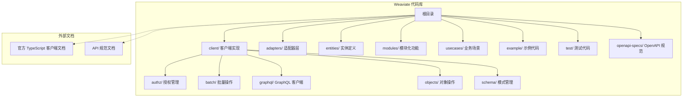
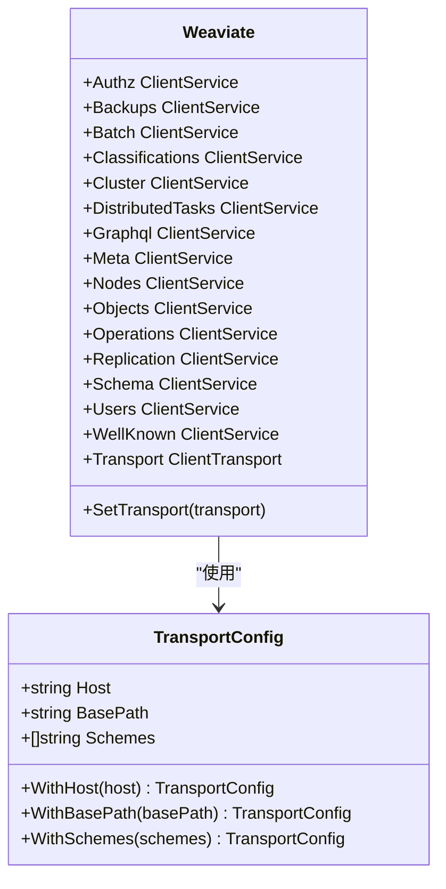
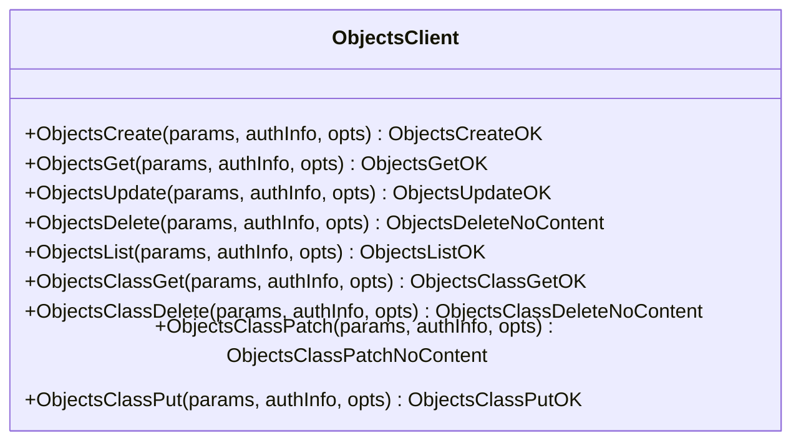
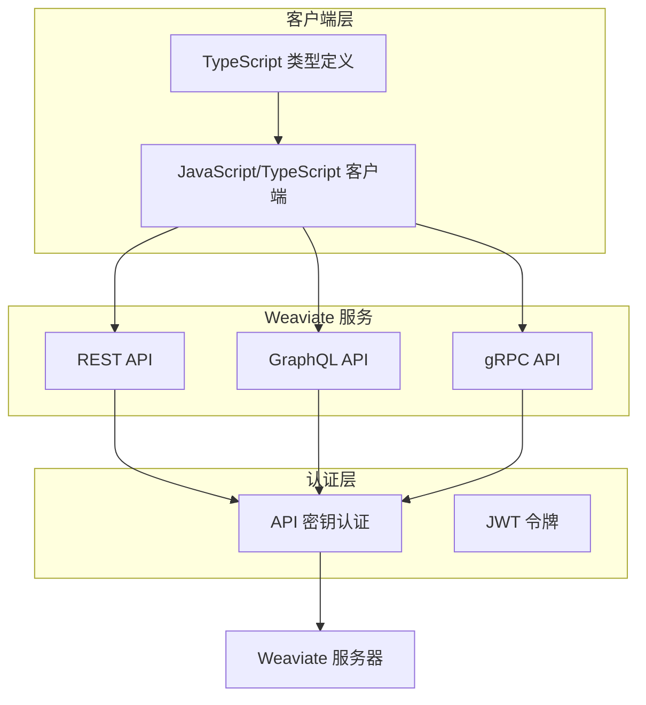
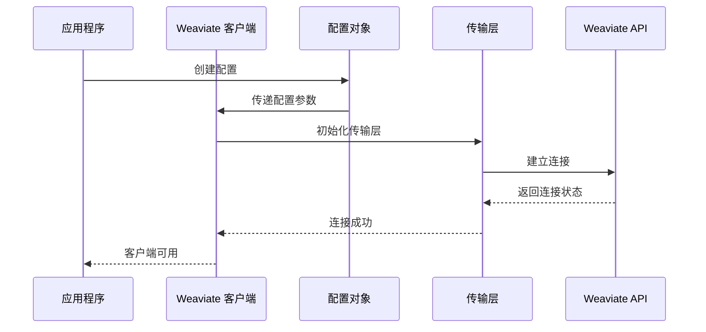
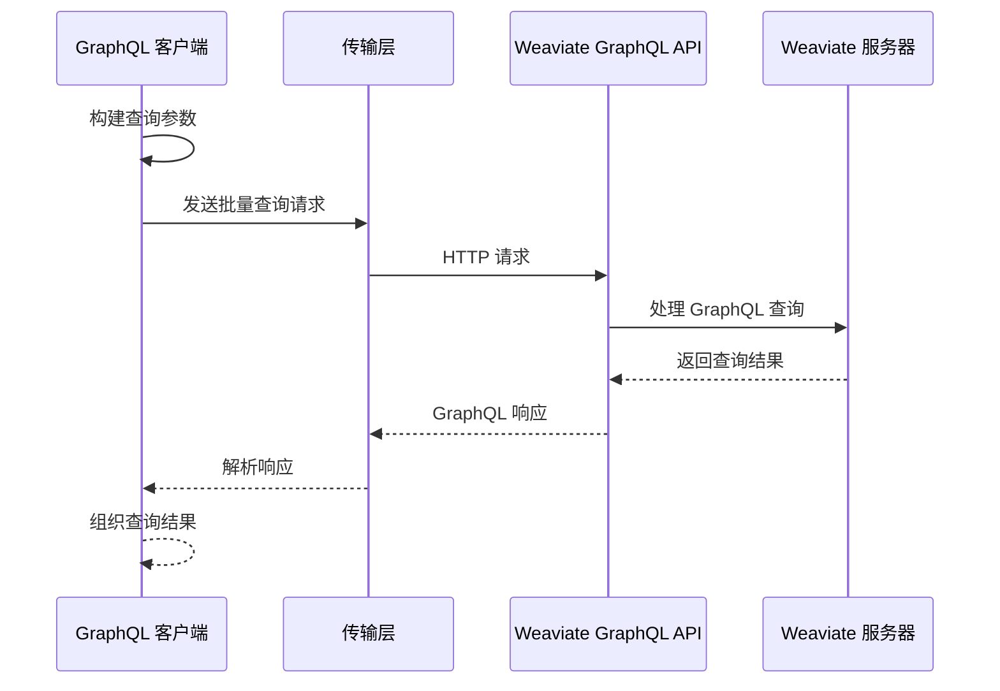
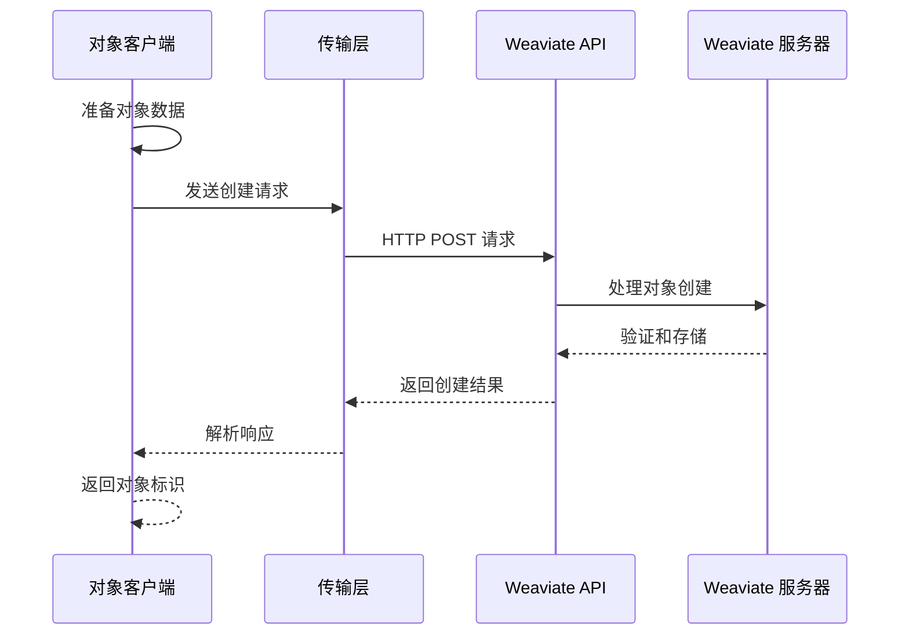
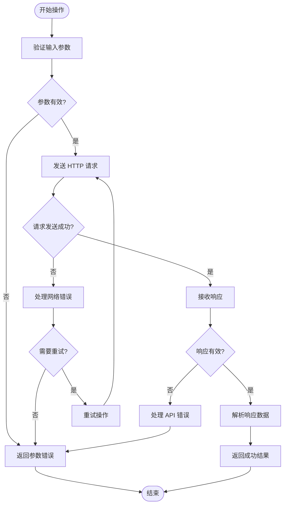
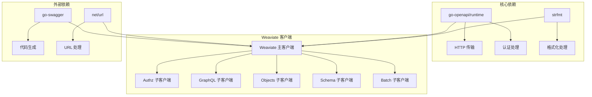

# JavaScript/TypeScript 客户端

<cite>
**本文档引用的文件**
- [README.md](file://README.md)
- [weaviate_client.go](file://client/weaviate_client.go)
- [graphql_client.go](file://client/graphql/graphql_client.go)
- [objects_client.go](file://client/objects/objects_client.go)
- [client.go](file://test/benchmark_bm25/lib/client.go)
- [extendresponses.js](file://openapi-specs/extendresponses.js)
</cite>

## 目录
1. [简介](#简介)
2. [项目结构](#项目结构)
3. [核心组件](#核心组件)
4. [架构概览](#架构概览)
5. [详细组件分析](#详细组件分析)
6. [依赖关系分析](#依赖关系分析)
7. [性能考虑](#性能考虑)
8. [故障排除指南](#故障排除指南)
9. [结论](#结论)

## 简介

Weaviate 是一个开源的、云原生的向量数据库，支持对象存储、向量搜索和混合查询。虽然当前代码库主要包含 Go 语言的客户端实现，但根据项目文档，Weaviate 官方提供了 JavaScript/TypeScript 客户端库。

根据 README.md 文件，Weaviate 官方文档中明确提到了 JavaScript/TypeScript 客户端库，但在此代码库中并未包含实际的 JavaScript/TypeScript 源代码。该项目主要包含：

- **Go 语言客户端实现**：完整的 Go 客户端代码，包含 REST API 客户端
- **OpenAPI 规范**：用于生成各种语言客户端的规范文件
- **测试和示例代码**：展示如何使用 Weaviate API

## 项目结构



**图表来源**
- [README.md](file://README.md#L98-L110)
- [weaviate_client.go](file://client/weaviate_client.go#L19-L39)

**章节来源**
- [README.md](file://README.md#L98-L110)

## 核心组件

### Weaviate 主客户端

主客户端类提供了对 Weaviate 服务的统一访问接口，包含多个子服务模块：



**图表来源**
- [weaviate_client.go](file://client/weaviate_client.go#L141-L194)

### GraphQL 客户端

GraphQL 客户端支持批量查询和单个查询操作：

```mermaid
classDiagram
class GraphQLClient {
+GraphqlBatch(params, authInfo, opts) GraphqlBatchOK
+GraphqlPost(params, authInfo, opts) GraphqlPostOK
+SetTransport(transport)
}
class GraphqlBatchParams {
+[]string Queries
+map[string]interface{} Variables
}
class GraphqlPostParams {
+string Query
+map[string]interface{} Variables
}
GraphQLClient --> GraphqlBatchParams : "使用"
GraphQLClient --> GraphqlPostParams : "使用"
```

**图表来源**
- [graphql_client.go](file://client/graphql/graphql_client.go#L34-L49)

### 对象操作客户端

对象操作客户端提供了完整的 CRUD 操作：



**图表来源**
- [objects_client.go](file://client/objects/objects_client.go#L42-L83)

**章节来源**
- [weaviate_client.go](file://client/weaviate_client.go#L141-L194)
- [graphql_client.go](file://client/graphql/graphql_client.go#L34-L49)
- [objects_client.go](file://client/objects/objects_client.go#L42-L83)

## 架构概览



**图表来源**
- [README.md](file://README.md#L108-L110)

## 详细组件分析

### 客户端初始化流程



**图表来源**
- [client.go](file://test/benchmark_bm25/lib/client.go#L20-L34)

### GraphQL 查询流程



**图表来源**
- [graphql_client.go](file://client/graphql/graphql_client.go#L56-L90)

### 对象操作流程



**图表来源**
- [objects_client.go](file://client/objects/objects_client.go#L418-L452)

### 错误处理流程



**图表来源**
- [graphql_client.go](file://client/graphql/graphql_client.go#L78-L89)
- [objects_client.go](file://client/objects/objects_client.go#L440-L451)

**章节来源**
- [client.go](file://test/benchmark_bm25/lib/client.go#L20-L34)
- [graphql_client.go](file://client/graphql/graphql_client.go#L56-L131)
- [objects_client.go](file://client/objects/objects_client.go#L418-L800)

## 依赖关系分析



**图表来源**
- [weaviate_client.go](file://client/weaviate_client.go#L19-L39)

**章节来源**
- [weaviate_client.go](file://client/weaviate_client.go#L19-L39)

## 性能考虑

### 连接池和重用

- **传输层复用**：主客户端支持设置传输层，所有子客户端共享同一传输实例
- **批量操作**：建议使用批量 API 进行大量数据操作以提高效率
- **连接配置**：可通过 TransportConfig 自定义主机、基础路径和协议

### 缓存策略

- **响应缓存**：对于重复的查询，建议在应用层实现适当的缓存机制
- **连接保持**：在长时间运行的应用中，保持连接活跃以避免重新建立连接的开销

### 超时和重试

- **超时配置**：通过 HTTP 客户端配置超时时间
- **重试机制**：对于临时性错误（如网络超时），建议实现指数退避的重试策略

## 故障排除指南

### 常见错误类型

1. **连接错误**
   - 检查 Weaviate 服务器地址和端口配置
   - 验证网络连通性和防火墙设置

2. **认证错误**
   - 确认 API 密钥正确无误
   - 检查密钥权限和有效期

3. **参数错误**
   - 验证请求参数格式和类型
   - 检查必填字段是否完整

### 调试技巧

- **启用调试模式**：在开发环境中启用 HTTP 通信日志
- **检查响应状态码**：分析 HTTP 响应状态码获取错误信息
- **验证数据格式**：确保请求和响应数据符合预期格式

**章节来源**
- [README.md](file://README.md#L98-L110)

## 结论

虽然当前代码库主要包含 Go 语言的客户端实现，但从架构设计可以看出 Weaviate 客户端具有清晰的模块化结构和良好的扩展性。对于 JavaScript/TypeScript 开发者，建议：

1. **参考官方文档**：查看 Weaviate 官方提供的 JavaScript/TypeScript 客户端文档
2. **使用现有模式**：参考 Go 客户端的架构模式和最佳实践
3. **关注 API 规范**：基于 OpenAPI 规范理解 API 行为和约束
4. **实施错误处理**：遵循统一的错误处理和重试策略

通过这种方式，开发者可以充分利用 Weaviate 的强大功能，同时保持代码的可维护性和性能优化。