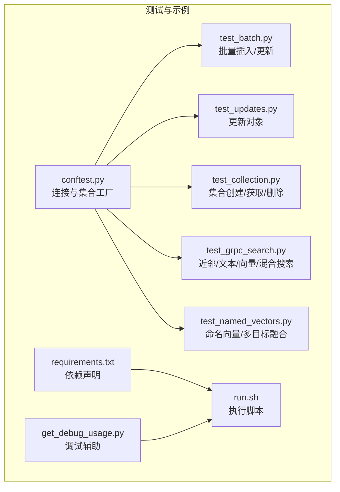
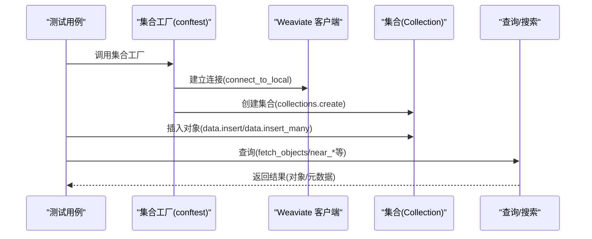
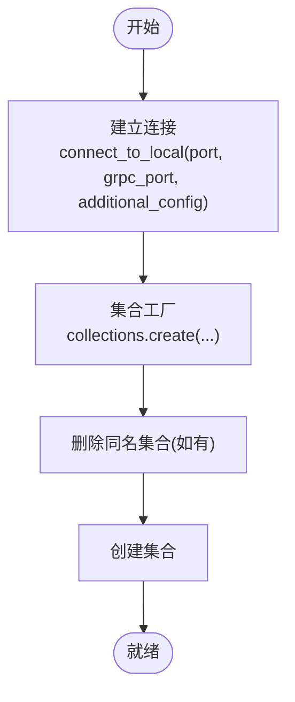
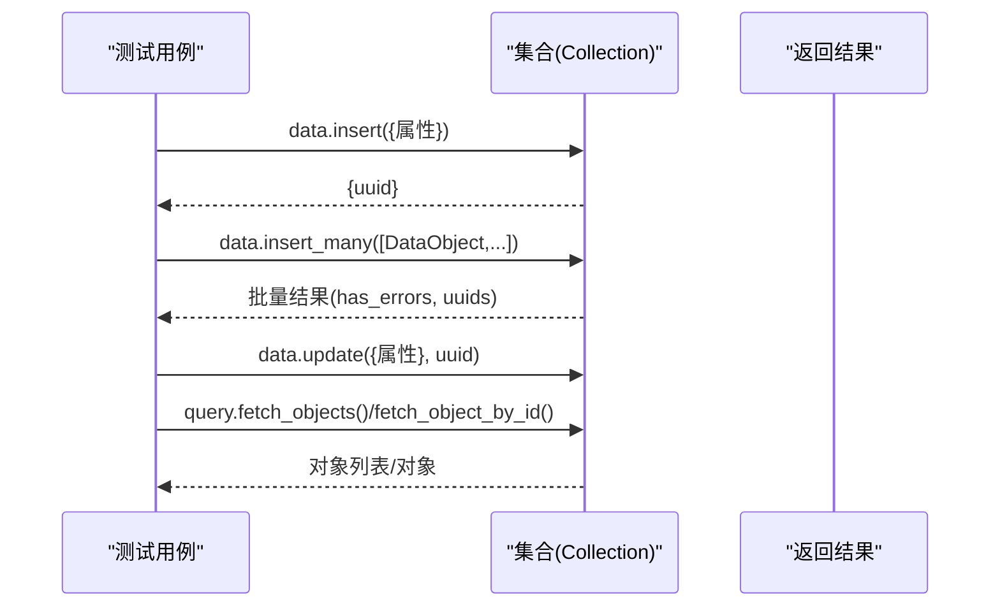
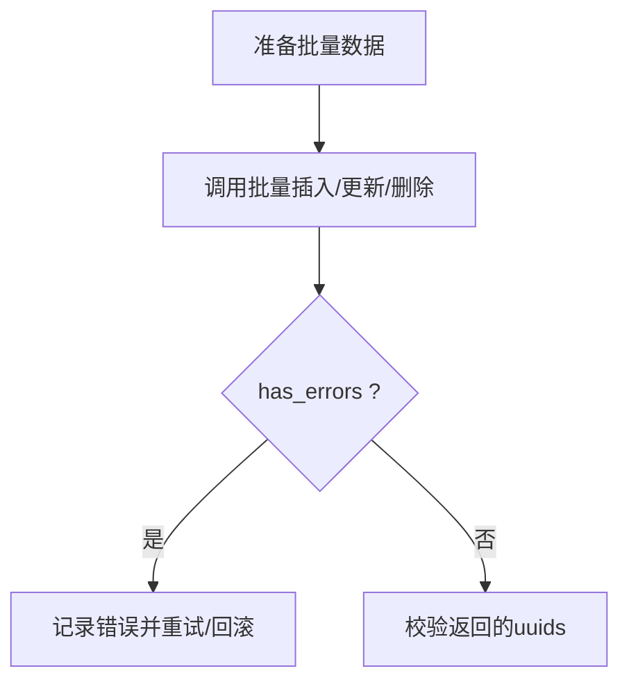
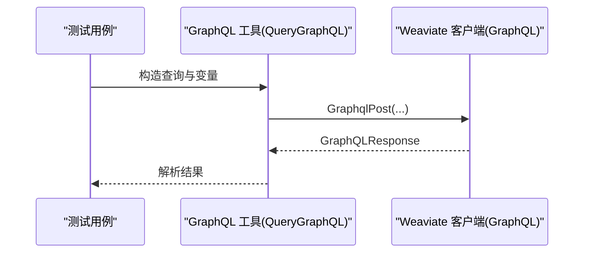
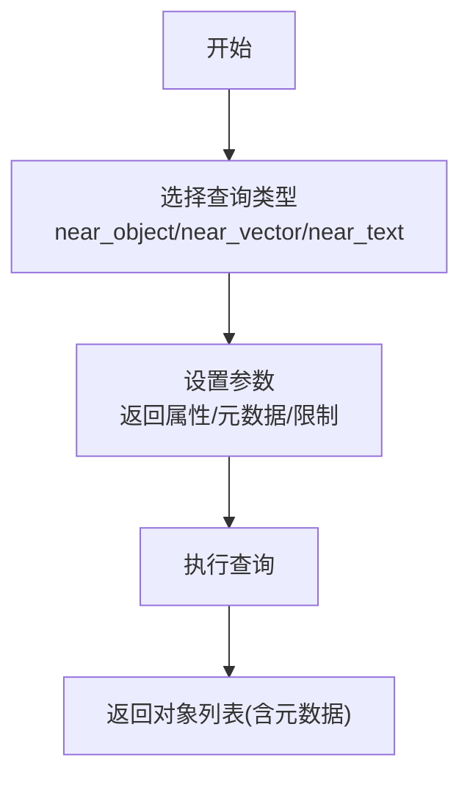
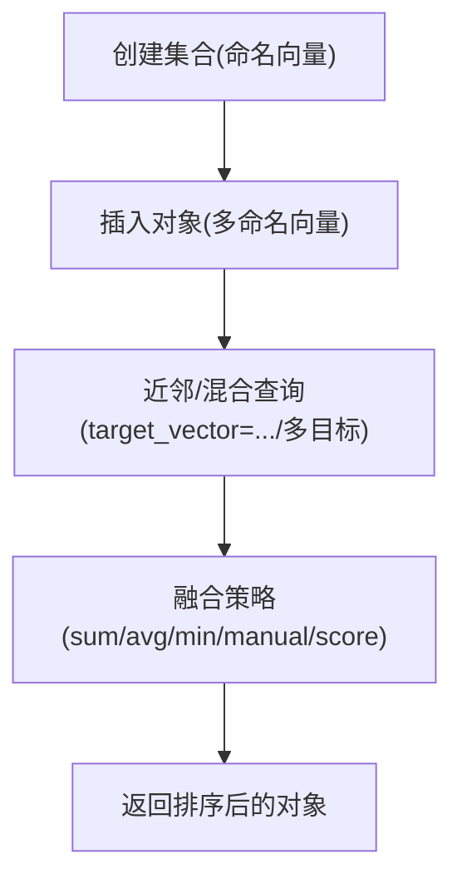
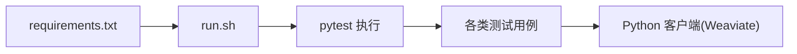

# Python 客户端

<cite>
**本文引用的文件**
- [pyproject.toml](file://pyproject.toml)
- [conftest.py](file://test/acceptance_with_python/conftest.py)
- [test_batch.py](file://test/acceptance_with_python/test_batch.py)
- [test_updates.py](file://test/acceptance_with_python/test_updates.py)
- [test_collection.py](file://test/acceptance_with_python/test_collection.py)
- [test_grpc_search.py](file://test/acceptance_with_python/test_grpc_search.py)
- [test_named_vectors.py](file://test/acceptance_with_python/test_named_vectors.py)
- [requirements.txt](file://test/acceptance_with_python/requirements.txt)
- [run.sh](file://test/acceptance_with_python/run.sh)
- [get_debug_usage.py](file://test/acceptance_with_python/get_debug_usage.py)
- [test_errors.py](file://test/acceptance_with_python/test_errors.py)
- [test_aggregate.py](file://test/acceptance_with_python/test_aggregate.py)
- [test_filter.py](file://test/acceptance_with_python/test_filter.py)
- [test_generative.py](file://test/acceptance_with_python/test_generative.py)
- [test_groupby.py](file://test/acceptance_with_python/test_groupby.py)
- [test_hybrid.py](file://test/acceptance_with_python/test_hybrid.py)
- [test_multi_target_search.py](file://test/acceptance_with_python/test_multi_target_search.py)
- [test_multi_target_search_gql.py](file://test/acceptance_with_python/test_multi_target_search_gql.py)
- [test_object_ttl.py](file://test/acceptance_with_python/test_object_ttl.py)
- [test_pq_vector_dims_match.py](file://test/acceptance_with_python/test_pq_vector_dims_match.py)
- [test_refs.py](file://test/acceptance_with_python/test_refs.py)
- [test_reranker.py](file://test/acceptance_with_python/test_reranker.py)
- [test_stats_hnsw.py](file://test/acceptance_with_python/test_stats_hnsw.py)
- [test_usage.py](file://test/acceptance_with_python/test_usage.py)
- [test_backup.py](file://test/acceptance_with_python/test_backup.py)
- [test_auto_schema_ec.py](file://test/acceptance_with_python/test_auto_schema_ec.py)
- [test_limits.py](file://test/acceptance_with_python/test_limits.py)
- [test_multi_target_search.py](file://test/acceptance_with_python/test_multi_target_search.py)
- [test_multi_target_search_gql.py](file://test/acceptance_with_python/test_multi_target_search_gql.py)
- [test_named_vectors.py](file://test/acceptance_with_python/test_named_vectors.py)
- [test_object_ttl.py](file://test/acceptance_with_python/test_object_ttl.py)
- [test_pq_vector_dims_match.py](file://test/acceptance_with_python/test_pq_vector_dims_match.py)
- [test_refs.py](file://test/acceptance_with_python/test_refs.py)
- [test_reranker.py](file://test/acceptance_with_python/test_reranker.py)
- [test_stats_hnsw.py](file://test/acceptance_with_python/test_stats_hnsw.py)
- [test_usage.py](file://test/acceptance_with_python/test_usage.py)
- [test_backup.py](file://test/acceptance_with_python/test_backup.py)
- [test_auto_schema_ec.py](file://test/acceptance_with_python/test_auto_schema_ec.py)
- [test_limits.py](file://test/acceptance_with_python/test_limits.py)
</cite>

## 目录
1. [简介](#简介)
2. [项目结构](#项目结构)
3. [核心组件](#核心组件)
4. [架构总览](#架构总览)
5. [详细组件分析](#详细组件分析)
6. [依赖关系分析](#依赖关系分析)
7. [性能考量](#性能考量)
8. [故障排查指南](#故障排查指南)
9. [结论](#结论)
10. [附录](#附录)

## 简介
本技术文档面向 Python 开发者，系统性介绍 Weaviate 的 Python 客户端能力与用法，涵盖安装配置、认证与连接、对象 CRUD、批量处理、GraphQL 查询、向量搜索、多租户、异步与事务（在当前仓库中未发现直接实现）、异常处理、连接池与性能优化、常见问题与调试技巧等。文档基于仓库内提供的 Python 测试用例与配置文件进行归纳总结，并通过图示帮助理解。

## 项目结构
- Python 客户端的使用样例集中在 test/acceptance_with_python 目录下，包含大量端到端测试，覆盖集合管理、对象 CRUD、批量写入、查询（含近邻、混合、命名向量等）、过滤、聚合、生成式检索、重排器、备份、TTL、统计等场景。
- 连接与配置通过 conftest.py 中的 fixtures 统一管理，便于复用与隔离测试环境。
- requirements.txt 提供了运行测试所需的依赖版本信息。

**图表来源**
- [conftest.py](file://test/acceptance_with_python/conftest.py#L59-L134)
- [test_batch.py](file://test/acceptance_with_python/test_batch.py#L1-L31)
- [test_updates.py](file://test/acceptance_with_python/test_updates.py#L1-L24)
- [test_collection.py](file://test/acceptance_with_python/test_collection.py#L1-L36)
- [test_grpc_search.py](file://test/acceptance_with_python/test_grpc_search.py#L1-L166)
- [test_named_vectors.py](file://test/acceptance_with_python/test_named_vectors.py#L1-L612)
- [requirements.txt](file://test/acceptance_with_python/requirements.txt)
- [run.sh](file://test/acceptance_with_python/run.sh)
- [get_debug_usage.py](file://test/acceptance_with_python/get_debug_usage.py)

**章节来源**
- [conftest.py](file://test/acceptance_with_python/conftest.py#L59-L134)
- [requirements.txt](file://test/acceptance_with_python/requirements.txt)

## 核心组件
- 连接与配置
  - 使用本地连接函数建立客户端，可指定 HTTP/GRPC 端口与额外配置（如超时）。
  - 集合工厂用于创建/删除集合，确保测试隔离。
- 集合管理
  - 支持从字典创建集合、获取集合、删除集合、存在性检查；名称大小写转换遵循约定。
- 对象 CRUD
  - 插入单个或批量对象，支持属性与向量（含命名向量）。
  - 更新对象属性，支持空数组等边界情况。
  - 删除对象与集合。
- 批量处理
  - 批量插入/更新/删除，返回错误状态以便诊断。
- 查询与搜索
  - 获取对象列表、按 ID 获取、元数据选择（距离/置信度/分数等）。
  - 近邻搜索：near_object、near_vector、near_text。
  - 混合搜索：结合文本与向量子查询。
  - 命名向量与多目标向量融合：sum/average/minimum/manual_weights/relative_score。
- 过滤、聚合、分组、生成式检索、重排器、备份、TTL、统计等
  - 测试覆盖广泛，体现客户端对多种查询模式与高级特性的支持。

**章节来源**
- [conftest.py](file://test/acceptance_with_python/conftest.py#L59-L134)
- [test_collection.py](file://test/acceptance_with_python/test_collection.py#L1-L36)
- [test_batch.py](file://test/acceptance_with_python/test_batch.py#L1-L31)
- [test_updates.py](file://test/acceptance_with_python/test_updates.py#L1-L24)
- [test_grpc_search.py](file://test/acceptance_with_python/test_grpc_search.py#L1-L166)
- [test_named_vectors.py](file://test/acceptance_with_python/test_named_vectors.py#L1-L612)

## 架构总览
下图展示了典型一次“连接—创建集合—插入数据—查询”的端到端流程，映射到测试中的调用路径与方法。

**图表来源**
- [conftest.py](file://test/acceptance_with_python/conftest.py#L72-L126)
- [test_batch.py](file://test/acceptance_with_python/test_batch.py#L17-L20)
- [test_grpc_search.py](file://test/acceptance_with_python/test_grpc_search.py#L38-L81)

## 详细组件分析

### 连接与配置
- 本地连接
  - 通过本地连接函数建立客户端，支持指定 HTTP 端口、GRPC 端口与附加配置（如超时）。
- 集合工厂
  - 自动清理集合并创建新集合，确保测试隔离；支持多种配置参数（向量化器、向量配置、倒排索引、多租户、TTL、生成式、复制、向量索引、重排器等）。
- 头部与端口
  - 可通过 headers 参数注入自定义头部；默认端口为 HTTP 8080、GRPC 50051。

**图表来源**
- [conftest.py](file://test/acceptance_with_python/conftest.py#L60-L106)

**章节来源**
- [conftest.py](file://test/acceptance_with_python/conftest.py#L60-L106)

### 对象 CRUD
- 插入
  - 单条插入：返回 UUID。
  - 批量插入：返回批量结果，包含是否出错标记与 UUID 列表。
- 更新
  - 支持仅更新部分属性，可处理空数组等边界。
- 删除
  - 删除单个对象与集合。
- 查询
  - 获取对象列表、按 ID 获取对象、选择返回属性与向量。

**图表来源**
- [test_batch.py](file://test/acceptance_with_python/test_batch.py#L17-L20)
- [test_updates.py](file://test/acceptance_with_python/test_updates.py#L20-L23)
- [test_grpc_search.py](file://test/acceptance_with_python/test_grpc_search.py#L20-L23)

**章节来源**
- [test_batch.py](file://test/acceptance_with_python/test_batch.py#L1-L31)
- [test_updates.py](file://test/acceptance_with_python/test_updates.py#L1-L24)

### 批量处理
- 批量插入/更新/删除接口返回统一的批量结果对象，包含错误标志与 UUID 列表，便于快速定位失败项。
- 边界条件测试覆盖空数组、无属性向量等场景。

**图表来源**
- [test_batch.py](file://test/acceptance_with_python/test_batch.py#L18-L27)

**章节来源**
- [test_batch.py](file://test/acceptance_with_python/test_batch.py#L1-L31)

### GraphQL 查询
- 测试中通过工具函数构造 GraphQL 查询并执行，验证查询结果与元数据。
- 该能力由底层 GraphQL 客户端提供，Python 客户端通过集合与查询模块暴露相应接口。

**图表来源**
- [test_grpc_search.py](file://test/acceptance_with_python/test_grpc_search.py#L104-L121)

**章节来源**
- [test_grpc_search.py](file://test/acceptance_with_python/test_grpc_search.py#L1-L166)

### 向量搜索
- 近邻搜索
  - near_object：以对象 ID 为锚点进行近邻检索。
  - near_vector：以向量为锚点进行近邻检索。
  - near_text：以文本为锚点进行近邻检索，支持移动/远离约束。
- 混合搜索
  - 结合 near_text 与 near_vector 子查询，控制向量与文本权重。
- 元数据选择
  - 支持返回距离、置信度、分数等元数据。

**图表来源**
- [test_grpc_search.py](file://test/acceptance_with_python/test_grpc_search.py#L38-L81)
- [test_grpc_search.py](file://test/acceptance_with_python/test_grpc_search.py#L113-L121)
- [test_grpc_search.py](file://test/acceptance_with_python/test_grpc_search.py#L143-L165)

**章节来源**
- [test_grpc_search.py](file://test/acceptance_with_python/test_grpc_search.py#L1-L166)

### 命名向量与多目标融合
- 命名向量
  - 支持为不同属性配置独立向量，插入时可同时提供命名向量与属性值。
- 多目标融合
  - 支持 sum、average、minimum、manual_weights、relative_score 等融合策略。
- 过滤与限制
  - 支持在多目标查询中应用过滤器与限制返回数量。

**图表来源**
- [test_named_vectors.py](file://test/acceptance_with_python/test_named_vectors.py#L15-L40)
- [test_named_vectors.py](file://test/acceptance_with_python/test_named_vectors.py#L42-L106)
- [test_named_vectors.py](file://test/acceptance_with_python/test_named_vectors.py#L441-L467)

**章节来源**
- [test_named_vectors.py](file://test/acceptance_with_python/test_named_vectors.py#L1-L612)

### 多租户
- 测试中包含多租户相关的基准测试与命名向量测试，表明客户端具备多租户能力与命名向量特性。
- 实际使用中需在集合配置中启用多租户，并在查询/写入时指定租户键。

**章节来源**
- [test_named_vectors.py](file://test/acceptance_with_python/test_named_vectors.py#L1-L612)

### 异步与事务
- 在当前仓库中未发现 Python 客户端的异步接口与事务实现示例。
- 如需异步/事务能力，请关注官方文档与后续版本更新。

### 认证与安全
- 测试中通过 headers 注入自定义头部，体现客户端支持在连接时传递认证信息。
- 更细粒度的认证（如 OAuth/OpenID）通常由服务端或代理层处理，客户端通过头部或令牌传递。

**章节来源**
- [conftest.py](file://test/acceptance_with_python/conftest.py#L101-L106)

## 依赖关系分析
- Python 客户端的使用样例集中于 test/acceptance_with_python 目录，通过 requirements.txt 声明依赖。
- 运行测试通过 run.sh 脚本执行，get_debug_usage.py 提供调试辅助。

**图表来源**
- [requirements.txt](file://test/acceptance_with_python/requirements.txt)
- [run.sh](file://test/acceptance_with_python/run.sh)

**章节来源**
- [requirements.txt](file://test/acceptance_with_python/requirements.txt)
- [run.sh](file://test/acceptance_with_python/run.sh)

## 性能考量
- 连接与超时
  - 通过 additional_config 设置超时，避免长时间阻塞。
- 批量写入
  - 使用批量接口减少往返次数，提升吞吐。
- 命名向量与多目标融合
  - 合理选择融合策略与 target_vector，平衡精度与性能。
- 过滤与限制
  - 在查询中尽早施加过滤与 limit，减少结果集规模。
- 统计与压缩
  - 参考向量压缩与统计测试，评估索引与存储开销。

**章节来源**
- [conftest.py](file://test/acceptance_with_python/conftest.py#L60-L66)
- [test_named_vectors.py](file://test/acceptance_with_python/test_named_vectors.py#L441-L467)
- [test_stats_hnsw.py](file://test/acceptance_with_python/test_stats_hnsw.py)
- [test_index_compression.py](file://test/acceptance_with_python/test_index_compression.py)

## 故障排查指南
- 错误处理
  - 批量插入/更新可能返回错误标志，应检查返回对象并针对性重试或修复。
  - 命名向量与单向量混用会触发状态码异常，需按集合配置正确传参。
- 调试辅助
  - 使用 get_debug_usage.py 输出调试信息，定位问题。
- 常见问题
  - 集合名称大小写：客户端自动转换为 GraphQL 规范格式。
  - 过滤与返回属性：注意服务端对某些组合的兼容性（测试中已标注版本差异）。

**章节来源**
- [test_errors.py](file://test/acceptance_with_python/test_errors.py)
- [get_debug_usage.py](file://test/acceptance_with_python/get_debug_usage.py)
- [test_collection.py](file://test/acceptance_with_python/test_collection.py#L4-L35)
- [test_named_vectors.py](file://test/acceptance_with_python/test_named_vectors.py#L591-L611)

## 结论
Weaviate Python 客户端在仓库中提供了完善的端到端测试，覆盖连接、集合管理、对象 CRUD、批量处理、GraphQL 查询、近邻/混合/命名向量搜索、过滤/聚合/生成式/重排器/备份/TTL/统计等关键能力。建议在生产环境中结合批量写入、合理超时配置、命名向量与多目标融合策略以及严格的错误处理与调试手段，以获得稳定与高性能的体验。

## 附录
- 安装与运行
  - 安装依赖后，通过 run.sh 执行测试套件，观察各模块行为。
- 最佳实践
  - 使用集合工厂统一管理集合生命周期。
  - 在高并发场景优先采用批量接口与合适的超时配置。
  - 正确配置命名向量与多目标融合策略，结合过滤与限制优化查询性能。