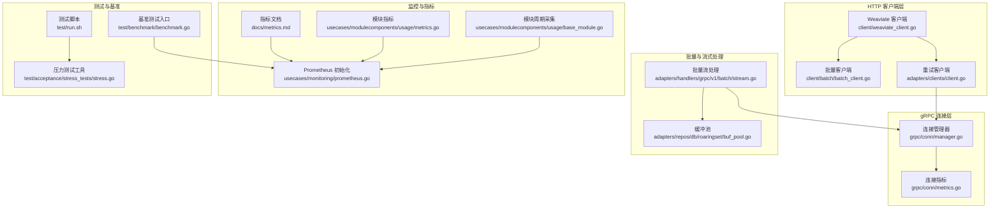
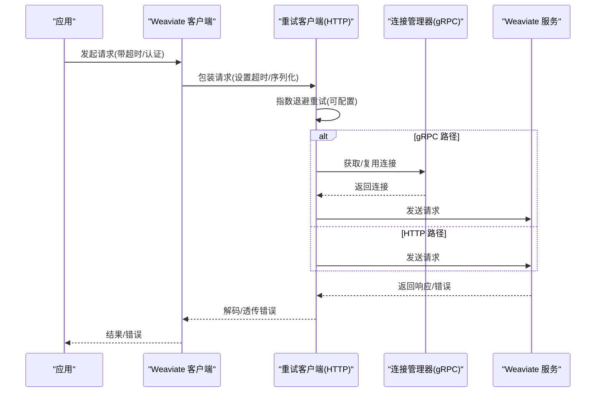
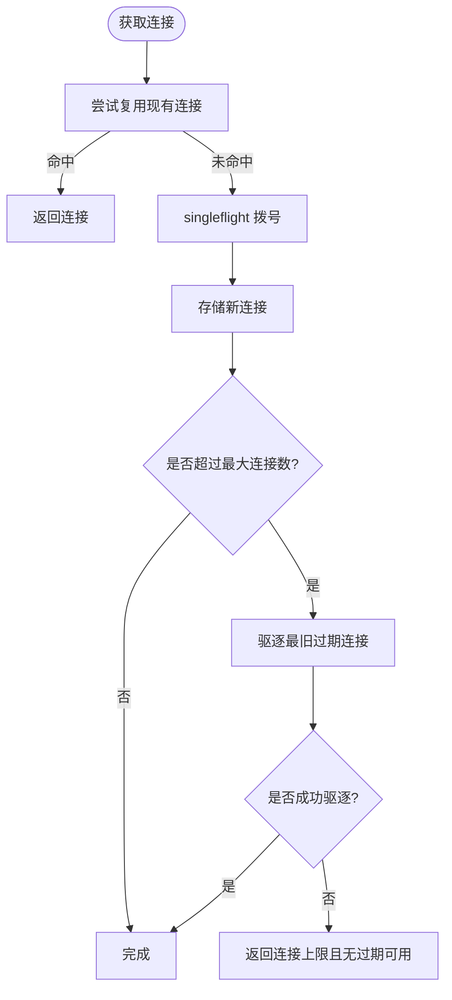
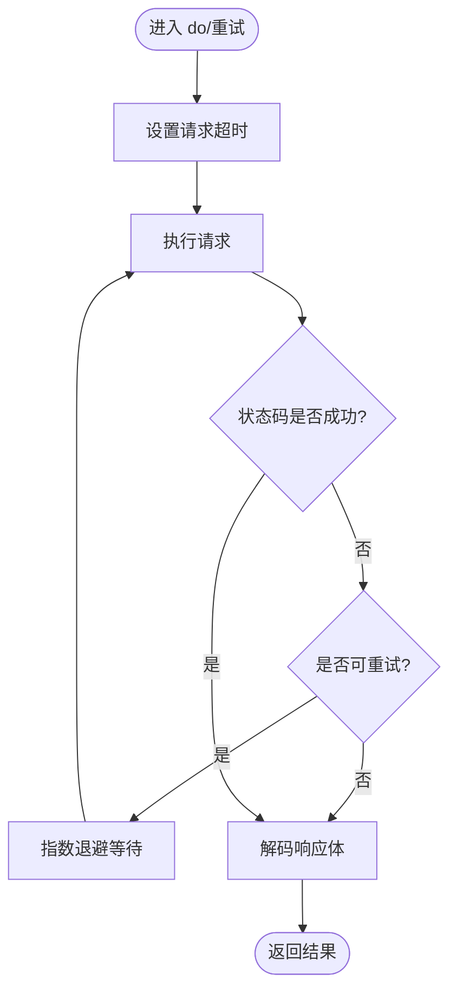
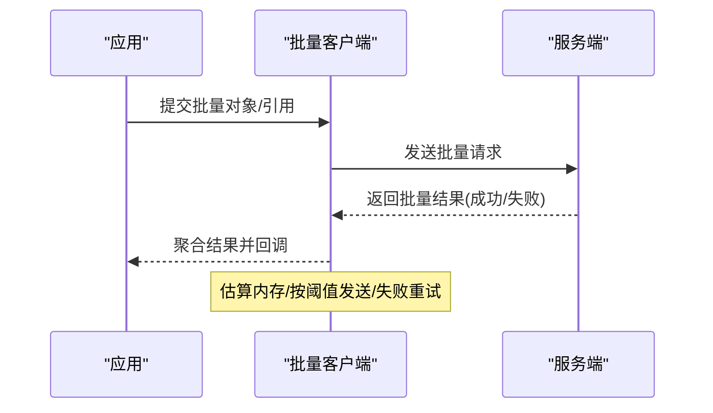
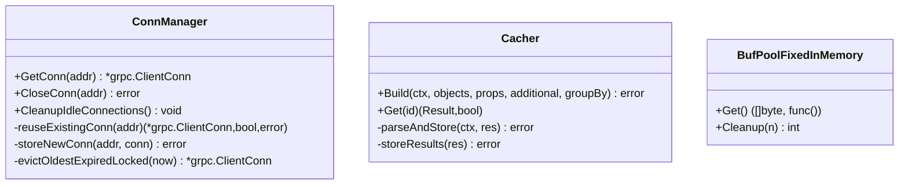
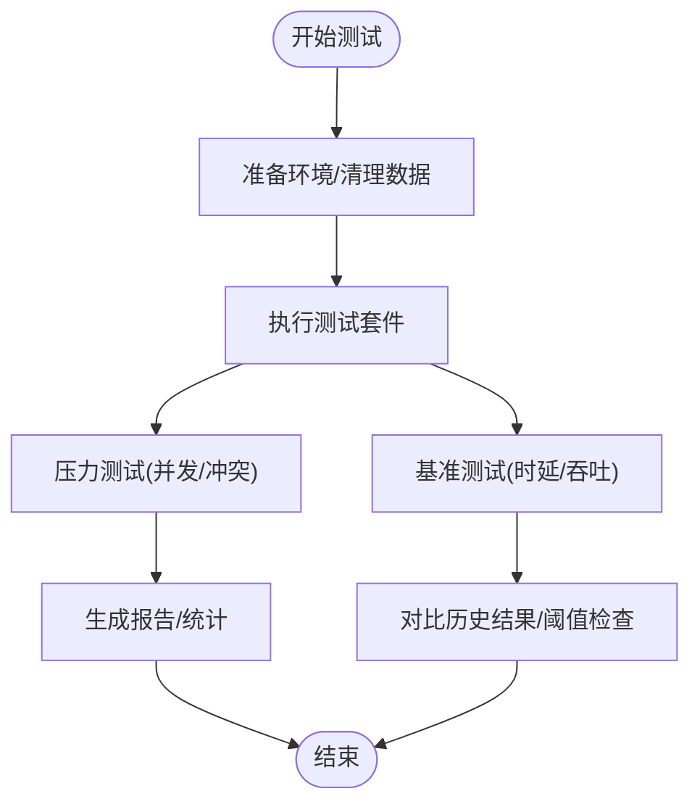
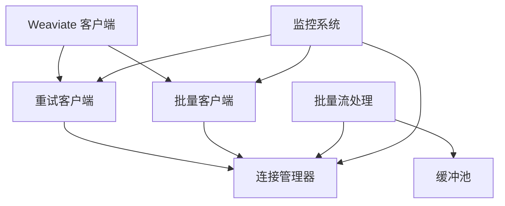

# 客户端性能优化

<cite>
**本文档引用的文件**
- [client/weaviate_client.go](file://client/weaviate_client.go)
- [adapters/clients/client.go](file://adapters/clients/client.go)
- [grpc/conn/manager.go](file://grpc/conn/manager.go)
- [grpc/conn/metrics.go](file://grpc/conn/metrics.go)
- [client/batch/batch_client.go](file://client/batch/batch_client.go)
- [adapters/handlers/grpc/v1/batch/stream.go](file://adapters/handlers/grpc/v1/batch/stream.go)
- [docs/metrics.md](file://docs/metrics.md)
- [usecases/monitoring/prometheus.go](file://usecases/monitoring/prometheus.go)
- [usecases/modulecomponents/usage/base_module.go](file://usecases/modulecomponents/usage/base_module.go)
- [usecases/modulecomponents/usage/metrics.go](file://usecases/modulecomponents/usage/metrics.go)
- [test/benchmark/benchmark.go](file://test/benchmark/benchmark.go)
- [test/run.sh](file://test/run.sh)
- [test/acceptance/stress_tests/stress.go](file://test/acceptance/stress_tests/stress.go)
- [adapters/repos/db/roaringset/buf_pool.go](file://adapters/repos/db/roaringset/buf_pool.go)
- [adapters/clients/replication.go](file://adapters/clients/replication.go)
- [entities/interval/backoff.go](file://entities/interval/backoff.go)
- [adapters/clients/client_test.go](file://adapters/clients/client_test.go)
</cite>

## 目录
1. [简介](#简介)
2. [项目结构](#项目结构)
3. [核心组件](#核心组件)
4. [架构总览](#架构总览)
5. [详细组件分析](#详细组件分析)
6. [依赖关系分析](#依赖关系分析)
7. [性能考量](#性能考量)
8. [故障排查指南](#故障排查指南)
9. [结论](#结论)
10. [附录](#附录)

## 简介
本技术文档聚焦 Weaviate 客户端的性能优化，围绕连接池配置、请求超时与重试策略、批量操作最佳实践、缓存策略、异步与并发、网络优化、性能监控与指标采集、客户端差异与适用场景、压力与基准测试方法，以及常见性能问题诊断与解决展开。内容基于仓库中的实际实现进行提炼，并提供可视化图示帮助理解。

## 项目结构
Weaviate 客户端由 Go Swagger 生成的 HTTP 客户端与 gRPC 连接管理器共同组成，同时包含批量处理、重试机制、缓冲池、监控指标等关键性能组件。下图展示与性能优化直接相关的模块关系：

**图表来源**
- [client/weaviate_client.go](file://client/weaviate_client.go#L140-L194)
- [client/batch/batch_client.go](file://client/batch/batch_client.go#L26-L180)
- [adapters/clients/client.go](file://adapters/clients/client.go#L26-L129)
- [grpc/conn/manager.go](file://grpc/conn/manager.go#L31-L385)
- [grpc/conn/metrics.go](file://grpc/conn/metrics.go#L19-L64)
- [adapters/handlers/grpc/v1/batch/stream.go](file://adapters/handlers/grpc/v1/batch/stream.go#L553-L607)
- [adapters/repos/db/roaringset/buf_pool.go](file://adapters/repos/db/roaringset/buf_pool.go#L233-L294)
- [docs/metrics.md](file://docs/metrics.md#L40-L395)
- [usecases/monitoring/prometheus.go](file://usecases/monitoring/prometheus.go#L385-L424)
- [usecases/modulecomponents/usage/metrics.go](file://usecases/modulecomponents/usage/metrics.go#L27-L64)
- [usecases/modulecomponents/usage/base_module.go](file://usecases/modulecomponents/usage/base_module.go#L205-L246)
- [test/benchmark/benchmark.go](file://test/benchmark/benchmark.go#L98-L191)
- [test/run.sh](file://test/run.sh#L1-L379)
- [test/acceptance/stress_tests/stress.go](file://test/acceptance/stress_tests/stress.go#L74-L122)

**章节来源**
- [client/weaviate_client.go](file://client/weaviate_client.go#L140-L194)
- [grpc/conn/manager.go](file://grpc/conn/manager.go#L31-L385)

## 核心组件
- Weaviate 客户端：统一入口，聚合各子服务客户端（对象、批量、集群、复制等），支持设置传输层以共享连接与配置。
- 重试客户端：封装 HTTP 请求执行与指数退避重试逻辑，支持自定义最大重试次数与超时上下文。
- gRPC 连接管理器：连接复用、单飞防抖、空闲清理、容量限制与拒绝策略，配套连接指标。
- 批量客户端与流式处理：批量对象/引用写入，批量结果聚合与内存估算，减少网络往返与提升吞吐。
- 缓冲池：固定容量与上限的字节缓冲池，降低频繁分配与 GC 压力。
- 监控与指标：Prometheus 指标注册、直方图/计数器/仪表，覆盖批处理、查询、队列、向量索引等关键路径。
- 测试与基准：自动化测试脚本、压力测试工具、基准回归比较。

**章节来源**
- [client/weaviate_client.go](file://client/weaviate_client.go#L140-L194)
- [adapters/clients/client.go](file://adapters/clients/client.go#L26-L129)
- [grpc/conn/manager.go](file://grpc/conn/manager.go#L31-L385)
- [client/batch/batch_client.go](file://client/batch/batch_client.go#L26-L180)
- [adapters/handlers/grpc/v1/batch/stream.go](file://adapters/handlers/grpc/v1/batch/stream.go#L553-L607)
- [adapters/repos/db/roaringset/buf_pool.go](file://adapters/repos/db/roaringset/buf_pool.go#L233-L294)
- [docs/metrics.md](file://docs/metrics.md#L40-L395)
- [test/benchmark/benchmark.go](file://test/benchmark/benchmark.go#L98-L191)
- [test/run.sh](file://test/run.sh#L1-L379)
- [test/acceptance/stress_tests/stress.go](file://test/acceptance/stress_tests/stress.go#L74-L122)

## 架构总览
Weaviate 客户端通过统一的传输层（HTTP/gRPC）与后端交互，重试与连接管理贯穿请求生命周期，批量与流式处理在写入路径显著提升吞吐，监控指标贯穿全链路以支撑可观测性。

**图表来源**
- [client/weaviate_client.go](file://client/weaviate_client.go#L140-L194)
- [adapters/clients/client.go](file://adapters/clients/client.go#L65-L129)
- [grpc/conn/manager.go](file://grpc/conn/manager.go#L75-L102)

## 详细组件分析

### 连接池与连接复用（gRPC）
- 连接复用：按地址缓存连接，读锁快速复用，命中即更新最近使用时间。
- 单飞防抖：使用 singleflight 避免同一地址重复拨号。
- 空闲清理：定时扫描与删除过期连接，释放资源。
- 容量控制：达到最大打开连接数时尝试驱逐最旧过期连接，否则拒绝新连接并返回明确错误。
- 指标观测：创建/复用/关闭/拒绝/驱逐计数与开放连接数仪表。

**图表来源**
- [grpc/conn/manager.go](file://grpc/conn/manager.go#L75-L170)
- [grpc/conn/manager.go](file://grpc/conn/manager.go#L172-L203)
- [grpc/conn/manager.go](file://grpc/conn/manager.go#L244-L300)

**章节来源**
- [grpc/conn/manager.go](file://grpc/conn/manager.go#L31-L385)
- [grpc/conn/metrics.go](file://grpc/conn/metrics.go#L19-L64)

### 请求超时与重试策略（HTTP）
- 超时：每个请求在上下文中设置超时，避免阻塞。
- 退避：指数退避，最大间隔与最大总时长受控，防止无限重试。
- 重试条件：针对特定状态码（如 5xx、限流、不可用）触发重试。
- 成功判定：仅在成功范围内的状态码才视为成功，否则根据状态码决定是否重试。
- 自定义解码：支持自定义响应体解码流程。

**图表来源**
- [adapters/clients/client.go](file://adapters/clients/client.go#L65-L91)
- [adapters/clients/client.go](file://adapters/clients/client.go#L111-L124)
- [adapters/clients/replication.go](file://adapters/clients/replication.go#L447-L451)

**章节来源**
- [adapters/clients/client.go](file://adapters/clients/client.go#L26-L129)
- [adapters/clients/replication.go](file://adapters/clients/replication.go#L435-L451)
- [adapters/clients/client_test.go](file://adapters/clients/client_test.go#L1-L123)

### 批量操作最佳实践
- 批量写入：使用批量对象/引用接口减少往返，提升吞吐。
- 结果聚合：批量流处理中维护成功/失败集合，按批次大小阈值发送，避免大对象堆积。
- 内存估算：对批量对象进行内存估算，结合缓冲池与通道容量控制峰值内存。
- 并发控制：批量写入建议与连接池/队列长度协同配置，避免过载。

**图表来源**
- [client/batch/batch_client.go](file://client/batch/batch_client.go#L58-L174)
- [adapters/handlers/grpc/v1/batch/stream.go](file://adapters/handlers/grpc/v1/batch/stream.go#L553-L607)

**章节来源**
- [client/batch/batch_client.go](file://client/batch/batch_client.go#L26-L180)
- [adapters/handlers/grpc/v1/batch/stream.go](file://adapters/handlers/grpc/v1/batch/stream.go#L553-L607)

### 缓存策略
- 连接缓存：gRPC 连接管理器按地址复用连接，降低握手开销。
- 结果缓存：参考引用缓存与结果存储模式，将查询结果映射到内存结构，减少重复查询。
- 缓冲池：固定容量与上限的字节缓冲池，减少频繁分配与 GC 抖动。

**图表来源**
- [grpc/conn/manager.go](file://grpc/conn/manager.go#L31-L385)
- [adapters/repos/db/refcache/cacher.go](file://adapters/repos/db/refcache/cacher.go#L340-L406)
- [adapters/repos/db/roaringset/buf_pool.go](file://adapters/repos/db/roaringset/buf_pool.go#L233-L294)

**章节来源**
- [grpc/conn/manager.go](file://grpc/conn/manager.go#L31-L385)
- [adapters/repos/db/refcache/cacher.go](file://adapters/repos/db/refcache/cacher.go#L340-L406)
- [adapters/repos/db/roaringset/buf_pool.go](file://adapters/repos/db/roaringset/buf_pool.go#L233-L294)

### 异步与并发
- 批量流式处理：通过批量结果聚合与阈值判断，实现近实时反馈与背压控制。
- gRPC 连接复用：多请求共享连接，提高并发利用率。
- 重试与退避：在超时与上下文取消保护下进行有限次指数退避，避免雪崩。

**章节来源**
- [adapters/handlers/grpc/v1/batch/stream.go](file://adapters/handlers/grpc/v1/batch/stream.go#L553-L607)
- [grpc/conn/manager.go](file://grpc/conn/manager.go#L75-L102)
- [adapters/clients/client.go](file://adapters/clients/client.go#L111-L124)

### 网络优化
- 连接复用：gRPC 连接管理器减少握手与 TLS 开销。
- 空闲清理：定期清理闲置连接，降低资源占用。
- 退避与重试：HTTP 层指数退避与最大总时长限制，避免放大网络拥塞。
- 超时控制：请求级超时，防止长时间阻塞。

**章节来源**
- [grpc/conn/manager.go](file://grpc/conn/manager.go#L229-L300)
- [adapters/clients/client.go](file://adapters/clients/client.go#L65-L91)

### 性能监控与指标采集
- 指标分类：仪表盘、运营、告警、分析、废弃等类别，控制标签基数与成本。
- 关键指标：批处理耗时、查询耗时、并发查询数、队列长度、向量索引操作、HTTP/gRPC 请求时延与大小等。
- 注册与复用：Prometheus 指标注册与确保已存在指标复用，避免重复注册。
- 模块指标：模块使用情况与延迟直方图，周期性收集与上传。

**图表来源**
- [docs/metrics.md](file://docs/metrics.md#L40-L395)
- [usecases/monitoring/prometheus.go](file://usecases/monitoring/prometheus.go#L385-L424)
- [usecases/modulecomponents/usage/metrics.go](file://usecases/modulecomponents/usage/metrics.go#L27-L64)
- [usecases/modulecomponents/usage/base_module.go](file://usecases/modulecomponents/usage/base_module.go#L205-L246)

**章节来源**
- [docs/metrics.md](file://docs/metrics.md#L40-L395)
- [usecases/monitoring/prometheus.go](file://usecases/monitoring/prometheus.go#L385-L424)
- [usecases/modulecomponents/usage/metrics.go](file://usecases/modulecomponents/usage/metrics.go#L27-L64)
- [usecases/modulecomponents/usage/base_module.go](file://usecases/modulecomponents/usage/base_module.go#L205-L246)

### 客户端差异与适用场景
- HTTP 客户端：REST 接口，适用于通用对象/模式/节点/集群等操作，具备内置重试与超时。
- gRPC 客户端：面向高性能流式与批量写入，连接复用与空闲清理，适合高吞吐写入与内部组件通信。
- 批量客户端：集中于批量对象/引用写入，配合流式处理与内存估算，适合大规模导入。

**章节来源**
- [client/weaviate_client.go](file://client/weaviate_client.go#L140-L194)
- [client/batch/batch_client.go](file://client/batch/batch_client.go#L26-L180)
- [grpc/conn/manager.go](file://grpc/conn/manager.go#L31-L385)

### 压力测试与性能基准
- 压力测试：模拟高并发请求，自动重试与错误处理，定位并发事务冲突等问题。
- 基准测试：自动化脚本运行与结果对比，支持回归阈值控制与失败退出。
- 测试脚本：统一入口，支持分组与模块化运行，便于持续集成。

**图表来源**
- [test/acceptance/stress_tests/stress.go](file://test/acceptance/stress_tests/stress.go#L74-L122)
- [test/benchmark/benchmark.go](file://test/benchmark/benchmark.go#L98-L191)
- [test/run.sh](file://test/run.sh#L1-L379)

**章节来源**
- [test/acceptance/stress_tests/stress.go](file://test/acceptance/stress_tests/stress.go#L74-L122)
- [test/benchmark/benchmark.go](file://test/benchmark/benchmark.go#L98-L191)
- [test/run.sh](file://test/run.sh#L1-L379)

## 依赖关系分析
- Weaviate 客户端聚合多个子服务客户端，统一设置传输层以共享连接与配置。
- 重试客户端封装 HTTP 请求与指数退避，作为所有 HTTP 调用的默认执行器。
- gRPC 连接管理器为 gRPC 调用提供连接复用与清理能力。
- 批量客户端与流式处理依赖连接管理器与缓冲池，实现高吞吐与内存友好。
- 监控系统贯穿各组件，提供指标注册与观测能力。

**图表来源**
- [client/weaviate_client.go](file://client/weaviate_client.go#L140-L194)
- [adapters/clients/client.go](file://adapters/clients/client.go#L26-L129)
- [grpc/conn/manager.go](file://grpc/conn/manager.go#L31-L385)
- [adapters/handlers/grpc/v1/batch/stream.go](file://adapters/handlers/grpc/v1/batch/stream.go#L553-L607)
- [adapters/repos/db/roaringset/buf_pool.go](file://adapters/repos/db/roaringset/buf_pool.go#L233-L294)

**章节来源**
- [client/weaviate_client.go](file://client/weaviate_client.go#L140-L194)
- [adapters/clients/client.go](file://adapters/clients/client.go#L26-L129)
- [grpc/conn/manager.go](file://grpc/conn/manager.go#L31-L385)
- [adapters/handlers/grpc/v1/batch/stream.go](file://adapters/handlers/grpc/v1/batch/stream.go#L553-L607)
- [adapters/repos/db/roaringset/buf_pool.go](file://adapters/repos/db/roaringset/buf_pool.go#L233-L294)

## 性能考量
- 连接池参数：最大打开连接数、空闲超时、拒绝与驱逐策略需结合 QPS 与延迟目标调优。
- 重试与退避：合理设置最小/最大退避间隔与最大总时长，避免放大网络拥塞。
- 批量大小：结合内存估算与服务端限制，动态调整批量大小与并发度。
- 缓冲池：固定容量与上限，平衡内存占用与分配频率。
- 监控维度：关注批处理耗时、查询并发、队列长度、连接数与错误率，及时发现瓶颈。

[本节为通用指导，无需具体文件分析]

## 故障排查指南
- 连接上限与无过期可用：当达到最大连接数且无可驱逐的过期连接时，会返回明确错误，需增大上限或缩短空闲超时。
- 重试失败：若超过最大总时长仍未成功，最终返回最后一次错误；检查服务端状态与网络稳定性。
- 压力测试冲突：并发事务冲突时自动重试，观察重试频率与延迟，必要时降低并发或增加重试上限。
- 指标异常：通过批处理/查询/队列/索引等指标定位热点与异常，结合日志与追踪进一步分析。

**章节来源**
- [grpc/conn/manager.go](file://grpc/conn/manager.go#L152-L159)
- [adapters/clients/client.go](file://adapters/clients/client.go#L111-L124)
- [test/acceptance/stress_tests/stress.go](file://test/acceptance/stress_tests/stress.go#L94-L122)

## 结论
通过合理的连接池配置、请求超时与指数退避重试、批量与流式处理、缓冲池与缓存策略、以及完善的监控与测试体系，Weaviate 客户端能够在高并发与大数据规模场景下保持稳定与高效。建议在生产环境中结合业务特征与监控指标持续调优，确保性能与可靠性平衡。

[本节为总结，无需具体文件分析]

## 附录
- 指标清单与类别：参见指标文档，按活跃/运营/告警/分析/废弃分类管理。
- Prometheus 初始化：确保指标注册与已存在指标复用，避免重复注册错误。
- 模块指标与周期采集：模块使用情况与延迟直方图，周期性收集与上传，便于跨模块性能分析。

**章节来源**
- [docs/metrics.md](file://docs/metrics.md#L40-L395)
- [usecases/monitoring/prometheus.go](file://usecases/monitoring/prometheus.go#L407-L424)
- [usecases/modulecomponents/usage/base_module.go](file://usecases/modulecomponents/usage/base_module.go#L205-L246)