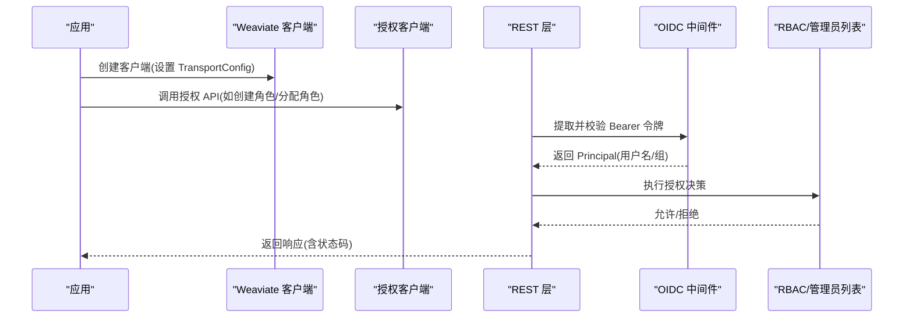
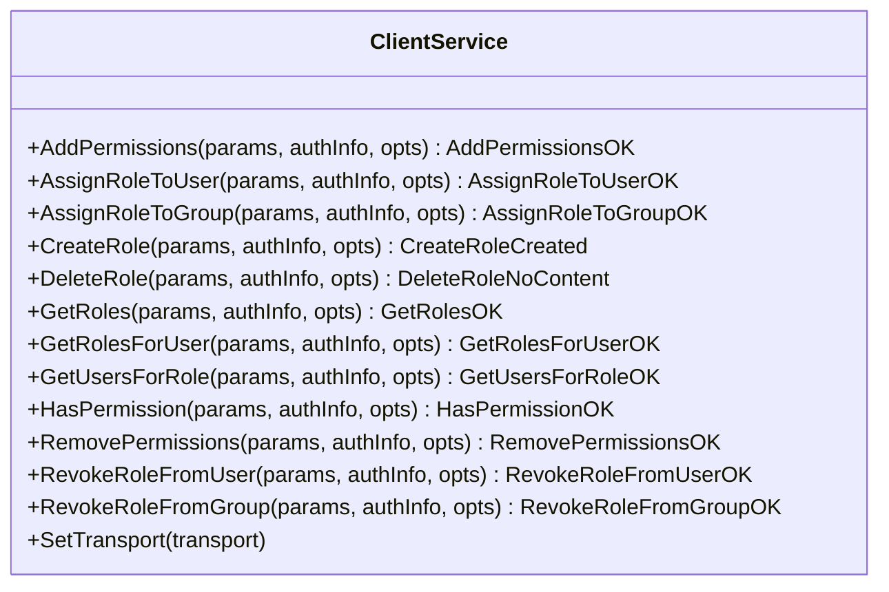
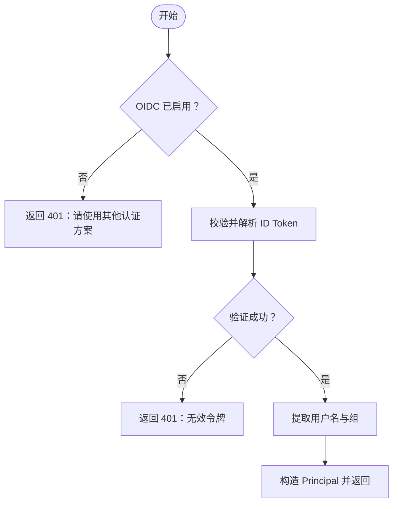
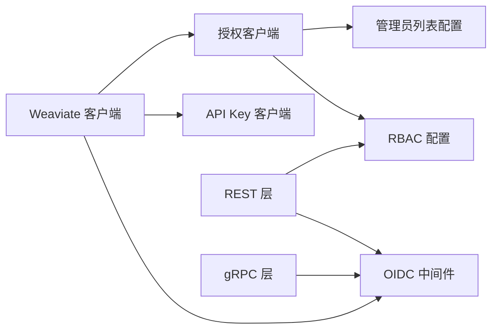

# 客户端认证与安全

<cite>
**本文引用的文件**
- [client/weaviate_client.go](file://client/weaviate_client.go)
- [client/authz/authz_client.go](file://client/authz/authz_client.go)
- [usecases/config/authentication.go](file://usecases/config/authentication.go)
- [usecases/config/authorization.go](file://usecases/config/authorization.go)
- [usecases/auth/authentication/oidc/middleware.go](file://usecases/auth/authentication/oidc/middleware.go)
- [usecases/auth/authentication/apikey/client.go](file://usecases/auth/authentication/apikey/client.go)
- [usecases/auth/authorization/rbac/rbacconf/config.go](file://usecases/auth/authorization/rbac/rbacconf/config.go)
- [usecases/auth/authorization/adminlist/config.go](file://usecases/auth/authorization/adminlist/config.go)
- [adapters/handlers/rest/operations/schema/tenants_get.go](file://adapters/handlers/rest/operations/schema/tenants_get.go)
- [adapters/handlers/rest/operations/schema/tenants_get_one.go](file://adapters/handlers/rest/operations/schema/tenants_get_one.go)
- [adapters/handlers/grpc/v1/auth/auth.go](file://adapters/handlers/grpc/v1/auth/auth.go)
- [adapters/handlers/rest/operations/weaviate_api.go](file://adapters/handlers/rest/operations/weaviate_api.go)
- [openapi-specs/schema.json](file://openapi-specs/schema.json)
- [test/docker/mockoidchelper/mockoidc_helper.go](file://test/docker/mockoidchelper/mockoidc_helper.go)
</cite>

## 目录
1. [简介](#简介)
2. [项目结构](#项目结构)
3. [核心组件](#核心组件)
4. [架构总览](#架构总览)
5. [详细组件分析](#详细组件分析)
6. [依赖关系分析](#依赖关系分析)
7. [性能考量](#性能考量)
8. [故障排查指南](#故障排查指南)
9. [结论](#结论)
10. [附录](#附录)

## 简介
本文件面向 Weaviate 客户端的认证与安全，系统性阐述以下主题：
- 多种认证方式的配置与使用：API Key 认证、OAuth 2.0 与 OpenID Connect（OIDC）
- 基于角色的访问控制（RBAC）在客户端中的应用：角色分配、权限验证、动态权限获取
- 令牌管理、自动刷新与过期处理机制
- 多租户环境下的认证配置与安全策略
- 安全最佳实践：密钥管理、传输加密、访问控制
- 客户端侧安全防护与常见问题的解决方案

## 项目结构
Weaviate 客户端通过 Go Swagger 生成的子模块提供对各功能域的访问能力，认证与授权相关的关键位置如下：
- 客户端入口与传输层：client/weaviate_client.go
- 授权（RBAC）客户端：client/authz/authz_client.go
- 配置模型：usecases/config/authentication.go、usecases/config/authorization.go
- 认证实现：OIDC 中间件 usecases/auth/authentication/oidc/middleware.go；API Key 客户端 usecases/auth/authentication/apikey/client.go
- 授权策略配置：RBAC usecases/auth/authorization/rbac/rbacconf/config.go；管理员列表 usecases/auth/authorization/adminlist/config.go
- 多租户路由：adapters/handlers/rest/operations/schema/tenants_get*.go
- gRPC 认证适配：adapters/handlers/grpc/v1/auth/auth.go
- REST 认证钩子：adapters/handlers/rest/operations/weaviate_api.go
- OpenAPI 规范：openapi-specs/schema.json
- OIDC 模拟测试服务：test/docker/mockoidchelper/mockoidc_helper.go

```mermaid
graph TB
subgraph "客户端"
WClient["Weaviate 客户端<br/>client/weaviate_client.go"]
AuthzClient["授权客户端<br/>client/authz/authz_client.go"]
end
subgraph "认证配置"
CfgAuth["认证配置<br/>usecases/config/authentication.go"]
CfgAuthz["授权配置<br/>usecases/config/authorization.go"]
end
subgraph "认证实现"
OIDC["OIDC 中间件<br/>usecases/auth/authentication/oidc/middleware.go"]
APIKey["API Key 客户端<br/>usecases/auth/authentication/apikey/client.go"]
end
subgraph "授权策略"
RBAC["RBAC 配置<br/>usecases/auth/authorization/rbac/rbacconf/config.go"]
AdminList["管理员列表配置<br/>usecases/auth/authorization/adminlist/config.go"]
end
subgraph "多租户与传输"
TenantsGet["租户路由 GET<br/>adapters/handlers/rest/operations/schema/tenants_get.go"]
TenantsGetOne["租户路由 GET ONE<br/>adapters/handlers/rest/operations/schema/tenants_get_one.go"]
GRPCAuth["gRPC 认证<br/>adapters/handlers/grpc/v1/auth/auth.go"]
RESTAuthHook["REST 认证钩子<br/>adapters/handlers/rest/operations/weaviate_api.go"]
OpenAPI["OpenAPI 规范<br/>openapi-specs/schema.json"]
end
WClient --> AuthzClient
WClient --> OIDC
WClient --> APIKey
CfgAuth --> OIDC
CfgAuth --> APIKey
CfgAuthz --> RBAC
CfgAuthz --> AdminList
AuthzClient --> RBAC
AuthzClient --> AdminList
TenantsGet --> RESTAuthHook
TenantsGetOne --> RESTAuthHook
GRPCAuth --> RESTAuthHook
OpenAPI --> AuthzClient
```

**图表来源**
- [client/weaviate_client.go](file://client/weaviate_client.go#L140-L194)
- [client/authz/authz_client.go](file://client/authz/authz_client.go#L26-L81)
- [usecases/config/authentication.go](file://usecases/config/authentication.go#L46-L83)
- [usecases/config/authorization.go](file://usecases/config/authorization.go#L21-L49)
- [usecases/auth/authentication/oidc/middleware.go](file://usecases/auth/authentication/oidc/middleware.go#L35-L108)
- [usecases/auth/authentication/apikey/client.go](file://usecases/auth/authentication/apikey/client.go#L59-L112)
- [usecases/auth/authorization/rbac/rbacconf/config.go](file://usecases/auth/authorization/rbac/rbacconf/config.go#L14-L31)
- [usecases/auth/authorization/adminlist/config.go](file://usecases/auth/authorization/adminlist/config.go#L16-L30)
- [adapters/handlers/rest/operations/schema/tenants_get.go](file://adapters/handlers/rest/operations/schema/tenants_get.go#L45-L84)
- [adapters/handlers/rest/operations/schema/tenants_get_one.go](file://adapters/handlers/rest/operations/schema/tenants_get_one.go#L45-L84)
- [adapters/handlers/grpc/v1/auth/auth.go](file://adapters/handlers/grpc/v1/auth/auth.go#L46-L71)
- [adapters/handlers/rest/operations/weaviate_api.go](file://adapters/handlers/rest/operations/weaviate_api.go#L410-L415)
- [openapi-specs/schema.json](file://openapi-specs/schema.json#L5313-L5353)

**章节来源**
- [client/weaviate_client.go](file://client/weaviate_client.go#L140-L194)
- [client/authz/authz_client.go](file://client/authz/authz_client.go#L26-L81)
- [usecases/config/authentication.go](file://usecases/config/authentication.go#L46-L83)
- [usecases/config/authorization.go](file://usecases/config/authorization.go#L21-L49)

## 核心组件
- Weaviate 客户端：统一入口，聚合各子客户端（授权、备份、批量、对象、模式、用户等），并支持设置传输层配置（主机、路径、协议）。
- 授权客户端（AuthZ）：封装 RBAC 的角色与权限管理 API，支持创建/删除角色、分配/撤销角色、查询用户/组的角色、检查权限等。
- 认证配置：定义匿名访问、OIDC、静态 API Key、数据库用户等认证方式的开关与参数。
- 授权配置：支持管理员列表与 RBAC 两种授权模式，二者不可同时启用。
- OIDC 中间件：负责初始化与校验 ID Token，提取用户名与组信息，支持自定义证书下载与 JWKS 验签。
- API Key 客户端：基于哈希比对的静态 API Key 校验，支持单用户多键或单键多用户的映射。
- 多租户路由：REST 路由在处理租户请求时进行授权校验，结合权限策略限制访问范围。
- gRPC 认证：从元数据读取 Bearer 令牌，交由认证组合器处理。

**章节来源**
- [client/weaviate_client.go](file://client/weaviate_client.go#L140-L194)
- [client/authz/authz_client.go](file://client/authz/authz_client.go#L43-L81)
- [usecases/config/authentication.go](file://usecases/config/authentication.go#L46-L83)
- [usecases/config/authorization.go](file://usecases/config/authorization.go#L21-L49)
- [usecases/auth/authentication/oidc/middleware.go](file://usecases/auth/authentication/oidc/middleware.go#L35-L108)
- [usecases/auth/authentication/apikey/client.go](file://usecases/auth/authentication/apikey/client.go#L59-L112)
- [adapters/handlers/rest/operations/schema/tenants_get.go](file://adapters/handlers/rest/operations/schema/tenants_get.go#L45-L84)
- [adapters/handlers/grpc/v1/auth/auth.go](file://adapters/handlers/grpc/v1/auth/auth.go#L46-L71)

## 架构总览
Weaviate 客户端的认证与授权流程如下：
- 客户端通过 TransportConfig 设置默认主机、基础路径与协议，随后创建 Weaviate 客户端实例，并注入各子客户端。
- REST 与 gRPC 层分别在请求进入时调用认证钩子与中间件，解析令牌并生成 Principal（主体）。
- 授权层根据 Principal 与请求上下文执行 RBAC 或管理员列表策略判断。
- 对于授权 API（AuthZ），客户端直接调用对应方法，返回成功/失败或错误码。

**图表来源**
- [client/weaviate_client.go](file://client/weaviate_client.go#L56-L99)
- [client/authz/authz_client.go](file://client/authz/authz_client.go#L88-L122)
- [adapters/handlers/rest/operations/weaviate_api.go](file://adapters/handlers/rest/operations/weaviate_api.go#L410-L415)
- [usecases/auth/authentication/oidc/middleware.go](file://usecases/auth/authentication/oidc/middleware.go#L133-L161)
- [usecases/config/authorization.go](file://usecases/config/authorization.go#L21-L49)

## 详细组件分析

### Weaviate 客户端与传输配置
- 客户端通过 NewHTTPClient/NewHTTPClientWithConfig 构建，默认 Host/BasePath/Schemes 可覆盖。
- SetTransport 将 Transport 注入到所有子客户端，确保统一的认证与传输行为。
- 默认仅 HTTPS 协议，符合安全基线。

**章节来源**
- [client/weaviate_client.go](file://client/weaviate_client.go#L56-L99)
- [client/weaviate_client.go](file://client/weaviate_client.go#L175-L194)

### 授权客户端（AuthZ）
- 支持的操作：创建/删除角色、添加/移除权限、分配/撤销角色给用户/组、查询角色与用户/组、检查权限。
- 所有操作均通过 ClientTransport 发送，使用 https 方案，返回特定响应类型或错误。
- 适合在客户端侧进行权限治理与动态授权管理。

**图表来源**
- [client/authz/authz_client.go](file://client/authz/authz_client.go#L43-L81)

**章节来源**
- [client/authz/authz_client.go](file://client/authz/authz_client.go#L88-L122)
- [client/authz/authz_client.go](file://client/authz/authz_client.go#L170-L204)
- [client/authz/authz_client.go](file://client/authz/authz_client.go#L211-L245)
- [client/authz/authz_client.go](file://client/authz/authz_client.go#L498-L532)

### 认证配置与选择
- 认证方式：匿名访问、OIDC、静态 API Key、数据库用户。
- 任一认证方式被启用即视为有效配置；若启用匿名访问，则未携带凭据的请求被视为匿名。
- OIDC 支持配置 Issuer、ClientID、UsernameClaim、GroupsClaim、Scopes、JWKSUrl、Certificate 等。
- API Key 支持静态配置与动态用户库，静态 API Key 会做哈希比对。

**章节来源**
- [usecases/config/authentication.go](file://usecases/config/authentication.go#L46-L83)

### OIDC 认证中间件
- 初始化阶段：校验配置、可选加载自定义证书（支持字符串、HTTP 下载、S3），建立远程 JWKS 或 Provider 并创建 Verifier。
- 运行时：接收 Bearer 令牌，验证后提取用户名与组，返回 Principal。
- 错误处理：未启用 OIDC 时返回 401；令牌无效返回 401；Claims 解析失败返回 500。

**图表来源**
- [usecases/auth/authentication/oidc/middleware.go](file://usecases/auth/authentication/oidc/middleware.go#L133-L161)

**章节来源**
- [usecases/auth/authentication/oidc/middleware.go](file://usecases/auth/authentication/oidc/middleware.go#L66-L108)
- [usecases/auth/authentication/oidc/middleware.go](file://usecases/auth/authentication/oidc/middleware.go#L215-L298)

### API Key 认证
- 静态 API Key：配置允许的密钥与用户映射，校验时对输入密钥进行 SHA-256 哈希比对。
- 动态 API Key：通过动态用户库创建用户与密钥，支持轮换与撤销。
- 错误：无效密钥返回“unauthorized”。

**章节来源**
- [usecases/auth/authentication/apikey/client.go](file://usecases/auth/authentication/apikey/client.go#L59-L112)

### 授权策略：RBAC 与管理员列表
- 授权配置：AdminList 与 RBAC 不可同时启用；RBAC 支持根用户/组、只读组、查看者、管理员等角色集合。
- 管理员列表：明确列出用户与组的管理员与只读权限，启动时校验重叠。
- 在 REST 与 gRPC 层，请求经 Authorizer 决策，结合权限策略限制资源访问。

**章节来源**
- [usecases/config/authorization.go](file://usecases/config/authorization.go#L21-L49)
- [usecases/auth/authorization/rbac/rbacconf/config.go](file://usecases/auth/authorization/rbac/rbacconf/config.go#L14-L31)
- [usecases/auth/authorization/adminlist/config.go](file://usecases/auth/authorization/adminlist/config.go#L16-L30)
- [adapters/handlers/rest/operations/weaviate_api.go](file://adapters/handlers/rest/operations/weaviate_api.go#L410-L415)

### 多租户环境下的认证与授权
- 租户路由：REST 路由在处理 /schema/{className}/tenants 与 /schema/{className}/tenants/{tenantName} 时进行授权校验。
- 权限范围：OpenAPI 规范中明确 401/403 等状态码，表明在无权或凭证无效时的响应语义。
- 结合 RBAC，可对特定集合/租户设置细粒度权限，限制用户仅能访问其被授权的租户。

**章节来源**
- [adapters/handlers/rest/operations/schema/tenants_get.go](file://adapters/handlers/rest/operations/schema/tenants_get.go#L45-L84)
- [adapters/handlers/rest/operations/schema/tenants_get_one.go](file://adapters/handlers/rest/operations/schema/tenants_get_one.go#L45-L84)
- [openapi-specs/schema.json](file://openapi-specs/schema.json#L5313-L5353)

### gRPC 认证与 REST 认证钩子
- gRPC：从元数据读取 Authorization Bearer 令牌，若缺失或不以 Bearer 开头则尝试匿名访问（取决于配置）。
- REST：通过 OidcAuth 与 APIAuthorizer 钩子完成认证与授权，返回 Principal 或拒绝请求。

**章节来源**
- [adapters/handlers/grpc/v1/auth/auth.go](file://adapters/handlers/grpc/v1/auth/auth.go#L46-L71)
- [adapters/handlers/rest/operations/weaviate_api.go](file://adapters/handlers/rest/operations/weaviate_api.go#L410-L415)

## 依赖关系分析
- 客户端依赖传输层（HTTP/HTTPS）与认证中间件；AuthZ 客户端依赖授权策略（RBAC/AdminList）。
- OIDC 依赖外部 Issuer/JWKS，支持自定义证书；API Key 依赖本地配置或动态用户库。
- 多租户路由依赖授权层对集合与租户维度的权限控制。

**图表来源**
- [client/weaviate_client.go](file://client/weaviate_client.go#L140-L194)
- [client/authz/authz_client.go](file://client/authz/authz_client.go#L26-L81)
- [usecases/auth/authentication/oidc/middleware.go](file://usecases/auth/authentication/oidc/middleware.go#L35-L108)
- [usecases/auth/authentication/apikey/client.go](file://usecases/auth/authentication/apikey/client.go#L59-L112)
- [usecases/config/authorization.go](file://usecases/config/authorization.go#L21-L49)

**章节来源**
- [client/weaviate_client.go](file://client/weaviate_client.go#L140-L194)
- [client/authz/authz_client.go](file://client/authz/authz_client.go#L26-L81)

## 性能考量
- OIDC 验证：建议使用 JWKS 远端缓存与合理的超时配置，避免每次请求都重新下载证书。
- API Key：静态 API Key 使用常数时间比较，哈希存储在内存中，注意密钥数量与轮换频率。
- RBAC：策略匹配复杂度与规则数量相关，建议精简规则并定期审计。
- 多租户：对大量租户的查询应配合分页与过滤，减少一次性返回的数据量。

## 故障排查指南
- OIDC 未启用但携带令牌：返回 401，提示使用其他认证方案或正确配置 OIDC。
- 令牌无效或过期：返回 401；检查 Issuer、ClientID、JWKSUrl 与证书配置。
- Claims 缺失或类型不符：返回 500，确认 UsernameClaim/GroupsClaim 配置与提供方一致。
- API Key 无效：返回 unauthorized；核对 AllowedKeys 与用户映射。
- 授权失败（403）：检查 RBAC/管理员列表配置与用户角色映射。
- 多租户访问受限：确认集合与租户权限策略，以及用户/组是否具备相应角色。

**章节来源**
- [usecases/auth/authentication/oidc/middleware.go](file://usecases/auth/authentication/oidc/middleware.go#L133-L161)
- [usecases/auth/authentication/apikey/client.go](file://usecases/auth/authentication/apikey/client.go#L82-L91)
- [openapi-specs/schema.json](file://openapi-specs/schema.json#L5313-L5353)

## 结论
Weaviate 客户端提供了完善的认证与授权能力：支持 OIDC 与 API Key 两种主流认证方式，并通过 RBAC 与管理员列表实现灵活的访问控制。结合多租户路由与 gRPC/REST 的认证钩子，可在生产环境中构建安全可靠的访问体系。建议遵循安全最佳实践，合理配置传输加密、密钥管理与权限策略，并持续审计与优化。

## 附录

### 常见安全问题与解决方案
- 传输加密：始终使用 HTTPS；OIDC 支持自定义证书，可用于私有 Issuer。
- 密钥管理：静态 API Key 应妥善保管；建议启用动态用户库并支持轮换。
- 访问控制：优先使用 RBAC 明确角色与权限；避免同时启用 AdminList 与 RBAC。
- 多租户隔离：为不同租户配置独立角色与权限，防止越权访问。

### 示例参考（路径）
- OIDC 令牌模拟与获取：[test/docker/mockoidchelper/mockoidc_helper.go](file://test/docker/mockoidchelper/mockoidc_helper.go#L145-L193)
- REST 认证钩子声明：[adapters/handlers/rest/operations/weaviate_api.go](file://adapters/handlers/rest/operations/weaviate_api.go#L410-L415)
- OpenAPI 授权状态码：[openapi-specs/schema.json](file://openapi-specs/schema.json#L5313-L5353)