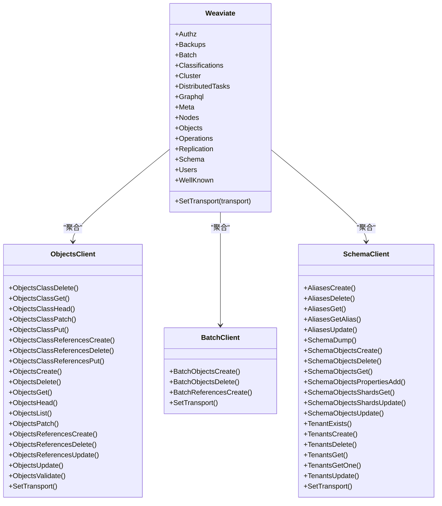
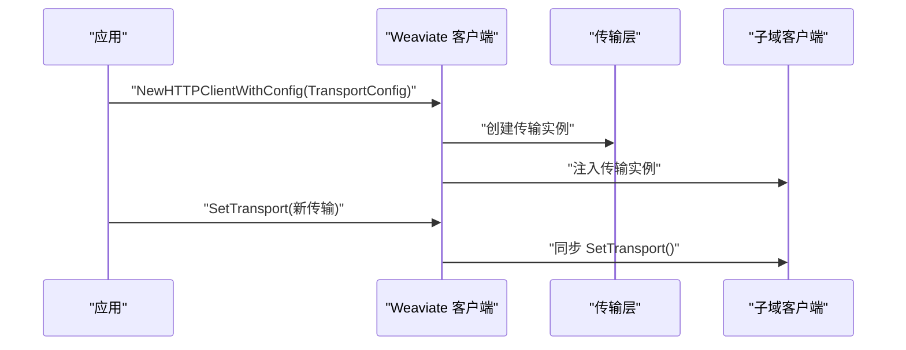
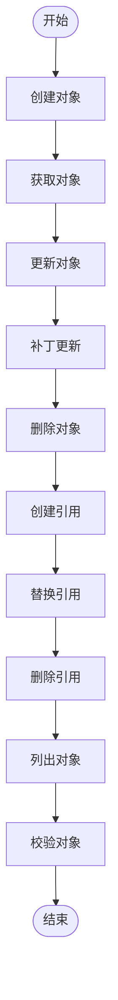
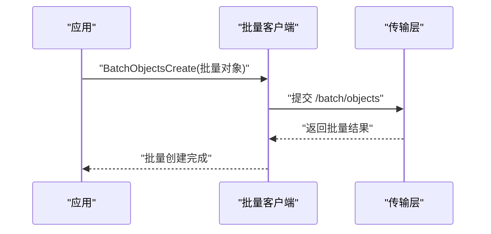
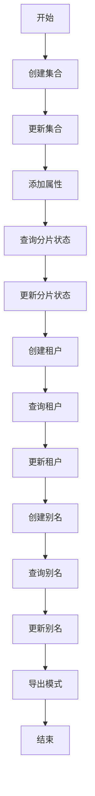
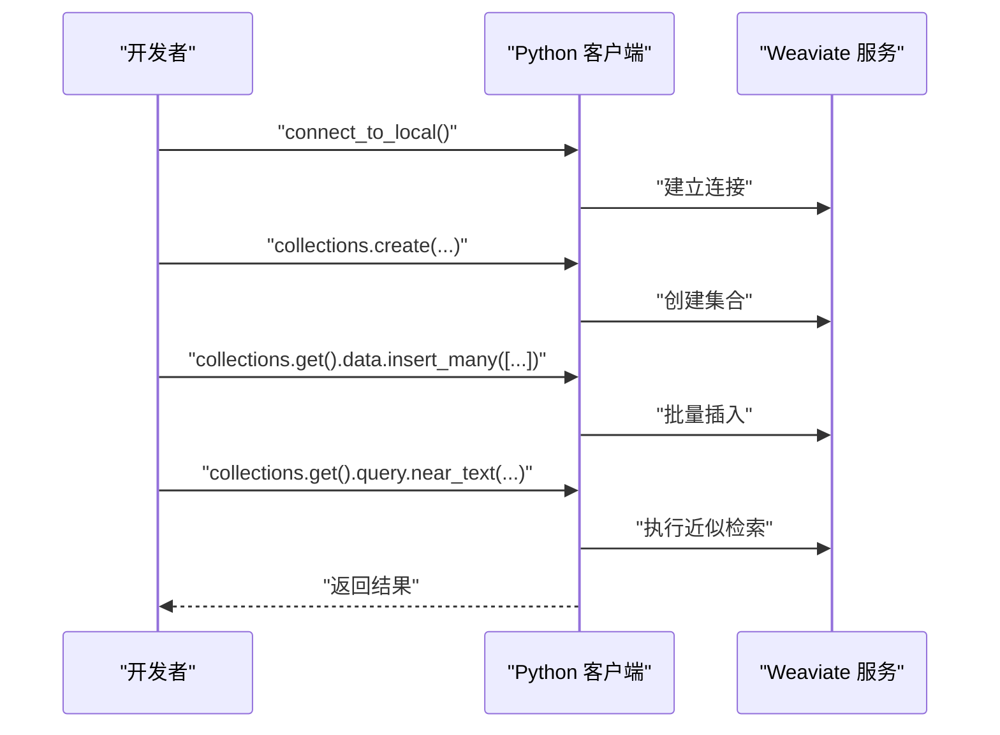
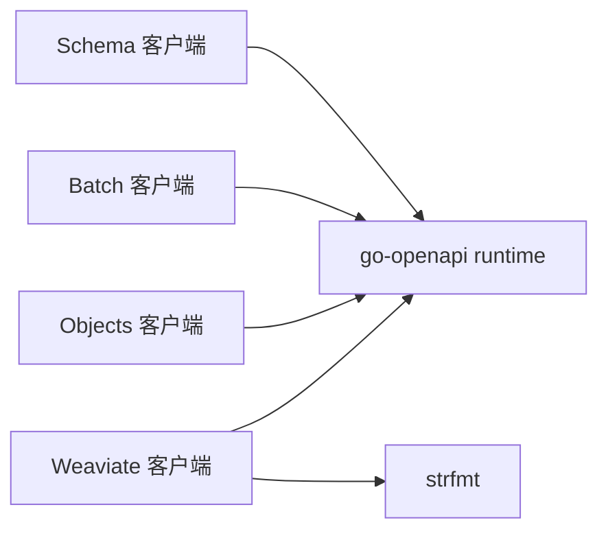

# 客户端集成

<cite>
**本文引用的文件**
- [README.md](file://README.md)
- [client/weaviate_client.go](file://client/weaviate_client.go)
- [client/objects/objects_client.go](file://client/objects/objects_client.go)
- [client/batch/batch_client.go](file://client/batch/batch_client.go)
- [client/schema/schema_client.go](file://client/schema/schema_client.go)
- [example/basic_weaviate_test.go](file://example/basic_weaviate_test.go)
- [example/query_existing_data_test.go](file://example/query_existing_data_test.go)
- [example/query_inserted_data_test.go](file://example/query_inserted_data_test.go)
- [example/semantic_search_test.go](file://example/semantic_search_test.go)
- [example/semantic_search_simple_test.go](file://example/semantic_search_simple_test.go)
</cite>

## 目录
1. [简介](#简介)
2. [项目结构](#项目结构)
3. [核心组件](#核心组件)
4. [架构总览](#架构总览)
5. [详细组件分析](#详细组件分析)
6. [依赖关系分析](#依赖关系分析)
7. [性能考量](#性能考量)
8. [故障排查指南](#故障排查指南)
9. [结论](#结论)
10. [附录](#附录)

## 简介
本文件面向不同技术栈的开发者，提供 Weaviate 客户端集成的系统化技术文档。Weaviate 提供多种客户端库与 API，包括 Python、JavaScript/TypeScript、Java、Go 等。本文以仓库中的 Go 客户端实现为基础，梳理其模块化结构与调用方式，并结合官方 README 中的 Python 示例，给出跨语言的集成思路、最佳实践、连接管理、错误处理与性能优化建议。同时，针对异步操作、批量处理与事务支持，提供可迁移的实现策略与参考路径。

## 项目结构
仓库采用模块化的 Go 包组织方式，客户端相关代码集中在 client 目录下，按功能域划分为多个子包（如 objects、batch、schema、graphql 等），每个子包导出统一的 ClientService 接口与参数类型，最终由顶层 Weaviate 客户端聚合，形成统一入口。

- 顶层客户端聚合：client/weaviate_client.go
- 功能域客户端：client/objects、client/batch、client/schema 等
- 示例与测试：example 目录下的各类测试文件

```mermaid
graph TB
Root["顶层客户端<br/>client/weaviate_client.go"] --> Objects["对象客户端<br/>client/objects/objects_client.go"]
Root --> Batch["批量客户端<br/>client/batch/batch_client.go"]
Root --> Schema["模式客户端<br/>client/schema/schema_client.go"]
Root --> GraphQL["GraphQL 客户端<br/>client/graphql/graphql_client.go"]
Root --> Meta["元信息客户端<br/>client/meta/meta_client.go"]
Root --> Nodes["节点客户端<br/>client/nodes/nodes_client.go"]
Root --> Cluster["集群客户端<br/>client/cluster/cluster_client.go"]
Root --> Backups["备份客户端<br/>client/backups/backups_client.go"]
Root --> Replication["复制客户端<br/>client/replication/replication_client.go"]
Root --> Users["用户客户端<br/>client/users/users_client.go"]
Root --> Authz["授权客户端<br/>client/authz/authz_client.go"]
Root --> DistributedTasks["分布式任务客户端<br/>client/distributed_tasks/distributed_tasks_client.go"]
Root --> Operations["运维客户端<br/>client/operations/operations_client.go"]
Root --> WellKnown["Well-Known 客户端<br/>client/well_known/well_known_client.go"]
```

图表来源
- [client/weaviate_client.go](file://client/weaviate_client.go#L140-L194)
- [client/objects/objects_client.go](file://client/objects/objects_client.go#L42-L83)
- [client/batch/batch_client.go](file://client/batch/batch_client.go#L42-L51)
- [client/schema/schema_client.go](file://client/schema/schema_client.go#L42-L83)

章节来源
- [client/weaviate_client.go](file://client/weaviate_client.go#L1-L194)

## 核心组件
- 顶层 Weaviate 客户端：负责创建与配置底层传输层（HTTP），并将各功能域客户端注入其中，提供统一的访问入口。
- 对象客户端：封装对象的增删改查、存在性检查、引用管理等 REST API。
- 批量客户端：提供批量对象创建、批量删除、批量引用创建等高效接口。
- 模式客户端：提供集合（类）定义、属性添加、租户管理、别名映射等模式管理能力。

章节来源
- [client/weaviate_client.go](file://client/weaviate_client.go#L140-L194)
- [client/objects/objects_client.go](file://client/objects/objects_client.go#L42-L83)
- [client/batch/batch_client.go](file://client/batch/batch_client.go#L42-L51)
- [client/schema/schema_client.go](file://client/schema/schema_client.go#L42-L83)

## 架构总览
Weaviate 客户端采用“聚合 + 子域”的架构：顶层 Weaviate 聚合多个功能域客户端；每个功能域客户端内部通过 go-openapi runtime 封装 HTTP 请求，提交到 Weaviate 服务端。这种设计使得客户端具备良好的可扩展性与可维护性。

图表来源
- [client/weaviate_client.go](file://client/weaviate_client.go#L140-L194)
- [client/objects/objects_client.go](file://client/objects/objects_client.go#L42-L83)
- [client/batch/batch_client.go](file://client/batch/batch_client.go#L42-L51)
- [client/schema/schema_client.go](file://client/schema/schema_client.go#L42-L83)

## 详细组件分析

### 顶层客户端与传输配置
- 默认主机、基础路径与协议：默认主机、基础路径与协议在顶层客户端中集中定义，便于全局配置与覆盖。
- 传输配置：支持通过 TransportConfig 自定义主机、基础路径与协议数组，NewHTTPClientWithConfig 可传入自定义配置。
- 统一传输设置：SetTransport 会同步更新所有子域客户端的传输实例，保证一致性。

图表来源
- [client/weaviate_client.go](file://client/weaviate_client.go#L56-L72)
- [client/weaviate_client.go](file://client/weaviate_client.go#L101-L138)
- [client/weaviate_client.go](file://client/weaviate_client.go#L175-L193)

章节来源
- [client/weaviate_client.go](file://client/weaviate_client.go#L44-L55)
- [client/weaviate_client.go](file://client/weaviate_client.go#L56-L72)
- [client/weaviate_client.go](file://client/weaviate_client.go#L101-L138)
- [client/weaviate_client.go](file://client/weaviate_client.go#L175-L193)

### 对象客户端（Objects）
- 主要能力：对象的创建、获取、更新、删除、存在性检查、列表查询、校验；以及引用的创建、替换与删除。
- 参数与返回：每个方法对应一组 Params 与响应 Reader，通过 runtime.ClientOperation 提交请求。
- 兼容性提示：部分旧版端点已标记为弃用，建议使用带 className 的新端点。

图表来源
- [client/objects/objects_client.go](file://client/objects/objects_client.go#L42-L83)

章节来源
- [client/objects/objects_client.go](file://client/objects/objects_client.go#L85-L124)
- [client/objects/objects_client.go](file://client/objects/objects_client.go#L126-L165)
- [client/objects/objects_client.go](file://client/objects/objects_client.go#L167-L206)
- [client/objects/objects_client.go](file://client/objects/objects_client.go#L208-L247)
- [client/objects/objects_client.go](file://client/objects/objects_client.go#L249-L288)
- [client/objects/objects_client.go](file://client/objects/objects_client.go#L290-L329)
- [client/objects/objects_client.go](file://client/objects/objects_client.go#L331-L370)
- [client/objects/objects_client.go](file://client/objects/objects_client.go#L372-L411)
- [client/objects/objects_client.go](file://client/objects/objects_client.go#L413-L452)
- [client/objects/objects_client.go](file://client/objects/objects_client.go#L454-L493)
- [client/objects/objects_client.go](file://client/objects/objects_client.go#L495-L534)
- [client/objects/objects_client.go](file://client/objects/objects_client.go#L536-L575)
- [client/objects/objects_client.go](file://client/objects/objects_client.go#L577-L616)
- [client/objects/objects_client.go](file://client/objects/objects_client.go#L618-L657)
- [client/objects/objects_client.go](file://client/objects/objects_client.go#L659-L698)
- [client/objects/objects_client.go](file://client/objects/objects_client.go#L700-L739)
- [client/objects/objects_client.go](file://client/objects/objects_client.go#L741-L780)
- [client/objects/objects_client.go](file://client/objects/objects_client.go#L782-L800)

### 批量客户端（Batch）
- 主要能力：批量创建对象、批量删除对象、批量创建引用。
- 性能特性：批量接口显著优于多次单对象请求，适合大规模导入场景。
- 幂等性：批量创建基于 UUID 幂等，重复 UUID 会覆盖同一批次内的目标对象。

图表来源
- [client/batch/batch_client.go](file://client/batch/batch_client.go#L53-L92)
- [client/batch/batch_client.go](file://client/batch/batch_client.go#L94-L133)
- [client/batch/batch_client.go](file://client/batch/batch_client.go#L135-L174)

章节来源
- [client/batch/batch_client.go](file://client/batch/batch_client.go#L53-L92)
- [client/batch/batch_client.go](file://client/batch/batch_client.go#L94-L133)
- [client/batch/batch_client.go](file://client/batch/batch_client.go#L135-L174)

### 模式客户端（Schema）
- 主要能力：集合（类）的创建、删除、更新、查询；属性添加；分片状态查询与更新；租户的创建、删除、查询与更新；别名的创建、删除、查询与更新；模式导出。
- 多租户与别名：支持租户存在性检查、租户列表管理与别名映射，便于多租户与灵活访问。

图表来源
- [client/schema/schema_client.go](file://client/schema/schema_client.go#L85-L124)
- [client/schema/schema_client.go](file://client/schema/schema_client.go#L126-L165)
- [client/schema/schema_client.go](file://client/schema/schema_client.go#L167-L206)
- [client/schema/schema_client.go](file://client/schema/schema_client.go#L208-L247)
- [client/schema/schema_client.go](file://client/schema/schema_client.go#L249-L288)
- [client/schema/schema_client.go](file://client/schema/schema_client.go#L290-L329)
- [client/schema/schema_client.go](file://client/schema/schema_client.go#L331-L370)
- [client/schema/schema_client.go](file://client/schema/schema_client.go#L371-L411)
- [client/schema/schema_client.go](file://client/schema/schema_client.go#L413-L452)
- [client/schema/schema_client.go](file://client/schema/schema_client.go#L454-L493)
- [client/schema/schema_client.go](file://client/schema/schema_client.go#L495-L534)
- [client/schema/schema_client.go](file://client/schema/schema_client.go#L536-L575)
- [client/schema/schema_client.go](file://client/schema/schema_client.go#L577-L616)
- [client/schema/schema_client.go](file://client/schema/schema_client.go#L618-L657)
- [client/schema/schema_client.go](file://client/schema/schema_client.go#L659-L698)
- [client/schema/schema_client.go](file://client/schema/schema_client.go#L700-L739)
- [client/schema/schema_client.go](file://client/schema/schema_client.go#L741-L780)
- [client/schema/schema_client.go](file://client/schema/schema_client.go#L782-L800)

章节来源
- [client/schema/schema_client.go](file://client/schema/schema_client.go#L85-L124)
- [client/schema/schema_client.go](file://client/schema/schema_client.go#L126-L165)
- [client/schema/schema_client.go](file://client/schema/schema_client.go#L167-L206)
- [client/schema/schema_client.go](file://client/schema/schema_client.go#L208-L247)
- [client/schema/schema_client.go](file://client/schema/schema_client.go#L249-L288)
- [client/schema/schema_client.go](file://client/schema/schema_client.go#L290-L329)
- [client/schema/schema_client.go](file://client/schema/schema_client.go#L331-L370)
- [client/schema/schema_client.go](file://client/schema/schema_client.go#L371-L411)
- [client/schema/schema_client.go](file://client/schema/schema_client.go#L413-L452)
- [client/schema/schema_client.go](file://client/schema/schema_client.go#L454-L493)
- [client/schema/schema_client.go](file://client/schema/schema_client.go#L495-L534)
- [client/schema/schema_client.go](file://client/schema/schema_client.go#L536-L575)
- [client/schema/schema_client.go](file://client/schema/schema_client.go#L577-L616)
- [client/schema/schema_client.go](file://client/schema/schema_client.go#L618-L657)
- [client/schema/schema_client.go](file://client/schema/schema_client.go#L659-L698)
- [client/schema/schema_client.go](file://client/schema/schema_client.go#L700-L739)
- [client/schema/schema_client.go](file://client/schema/schema_client.go#L741-L780)
- [client/schema/schema_client.go](file://client/schema/schema_client.go#L782-L800)

### Python 客户端集成要点（基于 README 示例）
- 安装与连接：通过 pip 安装客户端后，使用本地连接方式建立客户端实例。
- 集合创建：指定属性与向量配置（可选），支持自动向量化或自提供向量。
- 批量插入：使用集合的数据接口进行批量插入，提升导入效率。
- 查询与近似检索：通过集合的查询接口执行近似文本检索等操作。

图表来源
- [README.md](file://README.md#L56-L96)

章节来源
- [README.md](file://README.md#L56-L96)

### JavaScript/TypeScript 与 Java 客户端集成要点（基于 README）
- 官方文档链接：README 提供了 JavaScript/TypeScript 与 Java 客户端库的官方文档入口，建议开发者优先查阅官方文档以获取最新 API 与集成细节。
- Node.js 集成：参考官方文档进行安装与初始化。
- 浏览器使用：注意跨域与认证配置，遵循官方文档的安全与网络要求。
- React 集成：在前端项目中按官方文档进行配置与封装。
- Java 集成：通过 Maven 引入官方库，按官方文档进行初始化与使用。

章节来源
- [README.md](file://README.md#L100-L108)

## 依赖关系分析
- 组件耦合：顶层 Weaviate 与各子域客户端之间为聚合关系，子域客户端仅依赖通用的 runtime 与格式化工具，保持低耦合。
- 直接依赖：各子域客户端依赖 go-openapi runtime 与 strfmt，用于 HTTP 请求与数据格式化。
- 外部依赖：通过 go.mod 管理外部依赖，顶层客户端不直接依赖业务逻辑，仅负责装配。

图表来源
- [client/weaviate_client.go](file://client/weaviate_client.go#L19-L39)
- [client/objects/objects_client.go](file://client/objects/objects_client.go#L19-L24)
- [client/batch/batch_client.go](file://client/batch/batch_client.go#L19-L24)
- [client/schema/schema_client.go](file://client/schema/schema_client.go#L19-L24)

章节来源
- [client/weaviate_client.go](file://client/weaviate_client.go#L19-L39)
- [client/objects/objects_client.go](file://client/objects/objects_client.go#L19-L24)
- [client/batch/batch_client.go](file://client/batch/batch_client.go#L19-L24)
- [client/schema/schema_client.go](file://client/schema/schema_client.go#L19-L24)

## 性能考量
- 批量导入：优先使用批量客户端接口进行大规模对象导入，以减少网络往返与提高吞吐。
- 幂等写入：批量创建基于 UUID 幂等，避免重复导入导致的数据不一致。
- 分片与租户：合理规划集合分片与多租户策略，有助于提升查询与写入性能。
- 连接复用：通过统一传输层与 SetTransport 机制，确保连接复用与一致性。
- 查询优化：结合 README 中的示例，使用近似检索等能力，平衡召回与性能。

章节来源
- [client/batch/batch_client.go](file://client/batch/batch_client.go#L53-L92)
- [client/schema/schema_client.go](file://client/schema/schema_client.go#L495-L534)
- [client/weaviate_client.go](file://client/weaviate_client.go#L175-L193)

## 故障排查指南
- 错误处理：各客户端方法返回 error，应在调用侧捕获并根据响应类型进行处理。
- 参数校验：客户端在提交前通常不做参数校验，应确保请求参数符合 API 规范。
- 版本兼容：注意 README 中对弃用端点的说明，优先使用新端点。
- 示例参考：可通过仓库中的示例文件定位常见流程，辅助问题定位。

章节来源
- [client/objects/objects_client.go](file://client/objects/objects_client.go#L85-L124)
- [client/objects/objects_client.go](file://client/objects/objects_client.go#L126-L165)
- [README.md](file://README.md#L56-L96)

## 结论
Weaviate 客户端通过模块化设计实现了清晰的功能边界与统一的访问入口。Go 客户端提供了对象、批量、模式等核心能力的稳定实现；结合 README 中的 Python 示例，可为其他语言（JS/TS、Java）提供集成参考。建议在实际项目中优先采用批量导入、合理规划分片与租户、关注弃用端点迁移，并结合示例与错误处理策略进行稳健开发。

## 附录
- 示例文件参考路径（不含具体代码内容）：
  - [basic_weaviate_test.go](file://example/basic_weaviate_test.go)
  - [query_existing_data_test.go](file://example/query_existing_data_test.go)
  - [query_inserted_data_test.go](file://example/query_inserted_data_test.go)
  - [semantic_search_test.go](file://example/semantic_search_test.go)
  - [semantic_search_simple_test.go](file://example/semantic_search_simple_test.go)

章节来源
- [example/basic_weaviate_test.go](file://example/basic_weaviate_test.go)
- [example/query_existing_data_test.go](file://example/query_existing_data_test.go)
- [example/query_inserted_data_test.go](file://example/query_inserted_data_test.go)
- [example/semantic_search_test.go](file://example/semantic_search_test.go)
- [example/semantic_search_simple_test.go](file://example/semantic_search_simple_test.go)