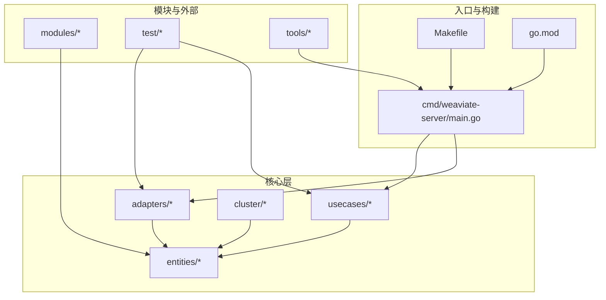
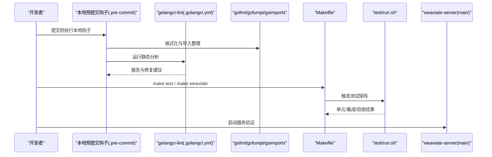
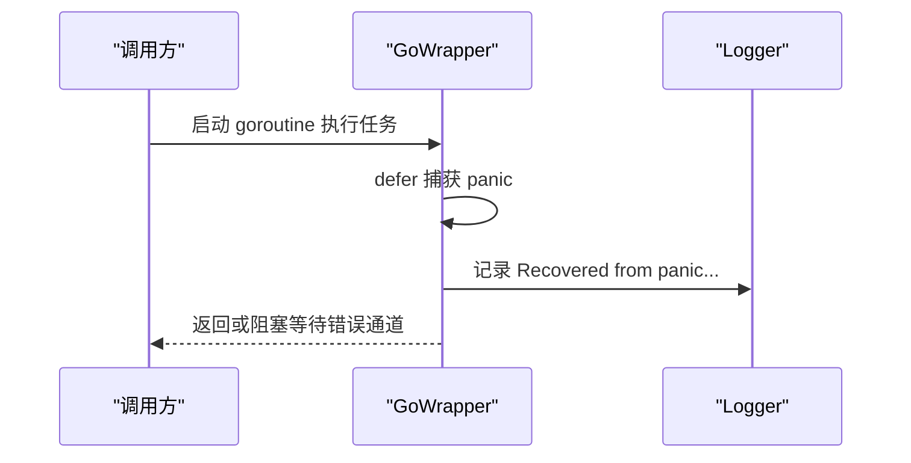
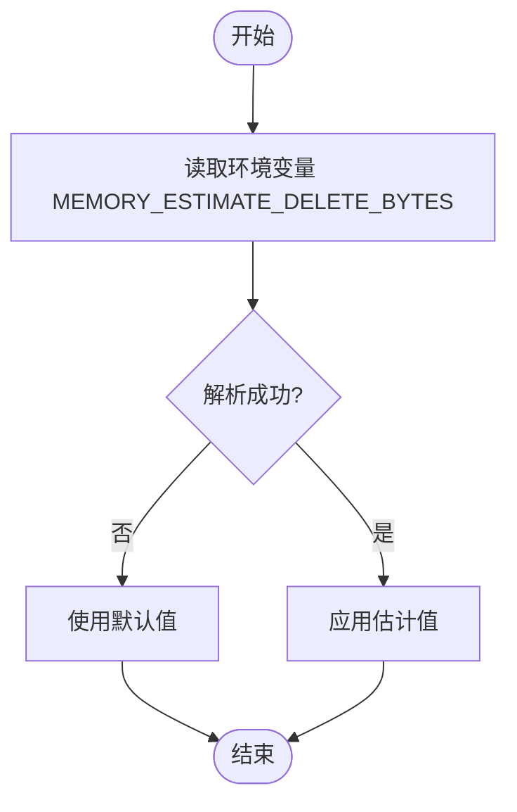
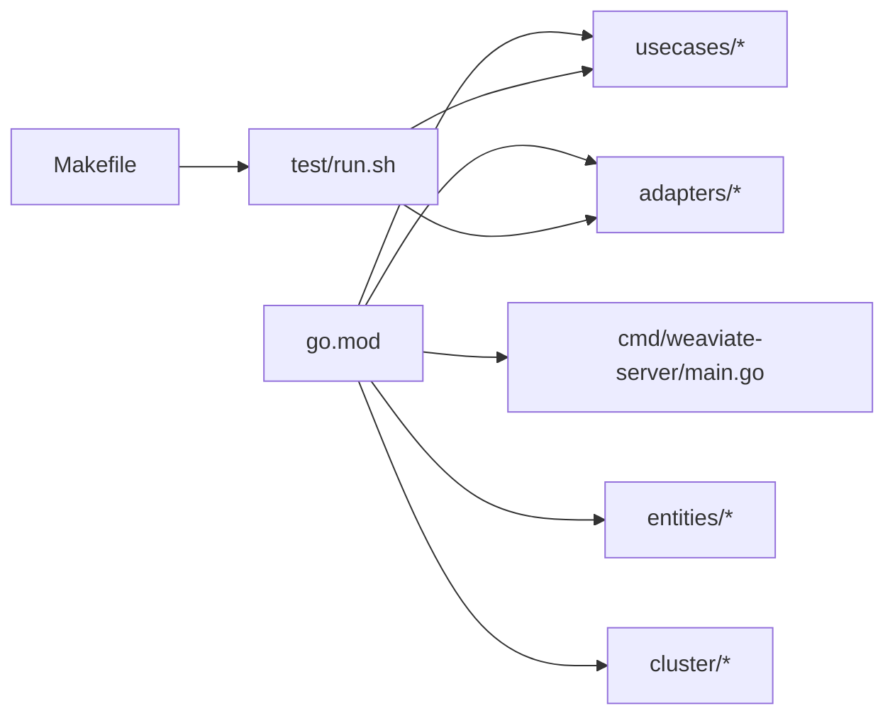

# 代码规范与风格

<cite>
**本文引用的文件**   
- [.golangci.yml](file://.golangci.yml)
- [.pre-commit-config.yaml](file://.pre-commit-config.yaml)
- [Makefile](file://Makefile)
- [go.mod](file://go.mod)
- [cmd/weaviate-server/main.go](file://cmd/weaviate-server/main.go)
- [tools/dev/grpc_regenerate.sh](file://tools/dev/grpc_regenerate.sh)
- [test/run.sh](file://test/run.sh)
- [entities/errors/go_wrapper_test.go](file://entities/errors/go_wrapper_test.go)
- [entities/errors/error_group_wrapper.go](file://entities/errors/error_group_wrapper.go)
- [cluster/log/logger.go](file://cluster/log/logger.go)
- [adapters/repos/db/roaringset/buf_pool.go](file://adapters/repos/db/roaringset/buf_pool.go)
- [adapters/repos/db/roaringset/buf_pool_test.go](file://adapters/repos/db/roaringset/buf_pool_test.go)
- [usecases/memwatch/monitor_test.go](file://usecases/memwatch/monitor_test.go)
- [adapters/repos/db/sorter/query_planner.go](file://adapters/repos/db/sorter/query_planner.go)
- [CONTRIBUTING.md](file://CONTRIBUTING.md)
- [CODE_OF_CONDUCT.md](file://CODE_OF_CONDUCT.md)
</cite>

## 目录
1. [引言](#引言)
2. [项目结构](#项目结构)
3. [核心组件](#核心组件)
4. [架构总览](#架构总览)
5. [详细组件分析](#详细组件分析)
6. [依赖关系分析](#依赖关系分析)
7. [性能考虑](#性能考虑)
8. [故障排查指南](#故障排查指南)
9. [结论](#结论)
10. [附录](#附录)

## 引言
本指南面向 Weaviate 项目的 Go 语言贡献者，系统性地梳理并制定统一的代码规范与风格，覆盖命名约定、函数设计、包组织、格式化与静态分析、代码审查标准、注释与错误处理、日志记录、重构与反模式、版本控制规范以及性能优化与内存管理最佳实践。目标是提升代码一致性、可读性、可维护性与运行时稳定性。

## 项目结构
Weaviate 采用多模块、分层清晰的工程组织方式：
- 入口程序位于 cmd/weaviate-server，负责启动服务与参数解析
- 核心业务逻辑分布在 usecases、adapters、entities 等目录
- 模块化能力通过 modules 目录扩展
- 测试覆盖单元、集成与验收（acceptance）三层
- 工具链与脚本集中在 tools、test、ci 等目录

图表来源
- [cmd/weaviate-server/main.go](file://cmd/weaviate-server/main.go#L30-L68)
- [Makefile](file://Makefile#L66-L70)
- [go.mod](file://go.mod#L1-L20)

章节来源
- [cmd/weaviate-server/main.go](file://cmd/weaviate-server/main.go#L30-L68)
- [Makefile](file://Makefile#L66-L70)
- [go.mod](file://go.mod#L1-L20)

## 核心组件
- 静态分析与格式化：golangci-lint、gofumpt、goimports、pre-commit 钩子
- 构建与测试：Makefile、test/run.sh
- 日志与错误处理：logrus、hclog 适配、错误聚合与恢复包装器
- 性能与内存：缓冲池、内存监控、查询成本估算

章节来源
- [.golangci.yml](file://.golangci.yml#L6-L38)
- [.pre-commit-config.yaml](file://.pre-commit-config.yaml#L1-L33)
- [Makefile](file://Makefile#L77-L82)
- [test/run.sh](file://test/run.sh#L242-L263)

## 架构总览
Weaviate 的开发与质量保障流程如下：

图表来源
- [.pre-commit-config.yaml](file://.pre-commit-config.yaml#L1-L33)
- [.golangci.yml](file://.golangci.yml#L24-L28)
- [Makefile](file://Makefile#L77-L82)
- [test/run.sh](file://test/run.sh#L128-L140)
- [cmd/weaviate-server/main.go](file://cmd/weaviate-server/main.go#L30-L68)

## 详细组件分析

### 命名约定与包组织
- 包名与目录：小写、简洁、语义明确；功能域清晰分层（usecases、adapters、entities）
- 接口与类型：接口以能力命名（如 Searcher、VectorIndex），类型首字母大写导出
- 变量与常量：遵循驼峰命名；常量使用 UPPER_SNAKE 或明确语义
- 错误变量：以 Err 前缀，如 ErrNotFound；错误字符串不以标点结尾
- 包内导出项：保持最小暴露面，优先使用内部实现细节

章节来源
- [.golangci.yml](file://.golangci.yml#L481-L482)
- [adapters/repos/db/sorter/query_planner.go](file://adapters/repos/db/sorter/query_planner.go#L77-L122)

### 函数设计与返回值
- 单一职责：每个函数聚焦一个任务
- 参数与返回：尽量减少参数个数；错误作为最后一个返回值
- 并发安全：在函数签名或注释中明确并发语义
- 资源释放：确保资源（文件、连接、通道）在函数退出路径正确释放

章节来源
- [adapters/repos/db/roaringset/buf_pool.go](file://adapters/repos/db/roaringset/buf_pool.go#L249-L274)

### 格式化与头部注释
- gofumpt：统一缩进、空行、换行与括号风格
- goimports：自动整理导入顺序与删除未用导入
- 头部注释：所有源文件需包含版权声明与联系信息头注释块

章节来源
- [.pre-commit-config.yaml](file://.pre-commit-config.yaml#L4-L8)
- [tools/dev/grpc_regenerate.sh](file://tools/dev/grpc_regenerate.sh#L42-L49)

### 静态代码分析与规则
- 启用检查：bodyclose、errorlint、exhaustive、forbidigo、gocritic、misspell、nolintlint
- 关闭检查：errcheck（部分场景下允许忽略）
- gocritic 设置：禁用全部检查后显式启用 deferInLoop（仅在特定测试中例外）
- forbidigo：禁止 print、fmt.Print*、spew.Dump 等调试输出进入提交
- 排除规则：生成文件、示例、第三方等路径与特定规则豁免

章节来源
- [.golangci.yml](file://.golangci.yml#L6-L38)
- [.golangci.yml](file://.golangci.yml#L148-L158)
- [.golangci.yml](file://.golangci.yml#L520-L522)

### 错误处理与日志记录
- 错误传播：错误必须被处理或显式忽略（带注释说明）
- 错误聚合：使用错误复合器合并多个错误，保留上下文
- 恢复与日志：goroutine 包装器在 panic 时记录堆栈并恢复，避免进程崩溃
- 日志级别：按严重程度选择 Trace/Debug/Info/Warn/Error；统一字段键（如 action）

图表来源
- [entities/errors/go_wrapper_test.go](file://entities/errors/go_wrapper_test.go#L26-L62)
- [entities/errors/error_group_wrapper.go](file://entities/errors/error_group_wrapper.go#L114-L136)
- [cluster/log/logger.go](file://cluster/log/logger.go#L104-L139)

章节来源
- [entities/errors/go_wrapper_test.go](file://entities/errors/go_wrapper_test.go#L26-L62)
- [entities/errors/error_group_wrapper.go](file://entities/errors/error_group_wrapper.go#L114-L136)
- [cluster/log/logger.go](file://cluster/log/logger.go#L104-L139)

### 注释规范
- 包注释：包首行简述用途
- 导出类型/函数：提供简洁说明与注意事项
- 复杂逻辑：在函数或方法内以“//”注释解释关键步骤
- TODO/FIXME：仅用于临时标记，需附带关联问题编号

章节来源
- [adapters/repos/db/sorter/query_planner.go](file://adapters/repos/db/sorter/query_planner.go#L77-L122)

### 代码审查标准
- 必须通过本地 pre-commit 与 golangci-lint
- 单元测试覆盖率与正确性优先
- 变更影响面清晰，必要时附变更日志与回归测试
- 提交信息包含关联 Issue 编号（如 gh-XXXX）

章节来源
- [.pre-commit-config.yaml](file://.pre-commit-config.yaml#L1-L33)
- [.golangci.yml](file://.golangci.yml#L6-L38)
- [CONTRIBUTING.md](file://CONTRIBUTING.md#L24-L25)

### 版本控制规范
- 分支策略：主干受保护，特性分支从主干切出，合并前要求审查
- 提交信息：以 gh-XXXX 开头，简明描述变更内容
- 标签：发布标签遵循语义化版本，CI 自动构建镜像

章节来源
- [CONTRIBUTING.md](file://CONTRIBUTING.md#L24-L25)

### 性能优化与内存管理
- 内存估计与限制：通过环境变量设置对象删除内存估计，动态调整内存上限
- 缓冲池：固定容量与上限的字节缓冲池，减少 GC 压力
- 查询成本估算：基于随机/顺序 I/O 与反向索引扫描的成本模型，辅助执行计划选择
- 并发与调度：合理设置 GOMAXPROCS，避免过度竞争

图表来源
- [usecases/memwatch/monitor_test.go](file://usecases/memwatch/monitor_test.go#L30-L44)

章节来源
- [adapters/repos/db/roaringset/buf_pool.go](file://adapters/repos/db/roaringset/buf_pool.go#L233-L294)
- [adapters/repos/db/roaringset/buf_pool_test.go](file://adapters/repos/db/roaringset/buf_pool_test.go#L315-L348)
- [adapters/repos/db/sorter/query_planner.go](file://adapters/repos/db/sorter/query_planner.go#L77-L122)
- [usecases/memwatch/monitor_test.go](file://usecases/memwatch/monitor_test.go#L30-L44)

### 重构指导与反模式避免
- 反模式
  - 在循环中 defer（gocritic deferInLoop）：仅在特殊测试目的时允许
  - 使用 print/spew 等调试输出：gofmt/gofumpt 会强制清理
  - 忽略错误返回：确保每个错误路径都有处理或显式注释
- 重构建议
  - 将复杂 switch 改为带注释的“显式枚举”或映射
  - 将条件表达式简化为更易读的形式（De Morgan 等价变换）
  - 将重复的嵌入字段选择器移除，减少冗余

章节来源
- [.golangci.yml](file://.golangci.yml#L23-L27)
- [.golangci.yml](file://.golangci.yml#L520-L522)
- [.golangci.yml](file://.golangci.yml#L486-L489)

## 依赖关系分析
Weaviate 使用 go.mod 管理依赖，构建与测试通过 Makefile 与 test/run.sh 统一调度。

图表来源
- [go.mod](file://go.mod#L1-L20)
- [cmd/weaviate-server/main.go](file://cmd/weaviate-server/main.go#L16-L25)
- [Makefile](file://Makefile#L77-L82)
- [test/run.sh](file://test/run.sh#L128-L140)

章节来源
- [go.mod](file://go.mod#L1-L20)
- [Makefile](file://Makefile#L77-L82)
- [test/run.sh](file://test/run.sh#L128-L140)

## 性能考虑
- 构建与运行
  - CGO_ENABLED=0，静态链接，减小二进制体积与运行时依赖
  - 使用 -tags netgo，避免 cgo 依赖
- 测试与基准
  - test/run.sh 提供多粒度测试矩阵，支持快速组与慢速组分离
  - LSMKV 接受性测试关闭 race 检测，专注性能回归
- 内存与 I/O
  - 缓冲池与内存估计降低分配与 GC 压力
  - 查询成本估算帮助选择最优执行路径

章节来源
- [Makefile](file://Makefile#L22-L37)
- [test/run.sh](file://test/run.sh#L265-L275)
- [adapters/repos/db/roaringset/buf_pool.go](file://adapters/repos/db/roaringset/buf_pool.go#L233-L294)
- [adapters/repos/db/sorter/query_planner.go](file://adapters/repos/db/sorter/query_planner.go#L77-L122)

## 故障排查指南
- 本地格式化失败
  - 执行 gofumpt -w 与 goimports -w，确保通过 pre-commit 钩子
- 静态分析报错
  - 根据 .golangci.yml 规则逐条修复；对 gocritic deferInLoop 仅在测试中允许
- 日志与错误
  - 使用 GoWrapper 捕获 panic 并记录堆栈；通过错误聚合器合并多来源错误
- 内存异常
  - 检查 MEMORY_ESTIMATE_DELETE_BYTES 环境变量；确认缓冲池上限与清理策略

章节来源
- [.pre-commit-config.yaml](file://.pre-commit-config.yaml#L4-L8)
- [.golangci.yml](file://.golangci.yml#L23-L27)
- [entities/errors/go_wrapper_test.go](file://entities/errors/go_wrapper_test.go#L26-L62)
- [usecases/memwatch/monitor_test.go](file://usecases/memwatch/monitor_test.go#L30-L44)

## 结论
本指南将 Weaviate 现有的工具链与最佳实践标准化为统一规范，覆盖从格式化、静态分析到测试、日志、性能与内存管理的全流程。遵循本指南有助于提升代码质量与团队协作效率，确保系统在高并发与大规模数据场景下的稳定性与可维护性。

## 附录
- 提交信息格式：gh-XXXX 简要描述
- 代码审查清单
  - 本地 pre-commit 与 golangci-lint 通过
  - 单元测试与相关集成测试通过
  - 变更影响范围说明与回归测试建议
  - 日志与错误处理完整

章节来源
- [CONTRIBUTING.md](file://CONTRIBUTING.md#L24-L25)
- [CODE_OF_CONDUCT.md](file://CODE_OF_CONDUCT.md#L1-L78)