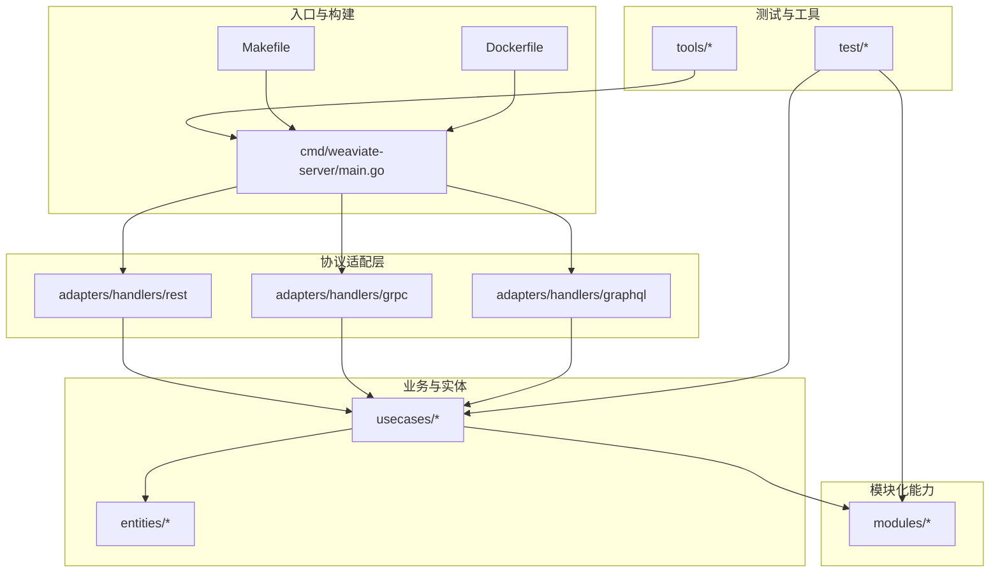
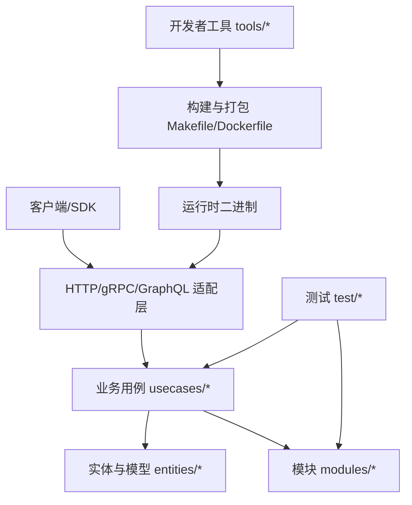
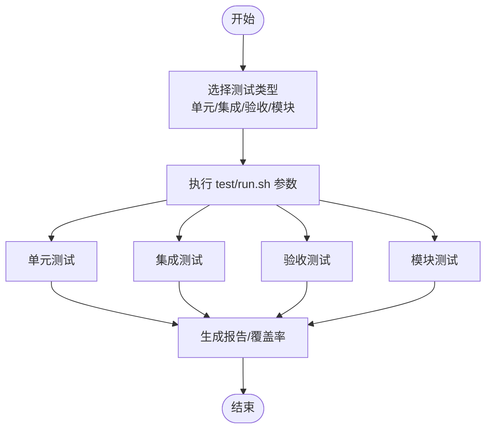
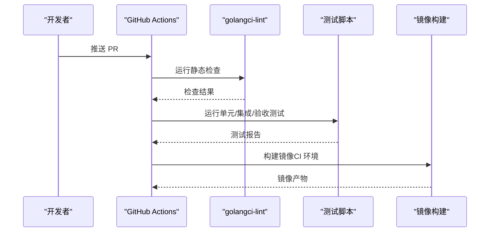
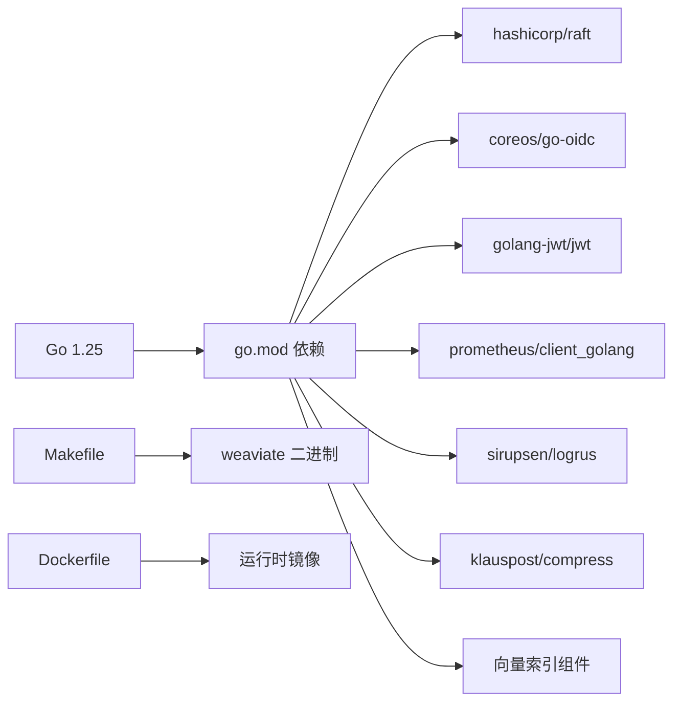

# 开发指南

<cite>
**本文引用的文件**
- [README.md](file://README.md)
- [CONTRIBUTING.md](file://CONTRIBUTING.md)
- [CODE_OF_CONDUCT.md](file://CODE_OF_CONDUCT.md)
- [go.mod](file://go.mod)
- [Makefile](file://Makefile)
- [.golangci.yml](file://.golangci.yml)
- [.pre-commit-config.yaml](file://.pre-commit-config.yaml)
- [test/README.md](file://test/README.md)
- [Dockerfile](file://Dockerfile)
- [.github/PULL_REQUEST_TEMPLATE.md](file://.github/PULL_REQUEST_TEMPLATE.md)
- [.github/workflows/pull_requests.yaml](file://.github/workflows/pull_requests.yaml)
- [.github/workflows/release.yaml](file://.github/workflows/release.yaml)
- [cmd/weaviate-server/main.go](file://cmd/weaviate-server/main.go)
- [tools/dev/README.md](file://tools/dev/README.md)
- [modules/](file://modules/)
</cite>

## 目录
1. [简介](#简介)
2. [项目结构](#项目结构)
3. [核心组件](#核心组件)
4. [架构总览](#架构总览)
5. [详细组件分析](#详细组件分析)
6. [依赖关系分析](#依赖关系分析)
7. [性能考虑](#性能考虑)
8. [故障排查指南](#故障排查指南)
9. [结论](#结论)
10. [附录](#附录)

## 简介
本指南面向 Weaviate 的开源贡献者与内部开发者，提供从开发环境搭建、代码规范与贡献流程、测试策略、扩展开发、调试与性能优化、到持续集成与发布的全流程技术参考。Weaviate 是一个云原生向量数据库，支持大规模语义搜索、混合检索、RAG、多租户、复制与 RBAC 等能力。仓库采用 Go 语言实现，提供 REST、gRPC 与 GraphQL 接口，并通过模块化架构支持多种向量化与生成式能力。

## 项目结构
仓库采用分层与特性混合的组织方式：
- 根目录包含入口二进制、构建脚本、CI/CD 工作流、许可证与贡献说明等
- cmd/weaviate-server 提供主程序入口
- adapters/handlers 提供 REST、gRPC、GraphQL 等协议适配层
- usecases 与 entities 实现业务用例与实体模型
- modules 目录提供可插拔的模块（如 text2vec、generative、rerank 等）
- test 与 tools 提供测试框架与开发辅助工具
- docker-compose 与 Dockerfile 提供容器化运行与本地开发环境

图表来源
- [Makefile](file://Makefile#L66-L70)
- [Dockerfile](file://Dockerfile#L30-L37)
- [cmd/weaviate-server/main.go](file://cmd/weaviate-server/main.go)

章节来源
- [README.md](file://README.md#L1-L181)
- [Makefile](file://Makefile#L1-L113)
- [Dockerfile](file://Dockerfile#L1-L57)

## 核心组件
- 主程序入口：cmd/weaviate-server/main.go
- 构建与镜像：Makefile、Dockerfile
- 协议适配：REST、gRPC、GraphQL
- 业务用例：usecases/*
- 实体模型：entities/*
- 模块化能力：modules/*
- 测试与工具：test/*、tools/*

章节来源
- [cmd/weaviate-server/main.go](file://cmd/weaviate-server/main.go)
- [Makefile](file://Makefile#L66-L70)
- [Dockerfile](file://Dockerfile#L30-L37)

## 架构总览
Weaviate 的服务由单个二进制提供，通过适配层暴露 REST、gRPC 与 GraphQL 接口；业务逻辑集中在 usecases 层，数据模型与实体位于 entities；模块化能力通过 modules 目录扩展；测试与工具链贯穿全生命周期。

图表来源
- [Makefile](file://Makefile#L66-L70)
- [Dockerfile](file://Dockerfile#L50-L57)

## 详细组件分析

### 开发环境搭建
- Go 版本与依赖
  - go.mod 指定 Go 版本与依赖清单，建议使用与 go.mod 一致的版本以避免不兼容
  - 依赖管理遵循模块化原则，建议在修改依赖后运行 go mod tidy 并提交变更
- 构建与运行
  - Makefile 提供构建、测试、本地运行、镜像构建等常用目标
  - Dockerfile 定义了多阶段构建，先在 golang:1.25-alpine 构建，再拷贝至 alpine 运行时
- 本地开发与调试
  - Makefile 提供 local、local-oidc、local-rbac、debug 等目标，便于快速启动不同模式的本地实例
  - tools/dev/README.md 提供生成代码与格式化的辅助脚本使用说明

章节来源
- [go.mod](file://go.mod#L273-L274)
- [Makefile](file://Makefile#L10-L113)
- [Dockerfile](file://Dockerfile#L1-L57)
- [tools/dev/README.md](file://tools/dev/README.md#L1-L13)

### 代码规范与贡献流程
- 代码风格与静态检查
  - 使用 golangci-lint（.golangci.yml）进行静态检查，启用 bodyclose、errorlint、exhaustive、forbidigo、gocritic、misspell、nolintlint 等规则
  - pre-commit 配置包含 gofumpt、错误组检查、goroutine 与 waitgroup 检查以及 golangci-lint
- 提交与 PR 规范
  - CONTRIBUTING.md 要求 PR 必须包含测试；建议在遇到测试困难时开启 Draft PR 寻求帮助
  - PR 模板包含文档更新、混沌管道运行、测试覆盖与性能测试等检查项
- 行为准则
  - CODE_OF_CONDUCT.md 明确包容与尊重的行为标准与执行机制

章节来源
- [.golangci.yml](file://.golangci.yml#L1-L536)
- [.pre-commit-config.yaml](file://.pre-commit-config.yaml#L1-L33)
- [CONTRIBUTING.md](file://CONTRIBUTING.md#L1-L44)
- [.github/PULL_REQUEST_TEMPLATE.md](file://.github/PULL_REQUEST_TEMPLATE.md#L1-L25)
- [CODE_OF_CONDUCT.md](file://CODE_OF_CONDUCT.md#L1-L78)

### 测试要求与策略
- 测试类型与范围
  - 单元测试、集成测试与验收测试通过统一的 test/run.sh 脚本调度，支持多种组合参数
  - test/README.md 列举了可用的命令参数，如仅单元测试、仅集成测试、仅验收测试、模块测试等
- 测试执行
  - Makefile 提供 test、test-integration 目标，分别运行单元与集成测试
  - CI 工作流（pull_requests.yaml）在 PR 中触发，外部 PR 不具备推送镜像权限，但会执行大部分测试
- 模块测试
  - modules 目录下的各模块均提供独立测试，可通过 test/run.sh 的模块相关参数单独运行

图表来源
- [test/README.md](file://test/README.md#L1-L23)
- [Makefile](file://Makefile#L77-L82)
- [.github/workflows/pull_requests.yaml](file://.github/workflows/pull_requests.yaml)

章节来源
- [test/README.md](file://test/README.md#L1-L23)
- [Makefile](file://Makefile#L77-L82)
- [.github/workflows/pull_requests.yaml](file://.github/workflows/pull_requests.yaml)

### 扩展开发指南（模块与插件）
- 自定义模块开发
  - modules 目录下提供了大量示例模块（如 text2vec-*、generative-*、reranker-* 等），可作为新模块开发的模板
  - 模块通常包含配置、参数、客户端与模块入口（module.go），并在 usecases 层注册能力
- 插件与能力扩展
  - 通过模块接口与能力注册机制，可在不修改核心代码的前提下扩展向量化、生成式、重排等能力
- API 扩展
  - 新增 REST/gRPC/GraphQL 端点时，需在对应适配层添加处理器，并在 usecases 层实现业务逻辑

章节来源
- [modules/](file://modules/)

### 调试技巧与开发工具
- 本地调试
  - Makefile 的 debug 目标用于连接本地 Weaviate 服务器进行调试
  - tools/dev/README.md 提供生成代码与格式化工具的使用说明
- 性能分析
  - 可结合 pprof、fgprof 等工具进行性能剖析（fgprof 已在 go.mod 中声明）
- 监控与可观测性
  - Makefile 提供监控目标，可快速启动 Prometheus 与 Grafana 进行指标观测

章节来源
- [Makefile](file://Makefile#L99-L108)
- [tools/dev/README.md](file://tools/dev/README.md#L1-L13)
- [go.mod](file://go.mod#L82-L82)

### 持续集成与持续部署
- CI 工作流
  - pull_requests.yaml 在 PR 中触发，执行静态检查、测试与部分集成验证
  - release.yaml 负责发布流程，包含镜像构建与推送
- 构建与镜像
  - Makefile 与 Dockerfile 配合，支持多平台构建与镜像标签管理
  - CI 下使用 buildx 进行跨平台构建

图表来源
- [.github/workflows/pull_requests.yaml](file://.github/workflows/pull_requests.yaml)
- [.github/workflows/release.yaml](file://.github/workflows/release.yaml)
- [Makefile](file://Makefile#L51-L57)
- [Dockerfile](file://Dockerfile#L18-L37)

章节来源
- [.github/workflows/pull_requests.yaml](file://.github/workflows/pull_requests.yaml)
- [.github/workflows/release.yaml](file://.github/workflows/release.yaml)
- [Makefile](file://Makefile#L51-L57)
- [Dockerfile](file://Dockerfile#L18-L37)

## 依赖关系分析
- 语言与工具链
  - Go 1.25，CGO 默认关闭（CGO_ENABLED=0），链接器参数包含 -s -w 与静态链接
- 外部依赖
  - 包含分布式一致性（raft）、认证授权（oidc、jwt、casbin）、监控（prometheus）、日志（logrus）、压缩（compress）、向量索引（hnsw、flat）等广泛生态库
- 构建与测试
  - Makefile 统一管理构建标志、测试目标与镜像构建
  - Dockerfile 将构建产物复制到精简运行时镜像，确保体积与安全

图表来源
- [go.mod](file://go.mod#L3-L106)
- [Makefile](file://Makefile#L26-L37)
- [Dockerfile](file://Dockerfile#L50-L57)

章节来源
- [go.mod](file://go.mod#L1-L274)
- [Makefile](file://Makefile#L26-L37)
- [Dockerfile](file://Dockerfile#L50-L57)

## 性能考虑
- 构建优化
  - 使用 -s -w 减小二进制体积，静态链接提升可移植性
  - CGO 关闭以简化部署与减少运行时开销
- 索引与存储
  - 向量索引（hnsw、flat）与 LSMKV 存储路径在模块与 usecases 中实现，建议根据数据规模与查询特征选择合适配置
- 监控与剖析
  - 结合 Prometheus 指标与 pprof/fgprof 进行热点定位与内存分析
- 测试与基准
  - test/README.md 提供多种测试组合，建议在引入性能相关改动时增加基准测试与回归测试

章节来源
- [Makefile](file://Makefile#L26-L37)
- [go.mod](file://go.mod#L82-L82)
- [test/README.md](file://test/README.md#L1-L23)

## 故障排查指南
- 常见问题定位
  - 使用 Makefile 的 local、local-oidc、local-rbac、debug 目标快速复现问题场景
  - 通过 pre-commit 与 golangci-lint 在本地尽早发现风格与潜在问题
- 日志与指标
  - 使用 Makefile 的 monitoring 目标启动监控栈，观察关键指标变化
- 测试失败
  - 使用 test/run.sh 的具体参数缩小问题范围，优先运行最小可复现集
- 依赖冲突
  - 更新 go.mod 后执行 go mod tidy 并重新构建，确保依赖一致性

章节来源
- [Makefile](file://Makefile#L90-L108)
- [.pre-commit-config.yaml](file://.pre-commit-config.yaml#L1-L33)
- [.golangci.yml](file://.golangci.yml#L1-L536)
- [test/README.md](file://test/README.md#L1-L23)

## 结论
本指南从环境搭建、代码规范、测试策略、扩展开发、调试与性能优化到 CI/CD 发布，为 Weaviate 的贡献者与开发者提供了系统性的技术参考。建议在提交变更前完成本地测试与静态检查，并在 PR 中明确测试覆盖与性能影响，以保证代码质量与系统稳定性。

## 附录
- 新贡献者入门建议
  - 从 README 的快速入门与 CONTRIBUTING 的贡献指南入手，选择带 good-first-issue 标签的任务
  - 使用 Makefile 的 local/local-oidc/local-rbac 目标快速上手本地开发
  - 遇到问题及时在社区渠道寻求帮助
- 导师制度
  - 贡献指南建议在不确定时主动询问团队成员，获得指导与反馈

章节来源
- [README.md](file://README.md#L172-L177)
- [CONTRIBUTING.md](file://CONTRIBUTING.md#L6-L13)