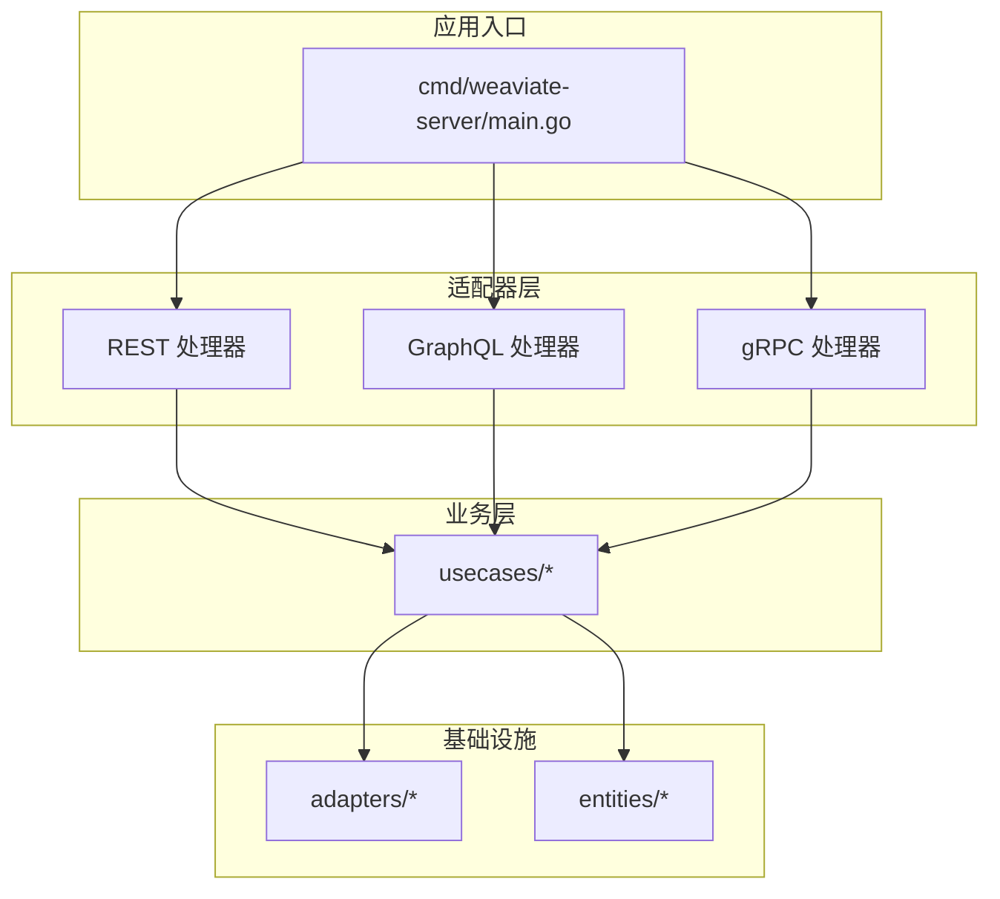
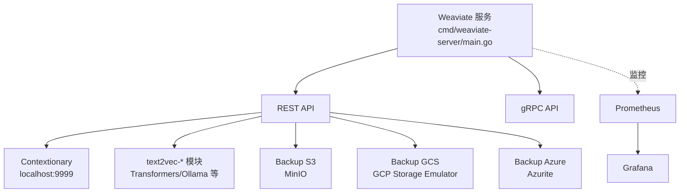
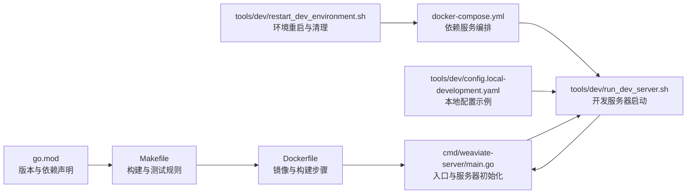

# 开发环境搭建

<cite>
**本文引用的文件**
- [go.mod](file://go.mod)
- [README.md](file://README.md)
- [Dockerfile](file://Dockerfile)
- [docker-compose.yml](file://docker-compose.yml)
- [cmd/weaviate-server/main.go](file://cmd/weaviate-server/main.go)
- [.golangci.yml](file://.golangci.yml)
- [Makefile](file://Makefile)
- [tools/dev/run_dev_server.sh](file://tools/dev/run_dev_server.sh)
- [tools/dev/restart_dev_environment.sh](file://tools/dev/restart_dev_environment.sh)
- [tools/dev/config.local-development.yaml](file://tools/dev/config.local-development.yaml)
- [tools/dev/grpc_regenerate.sh](file://tools/dev/grpc_regenerate.sh)
- [.pre-commit-config.yaml](file://.pre-commit-config.yaml)
- [CONTRIBUTING.md](file://CONTRIBUTING.md)
</cite>

## 目录
1. [简介](#简介)
2. [项目结构](#项目结构)
3. [核心组件](#核心组件)
4. [架构总览](#架构总览)
5. [详细组件分析](#详细组件分析)
6. [依赖关系分析](#依赖关系分析)
7. [性能考虑](#性能考虑)
8. [故障排除指南](#故障排除指南)
9. [结论](#结论)
10. [附录](#附录)

## 简介
本指南面向 Weaviate 核心开发者，提供从零开始搭建 Go 1.25 开发环境的完整流程，覆盖版本要求、GOPATH 与环境变量、依赖安装、开发工具链、Docker 与 Docker Compose 使用、开发服务器启动/停止与调试、跨平台兼容性（尤其是 Windows 注意事项），以及常见问题排查。

## 项目结构
Weaviate 采用模块化与分层架构，核心入口位于命令行子项目，REST/GraphQL/gRPC 处理器位于适配器层，业务逻辑分布在 usecases 包，持久化与向量索引等基础设施位于 adapters 与 entities。开发脚本集中在 tools/dev，便于一键启动本地开发环境与监控组件。

图表来源
- [cmd/weaviate-server/main.go](file://cmd/weaviate-server/main.go#L30-L67)

章节来源
- [README.md](file://README.md#L1-L181)

## 核心组件
- Go 版本与模块：项目明确要求 Go 1.25，并通过 go.mod 声明模块与依赖。
- 开发服务器入口：cmd/weaviate-server/main.go 负责加载 Swagger 规范、初始化 REST 服务器并解析命令行参数。
- 开发脚本：tools/dev/run_dev_server.sh 提供多种本地开发配置（匿名访问、OIDC、RBAC、模块组合等），restart_dev_environment.sh 用于一键拉起依赖服务（Prometheus/Grafana、Keycloak、各向量化/推理服务等）。
- 构建与测试：Makefile 定义了二进制构建、交叉编译、测试与镜像打包规则；.golangci.yml 配置静态检查；.pre-commit-config.yaml 集成代码格式化与 Lint。
- Docker 与 Compose：Dockerfile 定义开发镜像与产物构建；docker-compose.yml 提供本地开发所需的外部依赖服务。

章节来源
- [go.mod](file://go.mod#L273-L274)
- [cmd/weaviate-server/main.go](file://cmd/weaviate-server/main.go#L30-L67)
- [Makefile](file://Makefile#L10-L37)
- [.golangci.yml](file://.golangci.yml#L1-L536)
- [.pre-commit-config.yaml](file://.pre-commit-config.yaml#L1-L33)
- [Dockerfile](file://Dockerfile#L1-L57)
- [docker-compose.yml](file://docker-compose.yml#L1-L140)
- [tools/dev/run_dev_server.sh](file://tools/dev/run_dev_server.sh#L1-L800)
- [tools/dev/restart_dev_environment.sh](file://tools/dev/restart_dev_environment.sh#L1-L124)

## 架构总览
下图展示本地开发环境的典型拓扑：Weaviate 服务通过 REST/gRPC 对外提供 API，依赖上下文词典、监控（Prometheus/Grafana）、认证（Keycloak）以及各类向量化/推理服务（Transformers、Ollama、MinIO 等）。开发脚本负责编排这些服务与 Weaviate 本身。

图表来源
- [docker-compose.yml](file://docker-compose.yml#L12-L139)
- [tools/dev/run_dev_server.sh](file://tools/dev/run_dev_server.sh#L223-L244)

章节来源
- [docker-compose.yml](file://docker-compose.yml#L1-L140)
- [tools/dev/run_dev_server.sh](file://tools/dev/run_dev_server.sh#L1-L800)

## 详细组件分析

### Go 1.25 环境配置
- 版本要求：go.mod 明确 go 1.25。
- GOPATH 与工作区：建议使用 Go Modules（默认启用），无需手动设置 GOPATH；如需自定义，确保 GOPATH 不与模块路径冲突。
- 环境变量：
  - GO111MODULE=on（Dockerfile 中已设置）
  - CGO_ENABLED=0（Makefile 默认禁用 CGO，以获得更稳定的静态链接二进制）
  - LOG_LEVEL、LOG_FORMAT、PROMETHEUS_MONITORING_ENABLED 等由开发脚本注入，便于调试与观测。

章节来源
- [go.mod](file://go.mod#L273-L274)
- [Dockerfile](file://Dockerfile#L9-L10)
- [Makefile](file://Makefile#L22-L23)
- [tools/dev/run_dev_server.sh](file://tools/dev/run_dev_server.sh#L8-L25)

### 依赖安装与本地管理
- go mod 下载：Dockerfile 在构建基础镜像阶段执行 go mod download；本地开发同样建议使用 go mod tidy 与 go mod download。
- 本地依赖：仓库包含 vendor 目录（见 go.mod），可通过 go mod vendor 或直接使用模块缓存。
- 依赖更新：建议在变更后运行 go mod tidy 并提交 go.mod/go.sum。

章节来源
- [Dockerfile](file://Dockerfile#L12-L13)
- [go.mod](file://go.mod#L1-L274)

### 开发工具链配置
- 代码格式化与 Lint：
  - gofumpt：.pre-commit-config.yaml 与 .golangci.yml 均启用，保证一致性。
  - golangci-lint：.pre-commit-config.yaml 集成，建议在本地安装并启用 pre-commit。
- gRPC 协议生成：tools/dev/grpc_regenerate.sh 自动安装 protoc 与插件，生成协议桩代码并格式化。
- Mock 生成：Makefile 提供 mockery 命令，一键生成测试替身。

章节来源
- [.pre-commit-config.yaml](file://.pre-commit-config.yaml#L1-L33)
- [.golangci.yml](file://.golangci.yml#L527-L536)
- [tools/dev/grpc_regenerate.sh](file://tools/dev/grpc_regenerate.sh#L1-L60)
- [Makefile](file://Makefile#L105-L108)

### Docker 与 Docker Compose 使用
- 开发镜像：Dockerfile 定义开发镜像，先下载依赖再构建二进制，最终以 Alpine 运行 Weaviate 服务。
- 本地依赖服务：docker-compose.yml 提供 Prometheus/Grafana、Keycloak、Contextionary、各类向量化/推理服务、MinIO、GCS/Azure 备份模拟器等。
- 一键启动：tools/dev/restart_dev_environment.sh 可根据参数选择启动所需服务，并清理历史持久化数据。

章节来源
- [Dockerfile](file://Dockerfile#L1-L57)
- [docker-compose.yml](file://docker-compose.yml#L1-L140)
- [tools/dev/restart_dev_environment.sh](file://tools/dev/restart_dev_environment.sh#L1-L124)

### 开发服务器启动与停止
- 启动方式：
  - 单节点本地开发：make local 或 ./tools/dev/run_dev_server.sh local-development
  - OIDC/RBAC 场景：./tools/dev/run_dev_server.sh local-single-node-rbac 或 local-wcs-oidc-and-apikey
  - 调试模式：make debug 或 ./tools/dev/run_dev_server.sh debug（使用 Delve）
- 停止与清理：
  - 使用 tools/dev/restart_dev_environment.sh 清理 data/* 与备份目录后重启服务。
  - 或直接 docker compose down 移除容器与网络。

章节来源
- [Makefile](file://Makefile#L90-L101)
- [tools/dev/run_dev_server.sh](file://tools/dev/run_dev_server.sh#L52-L74)
- [tools/dev/restart_dev_environment.sh](file://tools/dev/restart_dev_environment.sh#L74-L79)

### 跨平台兼容性（Windows 注意事项）
- 团队主要使用 Linux 与 macOS（含 arm64），Windows 开发可能遇到未预期问题。
- 建议优先使用 WSL2 或 Linux 虚拟机进行开发，避免文件权限、路径分隔符与可执行权限差异带来的问题。

章节来源
- [CONTRIBUTING.md](file://CONTRIBUTING.md#L15-L16)

### 热重载与调试模式
- 热重载：仓库未提供内置热重载机制；建议通过修改代码后重新构建并重启服务，或在 IDE 中配置外部运行/调试任务。
- 调试：使用 Delve（dlv）在本地启动调试模式，脚本会自动传入 --host/--port 等参数。

章节来源
- [tools/dev/run_dev_server.sh](file://tools/dev/run_dev_server.sh#L39-L50)

## 依赖关系分析
下图展示关键文件之间的依赖关系，帮助理解开发流程中的调用链与配置注入点。

图表来源
- [go.mod](file://go.mod#L1-L274)
- [Makefile](file://Makefile#L1-L113)
- [Dockerfile](file://Dockerfile#L1-L57)
- [docker-compose.yml](file://docker-compose.yml#L1-L140)
- [tools/dev/run_dev_server.sh](file://tools/dev/run_dev_server.sh#L1-L800)
- [tools/dev/restart_dev_environment.sh](file://tools/dev/restart_dev_environment.sh#L1-L124)
- [tools/dev/config.local-development.yaml](file://tools/dev/config.local-development.yaml#L1-L31)
- [cmd/weaviate-server/main.go](file://cmd/weaviate-server/main.go#L30-L67)

章节来源
- [go.mod](file://go.mod#L1-L274)
- [Makefile](file://Makefile#L1-L113)
- [Dockerfile](file://Dockerfile#L1-L57)
- [docker-compose.yml](file://docker-compose.yml#L1-L140)
- [tools/dev/run_dev_server.sh](file://tools/dev/run_dev_server.sh#L1-L800)
- [tools/dev/restart_dev_environment.sh](file://tools/dev/restart_dev_environment.sh#L1-L124)
- [tools/dev/config.local-development.yaml](file://tools/dev/config.local-development.yaml#L1-L31)
- [cmd/weaviate-server/main.go](file://cmd/weaviate-server/main.go#L30-L67)

## 性能考虑
- 构建优化：Makefile 默认 CGO_ENABLED=0，便于静态链接与跨平台分发；如需性能分析，可使用调试构建（-gcflags "all=-N -l"）。
- 监控：Prometheus/Grafana 已在 docker-compose 中提供，建议在本地开发时开启指标采集以观察延迟与吞吐。
- 磁盘与向量：本地开发建议使用 SSD，合理设置向量维度与索引参数，避免过大的持久化数据导致启动缓慢。

## 故障排除指南
- 依赖下载失败
  - 症状：go mod download 报错或超时
  - 处理：检查网络与代理；必要时使用国内镜像源或离线缓存
- 服务端口冲突
  - 症状：Weaviate 或依赖服务无法启动
  - 处理：修改 docker-compose.yml 或脚本中的端口映射；确认宿主机端口可用
- 权限与路径问题（尤其 Windows）
  - 症状：容器无法写入卷或脚本不可执行
  - 处理：使用 WSL2；确保文件权限正确；避免在 Windows 上直接运行 Unix 可执行脚本
- 调试器连接失败
  - 症状：dlv 无法 attach
  - 处理：确认 Delve 已安装；使用 ./tools/dev/run_dev_server.sh debug 启动；检查防火墙与端口
- gRPC 协议生成失败
  - 症状：protoc 编译错误或插件缺失
  - 处理：执行 tools/dev/grpc_regenerate.sh，确保 buf、protoc 与插件已安装

章节来源
- [tools/dev/grpc_regenerate.sh](file://tools/dev/grpc_regenerate.sh#L16-L23)
- [tools/dev/run_dev_server.sh](file://tools/dev/run_dev_server.sh#L39-L50)
- [docker-compose.yml](file://docker-compose.yml#L1-L140)

## 结论
通过以上步骤，开发者可以在本地快速搭建 Weaviate 的 Go 1.25 开发环境，借助 Docker Compose 一键拉起依赖服务，使用 Makefile 与脚本完成构建、测试与调试。建议在 Linux/macOS 上进行开发以获得最佳兼容性，并配合 pre-commit 与 Lint 工具保持代码质量。

## 附录
- 常用命令速查
  - 构建：make weaviate / make weaviate-debug
  - 测试：make test / make test-integration
  - 启动本地单节点：make local
  - 启动调试：make debug
  - 启动监控：make monitoring
  - 一键拉起依赖服务：./tools/dev/restart_dev_environment.sh
  - 生成 gRPC 协议桩：./tools/dev/grpc_regenerate.sh

章节来源
- [Makefile](file://Makefile#L63-L113)
- [tools/dev/restart_dev_environment.sh](file://tools/dev/restart_dev_environment.sh#L1-L124)
- [tools/dev/grpc_regenerate.sh](file://tools/dev/grpc_regenerate.sh#L1-L60)