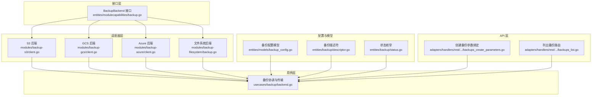
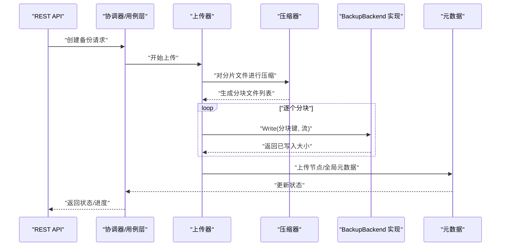
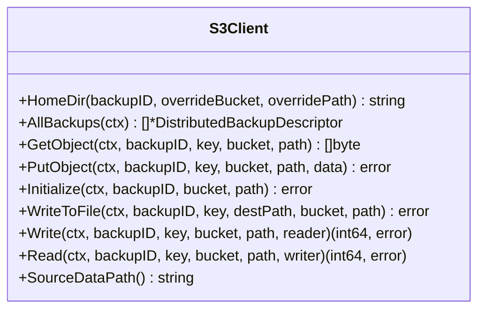
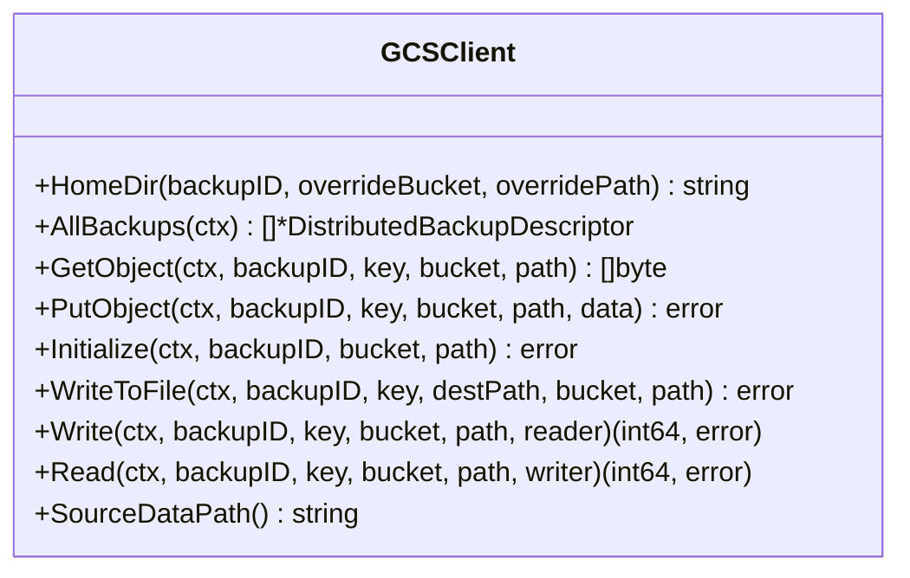
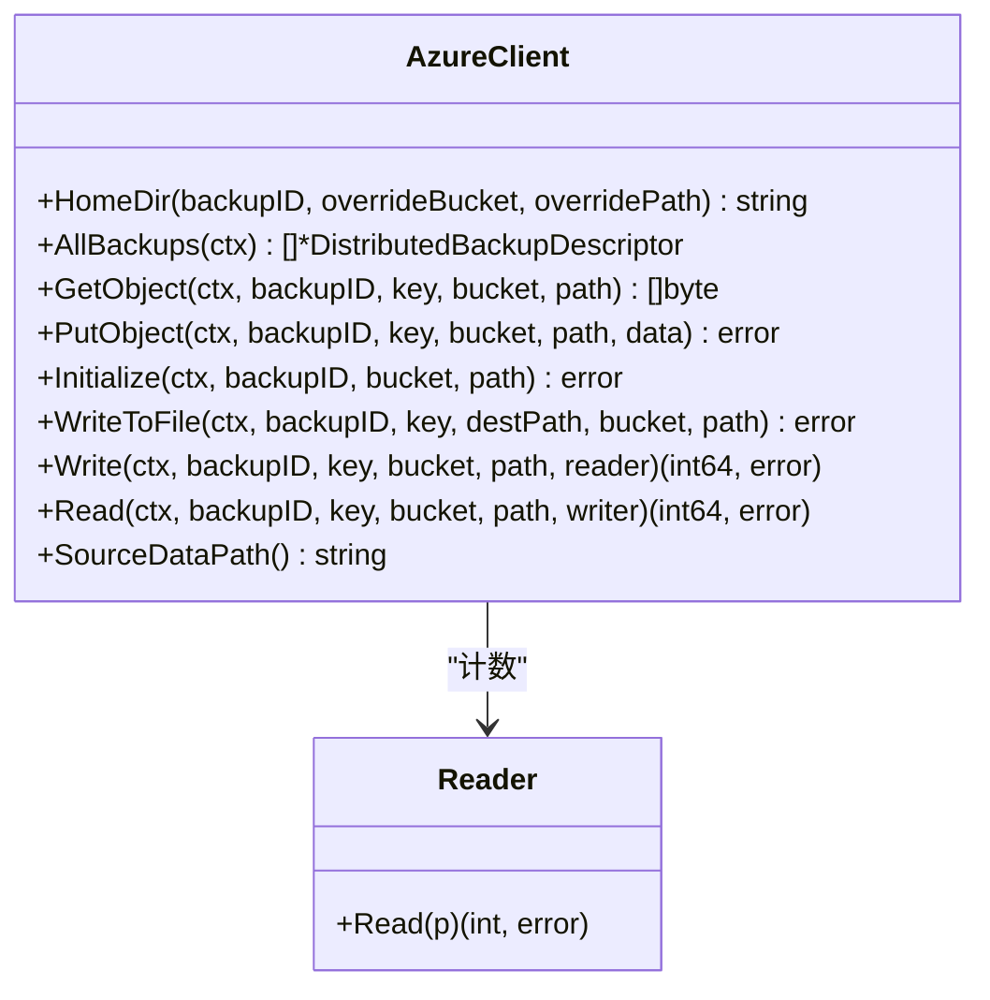
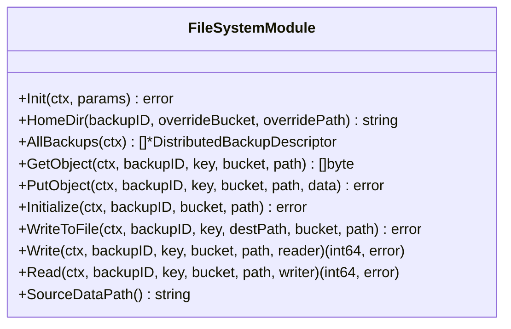
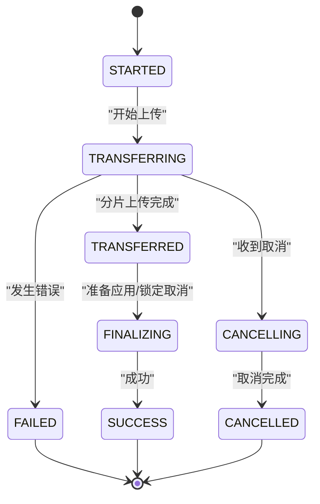
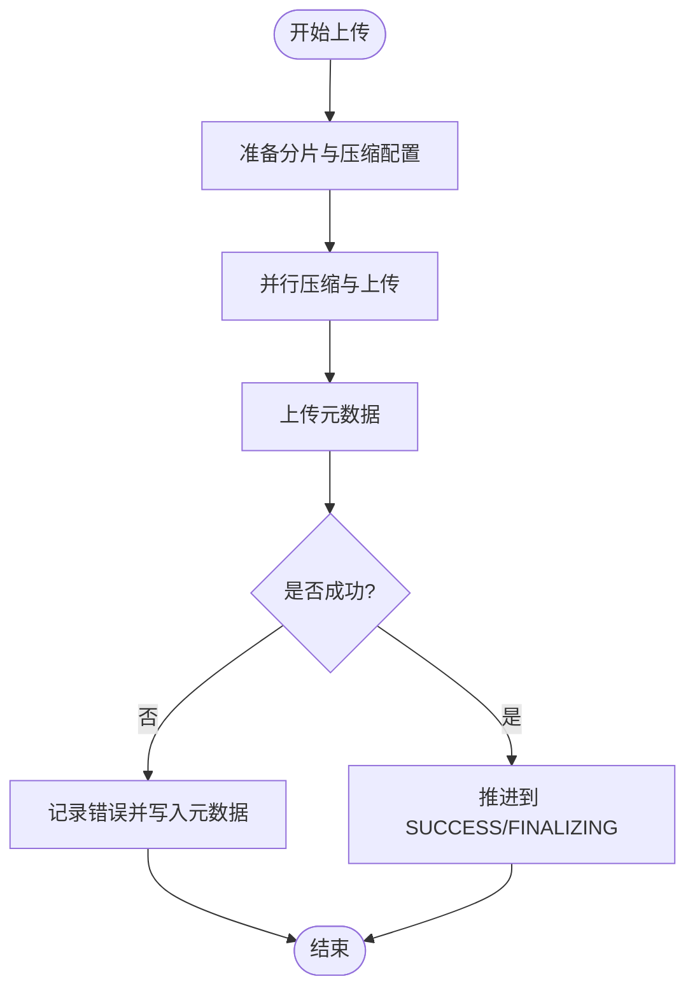
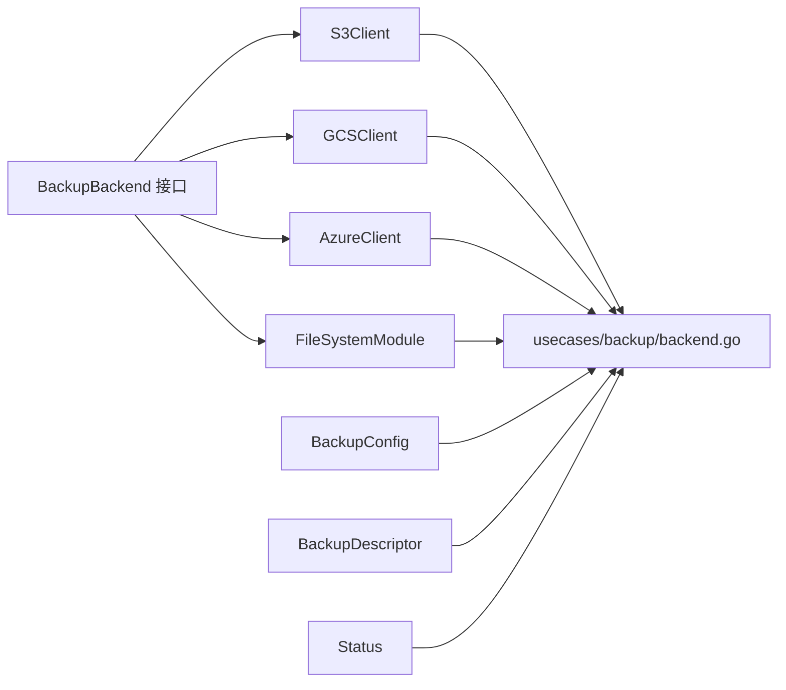

# 备份存储扩展开发

<cite>
**本文档引用的文件**
- [entities/modulecapabilities/backup.go](file://entities/modulecapabilities/backup.go)
- [modules/backup-s3/module.go](file://modules/backup-s3/module.go)
- [modules/backup-s3/client.go](file://modules/backup-s3/client.go)
- [modules/backup-gcs/module.go](file://modules/backup-gcs/module.go)
- [modules/backup-gcs/client.go](file://modules/backup-gcs/client.go)
- [modules/backup-azure/module.go](file://modules/backup-azure/module.go)
- [modules/backup-azure/client.go](file://modules/backup-azure/client.go)
- [modules/backup-filesystem/module.go](file://modules/backup-filesystem/module.go)
- [modules/backup-filesystem/backup.go](file://modules/backup-filesystem/backup.go)
- [usecases/backup/backend.go](file://usecases/backup/backend.go)
- [entities/backup/descriptor.go](file://entities/backup/descriptor.go)
- [entities/backup/status.go](file://entities/backup/status.go)
- [entities/models/backup_config.go](file://entities/models/backup_config.go)
- [adapters/handlers/rest/operations/backups/backups_create_parameters.go](file://adapters/handlers/rest/operations/backups/backups_create_parameters.go)
- [adapters/handlers/rest/operations/backups/backups_list.go](file://adapters/handlers/rest/operations/backups/backups_list.go)
</cite>

## 目录
1. [简介](#简介)
2. [项目结构](#项目结构)
3. [核心组件](#核心组件)
4. [架构总览](#架构总览)
5. [详细组件分析](#详细组件分析)
6. [依赖关系分析](#依赖关系分析)
7. [性能考虑](#性能考虑)
8. [故障排除指南](#故障排除指南)
9. [结论](#结论)
10. [附录](#附录)

## 简介
本指南面向希望为 Weaviate 开发自定义备份存储扩展的开发者，系统讲解 Backup 模块接口的实现方法、配置管理、备份流程细节（数据传输、进度跟踪、错误恢复），并提供 AWS S3、Google Cloud Storage、Azure Blob Storage、本地文件系统等后端的完整实现参考路径。同时覆盖性能优化策略（并行上传、断点续传、压缩算法）与安全考虑（数据加密、访问控制、审计日志）。

## 项目结构
Weaviate 的备份子系统由以下层次组成：
- 接口层：定义 BackupBackend 接口，统一抽象 PutObject、GetObject、Write、Read、WriteToFile、Initialize 等能力
- 适配器层：各云厂商与本地文件系统的具体实现（S3/GCS/Azure/FileSystem）
- 用例层：备份协调、分片压缩、并行上传、元数据管理、状态机与错误处理
- 配置与模型：备份配置模型、描述符模型、状态枚举
- API 层：REST 参数绑定与路由

**图表来源**
- [entities/modulecapabilities/backup.go](file://entities/modulecapabilities/backup.go#L21-L54)
- [modules/backup-s3/client.go](file://modules/backup-s3/client.go#L101-L168)
- [modules/backup-gcs/client.go](file://modules/backup-gcs/client.go#L124-L173)
- [modules/backup-azure/client.go](file://modules/backup-azure/client.go#L113-L165)
- [modules/backup-filesystem/backup.go](file://modules/backup-filesystem/backup.go#L27-L153)
- [usecases/backup/backend.go](file://usecases/backup/backend.go#L174-L311)
- [entities/models/backup_config.go](file://entities/models/backup_config.go#L29-L54)
- [entities/backup/descriptor.go](file://entities/backup/descriptor.go#L316-L339)
- [entities/backup/status.go](file://entities/backup/status.go#L14-L25)
- [adapters/handlers/rest/operations/backups/backups_create_parameters.go](file://adapters/handlers/rest/operations/backups/backups_create_parameters.go#L46-L88)
- [adapters/handlers/rest/operations/backups/backups_list.go](file://adapters/handlers/rest/operations/backups/backups_list.go#L45-L84)

**章节来源**
- [entities/modulecapabilities/backup.go](file://entities/modulecapabilities/backup.go#L21-L54)
- [usecases/backup/backend.go](file://usecases/backup/backend.go#L174-L311)

## 核心组件
- BackupBackend 接口：定义备份后端必须实现的方法集合，包括对象读写、初始化校验、源数据路径、目录定位等
- 各后端实现：S3、GCS、Azure、FileSystem 分别封装各自 SDK 并实现 BackupBackend
- 用例层协调器：负责分片压缩、并行上传、元数据持久化、状态机推进与错误恢复
- 描述符与状态：分布式/节点级备份描述符、状态枚举，用于跨节点协调与恢复
- 配置模型：备份配置（CPU 百分比、压缩级别、端点、路径等）

关键接口方法说明（来自接口定义）：
- PutObject：向指定键写入字节数据
- GetObject：按备份 ID 与键读取对象内容
- Write：从流读取并写入对象（支持分块/多部分上传）
- Read：将对象读取到写入器
- WriteToFile：下载对象到本地文件
- Initialize：初始化并验证写入权限
- HomeDir：返回该备份在后端的根路径表示
- AllBackups：列举所有备份元数据（仅全局元数据文件）
- SourceDataPath：返回本地数据路径

**章节来源**
- [entities/modulecapabilities/backup.go](file://entities/modulecapabilities/backup.go#L21-L54)
- [entities/backup/descriptor.go](file://entities/backup/descriptor.go#L36-L50)
- [entities/backup/status.go](file://entities/backup/status.go#L14-L25)
- [entities/models/backup_config.go](file://entities/models/backup_config.go#L29-L54)

## 架构总览
备份流程分为“创建”和“恢复”两大阶段，均通过 BackupBackend 抽象进行数据传输，并由用例层协调器管理压缩、分片、并行度与状态。

**图表来源**
- [usecases/backup/backend.go](file://usecases/backup/backend.go#L207-L311)
- [usecases/backup/backend.go](file://usecases/backup/backend.go#L327-L439)
- [usecases/backup/backend.go](file://usecases/backup/backend.go#L447-L504)

**章节来源**
- [usecases/backup/backend.go](file://usecases/backup/backend.go#L174-L311)

## 详细组件分析

### BackupBackend 接口与实现要点
- PutObject：适用于小对象或元数据写入；需设置合适的 Content-Type、MD5 校验与最小分块大小（S3）
- GetObject：返回字节切片，注意 NotFound 与 Context 过期错误类型转换
- Write/Read：支持流式上传/下载，适合大文件；Azure 在缺少返回值时通过包装 Reader 计数
- WriteToFile：直接落盘，避免内存拷贝；需确保目标目录存在
- Initialize：执行一次写入与删除以验证权限
- HomeDir/AllBackups：用于 UI/CLI 列表与定位备份根路径
- SourceDataPath：返回本地数据目录，用于计算预压缩大小与临时目录

**章节来源**
- [entities/modulecapabilities/backup.go](file://entities/modulecapabilities/backup.go#L21-L54)

### AWS S3 后端实现
- 初始化：支持环境变量 AWS_REGION、AWS_ACCESS_KEY_ID、AWS_SECRET_ACCESS_KEY、AWS_DEFAULT_REGION；可使用 IAM 或静态凭据
- 路径组织：通过 makeObjectName 组合 BackupPath 与备份 ID；支持 overrideBucket 与 overridePath
- 上传：PutObject 使用最小分块大小与 MD5 校验；Write 使用多部分上传
- 下载：GetObject 返回字节；WriteToFile 使用 FGetObject；Read 使用 DownloadStream
- 元数据：AllBackups 通过 ListObjects 遍历并过滤全局元数据文件
- 指标：监控模块记录 BackupStoreDataTransferred 与 BackupRestoreDataTransferred

**图表来源**
- [modules/backup-s3/client.go](file://modules/backup-s3/client.go#L101-L168)
- [modules/backup-s3/client.go](file://modules/backup-s3/client.go#L170-L253)
- [modules/backup-s3/client.go](file://modules/backup-s3/client.go#L276-L340)
- [modules/backup-s3/client.go](file://modules/backup-s3/client.go#L342-L380)

**章节来源**
- [modules/backup-s3/module.go](file://modules/backup-s3/module.go#L50-L108)
- [modules/backup-s3/client.go](file://modules/backup-s3/client.go#L51-L94)

### Google Cloud Storage 后端实现
- 初始化：支持默认凭据与无认证模式；设置重试策略与错误函数
- 路径组织：makeObjectName 支持 overridePath 与 BackupPath 前缀
- 上传/下载：PutObject/NewWriter 写入；Write 使用 NewWriter；WriteToFile 使用 NewReader；Read 使用 NewReader
- 元数据：AllBackups 使用 Objects 迭代器匹配全局元数据文件
- 错误处理：区分对象不存在与内部错误，返回 NotFound/ErrInternal

**图表来源**
- [modules/backup-gcs/client.go](file://modules/backup-gcs/client.go#L124-L173)
- [modules/backup-gcs/client.go](file://modules/backup-gcs/client.go#L200-L252)
- [modules/backup-gcs/client.go](file://modules/backup-gcs/client.go#L274-L360)
- [modules/backup-gcs/client.go](file://modules/backup-gcs/client.go#L362-L398)

**章节来源**
- [modules/backup-gcs/module.go](file://modules/backup-gcs/module.go#L74-L111)
- [modules/backup-gcs/client.go](file://modules/backup-gcs/client.go#L45-L93)

### Azure Blob Storage 后端实现
- 初始化：支持连接字符串、共享密钥、无凭据三种方式；可配置重试策略
- 上传/下载：UploadStream/DownloadStream；Write/Read 对应流式操作
- 分块与并发：getBlockSize/getConcurrency 支持从上下文或环境变量读取
- 元数据：AllBackups 使用 ListBlobsFlatPager 遍历并过滤全局元数据文件
- 错误处理：基于 BlobError 类型判断 NotFound

**图表来源**
- [modules/backup-azure/client.go](file://modules/backup-azure/client.go#L113-L165)
- [modules/backup-azure/client.go](file://modules/backup-azure/client.go#L167-L224)
- [modules/backup-azure/client.go](file://modules/backup-azure/client.go#L246-L338)
- [modules/backup-azure/client.go](file://modules/backup-azure/client.go#L340-L365)
- [modules/backup-azure/client.go](file://modules/backup-azure/client.go#L371-L383)

**章节来源**
- [modules/backup-azure/module.go](file://modules/backup-azure/module.go#L74-L111)
- [modules/backup-azure/client.go](file://modules/backup-azure/client.go#L49-L111)

### 本地文件系统后端实现
- 初始化：校验绝对路径、创建备份根目录
- 路径解析：getObjectPath 校验文件存在性并返回绝对路径
- 读写：PutObject 直接 WriteFile；Write 打开文件并 Copy；Read 打开源文件并 Copy
- 下载：copyFile 封装复制逻辑；WriteToFile 直接调用
- 元数据：AllBackups 遍历备份根目录下的全局元数据文件

**图表来源**
- [modules/backup-filesystem/module.go](file://modules/backup-filesystem/module.go#L62-L126)
- [modules/backup-filesystem/backup.go](file://modules/backup-filesystem/backup.go#L27-L153)

**章节来源**
- [modules/backup-filesystem/module.go](file://modules/backup-filesystem/module.go#L62-L126)
- [modules/backup-filesystem/backup.go](file://modules/backup-filesystem/backup.go#L27-L153)

### 备份流程与状态机
- 状态枚举：STARTED、TRANSFERRING、TRANSFERRED、FINALIZING、SUCCESS、CANCELLING、CANCELLED、FAILED
- 协调器职责：分片压缩、并行上传、元数据持久化、错误恢复与取消处理
- 描述符：节点级与分布式级描述符，包含类、分片、压缩类型、预压缩大小等
- 超时与上下文：storeTimeout、metaTimeout 控制上传与元数据写入超时

**图表来源**
- [entities/backup/status.go](file://entities/backup/status.go#L14-L25)
- [usecases/backup/backend.go](file://usecases/backup/backend.go#L207-L311)

**章节来源**
- [entities/backup/status.go](file://entities/backup/status.go#L14-L25)
- [entities/backup/descriptor.go](file://entities/backup/descriptor.go#L316-L339)
- [usecases/backup/backend.go](file://usecases/backup/backend.go#L38-L48)

### 数据传输、进度跟踪与错误恢复
- 并行上传：根据分片数量与 CPU 百分比动态确定工作池大小
- 压缩与分块：按目标大小切分，先压缩再上传，记录预压缩大小
- 进度指标：通过监控模块记录传输字节数
- 错误恢复：失败时写入元数据，保留状态；取消时推进到 CANCELLED 并释放索引

**图表来源**
- [usecases/backup/backend.go](file://usecases/backup/backend.go#L327-L439)
- [usecases/backup/backend.go](file://usecases/backup/backend.go#L447-L504)

**章节来源**
- [usecases/backup/backend.go](file://usecases/backup/backend.go#L327-L439)
- [usecases/backup/backend.go](file://usecases/backup/backend.go#L447-L504)

## 依赖关系分析
- 接口与实现解耦：BackupBackend 定义接口，S3/GCS/Azure/FileSystem 各自实现
- 用例层依赖接口：uploader、fileWriter、objectStore 通过接口与具体后端交互
- 配置与模型：BackupConfig、BackupDescriptor、Status 作为跨层契约
- API 层绑定：REST 参数绑定后交由用例层处理

**图表来源**
- [entities/modulecapabilities/backup.go](file://entities/modulecapabilities/backup.go#L21-L54)
- [usecases/backup/backend.go](file://usecases/backup/backend.go#L174-L311)
- [entities/models/backup_config.go](file://entities/models/backup_config.go#L29-L54)
- [entities/backup/descriptor.go](file://entities/backup/descriptor.go#L316-L339)
- [entities/backup/status.go](file://entities/backup/status.go#L14-L25)

**章节来源**
- [entities/modulecapabilities/backup.go](file://entities/modulecapabilities/backup.go#L21-L54)
- [usecases/backup/backend.go](file://usecases/backup/backend.go#L174-L311)

## 性能考虑
- 并行上传：根据分片数量与 CPU 百分比动态调整工作池大小，避免过度并发导致资源争用
- 压缩算法：支持 gzip/zstd 等，结合压缩级别与 CPU 百分比平衡吞吐与 CPU 占用
- 分块策略：S3 使用最小分块大小与多部分上传；Azure 支持块大小与并发度配置
- 流式传输：Write/Read/WriteToFile 采用流式读写，减少内存占用
- 指标监控：记录传输字节数，便于容量规划与性能分析

**章节来源**
- [usecases/backup/backend.go](file://usecases/backup/backend.go#L364-L371)
- [usecases/backup/backend.go](file://usecases/backup/backend.go#L669-L679)
- [modules/backup-s3/client.go](file://modules/backup-s3/client.go#L37-L41)
- [modules/backup-azure/client.go](file://modules/backup-azure/client.go#L37-L40)
- [entities/models/backup_config.go](file://entities/models/backup_config.go#L37-L47)

## 故障排除指南
- 常见错误类型：
  - NotFound：对象不存在或路径不正确
  - Internal：SDK 调用异常或网络问题
  - ContextExpired：请求超时或被取消
- 排查步骤：
  - 确认后端初始化与权限（Initialize 成功）
  - 检查路径前缀（BackupPath）与 overrideBucket/overridePath
  - 查看监控指标与日志，确认传输字节数与错误码
  - 在取消场景下，确认元数据已写入并状态推进到 CANCELLED

**章节来源**
- [entities/modulecapabilities/backup.go](file://entities/modulecapabilities/backup.go#L21-L54)
- [modules/backup-s3/client.go](file://modules/backup-s3/client.go#L186-L216)
- [modules/backup-gcs/client.go](file://modules/backup-gcs/client.go#L203-L224)
- [modules/backup-azure/client.go](file://modules/backup-azure/client.go#L178-L198)
- [usecases/backup/backend.go](file://usecases/backup/backend.go#L234-L246)

## 结论
Weaviate 的备份扩展通过 BackupBackend 接口实现了对多种存储后端的一致抽象，配合用例层的并行压缩与上传、完善的元数据与状态管理，提供了高可靠、高性能的备份能力。开发者可依据本文档提供的实现参考，快速开发新的备份后端，满足不同部署场景的需求。

## 附录

### 配置管理与环境变量
- S3：BACKUP_S3_ENDPOINT、BACKUP_S3_BUCKET、BACKUP_S3_USE_SSL、BACKUP_S3_PATH、AWS_REGION、AWS_ACCESS_KEY_ID、AWS_SECRET_ACCESS_KEY、AWS_DEFAULT_REGION
- GCS：BACKUP_GCS_BUCKET、BACKUP_GCS_PATH、BACKUP_GCS_USE_AUTH（可设为 false）、GOOGLE_CLOUD_PROJECT、GCLOUD_PROJECT、GCP_PROJECT
- Azure：AZURE_STORAGE_CONNECTION_STRING、AZURE_STORAGE_ACCOUNT、AZURE_STORAGE_KEY、AZURE_BLOCK_SIZE、AZURE_CONCURRENCY
- 文件系统：BACKUP_FILESYSTEM_PATH（绝对路径）

**章节来源**
- [modules/backup-s3/module.go](file://modules/backup-s3/module.go#L25-L40)
- [modules/backup-gcs/module.go](file://modules/backup-gcs/module.go#L24-L37)
- [modules/backup-azure/module.go](file://modules/backup-azure/module.go#L24-L37)
- [modules/backup-filesystem/module.go](file://modules/backup-filesystem/module.go#L30-L34)

### API 参数与路由
- 创建备份：路径参数 backend 必填，请求体包含 BackupCreateRequest
- 列出备份：路径参数 backend，支持 order 查询参数

**章节来源**
- [adapters/handlers/rest/operations/backups/backups_create_parameters.go](file://adapters/handlers/rest/operations/backups/backups_create_parameters.go#L46-L88)
- [adapters/handlers/rest/operations/backups/backups_list.go](file://adapters/handlers/rest/operations/backups/backups_list.go#L45-L84)