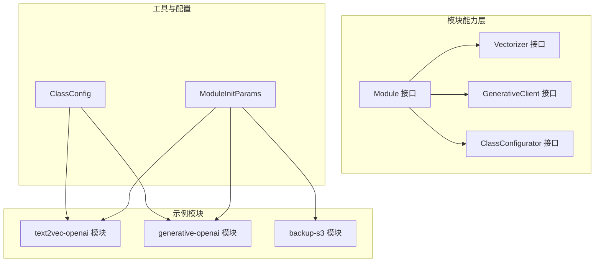
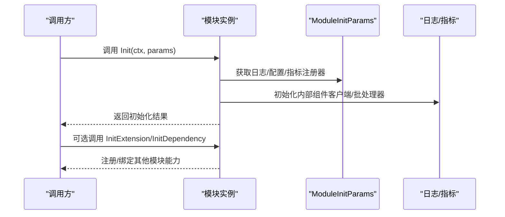
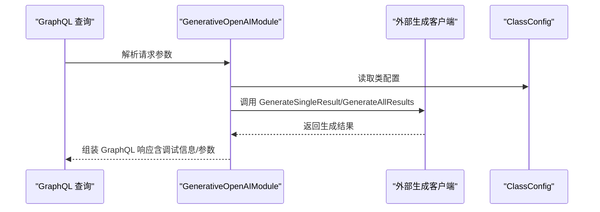
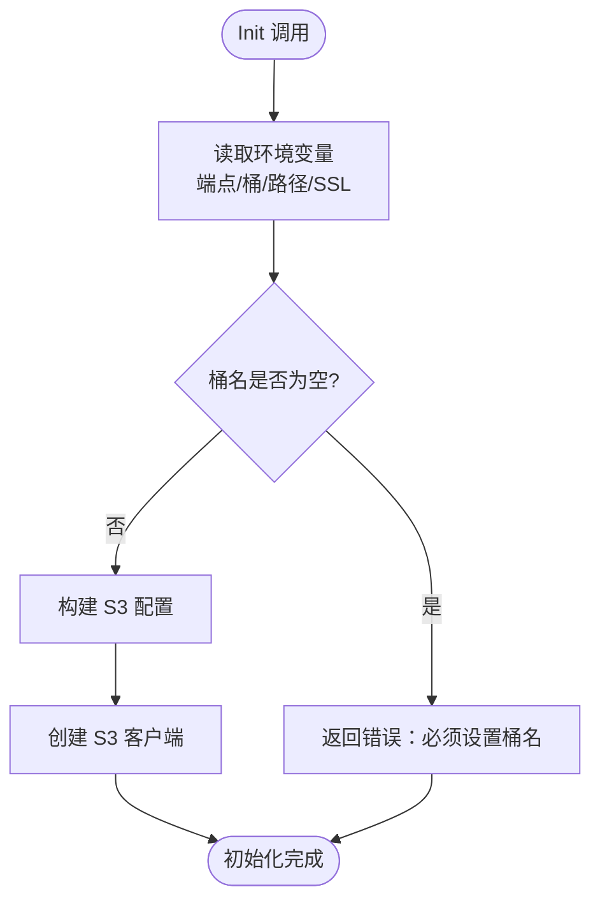
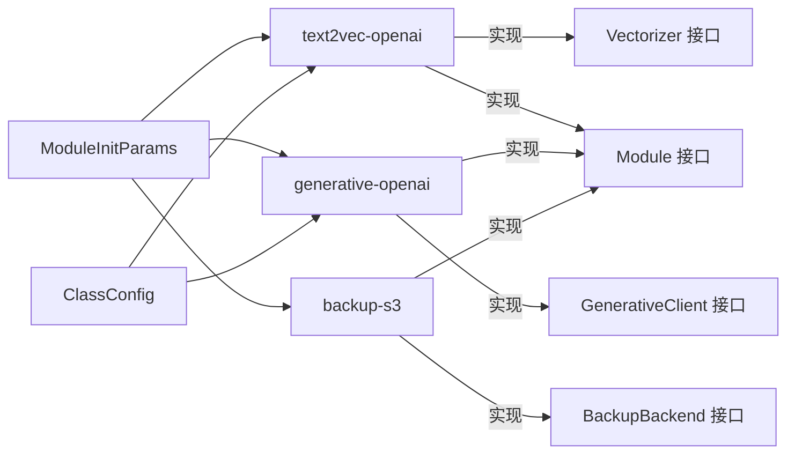

# 扩展开发

<cite>
**本文引用的文件**
- [entities/modulecapabilities/module.go](file://entities/modulecapabilities/module.go)
- [entities/modulecapabilities/vectorizer.go](file://entities/modulecapabilities/vectorizer.go)
- [entities/modulecapabilities/generative.go](file://entities/modulecapabilities/generative.go)
- [entities/modulecapabilities/config.go](file://entities/modulecapabilities/config.go)
- [entities/moduletools/init_params.go](file://entities/moduletools/init_params.go)
- [entities/moduletools/config.go](file://entities/moduletools/config.go)
- [modules/text2vec-openai/module.go](file://modules/text2vec-openai/module.go)
- [modules/text2vec-openai/config.go](file://modules/text2vec-openai/config.go)
- [modules/text2vec-openai/ent/class_settings.go](file://modules/text2vec-openai/ent/class_settings.go)
- [modules/generative-openai/module.go](file://modules/generative-openai/module.go)
- [modules/backup-s3/module.go](file://modules/backup-s3/module.go)
</cite>

## 目录
1. [简介](#简介)
2. [项目结构](#项目结构)
3. [核心组件](#核心组件)
4. [架构总览](#架构总览)
5. [详细组件分析](#详细组件分析)
6. [依赖关系分析](#依赖关系分析)
7. [性能考量](#性能考量)
8. [故障排查指南](#故障排查指南)
9. [结论](#结论)
10. [附录](#附录)

## 简介
本指南面向希望为 Weaviate 开发扩展（模块）的工程师，系统讲解模块系统的架构与扩展点，覆盖以下主题：
- 模块系统：Module、ModuleCapability、ModuleConfig 的职责与协作
- 自定义向量化器：接口实现、配置管理、批处理与性能优化
- 自定义模块：注册、生命周期、依赖注入与可选能力
- 插件最佳实践：错误处理、资源管理、并发安全
- 备份模块与存储后端扩展：以 S3 备份模块为例
- 生成式 AI 模块：API 兼容性与参数映射
- 测试与验证：方法论与建议
- 发布与版本管理：策略与注意事项

## 项目结构
Weaviate 将“模块”抽象为一组能力接口与可选扩展点，模块通过统一的初始化参数接入日志、指标、配置与存储等基础设施；具体实现位于 modules/* 子目录中，按功能域拆分（如 text2vec-*、generative-*、backup-* 等）。



图表来源
- [entities/modulecapabilities/module.go](file://entities/modulecapabilities/module.go#L45-L49)
- [entities/modulecapabilities/vectorizer.go](file://entities/modulecapabilities/vectorizer.go#L25-L35)
- [entities/modulecapabilities/generative.go](file://entities/modulecapabilities/generative.go#L48-L56)
- [entities/modulecapabilities/config.go](file://entities/modulecapabilities/config.go#L22-L48)
- [entities/moduletools/init_params.go](file://entities/moduletools/init_params.go#L21-L27)
- [entities/moduletools/config.go](file://entities/moduletools/config.go#L19-L30)
- [modules/text2vec-openai/module.go](file://modules/text2vec-openai/module.go#L62-L68)
- [modules/generative-openai/module.go](file://modules/generative-openai/module.go#L43-L49)
- [modules/backup-s3/module.go](file://modules/backup-s3/module.go#L54-L68)

章节来源
- [entities/modulecapabilities/module.go](file://entities/modulecapabilities/module.go#L24-L43)
- [entities/moduletools/init_params.go](file://entities/moduletools/init_params.go#L21-L27)
- [entities/moduletools/config.go](file://entities/moduletools/config.go#L19-L30)

## 核心组件
- Module 接口：模块名称、初始化、类型声明；支持可选关闭、HTTP 根处理器、扩展初始化、依赖初始化、别名、用量服务注入等能力接口
- ModuleType：模块类型枚举，覆盖向量化（文本/多模态/引用）、生成式、重排序、NER、问答、备份、离线/在线用量等
- Vectorizer 接口：对象/批量向量化、输入向量化、可向量化属性探测
- GenerativeClient 接口：单条/全部结果生成、请求参数提取与响应参数暴露
- ClassConfigurator 接口：类级默认值、属性级默认值、类配置校验
- ModuleInitParams：模块初始化时注入的存储、应用状态、日志、全局配置、指标注册器
- ClassConfig：模块读取类/属性配置的只读视图

章节来源
- [entities/modulecapabilities/module.go](file://entities/modulecapabilities/module.go#L24-L89)
- [entities/modulecapabilities/vectorizer.go](file://entities/modulecapabilities/vectorizer.go#L25-L53)
- [entities/modulecapabilities/generative.go](file://entities/modulecapabilities/generative.go#L48-L72)
- [entities/modulecapabilities/config.go](file://entities/modulecapabilities/config.go#L22-L73)
- [entities/moduletools/init_params.go](file://entities/moduletools/init_params.go#L21-L61)
- [entities/moduletools/config.go](file://entities/moduletools/config.go#L19-L30)

## 架构总览
Weaviate 的模块系统采用“能力接口 + 可选扩展”的设计，模块在初始化阶段接收统一的 ModuleInitParams，并根据自身能力选择实现相应接口。向量化器负责将对象或文本转换为向量；生成式模块负责根据查询/提示词生成文本；备份模块负责集群备份的持久化后端；ClassConfigurator 提供配置默认值与校验。



图表来源
- [entities/moduletools/init_params.go](file://entities/moduletools/init_params.go#L21-L61)
- [modules/text2vec-openai/module.go](file://modules/text2vec-openai/module.go#L70-L84)
- [modules/generative-openai/module.go](file://modules/generative-openai/module.go#L51-L58)

## 详细组件分析

### 向量化器开发（以 text2vec-openai 为例）
- 实现要点
  - 声明模块类型为文本/多向量之一
  - 实现 Vectorizer 接口：对象/批量向量化、输入向量化、可向量化属性探测
  - 在 Init 中完成外部客户端初始化、批处理设置、额外属性提供者注册
  - 可选：实现 ClassConfigurator 以提供类/属性默认值与校验
- 配置管理
  - 使用 ClassConfig 读取类/属性配置，结合实体层的类设置进行校验
  - 默认值与校验逻辑集中在实体层类设置中，模块侧仅负责读取与验证
- 性能优化
  - 批处理：合理设置批大小、令牌上限、最大批时长
  - 指标：对请求计数、批长度、请求大小进行埋点
  - 超时：基于全局 HTTP 客户端超时配置

```mermaid
classDiagram
class OpenAIModule {
+Name() string
+Type() ModuleType
+Init(ctx, params) error
+InitExtension(mods) error
+VectorizeObject(ctx, obj, cfg) ([]float32, Additional, error)
+VectorizeBatch(ctx, objs, skip, cfg) ([][]float32, [], map[int]error)
+VectorizeInput(ctx, text, cfg) ([]float32, error)
+VectorizableProperties(cfg) (bool, []string, error)
+MetaInfo() (map[string]interface{}, error)
+AdditionalProperties() map[string]AdditionalProperty
}
class Vectorizer {
<<interface>>
+VectorizeObject(ctx, obj, cfg) (T, Additional, error)
+VectorizeBatch(ctx, objs, skip, cfg) ([]T, [], map[int]error)
+VectorizeInput(ctx, input, cfg) (T, error)
+VectorizableProperties(cfg) (bool, []string, error)
}
OpenAIModule ..|> Vectorizer
```

图表来源
- [modules/text2vec-openai/module.go](file://modules/text2vec-openai/module.go#L52-L68)
- [entities/modulecapabilities/vectorizer.go](file://entities/modulecapabilities/vectorizer.go#L25-L35)

章节来源
- [modules/text2vec-openai/module.go](file://modules/text2vec-openai/module.go#L62-L84)
- [modules/text2vec-openai/module.go](file://modules/text2vec-openai/module.go#L128-L161)
- [modules/text2vec-openai/config.go](file://modules/text2vec-openai/config.go#L25-L47)
- [modules/text2vec-openai/ent/class_settings.go](file://modules/text2vec-openai/ent/class_settings.go#L86-L101)

### 生成式模块开发（以 generative-openai 为例）
- 实现要点
  - 声明模块类型为文本到文本生成
  - 实现 GenerativeClient 接口：单条/全部结果生成
  - 暴露 AdditionalGenerativeProperties：GraphQL 输入字段、响应参数、请求参数提取函数
  - 在 Init 中完成外部客户端初始化与参数提供者注册
- 参数映射与兼容性
  - 通过 GraphQL 输入字段函数与请求参数提取函数，将查询中的参数映射到第三方 API
  - 响应参数通过响应参数函数暴露给 GraphQL 层



图表来源
- [entities/modulecapabilities/generative.go](file://entities/modulecapabilities/generative.go#L48-L72)
- [modules/generative-openai/module.go](file://modules/generative-openai/module.go#L51-L72)

章节来源
- [modules/generative-openai/module.go](file://modules/generative-openai/module.go#L43-L76)
- [entities/modulecapabilities/generative.go](file://entities/modulecapabilities/generative.go#L22-L72)

### 备份模块与存储后端扩展（以 backup-s3 为例）
- 实现要点
  - 声明模块类型为 Backup
  - 实现 BackupBackend 能力接口（由模块能力层提供），用于备份/恢复数据的持久化
  - 在 Init 中读取环境变量（端点、桶、路径、是否启用 SSL），构造客户端并校验必要参数
  - 可选：实现 MetaInfo 暴露后端元信息
- 外部模块标识
  - IsExternal 标识该模块为外部后端，便于系统区分



图表来源
- [modules/backup-s3/module.go](file://modules/backup-s3/module.go#L70-L89)

章节来源
- [modules/backup-s3/module.go](file://modules/backup-s3/module.go#L54-L100)

### 模块注册、生命周期与依赖注入
- 注册与命名
  - 模块需实现 Name() 返回唯一名称，可选 AltNames() 提供别名
- 生命周期
  - Init(ctx, params)：一次性初始化，包含日志、指标、配置、存储提供者的注入
  - 可选：InitExtension(mods)、InitDependency(mods) 用于与其他模块建立依赖关系
  - 可选：Close() 释放资源
- 依赖注入
  - 通过 ModuleInitParams 获取存储提供者、应用状态、日志、全局配置、指标注册器
  - 类配置通过 ClassConfig 读取模块专属配置

章节来源
- [entities/modulecapabilities/module.go](file://entities/modulecapabilities/module.go#L45-L90)
- [entities/moduletools/init_params.go](file://entities/moduletools/init_params.go#L21-L61)
- [entities/moduletools/config.go](file://entities/moduletools/config.go#L19-L30)

### 配置管理与迁移
- 默认值与校验
  - ClassConfigurator 提供类级与属性级默认值；ValidateClass 对类配置进行校验
  - 类设置实体集中管理默认值、可用选项与校验规则
- 属性迁移
  - MigrateProperties 支持旧属性名到新属性名的迁移，或新增/删除默认属性

章节来源
- [entities/modulecapabilities/config.go](file://entities/modulecapabilities/config.go#L22-L73)
- [modules/text2vec-openai/config.go](file://modules/text2vec-openai/config.go#L25-L47)
- [modules/text2vec-openai/ent/class_settings.go](file://modules/text2vec-openai/ent/class_settings.go#L81-L101)

## 依赖关系分析
模块间通过能力接口解耦，模块可选择性实现多种能力；模块与外部系统（如 OpenAI、S3）通过客户端封装对接。



图表来源
- [entities/modulecapabilities/vectorizer.go](file://entities/modulecapabilities/vectorizer.go#L25-L35)
- [entities/modulecapabilities/generative.go](file://entities/modulecapabilities/generative.go#L48-L56)
- [entities/modulecapabilities/module.go](file://entities/modulecapabilities/module.go#L45-L49)
- [entities/moduletools/init_params.go](file://entities/moduletools/init_params.go#L21-L61)
- [entities/moduletools/config.go](file://entities/moduletools/config.go#L19-L30)
- [modules/backup-s3/module.go](file://modules/backup-s3/module.go#L66-L68)

## 性能考量
- 批处理优化
  - 控制批大小与令牌上限，避免第三方 API 限流或超时
  - 记录批长度与请求计数，便于容量规划与告警
- 指标埋点
  - 单次/批量请求计数、请求体大小、外部调用耗时
- 超时与重试
  - 基于全局 HTTP 客户端超时配置，合理设置模块级超时
- 并发与资源
  - 外部客户端应具备并发安全与连接池管理
  - 在 Close 中释放连接与后台任务

## 故障排查指南
- 初始化失败
  - 检查环境变量是否正确（如 OPENAI_APIKEY、AZURE_APIKEY、备份桶名等）
  - 查看日志输出与指标异常
- 向量化失败
  - 校验类配置（模型、维度、类型、版本等）是否符合第三方要求
  - 关注批处理令牌上限与对象数量
- 生成式结果异常
  - 检查 GraphQL 请求参数映射是否正确
  - 查看第三方 API 返回的调试信息与响应参数
- 备份问题
  - 确认 S3 端点、桶、路径、SSL 设置
  - 检查权限与网络连通性

章节来源
- [modules/text2vec-openai/ent/class_settings.go](file://modules/text2vec-openai/ent/class_settings.go#L167-L211)
- [modules/backup-s3/module.go](file://modules/backup-s3/module.go#L70-L89)

## 结论
Weaviate 的模块系统通过能力接口与可选扩展点，提供了清晰的扩展边界与强大的组合能力。开发者可按需实现相应接口，借助统一的初始化参数与配置视图，快速完成向量化器、生成式模块、备份后端等扩展的开发与集成。

## 附录

### 开发步骤清单
- 选择模块类型与能力接口
- 实现 Module 接口与所需能力接口
- 在 Init 中完成依赖注入与初始化
- 如需，实现 ClassConfigurator 与类设置校验
- 编写批处理与指标埋点
- 编写单元测试与集成测试
- 文档化配置项与环境变量
- 制定发布与版本管理策略

### 测试与验证方法论
- 单元测试：针对配置解析、参数映射、错误分支
- 集成测试：连接真实第三方 API 或使用模拟客户端
- 回归测试：覆盖批处理、并发、超时、限流场景
- 性能测试：不同批大小、不同输入规模下的吞吐与延迟

### 发布与版本管理策略
- 语义化版本：遵循 MAJOR.MINOR.PATCH
- 兼容性：尽量保持接口稳定，变更时提升主版本
- 分支策略：主干稳定，特性分支合并前需通过测试
- 发布制品：包含二进制、文档与示例