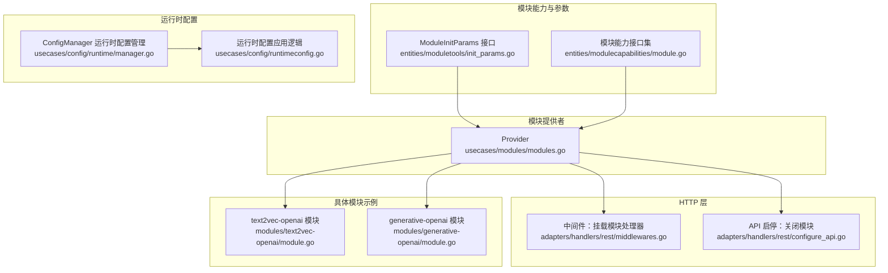
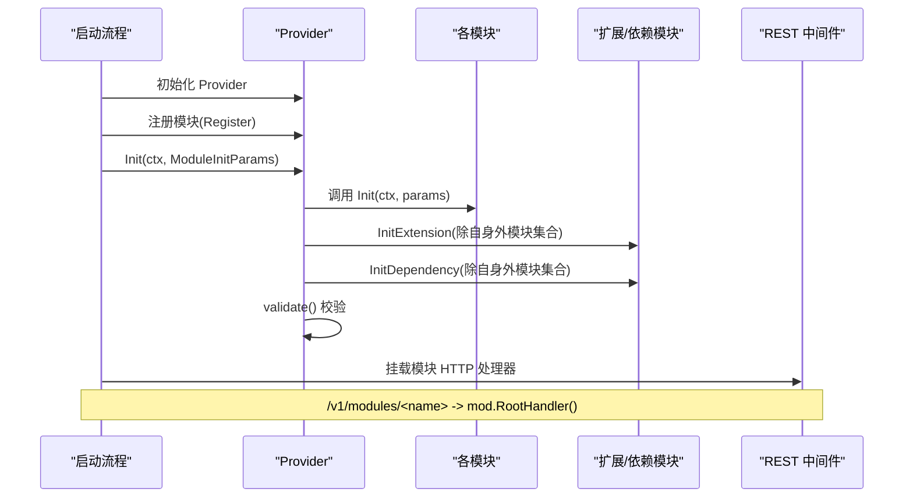
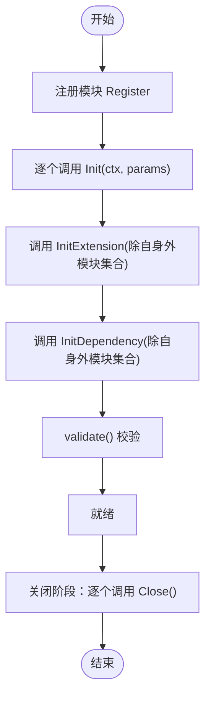
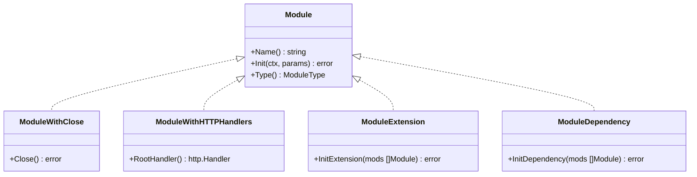
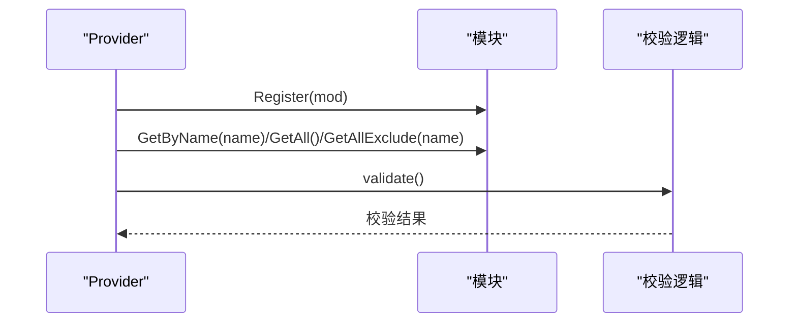
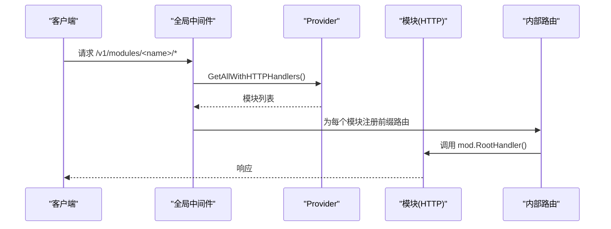
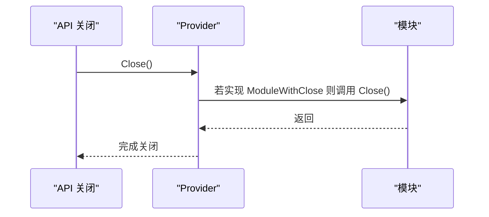
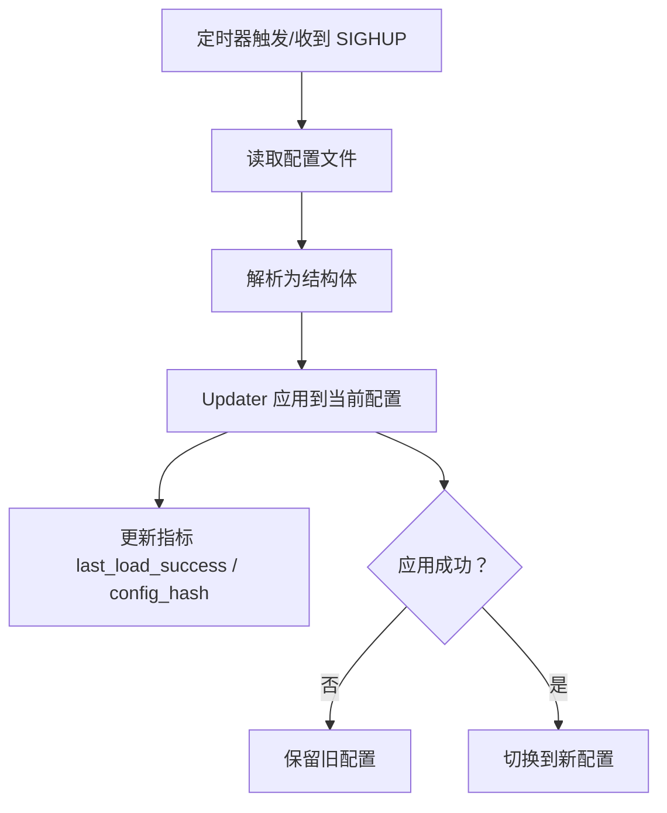
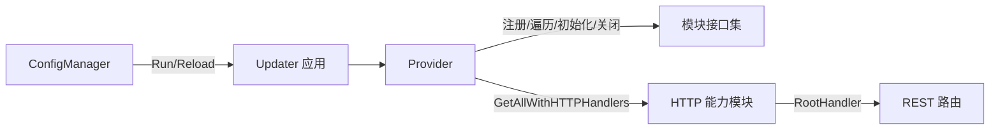

# 模块注册与生命周期管理

<cite>
**本文引用的文件**
- [entities/moduletools/init_params.go](file://entities/moduletools/init_params.go)
- [entities/modulecapabilities/module.go](file://entities/modulecapabilities/module.go)
- [usecases/modules/modules.go](file://usecases/modules/modules.go)
- [adapters/handlers/rest/middlewares.go](file://adapters/handlers/rest/middlewares.go)
- [adapters/handlers/rest/configure_api.go](file://adapters/handlers/rest/configure_api.go)
- [modules/text2vec-openai/module.go](file://modules/text2vec-openai/module.go)
- [modules/generative-openai/module.go](file://modules/generative-openai/module.go)
- [usecases/config/runtime/manager.go](file://usecases/config/runtime/manager.go)
- [usecases/config/runtimeconfig.go](file://usecases/config/runtimeconfig.go)
- [usecases/modules/module_config_init_and_validate.go](file://usecases/modules/module_config_init_and_validate.go)
- [usecases/modules/modules_test.go](file://usecases/modules/modules_test.go)
- [adapters/handlers/rest/handlers_debug.go](file://adapters/handlers/rest/handlers_debug.go)
</cite>

## 目录
1. [简介](#简介)
2. [项目结构](#项目结构)
3. [核心组件](#核心组件)
4. [架构总览](#架构总览)
5. [详细组件分析](#详细组件分析)
6. [依赖关系分析](#依赖关系分析)
7. [性能考量](#性能考量)
8. [故障排除指南](#故障排除指南)
9. [结论](#结论)
10. [附录](#附录)

## 简介
本指南围绕 Weaviate 的模块系统，系统性讲解模块注册与生命周期管理：从 ModuleInitParams 的使用与依赖注入，到模块初始化、扩展与依赖初始化、关闭与 HTTP 根处理器挂载；再到模块发现、加载与验证流程；最后覆盖热更新与动态加载（运行时配置）机制，并提供调试与故障排除方法论。文档面向不同技术背景读者，力求以循序渐进的方式呈现。

## 项目结构
Weaviate 将模块能力抽象在统一接口中，模块注册由 Provider 统一管理，REST 中间件负责将模块 HTTP 处理器挂载到统一前缀下，运行时配置通过独立的 ConfigManager 实现周期性或信号触发的热更新。



图示来源
- [entities/moduletools/init_params.go](file://entities/moduletools/init_params.go#L21-L61)
- [entities/modulecapabilities/module.go](file://entities/modulecapabilities/module.go#L45-L89)
- [usecases/modules/modules.go](file://usecases/modules/modules.go#L46-L179)
- [adapters/handlers/rest/middlewares.go](file://adapters/handlers/rest/middlewares.go#L68-L87)
- [adapters/handlers/rest/configure_api.go](file://adapters/handlers/rest/configure_api.go#L1158-L1163)
- [modules/text2vec-openai/module.go](file://modules/text2vec-openai/module.go#L70-L84)
- [modules/generative-openai/module.go](file://modules/generative-openai/module.go#L51-L58)
- [usecases/config/runtime/manager.go](file://usecases/config/runtime/manager.go#L46-L126)
- [usecases/config/runtimeconfig.go](file://usecases/config/runtimeconfig.go#L162-L225)

章节来源
- [entities/moduletools/init_params.go](file://entities/moduletools/init_params.go#L21-L61)
- [entities/modulecapabilities/module.go](file://entities/modulecapabilities/module.go#L45-L89)
- [usecases/modules/modules.go](file://usecases/modules/modules.go#L46-L179)
- [adapters/handlers/rest/middlewares.go](file://adapters/handlers/rest/middlewares.go#L68-L87)
- [adapters/handlers/rest/configure_api.go](file://adapters/handlers/rest/configure_api.go#L1158-L1163)
- [modules/text2vec-openai/module.go](file://modules/text2vec-openai/module.go#L70-L84)
- [modules/generative-openai/module.go](file://modules/generative-openai/module.go#L51-L58)
- [usecases/config/runtime/manager.go](file://usecases/config/runtime/manager.go#L46-L126)
- [usecases/config/runtimeconfig.go](file://usecases/config/runtimeconfig.go#L162-L225)

## 核心组件
- ModuleInitParams 与 InitParams：封装模块初始化所需的依赖（存储、应用状态、日志、配置、指标注册器），作为依赖注入载体。
- 模块能力接口集：Module、ModuleWithClose、ModuleWithHTTPHandlers、ModuleExtension、ModuleDependency 等，定义模块的最小能力边界与可选扩展。
- Provider：模块注册中心，负责注册、遍历、初始化、校验、关闭以及按需筛选具备特定能力的模块。
- REST 中间件：将具备 HTTP 能力的模块根处理器挂载到统一前缀路径下，便于外部访问。
- 运行时配置管理：周期性扫描与 SIGHUP 触发配置重载，支持动态值更新与钩子回调。

章节来源
- [entities/moduletools/init_params.go](file://entities/moduletools/init_params.go#L21-L61)
- [entities/modulecapabilities/module.go](file://entities/modulecapabilities/module.go#L45-L89)
- [usecases/modules/modules.go](file://usecases/modules/modules.go#L46-L179)
- [adapters/handlers/rest/middlewares.go](file://adapters/handlers/rest/middlewares.go#L68-L87)

## 架构总览
模块系统采用“能力接口 + 注册中心 + 依赖注入”的设计。Provider 在启动阶段对所有已注册模块执行三阶段初始化：基础 Init、扩展 InitExtension、依赖 InitDependency；随后进行模块一致性校验；在关闭阶段依次调用 Close。HTTP 层通过中间件将模块的 RootHandler 挂载到 /v1/modules/<name> 前缀下。运行时配置通过 ConfigManager 定期轮询或信号触发重载，应用层通过 Updater 将新配置安全地合并到当前配置。



图示来源
- [usecases/modules/modules.go](file://usecases/modules/modules.go#L138-L179)
- [adapters/handlers/rest/middlewares.go](file://adapters/handlers/rest/middlewares.go#L68-L87)

章节来源
- [usecases/modules/modules.go](file://usecases/modules/modules.go#L138-L179)
- [adapters/handlers/rest/middlewares.go](file://adapters/handlers/rest/middlewares.go#L68-L87)

## 详细组件分析

### 模块初始化流程与依赖注入（ModuleInitParams）
- 依赖注入载体：InitParams 实现 ModuleInitParams，提供获取存储提供者、应用状态、日志、全局配置、指标注册器等方法，供模块在 Init 阶段按需使用。
- 典型用法：模块在 Init 中读取配置、创建客户端、初始化内部组件，并通过 Logger 输出启动日志。

```mermaid
classDiagram
class ModuleInitParams {
+GetStorageProvider() StorageProvider
+GetAppState() interface{}
+GetLogger() FieldLogger
+GetConfig() *Config
+GetMetricsRegisterer() Registerer
}
class InitParams {
-storageProvider StorageProvider
-appState interface{}
-config *Config
-logger FieldLogger
-registerer Registerer
+GetStorageProvider() StorageProvider
+GetAppState() interface{}
+GetLogger() FieldLogger
+GetConfig() *Config
+GetMetricsRegisterer() Registerer
}
ModuleInitParams <|.. InitParams
```

图示来源
- [entities/moduletools/init_params.go](file://entities/moduletools/init_params.go#L21-L61)

章节来源
- [entities/moduletools/init_params.go](file://entities/moduletools/init_params.go#L21-L61)

### Provider 的模块生命周期管理
- 注册与发现：Register 将模块按名称登记，支持别名映射；GetByName 支持原名与别名查询。
- 初始化顺序：先逐一调用模块 Init；再对实现了 ModuleExtension 的模块调用 InitExtension；再对实现了 ModuleDependency 的模块调用 InitDependency；最后执行 validate 校验。
- 关闭：遍历已注册模块，对实现 ModuleWithClose 的模块调用 Close。
- HTTP 处理器：GetAllWithHTTPHandlers 返回具备 RootHandler 的模块集合，REST 中间件统一挂载。



图示来源
- [usecases/modules/modules.go](file://usecases/modules/modules.go#L71-L179)

章节来源
- [usecases/modules/modules.go](file://usecases/modules/modules.go#L71-L179)

### 模块接口与能力边界
- Module：必须实现 Name、Init、Type。
- ModuleWithClose：可选，用于资源清理。
- ModuleWithHTTPHandlers：可选，提供 RootHandler 以暴露 HTTP 端点。
- ModuleExtension：可选，允许模块在其他模块可用后进行二次初始化（如依赖其他模块的能力）。
- ModuleDependency：可选，允许模块声明对其他模块的依赖并在可用后完成初始化。



图示来源
- [entities/modulecapabilities/module.go](file://entities/modulecapabilities/module.go#L45-L89)

章节来源
- [entities/modulecapabilities/module.go](file://entities/modulecapabilities/module.go#L45-L89)

### 模块注册与验证机制
- 注册：Provider.Register 将模块登记到注册表，并维护别名映射。
- 获取：GetByName 支持原名与别名查询；GetAllExclude 提供除自身外的模块列表，用于扩展/依赖初始化。
- 校验：Provider.validate 扫描各模块提供的 GraphQL 参数、附加属性等，避免冲突与内部保留参数重复注册。
- 类级配置校验：module_config_init_and_validate 对类级向量化配置进行类型化校验与默认值收敛。



图示来源
- [usecases/modules/modules.go](file://usecases/modules/modules.go#L71-L179)
- [usecases/modules/module_config_init_and_validate.go](file://usecases/modules/module_config_init_and_validate.go#L271-L298)

章节来源
- [usecases/modules/modules.go](file://usecases/modules/modules.go#L71-L179)
- [usecases/modules/module_config_init_and_validate.go](file://usecases/modules/module_config_init_and_validate.go#L271-L298)

### HTTP 根处理器挂载
- 中间件 makeAddModuleHandlers 遍历具备 HTTP 能力的模块，将其 RootHandler 以 /v1/modules/<name>/ 前缀挂载到内部路由树。
- 未命中模块前缀的请求交由后续中间件处理，确保模块端点与其他 API 并存。



图示来源
- [adapters/handlers/rest/middlewares.go](file://adapters/handlers/rest/middlewares.go#L68-L87)

章节来源
- [adapters/handlers/rest/middlewares.go](file://adapters/handlers/rest/middlewares.go#L68-L87)

### 关闭流程与优雅停机
- API 关闭阶段：configure_api 在停止服务前调用 appState.Modules.Close()，确保模块资源被释放。
- 模块 Close：仅当模块实现 ModuleWithClose 时才会被调用，避免非必要开销。



图示来源
- [adapters/handlers/rest/configure_api.go](file://adapters/handlers/rest/configure_api.go#L1158-L1163)
- [usecases/modules/modules.go](file://usecases/modules/modules.go#L122-L132)

章节来源
- [adapters/handlers/rest/configure_api.go](file://adapters/handlers/rest/configure_api.go#L1158-L1163)
- [usecases/modules/modules.go](file://usecases/modules/modules.go#L122-L132)

### 自定义模块注册示例（步骤说明）
以下为注册自定义模块的完整步骤（不包含具体代码内容，仅提供路径与要点）：
- 实现模块接口：至少实现 Name、Init、Type；如需 HTTP 端点实现 RootHandler；如需扩展/依赖实现 InitExtension/InitDependency。
  - 参考路径：[modules/text2vec-openai/module.go](file://modules/text2vec-openai/module.go#L62-L84)、[modules/generative-openai/module.go](file://modules/generative-openai/module.go#L43-L58)
- 使用 ModuleInitParams：在 Init 中通过 params.GetConfig/GetLogger/GetStorageProvider 等获取所需依赖。
  - 参考路径：[entities/moduletools/init_params.go](file://entities/moduletools/init_params.go#L21-L61)
- 注册模块：在启动流程中调用 Provider.Register 注册模块。
  - 参考路径：[usecases/modules/modules.go](file://usecases/modules/modules.go#L71-L78)
- 初始化与校验：Provider.Init 会依次调用 Init、InitExtension、InitDependency，并执行 validate。
  - 参考路径：[usecases/modules/modules.go](file://usecases/modules/modules.go#L138-L179)
- 暴露 HTTP 端点：确保模块实现 ModuleWithHTTPHandlers，REST 中间件会自动挂载。
  - 参考路径：[adapters/handlers/rest/middlewares.go](file://adapters/handlers/rest/middlewares.go#L68-L87)

章节来源
- [modules/text2vec-openai/module.go](file://modules/text2vec-openai/module.go#L62-L84)
- [modules/generative-openai/module.go](file://modules/generative-openai/module.go#L43-L58)
- [entities/moduletools/init_params.go](file://entities/moduletools/init_params.go#L21-L61)
- [usecases/modules/modules.go](file://usecases/modules/modules.go#L71-L78)
- [usecases/modules/modules.go](file://usecases/modules/modules.go#L138-L179)
- [adapters/handlers/rest/middlewares.go](file://adapters/handlers/rest/middlewares.go#L68-L87)

### 模块间依赖关系管理（ModuleExtension 与 ModuleDependency）
- ModuleExtension：模块在其他模块可用后进行二次初始化，例如从其他模块获取能力（如 nearTextTransformer）。
  - 参考路径：[modules/text2vec-openai/module.go](file://modules/text2vec-openai/module.go#L86-L102)
- ModuleDependency：模块声明对其他模块的依赖，并在可用后完成初始化。
  - 参考路径：[entities/modulecapabilities/module.go](file://entities/modulecapabilities/module.go#L63-L71)
- Provider.Init 会按顺序调用 InitExtension 与 InitDependency，并在失败时返回包装后的错误信息。
  - 参考路径：[usecases/modules/modules.go](file://usecases/modules/modules.go#L150-L171)

章节来源
- [modules/text2vec-openai/module.go](file://modules/text2vec-openai/module.go#L86-L102)
- [entities/modulecapabilities/module.go](file://entities/modulecapabilities/module.go#L63-L71)
- [usecases/modules/modules.go](file://usecases/modules/modules.go#L150-L171)

### 热更新与动态加载（运行时配置）
- ConfigManager：周期性轮询配置文件，支持 SIGHUP 触发重载；若解析或应用失败则保留旧配置。
- 动态值更新：runtimeconfig 提供对多种动态值类型的更新逻辑（int、float64、bool、time.Duration、string、[]string）。
- 钩子与注册：可在启动前注册钩子与附加变量，确保模块参数在运行时可被注入与更新。
- 应用层：Updater 负责将新配置安全地合并到当前配置，同时记录 last_load_success 与 config_hash 指标。



图示来源
- [usecases/config/runtime/manager.go](file://usecases/config/runtime/manager.go#L139-L176)
- [usecases/config/runtime/manager.go](file://usecases/config/runtime/manager.go#L178-L202)
- [usecases/config/runtimeconfig.go](file://usecases/config/runtimeconfig.go#L162-L225)

章节来源
- [usecases/config/runtime/manager.go](file://usecases/config/runtime/manager.go#L139-L176)
- [usecases/config/runtime/manager.go](file://usecases/config/runtime/manager.go#L178-L202)
- [usecases/config/runtimeconfig.go](file://usecases/config/runtimeconfig.go#L162-L225)

## 依赖关系分析
- Provider 与模块：Provider 通过接口聚合模块，模块通过 InitParams 解耦外部依赖。
- REST 中间件与模块：中间件依赖 Provider 的能力集合，将模块 RootHandler 统一挂载。
- 运行时配置与模块：ConfigManager 与 Updater 通过注册钩子与附加变量，使模块参数在运行时可被更新。



图示来源
- [usecases/modules/modules.go](file://usecases/modules/modules.go#L90-L132)
- [adapters/handlers/rest/middlewares.go](file://adapters/handlers/rest/middlewares.go#L68-L87)
- [usecases/config/runtime/manager.go](file://usecases/config/runtime/manager.go#L114-L126)

章节来源
- [usecases/modules/modules.go](file://usecases/modules/modules.go#L90-L132)
- [adapters/handlers/rest/middlewares.go](file://adapters/handlers/rest/middlewares.go#L68-L87)
- [usecases/config/runtime/manager.go](file://usecases/config/runtime/manager.go#L114-L126)

## 性能考量
- 模块初始化顺序：Provider.Init 采用分阶段初始化，避免模块间相互等待导致阻塞；validate 在最后执行，减少不必要的重复校验。
- HTTP 路由挂载：中间件按需匹配前缀，避免对非模块请求的额外处理。
- 运行时配置：ConfigManager 通过哈希判断文件是否变化，避免无意义的解析与应用；指标记录有助于观测重载成功率与配置版本。
- 模块指标：模块内部可通过 GetMetricsRegisterer 注册自定义指标，便于监控与告警。

## 故障排除指南
- 启动失败定位：Provider.Init 对每个阶段的错误进行包装，包含模块索引与名称，便于快速定位问题模块。
  - 参考路径：[usecases/modules/modules.go](file://usecases/modules/modules.go#L141-L144)
- 扩展/依赖初始化失败：InitExtension 与 InitDependency 的错误同样会被包装并返回，检查模块间依赖声明与可用性。
  - 参考路径：[usecases/modules/modules.go](file://usecases/modules/modules.go#L151-L159)
- HTTP 端点不可用：确认模块实现 ModuleWithHTTPHandlers 且 RootHandler 返回有效处理器；检查中间件是否正确挂载。
  - 参考路径：[adapters/handlers/rest/middlewares.go](file://adapters/handlers/rest/middlewares.go#L68-L87)
- 关闭异常：若模块实现 Close 出错，Provider.Close 会立即返回错误，需检查模块资源释放逻辑。
  - 参考路径：[usecases/modules/modules.go](file://usecases/modules/modules.go#L122-L132)
- 运行时配置重载失败：查看 last_load_success 指标与日志，确认文件可读、格式正确、Updater 成功应用；旧配置将被保留。
  - 参考路径：[usecases/config/runtime/manager.go](file://usecases/config/runtime/manager.go#L139-L176)
- 调试辅助：REST 调试处理器可用于采集运行时信息（内存、GC、堆栈等），结合日志与指标进行综合诊断。
  - 参考路径：[adapters/handlers/rest/handlers_debug.go](file://adapters/handlers/rest/handlers_debug.go#L42-L43)

章节来源
- [usecases/modules/modules.go](file://usecases/modules/modules.go#L141-L144)
- [usecases/modules/modules.go](file://usecases/modules/modules.go#L151-L159)
- [adapters/handlers/rest/middlewares.go](file://adapters/handlers/rest/middlewares.go#L68-L87)
- [usecases/modules/modules.go](file://usecases/modules/modules.go#L122-L132)
- [usecases/config/runtime/manager.go](file://usecases/config/runtime/manager.go#L139-L176)
- [adapters/handlers/rest/handlers_debug.go](file://adapters/handlers/rest/handlers_debug.go#L42-L43)

## 结论
Weaviate 的模块系统通过清晰的能力接口、统一的注册中心与依赖注入机制，实现了模块的标准化注册、初始化、扩展与关闭；配合 REST 中间件与运行时配置管理，既保证了启动期的稳定性，也提供了运行期的可观测与可调整能力。遵循本文的流程与最佳实践，可高效、安全地集成与维护自定义模块。

## 附录
- 单元测试参考：modules_test 中展示了模块参数注册与冲突检测的行为，可作为自定义模块开发的参考与回归测试样例。
  - 参考路径：[usecases/modules/modules_test.go](file://usecases/modules/modules_test.go#L161-L220)