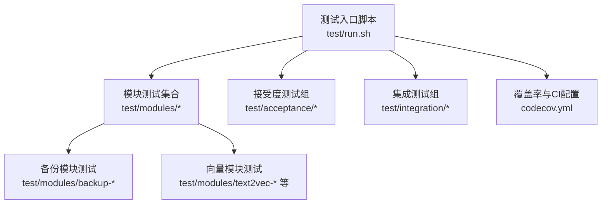
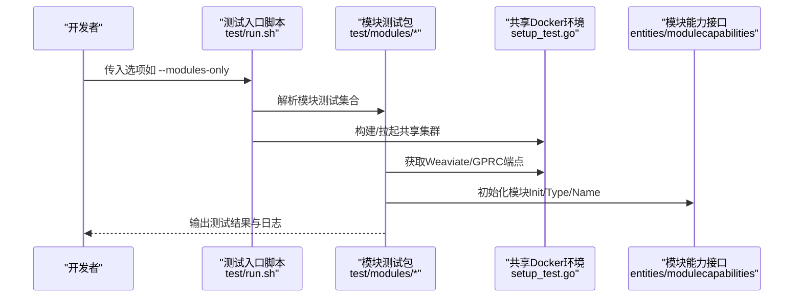
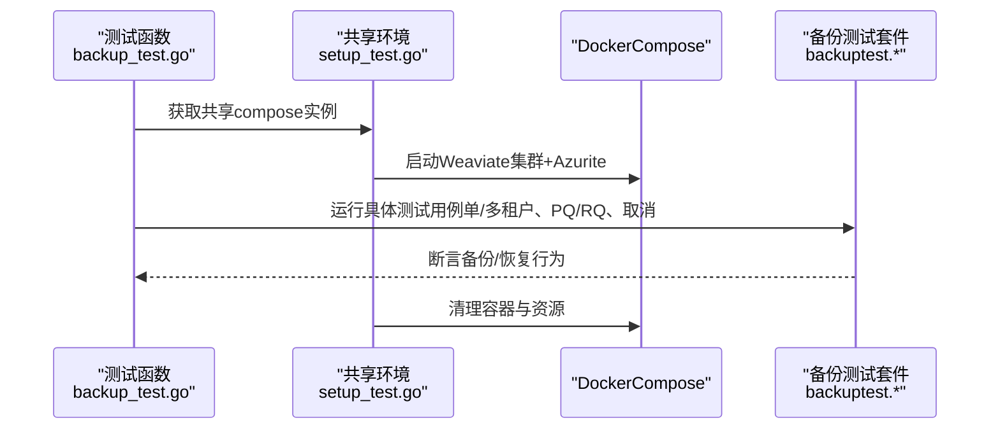
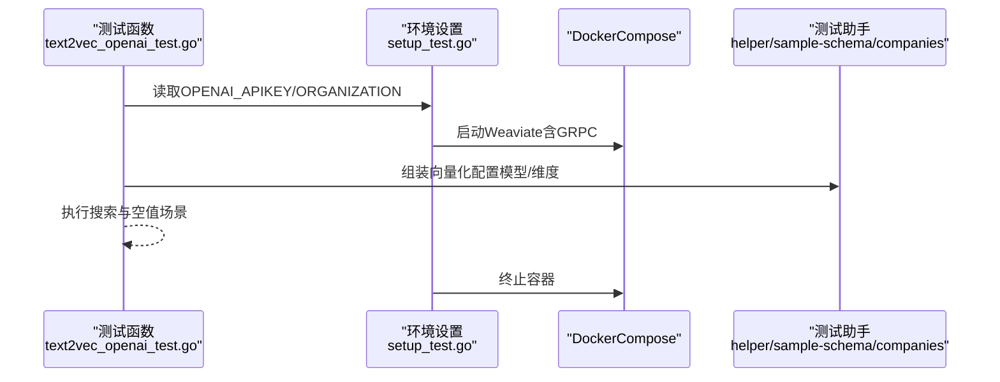
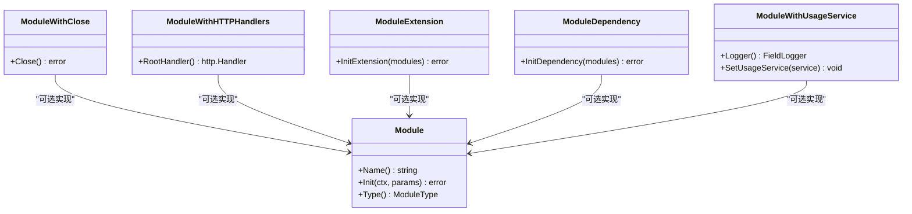
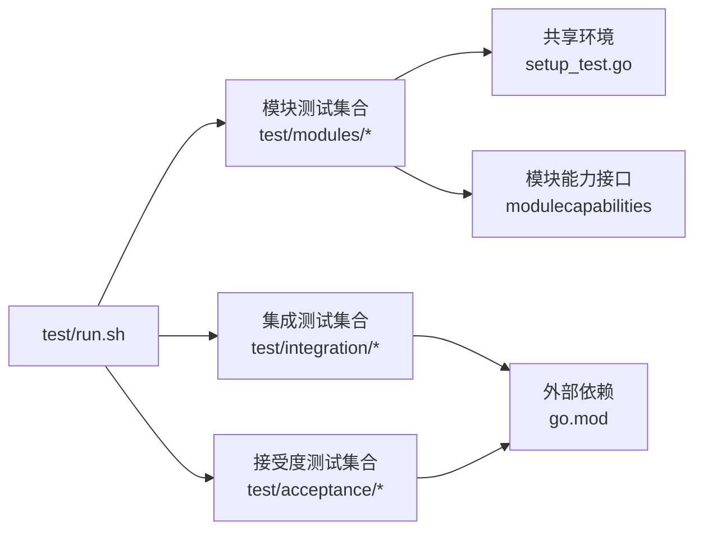

# 模块测试与验证

<cite>
**本文引用的文件**
- [test/README.md](file://test/README.md)
- [test/run.sh](file://test/run.sh)
- [go.mod](file://go.mod)
- [entities/modulecapabilities/module.go](file://entities/modulecapabilities/module.go)
- [test/modules/backup-azure/backup_test.go](file://test/modules/backup-azure/backup_test.go)
- [test/modules/backup-azure/setup_test.go](file://test/modules/backup-azure/setup_test.go)
- [test/modules/text2vec-openai/text2vec_openai_test.go](file://test/modules/text2vec-openai/text2vec_openai_test.go)
- [test/modules/text2vec-openai/setup_test.go](file://test/modules/text2vec-openai/setup_test.go)
- [codecov.yml](file://codecov.yml)
</cite>

## 目录
1. [引言](#引言)
2. [项目结构](#项目结构)
3. [核心组件](#核心组件)
4. [架构总览](#架构总览)
5. [详细组件分析](#详细组件分析)
6. [依赖关系分析](#依赖关系分析)
7. [性能考量](#性能考量)
8. [故障排查指南](#故障排查指南)
9. [结论](#结论)
10. [附录](#附录)

## 引言
本指南面向 Weaviate 模块开发者与测试工程师，系统化地阐述模块测试与验证的最佳实践，覆盖单元测试、集成测试与端到端（E2E）测试的编写方法；详述测试环境搭建（含模拟依赖、测试数据与配置管理）；给出模块功能验证策略（向量化准确性、性能基准、并发安全）；提供可直接参考的测试脚手架与执行命令，并补充覆盖率与持续集成配置建议、兼容性测试方法以及调试与诊断流程。

## 项目结构
Weaviate 的测试体系由统一的测试入口脚本驱动，按测试类型分层组织：单元测试、集成测试、接受度（E2E）测试、模块专用测试等。模块测试主要位于 test/modules 下，按模块命名子目录，包含测试用例与共享的环境设置。

图示来源
- [test/run.sh](file://test/run.sh#L1-L214)
- [test/README.md](file://test/README.md#L1-L23)

章节来源
- [test/README.md](file://test/README.md#L1-L23)
- [test/run.sh](file://test/run.sh#L1-L214)

## 核心组件
- 测试入口与任务编排：通过命令行参数选择运行范围，支持快速接受度测试分组、模块专项测试、备份/离线模块专项等。
- 模块接口抽象：模块能力以接口形式定义，便于在测试中注入依赖或替换实现。
- 测试辅助与共享环境：模块测试常复用共享的 Docker 集群，减少启动成本并保证一致性。

章节来源
- [test/run.sh](file://test/run.sh#L42-L112)
- [entities/modulecapabilities/module.go](file://entities/modulecapabilities/module.go#L45-L90)

## 架构总览
下图展示了模块测试从入口到执行的关键路径，以及模块能力接口对测试的支撑。

图示来源
- [test/run.sh](file://test/run.sh#L184-L203)
- [test/modules/backup-azure/setup_test.go](file://test/modules/backup-azure/setup_test.go#L46-L95)
- [entities/modulecapabilities/module.go](file://entities/modulecapabilities/module.go#L45-L90)

## 详细组件分析

### 备份模块测试（Azure 示例）
该套件演示了模块测试的典型结构：共享环境初始化、用例拆分（单租户/多租户、压缩策略、取消场景）、断言与清理。

图示来源
- [test/modules/backup-azure/backup_test.go](file://test/modules/backup-azure/backup_test.go#L26-L134)
- [test/modules/backup-azure/setup_test.go](file://test/modules/backup-azure/setup_test.go#L46-L178)

章节来源
- [test/modules/backup-azure/backup_test.go](file://test/modules/backup-azure/backup_test.go#L26-L134)
- [test/modules/backup-azure/setup_test.go](file://test/modules/backup-azure/setup_test.go#L46-L178)

### 文本到向量模块测试（OpenAI 示例）
该套件展示了如何在单节点环境中配置外部服务密钥，构造不同模型/维度参数，进行搜索与空值处理等验证。

图示来源
- [test/modules/text2vec-openai/text2vec_openai_test.go](file://test/modules/text2vec-openai/text2vec_openai_test.go#L21-L72)
- [test/modules/text2vec-openai/setup_test.go](file://test/modules/text2vec-openai/setup_test.go#L25-L61)

章节来源
- [test/modules/text2vec-openai/text2vec_openai_test.go](file://test/modules/text2vec-openai/text2vec_openai_test.go#L21-L72)
- [test/modules/text2vec-openai/setup_test.go](file://test/modules/text2vec-openai/setup_test.go#L25-L61)

### 模块能力接口与测试扩展点
模块能力接口定义了模块生命周期、可选能力（关闭、HTTP根处理器、扩展/依赖注入、使用统计等），测试可通过这些扩展点进行行为验证与替换。

图示来源
- [entities/modulecapabilities/module.go](file://entities/modulecapabilities/module.go#L45-L90)

章节来源
- [entities/modulecapabilities/module.go](file://entities/modulecapabilities/module.go#L24-L90)

## 依赖关系分析
- 测试入口脚本通过命令行参数控制测试范围，支持模块专项、备份/离线模块专项、接受度测试分组等。
- 模块测试依赖共享环境（Docker Compose），通过环境变量传递端点信息，降低重复启动成本。
- 外部依赖（如 OpenAI）通过环境变量注入，便于在本地或 CI 中切换。

图示来源
- [test/run.sh](file://test/run.sh#L184-L203)
- [go.mod](file://go.mod#L3-L106)

章节来源
- [test/run.sh](file://test/run.sh#L184-L203)
- [go.mod](file://go.mod#L3-L106)

## 性能考量
- 接受度测试默认启用竞态检测与超时控制，确保稳定性与性能敏感场景的可重复性。
- LSMKV 接受度测试不启用竞态检测，专门用于性能回归评估。
- 建议在模块测试中：
  - 对高耗时外部调用（如 OpenAI）设置合理超时与重试。
  - 使用共享环境减少冷启动开销。
  - 将压力/并发测试独立分组，避免干扰其他测试。

章节来源
- [test/run.sh](file://test/run.sh#L265-L275)
- [test/run.sh](file://test/run.sh#L379-L392)

## 故障排查指南
- 环境变量缺失导致跳过：如 OpenAI 测试需设置 API Key 与组织标识，未设置会跳过。
- 共享环境不可用：模块测试通常依赖共享 Docker 集群，若 TestMain 初始化失败会导致测试提前终止。
- 外部服务连通性：确认 AZURE_STORAGE_CONNECTION_STRING、Weaviate/GRPC 端点可达。
- 日志与输出：测试脚本默认抑制大部分输出，仅在失败时打印失败命令输出，便于定位问题。

章节来源
- [test/modules/text2vec-openai/setup_test.go](file://test/modules/text2vec-openai/setup_test.go#L25-L45)
- [test/modules/backup-azure/setup_test.go](file://test/modules/backup-azure/setup_test.go#L46-L95)
- [test/run.sh](file://test/run.sh#L734-L751)

## 结论
Weaviate 的模块测试体系以统一入口脚本为核心，结合共享环境与模块能力接口，形成可扩展、可维护的测试框架。通过规范化的测试编写与执行流程，能够有效保障模块的功能正确性、性能稳定性与并发安全性，并为后续兼容性与回归测试奠定基础。

## 附录

### 测试命令与选项速查
- 单元测试：--unit-only 或 -u
- 单元+集成：--unit-and-integration-only 或 -ui
- 集成测试：--integration-only 或 -i
- 接受度测试（E2E）：--acceptance-only 或 -a
- 模块测试（全部）：--modules-only 或 -m
- 模块测试（仅备份）：--modules-backup-only 或 -mob
- 模块测试（除备份外）：--modules-except-backup 或 -meb
- 指定模块：--only-module-{moduleName}

章节来源
- [test/README.md](file://test/README.md#L11-L23)
- [test/run.sh](file://test/run.sh#L79-L108)

### 测试覆盖率与持续集成
- 覆盖率状态配置：项目采用 codecov 的默认策略（项目/补丁级别信息性报告，不强制阈值）。
- 建议：在 CI 中开启覆盖率收集与上传，结合分支保护策略逐步提升阈值要求。

章节来源
- [codecov.yml](file://codecov.yml#L1-L10)

### 模块兼容性测试建议
- 版本升级测试：在新版本发布前，针对关键模块执行“旧配置 + 新二进制”的升级路径验证，确保向后兼容。
- 向量化准确性：对文本/图像向量模块，建立稳定的数据集与相似度阈值，防止回归。
- 并发安全性：对共享资源（如外部存储、缓存）进行并发写入/查询测试，观察竞态与一致性。

[本节为通用指导，无需特定文件引用]