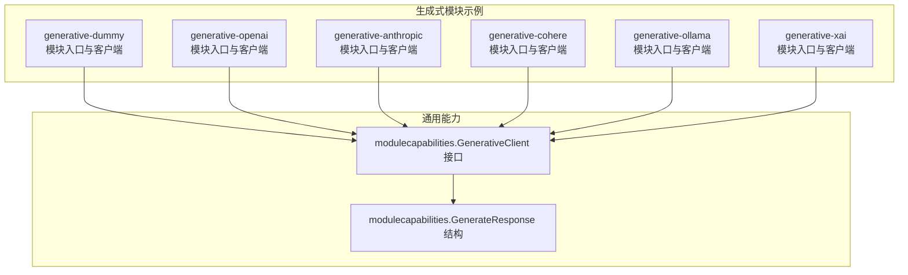
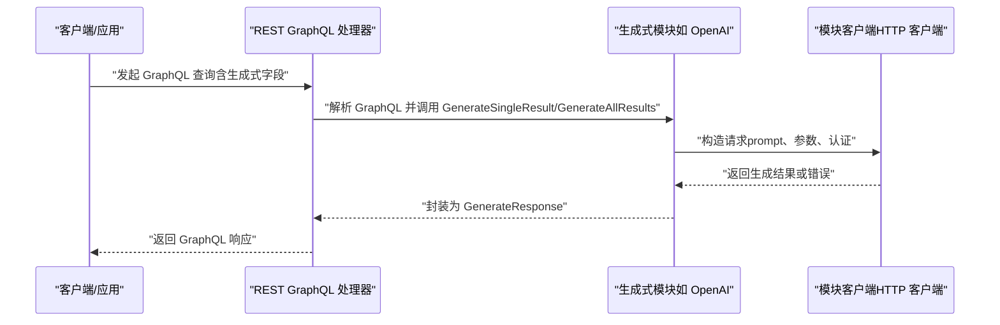
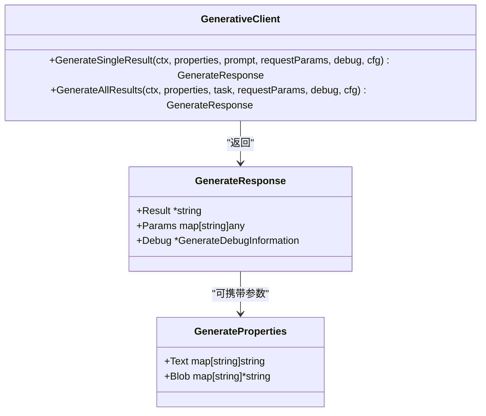
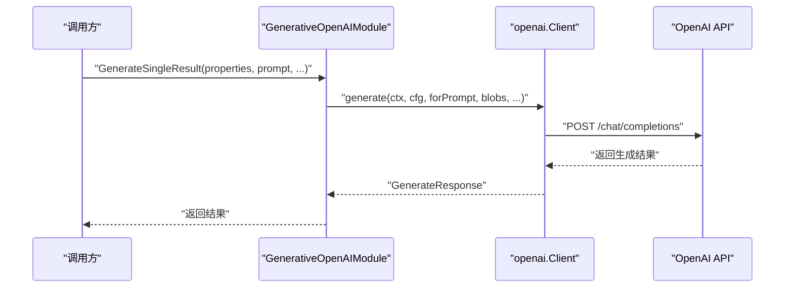
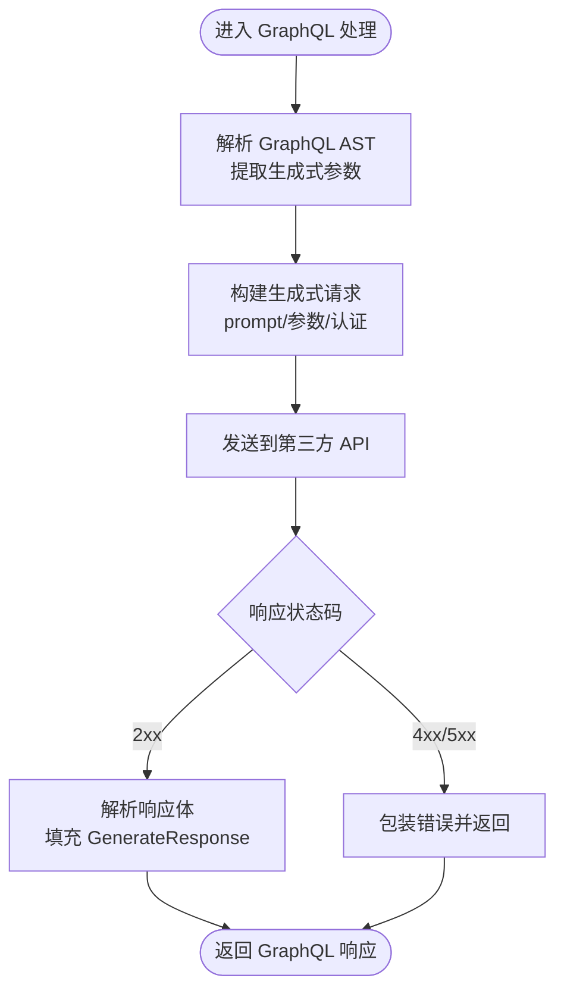
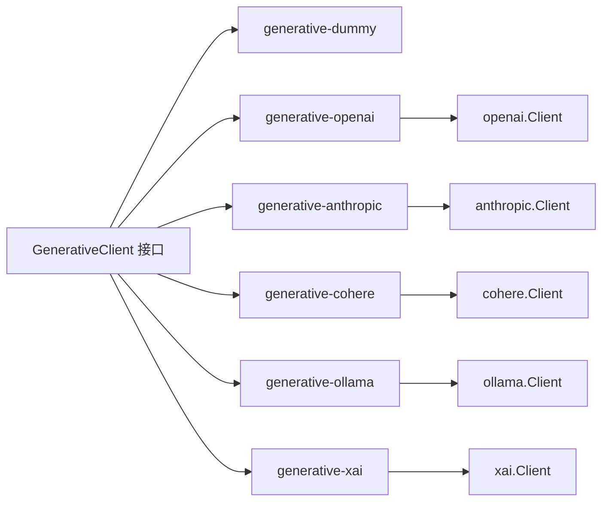

# 生成式模块开发

<cite>
**本文引用的文件**
- [entities/modulecapabilities/generative.go](file://entities/modulecapabilities/generative.go)
- [modules/generative-dummy/module.go](file://modules/generative-dummy/module.go)
- [modules/generative-dummy/config.go](file://modules/generative-dummy/config.go)
- [modules/generative-dummy/clients/dummy.go](file://modules/generative-dummy/clients/dummy.go)
- [modules/generative-openai/module.go](file://modules/generative-openai/module.go)
- [modules/generative-openai/config.go](file://modules/generative-openai/config.go)
- [modules/generative-openai/clients/openai.go](file://modules/generative-openai/clients/openai.go)
- [modules/generative-anthropic/module.go](file://modules/generative-anthropic/module.go)
- [modules/generative-anthropic/clients/anthropic.go](file://modules/generative-anthropic/clients/anthropic.go)
- [modules/generative-cohere/module.go](file://modules/generative-cohere/module.go)
- [modules/generative-cohere/clients/cohere.go](file://modules/generative-cohere/clients/cohere.go)
- [modules/generative-ollama/module.go](file://modules/generative-ollama/module.go)
- [modules/generative-ollama/clients/ollama.go](file://modules/generative-ollama/clients/ollama.go)
- [modules/generative-xai/module.go](file://modules/generative-xai/module.go)
- [modules/generative-xai/clients/xai.go](file://modules/generative-xai/clients/xai.go)
- [modules/ner-transformers/module.go](file://modules/ner-transformers/module.go)
- [modules/sum-transformers/module.go](file://modules/sum-transformers/module.go)
- [modules/qna-transformers/module.go](file://modules/qna-transformers/module.go)
- [adapters/handlers/rest/handlers_graphql.go](file://adapters/handlers/rest/handlers_graphql.go)
- [client/graphql/graphql_post_responses.go](file://client/graphql/graphql_post_responses.go)
</cite>

## 目录
1. [简介](#简介)
2. [项目结构](#项目结构)
3. [核心组件](#核心组件)
4. [架构总览](#架构总览)
5. [详细组件分析](#详细组件分析)
6. [依赖关系分析](#依赖关系分析)
7. [性能考虑](#性能考虑)
8. [故障排查指南](#故障排查指南)
9. [结论](#结论)
10. [附录](#附录)

## 简介
本指南面向希望在 Weaviate 中开发“生成式（Text2TextGenerative）”能力的开发者，系统讲解以下内容：
- 如何实现 Text2TextGenerative、Text2TextSummarize、Text2TextReranker、Text2TextNER、Text2TextQnA 等生成式模块
- 生成式接口的实现要点：Generate、GenerateSingleResult、GenerateAllResults 的职责与调用链
- 生成式参数处理机制：GraphQL 参数解析、请求构建、响应处理
- 自定义生成式模块的完整示例：API 客户端集成、认证处理、错误管理
- 配置管理：类设置、参数验证、默认值处理
- 性能优化与资源管理策略

## 项目结构
Weaviate 将生成式模块以“模块化”方式组织，每个第三方服务（如 OpenAI、Anthropic、Cohere、Ollama、XAI 等）对应一个独立子目录，包含：
- 模块入口与类型声明：module.go
- 类配置与校验：config.go
- 客户端实现：clients/*.go
- 可选：参数扩展（AdditionalGenerativeParameters）

图表来源
- [modules/generative-dummy/module.go](file://modules/generative-dummy/module.go#L27-L70)
- [modules/generative-openai/module.go](file://modules/generative-openai/module.go#L29-L80)
- [modules/generative-anthropic/module.go](file://modules/generative-anthropic/module.go#L29-L80)
- [modules/generative-cohere/module.go](file://modules/generative-cohere/module.go#L29-L80)
- [modules/generative-ollama/module.go](file://modules/generative-ollama/module.go#L28-L75)
- [modules/generative-xai/module.go](file://modules/generative-xai/module.go#L1-L80)
- [entities/modulecapabilities/generative.go](file://entities/modulecapabilities/generative.go#L48-L72)

章节来源
- [modules/generative-dummy/module.go](file://modules/generative-dummy/module.go#L27-L70)
- [modules/generative-openai/module.go](file://modules/generative-openai/module.go#L29-L80)
- [modules/generative-anthropic/module.go](file://modules/generative-anthropic/module.go#L29-L80)
- [modules/generative-cohere/module.go](file://modules/generative-cohere/module.go#L29-L80)
- [modules/generative-ollama/module.go](file://modules/generative-ollama/module.go#L28-L75)
- [modules/generative-xai/module.go](file://modules/generative-xai/module.go#L1-L80)
- [entities/modulecapabilities/generative.go](file://entities/modulecapabilities/generative.go#L48-L72)

## 核心组件
- 生成式接口与数据模型
  - GenerativeClient：定义 GenerateSingleResult、GenerateAllResults 两个方法，用于单条与批量生成
  - GenerateResponse：统一返回结构，包含 Result、Params、Debug
  - GenerateProperties：输入属性载体，支持 Text 与 Blob
- 模块类型
  - Text2TextGenerative：通用生成式模块
  - Text2TextSummarize：摘要模块（由 sum-transformers 提供）
  - Text2TextReranker：重排序模块（由 reranker-* 提供）
  - Text2TextNER：命名实体识别模块（由 ner-transformers 提供）
  - Text2TextQnA：问答模块（由 qna-* 提供）

章节来源
- [entities/modulecapabilities/generative.go](file://entities/modulecapabilities/generative.go#L22-L72)

## 架构总览
生成式模块在 Weaviate 中的典型调用链如下：

图表来源
- [adapters/handlers/rest/handlers_graphql.go](file://adapters/handlers/rest/handlers_graphql.go#L184-L215)
- [modules/generative-openai/clients/openai.go](file://modules/generative-openai/clients/openai.go#L78-L94)
- [entities/modulecapabilities/generative.go](file://entities/modulecapabilities/generative.go#L48-L56)

## 详细组件分析

### 通用接口与数据模型
- 接口职责
  - GenerateSingleResult：针对单条属性生成结果
  - GenerateAllResults：针对多条属性按任务聚合生成结果
- 返回结构
  - Result：字符串结果
  - Params：模块特定的响应参数
  - Debug：调试信息（如提示词）

图表来源
- [entities/modulecapabilities/generative.go](file://entities/modulecapabilities/generative.go#L48-L72)

章节来源
- [entities/modulecapabilities/generative.go](file://entities/modulecapabilities/generative.go#L22-L72)

### Text2TextGenerative 模块开发（以 OpenAI 为例）
- 模块入口
  - Name、Type、Init、MetaInfo、AdditionalGenerativeProperties
  - 初始化时创建客户端并注册额外参数
- 客户端实现
  - GenerateSingleResult/GenerateAllResults：分别处理单条与批量
  - 请求构建：根据属性与任务生成 prompt，附加参数与认证
  - 错误处理：包装底层错误，返回标准响应
- 配置与校验
  - ClassConfigDefaults/PropertyConfigDefaults：默认空配置
  - ValidateClass：通过 ClassSettings 进行校验（OpenAI 模块使用）

图表来源
- [modules/generative-openai/module.go](file://modules/generative-openai/module.go#L51-L80)
- [modules/generative-openai/clients/openai.go](file://modules/generative-openai/clients/openai.go#L78-L94)

章节来源
- [modules/generative-openai/module.go](file://modules/generative-openai/module.go#L29-L80)
- [modules/generative-openai/config.go](file://modules/generative-openai/config.go#L24-L41)
- [modules/generative-openai/clients/openai.go](file://modules/generative-openai/clients/openai.go#L78-L94)

### 其他生成式模块（Anthropic、Cohere、Ollama、XAI）
- Anthropic
  - 从环境变量读取密钥，初始化客户端，注册额外参数
- Cohere
  - 从环境变量读取密钥，初始化客户端，注册额外参数
- Ollama
  - 本地推理，无需外部密钥；注册额外参数
- XAI
  - 支持单条与批量生成，请求体序列化与超时控制

章节来源
- [modules/generative-anthropic/module.go](file://modules/generative-anthropic/module.go#L51-L80)
- [modules/generative-anthropic/clients/anthropic.go](file://modules/generative-anthropic/clients/anthropic.go#L51-L77)
- [modules/generative-cohere/module.go](file://modules/generative-cohere/module.go#L51-L80)
- [modules/generative-cohere/clients/cohere.go](file://modules/generative-cohere/clients/cohere.go#L1-L200)
- [modules/generative-ollama/module.go](file://modules/generative-ollama/module.go#L50-L80)
- [modules/generative-ollama/clients/ollama.go](file://modules/generative-ollama/clients/ollama.go#L1-L200)
- [modules/generative-xai/module.go](file://modules/generative-xai/module.go#L1-L80)
- [modules/generative-xai/clients/xai.go](file://modules/generative-xai/clients/xai.go#L51-L77)

### Text2TextSummarize（摘要）
- 模块类型：Text2TextSummarize
- 实现参考：sum-transformers 模块
- 关键点：将文本属性转换为摘要请求，返回摘要结果

章节来源
- [modules/sum-transformers/module.go](file://modules/sum-transformers/module.go#L1-L200)

### Text2TextReranker（重排序）
- 模块类型：Text2TextReranker
- 实现参考：reranker-* 模块（如 contextualai、jinaai、voyageai 等）
- 关键点：对查询与候选片段进行打分排序

章节来源
- [modules/generative-xai/module.go](file://modules/generative-xai/module.go#L1-L80)

### Text2TextNER（命名实体识别）
- 模块类型：Text2TextNER
- 实现参考：ner-transformers 模块
- 关键点：初始化远程推理服务，注册 AdditionalProperties 以提供实体信息

章节来源
- [modules/ner-transformers/module.go](file://modules/ner-transformers/module.go#L50-L104)

### Text2TextQnA（问答）
- 模块类型：Text2TextQnA
- 实现参考：qna-* 模块（如 transformers、openai 等）
- 关键点：结合上下文与问题生成答案，支持额外参数扩展

章节来源
- [modules/qna-transformers/module.go](file://modules/qna-transformers/module.go#L1-L200)

### GraphQL 参数解析与请求构建
- GraphQL 解析
  - REST 层负责解析批量请求，逐个处理并收集结果
- 生成式参数提取
  - 通过 ExtractRequestParamsFn 从 GraphQL AST 中提取模块特定参数
  - 通过 RequestParamsFunction/ResponseParamsFunction 注入 GraphQL 字段
- 请求构建
  - 将属性 Text/Blob 转换为 prompt 或请求体
  - 序列化请求体，设置认证头，发送到第三方 API
- 响应处理
  - 解析响应，填充 GenerateResponse.Result/Params/Debug
  - 对错误进行分类与包装，返回标准错误响应

图表来源
- [adapters/handlers/rest/handlers_graphql.go](file://adapters/handlers/rest/handlers_graphql.go#L184-L215)
- [client/graphql/graphql_post_responses.go](file://client/graphql/graphql_post_responses.go#L72-L118)

章节来源
- [adapters/handlers/rest/handlers_graphql.go](file://adapters/handlers/rest/handlers_graphql.go#L184-L215)
- [client/graphql/graphql_post_responses.go](file://client/graphql/graphql_post_responses.go#L72-L118)

## 依赖关系分析
- 模块与接口
  - 各生成式模块均实现 modulecapabilities.GenerativeClient
  - 通过 AdditionalGenerativeProperties 暴露 GraphQL 扩展字段
- 模块间耦合
  - 模块内部依赖 clients 子包中的具体实现
  - 配置校验通过 ClassSettings 完成，避免硬编码
- 外部依赖
  - 第三方 API（OpenAI、Anthropic、Cohere、Ollama、XAI 等）
  - GraphQL 解析与 REST 处理器

图表来源
- [entities/modulecapabilities/generative.go](file://entities/modulecapabilities/generative.go#L48-L72)
- [modules/generative-openai/module.go](file://modules/generative-openai/module.go#L51-L80)
- [modules/generative-anthropic/module.go](file://modules/generative-anthropic/module.go#L51-L80)
- [modules/generative-cohere/module.go](file://modules/generative-cohere/module.go#L51-L80)
- [modules/generative-ollama/module.go](file://modules/generative-ollama/module.go#L50-L80)
- [modules/generative-xai/module.go](file://modules/generative-xai/module.go#L1-L80)

章节来源
- [entities/modulecapabilities/generative.go](file://entities/modulecapabilities/generative.go#L48-L72)
- [modules/generative-openai/module.go](file://modules/generative-openai/module.go#L51-L80)
- [modules/generative-anthropic/module.go](file://modules/generative-anthropic/module.go#L51-L80)
- [modules/generative-cohere/module.go](file://modules/generative-cohere/module.go#L51-L80)
- [modules/generative-ollama/module.go](file://modules/generative-ollama/module.go#L50-L80)
- [modules/generative-xai/module.go](file://modules/generative-xai/module.go#L1-L80)

## 性能考虑
- 并发与批处理
  - REST 层对 GraphQL 请求采用 goroutine 并发处理，提升吞吐
- 超时与重试
  - 客户端设置合理超时；第三方 API 失败时进行错误包装与降级
- 缓存与预热
  - 对热点模型或频繁调用的模块，建议在部署层引入缓存或预热策略
- 资源限制
  - 控制并发请求数与内存占用，避免对下游 API 造成压力

章节来源
- [adapters/handlers/rest/handlers_graphql.go](file://adapters/handlers/rest/handlers_graphql.go#L184-L215)
- [modules/generative-openai/clients/openai.go](file://modules/generative-openai/clients/openai.go#L78-L94)

## 故障排查指南
- 常见错误类型
  - 4xx：请求参数错误、认证失败、权限不足
  - 5xx：第三方服务内部错误
- 错误处理流程
  - 包装底层错误，返回标准 GraphQL 响应
  - 在 Debug 中保留必要上下文，便于定位问题
- 建议排查步骤
  - 检查环境变量与认证配置
  - 校验 GraphQL 参数是否正确注入
  - 查看 Debug 信息与日志级别
  - 验证第三方 API 的可用性与配额

章节来源
- [client/graphql/graphql_post_responses.go](file://client/graphql/graphql_post_responses.go#L288-L330)
- [client/graphql/graphql_post_responses.go](file://client/graphql/graphql_post_responses.go#L332-L398)

## 结论
通过遵循 Weaviate 的生成式模块接口与配置规范，开发者可以快速对接多家第三方大模型服务，并在 GraphQL 层面无缝暴露生成能力。建议在实现中重点关注：
- 明确 GenerateSingleResult 与 GenerateAllResults 的职责边界
- 规范参数解析与请求构建，确保与 GraphQL schema 对齐
- 完善错误处理与调试信息，提升可观测性
- 结合业务场景进行性能优化与资源管理

## 附录

### 自定义生成式模块开发清单
- 实现模块入口
  - Name、Type、Init、MetaInfo、AdditionalGenerativeProperties
- 实现客户端
  - GenerateSingleResult/GenerateAllResults
  - 认证与请求构建
  - 响应解析与错误包装
- 配置与校验
  - ClassConfigDefaults/PropertyConfigDefaults
  - ValidateClass（如有需要）
- GraphQL 扩展
  - 通过 AdditionalGenerativeProperties 注入 GraphQL 输入/输出字段
- 测试与验证
  - 单元测试覆盖成功与失败路径
  - 集成测试验证 GraphQL 端到端流程

章节来源
- [modules/generative-dummy/module.go](file://modules/generative-dummy/module.go#L27-L70)
- [modules/generative-dummy/config.go](file://modules/generative-dummy/config.go#L23-L39)
- [modules/generative-dummy/clients/dummy.go](file://modules/generative-dummy/clients/dummy.go#L42-L60)