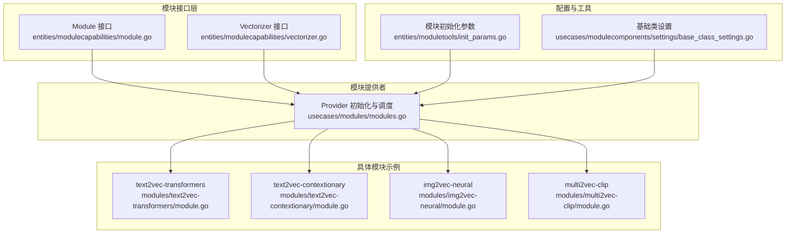
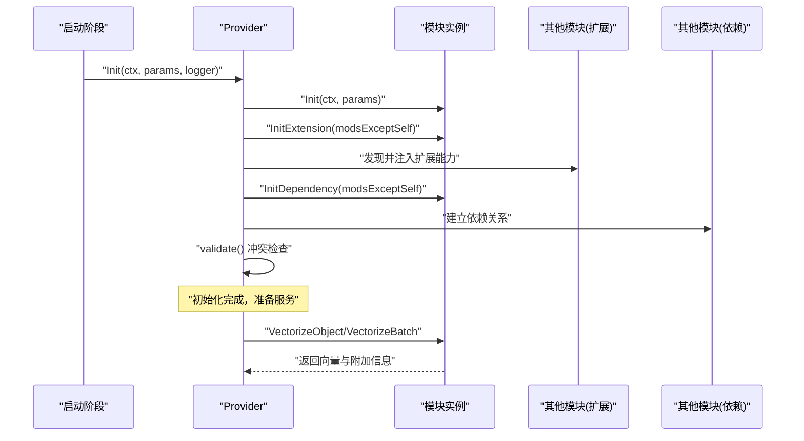
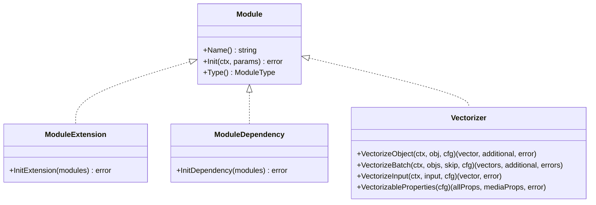
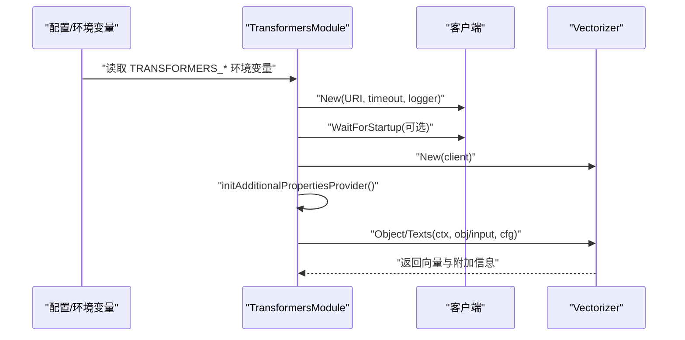
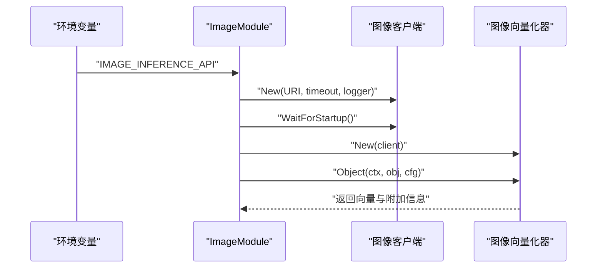
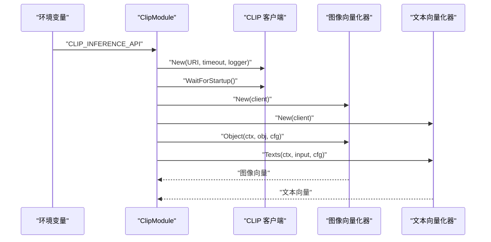
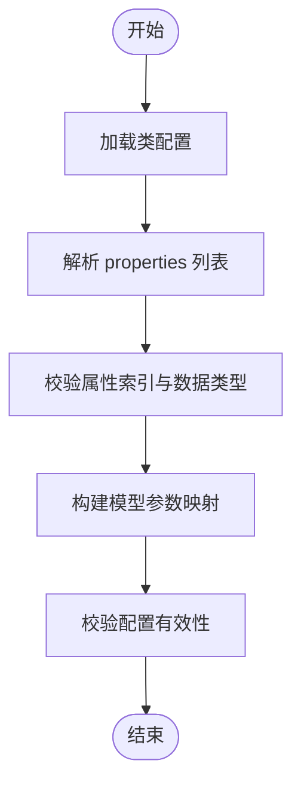
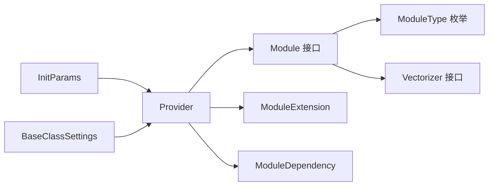

# 自定义向量化器开发

<cite>
**本文档引用的文件**
- [entities/modulecapabilities/module.go](file://entities/modulecapabilities/module.go)
- [entities/modulecapabilities/vectorizer.go](file://entities/modulecapabilities/vectorizer.go)
- [usecases/modules/modules.go](file://usecases/modules/modules.go)
- [entities/moduletools/init_params.go](file://entities/moduletools/init_params.go)
- [usecases/modulecomponents/settings/base_class_settings.go](file://usecases/modulecomponents/settings/base_class_settings.go)
- [modules/text2vec-transformers/module.go](file://modules/text2vec-transformers/module.go)
- [modules/text2vec-contextionary/module.go](file://modules/text2vec-contextionary/module.go)
- [modules/img2vec-neural/module.go](file://modules/img2vec-neural/module.go)
- [modules/multi2vec-clip/module.go](file://modules/multi2vec-clip/module.go)
- [modules/text2vec-huggingface/clients/huggingface.go](file://modules/text2vec-huggingface/clients/huggingface.go)
- [modules/text2vec-gpt4all/clients/gpt4all.go](file://modules/text2vec-gpt4all/clients/gpt4all.go)
- [usecases/modulecomponents/batch/batch.go](file://usecases/modulecomponents/batch/batch.go)
- [adapters/repos/db/vector/flat/quantizer.go](file://adapters/repos/db/vector/flat/quantizer.go)
- [adapters/handlers/rest/requests_total_metrics.go](file://adapters/handlers/rest/requests_total_metrics.go)
- [entities/errors/error_group_wrapper.go](file://entities/errors/error_group_wrapper.go)
</cite>

## 目录
1. [简介](#简介)
2. [项目结构](#项目结构)
3. [核心组件](#核心组件)
4. [架构总览](#架构总览)
5. [详细组件分析](#详细组件分析)
6. [依赖关系分析](#依赖关系分析)
7. [性能考虑](#性能考虑)
8. [故障排除指南](#故障排除指南)
9. [结论](#结论)
10. [附录](#附录)

## 简介
本指南面向希望在 Weaviate 中开发自定义向量化器（Text2Vec、Img2Vec、Multi2Vec 等）的开发者。文档从接口规范、模块生命周期、配置管理、向量化流程、性能优化到错误处理与监控进行系统性讲解，并提供可直接参考的源码路径与图示，帮助快速落地。

## 项目结构
Weaviate 的模块化体系由“模块接口 + 模块提供者 + 配置工具 + 向量化客户端”构成。模块通过统一的 Module 接口注册到 Provider，由 Provider 在启动时完成初始化、扩展初始化与依赖初始化，随后在查询与写入路径中被调用。

**图表来源**
- [entities/modulecapabilities/module.go](file://entities/modulecapabilities/module.go#L45-L49)
- [entities/modulecapabilities/vectorizer.go](file://entities/modulecapabilities/vectorizer.go#L25-L35)
- [usecases/modules/modules.go](file://usecases/modules/modules.go#L138-L179)
- [entities/moduletools/init_params.go](file://entities/moduletools/init_params.go#L21-L27)
- [usecases/modulecomponents/settings/base_class_settings.go](file://usecases/modulecomponents/settings/base_class_settings.go#L35-L57)
- [modules/text2vec-transformers/module.go](file://modules/text2vec-transformers/module.go#L48-L54)
- [modules/text2vec-contextionary/module.go](file://modules/text2vec-contextionary/module.go#L84-L90)
- [modules/img2vec-neural/module.go](file://modules/img2vec-neural/module.go#L49-L55)
- [modules/multi2vec-clip/module.go](file://modules/multi2vec-clip/module.go#L63-L69)

**章节来源**
- [entities/modulecapabilities/module.go](file://entities/modulecapabilities/module.go#L24-L49)
- [usecases/modules/modules.go](file://usecases/modules/modules.go#L138-L179)

## 核心组件
- 模块接口与类型
  - Module：包含 Name、Init、Type 三个核心方法，用于模块注册、生命周期初始化与类型标识。
  - ModuleType：枚举了 Text2Vec、Img2Vec、Multi2Vec、Multi2Multivec、Ref2Vec、Text2Multivec、Text2TextGenerative 等类型。
- 向量化接口
  - Vectorizer：支持对象向量化、输入文本向量化、批量向量化以及可向量化属性探测。
  - InputVectorizer：仅支持输入文本向量化。
- 模块提供者 Provider
  - 负责注册模块、按序初始化（Init → InitExtension → InitDependency）、校验冲突、暴露 GraphQL 参数与附加属性等。

**章节来源**
- [entities/modulecapabilities/module.go](file://entities/modulecapabilities/module.go#L24-L49)
- [entities/modulecapabilities/vectorizer.go](file://entities/modulecapabilities/vectorizer.go#L25-L53)
- [usecases/modules/modules.go](file://usecases/modules/modules.go#L138-L179)

## 架构总览
模块生命周期与调用链如下：

**图表来源**
- [usecases/modules/modules.go](file://usecases/modules/modules.go#L138-L179)

## 详细组件分析

### 模块接口与实现要点
- Module 接口
  - Name()：模块名称，用于注册与查找。
  - Init(ctx, params)：模块初始化入口，通常在此完成客户端初始化、等待远端服务可用、构建内部组件。
  - Type()：模块类型，决定其在 Provider 中的分类与行为。
- 扩展与依赖
  - ModuleExtension：允许模块在所有模块初始化后，基于其他模块的能力进行二次初始化（如注入 nearText 变换器）。
  - ModuleDependency：允许模块在所有模块初始化后，声明与其他模块的依赖关系。

**图表来源**
- [entities/modulecapabilities/module.go](file://entities/modulecapabilities/module.go#L45-L71)
- [entities/modulecapabilities/vectorizer.go](file://entities/modulecapabilities/vectorizer.go#L25-L53)

**章节来源**
- [entities/modulecapabilities/module.go](file://entities/modulecapabilities/module.go#L45-L71)
- [entities/modulecapabilities/vectorizer.go](file://entities/modulecapabilities/vectorizer.go#L25-L53)

### 文本向量化器（Text2Vec）实现
以 text2vec-transformers 为例，展示典型实现模式：
- Init：读取环境变量（如推理 API 地址、是否等待启动），构造客户端并可选等待远端可用。
- InitExtension：扫描其他模块，注入 nearText 变换器能力。
- VectorizeObject/VectorizeBatch：委托底层 vectorizer 执行对象或批量向量化。
- VectorizeInput：对输入文本执行向量化。
- 元数据与附加属性：提供 MetaInfo 与 AdditionalProperties。

**图表来源**
- [modules/text2vec-transformers/module.go](file://modules/text2vec-transformers/module.go#L56-L132)
- [modules/text2vec-transformers/module.go](file://modules/text2vec-transformers/module.go#L139-L179)

**章节来源**
- [modules/text2vec-transformers/module.go](file://modules/text2vec-transformers/module.go#L56-L132)
- [modules/text2vec-transformers/module.go](file://modules/text2vec-transformers/module.go#L139-L179)

### 图像向量化器（Img2Vec）实现
以 img2vec-neural 为例：
- Init：读取 IMAGE_INFERENCE_API 环境变量，构造客户端并等待启动。
- VectorizeObject：委托内部 vectorizer 对象进行向量化。
- InitExtension：初始化 nearImage 能力。

**图表来源**
- [modules/img2vec-neural/module.go](file://modules/img2vec-neural/module.go#L57-L89)
- [modules/img2vec-neural/module.go](file://modules/img2vec-neural/module.go#L91-L95)

**章节来源**
- [modules/img2vec-neural/module.go](file://modules/img2vec-neural/module.go#L57-L89)
- [modules/img2vec-neural/module.go](file://modules/img2vec-neural/module.go#L91-L95)

### 多模态向量化器（Multi2Vec）实现
以 multi2vec-clip 为例：
- Init：读取 CLIP_INFERENCE_API，构造图像与文本向量化器。
- InitExtension：注入 nearText 变换器。
- VectorizeObject：委托图像向量化器；VectorizeBatch：使用通用批处理封装。
- VectorizableProperties：返回媒体属性列表。

**图表来源**
- [modules/multi2vec-clip/module.go](file://modules/multi2vec-clip/module.go#L71-L130)
- [modules/multi2vec-clip/module.go](file://modules/multi2vec-clip/module.go#L132-L150)

**章节来源**
- [modules/multi2vec-clip/module.go](file://modules/multi2vec-clip/module.go#L71-L130)
- [modules/multi2vec-clip/module.go](file://modules/multi2vec-clip/module.go#L132-L150)

### 类配置与环境变量处理
- 基础类设置（BaseClassSettings）
  - 支持 properties、vectorizeClassName、vectorizePropertyName 等配置项解析。
  - 提供属性索引判断、模型参数名处理、自动模式校验等。
- 模块配置默认值与合并
  - Provider 在初始化时根据模块实现的 ClassConfigDefaults 合并用户指定配置，确保向量化参数一致性。

**图表来源**
- [usecases/modulecomponents/settings/base_class_settings.go](file://usecases/modulecomponents/settings/base_class_settings.go#L134-L200)
- [usecases/modules/modules.go](file://usecases/modules/modules.go#L71-L89)

**章节来源**
- [usecases/modulecomponents/settings/base_class_settings.go](file://usecases/modulecomponents/settings/base_class_settings.go#L134-L200)
- [usecases/modules/modules.go](file://usecases/modules/modules.go#L71-L89)

### 向量化过程实现细节
- 文本预处理
  - 大多数模块在 Init 阶段读取环境变量（如 API 地址、等待启动开关），并在初始化客户端时进行健康检查。
- API 调用
  - 客户端封装 HTTP 请求与响应解析，统一错误处理与状态码检查。
- 向量生成
  - 将预处理后的输入传递给底层 vectorizer，返回向量与可能的附加信息。

示例：HuggingFace 客户端对响应体的解码与错误包装；GPT4All 客户端对状态码与错误字段的处理。

**章节来源**
- [modules/text2vec-huggingface/clients/huggingface.go](file://modules/text2vec-huggingface/clients/huggingface.go#L150-L189)
- [modules/text2vec-gpt4all/clients/gpt4all.go](file://modules/text2vec-gpt4all/clients/gpt4all.go#L62-L84)

### 模块注册、依赖注入与生命周期管理
- 注册与获取
  - Provider.Register 保存模块映射；GetByName 支持别名解析。
- 生命周期
  - Init → InitExtension → InitDependency → validate；关闭时遍历调用 ModuleWithClose.Close。
- 依赖注入
  - InitExtension：扫描其他模块，注入 nearText 等变换器。
  - InitDependency：声明与其他模块的依赖关系。

**章节来源**
- [usecases/modules/modules.go](file://usecases/modules/modules.go#L71-L88)
- [usecases/modules/modules.go](file://usecases/modules/modules.go#L138-L179)

## 依赖关系分析

**图表来源**
- [entities/modulecapabilities/module.go](file://entities/modulecapabilities/module.go#L24-L71)
- [entities/modulecapabilities/vectorizer.go](file://entities/modulecapabilities/vectorizer.go#L25-L53)
- [usecases/modules/modules.go](file://usecases/modules/modules.go#L138-L179)
- [entities/moduletools/init_params.go](file://entities/moduletools/init_params.go#L21-L27)
- [usecases/modulecomponents/settings/base_class_settings.go](file://usecases/modulecomponents/settings/base_class_settings.go#L35-L57)

**章节来源**
- [entities/modulecapabilities/module.go](file://entities/modulecapabilities/module.go#L24-L71)
- [entities/modulecapabilities/vectorizer.go](file://entities/modulecapabilities/vectorizer.go#L25-L53)
- [usecases/modules/modules.go](file://usecases/modules/modules.go#L138-L179)

## 性能考虑
- 批量处理
  - 使用 usecases/modulecomponents/batch 包提供的批处理封装，支持并发限制、速率控制与队列度量。
- 缓存机制
  - 向量量化结果可结合向量存储层的缓存（如量化缓存）减少重复计算。
- 并发控制
  - 使用 entities/errors/error_group_wrapper 提供的并发组与上下文取消，避免资源泄露。
- 指标与日志
  - REST 层提供请求总量与错误分类指标；模块层可通过 Prometheus 注册器上报自定义指标。

**章节来源**
- [usecases/modulecomponents/batch/batch.go](file://usecases/modulecomponents/batch/batch.go#L211-L241)
- [adapters/repos/db/vector/flat/quantizer.go](file://adapters/repos/db/vector/flat/quantizer.go#L325-L456)
- [entities/errors/error_group_wrapper.go](file://entities/errors/error_group_wrapper.go#L28-L105)
- [adapters/handlers/rest/requests_total_metrics.go](file://adapters/handlers/rest/requests_total_metrics.go#L74-L123)

## 故障排除指南
- 常见错误场景
  - 远端服务未就绪：在 Init 阶段调用 WaitForStartup，若超时则返回初始化失败。
  - 环境变量缺失：读取 API 地址失败时应明确报错并提示所需变量。
  - HTTP 错误：客户端统一解析状态码与错误字段，返回可诊断的错误信息。
- 日志与监控
  - 使用 Provider 初始化日志记录模块启动状态。
  - REST 层对请求错误进行分类统计，便于定位问题。

**章节来源**
- [modules/text2vec-transformers/module.go](file://modules/text2vec-transformers/module.go#L90-L132)
- [modules/text2vec-huggingface/clients/huggingface.go](file://modules/text2vec-huggingface/clients/huggingface.go#L163-L189)
- [adapters/handlers/rest/requests_total_metrics.go](file://adapters/handlers/rest/requests_total_metrics.go#L74-L123)

## 结论
通过遵循 Module 接口与 Provider 生命周期，结合统一的配置与客户端抽象，开发者可以快速实现自定义向量化器。建议优先参考 text2vec-transformers、img2vec-neural、multi2vec-clip 等模块的实现模式，在 Init 阶段完成环境变量与客户端初始化，在 VectorizeObject/VectorizeBatch 中委托底层实现，并通过 Provider 的扩展与依赖机制实现能力注入与约束校验。

## 附录
- 快速实现清单
  - 实现 Module 接口：Name、Init、Type。
  - 实现 Vectorizer 或 InputVectorizer 接口：VectorizeObject/VectorizeBatch/VectorizeInput。
  - 在 Init 中读取环境变量、构造客户端并等待可用。
  - 如需 nearText 能力，实现 ModuleExtension 并在 InitExtension 中注入。
  - 如需依赖其他模块，实现 ModuleDependency 并在 InitDependency 中声明。
  - 使用 BaseClassSettings 与 Provider 的配置合并逻辑，保证向量化参数一致。
  - 引入批处理与并发控制，结合指标与日志完善可观测性。