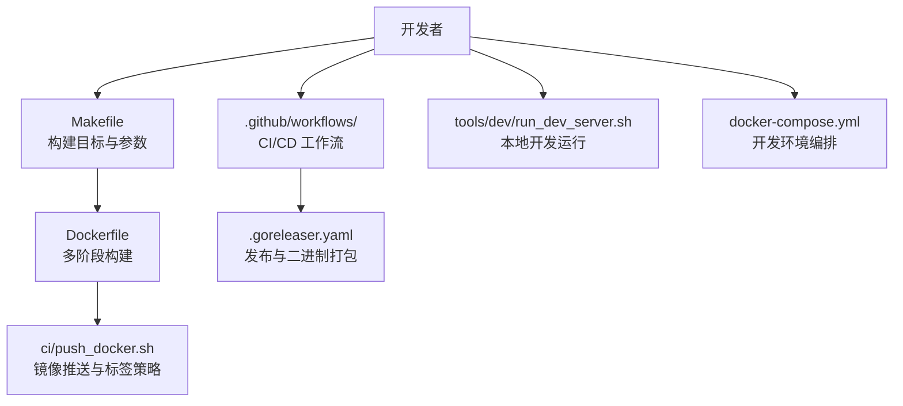
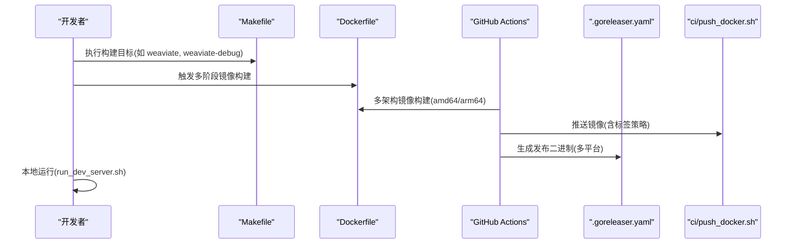
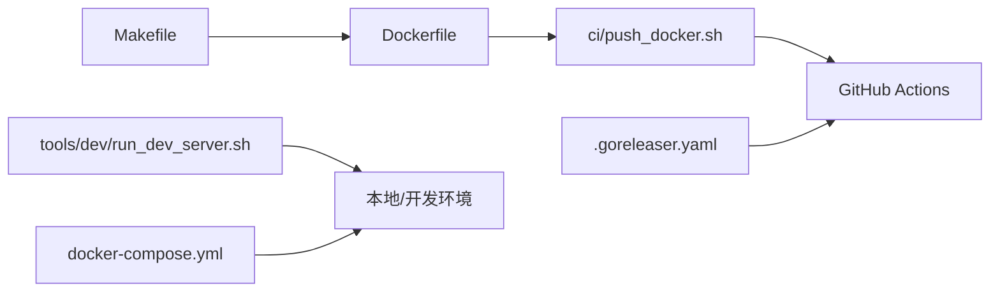

# 构建与部署

<cite>
**本文引用的文件**
- [Makefile](file://Makefile)
- [Dockerfile](file://Dockerfile)
- [.goreleaser.yaml](file://.goreleaser.yaml)
- [README.md](file://README.md)
- [.github/workflows/pull_requests.yaml](file://.github/workflows/pull_requests.yaml)
- [.github/workflows/release.yaml](file://.github/workflows/release.yaml)
- [docker-compose.yml](file://docker-compose.yml)
- [tools/dev/image-tag.sh](file://tools/dev/image-tag.sh)
- [ci/push_docker.sh](file://ci/push_docker.sh)
- [tools/dev/run_dev_server.sh](file://tools/dev/run_dev_server.sh)
</cite>

## 目录
1. [简介](#简介)
2. [项目结构](#项目结构)
3. [核心组件](#核心组件)
4. [架构总览](#架构总览)
5. [详细组件分析](#详细组件分析)
6. [依赖关系分析](#依赖关系分析)
7. [性能考量](#性能考量)
8. [故障排查指南](#故障排查指南)
9. [结论](#结论)
10. [附录](#附录)

## 简介
本指南面向 Weaviate 的构建与部署，覆盖以下主题：
- Makefile 构建目标与参数：开发构建、调试构建、发布构建、交叉编译与多平台打包
- Docker 容器化：镜像构建、多阶段构建、安全扫描与推送策略
- Kubernetes 部署：Helm Charts、资源配置与服务发现（概念性说明）
- 持续集成与持续部署：GitHub Actions 工作流、自动化测试与发布资产生成
- 版本管理与发布：语义化版本控制、变更日志维护与发布流程
- 性能优化：构建选项、编译标志与静态链接
- 多平台构建与分发：跨平台镜像与二进制产物
- 监控与日志：开发环境监控与日志配置

## 项目结构
Weaviate 的构建与部署相关文件主要集中在根目录的构建脚本、容器化定义、CI/CD 工作流以及开发辅助脚本中。关键路径如下：
- 构建与打包：Makefile、.goreleaser.yaml
- 容器化：Dockerfile、ci/push_docker.sh、tools/dev/image-tag.sh
- CI/CD：.github/workflows/*.yaml
- 开发与本地运行：tools/dev/run_dev_server.sh、docker-compose.yml

图表来源
- [Makefile](file://Makefile#L1-L113)
- [Dockerfile](file://Dockerfile#L1-L57)
- [.goreleaser.yaml](file://.goreleaser.yaml#L1-L27)
- [.github/workflows/pull_requests.yaml](file://.github/workflows/pull_requests.yaml#L1-L829)
- [ci/push_docker.sh](file://ci/push_docker.sh#L1-L140)
- [tools/dev/run_dev_server.sh](file://tools/dev/run_dev_server.sh#L1-L800)
- [docker-compose.yml](file://docker-compose.yml#L1-L140)

章节来源
- [Makefile](file://Makefile#L1-L113)
- [Dockerfile](file://Dockerfile#L1-L57)
- [.goreleaser.yaml](file://.goreleaser.yaml#L1-L27)
- [.github/workflows/pull_requests.yaml](file://.github/workflows/pull_requests.yaml#L1-L829)
- [ci/push_docker.sh](file://ci/push_docker.sh#L1-L140)
- [tools/dev/run_dev_server.sh](file://tools/dev/run_dev_server.sh#L1-L800)
- [docker-compose.yml](file://docker-compose.yml#L1-L140)

## 核心组件
- Makefile：提供统一的构建入口，支持默认构建、调试构建、单元测试、集成测试、本地开发运行、Mock 生成与 gRPC 代码生成等目标；包含跨平台构建与多架构镜像推送的参数。
- Dockerfile：采用多阶段构建，第一阶段准备构建环境与依赖，第二阶段构建最终二进制，第三阶段以精简的 Alpine 基础镜像运行 Weaviate，支持通过 ARG 注入构建元数据。
- .goreleaser.yaml：用于生成发布资产，指定多平台二进制构建、静态链接与版本注入。
- GitHub Actions：pull_requests.yaml 负责多架构镜像构建、安全扫描与推送；release.yaml 负责发布时的预编译二进制生成与上传。
- 开发脚本：tools/dev/run_dev_server.sh 提供多种本地开发场景（单节点、RBAC、OIDC、模块组合等），并注入构建信息；tools/dev/image-tag.sh 生成镜像标签；ci/push_docker.sh 统一镜像构建与推送逻辑。

章节来源
- [Makefile](file://Makefile#L60-L113)
- [Dockerfile](file://Dockerfile#L1-L57)
- [.goreleaser.yaml](file://.goreleaser.yaml#L1-L27)
- [.github/workflows/pull_requests.yaml](file://.github/workflows/pull_requests.yaml#L16-L200)
- [.github/workflows/release.yaml](file://.github/workflows/release.yaml#L1-L33)
- [tools/dev/run_dev_server.sh](file://tools/dev/run_dev_server.sh#L223-L496)
- [tools/dev/image-tag.sh](file://tools/dev/image-tag.sh#L1-L26)
- [ci/push_docker.sh](file://ci/push_docker.sh#L1-L140)

## 架构总览
下图展示了从源码到镜像与二进制产物的整体流程，以及 CI/CD 的关键步骤。

图表来源
- [Makefile](file://Makefile#L60-L113)
- [Dockerfile](file://Dockerfile#L1-L57)
- [.github/workflows/pull_requests.yaml](file://.github/workflows/pull_requests.yaml#L16-L200)
- [.github/workflows/release.yaml](file://.github/workflows/release.yaml#L1-L33)
- [ci/push_docker.sh](file://ci/push_docker.sh#L23-L137)
- [tools/dev/run_dev_server.sh](file://tools/dev/run_dev_server.sh#L34-L36)

## 详细组件分析

### Makefile 构建目标与参数
- 默认目标与二进制输出
  - 目标 weaviate：构建可执行文件，使用静态链接与精简符号表的 ldflags，并启用 netgo 标签。
  - 目标 weaviate-debug：构建带调试信息的二进制，开启 Go 调试标志。
- 测试与开发
  - 目标 test/test-integration：调用统一测试脚本执行单元与集成测试。
  - 目标 local/local-oidc/local-rbac/debug：通过开发脚本启动本地单节点或多节点集群，注入监控与认证配置。
- Docker 镜像
  - 目标 weaviate-image：使用 Docker Buildx 进行多架构构建，支持 CI 条件下的构建器初始化与参数传递。
  - 变量 IMAGE_PREFIX/IMAGE_TAG/WEAVIATE_IMAGE：镜像前缀与标签由脚本动态生成。
- 跨平台与交叉编译
  - 通过 GOOS/GOARCH/GOARM/GOEXPERIMENT 环境变量与 CGO_ENABLED 控制编译与链接行为；在 CI 中强制使用 Buildx 进行多架构构建。

章节来源
- [Makefile](file://Makefile#L10-L57)
- [Makefile](file://Makefile#L60-L113)

### Dockerfile 多阶段构建与镜像运行
- 多阶段构建
  - build_base：基于 golang:1.25-alpine，安装构建所需工具与依赖，下载 Go 模块。
  - server_builder：在构建阶段设置 CGO_ENABLED、注入构建元数据（分支、修订、构建者、日期），使用静态链接构建二进制。
  - weaviate：基于 Alpine，仅拷贝最终二进制与必要运行时依赖，设置默认入口命令与端口。
- 构建参数
  - 支持通过 ARG 注入 TARGETARCH、GIT_BRANCH、GIT_REVISION、BUILD_USER、BUILD_DATE、EXTRA_BUILD_ARGS、CGO_ENABLED 等，便于 CI 与本地构建一致性。

章节来源
- [Dockerfile](file://Dockerfile#L1-L57)

### 镜像标签与推送策略（ci/push_docker.sh）
- 标签策略
  - 分支为稳定分支时使用 openapi 版本号作为镜像标签；否则使用版本号加短提交哈希。
  - PR 构建生成 preview 标签与 semver 预览标签；主干合并生成 nightly 标签；正式发布打 exact 标签并同时更新 latest。
- 平台与缓存
  - 支持 linux/amd64、linux/arm64 或单独平台构建；使用 BuildKit 缓存作用域避免缓存冲突。
- 安全与扫描
  - 集成 Orca 容器镜像扫描与 SAST 扫描，失败则阻断推送。

章节来源
- [tools/dev/image-tag.sh](file://tools/dev/image-tag.sh#L1-L26)
- [ci/push_docker.sh](file://ci/push_docker.sh#L23-L137)
- [.github/workflows/pull_requests.yaml](file://.github/workflows/pull_requests.yaml#L16-L125)

### 发布与二进制打包（.goreleaser.yaml 与 GitHub Actions）
- .goreleaser.yaml
  - 指定多平台（linux/darwin/windows）与多架构（amd64/arm64），启用静态链接与版本注入。
  - macOS 生成“胖”二进制（universal）。
- GitHub Actions
  - release.yaml：在发布事件触发时生成预编译二进制，包含校验和。
  - pull_requests.yaml：在主干与 PR 事件中执行多架构镜像构建、安全扫描与推送。

章节来源
- [.goreleaser.yaml](file://.goreleaser.yaml#L1-L27)
- [.github/workflows/release.yaml](file://.github/workflows/release.yaml#L1-L33)
- [.github/workflows/pull_requests.yaml](file://.github/workflows/pull_requests.yaml#L16-L200)

### 本地开发与运行（tools/dev/run_dev_server.sh）
- 多场景配置
  - 单节点、RBAC、OIDC、API Key、多模块组合、S3/Offload 等场景，均通过环境变量与命令行参数控制。
- 监控与调试
  - 默认启用 Prometheus 监控，支持调试模式（dlv）连接。
- 构建信息注入
  - 通过 -ldflags 注入 Branch/Revision/BuildUser/BuildDate，便于追踪构建来源。

章节来源
- [tools/dev/run_dev_server.sh](file://tools/dev/run_dev_server.sh#L34-L36)
- [tools/dev/run_dev_server.sh](file://tools/dev/run_dev_server.sh#L223-L496)

### 开发环境编排（docker-compose.yml）
- 提供 Prometheus/Grafana、Keycloak、多个推理服务（Transformers、QnA、NER、Spellcheck、CLIP、BIND、Model2Vec、S3/GCS/Azure 等）与 Ollama 的示例编排。
- 注意：该文件仅用于贡献者开发，不建议直接用于生产。

章节来源
- [docker-compose.yml](file://docker-compose.yml#L1-L140)

## 依赖关系分析
- 构建链路
  - Makefile -> Dockerfile -> ci/push_docker.sh -> GitHub Actions
  - .goreleaser.yaml -> GitHub Actions release.yaml
- 运行链路
  - tools/dev/run_dev_server.sh -> 本地二进制/容器镜像 -> 开发服务
- 测试链路
  - GitHub Actions pull_requests.yaml -> 测试矩阵与模块化测试

图表来源
- [Makefile](file://Makefile#L60-L113)
- [Dockerfile](file://Dockerfile#L1-L57)
- [ci/push_docker.sh](file://ci/push_docker.sh#L1-L140)
- [.github/workflows/pull_requests.yaml](file://.github/workflows/pull_requests.yaml#L16-L200)
- [.github/workflows/release.yaml](file://.github/workflows/release.yaml#L1-L33)
- [tools/dev/run_dev_server.sh](file://tools/dev/run_dev_server.sh#L1-L800)
- [docker-compose.yml](file://docker-compose.yml#L1-L140)

## 性能考量
- 静态链接与精简符号
  - 构建时使用 -extldflags "-static" 与 -s -w 去除符号与调试信息，减小二进制体积并提升启动性能。
- CGO 控制
  - 默认禁用 CGO（CGO_ENABLED=0）以避免跨平台链接问题与运行时不确定性，保证稳定性。
- 多阶段构建
  - 将构建环境与运行时分离，仅复制最终二进制与必要依赖，降低镜像体积与攻击面。
- 缓存与并行
  - CI 使用 BuildKit 多缓存作用域，最大化复用构建层，缩短构建时间。
- 监控与剖析
  - 开发脚本默认启用 Prometheus 监控指标端口，支持阻塞与互斥剖析参数，便于定位性能瓶颈。

章节来源
- [Makefile](file://Makefile#L26-L37)
- [Dockerfile](file://Dockerfile#L30-L37)
- [.github/workflows/pull_requests.yaml](file://.github/workflows/pull_requests.yaml#L45-L54)
- [tools/dev/run_dev_server.sh](file://tools/dev/run_dev_server.sh#L11-L14)

## 故障排查指南
- 构建失败（CGO/链接错误）
  - 确认 CGO_ENABLED 设置为 0，避免跨平台链接问题；检查静态链接参数是否正确传递。
- 镜像推送失败
  - 检查 Docker Hub 登录凭据与网络连通性；确认标签策略与分支/标签匹配。
- CI 安全扫描失败
  - 查看 Orca 扫描报告与 SARIF 输出，修复高危漏洞后再推送。
- 本地运行异常
  - 使用 run_dev_server.sh 的不同配置场景进行对比，检查环境变量与模块启用状态；确认 Prometheus 端口未被占用。
- 测试不稳定
  - 关注 GitHub Actions 的重试机制与缓存命中情况；针对长耗时测试适当增加超时与重试次数。

章节来源
- [ci/push_docker.sh](file://ci/push_docker.sh#L61-L99)
- [.github/workflows/pull_requests.yaml](file://.github/workflows/pull_requests.yaml#L89-L99)
- [tools/dev/run_dev_server.sh](file://tools/dev/run_dev_server.sh#L1-L800)

## 结论
本指南梳理了 Weaviate 的构建与部署体系：以 Makefile 为入口，结合 Docker 多阶段构建与 GitHub Actions 自动化流水线，实现稳定的多平台二进制与镜像产出；通过本地开发脚本与 docker-compose 快速搭建可观察的开发环境；借助静态链接、CGO 控制与缓存策略提升构建性能与产物质量。建议在生产部署中遵循最小权限与安全扫描流程，配合监控与日志配置，确保系统可观测与可维护。

## 附录
- Kubernetes 部署（概念性说明）
  - Helm Charts：可参考官方文档与仓库，将容器镜像、服务、配置映射与持久化卷进行声明式管理。
  - 资源配置：合理设置 CPU/内存请求与限制，启用 HPA 与 PodDisruptionBudget。
  - 服务发现：通过 ClusterIP/LoadBalancer/Ingress 暴露服务，结合 DNS 与 TLS 策略。
  - RBAC：为不同组件授予最小权限，启用网络策略与 Pod 安全标准。
- 版本与变更日志
  - 使用语义化版本控制，发布前更新 openapi 版本号与变更日志；发布后同步镜像标签与二进制命名规范。
- 监控与日志
  - 开发环境可使用 Prometheus/Grafana；生产环境建议引入集中式日志与分布式追踪，结合告警规则与健康检查端点。