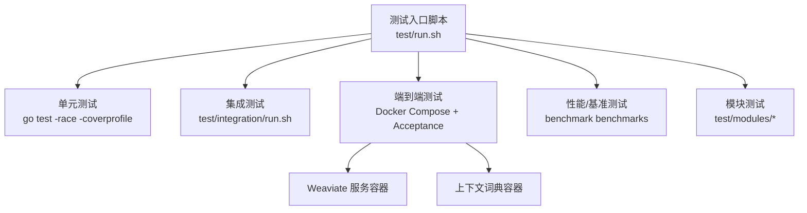
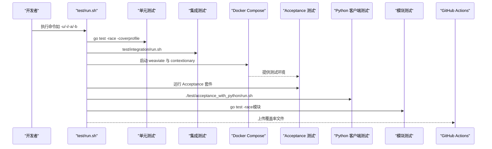
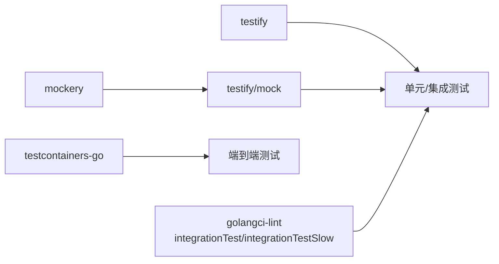

# 测试指南

<cite>
**本文引用的文件**
- [test/README.md](file://test/README.md)
- [test/run.sh](file://test/run.sh)
- [.golangci.yml](file://.golangci.yml)
- [.mockery.yaml](file://.mockery.yaml)
- [go.mod](file://go.mod)
- [codecov.yml](file://codecov.yml)
- [.github/workflows/pull_requests.yaml](file://.github/workflows/pull_requests.yaml)
- [docker-compose-test.yml](file://docker-compose-test.yml)
- [test/docker/docker.go](file://test/docker/docker.go)
- [test/docker/compose.go](file://test/docker/compose.go)
- [adapters/clients/client_test.go](file://adapters/clients/client_test.go)
- [adapters/clients/remote_index_test.go](file://adapters/clients/remote_index_test.go)
- [adapters/clients/replication_test.go](file://adapters/clients/replication_test.go)
- [adapters/repos/db/multi_shard_integration_test.go](file://adapters/repos/db/multi_shard_integration_test.go)
- [adapters/repos/db/index_integration_test.go](file://adapters/repos/db/index_integration_test.go)
- [adapters/repos/db/hybrid_search_test.go](file://adapters/repos/db/hybrid_search_test.go)
- [adapters/repos/db/lsmkv/segment_serialization_benchmarks_test.go](file://adapters/repos/db/lsmkv/segment_serialization_benchmarks_test.go)
- [cluster/schema/schema_thread_safety_test.go](file://cluster/schema/schema_thread_safety_test.go)
- [cluster/replication/mock_timer.go](file://cluster/replication/mock_timer.go)
- [cluster/replication/mock_time_provider.go](file://cluster/replication/mock_time_provider.go)
- [test/helper/backuptest/testdata.go](file://test/helper/backuptest/testdata.go)
- [test/helper/backuptest/testdata_test.go](file://test/helper/backuptest/testdata_test.go)
</cite>

## 目录
1. [引言](#引言)
2. [项目结构](#项目结构)
3. [核心组件](#核心组件)
4. [架构总览](#架构总览)
5. [详细组件分析](#详细组件分析)
6. [依赖分析](#依赖分析)
7. [性能考量](#性能考量)
8. [故障排查指南](#故障排查指南)
9. [结论](#结论)
10. [附录](#附录)

## 引言
本指南面向 Weaviate 的测试体系，系统阐述测试金字塔（单元测试、集成测试、端到端测试）的设计与实践，覆盖测试框架（testify、testify/mock、自定义测试助手）、测试数据准备与清理策略、性能与基准测试、覆盖率要求与报告、以及在持续集成中的执行流程与失败处理。文档同时给出数据库、API、模块等专项测试的注意事项，并提供调试技巧与常见问题解决方案。

## 项目结构
Weaviate 的测试体系由多层构成：
- 单元测试：位于各包内，使用 Go 原生 testing 包与 testify 断言库，部分场景使用 testify/mock 进行桩件与期望验证。
- 集成测试：通过脚本统一调度，按需选择是否包含向量化模块，覆盖 LSMKV、索引、混合检索等子系统。
- 端到端测试：基于 Docker Compose 启动 Weaviate 与上下文词典服务，运行 Acceptance 测试套件；另有 Python 客户端测试与模块测试。
- 性能与基准测试：提供 LSMKV 序列化等基准测试，支持 GC 压力指标上报。
- 持续集成：GitHub Actions 中分阶段执行单元与集成测试，收集覆盖率并上传至 Codecov。

图表来源
- [test/run.sh](file://test/run.sh#L128-L175)
- [docker-compose-test.yml](file://docker-compose-test.yml#L1-L51)

章节来源
- [test/README.md](file://test/README.md#L1-L23)
- [test/run.sh](file://test/run.sh#L1-L214)

## 核心组件
- 测试框架与断言
  - testify：断言与匹配器，广泛用于单元与集成测试中。
  - testify/mock：用于接口桩件与调用期望校验，配合 .mockery.yaml 自动生成桩文件。
- 测试数据与夹具
  - 固定 ID 的测试数据生成器，确保可重复性与可定位性。
  - 备份测试夹具，提供已知类名与对象集合。
- Docker 与容器编排
  - 使用 testcontainers-go 管理容器生命周期，便于端到端测试环境搭建与销毁。
- 覆盖率与 CI
  - 通过 go test -coverprofile 生成覆盖率文件，GitHub Actions 下载并上传至 Codecov。

章节来源
- [go.mod](file://go.mod#L76-L76)
- [.mockery.yaml](file://.mockery.yaml#L1-L120)
- [test/helper/backuptest/testdata.go](file://test/helper/backuptest/testdata.go#L334-L392)
- [test/docker/docker.go](file://test/docker/docker.go#L26-L107)
- [codecov.yml](file://codecov.yml#L1-L9)
- [.github/workflows/pull_requests.yaml](file://.github/workflows/pull_requests.yaml#L725-L757)

## 架构总览
下图展示测试执行的总体流程与关键交互点：

图表来源
- [test/run.sh](file://test/run.sh#L128-L182)
- [docker-compose-test.yml](file://docker-compose-test.yml#L1-L51)
- [.github/workflows/pull_requests.yaml](file://.github/workflows/pull_requests.yaml#L725-L757)

## 详细组件分析

### 测试金字塔设计原则
- 单元测试
  - 范围：函数级、结构体方法级、小模块内部逻辑。
  - 特点：快速、稳定、可重复；使用 testify 断言与 testify/mock 接口桩。
  - 示例文件路径：[adapters/clients/client_test.go](file://adapters/clients/client_test.go)，[adapters/clients/remote_index_test.go](file://adapters/clients/remote_index_test.go)，[adapters/clients/replication_test.go](file://adapters/clients/replication_test.go)。
- 集成测试
  - 范围：跨模块协作、存储子系统（LSMKV、索引）、混合检索等。
  - 特点：通过脚本控制是否启用向量化模块，覆盖慢速但关键路径。
  - 示例文件路径：[adapters/repos/db/multi_shard_integration_test.go](file://adapters/repos/db/multi_shard_integration_test.go)，[adapters/repos/db/index_integration_test.go](file://adapters/repos/db/index_integration_test.go)，[adapters/repos/db/hybrid_search_test.go](file://adapters/repos/db/hybrid_search_test.go)。
- 端到端测试
  - 范围：真实 API 行为、多节点集群、授权与认证、备份/恢复、模块功能。
  - 特点：基于 Docker Compose 启动完整环境，使用 testcontainers-go 管理容器。
  - 示例文件路径：[test/docker/docker.go](file://test/docker/docker.go#L26-L107)，[test/docker/compose.go](file://test/docker/compose.go#L1-L25)。

章节来源
- [adapters/clients/client_test.go](file://adapters/clients/client_test.go)
- [adapters/clients/remote_index_test.go](file://adapters/clients/remote_index_test.go)
- [adapters/clients/replication_test.go](file://adapters/clients/replication_test.go)
- [adapters/repos/db/multi_shard_integration_test.go](file://adapters/repos/db/multi_shard_integration_test.go#L12-L31)
- [adapters/repos/db/index_integration_test.go](file://adapters/repos/db/index_integration_test.go#L12-L30)
- [adapters/repos/db/hybrid_search_test.go](file://adapters/repos/db/hybrid_search_test.go#L12-L28)
- [test/docker/docker.go](file://test/docker/docker.go#L26-L107)
- [test/docker/compose.go](file://test/docker/compose.go#L1-L25)

### 测试框架与自定义助手
- testify 与 testify/mock
  - 断言与匹配：assert、require、mock。
  - 接口桩：通过 .mockery.yaml 配置生成，覆盖 cluster/schema、usecases/replica、adapters/repos/db 等关键接口。
  - 示例文件路径：[cluster/replication/mock_timer.go](file://cluster/replication/mock_timer.go#L84-L96)，[cluster/replication/mock_time_provider.go](file://cluster/replication/mock_time_provider.go#L80-L92)。
- 自定义测试助手
  - Docker 编排：DockerCompose、DockerContainer 封装容器生命周期管理。
  - 固定数据集：FixedTestData 提供确定性 ID 与属性，便于断言与回归。
  - 示例文件路径：[test/docker/docker.go](file://test/docker/docker.go#L26-L107)，[test/helper/backuptest/testdata.go](file://test/helper/backuptest/testdata.go#L334-L392)。

章节来源
- [.mockery.yaml](file://.mockery.yaml#L1-L120)
- [cluster/replication/mock_timer.go](file://cluster/replication/mock_timer.go#L84-L96)
- [cluster/replication/mock_time_provider.go](file://cluster/replication/mock_time_provider.go#L80-L92)
- [test/docker/docker.go](file://test/docker/docker.go#L26-L107)
- [test/helper/backuptest/testdata.go](file://test/helper/backuptest/testdata.go#L334-L392)

### 测试数据准备与清理策略
- 数据准备
  - 使用固定 ID 的测试数据生成器，保证断言一致性与可重复性。
  - 在端到端测试前，可通过脚本导入测试夹具或在测试内独立初始化所需状态。
- 清理策略
  - 测试脚本启动前清理 data 目录，避免历史状态影响。
  - Docker 容器在测试结束后终止并移除网络，防止资源泄漏。
- 示例文件路径：[test/helper/backuptest/testdata_test.go](file://test/helper/backuptest/testdata_test.go#L317-L344)，[test/run.sh](file://test/run.sh#L124-L126)，[test/docker/docker.go](file://test/docker/docker.go#L35-L48)。

章节来源
- [test/helper/backuptest/testdata_test.go](file://test/helper/backuptest/testdata_test.go#L317-L344)
- [test/run.sh](file://test/run.sh#L124-L126)
- [test/docker/docker.go](file://test/docker/docker.go#L35-L48)

### 性能测试与基准测试
- 基准测试
  - 提供 LSMKV 段序列化等基准测试，支持 GC 压力指标上报（num/op）。
  - 示例文件路径：[adapters/repos/db/lsmkv/segment_serialization_benchmarks_test.go](file://adapters/repos/db/lsmkv/segment_serialization_benchmarks_test.go#L106-L142)。
- 并发测试
  - 通过 goroutine 并发访问共享资源，验证线程安全与竞态条件。
  - 示例文件路径：[cluster/schema/schema_thread_safety_test.go](file://cluster/schema/schema_thread_safety_test.go#L266-L302)。

章节来源
- [adapters/repos/db/lsmkv/segment_serialization_benchmarks_test.go](file://adapters/repos/db/lsmkv/segment_serialization_benchmarks_test.go#L106-L142)
- [cluster/schema/schema_thread_safety_test.go](file://cluster/schema/schema_thread_safety_test.go#L266-L302)

### 覆盖率要求与报告生成
- 覆盖率生成
  - 单元测试使用 -coverprofile 生成覆盖率文件；集成测试通过不同参数组合分别输出两份覆盖率文件。
- 报告上传
  - GitHub Actions 下载多个覆盖率文件并上传至 Codecov。
- 示例文件路径：[test/run.sh](file://test/run.sh#L242-L263)，[codecov.yml](file://codecov.yml#L1-L9)，[.github/workflows/pull_requests.yaml](file://.github/workflows/pull_requests.yaml#L729-L757)。

章节来源
- [test/run.sh](file://test/run.sh#L242-L263)
- [codecov.yml](file://codecov.yml#L1-L9)
- [.github/workflows/pull_requests.yaml](file://.github/workflows/pull_requests.yaml#L729-L757)

### 持续集成中的测试执行与失败处理
- 分阶段执行
  - 先执行单元测试与集成测试，再执行端到端测试与模块测试。
- 失败处理
  - 使用重试机制与清理命令，确保失败后环境可恢复。
- 示例文件路径：[test/run.sh](file://test/run.sh#L727-L728)，[.github/workflows/pull_requests.yaml](file://.github/workflows/pull_requests.yaml#L725-L757)。

章节来源
- [test/run.sh](file://test/run.sh#L727-L728)
- [.github/workflows/pull_requests.yaml](file://.github/workflows/pull_requests.yaml#L725-L757)

### 数据库测试、API 测试与模块测试的特殊考虑
- 数据库测试
  - 集成测试覆盖多分片、索引与混合检索，关注慢速路径与边界条件。
  - 示例文件路径：[adapters/repos/db/multi_shard_integration_test.go](file://adapters/repos/db/multi_shard_integration_test.go#L12-L31)，[adapters/repos/db/index_integration_test.go](file://adapters/repos/db/index_integration_test.go#L12-L30)，[adapters/repos/db/hybrid_search_test.go](file://adapters/repos/db/hybrid_search_test.go#L12-L28)。
- API 测试
  - 端到端测试通过 Docker Compose 提供真实 API 环境，覆盖 GraphQL、REST、gRPC 等接口。
  - 示例文件路径：[docker-compose-test.yml](file://docker-compose-test.yml#L1-L51)，[test/docker/docker.go](file://test/docker/docker.go#L26-L107)。
- 模块测试
  - 模块测试分为备份与离线加载两类，支持按模块筛选运行。
  - 示例文件路径：[test/run.sh](file://test/run.sh#L683-L732)。

章节来源
- [adapters/repos/db/multi_shard_integration_test.go](file://adapters/repos/db/multi_shard_integration_test.go#L12-L31)
- [adapters/repos/db/index_integration_test.go](file://adapters/repos/db/index_integration_test.go#L12-L30)
- [adapters/repos/db/hybrid_search_test.go](file://adapters/repos/db/hybrid_search_test.go#L12-L28)
- [docker-compose-test.yml](file://docker-compose-test.yml#L1-L51)
- [test/docker/docker.go](file://test/docker/docker.go#L26-L107)
- [test/run.sh](file://test/run.sh#L683-L732)

## 依赖分析
- 测试相关依赖
  - testify：断言与匹配。
  - testify/mock：接口桩件生成与期望校验。
  - testcontainers-go：容器生命周期管理。
  - mockery：根据接口生成桩文件。
- Linter 与构建标签
  - .golangci.yml 配置了构建标签 integrationTest/integrationTestSlow，用于区分集成测试与慢速集成测试。

图表来源
- [go.mod](file://go.mod#L76-L76)
- [.mockery.yaml](file://.mockery.yaml#L1-L120)
- [test/docker/docker.go](file://test/docker/docker.go#L22-L24)
- [.golangci.yml](file://.golangci.yml#L2-L6)

章节来源
- [go.mod](file://go.mod#L76-L76)
- [.mockery.yaml](file://.mockery.yaml#L1-L120)
- [test/docker/docker.go](file://test/docker/docker.go#L22-L24)
- [.golangci.yml](file://.golangci.yml#L2-L6)

## 性能考量
- 基准测试
  - 使用 go test -bench 与 runtime.MemStats 上报 GC 压力指标，便于对比不同实现的内存与吞吐差异。
- 并发测试
  - 通过 goroutine 并发访问共享资源，验证锁与无锁结构的正确性与稳定性。
- 端到端性能
  - 通过 Docker Compose 启动真实服务，结合指标监控评估整体性能表现。

章节来源
- [adapters/repos/db/lsmkv/segment_serialization_benchmarks_test.go](file://adapters/repos/db/lsmkv/segment_serialization_benchmarks_test.go#L106-L142)
- [cluster/schema/schema_thread_safety_test.go](file://cluster/schema/schema_thread_safety_test.go#L266-L302)
- [docker-compose-test.yml](file://docker-compose-test.yml#L38-L42)

## 故障排查指南
- 常见问题
  - 容器无法启动：检查 Docker Compose 网络与端口映射，确认环境变量设置。
  - 覆盖率缺失：确认覆盖率文件生成与上传步骤，检查 CI 工作流中的下载与合并。
  - 并发竞态：开启 -race 检测，定位共享状态访问问题。
- 调试技巧
  - 使用 testcontainers-go 的容器日志与停止/重启能力，隔离问题范围。
  - 在端到端测试前清理 data 目录，避免历史状态干扰。
- 示例文件路径：[test/docker/docker.go](file://test/docker/docker.go#L35-L48)，[test/run.sh](file://test/run.sh#L124-L126)，[test/run.sh](file://test/run.sh#L727-L728)。

章节来源
- [test/docker/docker.go](file://test/docker/docker.go#L35-L48)
- [test/run.sh](file://test/run.sh#L124-L126)
- [test/run.sh](file://test/run.sh#L727-L728)

## 结论
Weaviate 的测试体系以 test/run.sh 为核心入口，结合 testify/testify/mock、testcontainers-go 与 .mockery.yaml，形成从单元到端到端的完整测试金字塔。通过 Docker Compose 提供真实环境，借助覆盖率与 CI 流水线保障质量。性能与并发测试进一步完善了稳定性与可靠性保障。建议在新增功能时遵循“先单元、再集成、最后端到端”的顺序，并优先使用固定 ID 的测试数据与接口桩件，提升可维护性与可重复性。

## 附录
- 快速参考
  - 单元测试：./test/run.sh -u
  - 集成测试：./test/run.sh -i（或 -ivpo/-iwvp）
  - 端到端测试：./test/run.sh -a（或 -aof/-aog/-aor/-aoar 等）
  - 模块测试：./test/run.sh -m/-mob/-meb/-om{模块名}
  - 基准测试：./test/run.sh -b
- 关键文件清单
  - 测试入口：[test/run.sh](file://test/run.sh#L1-L214)
  - 端到端环境：[docker-compose-test.yml](file://docker-compose-test.yml#L1-L51)
  - 覆盖率上传：[codecov.yml](file://codecov.yml#L1-L9)，[pull_requests.yaml](file://.github/workflows/pull_requests.yaml#L729-L757)
  - 接口桩配置：[.mockery.yaml](file://.mockery.yaml#L1-L120)
  - Linter 构建标签：[.golangci.yml](file://.golangci.yml#L2-L6)