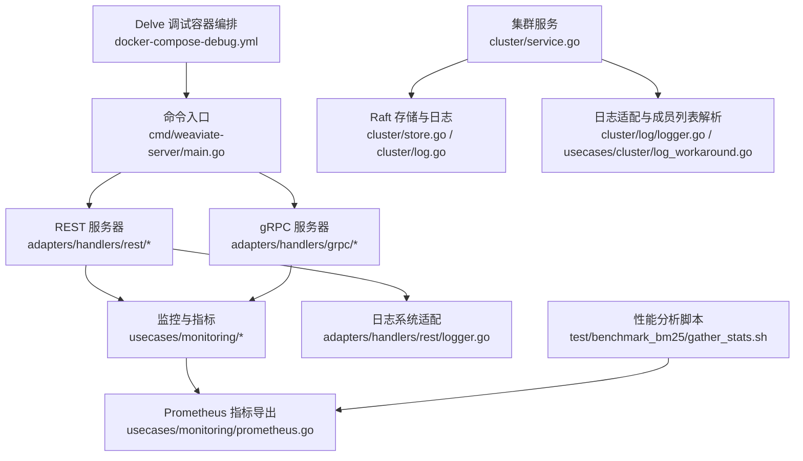
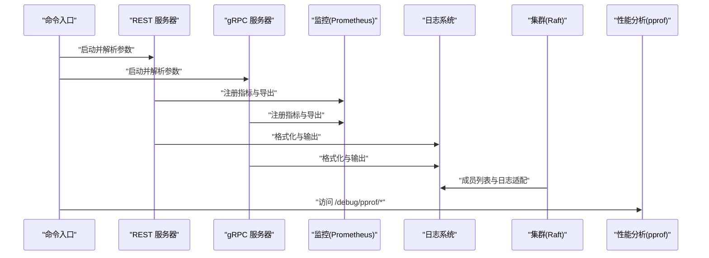
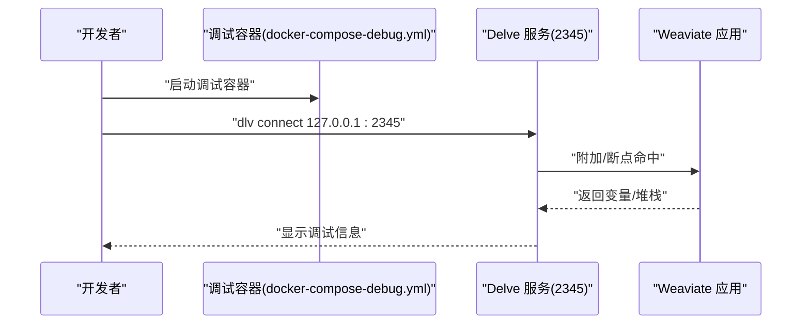
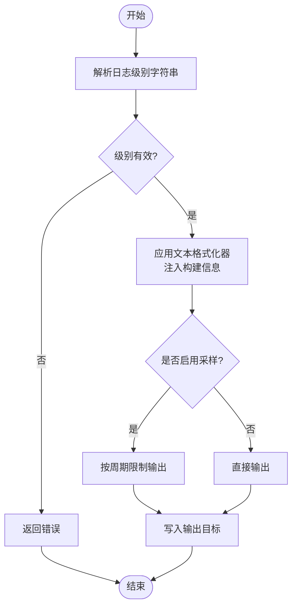
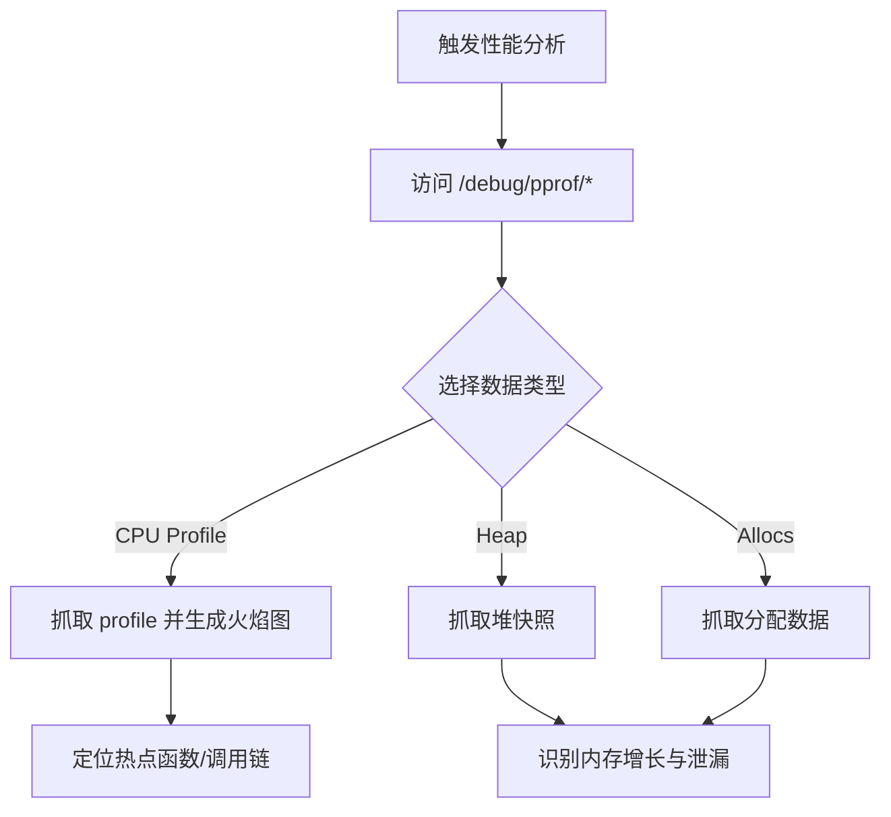
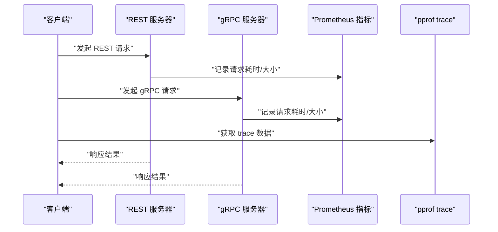
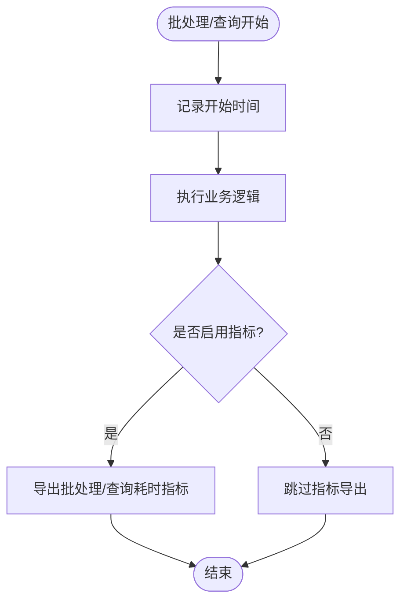
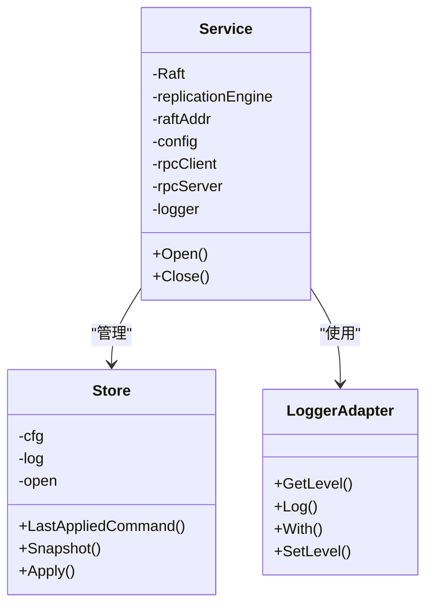
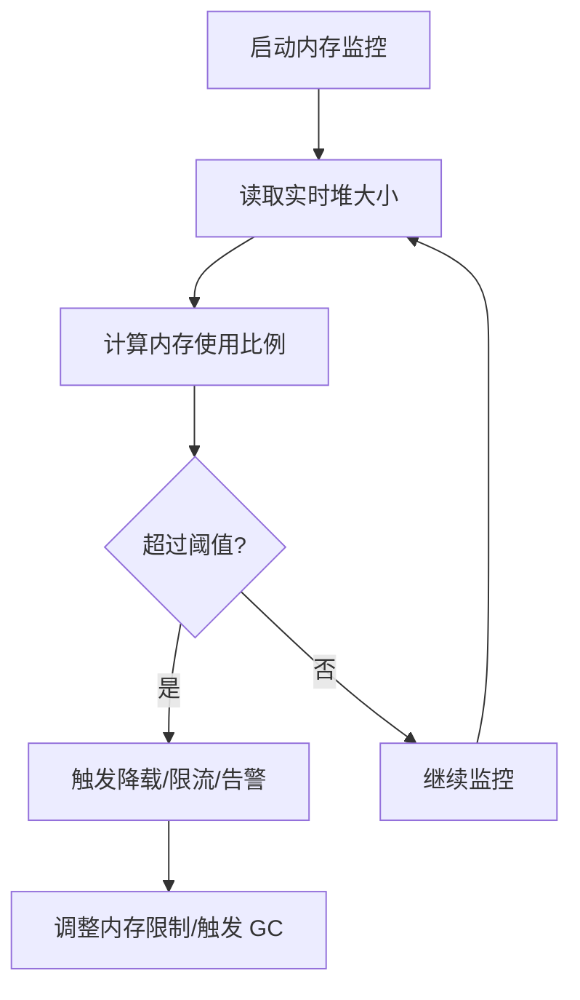
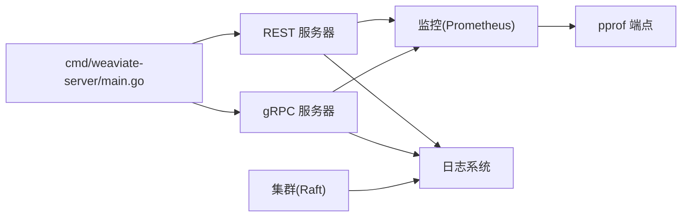

# 调试工具与技巧

<cite>
**本文引用的文件**
- [cmd/weaviate-server/main.go](file://cmd/weaviate-server/main.go)
- [docker-compose-debug.yml](file://docker-compose-debug.yml)
- [cluster/log/logger.go](file://cluster/log/logger.go)
- [adapters/handlers/rest/logger.go](file://adapters/handlers/rest/logger.go)
- [usecases/logrusext/sampling.go](file://usecases/logrusext/sampling.go)
- [usecases/cluster/log_workaround.go](file://usecases/cluster/log_workaround.go)
- [test/benchmark_bm25/gather_stats.sh](file://test/benchmark_bm25/gather_stats.sh)
- [tools/dev/delve_connect.sh](file://tools/dev/delve_connect.sh)
- [adapters/handlers/rest/requests_total_metrics.go](file://adapters/handlers/rest/requests_total_metrics.go)
- [adapters/repos/db/metrics.go](file://adapters/repos/db/metrics.go)
- [usecases/config/environment.go](file://usecases/config/environment.go)
- [adapters/handlers/rest/configure_api.go](file://adapters/handlers/rest/configure_api.go)
- [usecases/monitoring/prometheus.go](file://usecases/monitoring/prometheus.go)
- [usecases/monitoring/grpc.go](file://usecases/monitoring/grpc.go)
- [usecases/memwatch/monitor_test.go](file://usecases/memwatch/monitor_test.go)
- [cluster/service.go](file://cluster/service.go)
- [cluster/store.go](file://cluster/store.go)
- [cluster/log.go](file://cluster/log.go)
- [test/acceptance/grpc/batching_test.go](file://test/acceptance/grpc/batching_test.go)
- [tools/dev/config.local-development.yaml](file://tools/dev/config.local-development.yaml)
- [tools/dev/config.runtime-overrides.yaml](file://tools/dev/config.runtime-overrides.yaml)
</cite>

## 目录
1. [简介](#简介)
2. [项目结构](#项目结构)
3. [核心组件](#核心组件)
4. [架构总览](#架构总览)
5. [详细组件分析](#详细组件分析)
6. [依赖关系分析](#依赖关系分析)
7. [性能考量](#性能考量)
8. [故障排查指南](#故障排查指南)
9. [结论](#结论)
10. [附录](#附录)

## 简介
本指南面向 Weaviate 的开发者与运维工程师，系统性介绍如何在本地与生产环境中进行高效调试。内容覆盖：
- 使用 Delve 进行源码级调试（断点、变量检查、堆栈跟踪）
- 日志系统配置与优化（级别、格式化、输出目标、采样）
- 性能分析工具链（pprof、trace、火焰图、内存分析）
- 网络调试（REST/gRPC API 调试、延迟分析、流式响应校验）
- 数据库调试（查询耗时、批处理指标、索引与向量维度）
- 分布式系统调试（Raft 协议、集群状态、复制与快照）
- 内存泄漏检测与性能瓶颈定位
- 生产环境调试安全与最佳实践

## 项目结构
Weaviate 的调试能力由多层协作实现：入口程序负责启动服务与参数解析；REST/gRPC 层暴露 API 并集成监控；日志系统统一采集与格式化；集群层提供 Raft 一致性与复制；测试脚本与开发工具提供性能分析与连接调试。

**图表来源**
- [cmd/weaviate-server/main.go](file://cmd/weaviate-server/main.go#L30-L67)
- [adapters/handlers/rest/configure_api.go](file://adapters/handlers/rest/configure_api.go#L253-L280)
- [usecases/monitoring/prometheus.go](file://usecases/monitoring/prometheus.go#L438-L462)
- [adapters/handlers/rest/logger.go](file://adapters/handlers/rest/logger.go#L60-L91)
- [cluster/service.go](file://cluster/service.go#L46-L70)
- [cluster/store.go](file://cluster/store.go#L194-L200)
- [cluster/log.go](file://cluster/log.go#L21-L48)
- [docker-compose-debug.yml](file://docker-compose-debug.yml#L1-L45)
- [test/benchmark_bm25/gather_stats.sh](file://test/benchmark_bm25/gather_stats.sh#L1-L43)

**章节来源**
- [cmd/weaviate-server/main.go](file://cmd/weaviate-server/main.go#L30-L67)
- [docker-compose-debug.yml](file://docker-compose-debug.yml#L1-L45)

## 核心组件
- 入口与参数解析：命令入口负责加载 Swagger 规范、创建 REST 服务器、解析命令行参数并启动服务。
- 日志系统：统一采用 logrus，并通过适配器桥接至 hclog 接口，支持级别映射、字段注入与格式化。
- 监控与指标：REST/gRPC 服务器集成 Prometheus 指标，包含请求耗时、请求体/响应体大小、并发请求数等。
- 集群与 Raft：集群服务封装 Raft 层，管理复制引擎、gRPC 客户端/服务端、日志与快照。
- 性能分析：内置 pprof HTTP 端点，配合脚本抓取 CPU/堆/分配数据，生成火焰图。
- 开发调试：提供 Delve 连接脚本与调试容器编排，便于远程或本地源码级调试。

**章节来源**
- [cmd/weaviate-server/main.go](file://cmd/weaviate-server/main.go#L30-L67)
- [adapters/handlers/rest/logger.go](file://adapters/handlers/rest/logger.go#L60-L91)
- [adapters/handlers/rest/configure_api.go](file://adapters/handlers/rest/configure_api.go#L253-L280)
- [usecases/monitoring/prometheus.go](file://usecases/monitoring/prometheus.go#L254-L289)
- [cluster/service.go](file://cluster/service.go#L46-L70)
- [test/benchmark_bm25/gather_stats.sh](file://test/benchmark_bm25/gather_stats.sh#L1-L43)

## 架构总览
下图展示调试相关组件在运行时的交互关系：入口程序启动 REST/gRPC 服务器；REST 层注册 Prometheus 指标；日志系统统一输出；集群层通过 Raft 提供一致性与复制；性能分析脚本通过 pprof 抓取数据。

**图表来源**
- [cmd/weaviate-server/main.go](file://cmd/weaviate-server/main.go#L30-L67)
- [adapters/handlers/rest/configure_api.go](file://adapters/handlers/rest/configure_api.go#L253-L280)
- [adapters/handlers/rest/logger.go](file://adapters/handlers/rest/logger.go#L60-L91)
- [cluster/log/logger.go](file://cluster/log/logger.go#L25-L30)
- [test/benchmark_bm25/gather_stats.sh](file://test/benchmark_bm25/gather_stats.sh#L18-L31)

## 详细组件分析

### Delve 调试器使用
- 启动方式：使用调试镜像与端口映射，开启 Delve 的 headless 服务端口，便于外部连接。
- 连接方式：提供脚本一键连接到本地 2345 端口，适合 VS Code 或 dlv 命令行客户端。
- 断点与堆栈：在关键路径（如 REST/gRPC 处理函数、集群状态机）设置断点，结合变量检查与堆栈跟踪定位问题。
- 最佳实践：优先在最小复现场景中启用 Delve，避免在高负载生产节点上长期驻留调试器。

**图表来源**
- [docker-compose-debug.yml](file://docker-compose-debug.yml#L10-L16)
- [tools/dev/delve_connect.sh](file://tools/dev/delve_connect.sh#L5-L7)

**章节来源**
- [docker-compose-debug.yml](file://docker-compose-debug.yml#L1-L45)
- [tools/dev/delve_connect.sh](file://tools/dev/delve_connect.sh#L1-L7)

### 日志系统配置与使用
- 日志级别：支持 trace、debug、info、warn、error、fatal 等级别，字符串到级别转换逻辑清晰。
- 格式化：REST 文本格式化器注入构建信息（版本、Git 提交、Go 版本），便于审计与排障。
- 输出目标：默认输出到标准输出，可结合容器日志收集系统集中管理。
- 采样控制：提供日志采样器，限制高频日志在固定周期内的输出数量，降低噪声。
- 成员列表日志适配：对第三方库的日志进行正则解析并映射到统一级别，确保日志一致性。

**图表来源**
- [adapters/handlers/rest/logger.go](file://adapters/handlers/rest/logger.go#L70-L91)
- [adapters/handlers/rest/logger.go](file://adapters/handlers/rest/logger.go#L60-L66)
- [usecases/logrusext/sampling.go](file://usecases/logrusext/sampling.go#L33-L57)
- [usecases/cluster/log_workaround.go](file://usecases/cluster/log_workaround.go#L25-L53)

**章节来源**
- [adapters/handlers/rest/logger.go](file://adapters/handlers/rest/logger.go#L60-L91)
- [usecases/logrusext/sampling.go](file://usecases/logrusext/sampling.go#L1-L57)
- [usecases/cluster/log_workaround.go](file://usecases/cluster/log_workaround.go#L1-L53)

### 性能分析工具（pprof、trace、内存分析）
- pprof 端点：内置 HTTP 端点提供 profile、heap、allocs 等数据抓取。
- 自动化脚本：提供一键抓取 CPU/堆/分配数据并生成火焰图的脚本，便于快速定位热点。
- trace：可通过 pprof 访问 trace 数据，结合 Go runtime trace 工具进行细粒度分析。
- 内存分析：结合采样与阈值，定位异常增长与泄漏风险。

**图表来源**
- [test/benchmark_bm25/gather_stats.sh](file://test/benchmark_bm25/gather_stats.sh#L18-L41)

**章节来源**
- [test/benchmark_bm25/gather_stats.sh](file://test/benchmark_bm25/gather_stats.sh#L1-L43)

### 网络调试（API、gRPC、延迟）
- REST API：通过 Prometheus 指标观察请求耗时、请求体/响应体大小、并发请求数，定位慢查询与异常流量。
- gRPC：启用拦截器统计请求耗时与大小，结合服务/方法维度聚合，快速发现异常端点。
- 流式响应：在批量测试中读取流式响应，验证无错误返回，辅助定位网络中断或协议异常。
- 延迟分析：结合 pprof trace 与指标，分析请求在各阶段的耗时分布。

**图表来源**
- [adapters/handlers/rest/configure_api.go](file://adapters/handlers/rest/configure_api.go#L253-L280)
- [usecases/monitoring/prometheus.go](file://usecases/monitoring/prometheus.go#L254-L289)
- [usecases/monitoring/grpc.go](file://usecases/monitoring/grpc.go#L57-L96)
- [test/acceptance/grpc/batching_test.go](file://test/acceptance/grpc/batching_test.go#L197-L224)

**章节来源**
- [adapters/handlers/rest/configure_api.go](file://adapters/handlers/rest/configure_api.go#L253-L280)
- [usecases/monitoring/prometheus.go](file://usecases/monitoring/prometheus.go#L254-L289)
- [usecases/monitoring/grpc.go](file://usecases/monitoring/grpc.go#L57-L96)
- [test/acceptance/grpc/batching_test.go](file://test/acceptance/grpc/batching_test.go#L197-L224)

### 数据库调试（查询计划与索引性能）
- 批处理指标：记录批处理耗时、删除耗时、对象数量、字节数等，便于定位批操作瓶颈。
- 查询耗时：针对过滤向量、向量检索、对象获取等操作提供独立耗时指标。
- 维度与分组：支持按类名/分片分组导出指标，减少指标爆炸并提升可观测性。
- 环境变量：通过环境变量控制指标分组、命名空间、关键桶等，满足不同场景需求。

**图表来源**
- [adapters/repos/db/metrics.go](file://adapters/repos/db/metrics.go#L76-L130)
- [usecases/config/environment.go](file://usecases/config/environment.go#L72-L107)
- [adapters/handlers/rest/requests_total_metrics.go](file://adapters/handlers/rest/requests_total_metrics.go#L74-L123)

**章节来源**
- [adapters/repos/db/metrics.go](file://adapters/repos/db/metrics.go#L76-L130)
- [usecases/config/environment.go](file://usecases/config/environment.go#L72-L107)
- [adapters/handlers/rest/requests_total_metrics.go](file://adapters/handlers/rest/requests_total_metrics.go#L74-L123)

### 分布式系统调试（Raft 协议与集群状态）
- 集群服务：封装 Raft 层，管理复制引擎、gRPC 客户端/服务端、日志与快照。
- Raft 存储：维护日志索引、快照与一致性等待超时，提供最后应用命令索引查询。
- 日志适配：对第三方库日志进行解析与级别映射，保证统一输出。
- 集群状态：通过日志与指标观测节点加入/离开、领导者变更、快照与复制进度。

**图表来源**
- [cluster/service.go](file://cluster/service.go#L46-L70)
- [cluster/store.go](file://cluster/store.go#L194-L200)
- [cluster/log.go](file://cluster/log.go#L21-L48)
- [cluster/log/logger.go](file://cluster/log/logger.go#L25-L30)

**章节来源**
- [cluster/service.go](file://cluster/service.go#L46-L70)
- [cluster/store.go](file://cluster/store.go#L194-L200)
- [cluster/log.go](file://cluster/log.go#L21-L48)
- [cluster/log/logger.go](file://cluster/log/logger.go#L25-L30)

### 内存泄漏检测与性能瓶颈分析
- 内存估算与阈值：通过环境变量设置对象删除内存估算值，结合实时堆读取与内存限制设置，动态评估内存压力。
- 映射上限：读取系统最大内存映射数，防止因映射过多导致性能退化或崩溃。
- 监控与告警：结合 Prometheus 指标与 pprof 堆快照，定位异常增长与泄漏根因。

**图表来源**
- [usecases/memwatch/monitor_test.go](file://usecases/memwatch/monitor_test.go#L30-L44)
- [usecases/memwatch/monitor_test.go](file://usecases/memwatch/monitor_test.go#L98-L123)

**章节来源**
- [usecases/memwatch/monitor_test.go](file://usecases/memwatch/monitor_test.go#L1-L123)

### 生产环境调试的安全与最佳实践
- 最小权限原则：仅在必要时开启调试端口与日志级别，避免泄露敏感信息。
- 指标与日志脱敏：确保日志与指标中不包含敏感数据，必要时进行脱敏处理。
- 限流与采样：高频日志启用采样，避免对系统造成额外压力。
- 受控环境：优先在预生产或隔离环境进行深度调试，再逐步推广到生产。
- 审计与回放：保留必要的 trace 与指标，便于事后审计与问题复盘。

## 依赖关系分析
- 入口程序依赖 REST 与 gRPC 服务器，后者依赖监控模块导出指标。
- 日志系统依赖 logrus 与 hclog 适配器，统一输出格式与级别。
- 集群模块依赖 Raft、复制引擎与日志适配，保障一致性与可观测性。
- 性能分析脚本依赖 pprof 端点，结合 Prometheus 指标进行综合分析。

**图表来源**
- [cmd/weaviate-server/main.go](file://cmd/weaviate-server/main.go#L30-L67)
- [adapters/handlers/rest/configure_api.go](file://adapters/handlers/rest/configure_api.go#L253-L280)
- [adapters/handlers/rest/logger.go](file://adapters/handlers/rest/logger.go#L60-L91)
- [cluster/log/logger.go](file://cluster/log/logger.go#L25-L30)

**章节来源**
- [cmd/weaviate-server/main.go](file://cmd/weaviate-server/main.go#L30-L67)
- [adapters/handlers/rest/configure_api.go](file://adapters/handlers/rest/configure_api.go#L253-L280)

## 性能考量
- 指标分组：通过环境变量控制指标分组，减少指标数量，提升查询效率。
- 关键桶策略：仅导出关键桶，降低存储与查询开销。
- Go 运行时指标：替换默认 Go 收集器，聚焦调度延迟等关键指标。
- 批处理与查询：结合批处理耗时与查询耗时指标，定位热点路径与优化点。

**章节来源**
- [usecases/config/environment.go](file://usecases/config/environment.go#L72-L107)
- [adapters/handlers/rest/configure_api.go](file://adapters/handlers/rest/configure_api.go#L253-L280)
- [usecases/monitoring/prometheus.go](file://usecases/monitoring/prometheus.go#L438-L462)

## 故障排查指南
- 日志级别与格式：确认日志级别设置合理，必要时临时提升到 debug/trace；检查格式化器是否正确注入构建信息。
- 指标缺失：检查 Prometheus 是否启用、命名空间是否一致、是否启用了指标分组。
- gRPC 异常：查看拦截器记录的请求耗时与大小，结合 trace 定位异常端点。
- Raft 不一致：检查日志索引与快照状态，确认领导者变更与复制进度。
- 内存异常：结合堆快照与内存估算阈值，定位泄漏或过度增长的模块。

**章节来源**
- [adapters/handlers/rest/logger.go](file://adapters/handlers/rest/logger.go#L60-L91)
- [adapters/handlers/rest/configure_api.go](file://adapters/handlers/rest/configure_api.go#L253-L280)
- [usecases/monitoring/grpc.go](file://usecases/monitoring/grpc.go#L57-L96)
- [cluster/log.go](file://cluster/log.go#L21-L48)
- [usecases/memwatch/monitor_test.go](file://usecases/memwatch/monitor_test.go#L30-L44)

## 结论
Weaviate 在调试方面提供了完善的基础设施：从 Delve 源码级调试、统一日志系统、Prometheus 指标、pprof 性能分析，到 Raft 分布式一致性与复制监控，能够覆盖从单机到集群的全场景调试需求。建议在生产环境中遵循最小权限与受控原则，结合指标与日志进行持续观测，遇到复杂问题时再启用更深入的调试手段。

## 附录
- 开发配置示例：本地开发配置与运行时覆盖项可用于快速启用调试功能与观测指标。
- 调试容器：调试容器编排文件提供端口映射与环境变量，便于一键启动调试环境。

**章节来源**
- [tools/dev/config.local-development.yaml](file://tools/dev/config.local-development.yaml#L1-L31)
- [tools/dev/config.runtime-overrides.yaml](file://tools/dev/config.runtime-overrides.yaml#L1-L24)
- [docker-compose-debug.yml](file://docker-compose-debug.yml#L1-L45)