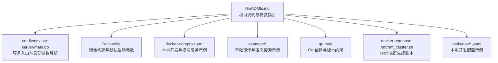
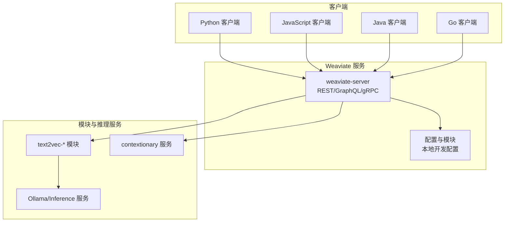
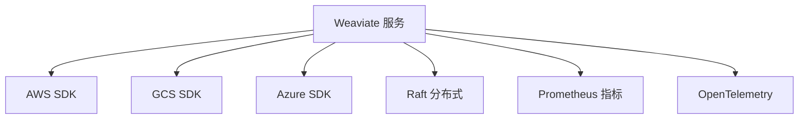
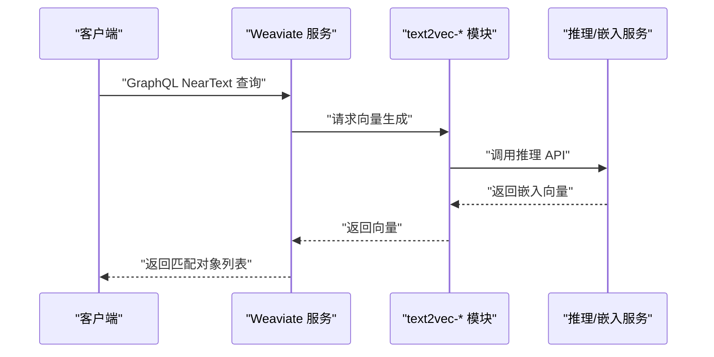

# 快速开始

<cite>
**本文引用的文件**
- [README.md](file://README.md)
- [Dockerfile](file://Dockerfile)
- [docker-compose.yml](file://docker-compose.yml)
- [cmd/weaviate-server/main.go](file://cmd/weaviate-server/main.go)
- [example/basic_weaviate_test.go](file://example/basic_weaviate_test.go)
- [example/semantic_search_simple_test.go](file://example/semantic_search_simple_test.go)
- [go.mod](file://go.mod)
- [docker-compose-raft/raft_cluster.sh](file://docker-compose-raft/raft_cluster.sh)
- [tools/dev/config.local-development.yaml](file://tools/dev/config.local-development.yaml)
- [tools/dev/config.local-customdb.yaml](file://tools/dev/config.local-customdb.yaml)
</cite>

## 目录
1. [简介](#简介)
2. [项目结构](#项目结构)
3. [核心组件](#核心组件)
4. [架构总览](#架构总览)
5. [详细组件分析](#详细组件分析)
6. [依赖分析](#依赖分析)
7. [性能考虑](#性能考虑)
8. [故障排除指南](#故障排除指南)
9. [结论](#结论)
10. [附录](#附录)

## 简介
本指南面向初学者，帮助你在最短时间内完成 Weaviate 向量数据库的安装与上手，覆盖以下内容：
- 安装方式：Docker 本地安装、Kubernetes 部署指引、本地开发环境搭建
- 基本使用：创建集合、插入数据、执行语义搜索的完整流程
- 多语言客户端集成：Python、JavaScript/TypeScript、Java、Go
- 常见配置项与最佳实践
- 常见问题与故障排除

Weaviate 是一个开源、云原生的向量数据库，支持向量相似性搜索与关键词过滤、RAG 与重排序等能力，适合构建语义搜索、推荐、聊天机器人等应用。

## 项目结构
仓库提供了服务入口、示例测试、Docker 镜像构建、开发配置与集群脚本等关键文件，便于你从零开始搭建与验证环境。

图表来源
- [README.md](file://README.md#L1-L181)
- [cmd/weaviate-server/main.go](file://cmd/weaviate-server/main.go#L1-L69)
- [Dockerfile](file://Dockerfile#L1-L57)
- [docker-compose.yml](file://docker-compose.yml#L1-L140)
- [go.mod](file://go.mod#L1-L274)
- [docker-compose-raft/raft_cluster.sh](file://docker-compose-raft/raft_cluster.sh#L1-L52)
- [tools/dev/config.local-development.yaml](file://tools/dev/config.local-development.yaml#L1-L31)
- [tools/dev/config.local-customdb.yaml](file://tools/dev/config.local-customdb.yaml#L1-L31)

章节来源
- [README.md](file://README.md#L1-L181)
- [cmd/weaviate-server/main.go](file://cmd/weaviate-server/main.go#L1-L69)
- [Dockerfile](file://Dockerfile#L1-L57)
- [docker-compose.yml](file://docker-compose.yml#L1-L140)
- [go.mod](file://go.mod#L1-L274)
- [docker-compose-raft/raft_cluster.sh](file://docker-compose-raft/raft_cluster.sh#L1-L52)
- [tools/dev/config.local-development.yaml](file://tools/dev/config.local-development.yaml#L1-L31)
- [tools/dev/config.local-customdb.yaml](file://tools/dev/config.local-customdb.yaml#L1-L31)

## 核心组件
- 服务入口与启动：通过命令行参数解析与 Swagger 规范初始化 REST API 服务，默认监听 8080 端口。
- 容器化运行：Dockerfile 定义了开发镜像与默认启动参数，便于本地与 CI 环境运行。
- 开发与示例：示例测试展示了连接、创建集合、插入数据、执行 GraphQL 查询与近邻搜索等常用流程。
- 配置与模块：本地开发配置示例展示了认证、上下文词典、查询默认限制等关键项；compose 文件展示了多种嵌入与推理服务的组合。

章节来源
- [cmd/weaviate-server/main.go](file://cmd/weaviate-server/main.go#L30-L66)
- [Dockerfile](file://Dockerfile#L50-L57)
- [example/basic_weaviate_test.go](file://example/basic_weaviate_test.go#L14-L118)
- [example/semantic_search_simple_test.go](file://example/semantic_search_simple_test.go#L18-L127)
- [tools/dev/config.local-development.yaml](file://tools/dev/config.local-development.yaml#L1-L31)
- [docker-compose.yml](file://docker-compose.yml#L10-L140)

## 架构总览
下图展示了从客户端到 Weaviate 服务与模块服务的典型交互路径，以及本地开发时嵌入/推理服务的协作关系。

图表来源
- [README.md](file://README.md#L31-L96)
- [docker-compose.yml](file://docker-compose.yml#L10-L140)
- [tools/dev/config.local-development.yaml](file://tools/dev/config.local-development.yaml#L1-L31)

## 详细组件分析

### 安装与部署

- Docker 本地安装
  - 使用 compose 文件启动 Weaviate 与多种推理/嵌入服务，便于本地体验向量化与语义搜索。
  - 默认暴露 REST 端口，可通过环境变量启用模块与推理服务地址。
  
  章节来源
  - [README.md](file://README.md#L31-L54)
  - [docker-compose.yml](file://docker-compose.yml#L10-L140)

- Kubernetes 部署
  - 仓库提供安装与部署指引链接，建议参考官方文档以获取最新 YAML 与 Helm 配置。
  
  章节来源
  - [README.md](file://README.md#L23-L25)

- 本地开发环境
  - 使用本地开发配置文件启用匿名访问、上下文词典、查询默认限制等，便于快速验证。
  
  章节来源
  - [tools/dev/config.local-development.yaml](file://tools/dev/config.local-development.yaml#L1-L31)
  - [tools/dev/config.local-customdb.yaml](file://tools/dev/config.local-customdb.yaml#L1-L31)

- Raft 集群
  - 提供脚本用于生成多节点 Raft 集群的 compose 文件，并支持动态扩缩容。
  
  章节来源
  - [docker-compose-raft/raft_cluster.sh](file://docker-compose-raft/raft_cluster.sh#L1-L52)

### 基本使用流程

- 连接与模式管理
  - 通过客户端连接本地服务，先检查现有模式，再创建集合（Class），设置属性与向量化器。
  
  章节来源
  - [example/basic_weaviate_test.go](file://example/basic_weaviate_test.go#L14-L68)

- 插入数据
  - 构造对象数组，批量写入，校验插入结果。
  
  章节来源
  - [example/basic_weaviate_test.go](file://example/basic_weaviate_test.go#L70-L101)

- 执行语义搜索
  - 使用 GraphQL NearText/Hybrid 查询，返回匹配的对象列表。
  
  章节来源
  - [example/semantic_search_simple_test.go](file://example/semantic_search_simple_test.go#L18-L127)

- 向量维度验证
  - 查询对象的向量维度与数值范围，验证向量化结果。
  
  章节来源
  - [example/semantic_search_simple_test.go](file://example/semantic_search_simple_test.go#L179-L229)

### 多语言客户端集成

- Python
  - 安装客户端后，连接本地实例，创建集合，插入数据，执行 near_text 查询。
  
  章节来源
  - [README.md](file://README.md#L56-L96)

- JavaScript/TypeScript
  - 参考官方客户端文档，使用相同 REST/GraphQL 接口进行操作。
  
  章节来源
  - [README.md](file://README.md#L100-L108)

- Java
  - 参考官方客户端文档，使用相同 REST/GraphQL 接口进行操作。
  
  章节来源
  - [README.md](file://README.md#L100-L108)

- Go
  - 示例测试展示了 Go 客户端的连接、模式管理、批量写入与 GraphQL 查询。
  
  章节来源
  - [example/basic_weaviate_test.go](file://example/basic_weaviate_test.go#L14-L118)
  - [example/semantic_search_simple_test.go](file://example/semantic_search_simple_test.go#L18-L127)

### 服务启动与端口

- 服务入口
  - 通过命令行参数解析与 Swagger 规范初始化 REST 服务，支持帮助输出与自定义配置。
  
  章节来源
  - [cmd/weaviate-server/main.go](file://cmd/weaviate-server/main.go#L30-L66)

- Docker 默认启动
  - 镜像默认以 http 方式监听 8080 端口，便于本地访问。
  
  章节来源
  - [Dockerfile](file://Dockerfile#L50-L57)

### 本地开发配置要点

- 认证与匿名访问
  - 开发配置可启用匿名访问，便于快速上手。
  
  章节来源
  - [tools/dev/config.local-development.yaml](file://tools/dev/config.local-development.yaml#L1-L4)

- 上下文词典与查询默认限制
  - 指定 contextionary 服务地址与查询默认 limit，提升本地体验。
  
  章节来源
  - [tools/dev/config.local-development.yaml](file://tools/dev/config.local-development.yaml#L9-L18)

- 自定义持久化路径
  - 在自定义配置中指定数据目录，便于本地持久化。
  
  章节来源
  - [tools/dev/config.local-customdb.yaml](file://tools/dev/config.local-customdb.yaml#L11-L12)

## 依赖分析

- 语言与运行时
  - 服务端使用 Go 1.25 构建，容器镜像基于 Alpine。
  
  章节来源
  - [go.mod](file://go.mod#L273-L274)
  - [Dockerfile](file://Dockerfile#L50-L57)

- 关键外部依赖
  - 包含 AWS、GCS、Azure 存储 SDK，Raft 分布式一致性，Prometheus 指标，OpenTelemetry 链路追踪等。
  
  章节来源
  - [go.mod](file://go.mod#L3-L106)

图表来源
- [go.mod](file://go.mod#L3-L106)

## 性能考虑
- 向量索引与分片
  - 本地开发配置展示了向量索引开关、分片数量等参数，有助于理解性能调优方向。
  
  章节来源
  - [tools/dev/config.local-development.yaml](file://tools/dev/config.local-development.yaml#L4-L8)

- 查询默认限制
  - 通过查询默认 limit 控制单次返回数量，避免大结果集带来的延迟。
  
  章节来源
  - [tools/dev/config.local-development.yaml](file://tools/dev/config.local-development.yaml#L17-L18)

- 模块与推理服务
  - 将向量化与推理分离到独立容器，便于按需扩展与资源隔离。
  
  章节来源
  - [docker-compose.yml](file://docker-compose.yml#L10-L140)

## 故障排除指南

- 无法连接到 Weaviate
  - 确认服务已启动并监听 8080 端口；检查 compose 或容器日志。
  
  章节来源
  - [cmd/weaviate-server/main.go](file://cmd/weaviate-server/main.go#L30-L66)
  - [Dockerfile](file://Dockerfile#L50-L57)

- 语义搜索无结果或不稳定
  - 检查模块服务（如 Ollama/Inference）是否可用；确认向量化器配置与模型名称正确。
  
  章节来源
  - [example/semantic_search_simple_test.go](file://example/semantic_search_simple_test.go#L282-L286)
  - [docker-compose.yml](file://docker-compose.yml#L10-L140)

- 批量写入失败
  - 校验对象结构与属性类型；查看返回的错误信息定位问题。
  
  章节来源
  - [example/basic_weaviate_test.go](file://example/basic_weaviate_test.go#L90-L101)

- Raft 集群节点无法加入
  - 使用集群生成脚本创建 compose 文件；检查网络与端口映射；必要时增加投票节点数量。
  
  章节来源
  - [docker-compose-raft/raft_cluster.sh](file://docker-compose-raft/raft_cluster.sh#L1-L52)

## 结论
通过本指南，你可以：
- 快速完成 Weaviate 的本地安装与开发环境搭建
- 掌握创建集合、插入数据与执行语义搜索的基本流程
- 使用 Python、JavaScript、Java、Go 客户端进行集成
- 了解常见配置与性能优化方向，并具备初步的故障排除能力

建议在完成本地验证后，逐步引入生产所需的认证、备份、监控与高可用策略。

## 附录

### 常用命令与路径
- 启动本地服务（Docker）
  - 使用 compose 文件启动 Weaviate 与推理/嵌入服务
  
  章节来源
  - [README.md](file://README.md#L31-L54)
  - [docker-compose.yml](file://docker-compose.yml#L10-L140)

- 启动 Raft 集群
  - 生成多节点 compose 并按需扩缩容
  
  章节来源
  - [docker-compose-raft/raft_cluster.sh](file://docker-compose-raft/raft_cluster.sh#L42-L51)

### 参考流程图：语义搜索调用序列

图表来源
- [example/semantic_search_simple_test.go](file://example/semantic_search_simple_test.go#L18-L127)
- [docker-compose.yml](file://docker-compose.yml#L10-L140)