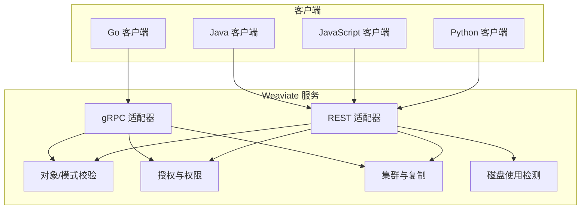
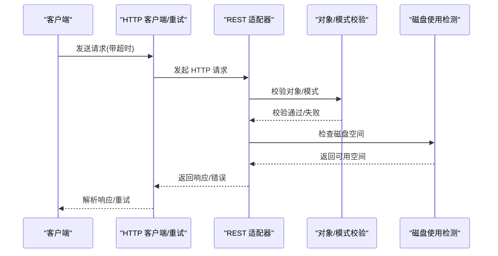
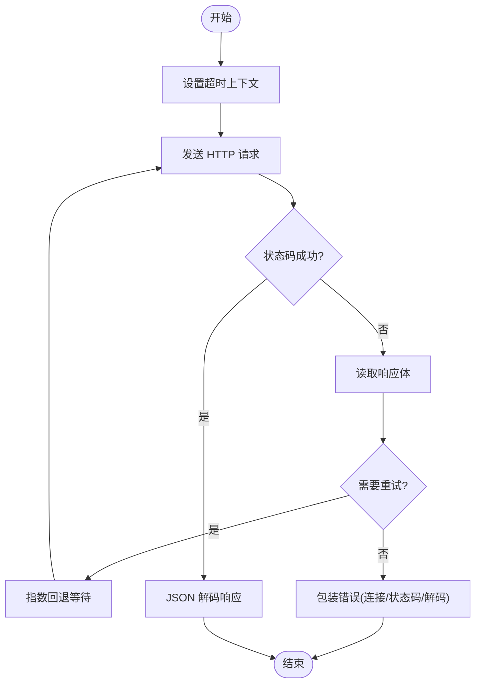
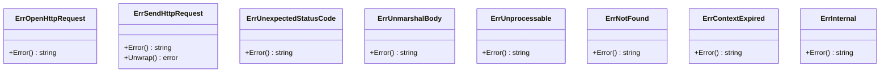
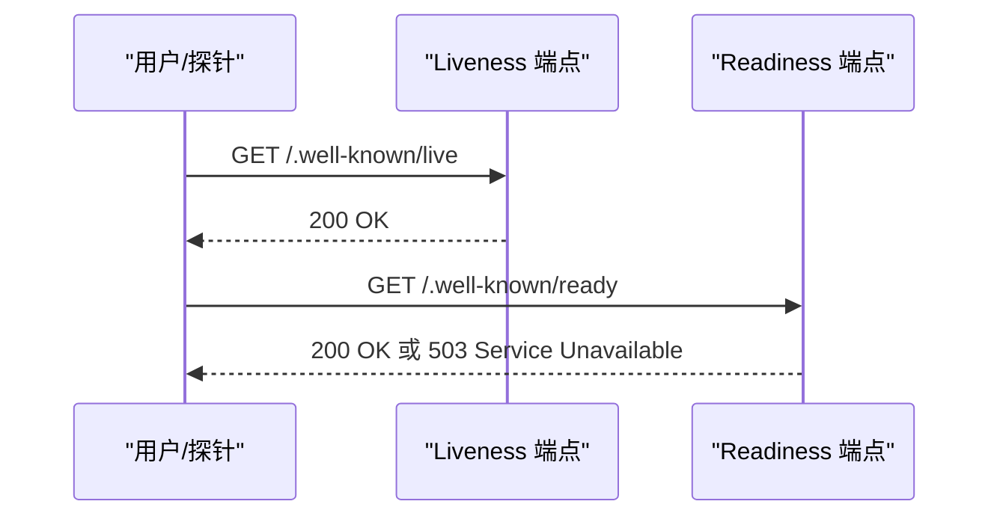
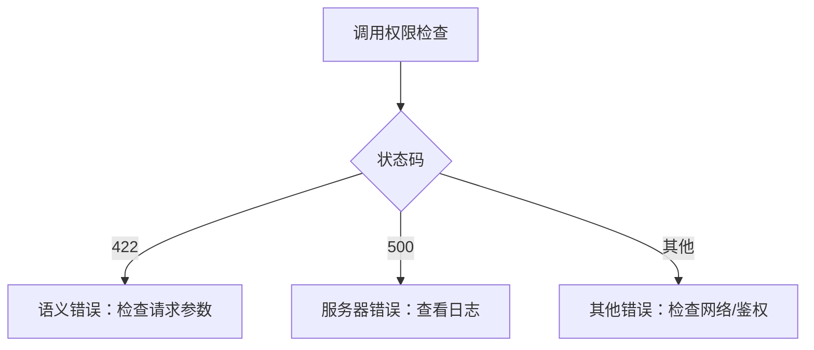
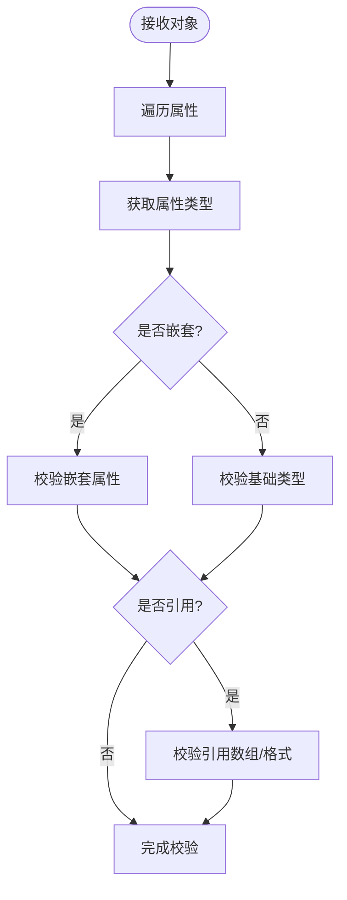
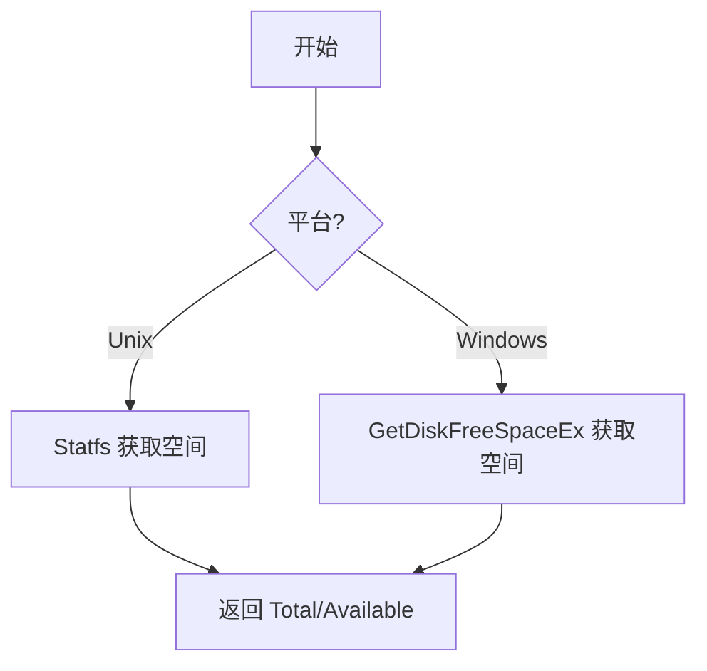
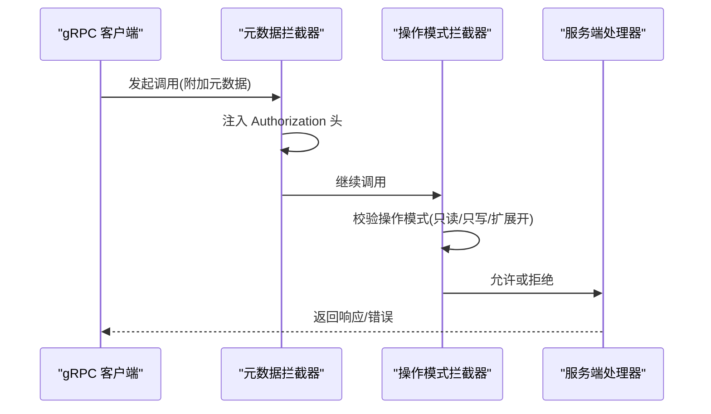
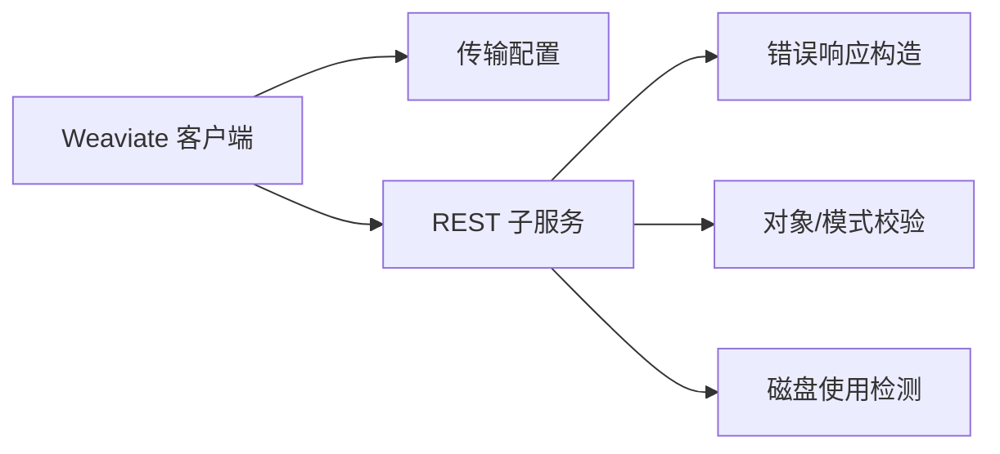

# 常见问题

<cite>
**本文引用的文件**
- [README.md](file://README.md)
- [client/weaviate_client.go](file://client/weaviate_client.go)
- [adapters/clients/client.go](file://adapters/clients/client.go)
- [entities/errors/errors_remote_client.go](file://entities/errors/errors_remote_client.go)
- [entities/errors/errors_http.go](file://entities/errors/errors_http.go)
- [adapters/handlers/rest/helpers.go](file://adapters/handlers/rest/helpers.go)
- [adapters/handlers/rest/operations/authz/has_permission_responses.go](file://adapters/handlers/rest/operations/authz/has_permission_responses.go)
- [client/authz/has_permission_responses.go](file://client/authz/has_permission_responses.go)
- [client/operations/weaviate_wellknown_liveness_responses.go](file://client/operations/weaviate_wellknown_liveness_responses.go)
- [client/operations/weaviate_wellknown_readiness_responses.go](file://client/operations/weaviate_wellknown_readiness_responses.go)
- [adapters/handlers/rest/operations/weaviate_wellknown_liveness_urlbuilder.go](file://adapters/handlers/rest/operations/weaviate_wellknown_liveness_urlbuilder.go)
- [adapters/handlers/grpc/server.go](file://adapters/handlers/grpc/server.go)
- [grpc/conn/manager.go](file://grpc/conn/manager.go)
- [grpc/conn/manager_test.go](file://grpc/conn/manager_test.go)
- [usecases/objects/validation/properties_validation.go](file://usecases/objects/validation/properties_validation.go)
- [usecases/schema/validation.go](file://usecases/schema/validation.go)
- [usecases/modulecomponents/settings/base_class_settings.go](file://usecases/modulecomponents/settings/base_class_settings.go)
- [adapters/repos/db/disk_use_unix.go](file://adapters/repos/db/disk_use_unix.go)
- [adapters/repos/db/disk_use_windows.go](file://adapters/repos/db/disk_use_windows.go)
- [usecases/cluster/disk_use_unix.go](file://usecases/cluster/disk_use_unix.go)
- [adapters/repos/db/queue/worker.go](file://adapters/repos/db/queue/worker.go)
- [entities/errors/transient.go](file://entities/errors/transient.go)
- [adapters/clients/client_test.go](file://adapters/clients/client_test.go)
</cite>

## 目录
1. [简介](#简介)
2. [项目结构](#项目结构)
3. [核心组件](#核心组件)
4. [架构总览](#架构总览)
5. [详细组件分析](#详细组件分析)
6. [依赖关系分析](#依赖关系分析)
7. [性能注意事项](#性能注意事项)
8. [故障排除指南](#故障排除指南)
9. [结论](#结论)
10. [附录](#附录)

## 简介
本文件面向使用 Weaviate 的工程师与运维人员，提供系统化的故障排除指南。内容覆盖连接问题、认证失败、权限不足、数据导入错误、HTTP 4xx/5xx 错误识别与修复、不同客户端（Python、JavaScript、Java）的连接排查、配置与网络问题、磁盘空间不足等基础设施相关问题，并提供问题自检清单与快速诊断流程，帮助快速定位与解决问题。

## 项目结构
Weaviate 采用分层与模块化组织方式：
- 客户端层：REST/GraphQL/gRPC 客户端封装与传输配置
- 适配器层：HTTP REST 与 gRPC 服务端适配、重试与错误包装
- 业务用例层：对象与模式校验、权限与授权、集群与复制
- 存储与基础设施层：磁盘使用检测、队列与回退策略、错误类型

**图表来源**
- [client/weaviate_client.go](file://client/weaviate_client.go#L56-L99)
- [adapters/clients/client.go](file://adapters/clients/client.go#L65-L91)
- [adapters/handlers/rest/helpers.go](file://adapters/handlers/rest/helpers.go#L20-L39)
- [adapters/handlers/grpc/server.go](file://adapters/handlers/grpc/server.go#L197-L224)
- [usecases/objects/validation/properties_validation.go](file://usecases/objects/validation/properties_validation.go#L42-L144)
- [usecases/schema/validation.go](file://usecases/schema/validation.go#L44-L87)
- [adapters/repos/db/disk_use_unix.go](file://adapters/repos/db/disk_use_unix.go#L20-L35)
- [adapters/repos/db/disk_use_windows.go](file://adapters/repos/db/disk_use_windows.go#L22-L44)

**章节来源**
- [README.md](file://README.md#L1-L181)
- [client/weaviate_client.go](file://client/weaviate_client.go#L56-L99)

## 核心组件
- HTTP 客户端与重试机制：统一的 HTTP 请求封装、超时控制、指数回退重试、状态码校验与错误解包
- 错误类型与错误响应：远程请求错误、意外状态码、反序列化错误、HTTP 通用错误类型
- REST 与 gRPC 适配器：统一错误响应体构造、健康检查端点、基本认证拦截器
- 对象与模式校验：属性类型与嵌套属性校验、引用校验、向量权重校验
- 权限与授权：权限检查响应与错误映射、RBAC 权限域解析
- 磁盘使用检测：Unix/Windows 平台磁盘空间读取与可用空间统计
- 传输配置：默认主机、路径、协议方案与客户端设置

**章节来源**
- [adapters/clients/client.go](file://adapters/clients/client.go#L65-L91)
- [entities/errors/errors_remote_client.go](file://entities/errors/errors_remote_client.go#L18-L72)
- [entities/errors/errors_http.go](file://entities/errors/errors_http.go#L14-L64)
- [adapters/handlers/rest/helpers.go](file://adapters/handlers/rest/helpers.go#L20-L39)
- [adapters/handlers/rest/operations/authz/has_permission_responses.go](file://adapters/handlers/rest/operations/authz/has_permission_responses.go#L195-L234)
- [usecases/objects/validation/properties_validation.go](file://usecases/objects/validation/properties_validation.go#L42-L144)
- [usecases/schema/validation.go](file://usecases/schema/validation.go#L44-L87)
- [adapters/repos/db/disk_use_unix.go](file://adapters/repos/db/disk_use_unix.go#L20-L35)
- [adapters/repos/db/disk_use_windows.go](file://adapters/repos/db/disk_use_windows.go#L22-L44)

## 架构总览
Weaviate 的客户端与服务端交互遵循统一的错误与响应规范。客户端通过 HTTP 或 gRPC 发起请求，服务端在 REST 层统一构造错误响应体，授权与权限检查在服务端拦截器中进行，对象与模式校验在写入前执行，磁盘使用在存储层监控。

**图表来源**
- [adapters/clients/client.go](file://adapters/clients/client.go#L65-L91)
- [adapters/handlers/rest/helpers.go](file://adapters/handlers/rest/helpers.go#L20-L39)
- [usecases/objects/validation/properties_validation.go](file://usecases/objects/validation/properties_validation.go#L42-L144)
- [adapters/repos/db/disk_use_unix.go](file://adapters/repos/db/disk_use_unix.go#L20-L35)

## 详细组件分析

### 组件 A：HTTP 客户端与重试
- 功能要点
  - 超时上下文管理
  - 自定义 Marshaller 与 JSON 解码
  - 成功状态码范围判断
  - 指数回退重试与最大尝试次数限制
  - 失败时读取响应体并根据状态码决定是否重试
- 关键行为
  - connect 错误包装为“连接失败”
  - status code 错误包装为“状态码异常”，携带响应体
  - decode 错误包装为“解码失败”
- 适用场景
  - REST API 调用失败重试
  - 网络抖动、瞬时错误恢复

**图表来源**
- [adapters/clients/client.go](file://adapters/clients/client.go#L65-L91)
- [adapters/clients/client_test.go](file://adapters/clients/client_test.go#L53-L123)

**章节来源**
- [adapters/clients/client.go](file://adapters/clients/client.go#L65-L91)
- [adapters/clients/client_test.go](file://adapters/clients/client_test.go#L53-L123)

### 组件 B：错误类型与 HTTP 状态码
- 错误类型
  - 远程请求错误：打开/发送 HTTP 请求失败
  - 意外状态码：返回非预期状态码及响应体
  - 反序列化错误：响应体解析失败
  - HTTP 通用错误：不可处理、未找到、上下文过期、内部错误
- 状态码分类
  - 2xx：成功
  - 3xx：重定向
  - 4xx：客户端错误（如权限不足、参数错误）
  - 5xx：服务器错误（如内部错误）

**图表来源**
- [entities/errors/errors_remote_client.go](file://entities/errors/errors_remote_client.go#L18-L72)
- [entities/errors/errors_http.go](file://entities/errors/errors_http.go#L14-L64)

**章节来源**
- [entities/errors/errors_remote_client.go](file://entities/errors/errors_remote_client.go#L18-L72)
- [entities/errors/errors_http.go](file://entities/errors/errors_http.go#L14-L64)

### 组件 C：REST 错误响应与健康检查
- 错误响应体构造
  - 统一错误响应对象创建，支持多条错误消息
  - 单错误转为错误响应载荷
- 健康检查端点
  - liveness：应用存活检查，返回 200 OK
  - readiness：应用就绪检查，返回 200 OK 或 503 Service Unavailable
- URL 构建与默认路径

**图表来源**
- [adapters/handlers/rest/helpers.go](file://adapters/handlers/rest/helpers.go#L20-L39)
- [client/operations/weaviate_wellknown_liveness_responses.go](file://client/operations/weaviate_wellknown_liveness_responses.go#L83-L99)
- [client/operations/weaviate_wellknown_readiness_responses.go](file://client/operations/weaviate_wellknown_readiness_responses.go#L31-L67)
- [adapters/handlers/rest/operations/weaviate_wellknown_liveness_urlbuilder.go](file://adapters/handlers/rest/operations/weaviate_wellknown_liveness_urlbuilder.go#L45-L98)

**章节来源**
- [adapters/handlers/rest/helpers.go](file://adapters/handlers/rest/helpers.go#L20-L39)
- [client/operations/weaviate_wellknown_liveness_responses.go](file://client/operations/weaviate_wellknown_liveness_responses.go#L83-L99)
- [client/operations/weaviate_wellknown_readiness_responses.go](file://client/operations/weaviate_wellknown_readiness_responses.go#L31-L67)
- [adapters/handlers/rest/operations/weaviate_wellknown_liveness_urlbuilder.go](file://adapters/handlers/rest/operations/weaviate_wellknown_liveness_urlbuilder.go#L45-L98)

### 组件 D：权限与授权
- 权限检查响应
  - 422 Unprocessable Entity：请求语法正确但语义错误
  - 500 Internal Server Error：服务器内部错误
- 权限域解析
  - 将授权域映射到具体权限对象（节点、备份、用户、复制、别名、组等）

**图表来源**
- [adapters/handlers/rest/operations/authz/has_permission_responses.go](file://adapters/handlers/rest/operations/authz/has_permission_responses.go#L195-L234)
- [client/authz/has_permission_responses.go](file://client/authz/has_permission_responses.go#L341-L470)

**章节来源**
- [adapters/handlers/rest/operations/authz/has_permission_responses.go](file://adapters/handlers/rest/operations/authz/has_permission_responses.go#L195-L234)
- [client/authz/has_permission_responses.go](file://client/authz/has_permission_responses.go#L341-L470)

### 组件 E：对象与模式校验
- 对象属性校验
  - 类型匹配与嵌套属性校验
  - 引用类型校验（单个/多个引用）
  - 向量权重校验
- 模式校验
  - 嵌套属性名称与数据类型约束
  - 不支持的数据类型提示

**图表来源**
- [usecases/objects/validation/properties_validation.go](file://usecases/objects/validation/properties_validation.go#L42-L144)
- [usecases/schema/validation.go](file://usecases/schema/validation.go#L44-L87)

**章节来源**
- [usecases/objects/validation/properties_validation.go](file://usecases/objects/validation/properties_validation.go#L42-L144)
- [usecases/schema/validation.go](file://usecases/schema/validation.go#L44-L87)

### 组件 F：磁盘使用检测
- Unix 平台
  - 使用 Statfs 获取总空间、可用空间
- Windows 平台
  - 使用 GetDiskFreeSpaceEx 获取总空间、可用空间
- 集群侧磁盘使用
  - 统一返回 Total/Available 字段

**图表来源**
- [adapters/repos/db/disk_use_unix.go](file://adapters/repos/db/disk_use_unix.go#L20-L35)
- [adapters/repos/db/disk_use_windows.go](file://adapters/repos/db/disk_use_windows.go#L22-L44)
- [usecases/cluster/disk_use_unix.go](file://usecases/cluster/disk_use_unix.go#L20-L32)

**章节来源**
- [adapters/repos/db/disk_use_unix.go](file://adapters/repos/db/disk_use_unix.go#L20-L35)
- [adapters/repos/db/disk_use_windows.go](file://adapters/repos/db/disk_use_windows.go#L22-L44)
- [usecases/cluster/disk_use_unix.go](file://usecases/cluster/disk_use_unix.go#L20-L32)

### 组件 G：gRPC 认证与操作模式拦截器
- 基本认证拦截器
  - 在请求元数据中注入 Authorization 头
- 操作模式拦截器
  - 只读/只写/扩展开关下的读写操作限制
  - 不允许的操作返回 Unavailable 错误

**图表来源**
- [grpc/conn/manager.go](file://grpc/conn/manager.go#L357-L384)
- [adapters/handlers/grpc/server.go](file://adapters/handlers/grpc/server.go#L197-L224)

**章节来源**
- [grpc/conn/manager.go](file://grpc/conn/manager.go#L357-L384)
- [adapters/handlers/grpc/server.go](file://adapters/handlers/grpc/server.go#L197-L224)
- [grpc/conn/manager_test.go](file://grpc/conn/manager_test.go#L204-L210)

## 依赖关系分析
- 客户端依赖
  - 默认传输配置（主机、路径、协议）
  - REST 客户端子服务聚合
- 服务端依赖
  - REST 层统一错误响应构造
  - 校验层前置拦截
  - 磁盘使用检测作为存储层辅助

**图表来源**
- [client/weaviate_client.go](file://client/weaviate_client.go#L56-L99)
- [adapters/handlers/rest/helpers.go](file://adapters/handlers/rest/helpers.go#L20-L39)
- [usecases/objects/validation/properties_validation.go](file://usecases/objects/validation/properties_validation.go#L42-L144)
- [adapters/repos/db/disk_use_unix.go](file://adapters/repos/db/disk_use_unix.go#L20-L35)

**章节来源**
- [client/weaviate_client.go](file://client/weaviate_client.go#L56-L99)

## 性能注意事项
- 指数回退重试上限与最大尝试次数，避免无限重试导致资源耗尽
- 磁盘空间不足会触发存储层限制，应提前监控并留有余量
- gRPC 拦截器在只读/只写/扩展开模式下拒绝不被允许的操作，避免无效请求

[本节为通用指导，不直接分析具体文件]

## 故障排除指南

### 一、连接问题排查
- 常见症状
  - 请求超时、连接失败、无法建立 gRPC 连接
- 诊断步骤
  - 检查默认传输配置（主机、路径、协议），确认与部署一致
  - 使用健康检查端点验证服务存活与就绪
  - gRPC 场景：确认元数据中包含正确的 Authorization 头
- 修复建议
  - 更新客户端传输配置
  - 修正网络路由与防火墙规则
  - 重新生成或轮换 API Key

**章节来源**
- [client/weaviate_client.go](file://client/weaviate_client.go#L101-L138)
- [client/operations/weaviate_wellknown_liveness_responses.go](file://client/operations/weaviate_wellknown_liveness_responses.go#L83-L99)
- [client/operations/weaviate_wellknown_readiness_responses.go](file://client/operations/weaviate_wellknown_readiness_responses.go#L31-L67)
- [grpc/conn/manager.go](file://grpc/conn/manager.go#L357-L384)

### 二、认证失败与权限不足
- 常见症状
  - 401 未认证、403 禁止、422 语义错误
- 诊断步骤
  - 检查权限检查响应状态码与错误消息
  - 确认用户角色与权限域配置
  - 校验请求参数与资源边界
- 修复建议
  - 为用户分配所需角色与权限
  - 修正请求参数与资源标识
  - 重新生成 API Key 并更新客户端

**章节来源**
- [adapters/handlers/rest/operations/authz/has_permission_responses.go](file://adapters/handlers/rest/operations/authz/has_permission_responses.go#L195-L234)
- [client/authz/has_permission_responses.go](file://client/authz/has_permission_responses.go#L341-L470)

### 三、HTTP 4xx 与 5xx 错误对照与修复
- 400 Bad Request / 422 Unprocessable Entity
  - 含义：请求语法正确但服务器无法处理
  - 可能原因：参数类型错误、必填字段缺失、语义冲突
  - 修复：核对请求体字段类型与必填项
- 401 Unauthorized
  - 含义：缺少或无效的身份认证
  - 可能原因：Token 缺失或过期、API Key 错误
  - 修复：重新登录或轮换 API Key
- 403 Forbidden
  - 含义：权限不足
  - 可能原因：角色无相应权限域
  - 修复：为用户授予所需权限
- 404 Not Found
  - 含义：资源不存在
  - 可能原因：集合/对象 ID 错误
  - 修复：确认资源标识
- 500 Internal Server Error
  - 含义：服务器内部错误
  - 可能原因：服务异常、磁盘空间不足、模块初始化失败
  - 修复：查看服务日志、清理磁盘空间、重启服务
- 503 Service Unavailable
  - 含义：服务不可用（通常用于就绪检查）
  - 可能原因：服务尚未就绪或处于维护
  - 修复：等待就绪或检查部署状态

**章节来源**
- [adapters/handlers/rest/operations/authz/has_permission_responses.go](file://adapters/handlers/rest/operations/authz/has_permission_responses.go#L195-L234)
- [client/operations/weaviate_wellknown_readiness_responses.go](file://client/operations/weaviate_wellknown_readiness_responses.go#L31-L67)
- [adapters/handlers/rest/helpers.go](file://adapters/handlers/rest/helpers.go#L20-L39)

### 四、数据导入错误
- 常见症状
  - 导入批量对象报错、向量权重错误、引用格式错误
- 诊断步骤
  - 校验对象属性类型与嵌套属性
  - 检查引用数组格式与元素类型
  - 校验向量权重与属性一致性
- 修复建议
  - 修正属性类型与嵌套结构
  - 规范引用数组格式
  - 重新生成向量或调整权重

**章节来源**
- [usecases/objects/validation/properties_validation.go](file://usecases/objects/validation/properties_validation.go#L42-L144)
- [usecases/schema/validation.go](file://usecases/schema/validation.go#L44-L87)

### 五、配置错误
- 常见症状
  - 模块配置无效、属性设置不支持、自动模式与索引状态不一致
- 诊断步骤
  - 检查类设置与属性数据类型支持情况
  - 开启/关闭自动模式时的行为差异
- 修复建议
  - 使用受支持的数据类型
  - 在禁用自动模式时显式定义属性

**章节来源**
- [usecases/modulecomponents/settings/base_class_settings.go](file://usecases/modulecomponents/settings/base_class_settings.go#L264-L320)

### 六、网络问题
- 常见症状
  - 请求超时、连接被拒绝、gRPC 连接无法建立
- 诊断步骤
  - 使用健康检查端点验证服务可达性
  - 检查客户端重试与超时配置
- 修复建议
  - 优化网络路径与 DNS 解析
  - 调整客户端超时与重试策略

**章节来源**
- [client/operations/weaviate_wellknown_liveness_responses.go](file://client/operations/weaviate_wellknown_liveness_responses.go#L83-L99)
- [adapters/clients/client.go](file://adapters/clients/client.go#L65-L91)

### 七、磁盘空间不足
- 常见症状
  - 写入失败、存储层报错、服务降级
- 诊断步骤
  - 检查磁盘使用情况（Total/Available）
  - 监控存储队列与回退策略
- 修复建议
  - 清理磁盘空间或扩容
  - 调整存储阈值与清理策略

**章节来源**
- [adapters/repos/db/disk_use_unix.go](file://adapters/repos/db/disk_use_unix.go#L20-L35)
- [adapters/repos/db/disk_use_windows.go](file://adapters/repos/db/disk_use_windows.go#L22-L44)
- [adapters/repos/db/queue/worker.go](file://adapters/repos/db/queue/worker.go#L134-L164)
- [entities/errors/transient.go](file://entities/errors/transient.go#L19-L39)

### 八、客户端连接排查（Python/JavaScript/Java）
- Python
  - 确认连接函数与主机、端口、协议一致
  - 检查 API Key 设置与作用域
- JavaScript/TypeScript
  - 确认 SDK 初始化参数与服务地址
  - 检查请求头与认证令牌
- Java
  - 确认客户端初始化与传输配置
  - 检查 gRPC 通道与元数据注入

**章节来源**
- [README.md](file://README.md#L98-L108)
- [client/weaviate_client.go](file://client/weaviate_client.go#L56-L99)

### 九、问题自检清单与快速诊断流程
- 自检清单
  - 服务健康：/.well-known/live 与 /.well-known/ready 是否正常
  - 认证：API Key/Token 是否有效、权限是否足够
  - 配置：主机、路径、协议、模块配置是否正确
  - 网络：DNS、防火墙、代理、超时设置
  - 存储：磁盘空间、队列状态、回退策略
- 快速诊断流程
  1) 使用健康检查端点确认服务状态
  2) 核对认证与权限
  3) 检查请求参数与数据类型
  4) 查看错误响应体与状态码
  5) 监控磁盘与网络状况
  6) 必要时启用更详细的日志级别

**章节来源**
- [client/operations/weaviate_wellknown_liveness_responses.go](file://client/operations/weaviate_wellknown_liveness_responses.go#L83-L99)
- [client/operations/weaviate_wellknown_readiness_responses.go](file://client/operations/weaviate_wellknown_readiness_responses.go#L31-L67)
- [adapters/handlers/rest/helpers.go](file://adapters/handlers/rest/helpers.go#L20-L39)

## 结论
通过理解 Weaviate 的错误类型、HTTP 状态码、客户端与服务端交互流程、权限与校验机制以及磁盘使用检测，可以系统化地定位与修复大多数常见问题。建议在日常运维中结合健康检查端点、详细的日志与监控指标，形成标准化的排障流程。

[本节为总结性内容，不直接分析具体文件]

## 附录
- 术语
  - 4xx：客户端错误（如认证失败、参数错误）
  - 5xx：服务器错误（如内部错误、服务不可用）
  - 健康检查：liveness（存活）、readiness（就绪）
- 参考
  - 客户端默认传输配置与服务聚合
  - REST 错误响应体构造与健康检查端点
  - gRPC 认证与操作模式拦截器

**章节来源**
- [client/weaviate_client.go](file://client/weaviate_client.go#L56-L99)
- [adapters/handlers/rest/helpers.go](file://adapters/handlers/rest/helpers.go#L20-L39)
- [adapters/handlers/grpc/server.go](file://adapters/handlers/grpc/server.go#L197-L224)