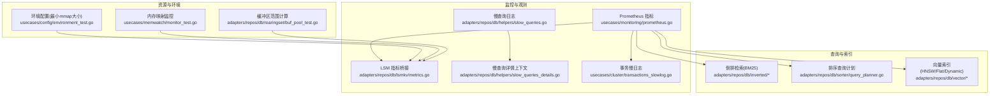
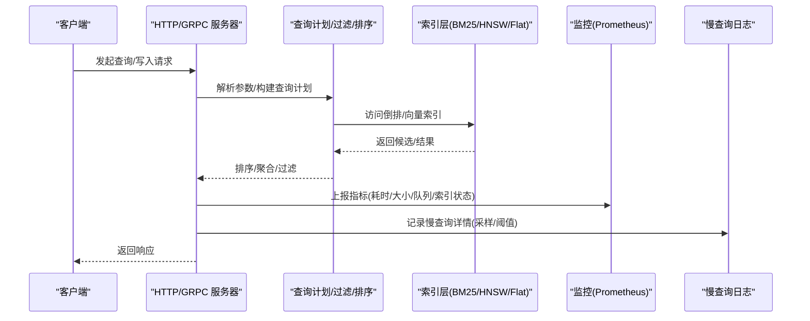
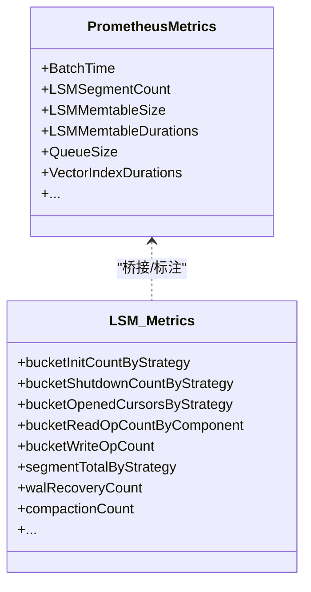
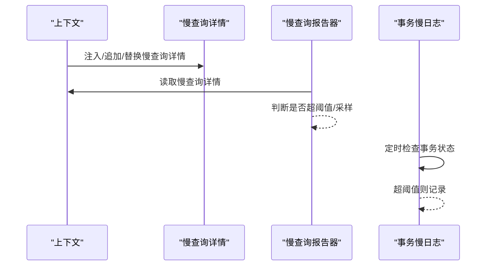
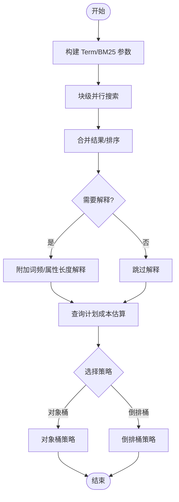
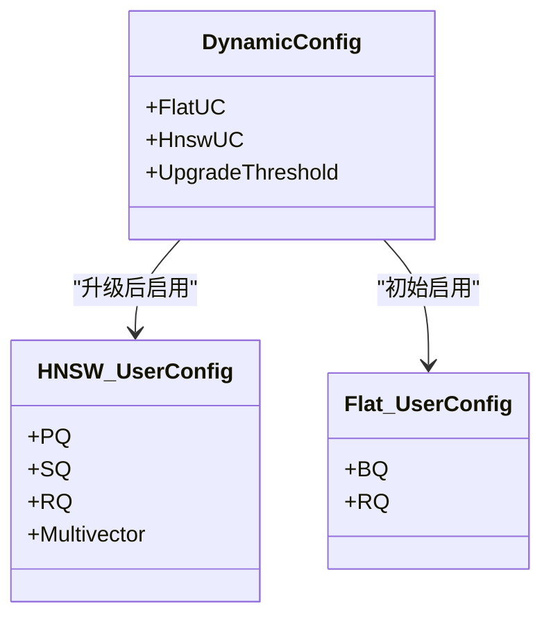
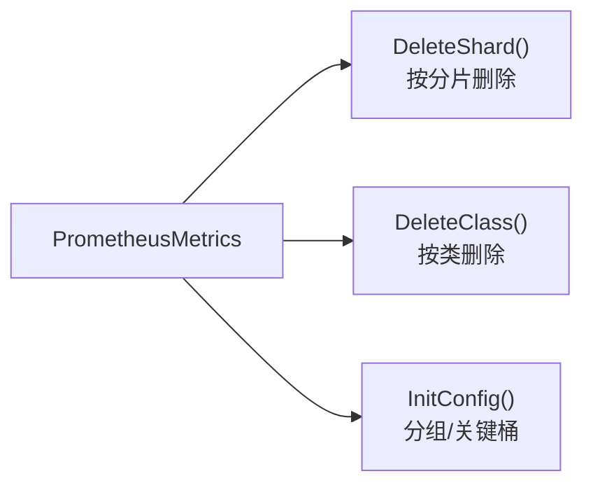
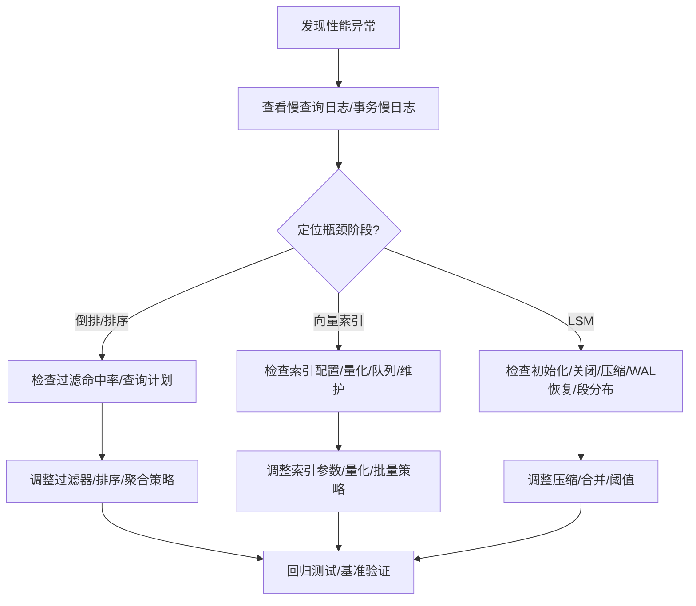

# 性能问题

<cite>
**本文引用的文件**
- [metrics.md](file://docs/metrics.md)
- [prometheus.go](file://usecases/monitoring/prometheus.go)
- [metrics.go](file://adapters/repos/db/lsmkv/metrics.go)
- [slow_queries.go](file://adapters/repos/db/helpers/slow_queries.go)
- [slow_queries_details.go](file://adapters/repos/db/helpers/slow_queries_details.go)
- [transactions_slowlog.go](file://usecases/cluster/transactions_slowlog.go)
- [replace_bucket_acceptance_test.go](file://test/acceptance_lsmkv/replace_bucket_acceptance_test.go)
- [replace_bucket_acceptance_test.go（长时运行）](file://test/acceptance_lsmkv_long_running/replace_bucket_acceptance_test.go)
- [bm25_searcher_block.go](file://adapters/repos/db/inverted/bm25_searcher_block.go)
- [bm25_searcher.go](file://adapters/repos/db/inverted/bm25_searcher.go)
- [query_planner.go](file://adapters/repos/db/sorter/query_planner.go)
- [environment_test.go](file://usecases/config/environment_test.go)
- [buf_pool_test.go](file://adapters/repos/db/roaringset/buf_pool_test.go)
- [monitor_test.go](file://usecases/memwatch/monitor_test.go)
- [default_quantization_test.go](file://test/acceptance/schema/default_quantization_test.go)
- [index_test.go](file://adapters/repos/db/vector/dynamic/index_test.go)
- [config_test.go](file://entities/vectorindex/dynamic/config_test.go)
- [shard_dimension_tracking.go](file://adapters/repos/db/shard_dimension_tracking.go)
- [aggregations_integration_test.go](file://adapters/repos/db/aggregations_integration_test.go)
- [local_aggregate_matrix_setup_test.go](file://test/acceptance/graphql_resolvers/local_aggregate_matrix_setup_test.go)
- [multi_shard_integration_test.go](file://adapters/repos/db/multi_shard_integration_test.go)
- [filters_integration_test.go](file://adapters/repos/db/filters_integration_test.go)
- [lsm.json](file://tools/dev/grafana/dashboards/lsm.json)
</cite>

## 目录
1. [简介](#简介)
2. [项目结构](#项目结构)
3. [核心组件](#核心组件)
4. [架构总览](#架构总览)
5. [详细组件分析](#详细组件分析)
6. [依赖关系分析](#依赖关系分析)
7. [性能考量](#性能考量)
8. [故障排查指南](#故障排查指南)
9. [结论](#结论)
10. [附录](#附录)

## 简介
本文件面向 Weaviate 的性能诊断与优化，聚焦以下目标：
- 快速识别性能问题症状：慢查询、高延迟、内存占用过高、磁盘 I/O 抖动等
- 深入解析索引性能优化策略：向量索引配置、倒排索引优化、查询计划分析
- 提供查询性能优化技巧：过滤器使用、排序优化、聚合查询优化
- 解读监控指标与基准测试方法，结合内存管理、磁盘 I/O 与网络配置的最佳实践
- 给出性能调优工具与自动化监控方案

## 项目结构
Weaviate 在性能相关方面主要由以下模块构成：
- 监控与指标：Prometheus 指标注册与分类、LSM 子系统指标桥接
- 查询与索引：倒排检索（BM25）、排序查询计划、向量索引（HNSW/Flat/Dynamic）
- 性能观测：慢查询日志、事务慢日志、测试中的阈值校验
- 资源与环境：内存映射限制、缓冲区范围计算、持久化最小映射大小

**图表来源**
- [prometheus.go](file://usecases/monitoring/prometheus.go#L1-L800)
- [metrics.go](file://adapters/repos/db/lsmkv/metrics.go#L1-L800)
- [slow_queries.go](file://adapters/repos/db/helpers/slow_queries.go#L52-L95)
- [slow_queries_details.go](file://adapters/repos/db/helpers/slow_queries_details.go#L1-L142)
- [transactions_slowlog.go](file://usecases/cluster/transactions_slowlog.go#L55-L161)

**章节来源**
- [prometheus.go](file://usecases/monitoring/prometheus.go#L1-L800)
- [metrics.go](file://adapters/repos/db/lsmkv/metrics.go#L1-L800)

## 核心组件
- 指标体系与分类：统一的 Prometheus 指标注册、命名空间、分组与标签策略，覆盖批处理、对象操作、查询、LSM、队列、向量索引、启动、备份/恢复、分片、令牌化器、模块外部调用等维度
- LSM 指标桥接：将通用指标与具体 LSM Bucket 操作（初始化/关闭、游标、读写、段、WAL 恢复、压缩）进行映射
- 慢查询与事务观测：统一的慢查询日志与采样、慢查询详情上下文注解、事务慢日志跟踪
- 查询与索引优化：倒排检索（BM25）结果合并与排序、排序查询计划成本估算、向量索引配置与动态切换

**章节来源**
- [metrics.md](file://docs/metrics.md#L1-L395)
- [prometheus.go](file://usecases/monitoring/prometheus.go#L1-L800)
- [metrics.go](file://adapters/repos/db/lsmkv/metrics.go#L1-L800)
- [slow_queries.go](file://adapters/repos/db/helpers/slow_queries.go#L52-L95)
- [slow_queries_details.go](file://adapters/repos/db/helpers/slow_queries_details.go#L1-L142)
- [transactions_slowlog.go](file://usecases/cluster/transactions_slowlog.go#L55-L161)

## 架构总览
Weaviate 的性能观测与优化贯穿“请求入口—查询计划—索引访问—指标上报—慢日志—告警/仪表板”的闭环。

**图表来源**
- [prometheus.go](file://usecases/monitoring/prometheus.go#L214-L289)
- [bm25_searcher_block.go](file://adapters/repos/db/inverted/bm25_searcher_block.go#L240-L266)
- [query_planner.go](file://adapters/repos/db/sorter/query_planner.go#L124-L141)

## 详细组件分析

### 指标体系与分类
- 指标分层与用途
  - 活跃仪表板：核心可观测性指标，标签有限、采样合理
  - 运营：健康/运行状态与后台进程，尽量采样
  - 告警：症状型告警，低基数
  - 分析：调试/分析，避免长期保留在 Prometheus
  - 可废弃/已废弃：逐步迁移与清理
- 关键指标类别
  - 批处理/对象操作/查询/LSM/队列/向量索引/启动/备份/分片/令牌化器/模块外部调用
- 指标命名与标签
  - 统一命名空间与分组策略，避免每租户/每类/每路由标签爆炸
  - 低基数标签优先，高基数场景移出 Prometheus 或降采样

**章节来源**
- [metrics.md](file://docs/metrics.md#L1-L395)
- [prometheus.go](file://usecases/monitoring/prometheus.go#L1-L800)

### LSM 指标桥接
- 桥接策略
  - 将通用指标（如 LSM 活跃段数、memtable 大小/耗时、段数量/大小、队列/分片状态等）与具体 Bucket 操作（初始化/关闭、游标、读写、压缩、WAL 恢复）关联
  - 支持按策略/路径/级别/阶段细分
- 关键观测点
  - 初始化/关闭耗时与失败次数
  - 游标打开/持续时间
  - 读写操作计数/进行中/失败/耗时
  - 压缩次数/进行中/失败/耗时
  - WAL 恢复次数/进行中/失败/耗时
  - 段总数/大小分布/未加载段数

**图表来源**
- [prometheus.go](file://usecases/monitoring/prometheus.go#L438-L737)
- [metrics.go](file://adapters/repos/db/lsmkv/metrics.go#L128-L737)

**章节来源**
- [metrics.go](file://adapters/repos/db/lsmkv/metrics.go#L1-L800)
- [prometheus.go](file://usecases/monitoring/prometheus.go#L1-L800)

### 慢查询与事务观测
- 慢查询日志
  - 基于阈值与采样（约 1%）输出警告或信息日志
  - 支持在上下文中注入慢查询详情（如阶段耗时、匹配数、过滤命中率等），便于定位瓶颈
- 事务慢日志
  - 定期轮询事务生命周期，超过年龄或状态变更阈值即记录
  - 结束时若超过阈值或曾被记录过，则输出完整统计

**图表来源**
- [slow_queries.go](file://adapters/repos/db/helpers/slow_queries.go#L52-L95)
- [slow_queries_details.go](file://adapters/repos/db/helpers/slow_queries_details.go#L33-L142)
- [transactions_slowlog.go](file://usecases/cluster/transactions_slowlog.go#L125-L161)

**章节来源**
- [slow_queries.go](file://adapters/repos/db/helpers/slow_queries.go#L52-L95)
- [slow_queries_details.go](file://adapters/repos/db/helpers/slow_queries_details.go#L1-L142)
- [transactions_slowlog.go](file://usecases/cluster/transactions_slowlog.go#L55-L161)

### 倒排检索与排序查询计划
- BM25 检索流程
  - 并行块级搜索、合并结果、组合耗时与对象数记录到慢查询详情
  - 可选返回每个查询词的频率/属性长度解释（用于调试）
- 排序查询计划
  - 估算对象桶策略与倒排桶策略的成本，结合过滤命中率与 limit，决定最优路径
  - 对对象读取的折扣考虑：缓存命中概率较高，可显著降低磁盘交互成本

**图表来源**
- [bm25_searcher_block.go](file://adapters/repos/db/inverted/bm25_searcher_block.go#L240-L266)
- [bm25_searcher.go](file://adapters/repos/db/inverted/bm25_searcher.go#L428-L448)
- [query_planner.go](file://adapters/repos/db/sorter/query_planner.go#L124-L141)

**章节来源**
- [bm25_searcher_block.go](file://adapters/repos/db/inverted/bm25_searcher_block.go#L240-L266)
- [bm25_searcher.go](file://adapters/repos/db/inverted/bm25_searcher.go#L428-L448)
- [query_planner.go](file://adapters/repos/db/sorter/query_planner.go#L124-L141)

### 向量索引配置与动态切换
- 动态索引
  - 数据规模小时使用 Flat，达到阈值后升级为 HNSW；支持 PQ/SQ/RQ 等量化配置
  - 默认量化策略与开关可通过测试验证
- 维度与压缩信息提取
  - 从 HNSW/Flat/Dynamic 配置中提取压缩类型与参数，用于指标与运维决策

**图表来源**
- [index_test.go](file://adapters/repos/db/vector/dynamic/index_test.go#L507-L543)
- [config_test.go](file://entities/vectorindex/dynamic/config_test.go#L130-L166)
- [shard_dimension_tracking.go](file://adapters/repos/db/shard_dimension_tracking.go#L184-L222)
- [default_quantization_test.go](file://test/acceptance/schema/default_quantization_test.go#L129-L303)

**章节来源**
- [index_test.go](file://adapters/repos/db/vector/dynamic/index_test.go#L507-L543)
- [config_test.go](file://entities/vectorindex/dynamic/config_test.go#L130-L166)
- [shard_dimension_tracking.go](file://adapters/repos/db/shard_dimension_tracking.go#L184-L222)
- [default_quantization_test.go](file://test/acceptance/schema/default_quantization_test.go#L129-L303)

### 查询性能优化技巧
- 过滤器使用
  - 利用过滤器命中率与查询计划成本估算，优先走倒排桶策略
  - 在多字段/多条件下，尽量将高选择性条件前置，减少候选集
- 排序优化
  - 当过滤命中率高且 limit 较小时，对象桶策略更具优势
  - 避免无谓的全量扫描，合理设置 limit 与 offset
- 聚合查询优化
  - 使用 where 过滤缩小聚合范围，避免全表扫描
  - 测试覆盖了不同过滤场景下的聚合行为，确保结果一致性

**章节来源**
- [query_planner.go](file://adapters/repos/db/sorter/query_planner.go#L124-L141)
- [filters_integration_test.go](file://adapters/repos/db/filters_integration_test.go#L775-L805)
- [multi_shard_integration_test.go](file://adapters/repos/db/multi_shard_integration_test.go#L506-L545)
- [aggregations_integration_test.go](file://adapters/repos/db/aggregations_integration_test.go#L1278-L1313)
- [local_aggregate_matrix_setup_test.go](file://test/acceptance/graphql_resolvers/local_aggregate_matrix_setup_test.go#L626-L952)

## 依赖关系分析
- 指标注册与删除
  - 支持按类/分片删除标签组合，避免删除单个分片影响其他分片指标
  - 支持按类删除非分片级指标，保障计费/汇总指标不受影响
- 指标分组与关键桶
  - 可配置指标分组与仅保留关键桶，降低噪声与存储压力

**图表来源**
- [prometheus.go](file://usecases/monitoring/prometheus.go#L291-L372)
- [prometheus.go](file://usecases/monitoring/prometheus.go#L398-L401)

**章节来源**
- [prometheus.go](file://usecases/monitoring/prometheus.go#L291-L372)
- [prometheus.go](file://usecases/monitoring/prometheus.go#L398-L401)

## 性能考量
- 内存管理
  - 监控最大内存映射数与当前映射数，防止超出系统限制导致 OOM
  - 环境变量可配置持久化最小 mmap 大小，避免过小导致频繁映射
- 磁盘 I/O 优化
  - LSM 指标包含文件读写总量、mmap 操作次数、段大小分布等，用于评估 I/O 压力
  - Grafana 仪表盘提供 memtable 操作时延、段计数/大小等可视化
- 网络配置
  - HTTP/GRPC 服务器指标包含请求时延、请求体/响应体大小、并发请求数等，便于识别网络瓶颈
- 缓冲区与同步
  - 缓冲区范围计算与限制有助于平衡吞吐与延迟，避免过度分配

**章节来源**
- [monitor_test.go](file://usecases/memwatch/monitor_test.go#L125-L160)
- [environment_test.go](file://usecases/config/environment_test.go#L1159-L1193)
- [metrics.go](file://adapters/repos/db/lsmkv/metrics.go#L555-L570)
- [lsm.json](file://tools/dev/grafana/dashboards/lsm.json#L354-L408)
- [prometheus.go](file://usecases/monitoring/prometheus.go#L214-L289)
- [buf_pool_test.go](file://adapters/repos/db/roaringset/buf_pool_test.go#L665-L728)

## 故障排查指南
- 慢查询定位
  - 开启慢查询日志与采样，结合慢查询详情上下文（阶段耗时、匹配数、过滤命中率）快速定位瓶颈
  - 事务慢日志定期轮询，超过阈值或状态长时间不变时记录
- LSM 异常排查
  - 观察初始化/关闭耗时与失败次数、游标打开/耗时、读写操作进行中/失败/耗时、压缩/恢复耗时
  - 关注段总数/大小分布与未加载段数，判断是否需要调优压缩策略或触发主动合并
- 基准与阈值
  - 使用接受度测试对 Put/Get 进行阈值校验，确保在高并发场景下仍满足 SLA
  - 长时运行测试验证稳定性与性能退化趋势

**图表来源**
- [slow_queries.go](file://adapters/repos/db/helpers/slow_queries.go#L52-L95)
- [transactions_slowlog.go](file://usecases/cluster/transactions_slowlog.go#L125-L161)
- [metrics.go](file://adapters/repos/db/lsmkv/metrics.go#L128-L737)
- [replace_bucket_acceptance_test.go](file://test/acceptance_lsmkv/replace_bucket_acceptance_test.go#L80-L203)
- [replace_bucket_acceptance_test.go（长时运行）](file://test/acceptance_lsmkv_long_running/replace_bucket_acceptance_test.go#L95-L142)

**章节来源**
- [slow_queries.go](file://adapters/repos/db/helpers/slow_queries.go#L52-L95)
- [transactions_slowlog.go](file://usecases/cluster/transactions_slowlog.go#L55-L161)
- [metrics.go](file://adapters/repos/db/lsmkv/metrics.go#L128-L737)
- [replace_bucket_acceptance_test.go](file://test/acceptance_lsmkv/replace_bucket_acceptance_test.go#L80-L203)
- [replace_bucket_acceptance_test.go（长时运行）](file://test/acceptance_lsmkv_long_running/replace_bucket_acceptance_test.go#L95-L142)

## 结论
- 通过统一的指标体系与分层分类，Weaviate 能够在不同层面识别性能问题
- LSM 指标桥接与慢查询/事务观测提供了端到端的性能闭环
- 倒排检索与排序查询计划的成本估算为优化过滤器、排序与聚合提供了依据
- 向量索引的动态切换与量化配置为大规模向量检索提供了弹性与效率
- 内存映射、mmap 大小、缓冲区范围与网络指标共同决定了整体性能表现

## 附录
- 自动化监控建议
  - 使用 Grafana 仪表盘展示 LSM、向量索引、队列、启动、备份/恢复等关键指标
  - 设置基于指标的告警规则，关注异常增长与异常分布
- 基准测试方法
  - 使用接受度测试与长时运行测试设定阈值，持续回归验证
  - 在不同数据规模与并发条件下对比 Put/Get 时延与稳定性

**章节来源**
- [metrics.md](file://docs/metrics.md#L1-L395)
- [lsm.json](file://tools/dev/grafana/dashboards/lsm.json#L354-L408)
- [replace_bucket_acceptance_test.go](file://test/acceptance_lsmkv/replace_bucket_acceptance_test.go#L80-L203)
- [replace_bucket_acceptance_test.go（长时运行）](file://test/acceptance_lsmkv_long_running/replace_bucket_acceptance_test.go#L95-L142)