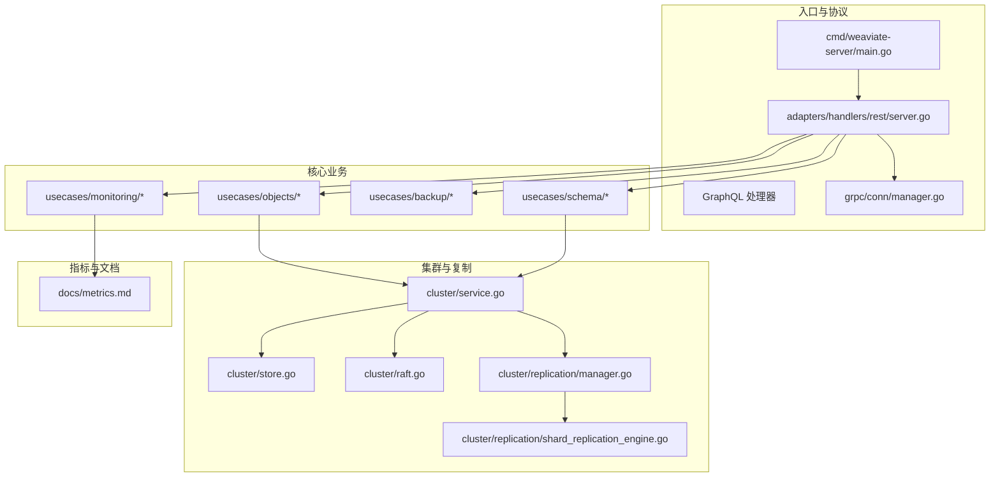
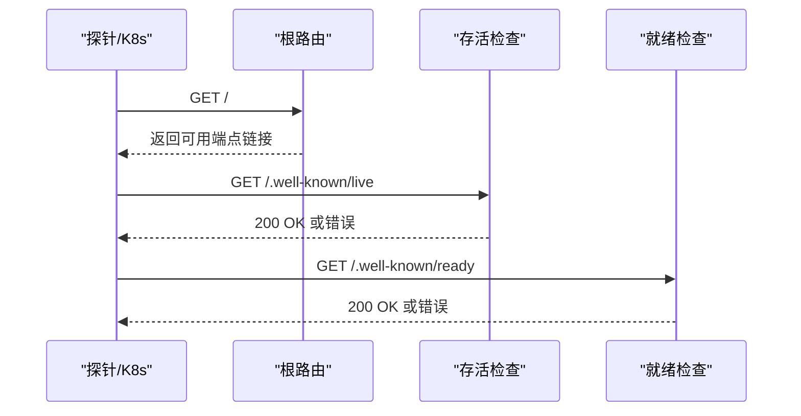
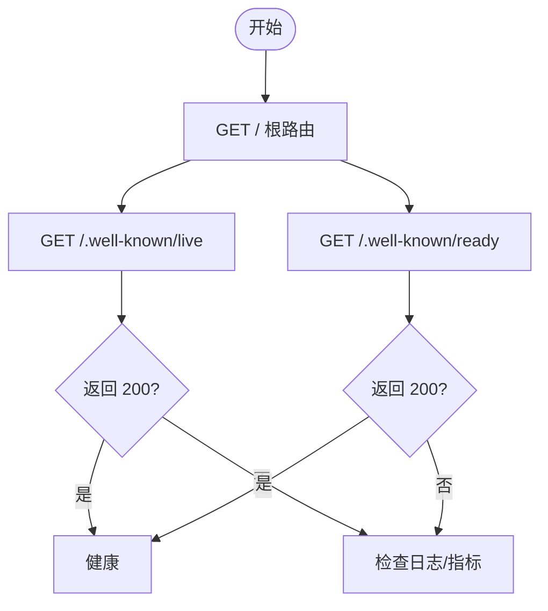
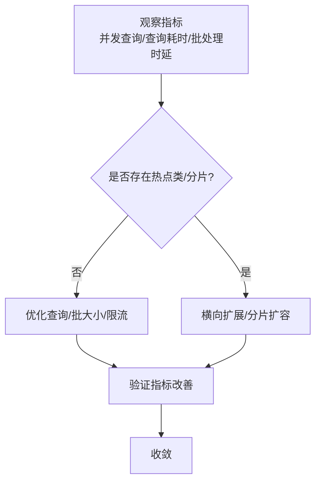
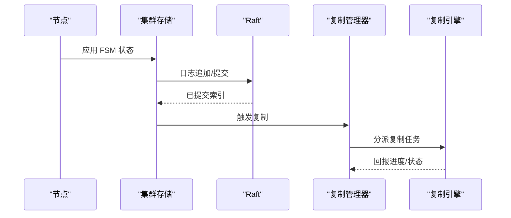
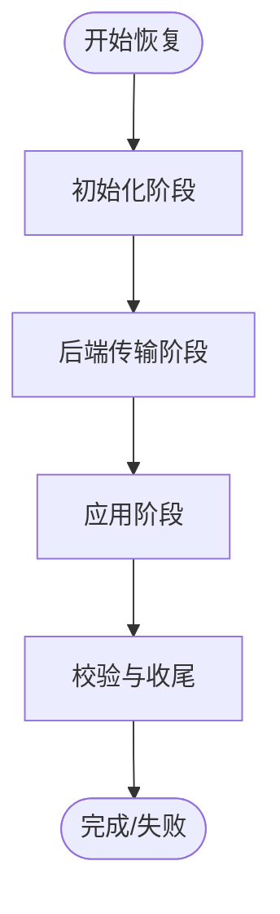
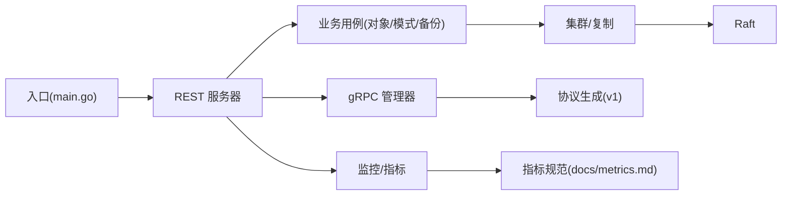
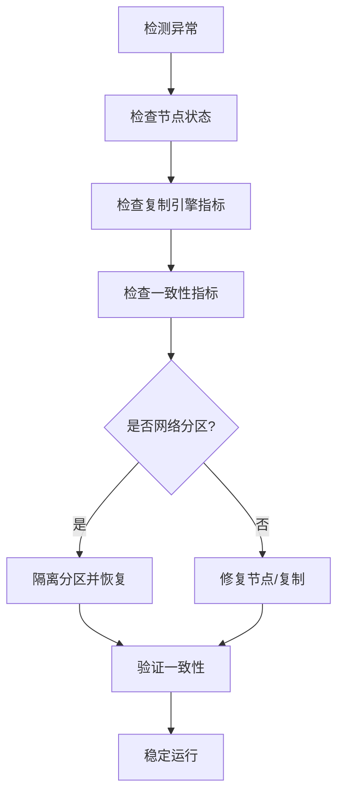

# 故障排除

<cite>
**本文引用的文件**
- [cmd/weaviate-server/main.go](file://cmd/weaviate-server/main.go)
- [docs/metrics.md](file://docs/metrics.md)
- [adapters/handlers/rest/operations/weaviate_root.go](file://adapters/handlers/rest/operations/weaviate_root.go)
- [adapters/handlers/rest/operations/weaviate_wellknown_liveness.go](file://adapters/handlers/rest/operations/weaviate_wellknown_liveness.go)
- [adapters/handlers/rest/operations/weaviate_wellknown_readiness.go](file://adapters/handlers/rest/operations/weaviate_wellknown_readiness.go)
- [cluster/service.go](file://cluster/service.go)
- [cluster/store.go](file://cluster/store.go)
- [cluster/raft.go](file://cluster/raft.go)
- [cluster/replication/manager.go](file://cluster/replication/manager.go)
- [cluster/replication/shard_replication_engine.go](file://cluster/replication/shard_replication_engine.go)
- [usecases/backup/backup.go](file://usecases/backup/backup.go)
- [usecases/monitoring/monitoring.go](file://usecases/monitoring/monitoring.go)
- [entities/errors/errors_http.go](file://entities/errors/errors_http.go)
- [entities/errors/errors_remote_client.go](file://entities/errors/errors_remote_client.go)
- [entities/errors/transient.go](file://entities/errors/transient.go)
- [adapters/repos/db/repos_db.go](file://adapters/repos/db/repos_db.go)
- [adapters/handlers/rest/server.go](file://adapters/handlers/rest/server.go)
- [grpc/conn/manager.go](file://grpc/conn/manager.go)
- [grpc/generated/protocol/v1/...](file://grpc/generated/protocol/v1/...)
- [modules/text2vec-.../module.go](file://modules/text2vec-openai/module.go)
- [modules/generative-.../module.go](file://modules/generative-openai/module.go)
</cite>

## 目录
1. [简介](#简介)
2. [项目结构](#项目结构)
3. [核心组件](#核心组件)
4. [架构总览](#架构总览)
5. [详细组件分析](#详细组件分析)
6. [依赖关系分析](#依赖关系分析)
7. [性能考量](#性能考量)
8. [故障排除指南](#故障排除指南)
9. [结论](#结论)
10. [附录](#附录)

## 简介
本文件面向技术支持工程师与系统管理员，提供 Weaviate 的系统化故障排除参考。内容覆盖连接问题、性能问题、功能异常的诊断与修复路径，解释日志分析、指标监控与调试工具的使用方法，给出集群问题（节点故障、数据不一致、网络分区）的处置策略，并提供预防性维护与健康检查建议及紧急响应与恢复流程。

## 项目结构
Weaviate 采用分层与模块化组织方式：
- 服务入口与 REST/gRPC/GraphQL 处理器位于 adapters 层
- 核心业务逻辑分布在 usecases 与 modules
- 集群与复制、Raft、快照等由 cluster 子系统负责
- 指标与监控由 docs/metrics.md 规范化定义，实际采集在 usecases/monitoring 中实现
- 错误模型与错误传播在 entities/errors 下统一管理

图表来源
- [cmd/weaviate-server/main.go](file://cmd/weaviate-server/main.go#L30-L66)
- [adapters/handlers/rest/server.go](file://adapters/handlers/rest/server.go)
- [cluster/service.go](file://cluster/service.go)
- [cluster/store.go](file://cluster/store.go#L1-L200)
- [cluster/raft.go](file://cluster/raft.go)
- [cluster/replication/manager.go](file://cluster/replication/manager.go)
- [cluster/replication/shard_replication_engine.go](file://cluster/replication/shard_replication_engine.go)
- [usecases/monitoring/monitoring.go](file://usecases/monitoring/monitoring.go)
- [docs/metrics.md](file://docs/metrics.md#L1-L395)

章节来源
- [cmd/weaviate-server/main.go](file://cmd/weaviate-server/main.go#L30-L66)
- [docs/metrics.md](file://docs/metrics.md#L1-L395)

## 核心组件
- 服务入口与生命周期：入口程序加载 Swagger 规范，初始化 REST 服务器，解析参数并启动服务。
- REST/GraphQL/gRPC 处理器：统一暴露 API，进行鉴权、绑定与响应。
- 集群与复制：服务层协调 Raft、状态机应用、复制引擎与分片复制。
- 监控与指标：指标清单与采集服务，用于健康检查与告警。
- 错误模型：HTTP 错误、远程客户端错误与瞬态错误抽象，便于统一处理与重试。

章节来源
- [cmd/weaviate-server/main.go](file://cmd/weaviate-server/main.go#L30-L66)
- [adapters/handlers/rest/operations/weaviate_root.go](file://adapters/handlers/rest/operations/weaviate_root.go#L50-L89)
- [adapters/handlers/rest/operations/weaviate_wellknown_liveness.go](file://adapters/handlers/rest/operations/weaviate_wellknown_liveness.go#L45-L84)
- [adapters/handlers/rest/operations/weaviate_wellknown_readiness.go](file://adapters/handlers/rest/operations/weaviate_wellknown_readiness.go#L45-L84)
- [cluster/service.go](file://cluster/service.go)
- [cluster/store.go](file://cluster/store.go#L1-L200)
- [cluster/raft.go](file://cluster/raft.go)
- [cluster/replication/manager.go](file://cluster/replication/manager.go)
- [cluster/replication/shard_replication_engine.go](file://cluster/replication/shard_replication_engine.go)
- [usecases/monitoring/monitoring.go](file://usecases/monitoring/monitoring.go)
- [entities/errors/errors_http.go](file://entities/errors/errors_http.go)
- [entities/errors/errors_remote_client.go](file://entities/errors/errors_remote_client.go)
- [entities/errors/transient.go](file://entities/errors/transient.go)

## 架构总览
Weaviate 的故障排除围绕“入口—处理器—业务—集群/复制—监控/指标”链路展开。健康检查端点（liveness/readiness）用于容器编排环境的存活与就绪判断；REST/gRPC/GraphQL 作为统一入口承载请求；业务用例负责对象、模式、备份等操作；集群子系统保证一致性与可用性；监控与指标提供可观测性基础。

图表来源
- [adapters/handlers/rest/operations/weaviate_root.go](file://adapters/handlers/rest/operations/weaviate_root.go#L50-L89)
- [adapters/handlers/rest/operations/weaviate_wellknown_liveness.go](file://adapters/handlers/rest/operations/weaviate_wellknown_liveness.go#L45-L84)
- [adapters/handlers/rest/operations/weaviate_wellknown_readiness.go](file://adapters/handlers/rest/operations/weaviate_wellknown_readiness.go#L45-L84)

## 详细组件分析

### 连接与健康检查
- 根路由返回可用端点链接，便于客户端发现 API。
- 存活检查用于确认实例对外可响应；就绪检查用于确认启动完成、可接受流量。
- 建议在容器编排中同时配置 liveness 与 readiness，避免流量提前进入导致失败。

图表来源
- [adapters/handlers/rest/operations/weaviate_root.go](file://adapters/handlers/rest/operations/weaviate_root.go#L50-L89)
- [adapters/handlers/rest/operations/weaviate_wellknown_liveness.go](file://adapters/handlers/rest/operations/weaviate_wellknown_liveness.go#L45-L84)
- [adapters/handlers/rest/operations/weaviate_wellknown_readiness.go](file://adapters/handlers/rest/operations/weaviate_wellknown_readiness.go#L45-L84)

章节来源
- [adapters/handlers/rest/operations/weaviate_root.go](file://adapters/handlers/rest/operations/weaviate_root.go#L50-L89)
- [adapters/handlers/rest/operations/weaviate_wellknown_liveness.go](file://adapters/handlers/rest/operations/weaviate_wellknown_liveness.go#L45-L84)
- [adapters/handlers/rest/operations/weaviate_wellknown_readiness.go](file://adapters/handlers/rest/operations/weaviate_wellknown_readiness.go#L45-L84)

### 查询与批处理性能
- 关注并发查询数、查询耗时直方图、批处理耗时与对象处理字节数等指标。
- 若出现延迟尖峰，结合查询类型、类名与分片维度定位热点；必要时调整批大小、限流或拆分查询。
- 对向量化器调用进行速率限制与队列时延监控，避免上游拥塞引发下游堆积。

图表来源
- [docs/metrics.md](file://docs/metrics.md#L40-L124)

章节来源
- [docs/metrics.md](file://docs/metrics.md#L40-L124)

### 集群与复制
- 服务层协调 Raft 状态机应用与集群状态；复制管理器与分片复制引擎负责跨节点数据同步。
- 关注复制引擎的待处理/进行中/成功/失败/取消操作计数，以及消费者/生产者运行状态。
- 当出现数据不一致或复制停滞，优先检查复制引擎状态、分片状态与网络连通性。

图表来源
- [cluster/store.go](file://cluster/store.go#L1-L200)
- [cluster/raft.go](file://cluster/raft.go)
- [cluster/replication/manager.go](file://cluster/replication/manager.go)
- [cluster/replication/shard_replication_engine.go](file://cluster/replication/shard_replication_engine.go)

章节来源
- [cluster/service.go](file://cluster/service.go)
- [cluster/store.go](file://cluster/store.go#L1-L200)
- [cluster/raft.go](file://cluster/raft.go)
- [cluster/replication/manager.go](file://cluster/replication/manager.go)
- [cluster/replication/shard_replication_engine.go](file://cluster/replication/shard_replication_engine.go)
- [docs/metrics.md](file://docs/metrics.md#L152-L163)

### 备份与恢复
- 备份/恢复阶段包含初始化、后端传输、数据转移等阶段，各阶段均有耗时与字节统计指标。
- 发生恢复失败时，先检查后端可用性、网络带宽与磁盘空间；再核对校验与错误计数指标。

图表来源
- [docs/metrics.md](file://docs/metrics.md#L316-L327)
- [usecases/backup/backup.go](file://usecases/backup/backup.go)

章节来源
- [docs/metrics.md](file://docs/metrics.md#L316-L327)
- [usecases/backup/backup.go](file://usecases/backup/backup.go)

### 模块化外部依赖（向量化/生成式）
- 文本向量化与生成式模块通过独立模块实现，其请求/响应大小、令牌数、错误计数等均有指标。
- 当外部服务不稳定时，优先检查模块错误计数与速率限制统计，必要时降载或切换备用模块。

章节来源
- [docs/metrics.md](file://docs/metrics.md#L101-L112)
- [docs/metrics.md](file://docs/metrics.md#L358-L373)
- [modules/text2vec-openai/module.go](file://modules/text2vec-openai/module.go)
- [modules/generative-openai/module.go](file://modules/generative-openai/module.go)

## 依赖关系分析
- 入口程序依赖 REST 服务器与 Swagger 规范；REST 服务器依赖业务用例与监控；业务用例依赖集群与复制；监控依赖指标规范。
- gRPC 连接管理器与协议生成层为高性能 RPC 通道提供支撑。

图表来源
- [cmd/weaviate-server/main.go](file://cmd/weaviate-server/main.go#L30-L66)
- [adapters/handlers/rest/server.go](file://adapters/handlers/rest/server.go)
- [grpc/conn/manager.go](file://grpc/conn/manager.go)
- [grpc/generated/protocol/v1/...](file://grpc/generated/protocol/v1/...)
- [docs/metrics.md](file://docs/metrics.md#L1-L395)

章节来源
- [cmd/weaviate-server/main.go](file://cmd/weaviate-server/main.go#L30-L66)
- [adapters/handlers/rest/server.go](file://adapters/handlers/rest/server.go)
- [grpc/conn/manager.go](file://grpc/conn/manager.go)
- [grpc/generated/protocol/v1/...](file://grpc/generated/protocol/v1/...)
- [docs/metrics.md](file://docs/metrics.md#L1-L395)

## 性能考量
- 指标类别与标签基数控制：优先使用少量有界标签的计数器/仪表，避免每租户/每类/每路由的标签爆炸。
- 活动（仪表板）与运营（健康/后台）指标分离，降低 Prometheus 存储压力。
- 高基数标签的分析与调试建议移出 Prometheus，使用日志/追踪或外部存储。
- 告警最小化：基于症状的低基数告警，配合仪表板阈值与运行手册。

章节来源
- [docs/metrics.md](file://docs/metrics.md#L16-L37)
- [docs/metrics.md](file://docs/metrics.md#L18-L23)

## 故障排除指南

### 一、连接问题
- 症状：客户端无法访问、返回非 200、超时。
- 诊断步骤：
  - 检查根路由返回的可用端点链接是否可达。
  - 使用存活与就绪检查端点验证实例状态。
  - 查看 HTTP 请求时延、请求大小与飞行中请求数指标，定位网络/负载问题。
  - 如使用 gRPC，检查 gRPC 服务端请求时延与状态码。
- 解决方案：
  - 修复网络策略/防火墙/反向代理。
  - 调整负载均衡权重与超时设置。
  - 重启服务或按需扩缩容。

章节来源
- [adapters/handlers/rest/operations/weaviate_root.go](file://adapters/handlers/rest/operations/weaviate_root.go#L50-L89)
- [adapters/handlers/rest/operations/weaviate_wellknown_liveness.go](file://adapters/handlers/rest/operations/weaviate_wellknown_liveness.go#L45-L84)
- [adapters/handlers/rest/operations/weaviate_wellknown_readiness.go](file://adapters/handlers/rest/operations/weaviate_wellknown_readiness.go#L45-L84)
- [docs/metrics.md](file://docs/metrics.md#L169-L184)

### 二、性能问题
- 症状：查询延迟升高、吞吐下降、批处理堆积。
- 诊断步骤：
  - 观察并发查询数、查询耗时直方图、批处理时延与对象处理字节数。
  - 检查 LSM 段数量、内存表大小与向量索引段/尺寸指标。
  - 关注模块外部调用的请求/响应大小、令牌数与错误计数。
- 解决方案：
  - 调整批大小、限流与并发；拆分复杂查询。
  - 优化分片分布与副本策略；必要时扩容。
  - 降载或切换外部模块；优化速率限制与重试退避。

章节来源
- [docs/metrics.md](file://docs/metrics.md#L40-L124)
- [docs/metrics.md](file://docs/metrics.md#L61-L94)
- [docs/metrics.md](file://docs/metrics.md#L101-L112)
- [docs/metrics.md](file://docs/metrics.md#L358-L373)

### 三、功能异常
- 症状：对象写入/更新失败、查询结果为空、模式变更未生效。
- 诊断步骤：
  - 检查对象/批处理相关指标与错误计数。
  - 核对模式读写耗时与版本等待时间。
  - 检查 Schema 管理相关指标与事务状态。
- 解决方案：
  - 重试失败请求；必要时回滚到上一版本。
  - 清理异常状态与重建索引；检查磁盘空间与权限。

章节来源
- [docs/metrics.md](file://docs/metrics.md#L232-L264)
- [docs/metrics.md](file://docs/metrics.md#L336-L342)

### 四、集群问题
- 节点故障：
  - 检查集群存储 FSM 应用时延与失败计数、最后已应用索引。
  - 核对复制引擎运行状态与节点间待处理/进行中操作。
- 数据不一致：
  - 关注向量索引墓碑清理周期、进度与意外墓碑计数。
  - 检查分片状态更新耗时与分片加载/卸载状态。
- 网络分区：
  - 结合 gRPC/HTTP 飞行中请求数与状态码，定位分区窗口。
  - 逐步恢复分区节点，观察复制与一致性恢复。

图表来源
- [docs/metrics.md](file://docs/metrics.md#L185-L205)
- [docs/metrics.md](file://docs/metrics.md#L152-L163)
- [docs/metrics.md](file://docs/metrics.md#L303-L310)
- [docs/metrics.md](file://docs/metrics.md#L328-L335)

章节来源
- [docs/metrics.md](file://docs/metrics.md#L185-L205)
- [docs/metrics.md](file://docs/metrics.md#L152-L163)
- [docs/metrics.md](file://docs/metrics.md#L303-L310)
- [docs/metrics.md](file://docs/metrics.md#L328-L335)

### 五、日志分析与调试工具
- 日志：结合错误模型中的 HTTP 错误、远程客户端错误与瞬态错误，定位失败原因与重试策略。
- 调试：使用调试类指标（如批大小、LSM 缓冲区使用、文件 I/O 统计）辅助分析。
- 工具链：Prometheus 抓取指标，Grafana 建立仪表板，结合日志与追踪系统进行关联分析。

章节来源
- [entities/errors/errors_http.go](file://entities/errors/errors_http.go)
- [entities/errors/errors_remote_client.go](file://entities/errors/errors_remote_client.go)
- [entities/errors/transient.go](file://entities/errors/transient.go)
- [docs/metrics.md](file://docs/metrics.md#L232-L264)
- [docs/metrics.md](file://docs/metrics.md#L249-L256)

### 六、预防性维护与健康检查
- 健康检查：在容器编排中配置存活与就绪探针，结合指标阈值与告警联动。
- 预检清单：
  - 定期检查复制引擎状态、分片加载状态与 LSM 指标。
  - 监控外部模块调用的错误率与速率限制触发次数。
  - 备份策略与恢复演练，验证恢复时间目标（RTO）与恢复点目标（RPO）。
- 告警策略：基于活动类指标设定阈值，结合运营类指标进行人工复核。

章节来源
- [docs/metrics.md](file://docs/metrics.md#L16-L37)
- [docs/metrics.md](file://docs/metrics.md#L208-L215)
- [docs/metrics.md](file://docs/metrics.md#L127-L206)

### 七、紧急响应与恢复
- 响应流程：
  - 快速确认症状与影响范围（单节点/全集群）。
  - 切换到只读模式或降载，保护数据一致性。
  - 恢复复制/重建索引，验证数据完整性。
- 恢复策略：
  - 使用备份进行恢复；核对校验与传输字节统计。
  - 逐步恢复分区节点，观察复制与一致性指标。
  - 记录事件与根因，更新应急预案。

章节来源
- [usecases/backup/backup.go](file://usecases/backup/backup.go)
- [docs/metrics.md](file://docs/metrics.md#L316-L327)

## 结论
通过统一的入口与协议层、完善的集群与复制机制、标准化的指标体系与错误模型，Weaviate 提供了系统化的故障排除能力。建议在日常运维中坚持“可观测性先行、告警最小化、预防性维护”的策略，并结合本文提供的流程与工具链，快速定位与解决问题，保障服务的稳定性与可用性。

## 附录
- 指标类别与使用建议：活跃（仪表板）、运营（健康/后台）、告警（症状）、分析（调试）、可废弃、已废弃。
- 高基数标签控制：优先使用少量有界标签，避免每租户/每类/每路由标签爆炸。
- 变更管理：新增/变更/废弃指标需在指标文档中明确说明与迁移步骤。

章节来源
- [docs/metrics.md](file://docs/metrics.md#L16-L37)
- [docs/metrics.md](file://docs/metrics.md#L18-L23)
- [docs/metrics.md](file://docs/metrics.md#L31-L36)