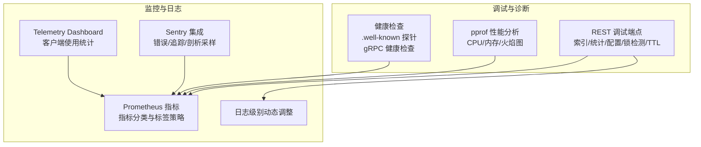
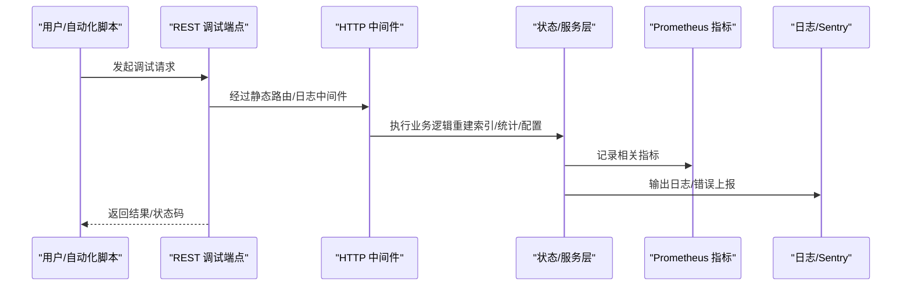
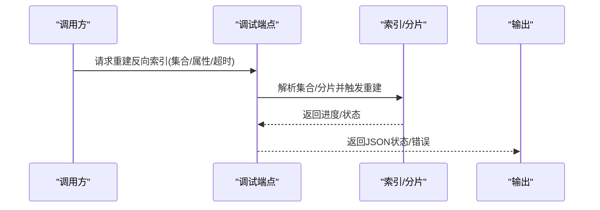
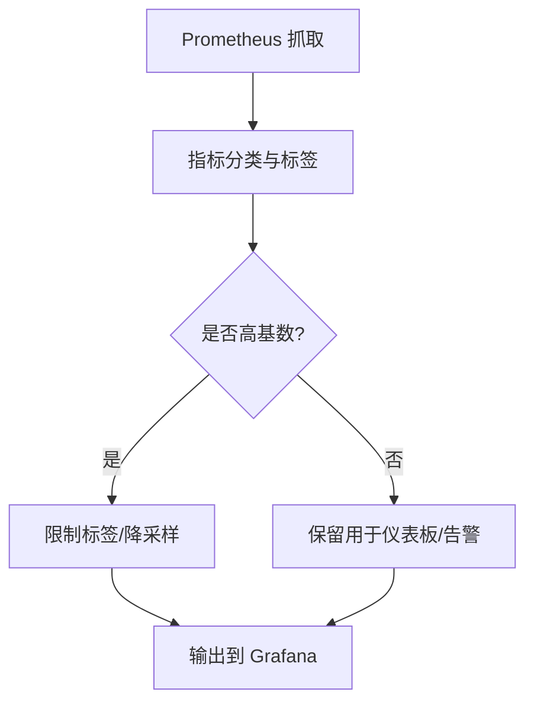
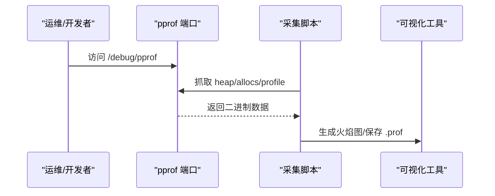
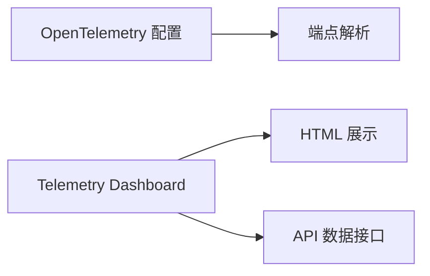
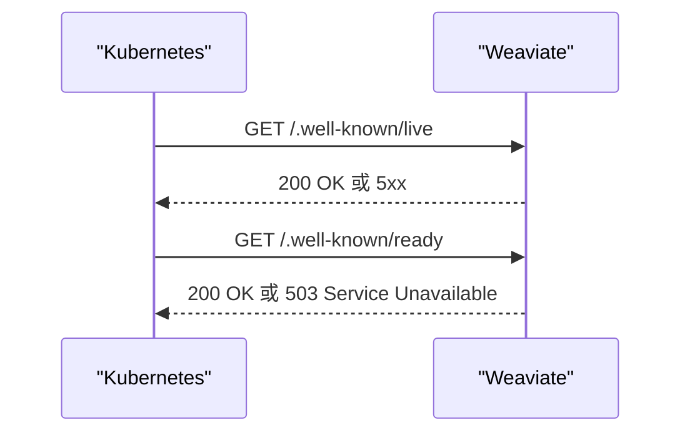
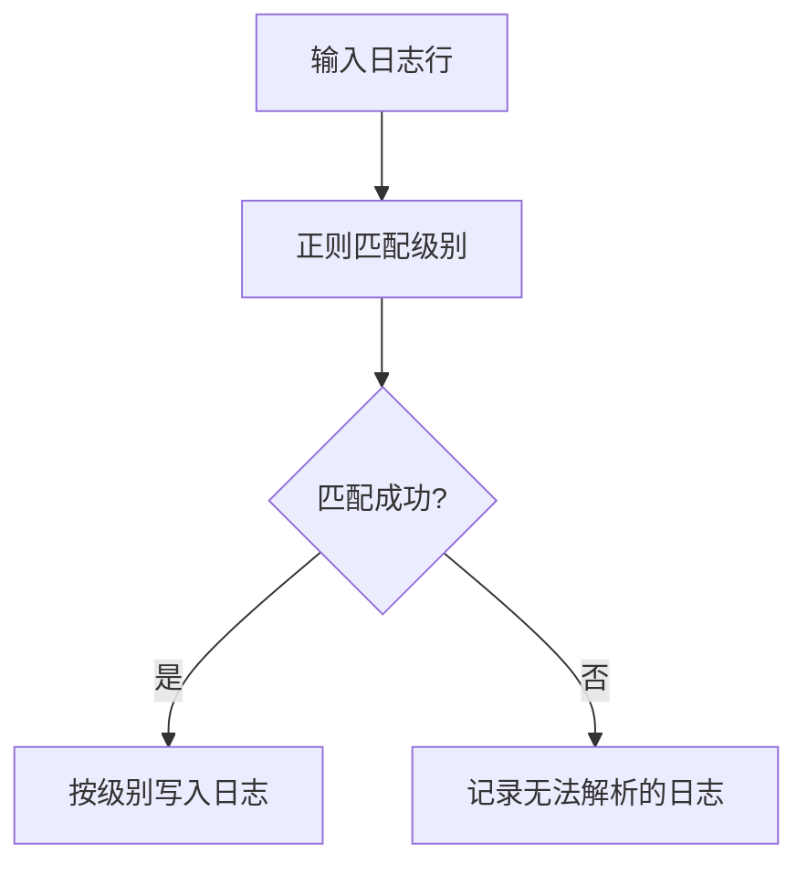
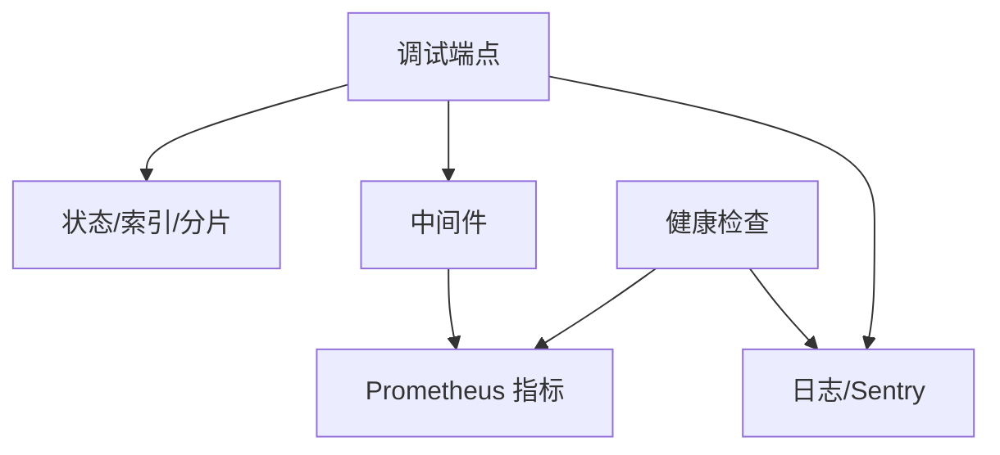

# 诊断工具

<cite>
**本文引用的文件**
- [adapters/handlers/rest/handlers_debug.go](file://adapters/handlers/rest/handlers_debug.go)
- [docs/metrics.md](file://docs/metrics.md)
- [adapters/handlers/rest/middlewares.go](file://adapters/handlers/rest/middlewares.go)
- [adapters/handlers/rest/clusterapi/serve.go](file://adapters/handlers/rest/clusterapi/serve.go)
- [test/benchmark_bm25/gather_stats.sh](file://test/benchmark_bm25/gather_stats.sh)
- [usecases/cluster/log_workaround.go](file://usecases/cluster/log_workaround.go)
- [adapters/handlers/rest/logger.go](file://adapters/handlers/rest/logger.go)
- [entities/verbosity/verbosity.go](file://entities/verbosity/verbosity.go)
- [usecases/telemetry/opentelemetry/config_test.go](file://usecases/telemetry/opentelemetry/config_test.go)
- [usecases/telemetry/client_tracker.go](file://usecases/telemetry/client_tracker.go)
- [tools/telemetry-dashboard/main.go](file://tools/telemetry-dashboard/main.go)
- [test/acceptance_with_go_client/usage/get_debug_usage.go](file://test/acceptance_with_go_client/usage/get_debug_usage.go)
- [test/acceptance_with_python/get_debug_usage.py](file://test/acceptance_with_python/get_debug_usage.py)
- [adapters/handlers/grpc/v1/generative/parser.go](file://adapters/handlers/grpc/v1/generative/parser.go)
- [grpc/generated/protocol/v1/health_weaviate.pb.go](file://grpc/generated/protocol/v1/health_weaviate.pb.go)
- [client/operations/operations_client.go](file://client/operations/operations_client.go)
- [client/operations/weaviate_wellknown_liveness_responses.go](file://client/operations/weaviate_wellknown_liveness_responses.go)
- [client/operations/weaviate_wellknown_readiness_responses.go](file://client/operations/weaviate_wellknown_readiness_responses.go)
</cite>

## 目录
1. [简介](#简介)
2. [项目结构](#项目结构)
3. [核心组件](#核心组件)
4. [架构总览](#架构总览)
5. [详细组件分析](#详细组件分析)
6. [依赖关系分析](#依赖关系分析)
7. [性能考量](#性能考量)
8. [故障排查指南](#故障排查指南)
9. [结论](#结论)
10. [附录](#附录)

## 简介
本指南面向 Weaviate 运维与开发人员，系统梳理内置诊断工具链，覆盖以下方面：
- 内置调试端点：索引重建、统计信息、配置调整、维护模式、锁检测、对象 TTL 清理等
- 监控与日志：Prometheus 指标分类、Grafana 仪表板、日志级别动态调整、Sentry 集成
- 性能分析：pprof CPU/内存/火焰图采集与可视化
- 第三方工具集成：OpenTelemetry、Telemetry Dashboard
- 自动化与健康检查：Kubernetes 就绪/存活探针、自动诊断脚本
- 最佳实践：问题复现、数据导出与分析

## 项目结构
Weaviate 的诊断能力主要分布在以下模块：
- REST 调试端点：集中于调试处理器，提供索引重建、统计查询、配置与运行时参数调整、锁检测等
- 监控与指标：Prometheus 指标文档与中间件，提供 HTTP/gRPC/模块等多维度指标
- 日志与可观测性：日志格式化、日志级别动态调整、Sentry 配置与追踪
- 性能分析：pprof 端口与采集脚本
- 健康检查：Kubernetes 就绪/存活探针与 gRPC 健康检查协议
- Telemetry：客户端使用统计与本地仪表板

**章节来源**
- [adapters/handlers/rest/handlers_debug.go](file://adapters/handlers/rest/handlers_debug.go#L42-L1220)
- [docs/metrics.md](file://docs/metrics.md#L1-L395)
- [adapters/handlers/rest/middlewares.go](file://adapters/handlers/rest/middlewares.go#L135-L176)
- [adapters/handlers/rest/middlewares.go](file://adapters/handlers/rest/middlewares.go#L225-L260)
- [adapters/handlers/rest/clusterapi/serve.go](file://adapters/handlers/rest/clusterapi/serve.go#L210-L248)
- [test/benchmark_bm25/gather_stats.sh](file://test/benchmark_bm25/gather_stats.sh#L1-L43)
- [usecases/cluster/log_workaround.go](file://usecases/cluster/log_workaround.go#L1-L53)
- [adapters/handlers/rest/logger.go](file://adapters/handlers/rest/logger.go#L60-L91)
- [usecases/telemetry/opentelemetry/config_test.go](file://usecases/telemetry/opentelemetry/config_test.go#L1-L58)
- [tools/telemetry-dashboard/main.go](file://tools/telemetry-dashboard/main.go#L140-L562)

## 核心组件
- 调试 REST 端点：提供索引重建、统计查询、配置与运行时参数调整、维护模式、锁检测、对象 TTL 清理等
- 监控与指标：Prometheus 指标分类（仪表板/运营/告警/分析/可废弃/已废弃），标签基数控制
- 日志与 Sentry：日志级别动态调整、Sentry 错误/追踪/剖析采样率配置
- 性能分析：pprof 端口与采集脚本，支持 CPU/内存/火焰图
- 健康检查：Kubernetes 就绪/存活探针与 gRPC 健康检查协议
- Telemetry Dashboard：本地仪表板展示客户端使用统计

**章节来源**
- [adapters/handlers/rest/handlers_debug.go](file://adapters/handlers/rest/handlers_debug.go#L42-L1220)
- [docs/metrics.md](file://docs/metrics.md#L1-L395)
- [adapters/handlers/rest/logger.go](file://adapters/handlers/rest/logger.go#L60-L91)
- [usecases/telemetry/opentelemetry/config_test.go](file://usecases/telemetry/opentelemetry/config_test.go#L1-L58)
- [tools/telemetry-dashboard/main.go](file://tools/telemetry-dashboard/main.go#L140-L562)

## 架构总览
Weaviate 的诊断体系由“入口层（调试端点/探针）—处理层（业务逻辑/指标）—输出层（日志/Prometheus/Sentry/Telemetry）”构成。

**图表来源**
- [adapters/handlers/rest/handlers_debug.go](file://adapters/handlers/rest/handlers_debug.go#L42-L1220)
- [adapters/handlers/rest/middlewares.go](file://adapters/handlers/rest/middlewares.go#L135-L176)
- [adapters/handlers/rest/middlewares.go](file://adapters/handlers/rest/middlewares.go#L225-L260)

**章节来源**
- [adapters/handlers/rest/handlers_debug.go](file://adapters/handlers/rest/handlers_debug.go#L42-L1220)
- [adapters/handlers/rest/middlewares.go](file://adapters/handlers/rest/middlewares.go#L135-L176)
- [adapters/handlers/rest/middlewares.go](file://adapters/handlers/rest/middlewares.go#L225-L260)

## 详细组件分析

### 调试 REST 端点与使用指南
- 索引重建
  - 反向索引重建：支持指定集合、属性、超时；支持暂停/恢复/开始/重置/回滚标记文件；支持设置覆盖项与读取覆盖项
  - 向量索引重建/修复/再量化：按集合/分片/目标向量触发
- 统计与使用报告
  - 获取节点/集合/备份/模式的使用统计，支持精确对象计数
- 配置与运行时参数
  - 日志级别动态调整
  - GOMEMLIMIT/GOMAXPROCS 动态调整
  - 维护模式开关（GET/POST/DELETE）
  - 导出非敏感配置（跳过认证/授权）
- 锁检测
  - 对指定集合的加载分片进行并发锁状态探测，支持超时与选择性分片/锁类型
- 对象 TTL 清理
  - 触发过期对象清理，支持目标节点与截止时间参数

**图表来源**
- [adapters/handlers/rest/handlers_debug.go](file://adapters/handlers/rest/handlers_debug.go#L45-L121)

**章节来源**
- [adapters/handlers/rest/handlers_debug.go](file://adapters/handlers/rest/handlers_debug.go#L42-L1220)
- [test/acceptance_with_go_client/usage/get_debug_usage.go](file://test/acceptance_with_go_client/usage/get_debug_usage.go#L72-L154)
- [test/acceptance_with_python/get_debug_usage.py](file://test/acceptance_with_python/get_debug_usage.py#L169-L210)

### 监控与日志分析
- Prometheus 指标
  - 指标分类：仪表板（dashboard）、运营（operational）、告警（alerting）、分析（analytical）、可废弃（can be deprecated）、已废弃（deprecated）
  - 标签基数控制：优先使用少量有界标签，避免高基数标签爆炸
  - 关键指标类别：批处理、对象操作、查询、LSM、系统、队列、向量索引、启动、墓碑、文本转向量（T2V）、索引分片、自动模式等
- Grafana 仪表板
  - 提供示例仪表板与配置，便于可视化关键指标
- 日志级别动态调整
  - 支持从字符串解析日志级别，动态设置日志等级
- Sentry 集成
  - 支持错误/追踪/剖析采样率配置，环境变量驱动

**图表来源**
- [docs/metrics.md](file://docs/metrics.md#L25-L36)
- [docs/metrics.md](file://docs/metrics.md#L40-L395)

**章节来源**
- [docs/metrics.md](file://docs/metrics.md#L1-L395)
- [adapters/handlers/rest/logger.go](file://adapters/handlers/rest/logger.go#L60-L91)
- [usecases/telemetry/opentelemetry/config_test.go](file://usecases/telemetry/opentelemetry/config_test.go#L1-L58)

### 性能分析工具（pprof）
- pprof 端口
  - 默认端口 6060，暴露 CPU/内存/阻塞/互斥体等分析数据
- 采集脚本
  - 自动抓取 allocs/heap/profile，并生成火焰图或保存为 .prof 文件
- 使用建议
  - 在低峰期或可控窗口内采集，避免对生产造成额外压力

**图表来源**
- [test/benchmark_bm25/gather_stats.sh](file://test/benchmark_bm25/gather_stats.sh#L1-L43)

**章节来源**
- [test/benchmark_bm25/gather_stats.sh](file://test/benchmark_bm25/gather_stats.sh#L1-L43)

### 第三方诊断工具集成
- OpenTelemetry
  - 支持 gRPC/HTTP 端点解析，确保端点与协议前缀正确
- Telemetry Dashboard
  - 本地 HTTP 服务接收遥测负载，渲染机器与客户端使用统计
  - 支持自动刷新与 HTML 展示

**图表来源**
- [usecases/telemetry/opentelemetry/config_test.go](file://usecases/telemetry/opentelemetry/config_test.go#L1-L58)
- [tools/telemetry-dashboard/main.go](file://tools/telemetry-dashboard/main.go#L140-L562)

**章节来源**
- [usecases/telemetry/opentelemetry/config_test.go](file://usecases/telemetry/opentelemetry/config_test.go#L1-L58)
- [tools/telemetry-dashboard/main.go](file://tools/telemetry-dashboard/main.go#L140-L562)

### 健康检查与就绪/存活探针
- Kubernetes 就绪/存活探针
  - .well-known/live：存活探针
  - .well-known/ready：就绪探针，考虑维护模式、集群健康分、模块元信息可用性
- gRPC 健康检查
  - 协议定义包含服务字段，可用于健康检查

**图表来源**
- [adapters/handlers/rest/middlewares.go](file://adapters/handlers/rest/middlewares.go#L233-L259)
- [client/operations/operations_client.go](file://client/operations/operations_client.go#L94-L136)
- [client/operations/weaviate_wellknown_liveness_responses.go](file://client/operations/weaviate_wellknown_liveness_responses.go#L83-L99)
- [client/operations/weaviate_wellknown_readiness_responses.go](file://client/operations/weaviate_wellknown_readiness_responses.go#L31-L67)
- [grpc/generated/protocol/v1/health_weaviate.pb.go](file://grpc/generated/protocol/v1/health_weaviate.pb.go#L109-L151)

**章节来源**
- [adapters/handlers/rest/middlewares.go](file://adapters/handlers/rest/middlewares.go#L233-L259)
- [client/operations/operations_client.go](file://client/operations/operations_client.go#L94-L136)
- [client/operations/weaviate_wellknown_liveness_responses.go](file://client/operations/weaviate_wellknown_liveness_responses.go#L83-L99)
- [client/operations/weaviate_wellknown_readiness_responses.go](file://client/operations/weaviate_wellknown_readiness_responses.go#L31-L67)
- [grpc/generated/protocol/v1/health_weaviate.pb.go](file://grpc/generated/protocol/v1/health_weaviate.pb.go#L109-L151)

### 日志分析与集群日志解析
- 日志级别解析
  - 支持从字符串解析日志级别（panic/fatal/error/warn/info/debug/trace）
- 集群日志解析
  - 将 memberlist 日志按级别重定向到统一日志系统，便于分析

**图表来源**
- [usecases/cluster/log_workaround.go](file://usecases/cluster/log_workaround.go#L20-L53)
- [adapters/handlers/rest/logger.go](file://adapters/handlers/rest/logger.go#L68-L91)

**章节来源**
- [adapters/handlers/rest/logger.go](file://adapters/handlers/rest/logger.go#L60-L91)
- [usecases/cluster/log_workaround.go](file://usecases/cluster/log_workaround.go#L1-L53)

### 自动化诊断脚本与健康检查
- 诊断脚本
  - 使用 curl/go tool pprof 抓取性能数据，生成火焰图或保存 .prof 文件
- 健康检查
  - 结合 .well-known 探针与模块元信息可用性判断就绪状态

**章节来源**
- [test/benchmark_bm25/gather_stats.sh](file://test/benchmark_bm25/gather_stats.sh#L1-L43)
- [adapters/handlers/rest/middlewares.go](file://adapters/handlers/rest/middlewares.go#L233-L259)

## 依赖关系分析
- 调试端点依赖状态/索引/分片/模块元信息等服务层能力
- 中间件负责静态路由标注与日志记录，辅助指标与可观测性
- 指标分类与标签策略决定 Grafana 仪表板与告警的稳定性
- 健康检查与 gRPC 健康协议为容器编排提供基础保障

**图表来源**
- [adapters/handlers/rest/handlers_debug.go](file://adapters/handlers/rest/handlers_debug.go#L42-L1220)
- [adapters/handlers/rest/middlewares.go](file://adapters/handlers/rest/middlewares.go#L135-L176)
- [adapters/handlers/rest/middlewares.go](file://adapters/handlers/rest/middlewares.go#L225-L260)

**章节来源**
- [adapters/handlers/rest/handlers_debug.go](file://adapters/handlers/rest/handlers_debug.go#L42-L1220)
- [adapters/handlers/rest/middlewares.go](file://adapters/handlers/rest/middlewares.go#L135-L176)
- [adapters/handlers/rest/middlewares.go](file://adapters/handlers/rest/middlewares.go#L225-L260)

## 性能考量
- 指标设计
  - 控制标签基数，避免每租户/每类/每路由的标签爆炸
  - 将探索性或高基数分析移至日志/追踪或外部存储
- 采集窗口
  - 在低峰期或可控窗口内进行 pprof 采集，减少对生产的影响
- 维护模式
  - 使用维护模式临时隔离流量，降低诊断对在线服务的影响

[本节为通用指导，无需特定文件引用]

## 故障排查指南
- 索引重建失败
  - 检查集合/分片是否存在、属性列表是否为空、超时设置是否合理
  - 使用状态端点查看重建进度与快照数量
- 锁检测返回锁定
  - 缩小检测范围（仅针对特定分片/锁类型），缩短超时时间，定位热点路径
- 配置调整无效
  - 确认端点方法（GET/POST/DELETE）、参数格式（如 GOMEMLIMIT 支持人类可读单位）
- 日志级别未生效
  - 确认字符串级别是否被识别（大小写无关）
- 健康检查异常
  - 检查维护模式、集群健康分、模块元信息可用性

**章节来源**
- [adapters/handlers/rest/handlers_debug.go](file://adapters/handlers/rest/handlers_debug.go#L45-L121)
- [adapters/handlers/rest/handlers_debug.go](file://adapters/handlers/rest/handlers_debug.go#L764-L788)
- [adapters/handlers/rest/logger.go](file://adapters/handlers/rest/logger.go#L68-L91)
- [adapters/handlers/rest/middlewares.go](file://adapters/handlers/rest/middlewares.go#L233-L259)

## 结论
Weaviate 的诊断工具链覆盖了从底层性能分析到上层健康检查的全栈场景。通过合理的指标分类与标签策略、动态日志级别、Sentry 集成、本地 Telemetry Dashboard 以及完善的调试端点，可以高效地完成日常运维与问题定位。建议在生产环境中遵循“低侵扰、可回滚、可观测”的原则，结合自动化脚本与探针，形成闭环的诊断流程。

[本节为总结性内容，无需特定文件引用]

## 附录
- 调试端点清单（示例）
  - 反向索引重建：/debug/index/rebuild/inverted/*
  - 向量索引操作：/debug/index/rebuild/vector、/debug/index/repair/vector、/debug/index/requantize/vector
  - 统计与使用：/debug/usage、/debug/stats/collection/*
  - 配置与运行时：/debug/config、/debug/config/logger/level、/debug/config/maintenance_mode、/debug/config/gomemlimit、/debug/config/gomaxprocs
  - 锁检测：/debug/lsm/deadlock
  - TTL 清理：/debug/ttl/deleteall
- 健康检查
  - 存活：/.well-known/live
  - 就绪：/.well-known/ready
  - gRPC 健康检查：WeaviateHealthCheckRequest

**章节来源**
- [adapters/handlers/rest/handlers_debug.go](file://adapters/handlers/rest/handlers_debug.go#L42-L1220)
- [client/operations/operations_client.go](file://client/operations/operations_client.go#L94-L136)
- [grpc/generated/protocol/v1/health_weaviate.pb.go](file://grpc/generated/protocol/v1/health_weaviate.pb.go#L109-L151)