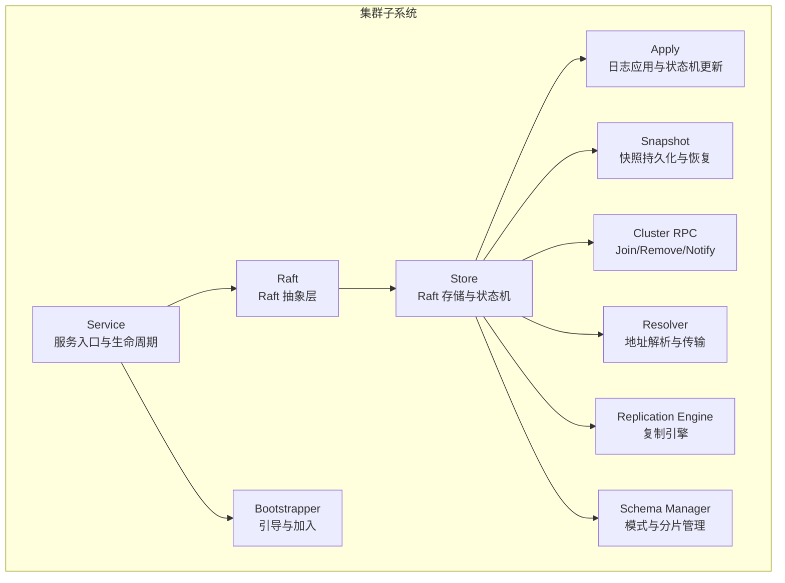
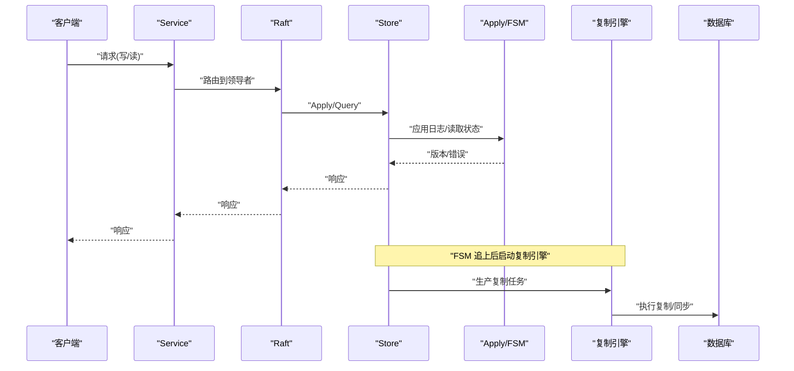
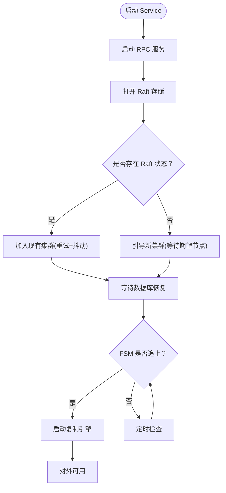
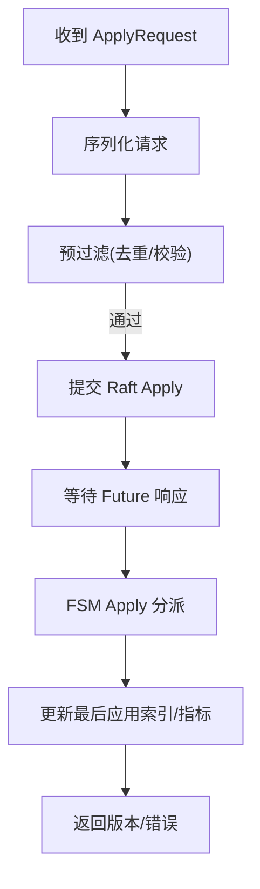
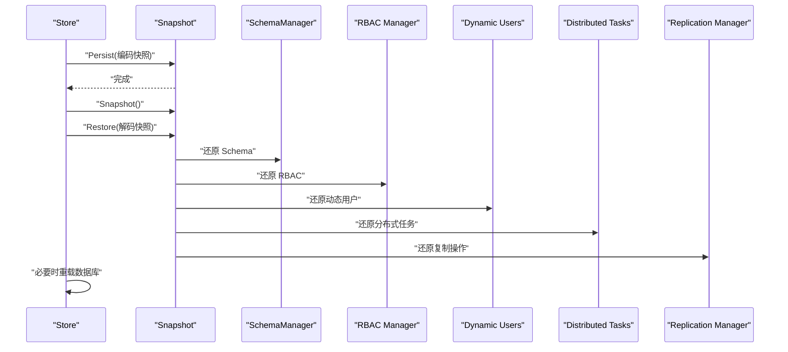
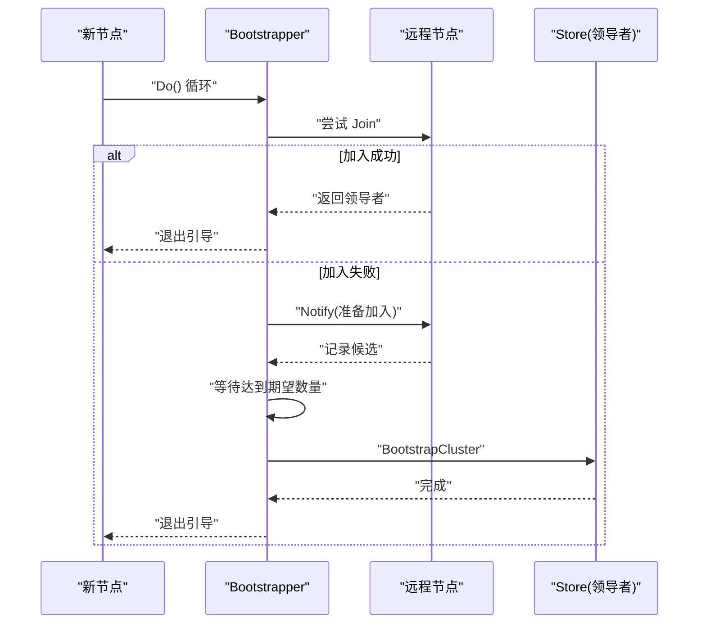
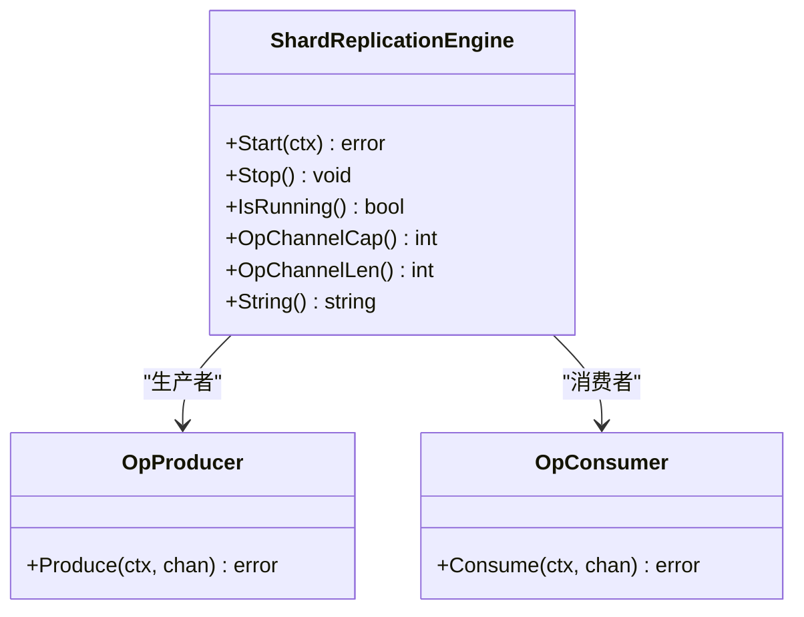
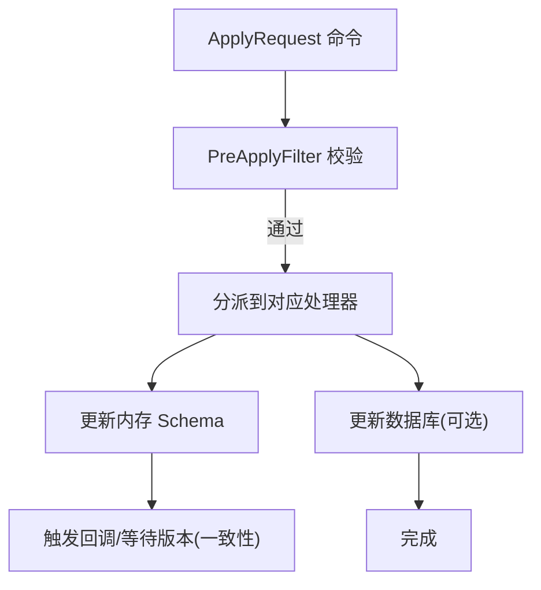
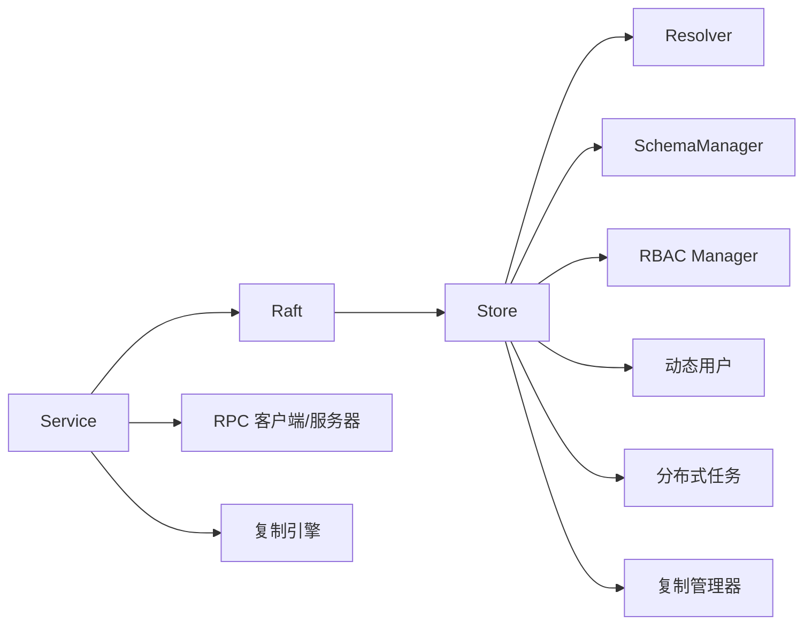

# 集群问题

<cite>
**本文引用的文件**
- [cluster/service.go](file://cluster/service.go)
- [cluster/raft.go](file://cluster/raft.go)
- [cluster/store.go](file://cluster/store.go)
- [cluster/store_apply.go](file://cluster/store_apply.go)
- [cluster/store_snapshot.go](file://cluster/store_snapshot.go)
- [cluster/store_cluster_rpc.go](file://cluster/store_cluster_rpc.go)
- [cluster/bootstrap/bootstrap.go](file://cluster/bootstrap/bootstrap.go)
- [cluster/resolver/raft.go](file://cluster/resolver/raft.go)
- [cluster/replication/shard_replication_engine.go](file://cluster/replication/shard_replication_engine.go)
- [cluster/schema/manager.go](file://cluster/schema/manager.go)
- [cluster/types/errs.go](file://cluster/types/errs.go)
- [cluster/types/types.go](file://cluster/types/types.go)
- [usecases/config/config_handler.go](file://usecases/config/config_handler.go)
- [usecases/config/environment.go](file://usecases/config/environment.go)
- [adapters/handlers/rest/clusterapi/serve.go](file://adapters/handlers/rest/clusterapi/serve.go)
- [client/cluster/cluster_get_statistics_responses.go](file://client/cluster/cluster_get_statistics_responses.go)
- [entities/models/cluster_statistics_response.go](file://entities/models/cluster_statistics_response.go)
</cite>

## 目录
1. [简介](#简介)
2. [项目结构](#项目结构)
3. [核心组件](#核心组件)
4. [架构总览](#架构总览)
5. [详细组件分析](#详细组件分析)
6. [依赖关系分析](#依赖关系分析)
7. [性能考量](#性能考量)
8. [故障排除指南](#故障排除指南)
9. [结论](#结论)
10. [附录](#附录)

## 简介
本指南面向 Weaviate 集群运维与开发人员，聚焦于集群节点故障的诊断与恢复、Raft 协议相关问题排查（领导者选举、日志复制、快照同步）、扩容与缩容过程中的问题处理、数据一致性检查与修复、监控与健康检查最佳实践、自动故障转移配置与验证，以及紧急情况下的手动干预与数据恢复操作。文档以代码为依据，结合流程图与序列图，帮助读者快速定位问题并采取有效措施。

## 项目结构
Weaviate 的集群子系统围绕 Raft 分布式共识协议构建，关键模块包括：
- 服务入口与生命周期管理：cluster/service.go、cluster/raft.go、cluster/store.go
- 元数据与状态机：cluster/store_apply.go、cluster/store_snapshot.go
- 引导与集群加入/移除：cluster/bootstrap/bootstrap.go、cluster/store_cluster_rpc.go
- 地址解析与传输：cluster/resolver/raft.go
- 复制引擎与分片复制：cluster/replication/shard_replication_engine.go、cluster/schema/manager.go
- 错误类型与通用类型：cluster/types/errs.go、cluster/types/types.go
- 配置与环境变量：usecases/config/config_handler.go、usecases/config/environment.go
- 集群统计与监控接口：adapters/handlers/rest/clusterapi/serve.go、client/cluster/cluster_get_statistics_responses.go、entities/models/cluster_statistics_response.go

图表来源
- [cluster/service.go](file://cluster/service.go#L69-L117)
- [cluster/raft.go](file://cluster/raft.go#L44-L99)
- [cluster/store.go](file://cluster/store.go#L309-L339)
- [cluster/store_apply.go](file://cluster/store_apply.go#L77-L424)
- [cluster/store_snapshot.go](file://cluster/store_snapshot.go#L29-L98)
- [cluster/bootstrap/bootstrap.go](file://cluster/bootstrap/bootstrap.go#L49-L130)
- [cluster/store_cluster_rpc.go](file://cluster/store_cluster_rpc.go#L26-L102)
- [cluster/resolver/raft.go](file://cluster/resolver/raft.go#L46-L119)
- [cluster/replication/shard_replication_engine.go](file://cluster/replication/shard_replication_engine.go#L111-L271)
- [cluster/schema/manager.go](file://cluster/schema/manager.go#L52-L90)

章节来源
- [cluster/service.go](file://cluster/service.go#L149-L209)
- [cluster/store.go](file://cluster/store.go#L363-L417)

## 核心组件
- Service：集群服务入口，负责初始化 Raft、启动 RPC 服务、引导集群、等待数据库恢复、在 FSM 追上后启动复制引擎。
- Raft：对底层 Raft 实现的薄封装，统一查询与写入路径，确保在领导者节点执行写操作。
- Store：Raft 存储实现，承载 FSM、日志与快照存储，负责 Apply、Snapshot、Restore、Join/Remove/Notify 等。
- Bootstrapper：引导器，尝试加入现有集群或通知其他节点准备加入，支持抖动与重试。
- Resolver：基于节点名称解析 Raft 地址，支持本地多端口与成员列表发现。
- Replication Engine：复制引擎，采用生产者-消费者模型协调分片复制任务。
- Schema Manager：负责模式变更的提交与应用，维护类、分片、租户、复制等元数据。

章节来源
- [cluster/service.go](file://cluster/service.go#L48-L117)
- [cluster/raft.go](file://cluster/raft.go#L29-L99)
- [cluster/store.go](file://cluster/store.go#L194-L255)
- [cluster/bootstrap/bootstrap.go](file://cluster/bootstrap/bootstrap.go#L36-L130)
- [cluster/resolver/raft.go](file://cluster/resolver/raft.go#L26-L119)
- [cluster/replication/shard_replication_engine.go](file://cluster/replication/shard_replication_engine.go#L48-L133)
- [cluster/schema/manager.go](file://cluster/schema/manager.go#L44-L90)

## 架构总览
下图展示从客户端到 Raft、FSM、复制引擎与数据库的整体调用链路与职责边界。

图表来源
- [cluster/service.go](file://cluster/service.go#L149-L209)
- [cluster/raft.go](file://cluster/raft.go#L51-L99)
- [cluster/store_apply.go](file://cluster/store_apply.go#L27-L61)
- [cluster/store.go](file://cluster/store.go#L119-L147)

## 详细组件分析

### 组件 A：Service 与 Raft 生命周期
- 职责：初始化 RPC 服务器、Raft 存储；根据是否已有状态选择加入或引导；等待数据库恢复；FSM 追上后启动复制引擎。
- 关键点：启动顺序严格控制，避免在未就绪时接受请求；关闭时先停止复制引擎再关闭 Raft。

图表来源
- [cluster/service.go](file://cluster/service.go#L149-L209)
- [cluster/service.go](file://cluster/service.go#L119-L147)

章节来源
- [cluster/service.go](file://cluster/service.go#L149-L209)

### 组件 B：Store 与 Apply 流程
- 职责：将 ApplyRequest 序列化后提交到 Raft，等待 Future 响应；在 Apply 中按命令类型分派给 SchemaManager、RBAC、动态用户、分布式任务或复制管理器；更新指标与最后应用索引。
- 关键点：schemaOnly 模式用于重启回放阶段，避免对数据库产生副作用；错误时记录领导者与节点状态便于排障。

图表来源
- [cluster/store_apply.go](file://cluster/store_apply.go#L27-L61)
- [cluster/store_apply.go](file://cluster/store_apply.go#L77-L424)

章节来源
- [cluster/store_apply.go](file://cluster/store_apply.go#L77-L424)

### 组件 C：快照与恢复
- 职责：持久化 Schema、别名、RBAC、动态用户、分布式任务与复制操作；恢复时按模块逐一还原，并在必要时从 Schema 重建数据库。
- 关键点：MetadataOnlyVoters 模式下跳过数据库加载；恢复完成后根据索引决定是否重载数据库。

图表来源
- [cluster/store_snapshot.go](file://cluster/store_snapshot.go#L29-L98)
- [cluster/store_snapshot.go](file://cluster/store_snapshot.go#L103-L201)

章节来源
- [cluster/store_snapshot.go](file://cluster/store_snapshot.go#L29-L98)
- [cluster/store_snapshot.go](file://cluster/store_snapshot.go#L103-L201)

### 组件 D：引导与集群变更
- Bootstrapper：优先尝试加入现有集群，失败则通知其他节点准备加入，直到达到期望节点数后引导集群。
- Join/Remove/Notify：仅领导者可执行 Join/Remove；Notify 收集候选节点并在满足条件时引导集群。

图表来源
- [cluster/bootstrap/bootstrap.go](file://cluster/bootstrap/bootstrap.go#L64-L130)
- [cluster/store_cluster_rpc.go](file://cluster/store_cluster_rpc.go#L53-L102)

章节来源
- [cluster/bootstrap/bootstrap.go](file://cluster/bootstrap/bootstrap.go#L64-L130)
- [cluster/store_cluster_rpc.go](file://cluster/store_cluster_rpc.go#L26-L102)

### 组件 E：复制引擎与分片复制
- 职责：生产者-消费者模型，缓冲通道实现背压；限制最大并发工作者；优雅关闭与超时控制；度量回调。
- 关键点：复制引擎在 FSM 追上后才启动；可通过配置控制最大工作者与关闭超时。

图表来源
- [cluster/replication/shard_replication_engine.go](file://cluster/replication/shard_replication_engine.go#L48-L133)
- [cluster/replication/shard_replication_engine.go](file://cluster/replication/shard_replication_engine.go#L135-L271)

章节来源
- [cluster/replication/shard_replication_engine.go](file://cluster/replication/shard_replication_engine.go#L111-L271)

### 组件 F：Schema 管理与一致性等待
- 职责：SchemaManager 在 Apply 前进行预过滤，随后按命令类型更新内存 Schema 与数据库；提供 WaitForAppliedIndex 等待特定版本被应用。
- 关键点：多租户与复制因子变更时的前置校验；更新分片状态时区分本地与远端节点。

图表来源
- [cluster/schema/manager.go](file://cluster/schema/manager.go#L118-L143)
- [cluster/schema/manager.go](file://cluster/schema/manager.go#L652-L676)
- [cluster/store.go](file://cluster/store.go#L598-L623)

章节来源
- [cluster/schema/manager.go](file://cluster/schema/manager.go#L118-L143)
- [cluster/schema/manager.go](file://cluster/schema/manager.go#L652-L676)
- [cluster/store.go](file://cluster/store.go#L598-L623)

## 依赖关系分析
- Service 依赖 Raft、Store、RPC 客户端/服务器、复制引擎与 FSM 生产者/消费者。
- Store 依赖 SchemaManager、RBAC、动态用户、分布式任务与复制管理器。
- Resolver 提供 Raft 地址解析与 TCP 传输配置。
- 配置模块提供 Raft 超时、快照、引导等参数，支持环境变量覆盖。

图表来源
- [cluster/service.go](file://cluster/service.go#L69-L117)
- [cluster/raft.go](file://cluster/raft.go#L44-L99)
- [cluster/store.go](file://cluster/store.go#L309-L339)
- [cluster/resolver/raft.go](file://cluster/resolver/raft.go#L46-L119)

章节来源
- [cluster/service.go](file://cluster/service.go#L69-L117)
- [cluster/store.go](file://cluster/store.go#L309-L339)
- [cluster/resolver/raft.go](file://cluster/resolver/raft.go#L46-L119)

## 性能考量
- 超时与倍数：支持自定义心跳、选举、领导者租约超时，并可通过倍数调整以适应网络延迟。
- 快照策略：阈值、间隔与尾部日志保留影响日志压缩与追赶效率。
- 并发与背压：复制引擎使用有界通道与最大工作者数控制资源占用。
- 指标观测：Apply 持续时间直方图、失败计数、最后应用索引等指标有助于定位瓶颈。

章节来源
- [usecases/config/config_handler.go](file://usecases/config/config_handler.go#L573-L591)
- [usecases/config/environment.go](file://usecases/config/environment.go#L1119-L1154)
- [cluster/store.go](file://cluster/store.go#L257-L307)
- [cluster/replication/shard_replication_engine.go](file://cluster/replication/shard_replication_engine.go#L111-L133)

## 故障排除指南

### 一、节点离线与恢复
- 现象：节点无法加入集群、长时间无领导者、Ready 为假。
- 排查步骤：
  1) 检查 Service.Open 是否成功启动 RPC 与 Raft；确认是否有“could not join raft join list”等引导错误。
  2) 使用 Store.Stats 查看当前领导者、配置服务器列表、是否已引导、最后应用索引等。
  3) 若存在旧状态但无法加入，考虑增加引导超时或检查节点端口映射。
  4) 对于单节点丢失法定人数的情况，可启用强制单节点恢复（仅限单节点且明确风险）。
- 处理建议：
  - 引导失败：确认 Join 列表与地址解析；检查 Resolver 是否能解析节点地址。
  - 单节点恢复：在 MetadataOnlyVoters 模式下进行恢复，随后重建 Raft 并替换状态中的节点名（如需要）。

章节来源
- [cluster/service.go](file://cluster/service.go#L149-L209)
- [cluster/store.go](file://cluster/store.go#L672-L708)
- [cluster/store.go](file://cluster/store.go#L859-L940)
- [cluster/resolver/raft.go](file://cluster/resolver/raft.go#L58-L85)

### 二、网络分区与脑裂
- 现象：领导者不可达、多数派不可用、出现多个领导者或领导者频繁切换。
- 排查步骤：
  1) 检查 Raft 超时配置（心跳/选举/租约）与倍数，适当提高以容忍网络抖动。
  2) 使用 Store.Stats 观察配置服务器列表与领导者变化。
  3) 检查 Resolver 的地址解析结果，确认本地多端口场景下的端口映射正确。
- 处理建议：
  - 调整超时倍数与快照策略，减少不必要的领导者选举。
  - 在分区恢复后，确保所有节点的配置一致，必要时通过 Join/Remove 修正配置。

章节来源
- [usecases/config/environment.go](file://usecases/config/environment.go#L1119-L1154)
- [cluster/store.go](file://cluster/store.go#L735-L784)
- [cluster/resolver/raft.go](file://cluster/resolver/raft.go#L58-L85)

### 三、Raft 协议相关问题
- 领导者选举不稳定：
  - 检查超时配置与倍数；确认网络延迟与丢包率。
  - 使用 Store.Stats 查看领导者地址与 ID 变化频率。
- 日志复制缓慢：
  - 检查 Apply 持续时间直方图与失败计数；关注复制引擎通道长度与工作者数。
  - 调整复制引擎最大工作者与关闭超时。
- 快照同步异常：
  - 检查快照持久化与恢复流程；确认各模块快照内容完整。
  - 在 MetadataOnlyVoters 模式下避免数据库操作，确保只做元数据恢复。

章节来源
- [cluster/store.go](file://cluster/store.go#L257-L307)
- [cluster/store.go](file://cluster/store.go#L735-L784)
- [cluster/store_snapshot.go](file://cluster/store_snapshot.go#L29-L98)
- [cluster/replication/shard_replication_engine.go](file://cluster/replication/shard_replication_engine.go#L111-L133)

### 四、扩容与缩容
- 扩容：
  - 新节点通过 Bootstrapper 尝试 Join；若失败则 Notify 其他节点准备加入。
  - 领导者执行 Join/AddVoter/AddNonvoter；随后复制引擎开始工作。
- 缩容：
  - 首先通过 UpdateShardStatus 或删除租户/类触发复制清理。
  - 领导者执行 RemoveServer；非投票节点可直接移除。
- 注意事项：
  - 复制因子增加前需确保分片已有足够副本。
  - 缩容过程中避免删除正在进行复制的任务。

章节来源
- [cluster/bootstrap/bootstrap.go](file://cluster/bootstrap/bootstrap.go#L64-L130)
- [cluster/store_cluster_rpc.go](file://cluster/store_cluster_rpc.go#L26-L51)
- [cluster/schema/manager.go](file://cluster/schema/manager.go#L289-L301)
- [cluster/schema/manager.go](file://cluster/schema/manager.go#L337-L369)

### 五、数据一致性检查与修复
- 一致性等待：
  - 使用 WaitForAppliedIndex 等待指定版本在节点上应用，保障读写一致性。
- 分片迁移与副本同步：
  - 通过复制管理器注册/更新/取消复制任务；在目标节点执行 SyncShard。
  - 检查复制引擎通道长度与工作者状态，避免积压。
- 数据校验：
  - 通过快照与 Apply 回放验证 Schema 与数据库一致性；必要时重载数据库。

章节来源
- [cluster/store.go](file://cluster/store.go#L598-L623)
- [cluster/schema/manager.go](file://cluster/schema/manager.go#L539-L602)
- [cluster/replication/shard_replication_engine.go](file://cluster/replication/shard_replication_engine.go#L220-L238)

### 六、监控与健康检查
- 集群统计接口：
  - 提供 /v1/cluster/statistics 获取节点与集群统计信息，支持鉴权与错误响应。
- 指标采集：
  - Apply 持续时间、失败次数、最后应用索引等 Prometheus 指标可用于告警与趋势分析。
- 健康检查：
  - Ready 状态与领导者存在性是健康的关键信号；配合日志级别与超时配置优化可观测性。

章节来源
- [adapters/handlers/rest/clusterapi/serve.go](file://adapters/handlers/rest/clusterapi/serve.go#L237-L248)
- [client/cluster/cluster_get_statistics_responses.go](file://client/cluster/cluster_get_statistics_responses.go#L29-L70)
- [entities/models/cluster_statistics_response.go](file://entities/models/cluster_statistics_response.go#L59-L130)
- [cluster/store.go](file://cluster/store.go#L257-L307)

### 七、自动故障转移与验证
- 自动转移：
  - 关闭时领导者会尝试将领导权转移给其他节点，减少停机窗口。
- 验证方法：
  - 关闭前检查领导者与服务器配置；关闭后验证新领导者可达与配置一致。
  - 使用 Stats 与日志确认转移完成。

章节来源
- [cluster/store.go](file://cluster/store.go#L520-L567)

### 八、紧急手动干预与数据恢复
- 单节点恢复：
  - 在 MetadataOnlyVoters 模式下进行 RecoverCluster，重建 Raft 并在必要时替换状态中的节点名。
- 快照恢复：
  - 通过 Restore 逐模块恢复 Schema、RBAC、动态用户、分布式任务与复制操作。
- 强制删除复制：
  - 使用复制管理器的强制删除接口清理异常复制任务。

章节来源
- [cluster/store.go](file://cluster/store.go#L859-L940)
- [cluster/store_snapshot.go](file://cluster/store_snapshot.go#L103-L201)
- [cluster/schema/manager.go](file://cluster/schema/manager.go#L347-L369)

## 结论
Weaviate 集群通过 Raft 保证强一致，结合复制引擎与快照机制实现高可用与可扩展。故障排除应围绕引导、领导者选举、日志复制、快照恢复与一致性等待展开。合理配置超时与快照策略、利用指标与统计接口、遵循扩容/缩容流程，可显著降低故障影响并提升系统稳定性。

## 附录
- 常见错误类型：ErrNotLeader、ErrLeaderNotFound、ErrNotOpen、ErrUnknownCommand、ErrDeadlineExceeded、ErrNotFound。
- 类型与常量：ClassState、RaftResolver 接口、租户活动状态常量等。

章节来源
- [cluster/types/errs.go](file://cluster/types/errs.go#L16-L26)
- [cluster/types/types.go](file://cluster/types/types.go#L24-L41)