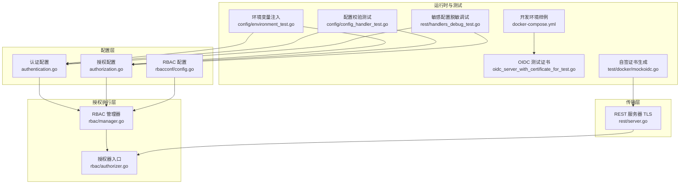
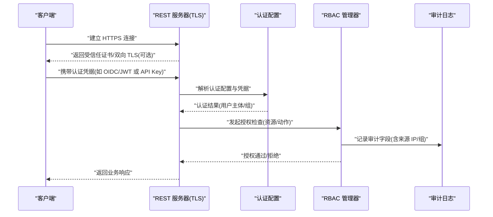
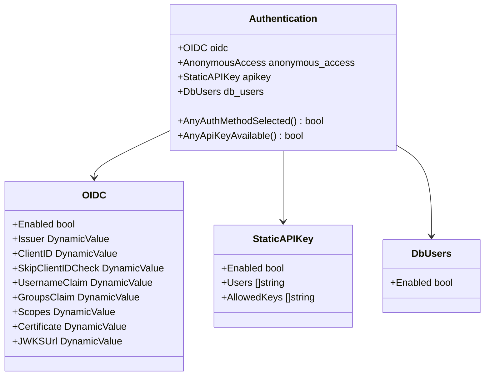
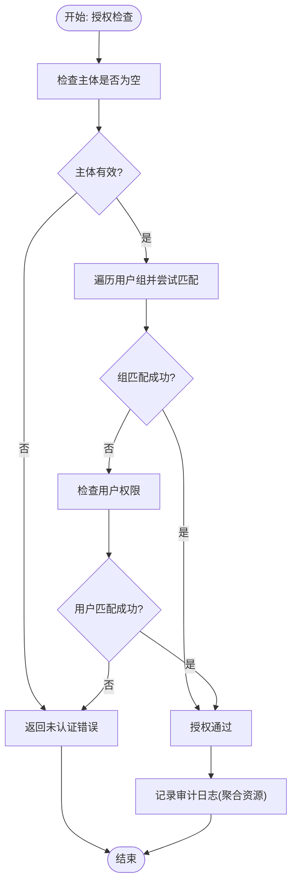
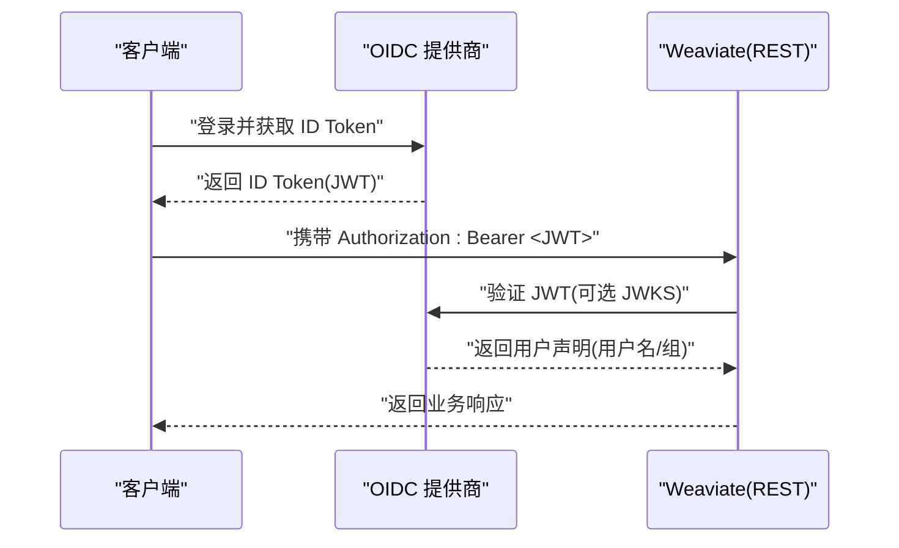
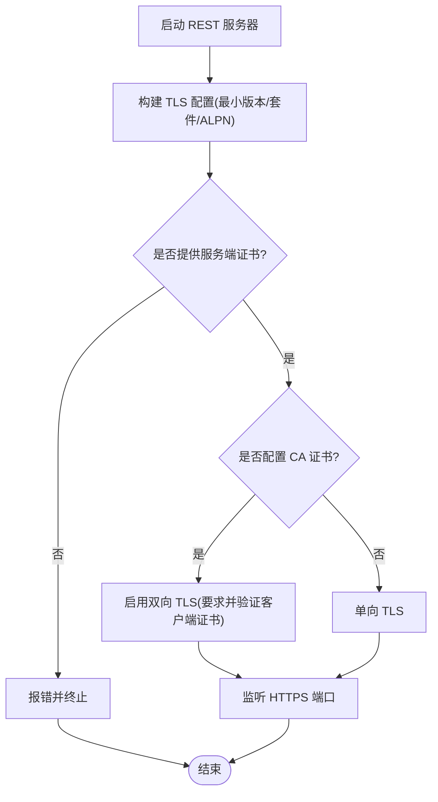
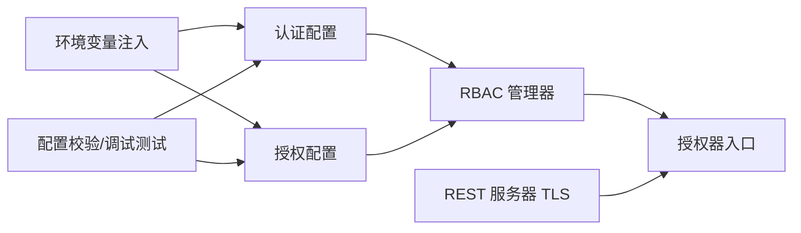

# 安全实践

<cite>
**本文引用的文件**
- [authentication.go](file://usecases/config/authentication.go)
- [authorization.go](file://usecases/config/authorization.go)
- [config.go](file://usecases/auth/authorization/rbac/rbacconf/config.go)
- [manager.go](file://usecases/auth/authorization/rbac/manager.go)
- [authorizer.go](file://usecases/auth/authorization/rbac/authorizer.go)
- [server.go](file://adapters/handlers/rest/server.go)
- [environment_test.go](file://usecases/config/environment_test.go)
- [config_handler_test.go](file://usecases/config/config_handler_test.go)
- [handlers_debug_test.go](file://adapters/handlers/rest/handlers_debug_test.go)
- [docker-compose.yml](file://docker-compose.yml)
- [oidc_server_with_certificate_for_test.go](file://usecases/auth/authentication/oidc/oidc_server_with_certificate_for_test.go)
- [mockoidc.go](file://test/docker/mockoidc.go)
</cite>

## 目录
1. [简介](#简介)
2. [项目结构](#项目结构)
3. [核心组件](#核心组件)
4. [架构总览](#架构总览)
5. [详细组件分析](#详细组件分析)
6. [依赖关系分析](#依赖关系分析)
7. [性能考量](#性能考量)
8. [故障排查指南](#故障排查指南)
9. [结论](#结论)
10. [附录](#附录)

## 简介
本指南面向安全管理员与运维人员，围绕 Weaviate 的安全实践提供系统化最佳实践，覆盖认证与授权配置、RBAC 权限模型、传输与静态数据保护、网络安全与审计、安全监控与威胁检测、安全配置模板与漏洞防护清单等。文档基于仓库中的实际实现进行提炼，并通过图示与来源标注帮助读者快速定位到相关源码位置。

## 项目结构
Weaviate 的安全能力主要由以下模块构成：
- 认证配置：支持匿名访问、OIDC、静态 API Key、数据库用户等多种认证方式
- 授权配置：支持管理员列表与 RBAC 两种授权模式，二者不可同时启用
- 传输安全：REST 服务器内置 TLS 配置，支持证书与双向 TLS
- 审计与日志：RBAC 授权过程具备审计字段与聚合日志输出
- 运行时环境：通过环境变量注入认证与授权配置
- 测试与样例：提供 OIDC 测试证书与 docker-compose 开发环境

**图表来源**
- [authentication.go](file://usecases/config/authentication.go#L20-L84)
- [authorization.go](file://usecases/config/authorization.go#L21-L49)
- [config.go](file://usecases/auth/authorization/rbac/rbacconf/config.go#L14-L31)
- [manager.go](file://usecases/auth/authorization/rbac/manager.go#L40-L602)
- [authorizer.go](file://usecases/auth/authorization/rbac/authorizer.go#L26-L51)
- [server.go](file://adapters/handlers/rest/server.go#L253-L330)
- [environment_test.go](file://usecases/config/environment_test.go#L730-L774)
- [config_handler_test.go](file://usecases/config/config_handler_test.go#L261-L294)
- [handlers_debug_test.go](file://adapters/handlers/rest/handlers_debug_test.go#L147-L191)
- [docker-compose.yml](file://docker-compose.yml#L42-L51)
- [oidc_server_with_certificate_for_test.go](file://usecases/auth/authentication/oidc/oidc_server_with_certificate_for_test.go#L49-L70)
- [mockoidc.go](file://test/docker/mockoidc.go#L111-L142)

**章节来源**
- [authentication.go](file://usecases/config/authentication.go#L20-L84)
- [authorization.go](file://usecases/config/authorization.go#L21-L49)
- [config.go](file://usecases/auth/authorization/rbac/rbacconf/config.go#L14-L31)
- [manager.go](file://usecases/auth/authorization/rbac/manager.go#L40-L602)
- [authorizer.go](file://usecases/auth/authorization/rbac/authorizer.go#L26-L51)
- [server.go](file://adapters/handlers/rest/server.go#L253-L330)
- [environment_test.go](file://usecases/config/environment_test.go#L730-L774)
- [config_handler_test.go](file://usecases/config/config_handler_test.go#L261-L294)
- [handlers_debug_test.go](file://adapters/handlers/rest/handlers_debug_test.go#L147-L191)
- [docker-compose.yml](file://docker-compose.yml#L42-L51)
- [oidc_server_with_certificate_for_test.go](file://usecases/auth/authentication/oidc/oidc_server_with_certificate_for_test.go#L49-L70)
- [mockoidc.go](file://test/docker/mockoidc.go#L111-L142)

## 核心组件
- 认证配置（Authentication）
  - 支持 OIDC、匿名访问、静态 API Key、数据库用户四种认证方式
  - 至少需启用一种认证方式；默认开启匿名访问
- 授权配置（Authorization）
  - 支持管理员列表与 RBAC 两种模式，二者不可同时启用
  - RBAC 提供根用户、只读组、查看者、管理员等角色集合
- RBAC 管理器（Manager）
  - 基于 Casbin 实现策略与分组持久化、快照与恢复
  - 支持按用户或组进行权限检查与资源过滤
- 传输安全（REST Server）
  - 默认启用 HTTPS，最小 TLS 版本为 1.2，支持现代密码套件与 ALPN
  - 可配置单向/双向 TLS 证书与监听参数
- 审计与日志（RBAC Authorizer）
  - 授权请求携带版本化审计字段，可选包含来源 IP 与用户组
  - 支持大量重复资源的权限日志聚合，避免噪声

**章节来源**
- [authentication.go](file://usecases/config/authentication.go#L20-L84)
- [authorization.go](file://usecases/config/authorization.go#L21-L49)
- [config.go](file://usecases/auth/authorization/rbac/rbacconf/config.go#L14-L31)
- [manager.go](file://usecases/auth/authorization/rbac/manager.go#L40-L602)
- [authorizer.go](file://usecases/auth/authorization/rbac/authorizer.go#L26-L51)
- [server.go](file://adapters/handlers/rest/server.go#L253-L330)

## 架构总览
下图展示了从配置到执行再到传输层的整体安全架构：

**图表来源**
- [server.go](file://adapters/handlers/rest/server.go#L253-L330)
- [authentication.go](file://usecases/config/authentication.go#L20-L84)
- [manager.go](file://usecases/auth/authorization/rbac/manager.go#L440-L458)
- [authorizer.go](file://usecases/auth/authorization/rbac/authorizer.go#L26-L51)

## 详细组件分析

### 认证配置策略
- OIDC 集成
  - 支持动态配置的 Issuer、ClientID、用户名与组声明、作用域、证书与 JWKS URL
  - 可选择跳过 ClientID 校验（谨慎使用）
- 匿名访问
  - 启用后，未携带有效凭据的请求以“匿名”身份进入授权阶段
  - 仅影响认证，不影响授权策略
- API 密钥与数据库用户
  - 静态 API Key 支持用户白名单与允许的密钥列表
  - 数据库用户启用后，结合 RBAC 进行细粒度授权

**图表来源**
- [authentication.go](file://usecases/config/authentication.go#L20-L84)

**章节来源**
- [authentication.go](file://usecases/config/authentication.go#L20-L84)
- [environment_test.go](file://usecases/config/environment_test.go#L730-L774)

### 授权控制机制（RBAC）
- 角色与权限
  - RBAC 支持根用户、只读组、查看者、管理员等预设集合
  - 策略以“资源-动作-域”三元组表达，支持备份、数据、节点、角色、集合、租户、用户、复制、别名等域
- 权限分配
  - 支持按用户或组授予角色；组权限优先于用户权限
  - 支持批量更新/删除角色与权限，持久化并失效缓存
- 资源过滤与审计
  - 授权器在执行前记录审计字段（版本、来源 IP、用户、组、请求动作）
  - 对大量重复资源的授权结果进行聚合，降低日志噪声

**图表来源**
- [authorizer.go](file://usecases/auth/authorization/rbac/authorizer.go#L26-L51)
- [manager.go](file://usecases/auth/authorization/rbac/manager.go#L440-L458)

**章节来源**
- [config.go](file://usecases/auth/authorization/rbac/rbacconf/config.go#L14-L31)
- [manager.go](file://usecases/auth/authorization/rbac/manager.go#L40-L602)
- [authorizer.go](file://usecases/auth/authorization/rbac/authorizer.go#L26-L51)

### 用户身份验证流程（OIDC）
- OIDC 配置项通过动态值支持运行时更新
- 测试场景提供自签名证书与证书生成工具，便于本地联调
- 生产部署建议使用受信 CA 签发的证书，并启用双向 TLS

**图表来源**
- [authentication.go](file://usecases/config/authentication.go#L62-L73)
- [oidc_server_with_certificate_for_test.go](file://usecases/auth/authentication/oidc/oidc_server_with_certificate_for_test.go#L49-L70)
- [mockoidc.go](file://test/docker/mockoidc.go#L111-L142)

**章节来源**
- [authentication.go](file://usecases/config/authentication.go#L62-L73)
- [oidc_server_with_certificate_for_test.go](file://usecases/auth/authentication/oidc/oidc_server_with_certificate_for_test.go#L49-L70)
- [mockoidc.go](file://test/docker/mockoidc.go#L111-L142)

### 传输加密与 TLS 配置
- 最小 TLS 版本：1.2
- 密码套件：优先使用带前向保密的 ECDHE 套件
- 协议：启用 HTTP/2 与 HTTP/1.1
- 可配置单向/双向 TLS，支持外部 CA 证书与客户端证书校验

**图表来源**
- [server.go](file://adapters/handlers/rest/server.go#L253-L330)

**章节来源**
- [server.go](file://adapters/handlers/rest/server.go#L253-L330)

### 网络安全与审计
- 网络隔离与监听
  - 支持 HTTP/HTTPS/TCP 监听与 Unix Socket
  - 可限制并发连接数与读写超时，提升抗压与抗扫描能力
- 审计字段
  - 授权日志包含版本号、来源 IP、用户、组、请求动作、资源结果等
  - 支持按域/集合/租户/对象等维度聚合日志条目

**章节来源**
- [server.go](file://adapters/handlers/rest/server.go#L80-L115)
- [authorizer.go](file://usecases/auth/authorization/rbac/authorizer.go#L26-L51)

### 安全监控与威胁检测
- 日志聚合与告警
  - 大量重复资源的授权结果会被聚合，便于集中告警与异常检测
- 配置导出与敏感信息脱敏
  - 调试导出配置时会隐藏敏感字段，避免泄露认证与集群凭据

**章节来源**
- [authorizer.go](file://usecases/auth/authorization/rbac/authorizer.go#L579-L584)
- [handlers_debug_test.go](file://adapters/handlers/rest/handlers_debug_test.go#L147-L191)

## 依赖关系分析
- 认证与授权配置相互独立但共同决定访问控制边界
- RBAC 管理器依赖 Casbin 进行策略与分组管理
- REST 服务器负责传输层安全与监听配置
- 环境变量与测试用例确保配置注入与校验的正确性

**图表来源**
- [authentication.go](file://usecases/config/authentication.go#L20-L84)
- [authorization.go](file://usecases/config/authorization.go#L21-L49)
- [manager.go](file://usecases/auth/authorization/rbac/manager.go#L40-L602)
- [authorizer.go](file://usecases/auth/authorization/rbac/authorizer.go#L26-L51)
- [server.go](file://adapters/handlers/rest/server.go#L253-L330)
- [environment_test.go](file://usecases/config/environment_test.go#L730-L774)
- [config_handler_test.go](file://usecases/config/config_handler_test.go#L261-L294)
- [handlers_debug_test.go](file://adapters/handlers/rest/handlers_debug_test.go#L147-L191)

**章节来源**
- [authentication.go](file://usecases/config/authentication.go#L20-L84)
- [authorization.go](file://usecases/config/authorization.go#L21-L49)
- [manager.go](file://usecases/auth/authorization/rbac/manager.go#L40-L602)
- [authorizer.go](file://usecases/auth/authorization/rbac/authorizer.go#L26-L51)
- [server.go](file://adapters/handlers/rest/server.go#L253-L330)
- [environment_test.go](file://usecases/config/environment_test.go#L730-L774)
- [config_handler_test.go](file://usecases/config/config_handler_test.go#L261-L294)
- [handlers_debug_test.go](file://adapters/handlers/rest/handlers_debug_test.go#L147-L191)

## 性能考量
- TLS 性能
  - 使用现代密码套件与 ALPN，减少握手开销
  - 合理设置 Keep-Alive、读写超时与监听上限，避免资源耗尽
- 授权性能
  - RBAC 使用缓存与快照，减少策略加载与校验成本
  - 日志聚合降低高并发下的 I/O 压力

[本节为通用建议，不直接分析具体文件]

## 故障排查指南
- 认证未启用
  - 现象：启动时报“未配置任何认证方案”
  - 处理：至少启用 OIDC、API Key、数据库用户或匿名访问之一
- 授权冲突
  - 现象：同时启用管理员列表与 RBAC
  - 处理：二选一；根据测试用例验证配置
- TLS 证书问题
  - 现象：未提供证书或证书无效
  - 处理：提供服务端证书；若启用双向 TLS，提供 CA 并配置客户端证书校验
- 配置导出敏感信息泄露
  - 现象：调试导出包含敏感字段
  - 处理：使用脱敏导出逻辑，避免在日志中打印明文凭据

**章节来源**
- [authentication.go](file://usecases/config/authentication.go#L35-L44)
- [config_handler_test.go](file://usecases/config/config_handler_test.go#L261-L294)
- [server.go](file://adapters/handlers/rest/server.go#L276-L316)
- [handlers_debug_test.go](file://adapters/handlers/rest/handlers_debug_test.go#L147-L191)

## 结论
Weaviate 在认证与授权层面提供了灵活且可审计的安全框架：通过多样的认证方式与 RBAC 细粒度权限模型，结合传输层 TLS 与日志审计，能够满足多数生产场景的安全需求。建议在生产环境中启用严格的 TLS、最小权限原则与持续审计，并通过环境变量与测试用例保障配置的正确性与一致性。

[本节为总结性内容，不直接分析具体文件]

## 附录

### 安全配置模板（要点）
- 认证
  - OIDC：启用、配置 Issuer、ClientID、用户名/组声明、作用域、证书/JWKS
  - API Key：启用、维护用户白名单与允许的密钥列表
  - 数据库用户：启用并配合 RBAC
  - 匿名访问：默认开启，生产环境建议关闭
- 授权
  - RBAC：启用、定义根用户/只读组/查看者/管理员等角色集合
  - 禁止同时启用管理员列表与 RBAC
- 传输安全
  - 启用 HTTPS，最小 TLS 版本 1.2，使用现代密码套件
  - 可选双向 TLS，提供 CA 与客户端证书校验
- 网络
  - 限制并发连接数与读写超时，必要时使用 Unix Socket
- 审计
  - 启用授权审计日志，关注来源 IP 与组信息
  - 利用日志聚合识别异常模式

[本节为通用模板说明，不直接分析具体文件]

### 漏洞防护清单
- 强制启用传输加密（HTTPS/TLS），禁用明文 HTTP
- 仅允许受信 CA 签发的服务端证书，必要时启用双向 TLS
- 严格最小权限：RBAC 精细化授权，避免过度授权
- 定期轮换 API Key 与 OIDC 凭据，限制密钥生命周期
- 关闭匿名访问或限制其权限范围
- 启用并审查授权审计日志，建立告警与响应流程
- 使用环境变量注入配置，避免将敏感信息硬编码
- 在开发环境使用测试证书，生产环境使用正式 CA

[本节为通用清单说明，不直接分析具体文件]