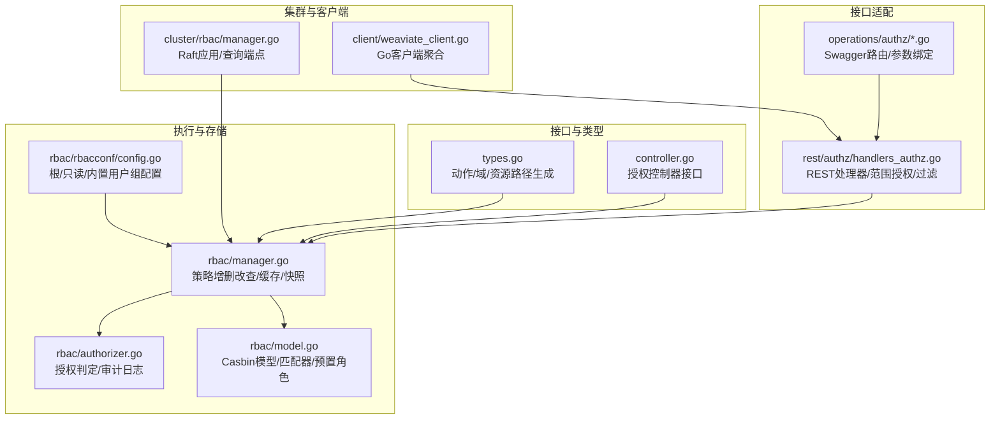
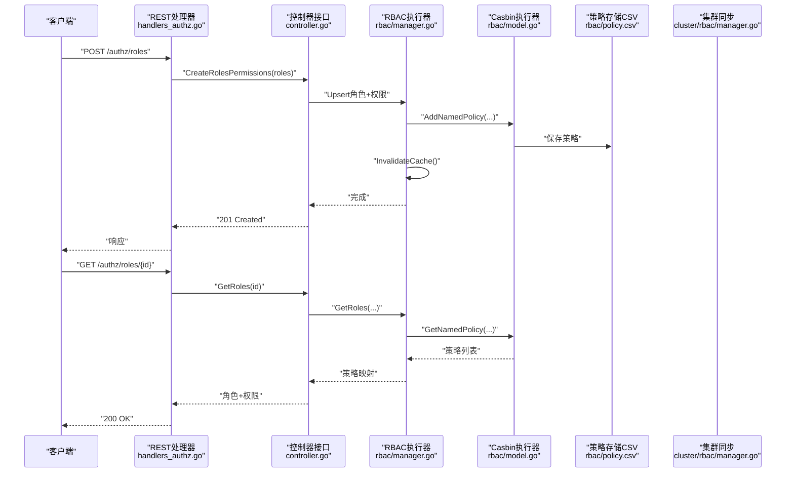
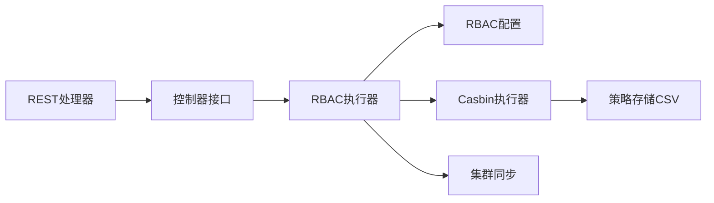

# 授权控制

<cite>
**本文引用的文件**
- [usecases/auth/authorization/types.go](file://usecases/auth/authorization/types.go)
- [usecases/auth/authorization/controller.go](file://usecases/auth/authorization/controller.go)
- [usecases/auth/authorization/rbac/manager.go](file://usecases/auth/authorization/rbac/manager.go)
- [usecases/auth/authorization/rbac/authorizer.go](file://usecases/auth/authorization/rbac/authorizer.go)
- [usecases/auth/authorization/rbac/model.go](file://usecases/auth/authorization/rbac/model.go)
- [usecases/auth/authorization/rbac/rbacconf/config.go](file://usecases/auth/authorization/rbac/rbacconf/config.go)
- [usecases/auth/authorization/conv/casbin_converter.go](file://usecases/auth/authorization/conv/casbin_converter.go)
- [adapters/handlers/rest/authz/handlers_authz.go](file://adapters/handlers/rest/authz/handlers_authz.go)
- [adapters/handlers/rest/operations/authz/add_permissions.go](file://adapters/handlers/rest/operations/authz/add_permissions.go)
- [adapters/handlers/rest/operations/authz/create_role.go](file://adapters/handlers/rest/operations/authz/create_role.go)
- [adapters/handlers/rest/operations/authz/has_permission.go](file://adapters/handlers/rest/operations/authz/has_permission.go)
- [adapters/handlers/rest/operations/authz/get_role.go](file://adapters/handlers/rest/operations/authz/get_role.go)
- [adapters/handlers/rest/operations/authz/get_roles.go](file://adapters/handlers/rest/operations/authz/get_roles.go)
- [cluster/rbac/manager.go](file://cluster/rbac/manager.go)
- [client/weaviate_client.go](file://client/weaviate_client.go)
</cite>

## 目录
1. [简介](#简介)
2. [项目结构](#项目结构)
3. [核心组件](#核心组件)
4. [架构总览](#架构总览)
5. [详细组件分析](#详细组件分析)
6. [依赖关系分析](#依赖关系分析)
7. [性能考量](#性能考量)
8. [故障排查指南](#故障排查指南)
9. [结论](#结论)
10. [附录](#附录)

## 简介
本指南面向安全管理员与系统架构师，系统性阐述 Weaviate 的授权控制体系，重点围绕 RBAC（基于角色的访问控制）模型：角色定义、权限分配、组管理策略；权限模型的层级结构（对象级、集合级、全局级）；动态权限评估机制（继承、条件权限、上下文感知）；最佳实践（最小权限原则、权限矩阵维护）；授权中间件与自定义策略；审计日志、冲突解决与批量权限管理；并提供可操作的配置示例与调试方法。

## 项目结构
Weaviate 的授权控制由“类型与策略定义”“RBAC 执行器与存储”“REST 控制器与转换器”“集群同步与快照”四层构成，形成从接口到持久化、从策略到执行的完整闭环。

图示来源
- [usecases/auth/authorization/types.go](file://usecases/auth/authorization/types.go#L27-L206)
- [usecases/auth/authorization/controller.go](file://usecases/auth/authorization/controller.go#L18-L30)
- [usecases/auth/authorization/rbac/manager.go](file://usecases/auth/authorization/rbac/manager.go#L40-L602)
- [usecases/auth/authorization/rbac/authorizer.go](file://usecases/auth/authorization/rbac/authorizer.go#L28-L172)
- [usecases/auth/authorization/rbac/model.go](file://usecases/auth/authorization/rbac/model.go#L44-L145)
- [usecases/auth/authorization/rbac/rbacconf/config.go](file://usecases/auth/authorization/rbac/rbacconf/config.go#L16-L24)
- [adapters/handlers/rest/authz/handlers_authz.go](file://adapters/handlers/rest/authz/handlers_authz.go#L65-L102)
- [adapters/handlers/rest/operations/authz/add_permissions.go](file://adapters/handlers/rest/operations/authz/add_permissions.go#L51-L90)
- [cluster/rbac/manager.go](file://cluster/rbac/manager.go#L42-L119)
- [client/weaviate_client.go](file://client/weaviate_client.go#L14-L194)

章节来源
- [usecases/auth/authorization/types.go](file://usecases/auth/authorization/types.go#L27-L206)
- [usecases/auth/authorization/controller.go](file://usecases/auth/authorization/controller.go#L18-L30)
- [usecases/auth/authorization/rbac/manager.go](file://usecases/auth/authorization/rbac/manager.go#L40-L602)
- [usecases/auth/authorization/rbac/authorizer.go](file://usecases/auth/authorization/rbac/authorizer.go#L28-L172)
- [usecases/auth/authorization/rbac/model.go](file://usecases/auth/authorization/rbac/model.go#L44-L145)
- [usecases/auth/authorization/rbac/rbacconf/config.go](file://usecases/auth/authorization/rbac/rbacconf/config.go#L16-L24)
- [adapters/handlers/rest/authz/handlers_authz.go](file://adapters/handlers/rest/authz/handlers_authz.go#L65-L102)
- [adapters/handlers/rest/operations/authz/add_permissions.go](file://adapters/handlers/rest/operations/authz/add_permissions.go#L51-L90)
- [cluster/rbac/manager.go](file://cluster/rbac/manager.go#L42-L119)
- [client/weaviate_client.go](file://client/weaviate_client.go#L14-L194)

## 核心组件
- 类型与策略定义（types.go）
  - 定义动作常量（CREATE/READ/UPDATE/DELETE）、域（roles/users/cluster/nodes/backups/schema/collections/data/tenants/replicate/aliases），以及资源路径生成函数（如 Collections、Data、Tenants、Data、Backups、Replicate、Aliases 等），支持通配符与作用域组合。
  - 内置角色（Viewer/Admin/Root/ReadOnly）与可用动作清单，用于生成预置策略。
- 授权控制器接口（controller.go）
  - 统一的 RBAC 操作契约：更新/创建角色权限、删除角色、为用户/组赋权/撤销、查询角色与用户/组映射、移除权限、检查角色是否拥有某权限等。
- RBAC 执行器与存储（rbac/manager.go）
  - 基于 Casbin 的 SyncedCachedEnforcer，封装策略增删改查、角色查询、用户/组映射、权限校验、快照与恢复。
  - 支持并发写锁（备份锁）以保障一致性。
- 授权判定与审计（rbac/authorizer.go）
  - 先按组后按用户的顺序进行授权判定；支持静默授权（内部使用）与带审计日志授权；统一错误包装与审计字段输出。
- Casbin 模型与匹配器（rbac/model.go）
  - 自定义模型与匹配器（weaviateMatcher），支持租户特定路径的严格匹配规则；初始化时加载 CSV 策略、版本升级、写入版本号。
- 配置（rbacconf/config.go）
  - 启用开关、根用户/组、只读/查看者用户、审计日志是否包含源 IP 等。
- REST 处理器与 Swagger 路由（rest/authz/handlers_authz.go、operations/authz/*.go）
  - 提供角色 CRUD、权限增删、权限检查、用户/组角色查询、范围授权（ALL/MATCH）与资源过滤、审计日志记录。
- 集群同步（cluster/rbac/manager.go）
  - 将 RBAC 状态通过 Raft 应用/查询端点在集群内同步，支持快照序列化/反序列化。
- 客户端聚合（client/weaviate_client.go）
  - Go 客户端自动装配 authz 子模块，便于外部调用。

章节来源
- [usecases/auth/authorization/types.go](file://usecases/auth/authorization/types.go#L27-L206)
- [usecases/auth/authorization/controller.go](file://usecases/auth/authorization/controller.go#L18-L30)
- [usecases/auth/authorization/rbac/manager.go](file://usecases/auth/authorization/rbac/manager.go#L40-L602)
- [usecases/auth/authorization/rbac/authorizer.go](file://usecases/auth/authorization/rbac/authorizer.go#L28-L172)
- [usecases/auth/authorization/rbac/model.go](file://usecases/auth/authorization/rbac/model.go#L44-L145)
- [usecases/auth/authorization/rbac/rbacconf/config.go](file://usecases/auth/authorization/rbac/rbacconf/config.go#L16-L24)
- [adapters/handlers/rest/authz/handlers_authz.go](file://adapters/handlers/rest/authz/handlers_authz.go#L65-L102)
- [adapters/handlers/rest/operations/authz/add_permissions.go](file://adapters/handlers/rest/operations/authz/add_permissions.go#L51-L90)
- [cluster/rbac/manager.go](file://cluster/rbac/manager.go#L42-L119)
- [client/weaviate_client.go](file://client/weaviate_client.go#L14-L194)

## 架构总览
下图展示从 REST 请求到授权判定与持久化的端到端流程，以及集群同步与快照恢复的关键节点。

图示来源
- [adapters/handlers/rest/authz/handlers_authz.go](file://adapters/handlers/rest/authz/handlers_authz.go#L128-L178)
- [usecases/auth/authorization/controller.go](file://usecases/auth/authorization/controller.go#L18-L30)
- [usecases/auth/authorization/rbac/manager.go](file://usecases/auth/authorization/rbac/manager.go#L115-L135)
- [usecases/auth/authorization/rbac/model.go](file://usecases/auth/authorization/rbac/model.go#L84-L145)
- [cluster/rbac/manager.go](file://cluster/rbac/manager.go#L42-L119)

## 详细组件分析

### 角色与权限模型
- 动作与域
  - 动作：CREATE/READ/UPDATE/DELETE
  - 域：roles/users/cluster/nodes/backups/schema/collections/data/tenants/replicate/aliases
  - 资源路径生成：提供多维资源路径生成函数，覆盖集合元数据、数据对象、租户、备份、复制、别名等，并支持通配符与作用域组合。
- 内置角色
  - Viewer/Admin/Root/ReadOnly，分别映射到不同动作集合；Root/ReadOnly 可通过环境变量配置注入。
- 权限矩阵
  - 可通过 types.go 中的动作与域组合生成细粒度权限矩阵，满足最小权限原则。

章节来源
- [usecases/auth/authorization/types.go](file://usecases/auth/authorization/types.go#L27-L206)

### 授权判定与审计
- 判定流程
  - 先对用户所属组逐一尝试授权，任一组允许即通过；否则再尝试用户自身的角色授权。
  - 支持静默授权（不写审计日志）与带审计日志授权两种模式。
- 审计日志
  - 记录用户、组、请求动作、资源、结果状态、版本号；可选记录源 IP。
- 资源过滤
  - 提供 FilterAuthorizedResources，返回允许的资源子集，便于部分失败场景下的容错处理。

章节来源
- [usecases/auth/authorization/rbac/authorizer.go](file://usecases/auth/authorization/rbac/authorizer.go#L28-L172)

### Casbin 模型与匹配器
- 模型定义
  - 使用自定义模型，支持角色继承（g）、命名策略（p）、效果聚合（some(where)）与匹配器（weaviateMatcher）。
- 匹配器
  - weaviateMatcher 对“租户特定路径（/shards/#）”进行严格匹配，避免通配导致的越权。
- 初始化与升级
  - 初始化时创建 CSV 存储、加载策略、版本判断与升级、写入版本号；支持预置角色应用。
- 快照与恢复
  - 序列化策略与分组策略，支持版本升级与恢复后重新加载策略。

章节来源
- [usecases/auth/authorization/rbac/model.go](file://usecases/auth/authorization/rbac/model.go#L44-L145)
- [usecases/auth/authorization/rbac/model.go](file://usecases/auth/authorization/rbac/model.go#L147-L257)
- [usecases/auth/authorization/rbac/model.go](file://usecases/auth/authorization/rbac/model.go#L259-L276)

### 控制器与执行器
- 控制器接口
  - 统一的 RBAC 操作契约，便于替换实现或扩展。
- 执行器能力
  - 角色与权限：创建/更新/删除、查询、HasPermission、批量权限增删。
  - 用户/组映射：查询用户/组的角色、角色对应的用户/组、为用户/组赋权/撤销。
  - 并发控制：写操作加读写锁，保障备份/恢复期间的一致性。
  - 快照：导出/导入策略与分组策略，支持版本兼容。

章节来源
- [usecases/auth/authorization/controller.go](file://usecases/auth/authorization/controller.go#L18-L30)
- [usecases/auth/authorization/rbac/manager.go](file://usecases/auth/authorization/rbac/manager.go#L40-L602)

### REST 授权处理器
- 能力覆盖
  - 角色：创建、查询、删除、添加/移除权限、检查权限。
  - 用户/组：查询用户/组的角色、为用户/组赋权/撤销、查询角色的用户/组。
  - 范围授权：ALL（全量）与 MATCH（匹配）两种作用域，结合 Authorize 与 AuthorizeSilent 实现。
  - 资源过滤：对角色列表与用户列表进行细粒度过滤，确保可见性。
  - 审计日志：统一记录操作行为、用户、角色、权限详情。
- 参数与路由
  - Swagger 路由与参数绑定，确保输入校验与错误响应标准化。

章节来源
- [adapters/handlers/rest/authz/handlers_authz.go](file://adapters/handlers/rest/authz/handlers_authz.go#L65-L102)
- [adapters/handlers/rest/authz/handlers_authz.go](file://adapters/handlers/rest/authz/handlers_authz.go#L128-L178)
- [adapters/handlers/rest/authz/handlers_authz.go](file://adapters/handlers/rest/authz/handlers_authz.go#L180-L225)
- [adapters/handlers/rest/authz/handlers_authz.go](file://adapters/handlers/rest/authz/handlers_authz.go#L227-L279)
- [adapters/handlers/rest/authz/handlers_authz.go](file://adapters/handlers/rest/authz/handlers_authz.go#L281-L310)
- [adapters/handlers/rest/authz/handlers_authz.go](file://adapters/handlers/rest/authz/handlers_authz.go#L312-L375)
- [adapters/handlers/rest/operations/authz/add_permissions.go](file://adapters/handlers/rest/operations/authz/add_permissions.go#L51-L90)
- [adapters/handlers/rest/operations/authz/create_role.go](file://adapters/handlers/rest/operations/authz/create_role.go#L51-L84)
- [adapters/handlers/rest/operations/authz/has_permission.go](file://adapters/handlers/rest/operations/authz/has_permission.go#L45-L84)
- [adapters/handlers/rest/operations/authz/get_role.go](file://adapters/handlers/rest/operations/authz/get_role.go#L45-L84)
- [adapters/handlers/rest/operations/authz/get_roles.go](file://adapters/handlers/rest/operations/authz/get_roles.go#L45-L84)

### 集群同步与快照
- 应用端点
  - 通过 Raft 应用/查询端点同步 RBAC 状态，支持 GetRoles、Upsert、HasPermission、DeleteRoles 等。
- 快照
  - 将策略与分组策略序列化为快照，恢复时清理旧策略、加载新策略并执行版本升级与环境配置重放。

章节来源
- [cluster/rbac/manager.go](file://cluster/rbac/manager.go#L42-L119)

### 客户端集成
- Go 客户端
  - 自动装配 authz 子模块，便于外部程序以编程方式调用 RBAC 接口。

章节来源
- [client/weaviate_client.go](file://client/weaviate_client.go#L14-L194)

## 依赖关系分析
- 组件耦合
  - REST 层仅依赖控制器接口，便于替换实现；控制器接口依赖 RBAC 执行器；执行器依赖 Casbin 与配置。
- 外部依赖
  - Casbin 作为策略引擎，提供策略存储、缓存与匹配能力。
- 循环依赖
  - 未见直接循环依赖；类型与策略定义为纯数据与函数，无运行时依赖。

图示来源
- [adapters/handlers/rest/authz/handlers_authz.go](file://adapters/handlers/rest/authz/handlers_authz.go#L65-L102)
- [usecases/auth/authorization/controller.go](file://usecases/auth/authorization/controller.go#L18-L30)
- [usecases/auth/authorization/rbac/manager.go](file://usecases/auth/authorization/rbac/manager.go#L40-L602)
- [usecases/auth/authorization/rbac/model.go](file://usecases/auth/authorization/rbac/model.go#L84-L145)
- [cluster/rbac/manager.go](file://cluster/rbac/manager.go#L42-L119)

## 性能考量
- 缓存与匹配
  - 启用 Casbin 缓存，减少重复匹配开销；自定义匹配器避免过度通配带来的性能损耗。
- 并发与一致性
  - 写操作加读写锁，避免备份/恢复过程中的竞态；批量权限增删后统一刷新缓存。
- 快照与版本
  - 快照序列化采用流式编码，降低内存峰值；版本升级与重放确保策略一致性。
- 过滤与最小权限
  - 使用资源过滤与范围授权（ALL/MATCH）减少不必要的授权调用，提升整体吞吐。

## 故障排查指南
- 常见错误与定位
  - 未认证/无权限：检查 Principal 是否为空、资源列表是否为空、组与用户授权链路。
  - 策略不生效：确认策略已保存、缓存已失效、版本升级是否成功、CSV 文件是否存在且可写。
  - 资源路径不匹配：核对资源路径生成函数与匹配器规则，特别是租户特定路径。
- 审计日志
  - 开启审计日志后，可在日志中看到“permissions”字段，包含资源与结果状态，便于回溯。
- 调试建议
  - 使用 HasPermission 接口进行“干运行”验证；通过 GetRoles/GetUsersForRole 获取当前映射；必要时临时关闭范围授权以缩小问题范围。

章节来源
- [usecases/auth/authorization/rbac/authorizer.go](file://usecases/auth/authorization/rbac/authorizer.go#L28-L172)
- [usecases/auth/authorization/rbac/manager.go](file://usecases/auth/authorization/rbac/manager.go#L115-L135)
- [usecases/auth/authorization/rbac/model.go](file://usecases/auth/authorization/rbac/model.go#L84-L145)

## 结论
Weaviate 的授权控制以 Casbin 为核心，结合类型与策略定义、REST 控制器、集群同步与审计日志，构建了可扩展、可观测、可迁移的 RBAC 体系。通过范围授权、资源过滤与最小权限原则，既能满足复杂权限需求，又能保持良好的性能与可维护性。建议在生产环境中启用审计日志、定期审查权限矩阵，并利用批量权限管理与快照能力保障变更可控。

## 附录

### 权限模型层级与示例
- 对象级（Data.objects）
  - 路径：collections/{class}/shards/{shard}/objects/{id}
  - 示例：为某集合的特定对象授予读取权限。
- 集合级（Schema/Collections）
  - 元数据：collections/*/shards/# 或 collections/{class}/shards/#
  - 数据：objects(/*, *, *) 或 objects({class}, *, *)
  - 示例：授予某集合的读取元数据与数据权限。
- 全局级（Cluster/Users/Roles/Backups/Nodes/Replicate/Aliases）
  - 示例：授予集群只读、节点状态读取、备份管理、复制管理、别名管理等权限。

章节来源
- [usecases/auth/authorization/types.go](file://usecases/auth/authorization/types.go#L477-L489)
- [usecases/auth/authorization/types.go](file://usecases/auth/authorization/types.go#L347-L374)
- [usecases/auth/authorization/types.go](file://usecases/auth/authorization/types.go#L400-L417)
- [usecases/auth/authorization/types.go](file://usecases/auth/authorization/types.go#L431-L451)
- [usecases/auth/authorization/types.go](file://usecases/auth/authorization/types.go#L477-L489)
- [usecases/auth/authorization/types.go](file://usecases/auth/authorization/types.go#L503-L519)
- [usecases/auth/authorization/types.go](file://usecases/auth/authorization/types.go#L530-L539)
- [usecases/auth/authorization/types.go](file://usecases/auth/authorization/types.go#L376-L398)

### 动态权限评估与最佳实践
- 权限继承
  - 通过组授权与用户授权的叠加实现继承；先组后用户，任一组允许即通过。
- 条件权限与上下文感知
  - 使用范围授权（ALL/MATCH）限制角色创建/更新权限；结合资源过滤仅返回可见资源。
- 最小权限原则
  - 仅授予完成任务所需的最小动作与域；优先使用通配符的“匹配”范围而非“全部”。

章节来源
- [adapters/handlers/rest/authz/handlers_authz.go](file://adapters/handlers/rest/authz/handlers_authz.go#L104-L126)
- [adapters/handlers/rest/authz/handlers_authz.go](file://adapters/handlers/rest/authz/handlers_authz.go#L335-L360)

### 授权中间件与自定义策略
- 中间件工作原理
  - REST 层在进入业务逻辑前进行参数绑定与授权；授权器按组与用户顺序判定，支持审计日志。
- 自定义策略
  - 可通过扩展资源路径生成函数与匹配器规则，实现更细粒度的上下文感知授权。

章节来源
- [adapters/handlers/rest/operations/authz/add_permissions.go](file://adapters/handlers/rest/operations/authz/add_permissions.go#L51-L90)
- [usecases/auth/authorization/rbac/authorizer.go](file://usecases/auth/authorization/rbac/authorizer.go#L28-L172)
- [usecases/auth/authorization/rbac/model.go](file://usecases/auth/authorization/rbac/model.go#L259-L276)

### 授权审计日志配置
- 字段说明
  - 包含用户、组、请求动作、资源、结果状态、审计版本、可选源 IP。
- 配置项
  - rbacconf.Config 中的 IpInAuditDisabled 控制是否记录源 IP。

章节来源
- [usecases/auth/authorization/rbac/authorizer.go](file://usecases/auth/authorization/rbac/authorizer.go#L37-L96)
- [usecases/auth/authorization/rbac/rbacconf/config.go](file://usecases/auth/authorization/rbac/rbacconf/config.go#L23-L23)

### 权限冲突解决与批量管理
- 冲突解决
  - 若用户同时属于多个组，任一组允许即可；若存在范围授权冲突，优先使用范围授权判定。
- 批量权限管理
  - 通过 AddPermissions/RemovePermissions 批量增删角色权限；通过 HasPermission 进行“干运行”校验。

章节来源
- [adapters/handlers/rest/authz/handlers_authz.go](file://adapters/handlers/rest/authz/handlers_authz.go#L180-L225)
- [adapters/handlers/rest/authz/handlers_authz.go](file://adapters/handlers/rest/authz/handlers_authz.go#L227-L279)
- [adapters/handlers/rest/authz/handlers_authz.go](file://adapters/handlers/rest/authz/handlers_authz.go#L281-L310)

### 完整权限配置示例（步骤指引）
- 创建角色
  - 步骤：调用创建角色接口，传入角色名称与权限数组（使用 types.go 生成的资源路径与动作）。
  - 参考：[adapters/handlers/rest/operations/authz/create_role.go](file://adapters/handlers/rest/operations/authz/create_role.go#L51-L84)
- 添加权限
  - 步骤：调用添加权限接口，传入权限数组；系统会进行范围授权与权限校验。
  - 参考：[adapters/handlers/rest/operations/authz/add_permissions.go](file://adapters/handlers/rest/operations/authz/add_permissions.go#L51-L90)
- 检查权限
  - 步骤：调用权限检查接口，验证角色是否具备指定权限。
  - 参考：[adapters/handlers/rest/operations/authz/has_permission.go](file://adapters/handlers/rest/operations/authz/has_permission.go#L45-L84)
- 查询角色与用户/组映射
  - 步骤：查询角色详情、用户/组的角色列表、角色对应的用户/组列表。
  - 参考：[adapters/handlers/rest/operations/authz/get_role.go](file://adapters/handlers/rest/operations/authz/get_role.go#L45-L84), [adapters/handlers/rest/operations/authz/get_roles.go](file://adapters/handlers/rest/operations/authz/get_roles.go#L45-L84)

### 授权策略调试指南
- 使用 HasPermission 进行“干运行”
  - 在提交变更前，先调用 HasPermission 验证策略是否符合预期。
- 查看审计日志
  - 关注“permissions”字段，确认资源与结果状态；必要时开启源 IP 记录以便溯源。
- 分步验证
  - 先验证组授权，再验证用户授权；若组授权通过但用户授权失败，检查用户映射与范围授权。

章节来源
- [adapters/handlers/rest/operations/authz/has_permission.go](file://adapters/handlers/rest/operations/authz/has_permission.go#L45-L84)
- [usecases/auth/authorization/rbac/authorizer.go](file://usecases/auth/authorization/rbac/authorizer.go#L37-L96)