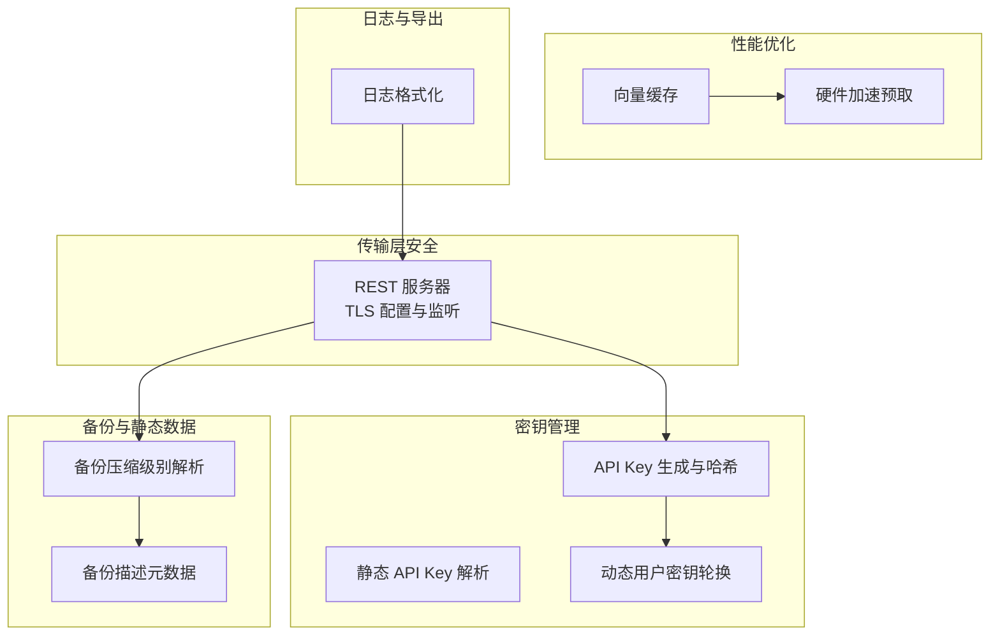
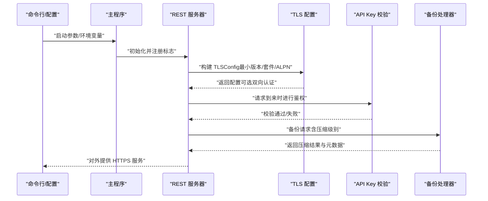
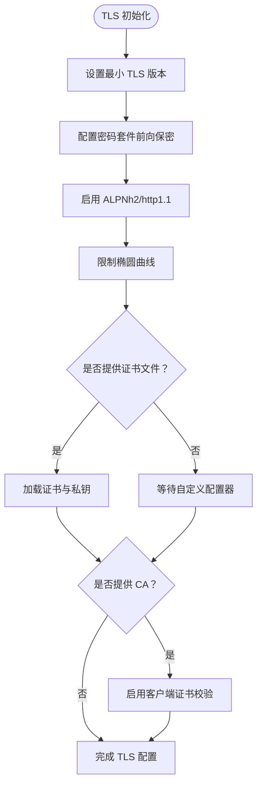
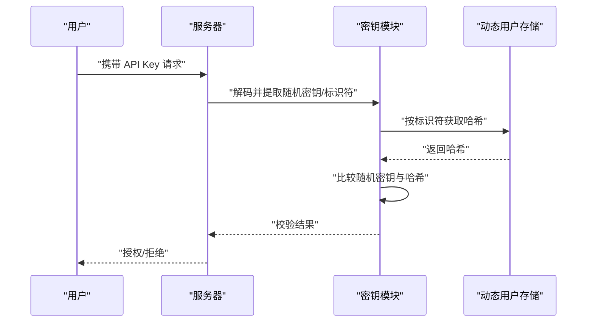
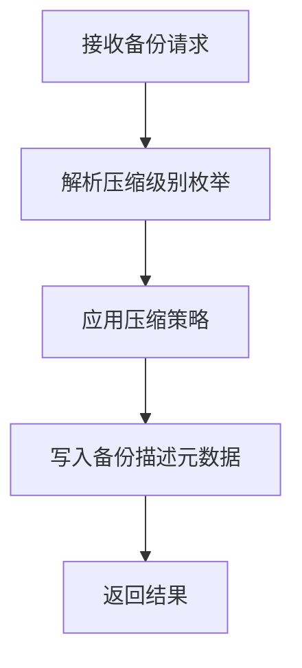
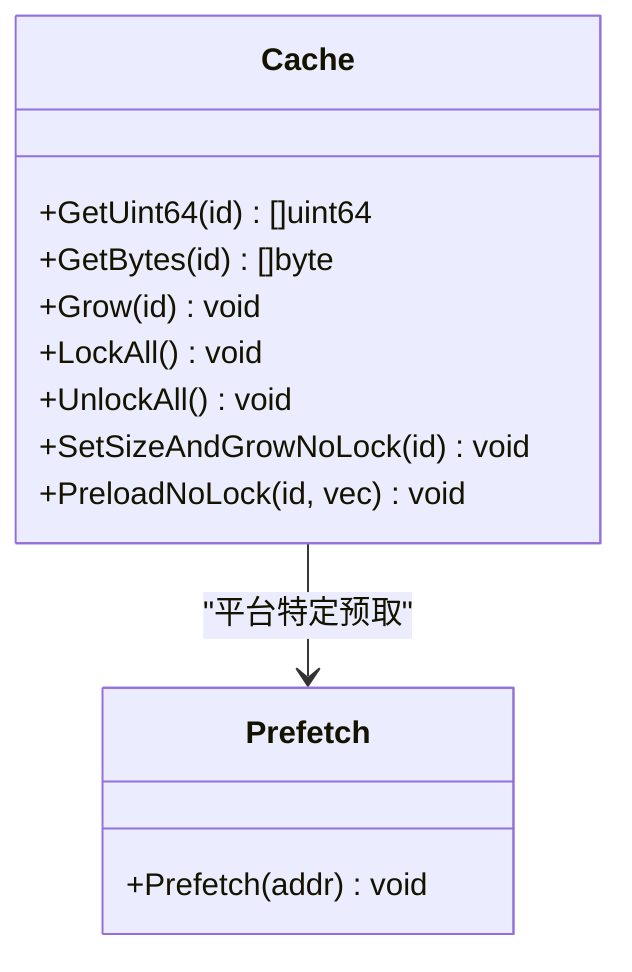
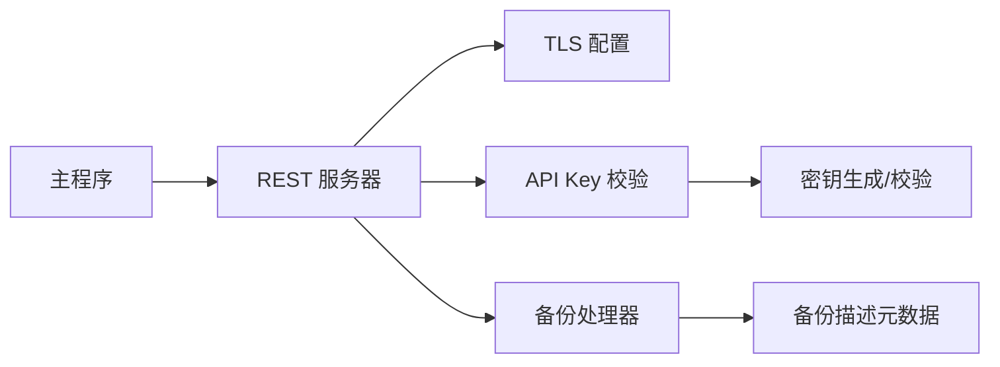

# 数据加密

<cite>
**本文引用的文件**
- [adapters/handlers/rest/server.go](file://adapters/handlers/rest/server.go)
- [usecases/auth/authentication/apikey/keys/key_generation.go](file://usecases/auth/authentication/apikey/keys/key_generation.go)
- [usecases/auth/authentication/apikey/db_user_test.go](file://usecases/auth/authentication/apikey/db_user_test.go)
- [usecases/auth/authentication/apikey/client.go](file://usecases/auth/authentication/apikey/client.go)
- [adapters/handlers/rest/handlers_backup.go](file://adapters/handlers/rest/handlers_backup.go)
- [entities/models/backup_config.go](file://entities/models/backup_config.go)
- [usecases/backup/handler.go](file://usecases/backup/handler.go)
- [entities/backup/descriptor.go](file://entities/backup/descriptor.go)
- [cmd/weaviate-server/main.go](file://cmd/weaviate-server/main.go)
- [adapters/handlers/rest/logger.go](file://adapters/handlers/rest/logger.go)
- [test/docker/mockoidc.go](file://test/docker/mockoidc.go)
- [adapters/repos/db/vector/cache/prefetch_amd64.go](file://adapters/repos/db/vector/cache/prefetch_amd64.go)
- [adapters/repos/db/vector/hnsw/distancer/asm/prefetch.go](file://adapters/repos/db/vector/hnsw/distancer/asm/prefetch.go)
- [adapters/repos/db/vector/flat/quantizer.go](file://adapters/repos/db/vector/flat/quantizer.go)
</cite>

## 目录
1. [引言](#引言)
2. [项目结构](#项目结构)
3. [核心组件](#核心组件)
4. [架构总览](#架构总览)
5. [详细组件分析](#详细组件分析)
6. [依赖分析](#依赖分析)
7. [性能考量](#性能考量)
8. [故障排除指南](#故障排除指南)
9. [结论](#结论)
10. [附录](#附录)

## 引言
本指南聚焦 Weaviate 在数据加密方面的工程实践，覆盖传输层安全（TLS/SSL）、静态数据处理（压缩与可选的加密）、密钥管理（API Key 存储与轮换）、敏感信息保护（日志与导出）、性能优化（硬件加速与缓存）以及合规性建议。文档以代码为依据，提供可操作的配置模板、性能基准思路与排障要点，帮助安全工程师与系统管理员落地实施。

## 项目结构
围绕“加密”主题的关键目录与文件：
- 传输层安全：REST 服务器 TLS 配置与监听
- 密钥管理：API Key 生成、校验与轮换
- 备份与静态数据：备份压缩级别与描述元数据
- 性能优化：向量检索缓存与硬件加速预取
- 日志与可观测：日志格式化与构建信息注入

**图表来源**
- [adapters/handlers/rest/server.go](file://adapters/handlers/rest/server.go#L253-L301)
- [usecases/auth/authentication/apikey/keys/key_generation.go](file://usecases/auth/authentication/apikey/keys/key_generation.go#L31-L73)
- [usecases/auth/authentication/apikey/client.go](file://usecases/auth/authentication/apikey/client.go#L28-L47)
- [adapters/handlers/rest/handlers_backup.go](file://adapters/handlers/rest/handlers_backup.go#L77-L94)
- [entities/backup/descriptor.go](file://entities/backup/descriptor.go#L319-L348)
- [adapters/repos/db/vector/cache/prefetch_amd64.go](file://adapters/repos/db/vector/cache/prefetch_amd64.go#L16-L18)
- [adapters/repos/db/vector/hnsw/distancer/asm/prefetch.go](file://adapters/repos/db/vector/hnsw/distancer/asm/prefetch.go#L17-L27)
- [adapters/handlers/rest/logger.go](file://adapters/handlers/rest/logger.go#L22-L43)

**章节来源**
- [adapters/handlers/rest/server.go](file://adapters/handlers/rest/server.go#L1-L519)
- [usecases/auth/authentication/apikey/keys/key_generation.go](file://usecases/auth/authentication/apikey/keys/key_generation.go#L1-L119)
- [adapters/handlers/rest/handlers_backup.go](file://adapters/handlers/rest/handlers_backup.go#L43-L94)
- [entities/backup/descriptor.go](file://entities/backup/descriptor.go#L319-L348)
- [adapters/repos/db/vector/cache/prefetch_amd64.go](file://adapters/repos/db/vector/cache/prefetch_amd64.go#L1-L18)
- [adapters/repos/db/vector/hnsw/distancer/asm/prefetch.go](file://adapters/repos/db/vector/hnsw/distancer/asm/prefetch.go#L1-L27)
- [adapters/handlers/rest/logger.go](file://adapters/handlers/rest/logger.go#L1-L91)

## 核心组件
- 传输层安全（TLS/SSL）
  - 服务器默认启用 HTTPS，支持最小 TLS 版本、现代密码套件、ALPN 协商与可选双向认证。
  - 支持通过命令行参数加载证书与私钥，或通过自定义 TLS 配置器扩展。
- 密钥管理（API Key）
  - 动态用户 API Key 采用 Argon2id 哈希与随机盐，结合 Base64 编码的随机密钥与用户标识符，便于轮换与快速校验。
  - 静态 API Key 支持在配置中声明允许的密钥列表，用于兼容旧场景。
- 备份与静态数据
  - 备份支持多种压缩级别（含 Zstd），并记录压缩类型与大小等元数据，便于审计与恢复。
- 性能优化
  - 向量检索缓存与硬件加速预取（AMD64 平台）提升查询吞吐与延迟表现。
- 日志与导出
  - JSON 文本格式化器注入构建信息，便于审计与问题定位；日志内容不包含明文敏感信息。

**章节来源**
- [adapters/handlers/rest/server.go](file://adapters/handlers/rest/server.go#L253-L301)
- [usecases/auth/authentication/apikey/keys/key_generation.go](file://usecases/auth/authentication/apikey/keys/key_generation.go#L31-L73)
- [usecases/auth/authentication/apikey/client.go](file://usecases/auth/authentication/apikey/client.go#L28-L47)
- [adapters/handlers/rest/handlers_backup.go](file://adapters/handlers/rest/handlers_backup.go#L77-L94)
- [entities/backup/descriptor.go](file://entities/backup/descriptor.go#L319-L348)
- [adapters/repos/db/vector/cache/prefetch_amd64.go](file://adapters/repos/db/vector/cache/prefetch_amd64.go#L16-L18)
- [adapters/handlers/rest/logger.go](file://adapters/handlers/rest/logger.go#L22-L43)

## 架构总览
下图展示从入口到服务端 TLS、密钥校验与备份压缩的关键交互路径。

**图表来源**
- [cmd/weaviate-server/main.go](file://cmd/weaviate-server/main.go#L30-L68)
- [adapters/handlers/rest/server.go](file://adapters/handlers/rest/server.go#L253-L301)
- [usecases/auth/authentication/apikey/keys/key_generation.go](file://usecases/auth/authentication/apikey/keys/key_generation.go#L31-L73)
- [adapters/handlers/rest/handlers_backup.go](file://adapters/handlers/rest/handlers_backup.go#L77-L94)

## 详细组件分析

### 传输层安全（TLS/SSL）
- 最小 TLS 版本：启用 TLS 1.2 及以上
- 密码套件：优先使用支持前向保密的现代套件（AES-GCM、ChaCha20-Poly1305）
- 协议协商：启用 ALPN，优先 h2/http/1.1
- 曲线选择：限制为高性能实现曲线
- 可选双向认证：通过 CA 文件启用客户端证书校验
- 证书加载：支持从文件加载证书与私钥，或通过自定义配置器扩展

**图表来源**
- [adapters/handlers/rest/server.go](file://adapters/handlers/rest/server.go#L253-L301)

**章节来源**
- [adapters/handlers/rest/server.go](file://adapters/handlers/rest/server.go#L253-L301)

### 密钥管理（API Key）
- 动态用户密钥
  - 生成：随机密钥 + 随机用户标识符 + 版本标识，整体 Base64 编码
  - 存储：对随机密钥进行 Argon2id 哈希（固定参数），仅保存哈希与标识符
  - 校验：解码后提取随机密钥与标识符，按标识符查找哈希并比较
  - 轮换：支持基于标识符更新哈希与新密钥，旧密钥失效
- 静态 API Key
  - 从配置读取允许的密钥列表，预先计算 SHA-256 以便快速比对

**图表来源**
- [usecases/auth/authentication/apikey/keys/key_generation.go](file://usecases/auth/authentication/apikey/keys/key_generation.go#L31-L73)
- [usecases/auth/authentication/apikey/db_user_test.go](file://usecases/auth/authentication/apikey/db_user_test.go#L133-L157)

**章节来源**
- [usecases/auth/authentication/apikey/keys/key_generation.go](file://usecases/auth/authentication/apikey/keys/key_generation.go#L31-L73)
- [usecases/auth/authentication/apikey/db_user_test.go](file://usecases/auth/authentication/apikey/db_user_test.go#L115-L157)
- [usecases/auth/authentication/apikey/client.go](file://usecases/auth/authentication/apikey/client.go#L28-L47)

### 备份与静态数据（压缩与元数据）
- 压缩级别
  - 支持 Gzip 默认/最佳速度/最佳压缩
  - 支持 Zstd 默认/最佳速度/最佳压缩
  - 支持无压缩
- 元数据
  - 记录压缩类型、压缩前字节数、状态、版本等，便于审计与恢复

**图表来源**
- [adapters/handlers/rest/handlers_backup.go](file://adapters/handlers/rest/handlers_backup.go#L77-L94)
- [entities/models/backup_config.go](file://entities/models/backup_config.go#L102-L132)
- [entities/backup/descriptor.go](file://entities/backup/descriptor.go#L319-L348)

**章节来源**
- [adapters/handlers/rest/handlers_backup.go](file://adapters/handlers/rest/handlers_backup.go#L43-L94)
- [entities/models/backup_config.go](file://entities/models/backup_config.go#L102-L132)
- [usecases/backup/handler.go](file://usecases/backup/handler.go#L111-L149)
- [entities/backup/descriptor.go](file://entities/backup/descriptor.go#L319-L348)

### 性能优化（缓存与硬件加速）
- 向量缓存
  - 提供按字节与整数向量的缓存实现，支持锁粒度与页大小配置
  - 支持预热、增长与无锁预取
- 硬件加速预取
  - AMD64 平台通过汇编函数实现数据预取，降低缓存未命中开销

**图表来源**
- [adapters/repos/db/vector/flat/quantizer.go](file://adapters/repos/db/vector/flat/quantizer.go#L205-L224)
- [adapters/repos/db/vector/flat/quantizer.go](file://adapters/repos/db/vector/flat/quantizer.go#L394-L456)
- [adapters/repos/db/vector/cache/prefetch_amd64.go](file://adapters/repos/db/vector/cache/prefetch_amd64.go#L16-L18)
- [adapters/repos/db/vector/hnsw/distancer/asm/prefetch.go](file://adapters/repos/db/vector/hnsw/distancer/asm/prefetch.go#L17-L27)

**章节来源**
- [adapters/repos/db/vector/flat/quantizer.go](file://adapters/repos/db/vector/flat/quantizer.go#L205-L224)
- [adapters/repos/db/vector/flat/quantizer.go](file://adapters/repos/db/vector/flat/quantizer.go#L394-L456)
- [adapters/repos/db/vector/cache/prefetch_amd64.go](file://adapters/repos/db/vector/cache/prefetch_amd64.go#L16-L18)
- [adapters/repos/db/vector/hnsw/distancer/asm/prefetch.go](file://adapters/repos/db/vector/hnsw/distancer/asm/prefetch.go#L17-L27)

### 敏感数据保护（日志与导出）
- 日志格式化
  - 使用 JSON 文本格式化器，注入构建信息（版本、Go 版本等），便于审计
- 导出与备份
  - 备份描述包含压缩类型与大小等元数据，避免在日志中泄露敏感内容
- 证书与密钥
  - 证书与私钥通过文件加载，避免在进程参数中暴露

**章节来源**
- [adapters/handlers/rest/logger.go](file://adapters/handlers/rest/logger.go#L22-L43)
- [adapters/handlers/rest/server.go](file://adapters/handlers/rest/server.go#L276-L301)
- [entities/backup/descriptor.go](file://entities/backup/descriptor.go#L319-L348)

## 依赖分析
- 入口与服务器
  - 主程序负责加载 Swagger 规范、注册命令行选项并启动 REST 服务器
- 服务器与 TLS
  - REST 服务器在启动时构建 TLS 配置，支持证书与 CA 文件加载及自定义配置器
- 密钥模块
  - API Key 生成与校验依赖 Argon2id 与随机源；静态 API Key 依赖配置解析
- 备份模块
  - 备份处理器根据请求解析压缩级别，并写入备份描述元数据

**图表来源**
- [cmd/weaviate-server/main.go](file://cmd/weaviate-server/main.go#L30-L68)
- [adapters/handlers/rest/server.go](file://adapters/handlers/rest/server.go#L253-L301)
- [usecases/auth/authentication/apikey/keys/key_generation.go](file://usecases/auth/authentication/apikey/keys/key_generation.go#L31-L73)
- [adapters/handlers/rest/handlers_backup.go](file://adapters/handlers/rest/handlers_backup.go#L77-L94)
- [entities/backup/descriptor.go](file://entities/backup/descriptor.go#L319-L348)

**章节来源**
- [cmd/weaviate-server/main.go](file://cmd/weaviate-server/main.go#L30-L68)
- [adapters/handlers/rest/server.go](file://adapters/handlers/rest/server.go#L253-L301)
- [usecases/auth/authentication/apikey/keys/key_generation.go](file://usecases/auth/authentication/apikey/keys/key_generation.go#L31-L73)
- [adapters/handlers/rest/handlers_backup.go](file://adapters/handlers/rest/handlers_backup.go#L77-L94)
- [entities/backup/descriptor.go](file://entities/backup/descriptor.go#L319-L348)

## 性能考量
- 硬件加速
  - 在 AMD64 平台上启用向量预取，减少缓存未命中带来的延迟抖动
- 缓存策略
  - 向量缓存支持按需增长与无锁预取，适合高并发查询场景
- 压缩与 CPU 利用率
  - 备份压缩级别可调，结合 CPU 百分比控制，平衡压缩比与资源占用

**章节来源**
- [adapters/repos/db/vector/cache/prefetch_amd64.go](file://adapters/repos/db/vector/cache/prefetch_amd64.go#L16-L18)
- [adapters/repos/db/vector/flat/quantizer.go](file://adapters/repos/db/vector/flat/quantizer.go#L205-L224)
- [adapters/handlers/rest/handlers_backup.go](file://adapters/handlers/rest/handlers_backup.go#L43-L57)

## 故障排除指南
- TLS 启动失败
  - 检查证书与私钥文件路径与权限；若启用双向认证，确认 CA 文件有效且格式正确
- API Key 校验失败
  - 确认密钥编码格式正确（Base64 分段 + 版本标识）；检查标识符对应的哈希是否存在
- 备份压缩异常
  - 确认压缩级别枚举值合法；检查 CPU 百分比范围与后端存储可用性
- 日志与导出
  - 确保日志格式化器已启用；避免在日志中输出敏感字段

**章节来源**
- [adapters/handlers/rest/server.go](file://adapters/handlers/rest/server.go#L276-L316)
- [usecases/auth/authentication/apikey/keys/key_generation.go](file://usecases/auth/authentication/apikey/keys/key_generation.go#L91-L118)
- [adapters/handlers/rest/handlers_backup.go](file://adapters/handlers/rest/handlers_backup.go#L77-L94)
- [adapters/handlers/rest/logger.go](file://adapters/handlers/rest/logger.go#L22-L43)

## 结论
Weaviate 在传输层安全、密钥管理、备份压缩与性能优化方面具备清晰的工程实现。建议在生产环境中强制启用 TLS 1.2+、使用强密码套件与双向认证、妥善管理证书与密钥、合理选择备份压缩级别，并结合硬件加速与缓存策略提升性能。同时，遵循日志脱敏与最小化披露原则，确保符合数据保护与合规要求。

## 附录

### 加密配置模板（基于现有实现）
- 传输层安全（HTTPS）
  - 必填：证书文件与私钥文件路径
  - 可选：CA 文件（启用双向认证）
  - 关键点：最小 TLS 版本、密码套件、ALPN 协商已在实现中设定
- API Key
  - 动态用户：通过接口生成密钥并轮换，服务端按标识符查找哈希进行校验
  - 静态 API Key：在配置中声明允许的密钥列表
- 备份压缩
  - 支持 Gzip/Zstd 与无压缩；可指定 CPU 百分比与压缩级别

**章节来源**
- [adapters/handlers/rest/server.go](file://adapters/handlers/rest/server.go#L253-L301)
- [usecases/auth/authentication/apikey/keys/key_generation.go](file://usecases/auth/authentication/apikey/keys/key_generation.go#L31-L73)
- [adapters/handlers/rest/handlers_backup.go](file://adapters/handlers/rest/handlers_backup.go#L77-L94)

### 性能基准测试建议
- 向量检索吞吐与延迟
  - 使用不同缓存大小与预取策略对比
- 压缩与 CPU 利用率
  - 对比 Gzip/Zstd 不同级别与 CPU 百分比对备份耗时的影响
- TLS 握手与连接复用
  - 测试不同密码套件与 ALPN 对首包延迟与吞吐的影响

[本节为通用建议，无需特定文件来源]

### 合规性与最佳实践
- 数据保护法规
  - 传输层加密与密钥管理应满足最小数据保留与可追溯性要求
- 行业标准
  - 采用业界认可的密码学参数与协议版本，定期评估与升级
- 日志与审计
  - 注入构建信息便于审计，避免在日志中记录敏感字段

[本节为通用建议，无需特定文件来源]