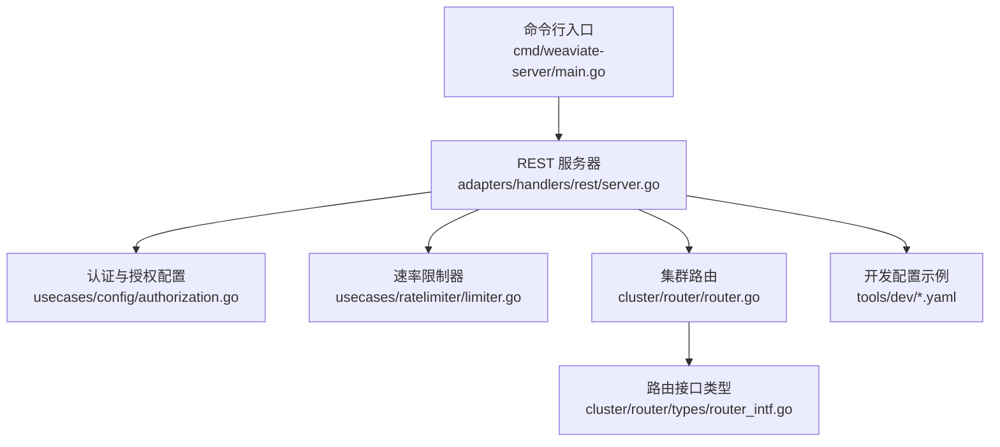
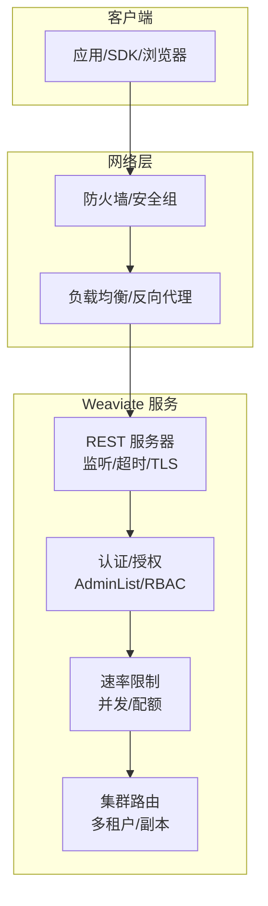
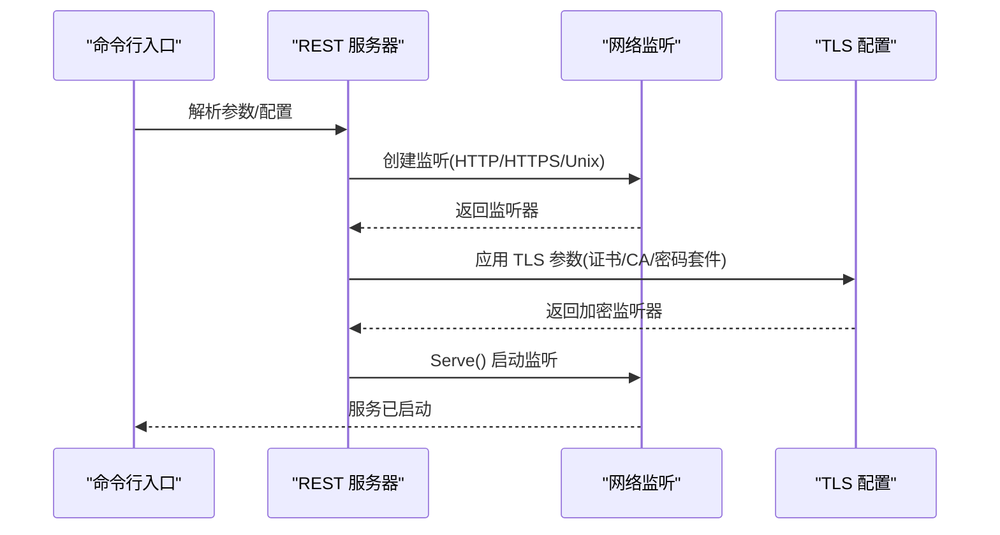
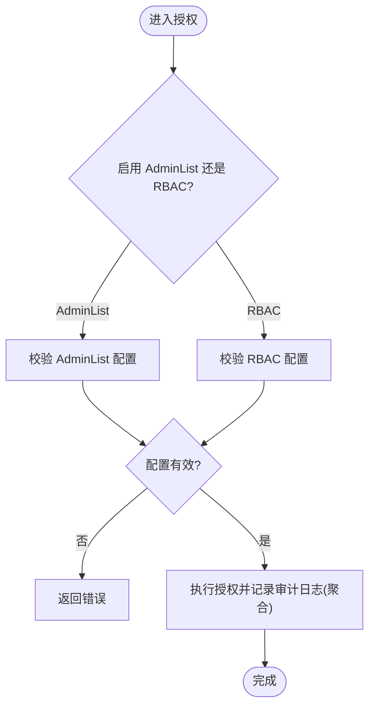
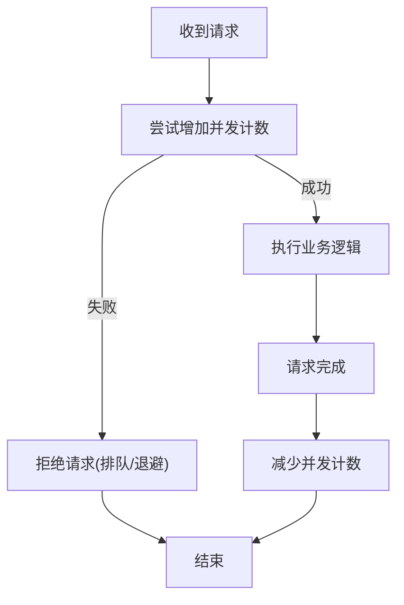
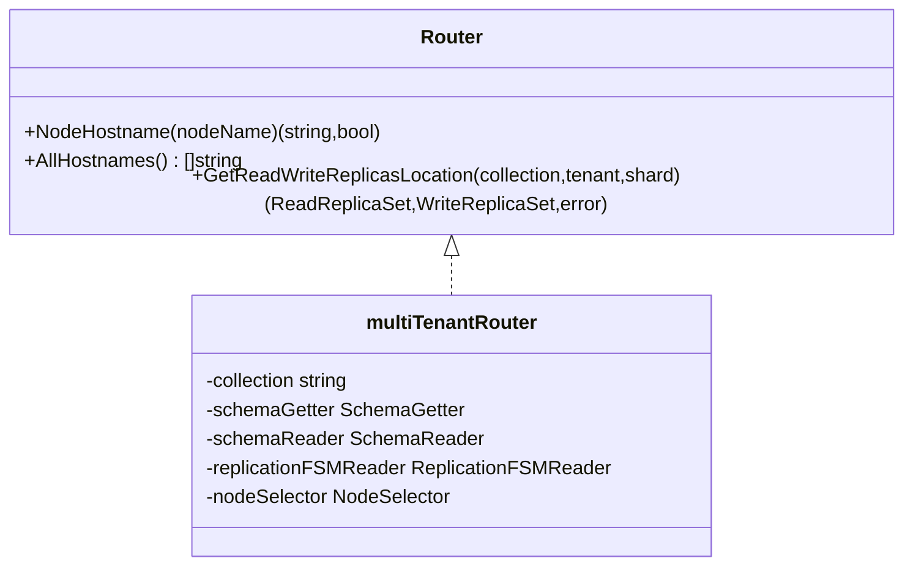
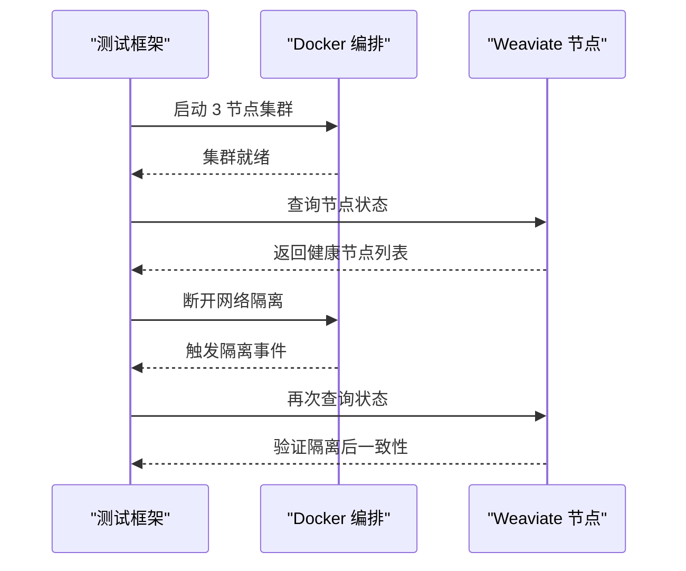
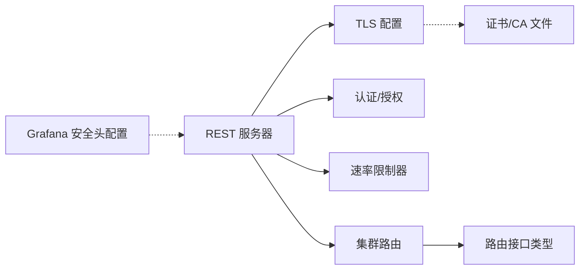

# 网络安全

<cite>
**本文引用的文件**   
- [cmd/weaviate-server/main.go](file://cmd/weaviate-server/main.go)
- [adapters/handlers/rest/server.go](file://adapters/handlers/rest/server.go)
- [usecases/config/authorization.go](file://usecases/config/authorization.go)
- [usecases/config/authorization_test.go](file://usecases/config/authorization_test.go)
- [usecases/auth/authorization/adminlist/config_test.go](file://usecases/auth/authorization/adminlist/config_test.go)
- [usecases/auth/authorization/rbac/authorizer_test.go](file://usecases/auth/authorization/rbac/authorizer_test.go)
- [usecases/ratelimiter/limiter.go](file://usecases/ratelimiter/limiter.go)
- [usecases/ratelimiter/limiter_test.go](file://usecases/ratelimiter/limiter_test.go)
- [usecases/modulecomponents/clients/weaviateembed/weaviate_embed.go](file://usecases/modulecomponents/clients/weaviateembed/weaviate_embed.go)
- [usecases/modulecomponents/client_results.go](file://usecases/modulecomponents/client_results.go)
- [cluster/router/router.go](file://cluster/router/router.go)
- [cluster/router/types/router_intf.go](file://cluster/router/types/router_intf.go)
- [usecases/cluster/state_test.go](file://usecases/cluster/state_test.go)
- [test/acceptance/recovery/network_isolation_test.go](file://test/acceptance/recovery/network_isolation_test.go)
- [tools/dev/grafana/grafana.ini](file://tools/dev/grafana/grafana.ini)
- [tools/dev/config.local-development.yaml](file://tools/dev/config.local-development.yaml)
- [tools/dev/config.local-customdb.yaml](file://tools/dev/config.local-customdb.yaml)
</cite>

## 目录
1. [引言](#引言)
2. [项目结构](#项目结构)
3. [核心组件](#核心组件)
4. [架构总览](#架构总览)
5. [详细组件分析](#详细组件分析)
6. [依赖分析](#依赖分析)
7. [性能考虑](#性能考虑)
8. [故障排查指南](#故障排查指南)
9. [结论](#结论)
10. [附录](#附录)

## 引言
本指南面向网络管理员与安全工程师，围绕 Weaviate 的网络安全配置提供系统化实践建议。内容覆盖网络访问控制（防火墙、白名单、分段）、流量监控与异常检测（DDoS 防护、连接数与请求频率控制）、集群网络安全（节点间通信加密、隔离与跨数据中心连接）、网络安全审计与日志、性能与安全的平衡（负载均衡、高可用与灾备）、威胁防护策略（SQL 注入、XSS、CSRF），以及配置模板、IDS 集成与安全事件响应流程。

## 项目结构
Weaviate 的网络与安全能力主要由以下模块协同实现：
- 启动入口：命令行参数解析与服务启动
- REST 服务器：监听器、超时、TLS 配置、监听上限
- 认证与授权：AdminList 与 RBAC 二选一配置校验
- 速率限制：并发限流与令牌/请求数配额
- 集群路由：多租户路由、主机名解析、副本定位
- 开发与测试配置：本地开发、自定义数据库、网络隔离测试

**图表来源**
- [cmd/weaviate-server/main.go](file://cmd/weaviate-server/main.go#L30-L66)
- [adapters/handlers/rest/server.go](file://adapters/handlers/rest/server.go#L80-L115)
- [usecases/config/authorization.go](file://usecases/config/authorization.go#L21-L48)
- [usecases/ratelimiter/limiter.go](file://usecases/ratelimiter/limiter.go#L16-L60)
- [cluster/router/router.go](file://cluster/router/router.go#L111-L126)
- [cluster/router/types/router_intf.go](file://cluster/router/types/router_intf.go#L115-L134)
- [tools/dev/config.local-development.yaml](file://tools/dev/config.local-development.yaml#L1-L31)
- [tools/dev/config.local-customdb.yaml](file://tools/dev/config.local-customdb.yaml#L1-L31)

**章节来源**
- [cmd/weaviate-server/main.go](file://cmd/weaviate-server/main.go#L30-L66)
- [adapters/handlers/rest/server.go](file://adapters/handlers/rest/server.go#L80-L115)

## 核心组件
- REST 服务器与监听器
  - 支持 HTTP/HTTPS/Unix Socket 多协议监听
  - 可配置最大头部大小、读写超时、Keep-Alive、监听上限
  - HTTPS 使用现代 TLS 版本与密码套件，支持双向 TLS
- 认证与授权
  - AdminList 与 RBAC 二选一启用，避免冲突
  - RBAC 支持审计日志聚合与权限结果记录
- 速率限制
  - 并发级限流器（Limiter）
  - 模块侧请求/令牌配额与重置逻辑
- 集群路由
  - 多租户路由按租户分区，优先主副本排序
  - 提供节点主机名解析与全量主机列表

**章节来源**
- [adapters/handlers/rest/server.go](file://adapters/handlers/rest/server.go#L80-L115)
- [adapters/handlers/rest/server.go](file://adapters/handlers/rest/server.go#L209-L330)
- [usecases/config/authorization.go](file://usecases/config/authorization.go#L21-L48)
- [usecases/auth/authorization/rbac/authorizer_test.go](file://usecases/auth/authorization/rbac/authorizer_test.go#L431-L460)
- [usecases/ratelimiter/limiter.go](file://usecases/ratelimiter/limiter.go#L16-L60)
- [usecases/modulecomponents/clients/weaviateembed/weaviate_embed.go](file://usecases/modulecomponents/clients/weaviateembed/weaviate_embed.go#L185-L199)
- [cluster/router/router.go](file://cluster/router/router.go#L111-L126)
- [cluster/router/router.go](file://cluster/router/router.go#L195-L210)

## 架构总览
下图展示从客户端到服务端的关键网络路径与安全控制点：

**图表来源**
- [adapters/handlers/rest/server.go](file://adapters/handlers/rest/server.go#L209-L330)
- [usecases/config/authorization.go](file://usecases/config/authorization.go#L21-L48)
- [usecases/ratelimiter/limiter.go](file://usecases/ratelimiter/limiter.go#L16-L60)
- [cluster/router/router.go](file://cluster/router/router.go#L111-L126)

## 详细组件分析

### 组件一：REST 服务器与 TLS 安全
- 监听器与超时
  - 支持 HTTP/HTTPS/Unix Socket，可分别设置读写超时、Keep-Alive、监听上限
  - 通过 netutil.LimitListener 对请求积压进行限制
- TLS 配置
  - 强制 TLS1.2+，采用前向保密密码套件
  - 支持单向/双向证书认证，加载指定证书与 CA
- 入口与启动
  - 命令行解析后调用 Serve() 启动多协议监听

**图表来源**
- [cmd/weaviate-server/main.go](file://cmd/weaviate-server/main.go#L30-L66)
- [adapters/handlers/rest/server.go](file://adapters/handlers/rest/server.go#L209-L330)

**章节来源**
- [adapters/handlers/rest/server.go](file://adapters/handlers/rest/server.go#L80-L115)
- [adapters/handlers/rest/server.go](file://adapters/handlers/rest/server.go#L209-L330)
- [cmd/weaviate-server/main.go](file://cmd/weaviate-server/main.go#L30-L66)

### 组件二：认证与授权策略
- 配置模型
  - AdminList 与 RBAC 二选一，避免同时启用
  - AdminList 支持普通用户与只读用户/组组合校验
- 授权行为
  - RBAC 支持审计日志聚合，记录权限检查结果
  - 过滤授权资源时对重复资源进行聚合，降低日志膨胀

**图表来源**
- [usecases/config/authorization.go](file://usecases/config/authorization.go#L21-L48)
- [usecases/auth/authorization/adminlist/config_test.go](file://usecases/auth/authorization/adminlist/config_test.go#L149-L224)
- [usecases/auth/authorization/rbac/authorizer_test.go](file://usecases/auth/authorization/rbac/authorizer_test.go#L431-L460)

**章节来源**
- [usecases/config/authorization.go](file://usecases/config/authorization.go#L21-L48)
- [usecases/config/authorization_test.go](file://usecases/config/authorization_test.go#L23-L52)
- [usecases/auth/authorization/adminlist/config_test.go](file://usecases/auth/authorization/adminlist/config_test.go#L149-L224)
- [usecases/auth/authorization/rbac/authorizer_test.go](file://usecases/auth/authorization/rbac/authorizer_test.go#L431-L460)

### 组件三：速率限制与流量治理
- 并发级限流器
  - 原子计数，TryInc/Dec 线程安全，防止负值
  - 支持无限并发模式
- 模块侧配额与重置
  - 请求/令牌剩余量、上限与重置时间管理
  - 批处理时基于配额占比进行“节流”判断

**图表来源**
- [usecases/ratelimiter/limiter.go](file://usecases/ratelimiter/limiter.go#L16-L60)
- [usecases/modulecomponents/clients/weaviateembed/weaviate_embed.go](file://usecases/modulecomponents/clients/weaviateembed/weaviate_embed.go#L185-L199)
- [usecases/modulecomponents/client_results.go](file://usecases/modulecomponents/client_results.go#L52-L83)

**章节来源**
- [usecases/ratelimiter/limiter.go](file://usecases/ratelimiter/limiter.go#L16-L60)
- [usecases/ratelimiter/limiter_test.go](file://usecases/ratelimiter/limiter_test.go#L23-L104)
- [usecases/modulecomponents/clients/weaviateembed/weaviate_embed.go](file://usecases/modulecomponents/clients/weaviateembed/weaviate_embed.go#L185-L199)
- [usecases/modulecomponents/client_results.go](file://usecases/modulecomponents/client_results.go#L52-L83)

### 组件四：集群网络安全与路由
- 路由器接口
  - 提供节点主机名解析与全量主机列表
  - 多租户路由按租户分区，优先主副本排序
- 集群配置选择
  - LAN/WAN/LOCAL 三种配置类型，影响 TCP 超时、怀疑倍数与死亡回收时间

**图表来源**
- [cluster/router/types/router_intf.go](file://cluster/router/types/router_intf.go#L115-L134)
- [cluster/router/router.go](file://cluster/router/router.go#L111-L126)
- [cluster/router/router.go](file://cluster/router/router.go#L195-L210)

**章节来源**
- [cluster/router/types/router_intf.go](file://cluster/router/types/router_intf.go#L115-L134)
- [cluster/router/router.go](file://cluster/router/router.go#L111-L126)
- [usecases/cluster/state_test.go](file://usecases/cluster/state_test.go#L376-L419)

### 组件五：网络隔离与灾备场景
- 网络隔离测试
  - 通过容器编排模拟三节点集群，验证健康状态与隔离场景下的脑裂处理
- 配置示例
  - 开发环境与自定义数据库配置文件，便于本地网络与存储调试

**图表来源**
- [test/acceptance/recovery/network_isolation_test.go](file://test/acceptance/recovery/network_isolation_test.go#L27-L54)
- [tools/dev/config.local-development.yaml](file://tools/dev/config.local-development.yaml#L1-L31)
- [tools/dev/config.local-customdb.yaml](file://tools/dev/config.local-customdb.yaml#L1-L31)

**章节来源**
- [test/acceptance/recovery/network_isolation_test.go](file://test/acceptance/recovery/network_isolation_test.go#L27-L54)
- [tools/dev/config.local-development.yaml](file://tools/dev/config.local-development.yaml#L1-L31)
- [tools/dev/config.local-customdb.yaml](file://tools/dev/config.local-customdb.yaml#L1-L31)

## 依赖分析
- 组件耦合
  - REST 服务器依赖监听器与 TLS 配置；认证/授权在请求处理链中前置
  - 速率限制器独立于业务逻辑，可插拔使用
  - 集群路由为多租户数据路径提供抽象，不直接依赖认证/授权
- 外部依赖
  - TLS 证书与 CA 文件由外部提供，需纳入运维密钥管理流程
  - Grafana 配置项可用于增强前端安全头策略（如 CSP、X-Content-Type-Options）

**图表来源**
- [adapters/handlers/rest/server.go](file://adapters/handlers/rest/server.go#L253-L301)
- [usecases/config/authorization.go](file://usecases/config/authorization.go#L21-L48)
- [usecases/ratelimiter/limiter.go](file://usecases/ratelimiter/limiter.go#L16-L60)
- [cluster/router/router.go](file://cluster/router/router.go#L111-L126)
- [cluster/router/types/router_intf.go](file://cluster/router/types/router_intf.go#L115-L134)
- [tools/dev/grafana/grafana.ini](file://tools/dev/grafana/grafana.ini#L254-L274)

**章节来源**
- [adapters/handlers/rest/server.go](file://adapters/handlers/rest/server.go#L253-L301)
- [tools/dev/grafana/grafana.ini](file://tools/dev/grafana/grafana.ini#L254-L274)

## 性能考虑
- 监听上限与连接复用
  - 使用 netutil.LimitListener 控制请求积压，结合 Keep-Alive 与 IdleTimeout 降低空闲连接成本
- TLS 性能
  - 启用 HTTP/2 与合理的曲线/套件，减少握手开销
- 速率限制与批处理
  - 基于配额占比的“节流”策略，避免突发导致的过载
- 集群路由与副本排序
  - 优先主副本可降低跨节点往返，提升吞吐

[本节为通用建议，无需特定文件引用]

## 故障排查指南
- TLS 证书问题
  - 若未提供证书或 CA，服务器会报错提示缺少必要参数；确认证书/私钥/CA 文件路径正确
- 监听器配置
  - HTTP/HTTPS 端口冲突、监听地址不可达会导致启动失败；检查 Host/Port 与防火墙
- 认证/授权冲突
  - AdminList 与 RBAC 同时启用会触发校验失败；确保仅启用一种策略
- 速率限制导致的拒绝
  - 并发达到上限或配额耗尽时会被拒绝；适当提高上限或调整批处理策略
- 网络隔离与一致性
  - 隔离测试失败时，检查容器网络与节点发现配置

**章节来源**
- [adapters/handlers/rest/server.go](file://adapters/handlers/rest/server.go#L303-L316)
- [usecases/config/authorization.go](file://usecases/config/authorization.go#L30-L48)
- [usecases/ratelimiter/limiter.go](file://usecases/ratelimiter/limiter.go#L32-L46)
- [test/acceptance/recovery/network_isolation_test.go](file://test/acceptance/recovery/network_isolation_test.go#L27-L54)

## 结论
Weaviate 在网络与安全方面提供了完善的基础设施：多协议监听与强 TLS、严格的认证/授权策略、细粒度的速率限制、以及面向多租户的集群路由。结合防火墙/安全组、DDoS 防护、连接/请求频率控制与审计日志，可构建高可用且安全的生产环境。建议在部署中遵循最小权限原则、定期轮换证书与密钥、启用审计与告警，并通过隔离测试与灾备演练验证韧性。

[本节为总结，无需特定文件引用]

## 附录

### A. 网络访问控制与防火墙建议
- 入口控制
  - 仅开放必要的端口（HTTP/HTTPS/Unix Socket）至可信网段
  - 使用安全组/ACL 限制源 IP，结合白名单策略
- 服务内控
  - 启用 AdminList 或 RBAC，避免全局匿名访问
  - 对管理端点（如 schema、nodes）单独保护

[本节为通用建议，无需特定文件引用]

### B. 流量监控与异常检测
- 连接数与请求频率
  - 利用监听上限与速率限制器控制突发流量
  - 结合外部 WAF/负载均衡器进行 DDoS 防护与限速
- 日志与审计
  - RBAC 审计日志聚合，记录权限检查结果
  - Grafana 安全头配置可辅助前端安全策略

**章节来源**
- [usecases/auth/authorization/rbac/authorizer_test.go](file://usecases/auth/authorization/rbac/authorizer_test.go#L431-L460)
- [tools/dev/grafana/grafana.ini](file://tools/dev/grafana/grafana.ini#L254-L274)

### C. 集群网络安全与跨数据中心
- 节点间通信
  - 使用强 TLS 与双向认证，限制节点间网络可见范围
- 分段与隔离
  - 不同数据中心/可用区划分子网，使用路由策略隔离
- 路由与副本
  - 依据多租户路由与副本排序，就近访问主副本

**章节来源**
- [adapters/handlers/rest/server.go](file://adapters/handlers/rest/server.go#L253-L301)
- [cluster/router/router.go](file://cluster/router/router.go#L111-L126)
- [usecases/cluster/state_test.go](file://usecases/cluster/state_test.go#L376-L419)

### D. 安全审计与合规
- 访问日志
  - 启用 REST 服务器日志，结合外部 SIEM 进行集中分析
- 安全事件记录
  - RBAC 审计日志包含权限检查与结果，便于追踪
- 合规性报告
  - 基于日志与配置快照生成合规报告，定期审查

**章节来源**
- [usecases/auth/authorization/rbac/authorizer_test.go](file://usecases/auth/authorization/rbac/authorizer_test.go#L431-L460)

### E. 性能与安全平衡
- 负载均衡与高可用
  - 多实例部署，结合健康检查与自动扩缩容
- 灾难恢复
  - 定期备份与跨区域复制，验证恢复流程

[本节为通用建议，无需特定文件引用]

### F. 威胁防护策略
- SQL 注入
  - 服务端输入校验与参数化查询（服务端已内置校验与过滤）
- XSS/CSRF
  - 前端安全头（CSP、X-Content-Type-Options、X-XSS-Protection）与 CSRF Token（前端框架负责）

**章节来源**
- [tools/dev/grafana/grafana.ini](file://tools/dev/grafana/grafana.ini#L254-L274)

### G. 配置模板与最佳实践
- 开发环境
  - 参考本地开发与自定义数据库配置文件，快速搭建测试环境
- 生产环境
  - 明确证书/CA 路径、监听上限、超时参数与认证策略
  - 启用审计日志与外部监控告警

**章节来源**
- [tools/dev/config.local-development.yaml](file://tools/dev/config.local-development.yaml#L1-L31)
- [tools/dev/config.local-customdb.yaml](file://tools/dev/config.local-customdb.yaml#L1-L31)

### H. IDS 集成与安全事件响应
- IDS 集成
  - 将 Weaviate 日志接入 SIEM/IDS，识别异常模式
- 响应流程
  - 快速隔离受影响节点、回滚变更、修复漏洞并复盘

[本节为通用建议，无需特定文件引用]