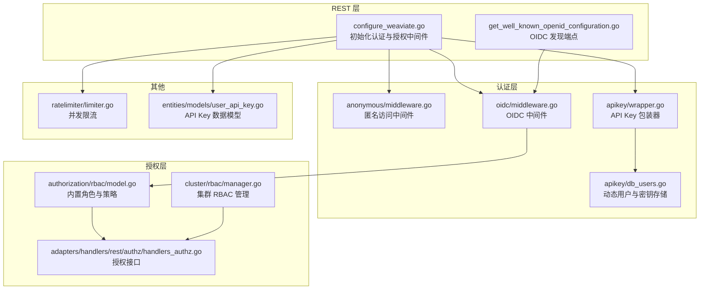
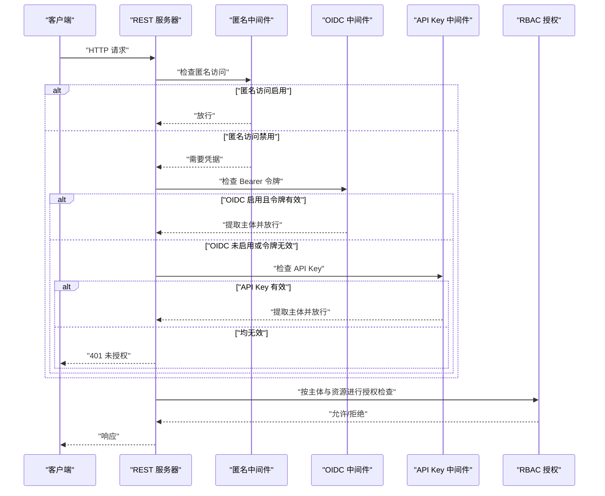
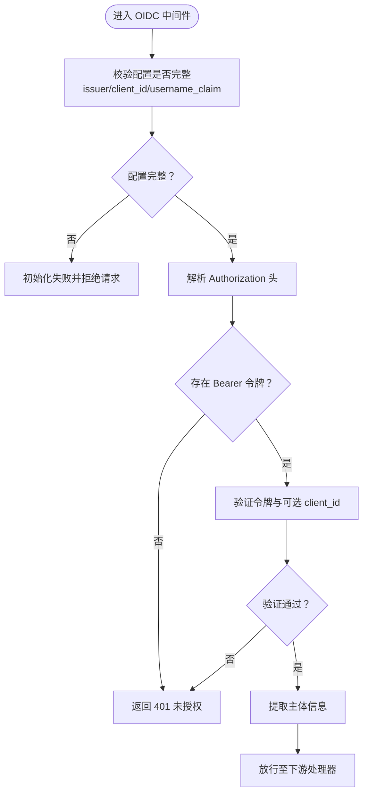
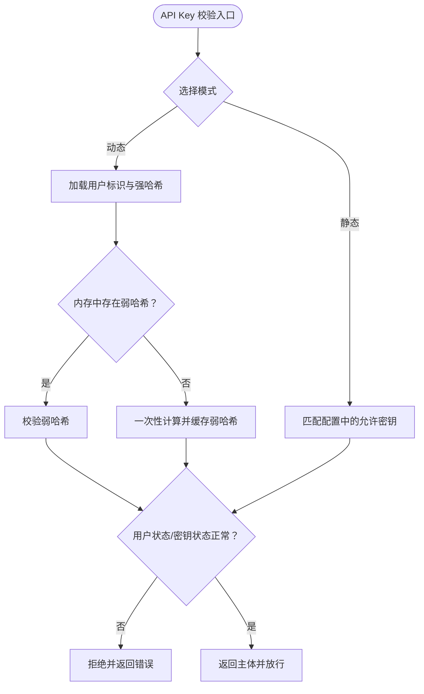
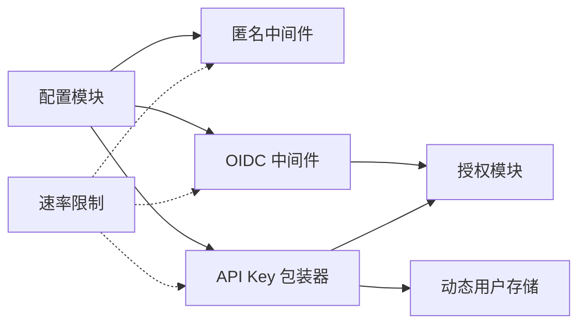

# 认证配置

<cite>
**本文引用的文件**
- [configure_api.go](file://adapters/handlers/rest/configure_api.go)
- [configure_weaviate.go](file://adapters/handlers/rest/configure_weaviate.go)
- [get_well_known_openid_configuration.go](file://adapters/handlers/rest/operations/well_known/get_well_known_openid_configuration.go)
- [middleware.go](file://usecases/auth/authentication/anonymous/middleware.go)
- [middleware_test.go](file://usecases/auth/authentication/anonymous/middleware_test.go)
- [middleware.go](file://usecases/auth/authentication/oidc/middleware.go)
- [middleware_test.go](file://usecases/auth/authentication/oidc/middleware_test.go)
- [wrapper.go](file://usecases/auth/authentication/apikey/wrapper.go)
- [wrapper_test.go](file://usecases/auth/authentication/apikey/wrapper_test.go)
- [db_users.go](file://usecases/auth/authentication/apikey/db_users.go)
- [db_user_test.go](file://usecases/auth/authentication/apikey/db_user_test.go)
- [user_api_key.go](file://entities/models/user_api_key.go)
- [users_test.go](file://test/acceptance/authz/users_test.go)
- [model.go](file://usecases/auth/authorization/rbac/model.go)
- [handlers_authz.go](file://adapters/handlers/rest/authz/handlers_authz.go)
- [manager.go](file://cluster/rbac/manager.go)
- [limiter.go](file://usecases/ratelimiter/limiter.go)
- [limiter_test.go](file://usecases/ratelimiter/limiter_test.go)
- [config_handler_test.go](file://usecases/config/config_handler_test.go)
- [weaviate-realm.json](file://tools/dev/keycloak/weaviate-realm.json)
</cite>

## 目录
1. [简介](#简介)
2. [项目结构](#项目结构)
3. [核心组件](#核心组件)
4. [架构总览](#架构总览)
5. [详细组件分析](#详细组件分析)
6. [依赖关系分析](#依赖关系分析)
7. [性能考量](#性能考量)
8. [故障排查指南](#故障排查指南)
9. [结论](#结论)
10. [附录：完整配置示例与最佳实践](#附录完整配置示例与最佳实践)

## 简介
本指南面向系统管理员与开发者，提供 Weaviate 认证配置的完整实施指导。内容覆盖：
- OIDC（OpenID Connect）集成配置：提供商设置、回调 URL、令牌验证流程
- API 密钥管理：生成、轮换、权限控制与安全存储
- 基本认证机制：用户名/密码策略与会话管理
- 认证中间件配置与自定义认证处理器开发
- 失败处理、速率限制与安全审计配置
- 完整配置示例与常见问题解决方案

## 项目结构
Weaviate 的认证相关实现主要分布在以下模块：
- REST 层：REST API 初始化与 OIDC 发现端点
- 认证层：匿名访问、OIDC、API Key（静态与动态用户）
- 授权层：RBAC 策略与角色管理
- 速率限制：并发请求限流
- 测试与工具：配置校验、Keycloak 示例

图表来源
- [configure_weaviate.go](file://adapters/handlers/rest/configure_weaviate.go#L1-L200)
- [get_well_known_openid_configuration.go](file://adapters/handlers/rest/operations/well_known/get_well_known_openid_configuration.go#L1-L120)
- [middleware.go](file://usecases/auth/authentication/anonymous/middleware.go#L1-L200)
- [middleware.go](file://usecases/auth/authentication/oidc/middleware.go#L1-L200)
- [wrapper.go](file://usecases/auth/authentication/apikey/wrapper.go#L1-L120)
- [db_users.go](file://usecases/auth/authentication/apikey/db_users.go#L1-L200)
- [model.go](file://usecases/auth/authorization/rbac/model.go#L1-L200)
- [handlers_authz.go](file://adapters/handlers/rest/authz/handlers_authz.go#L1-L200)
- [manager.go](file://cluster/rbac/manager.go#L1-L120)
- [limiter.go](file://usecases/ratelimiter/limiter.go#L1-L120)
- [user_api_key.go](file://entities/models/user_api_key.go#L1-L120)

章节来源
- [configure_weaviate.go](file://adapters/handlers/rest/configure_weaviate.go#L1-L200)
- [configure_api.go](file://adapters/handlers/rest/configure_api.go#L1-L200)

## 核心组件
- 匿名访问中间件：在未启用匿名访问时拒绝未认证请求；当启用且无凭据时返回 401。
- OIDC 中间件：校验 Bearer 令牌，支持客户端 ID 校验与用户名声明映射；配置不完整时初始化失败。
- API Key 包装器：同时支持静态 API Key 与动态用户数据库存储；根据配置启用不同后端。
- 动态用户与密钥存储：基于 Argon2 的强哈希与弱哈希组合，支持密钥撤销、用户禁用与最后使用时间更新。
- RBAC 授权：内置根与只读角色，支持策略 CSV 与集群化管理。
- 速率限制：并发请求数限流，避免过载。

章节来源
- [middleware.go](file://usecases/auth/authentication/anonymous/middleware.go#L1-L200)
- [middleware_test.go](file://usecases/auth/authentication/anonymous/middleware_test.go#L54-L102)
- [middleware.go](file://usecases/auth/authentication/oidc/middleware.go#L1-L200)
- [middleware_test.go](file://usecases/auth/authentication/oidc/middleware_test.go#L49-L87)
- [wrapper.go](file://usecases/auth/authentication/apikey/wrapper.go#L1-L120)
- [wrapper_test.go](file://usecases/auth/authentication/apikey/wrapper_test.go#L51-L148)
- [db_users.go](file://usecases/auth/authentication/apikey/db_users.go#L368-L412)
- [db_user_test.go](file://usecases/auth/authentication/apikey/db_user_test.go#L197-L239)
- [model.go](file://usecases/auth/authorization/rbac/model.go#L144-L182)
- [handlers_authz.go](file://adapters/handlers/rest/authz/handlers_authz.go#L309-L333)
- [manager.go](file://cluster/rbac/manager.go#L31-L50)
- [limiter.go](file://usecases/ratelimiter/limiter.go#L16-L60)

## 架构总览
下图展示从 REST 请求到认证与授权的整体流程，以及 OIDC 发现端点与认证中间件的协作关系。

图表来源
- [configure_weaviate.go](file://adapters/handlers/rest/configure_weaviate.go#L1-L200)
- [middleware.go](file://usecases/auth/authentication/anonymous/middleware.go#L1-L200)
- [middleware.go](file://usecases/auth/authentication/oidc/middleware.go#L1-L200)
- [wrapper.go](file://usecases/auth/authentication/apikey/wrapper.go#L1-L120)
- [handlers_authz.go](file://adapters/handlers/rest/authz/handlers_authz.go#L309-L333)

## 详细组件分析

### OIDC 集成配置
- 提供商设置
  - 必填字段：issuer、client_id、username_claim
  - 可选：跳过客户端 ID 校验开关
  - 初始化失败场景：缺失必填字段时抛出错误
- 回调 URL 配置
  - OIDC 发现端点用于暴露 OpenID 配置，便于客户端自动发现
- 令牌验证流程
  - 中间件接收 Authorization: Bearer 请求头
  - 校验令牌有效性与可选的 client_id
  - 成功则放行，失败返回 401

图表来源
- [middleware_test.go](file://usecases/auth/authentication/oidc/middleware_test.go#L49-L87)
- [get_well_known_openid_configuration.go](file://adapters/handlers/rest/operations/well_known/get_well_known_openid_configuration.go#L1-L120)

章节来源
- [middleware_test.go](file://usecases/auth/authentication/oidc/middleware_test.go#L49-L87)
- [get_well_known_openid_configuration.go](file://adapters/handlers/rest/operations/well_known/get_well_known_openid_configuration.go#L1-L120)

### API 密钥管理策略
- 生成与存储
  - 动态用户：使用强哈希（Argon2）与弱哈希组合，弱哈希仅驻留内存以加速后续校验
  - 静态 API Key：直接在配置中声明允许的密钥列表
- 轮换与权限控制
  - 支持撤销特定用户的密钥
  - 支持禁用用户导致所有密钥失效
  - 最后使用时间更新用于审计与过期策略
- 安全存储
  - 强哈希持久化存储，弱哈希仅内存缓存
  - 支持快照与恢复，保证高可用与迁移

图表来源
- [wrapper.go](file://usecases/auth/authentication/apikey/wrapper.go#L1-L120)
- [db_users.go](file://usecases/auth/authentication/apikey/db_users.go#L368-L412)
- [db_user_test.go](file://usecases/auth/authentication/apikey/db_user_test.go#L197-L239)
- [wrapper_test.go](file://usecases/auth/authentication/apikey/wrapper_test.go#L51-L148)
- [user_api_key.go](file://entities/models/user_api_key.go#L54-L82)

章节来源
- [wrapper.go](file://usecases/auth/authentication/apikey/wrapper.go#L1-L120)
- [db_users.go](file://usecases/auth/authentication/apikey/db_users.go#L368-L412)
- [db_user_test.go](file://usecases/auth/authentication/apikey/db_user_test.go#L197-L239)
- [wrapper_test.go](file://usecases/auth/authentication/apikey/wrapper_test.go#L51-L148)
- [user_api_key.go](file://entities/models/user_api_key.go#L54-L82)

### 基本认证机制（用户名/密码与会话）
- Keycloak 示例：提供了基本认证与 OTP 的执行流配置，可用于理解用户名/密码与会话管理的典型流程
- 在 Weaviate 中，基本认证通常通过 OIDC 或 API Key 实现；如需本地用户名/密码，建议结合 OIDC 提供商或动态用户 API Key

章节来源
- [weaviate-realm.json](file://tools/dev/keycloak/weaviate-realm.json#L1439-L1484)

### 认证中间件配置与自定义认证处理器
- 中间件装配：在 REST 初始化阶段装配匿名访问、OIDC、API Key 中间件，并与授权模块协同
- 自定义认证处理器：可参考现有包装器模式，实现新的认证源（例如自定义令牌格式或外部鉴权服务），并在包装器中统一输出标准主体模型

章节来源
- [configure_weaviate.go](file://adapters/handlers/rest/configure_weaviate.go#L1-L200)
- [wrapper.go](file://usecases/auth/authentication/apikey/wrapper.go#L1-L120)

### 授权与审计（RBAC）
- 内置角色：根（root）与只读（viewer）等预设角色，支持批量应用与用户分配
- 授权接口：提供角色查询、权限校验等 REST 接口，支持按资源过滤
- 审计：测试用例展示了审计标记与资源聚合行为，便于落地审计日志

章节来源
- [model.go](file://usecases/auth/authorization/rbac/model.go#L144-L182)
- [handlers_authz.go](file://adapters/handlers/rest/authz/handlers_authz.go#L309-L333)
- [users_test.go](file://test/acceptance/authz/users_test.go#L385-L415)

## 依赖关系分析
- 认证中间件依赖配置模块与日志组件
- API Key 包装器依赖动态用户存储与密钥生成工具
- OIDC 中间件依赖令牌验证器与配置
- 授权模块依赖 RBAC 策略与主体类型
- 速率限制独立于认证/授权，作为通用保护措施

图表来源
- [configure_weaviate.go](file://adapters/handlers/rest/configure_weaviate.go#L1-L200)
- [wrapper.go](file://usecases/auth/authentication/apikey/wrapper.go#L1-L120)
- [db_users.go](file://usecases/auth/authentication/apikey/db_users.go#L1-L200)
- [limiter.go](file://usecases/ratelimiter/limiter.go#L1-L120)

章节来源
- [configure_weaviate.go](file://adapters/handlers/rest/configure_weaviate.go#L1-L200)
- [wrapper.go](file://usecases/auth/authentication/apikey/wrapper.go#L1-L120)
- [limiter.go](file://usecases/ratelimiter/limiter.go#L1-L120)

## 性能考量
- 动态用户登录优化：首次登录进行强哈希计算并缓存弱哈希，后续登录仅校验弱哈希，显著降低延迟
- 并发控制：通过并发限流器限制同时处理的请求数量，避免过载
- 缓存与快照：动态用户支持快照与恢复，便于迁移与高可用

章节来源
- [db_user_test.go](file://usecases/auth/authentication/apikey/db_user_test.go#L197-L239)
- [limiter.go](file://usecases/ratelimiter/limiter.go#L16-L60)
- [limiter_test.go](file://usecases/ratelimiter/limiter_test.go#L23-L84)

## 故障排查指南
- OIDC 初始化失败
  - 现象：启动时报错提示缺少 issuer、username_claim、client_id 等必填项
  - 处理：补齐配置或在需要时关闭客户端 ID 校验
- 401 未授权
  - 匿名访问禁用且未携带有效凭据：确认 Bearer 令牌或 API Key 是否正确
  - OIDC 启用但令牌无效：检查令牌签名、受众与过期时间
  - API Key 无效：确认密钥是否被撤销或用户被禁用
- 配置冲突
  - 同时启用匿名访问与 RBAC：需确保业务逻辑允许该组合
- 速率限制
  - 请求被拒绝：检查并发阈值设置，必要时提升上限或优化客户端重试策略

章节来源
- [middleware_test.go](file://usecases/auth/authentication/oidc/middleware_test.go#L49-L87)
- [middleware_test.go](file://usecases/auth/authentication/anonymous/middleware_test.go#L54-L102)
- [config_handler_test.go](file://usecases/config/config_handler_test.go#L261-L294)
- [limiter.go](file://usecases/ratelimiter/limiter.go#L16-L60)

## 结论
Weaviate 的认证体系以中间件为核心，结合 OIDC 与 API Key 提供灵活的多源认证能力，并通过 RBAC 实现细粒度授权。配合速率限制与动态用户存储优化，可在生产环境中实现高可用、高性能与高安全性的统一认证方案。

## 附录：完整配置示例与最佳实践
- OIDC 配置要点
  - 设置 issuer、client_id、username_claim
  - 如需跳过客户端 ID 校验，开启相应开关
  - 使用 OIDC 发现端点暴露配置
- API Key 配置要点
  - 静态 API Key：在配置中声明允许的密钥列表
  - 动态用户：启用持久化存储，定期轮换密钥，及时撤销与禁用用户
  - 审计：利用最后使用时间与撤销标记进行审计
- 基本认证与会话
  - 建议通过 OIDC 提供商或动态用户 API Key 实现
  - Keycloak 示例可作为参考模板
- 授权与审计
  - 使用内置角色与策略，结合授权接口进行权限校验
  - 开启审计标记，聚合资源访问结果
- 速率限制
  - 根据实例规模与硬件能力设置并发阈值
  - 客户端侧实现指数退避与重试策略

章节来源
- [get_well_known_openid_configuration.go](file://adapters/handlers/rest/operations/well_known/get_well_known_openid_configuration.go#L1-L120)
- [weaviate-realm.json](file://tools/dev/keycloak/weaviate-realm.json#L1439-L1484)
- [handlers_authz.go](file://adapters/handlers/rest/authz/handlers_authz.go#L309-L333)
- [limiter.go](file://usecases/ratelimiter/limiter.go#L16-L60)