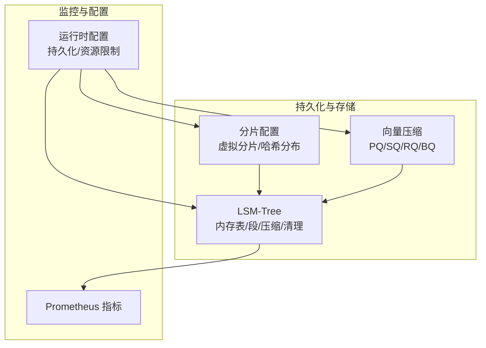
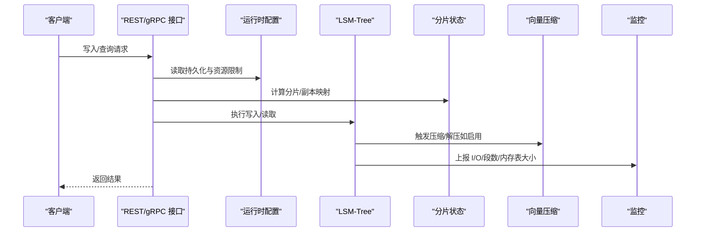
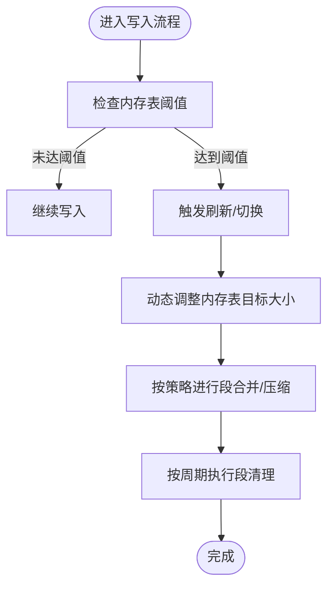
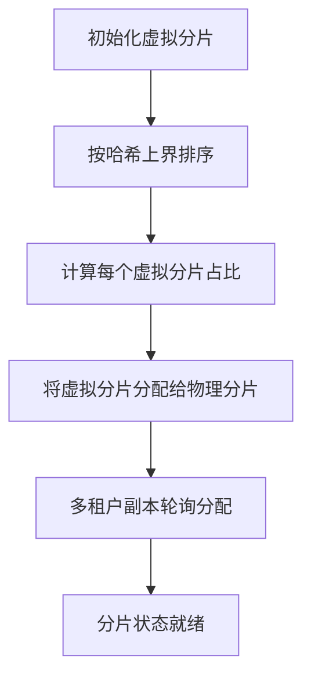
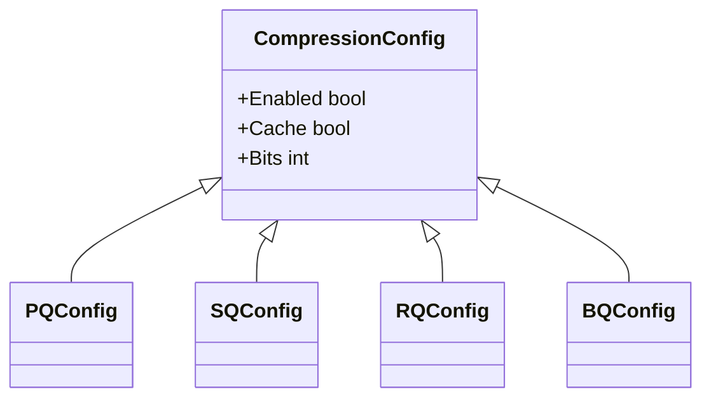
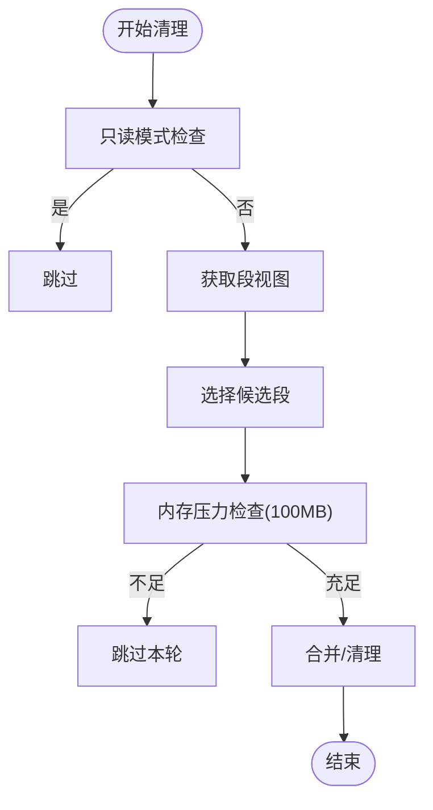
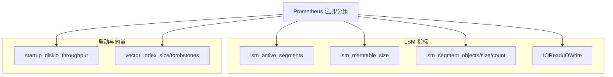
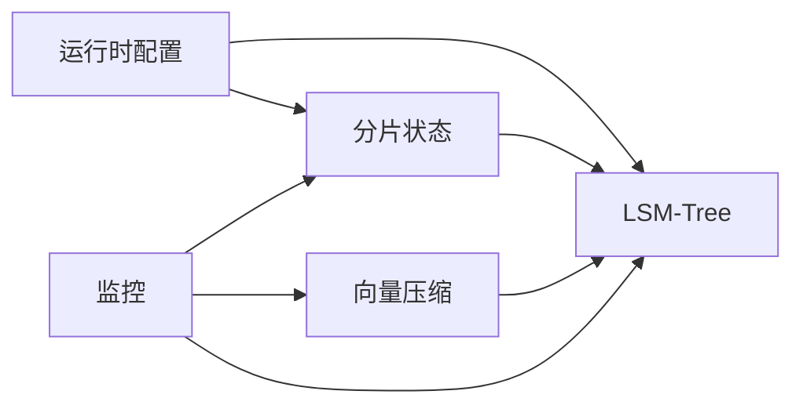

# 存储优化

<cite>
**本文引用的文件**
- [adapters/repos/db/lsmkv/memtable_size_advisor.go](file://adapters/repos/db/lsmkv/memtable_size_advisor.go)
- [adapters/repos/db/lsmkv/bucket.go](file://adapters/repos/db/lsmkv/bucket.go)
- [adapters/repos/db/lsmkv/segment_group_cleanup.go](file://adapters/repos/db/lsmkv/segment_group_cleanup.go)
- [adapters/repos/db/lsmkv/compaction_roaring_set_integration_test.go](file://adapters/repos/db/lsmkv/compaction_roaring_set_integration_test.go)
- [adapters/repos/db/lsmkv/segment_group_compaction_test.go](file://adapters/repos/db/lsmkv/segment_group_compaction_test.go)
- [adapters/repos/db/shard_bucket_options.go](file://adapters/repos/db/shard_bucket_options.go)
- [usecases/config/config_handler.go](file://usecases/config/config_handler.go)
- [usecases/sharding/state.go](file://usecases/sharding/state.go)
- [usecases/sharding/config/config.go](file://usecases/sharding/config/config.go)
- [adapters/repos/db/fakes_for_tests.go](file://adapters/repos/db/fakes_for_tests.go)
- [adapters/repos/db/vector/compressionhelpers/compression.go](file://adapters/repos/db/vector/compressionhelpers/compression.go)
- [adapters/repos/db/vector/flat/metadata.go](file://adapters/repos/db/vector/flat/metadata.go)
- [adapters/repos/db/vector/hnsw/commit_logger_snapshot.go](file://adapters/repos/db/vector/hnsw/commit_logger_snapshot.go)
- [entities/vectorindex/flat/config.go](file://entities/vectorindex/flat/config.go)
- [usecases/monitoring/prometheus.go](file://usecases/monitoring/prometheus.go)
- [adapters/repos/db/lsmkv/metrics.go](file://adapters/repos/db/lsmkv/metrics.go)
- [docs/metrics.md](file://docs/metrics.md)
- [adapters/handlers/rest/configure_api.go](file://adapters/handlers/rest/configure_api.go)
- [tools/dev/config.local-development.yaml](file://tools/dev/config.local-development.yaml)
- [tools/dev/config.runtime-overrides.yaml](file://tools/dev/config.runtime-overrides.yaml)
</cite>

## 目录
1. [简介](#简介)
2. [项目结构](#项目结构)
3. [核心组件](#核心组件)
4. [架构总览](#架构总览)
5. [详细组件分析](#详细组件分析)
6. [依赖关系分析](#依赖关系分析)
7. [性能考量](#性能考量)
8. [故障排查指南](#故障排查指南)
9. [结论](#结论)
10. [附录](#附录)

## 简介
本指南面向 Weaviate 的存储优化，聚焦以下关键主题：
- LSM-Tree 参数调优：SSTable 大小、压缩策略、内存表大小与动态调整
- 分片配置优化：分片数量、虚拟分片、哈希分布与副本策略
- 数据压缩技术：向量压缩（PQ/SQ/RQ/BQ）与行/列级压缩思路
- 存储空间管理：清理策略、OOM 保护、懒加载与元数据写入
- 存储性能监控：I/O 指标、利用率与容量规划
- 实战示例与优化案例：结合配置文件与测试用例给出可操作建议

## 项目结构
Weaviate 的存储优化涉及多个层次：
- LSM-Tree 层：内存表、段管理、压缩与清理
- 分片层：物理分片、虚拟分片、哈希分布与副本分配
- 向量索引层：量化压缩（PQ/SQ/RQ/BQ）与缓存
- 监控层：Prometheus 指标与运行时配置

图示来源
- [adapters/repos/db/lsmkv/bucket.go](file://adapters/repos/db/lsmkv/bucket.go#L125-L153)
- [usecases/sharding/state.go](file://usecases/sharding/state.go#L565-L599)
- [adapters/repos/db/vector/compressionhelpers/compression.go](file://adapters/repos/db/vector/compressionhelpers/compression.go#L766-L918)
- [usecases/config/config_handler.go](file://usecases/config/config_handler.go#L413-L436)
- [usecases/monitoring/prometheus.go](file://usecases/monitoring/prometheus.go#L398-L424)

章节来源
- [adapters/repos/db/lsmkv/bucket.go](file://adapters/repos/db/lsmkv/bucket.go#L125-L153)
- [usecases/sharding/state.go](file://usecases/sharding/state.go#L565-L599)
- [adapters/repos/db/vector/compressionhelpers/compression.go](file://adapters/repos/db/vector/compressionhelpers/compression.go#L766-L918)
- [usecases/config/config_handler.go](file://usecases/config/config_handler.go#L413-L436)
- [usecases/monitoring/prometheus.go](file://usecases/monitoring/prometheus.go#L398-L424)

## 核心组件
- LSM-Tree 内存表与段管理：支持内存表大小动态调整、段合并策略、清理与校验
- 分片状态与配置：虚拟分片初始化、哈希分布、副本节点选择
- 向量压缩：PQ/SQ/RQ/BQ 的压缩参数解析与恢复流程
- 运行时配置：持久化参数（如 LSM 最大段大小、清理间隔）、资源使用阈值
- 监控指标：LSM 段数、内存表大小、读写 I/O、启动吞吐等

章节来源
- [adapters/repos/db/lsmkv/memtable_size_advisor.go](file://adapters/repos/db/lsmkv/memtable_size_advisor.go#L16-L88)
- [adapters/repos/db/lsmkv/bucket.go](file://adapters/repos/db/lsmkv/bucket.go#L125-L153)
- [usecases/sharding/state.go](file://usecases/sharding/state.go#L565-L599)
- [usecases/sharding/config/config.go](file://usecases/sharding/config/config.go#L53-L110)
- [adapters/repos/db/vector/compressionhelpers/compression.go](file://adapters/repos/db/vector/compressionhelpers/compression.go#L766-L918)
- [entities/vectorindex/flat/config.go](file://entities/vectorindex/flat/config.go#L156-L220)
- [usecases/config/config_handler.go](file://usecases/config/config_handler.go#L413-L436)
- [adapters/repos/db/lsmkv/metrics.go](file://adapters/repos/db/lsmkv/metrics.go#L103-L138)
- [docs/metrics.md](file://docs/metrics.md#L61-L94)

## 架构总览
下图展示存储优化的关键交互路径：配置驱动 LSM 行为，分片决定数据分布，压缩降低存储与带宽，监控反馈性能瓶颈。

图示来源
- [adapters/handlers/rest/configure_api.go](file://adapters/handlers/rest/configure_api.go#L430-L446)
- [usecases/config/config_handler.go](file://usecases/config/config_handler.go#L413-L436)
- [adapters/repos/db/lsmkv/metrics.go](file://adapters/repos/db/lsmkv/metrics.go#L103-L138)
- [docs/metrics.md](file://docs/metrics.md#L61-L94)

## 详细组件分析

### LSM-Tree 参数调优
- 内存表大小与动态调整
  - 支持根据上次刷新时间与步长动态调整目标大小，避免固定阈值导致的抖动
  - 无配置时回退到合理默认值，保证稳定性
- 段大小与压缩策略
  - 段最大大小可通过持久化配置控制，默认“几乎无上限”以兼容历史行为
  - 段清理周期可配置，默认关闭（0 秒），需按场景开启
  - 可启用段校验与独立对象压缩，提升一致性与压缩比
- 懒加载与元数据写入
  - 支持懒加载段与最小 MMAP 大小，降低冷数据开销
  - 可选择是否写入元数据文件，平衡可观测性与写放大

图示来源
- [adapters/repos/db/lsmkv/memtable_size_advisor.go](file://adapters/repos/db/lsmkv/memtable_size_advisor.go#L47-L71)
- [adapters/repos/db/lsmkv/bucket.go](file://adapters/repos/db/lsmkv/bucket.go#L125-L153)
- [adapters/repos/db/lsmkv/segment_group_cleanup.go](file://adapters/repos/db/lsmkv/segment_group_cleanup.go#L418-L459)
- [usecases/config/config_handler.go](file://usecases/config/config_handler.go#L413-L436)

章节来源
- [adapters/repos/db/lsmkv/memtable_size_advisor.go](file://adapters/repos/db/lsmkv/memtable_size_advisor.go#L16-L88)
- [adapters/repos/db/lsmkv/bucket.go](file://adapters/repos/db/lsmkv/bucket.go#L125-L153)
- [adapters/repos/db/lsmkv/segment_group_cleanup.go](file://adapters/repos/db/lsmkv/segment_group_cleanup.go#L418-L459)
- [usecases/config/config_handler.go](file://usecases/config/config_handler.go#L413-L436)

### 分片配置优化
- 虚拟分片与哈希分布
  - 初始化虚拟分片并按 Murmur3 哈希上界排序，计算每个虚拟分片拥有比例
  - 物理分片与虚拟分片一一映射，确保均匀分布
- 分片数量与副本策略
  - 分片数量由 desiredCount 与 virtualPerPhysical 共同决定
  - 多租户场景下按租户轮询选择副本节点，实现副本跨节点分布
- 动态分片（扩展能力）
  - 当前实现为初始化阶段的静态分布，动态分片需要更复杂的令牌环与再平衡逻辑

图示来源
- [usecases/sharding/state.go](file://usecases/sharding/state.go#L565-L599)
- [usecases/sharding/config/config.go](file://usecases/sharding/config/config.go#L53-L110)
- [adapters/repos/db/fakes_for_tests.go](file://adapters/repos/db/fakes_for_tests.go#L263-L290)

章节来源
- [usecases/sharding/state.go](file://usecases/sharding/state.go#L565-L599)
- [usecases/sharding/config/config.go](file://usecases/sharding/config/config.go#L53-L110)
- [adapters/repos/db/fakes_for_tests.go](file://adapters/repos/db/fakes_for_tests.go#L263-L290)

### 数据压缩技术
- 向量压缩（PQ/SQ/RQ/BQ）
  - 参数解析与互斥：同一索引仅允许一种量化方法启用
  - RQ 支持 1/8 比特位宽，需显式启用缓存才生效
  - Flat/HNSW 均支持压缩，HNSW 在快照中保存压缩参数（PQ/SQ/RQ）
- 行/列级压缩思路
  - 行级：对象整体压缩（如启用压缩桶），减少对象存储体积
  - 列级：针对属性/向量字段采用不同压缩策略（如向量量化），降低向量存储与传输成本
- 缓存与性能权衡
  - 压缩后可配合缓存加速解压访问，需评估内存占用与命中率

图示来源
- [entities/vectorindex/flat/config.go](file://entities/vectorindex/flat/config.go#L156-L220)
- [adapters/repos/db/vector/compressionhelpers/compression.go](file://adapters/repos/db/vector/compressionhelpers/compression.go#L766-L918)
- [adapters/repos/db/vector/flat/metadata.go](file://adapters/repos/db/vector/flat/metadata.go#L336-L380)
- [adapters/repos/db/vector/hnsw/commit_logger_snapshot.go](file://adapters/repos/db/vector/hnsw/commit_logger_snapshot.go#L1319-L1696)

章节来源
- [entities/vectorindex/flat/config.go](file://entities/vectorindex/flat/config.go#L156-L220)
- [adapters/repos/db/vector/compressionhelpers/compression.go](file://adapters/repos/db/vector/compressionhelpers/compression.go#L766-L918)
- [adapters/repos/db/vector/flat/metadata.go](file://adapters/repos/db/vector/flat/metadata.go#L336-L380)
- [adapters/repos/db/vector/hnsw/commit_logger_snapshot.go](file://adapters/repos/db/vector/hnsw/commit_logger_snapshot.go#L1319-L1696)

### 存储空间管理策略
- 清理与回收
  - 段清理周期可配置，默认关闭；清理前检查可用内存，避免 OOM
  - 支持独立对象压缩与段校验，减少无效数据与提升一致性
- 懒加载与元数据
  - 懒加载段与最小 MMAP 大小降低冷数据 IO 开销
  - 可选择写入元数据文件，便于诊断但增加写放大
- 垃圾回收与碎片整理
  - 通过段合并与清理减少碎片；结合压缩降低存储占用

图示来源
- [adapters/repos/db/lsmkv/segment_group_cleanup.go](file://adapters/repos/db/lsmkv/segment_group_cleanup.go#L418-L459)
- [adapters/repos/db/lsmkv/bucket.go](file://adapters/repos/db/lsmkv/bucket.go#L125-L153)
- [usecases/config/config_handler.go](file://usecases/config/config_handler.go#L413-L436)

章节来源
- [adapters/repos/db/lsmkv/segment_group_cleanup.go](file://adapters/repos/db/lsmkv/segment_group_cleanup.go#L418-L459)
- [adapters/repos/db/lsmkv/bucket.go](file://adapters/repos/db/lsmkv/bucket.go#L125-L153)
- [usecases/config/config_handler.go](file://usecases/config/config_handler.go#L413-L436)

### 存储性能监控
- 关键指标
  - LSM：活动段数、内存表大小、段对象/大小、读写 I/O、懒加载/卸载计数
  - 启动：启动时延、磁盘 I/O 吞吐
  - 向量索引：墓碑数量、段总数/维度总和、操作耗时
- 指标分类与成本控制
  - 仪表板活跃指标：稳定、低基数标签
  - 运营指标：健康/后台进程，尽量采样
  - 告警指标：最小化、低基数
  - 分析/调试指标：可移出 Prometheus，避免长期留存

图示来源
- [docs/metrics.md](file://docs/metrics.md#L61-L94)
- [adapters/repos/db/lsmkv/metrics.go](file://adapters/repos/db/lsmkv/metrics.go#L103-L138)
- [usecases/monitoring/prometheus.go](file://usecases/monitoring/prometheus.go#L398-L424)

章节来源
- [docs/metrics.md](file://docs/metrics.md#L61-L94)
- [adapters/repos/db/lsmkv/metrics.go](file://adapters/repos/db/lsmkv/metrics.go#L103-L138)
- [usecases/monitoring/prometheus.go](file://usecases/monitoring/prometheus.go#L398-L424)

## 依赖关系分析
- 组件耦合
  - 分片状态与配置驱动 LSM 的桶选项（如范围可内存化、位图缓冲池）
  - 运行时配置影响 LSM 的段大小、清理周期、懒加载与元数据写入
  - 监控指标贯穿 LSM、分片与向量索引，形成闭环反馈
- 外部依赖
  - Prometheus 指标注册与分组策略
  - 向量压缩依赖量化器与编码器参数（PQ/SQ/RQ/BQ）

图示来源
- [adapters/repos/db/shard_bucket_options.go](file://adapters/repos/db/shard_bucket_options.go#L44-L70)
- [usecases/config/config_handler.go](file://usecases/config/config_handler.go#L413-L436)
- [adapters/repos/db/lsmkv/metrics.go](file://adapters/repos/db/lsmkv/metrics.go#L103-L138)

章节来源
- [adapters/repos/db/shard_bucket_options.go](file://adapters/repos/db/shard_bucket_options.go#L44-L70)
- [usecases/config/config_handler.go](file://usecases/config/config_handler.go#L413-L436)
- [adapters/repos/db/lsmkv/metrics.go](file://adapters/repos/db/lsmkv/metrics.go#L103-L138)

## 性能考量
- LSM-Tree
  - 合理设置段最大大小与清理周期，避免过多小段与频繁合并
  - 启用段校验与独立对象压缩，提升一致性与压缩比
  - 使用懒加载与最小 MMAP 大小，降低冷数据 IO
- 分片
  - 虚拟分片数量与物理分片比例影响分布均匀性
  - 多租户副本轮询分配，避免热点节点
- 压缩
  - 向量压缩优先选择单一量化方案，避免相互冲突
  - RQ 1/8 比特位宽需结合缓存与内存预算评估
- 监控
  - 关注 LSM 活动段数与内存表大小，及时调整刷新策略
  - 监控启动吞吐与 I/O 指标，定位瓶颈

## 故障排查指南
- 清理被跳过（OOM 保护）
  - 现象：清理周期触发但未执行
  - 原因：可用内存不足（预留 100MB）
  - 处理：扩容节点或延迟清理周期
- 段校验失败
  - 现象：段校验启用时报错
  - 原因：段损坏或校验失败
  - 处理：检查磁盘健康与 IO，必要时重建段
- 压缩配置冲突
  - 现象：同时启用多种量化方法报错
  - 原因：量化方法互斥
  - 处理：仅启用一种量化方法，并确保缓存与启用一致

章节来源
- [adapters/repos/db/lsmkv/segment_group_cleanup.go](file://adapters/repos/db/lsmkv/segment_group_cleanup.go#L440-L459)
- [adapters/repos/db/lsmkv/bucket.go](file://adapters/repos/db/lsmkv/bucket.go#L125-L153)
- [entities/vectorindex/flat/config.go](file://entities/vectorindex/flat/config.go#L194-L220)

## 结论
通过合理的 LSM-Tree 参数、分片分布与向量压缩策略，结合完善的监控与清理机制，Weaviate 可在高吞吐写入与高效检索之间取得平衡。建议以监控指标为依据持续迭代配置，并在生产环境谨慎引入压缩与清理策略，确保稳定性与性能兼顾。

## 附录
- 配置示例与参考
  - 开发配置示例：本地开发与调试开关
  - 运行时覆盖：慢查询日志、并发因子等
- 测试与验证
  - LSM 压缩与清理集成测试
  - 段合并最佳配对测试

章节来源
- [tools/dev/config.local-development.yaml](file://tools/dev/config.local-development.yaml#L1-L31)
- [tools/dev/config.runtime-overrides.yaml](file://tools/dev/config.runtime-overrides.yaml#L1-L24)
- [adapters/repos/db/lsmkv/compaction_roaring_set_integration_test.go](file://adapters/repos/db/lsmkv/compaction_roaring_set_integration_test.go#L29-L49)
- [adapters/repos/db/lsmkv/segment_group_compaction_test.go](file://adapters/repos/db/lsmkv/segment_group_compaction_test.go#L22-L29)