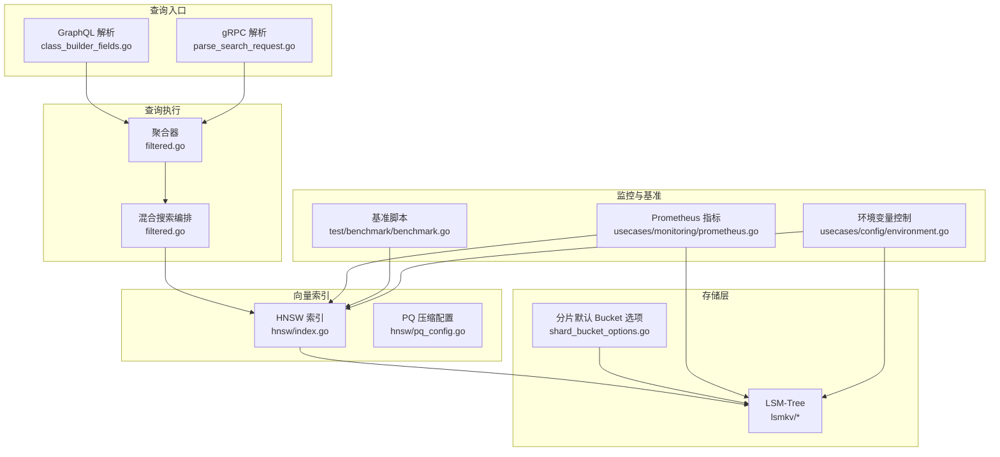
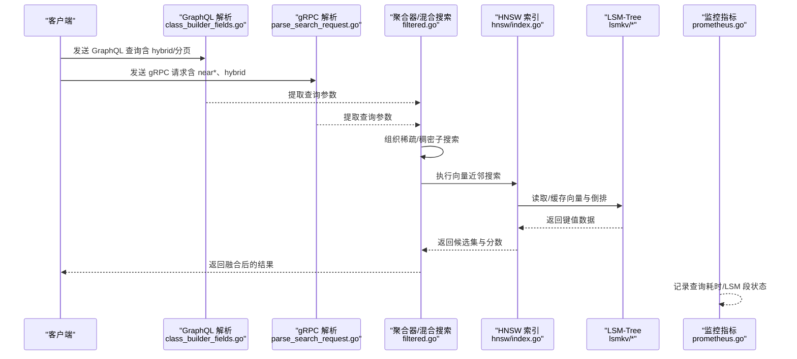
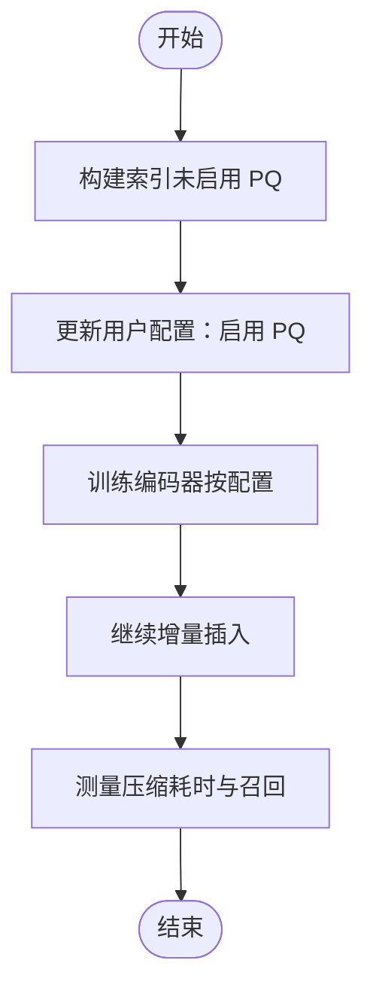
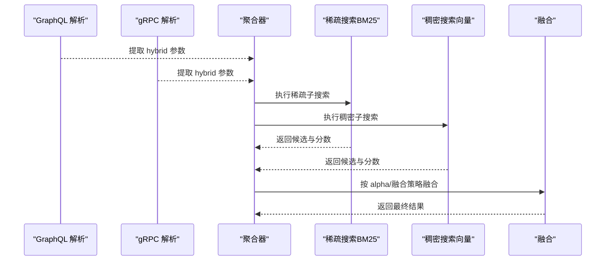
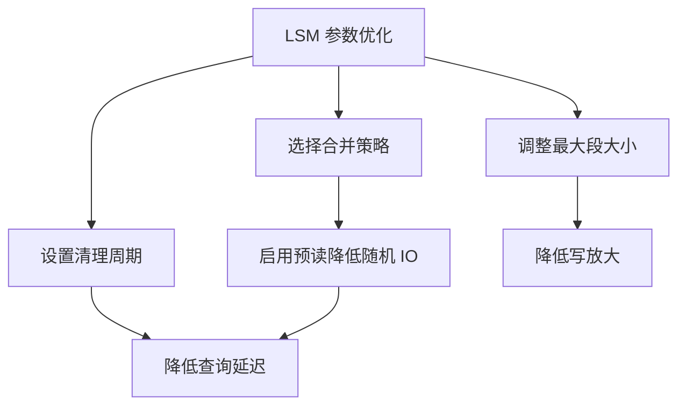
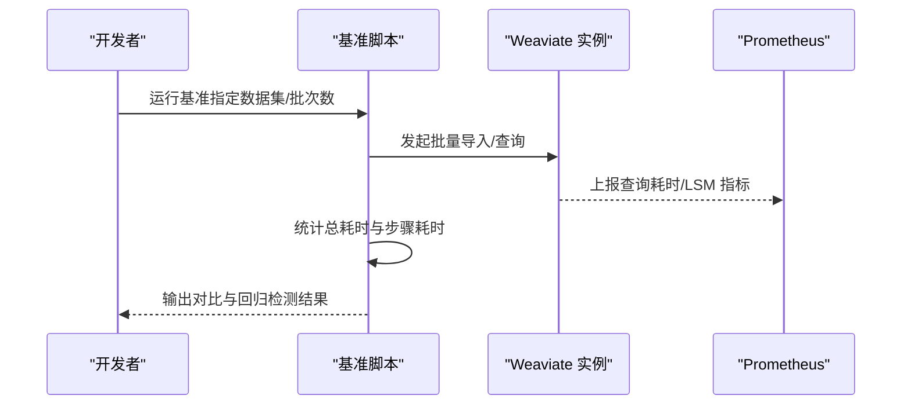
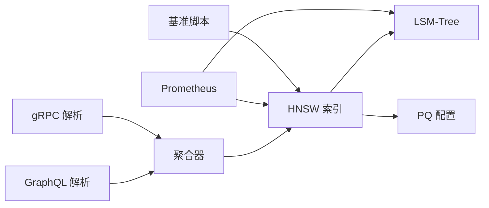

# 性能优化

<cite>
**本文引用的文件**
- [adapters/repos/db/vector/hnsw/index.go](file://adapters/repos/db/vector/hnsw/index.go)
- [adapters/repos/db/vector/hnsw/config.go](file://adapters/repos/db/vector/hnsw/config.go)
- [adapters/repos/db/vector/hnsw/compress_sift_test.go](file://adapters/repos/db/vector/hnsw/compress_sift_test.go)
- [adapters/repos/db/vector/hnsw/compress_recall_test.go](file://adapters/repos/db/vector/hnsw/compress_recall_test.go)
- [entities/vectorindex/hnsw/pq_config.go](file://entities/vectorindex/hnsw/pq_config.go)
- [adapters/repos/db/lsmkv/compaction_bench_test.go](file://adapters/repos/db/lsmkv/compaction_bench_test.go)
- [adapters/repos/db/lsmkv/segment_group_compaction_test.go](file://adapters/repos/db/lsmkv/segment_group_compaction_test.go)
- [adapters/repos/db/shard_bucket_options.go](file://adapters/repos/db/shard_bucket_options.go)
- [adapters/repos/db/aggregator/filtered.go](file://adapters/repos/db/aggregator/filtered.go)
- [adapters/handlers/graphql/local/get/class_builder_fields.go](file://adapters/handlers/graphql/local/get/class_builder_fields.go)
- [adapters/handlers/grpc/v1/parse_search_request.go](file://adapters/handlers/grpc/v1/parse_search_request.go)
- [usecases/monitoring/prometheus.go](file://usecases/monitoring/prometheus.go)
- [test/benchmark/benchmark.go](file://test/benchmark/benchmark.go)
- [usecases/config/environment.go](file://usecases/config/environment.go)
- [adapters/repos/db/index_object_storage_test.go](file://adapters/repos/db/index_object_storage_test.go)
- [adapters/repos/db/vector/hnsw/datasets/neurips23/simple_runbook.yaml](file://adapters/repos/db/vector/hnsw/datasets/neurips23/simple_runbook.yaml)
- [adapters/handlers/rest/configure_api.go](file://adapters/handlers/rest/configure_api.go)
- [entities/schema/config/vector_index_config.go](file://entities/schema/config/vector_index_config.go)
- [entities/models/class.go](file://entities/models/class.go)
</cite>

## 目录
1. [简介](#简介)
2. [项目结构](#项目结构)
3. [核心组件](#核心组件)
4. [架构总览](#架构总览)
5. [详细组件分析](#详细组件分析)
6. [依赖关系分析](#依赖关系分析)
7. [性能考量与优化建议](#性能考量与优化建议)
8. [故障排查指南](#故障排查指南)
9. [结论](#结论)
10. [附录：配置示例与对比数据](#附录配置示例与对比数据)

## 简介
本指南面向数据库管理员与系统工程师，聚焦 Weaviate 在向量检索与全文检索场景下的性能优化实践。内容覆盖索引策略（HNSW 参数调优、向量压缩配置、索引选择）、查询优化（查询计划、过滤器与混合搜索）、缓存策略（内存/磁盘/结果缓存）、存储优化（LSM-Tree 参数、分片与压缩）、以及性能监控与基准测试方法，并提供可操作的配置示例与对比数据来源。

## 项目结构
Weaviate 的性能相关能力主要分布在以下模块：
- 向量索引与压缩：hnsw 包含索引构建、压缩与运行时配置；PQ 配置定义在 vectorindex/hnsw 下
- 存储层：lsmkv 提供 LSM-Tree 实现，支持多种合并策略与内存/磁盘参数
- 查询入口：GraphQL/REST/gRPC 解析层负责提取混合搜索、分页等参数
- 聚合与混合搜索：聚合器与 GraphQL 层对稀疏/稠密子搜索进行编排
- 监控与基准：Prometheus 指标、基准脚本与环境变量控制

**图表来源**
- [adapters/handlers/graphql/local/get/class_builder_fields.go](file://adapters/handlers/graphql/local/get/class_builder_fields.go#L443-L473)
- [adapters/handlers/grpc/v1/parse_search_request.go](file://adapters/handlers/grpc/v1/parse_search_request.go#L225-L256)
- [adapters/repos/db/aggregator/filtered.go](file://adapters/repos/db/aggregator/filtered.go#L46-L97)
- [adapters/repos/db/vector/hnsw/index.go](file://adapters/repos/db/vector/hnsw/index.go#L175-L221)
- [entities/vectorindex/hnsw/pq_config.go](file://entities/vectorindex/hnsw/pq_config.go#L37-L90)
- [adapters/repos/db/lsmkv/compaction_bench_test.go](file://adapters/repos/db/lsmkv/compaction_bench_test.go#L26-L50)
- [adapters/repos/db/shard_bucket_options.go](file://adapters/repos/db/shard_bucket_options.go#L44-L70)
- [usecases/monitoring/prometheus.go](file://usecases/monitoring/prometheus.go#L385-L424)
- [test/benchmark/benchmark.go](file://test/benchmark/benchmark.go#L98-L139)
- [usecases/config/environment.go](file://usecases/config/environment.go#L1024-L1070)

**章节来源**
- [adapters/handlers/graphql/local/get/class_builder_fields.go](file://adapters/handlers/graphql/local/get/class_builder_fields.go#L443-L473)
- [adapters/handlers/grpc/v1/parse_search_request.go](file://adapters/handlers/grpc/v1/parse_search_request.go#L225-L256)
- [adapters/repos/db/aggregator/filtered.go](file://adapters/repos/db/aggregator/filtered.go#L46-L97)
- [adapters/repos/db/vector/hnsw/index.go](file://adapters/repos/db/vector/hnsw/index.go#L175-L221)
- [entities/vectorindex/hnsw/pq_config.go](file://entities/vectorindex/hnsw/pq_config.go#L37-L90)
- [adapters/repos/db/lsmkv/compaction_bench_test.go](file://adapters/repos/db/lsmkv/compaction_bench_test.go#L26-L50)
- [adapters/repos/db/shard_bucket_options.go](file://adapters/repos/db/shard_bucket_options.go#L44-L70)
- [usecases/monitoring/prometheus.go](file://usecases/monitoring/prometheus.go#L385-L424)
- [test/benchmark/benchmark.go](file://test/benchmark/benchmark.go#L98-L139)
- [usecases/config/environment.go](file://usecases/config/environment.go#L1024-L1070)

## 核心组件
- HNSW 索引与压缩
  - 运行时压缩开关、PQ/BQ/SQ/RQ 配置、重打分并发度、多向量模式等
  - 参考字段与行为见 [adapters/repos/db/vector/hnsw/index.go](file://adapters/repos/db/vector/hnsw/index.go#L175-L221)
- 向量索引配置接口与多向量解析
  - 多向量/单向量判定、向量索引类型与距离度量
  - 参考接口与解析逻辑见 [entities/schema/config/vector_index_config.go](file://entities/schema/config/vector_index_config.go#L22-L83)
- PQ 编码器与训练参数
  - 编码器类型、分布、分段数、质心数、训练上限
  - 参考配置结构与校验见 [entities/vectorindex/hnsw/pq_config.go](file://entities/vectorindex/hnsw/pq_config.go#L37-L90)
- LSM-Tree 存储与合并策略
  - 合并策略、预读、墓碑保留、内存阈值、段大小等
  - 参考基准与测试见 [adapters/repos/db/lsmkv/compaction_bench_test.go](file://adapters/repos/db/lsmkv/compaction_bench_test.go#L26-L50)、[adapters/repos/db/lsmkv/segment_group_compaction_test.go](file://adapters/repos/db/lsmkv/segment_group_compaction_test.go#L28-L29)
- 分片默认 Bucket 选项
  - 根据策略设置位图缓冲池、范围索引内存化、布隆过滤器等
  - 参考策略分支见 [adapters/repos/db/shard_bucket_options.go](file://adapters/repos/db/shard_bucket_options.go#L44-L70)
- 查询入口与混合搜索
  - GraphQL 与 gRPC 对 hybrid、分页、近邻/热力/IMU 等参数的提取
  - 参考解析逻辑见 [adapters/handlers/graphql/local/get/class_builder_fields.go](file://adapters/handlers/graphql/local/get/class_builder_fields.go#L443-L473)、[adapters/handlers/grpc/v1/parse_search_request.go](file://adapters/handlers/grpc/v1/parse_search_request.go#L225-L256)
- 聚合与混合搜索编排
  - 稀疏（BM25）与稠密（向量）子搜索组合
  - 参考编排逻辑见 [adapters/repos/db/aggregator/filtered.go](file://adapters/repos/db/aggregator/filtered.go#L46-L97)
- 监控与基准
  - Prometheus 指标、查询耗时直方图、LSM 段计数/大小、对象/向量维度统计
  - 参考指标定义与初始化见 [usecases/monitoring/prometheus.go](file://usecases/monitoring/prometheus.go#L385-L424)
  - 基准脚本与回归检测见 [test/benchmark/benchmark.go](file://test/benchmark/benchmark.go#L98-L139)
- 环境变量与运行时控制
  - 查询位图缓冲内存上限、查询最大结果、LSM 清理间隔、段大小等
  - 参考环境变量解析见 [usecases/config/environment.go](file://usecases/config/environment.go#L1024-L1070)
  - REST 层传递的持久化与查询默认值见 [adapters/handlers/rest/configure_api.go](file://adapters/handlers/rest/configure_api.go#L416-L430)

**章节来源**
- [adapters/repos/db/vector/hnsw/index.go](file://adapters/repos/db/vector/hnsw/index.go#L175-L221)
- [entities/schema/config/vector_index_config.go](file://entities/schema/config/vector_index_config.go#L22-L83)
- [entities/vectorindex/hnsw/pq_config.go](file://entities/vectorindex/hnsw/pq_config.go#L37-L90)
- [adapters/repos/db/lsmkv/compaction_bench_test.go](file://adapters/repos/db/lsmkv/compaction_bench_test.go#L26-L50)
- [adapters/repos/db/lsmkv/segment_group_compaction_test.go](file://adapters/repos/db/lsmkv/segment_group_compaction_test.go#L28-L29)
- [adapters/repos/db/shard_bucket_options.go](file://adapters/repos/db/shard_bucket_options.go#L44-L70)
- [adapters/handlers/graphql/local/get/class_builder_fields.go](file://adapters/handlers/graphql/local/get/class_builder_fields.go#L443-L473)
- [adapters/handlers/grpc/v1/parse_search_request.go](file://adapters/handlers/grpc/v1/parse_search_request.go#L225-L256)
- [adapters/repos/db/aggregator/filtered.go](file://adapters/repos/db/aggregator/filtered.go#L46-L97)
- [usecases/monitoring/prometheus.go](file://usecases/monitoring/prometheus.go#L385-L424)
- [test/benchmark/benchmark.go](file://test/benchmark/benchmark.go#L98-L139)
- [usecases/config/environment.go](file://usecases/config/environment.go#L1024-L1070)
- [adapters/handlers/rest/configure_api.go](file://adapters/handlers/rest/configure_api.go#L416-L430)

## 架构总览
下图展示从查询入口到向量索引与存储层的关键交互，以及监控与基准的作用点。

**图表来源**
- [adapters/handlers/graphql/local/get/class_builder_fields.go](file://adapters/handlers/graphql/local/get/class_builder_fields.go#L443-L473)
- [adapters/handlers/grpc/v1/parse_search_request.go](file://adapters/handlers/grpc/v1/parse_search_request.go#L225-L256)
- [adapters/repos/db/aggregator/filtered.go](file://adapters/repos/db/aggregator/filtered.go#L46-L97)
- [adapters/repos/db/vector/hnsw/index.go](file://adapters/repos/db/vector/hnsw/index.go#L175-L221)
- [adapters/repos/db/lsmkv/compaction_bench_test.go](file://adapters/repos/db/lsmkv/compaction_bench_test.go#L26-L50)
- [usecases/monitoring/prometheus.go](file://usecases/monitoring/prometheus.go#L385-L424)

## 详细组件分析

### HNSW 索引与压缩
- 关键运行时配置
  - 压缩器、PQ/BQ/SQ/RQ 配置与激活标志
  - 重打分并发度、多向量模式、异步索引开关
  - 参考字段定义见 [adapters/repos/db/vector/hnsw/index.go](file://adapters/repos/db/vector/hnsw/index.go#L175-L221)
- PQ 配置与校验
  - 编码器类型（kmeans/tile）、分布（log-normal/normal）、分段数、质心数、训练上限
  - 参考配置结构与校验见 [entities/vectorindex/hnsw/pq_config.go](file://entities/vectorindex/hnsw/pq_config.go#L37-L90)
- 压缩流程与召回测试
  - 构建阶段关闭 PQ，随后开启 PQ 并继续增量插入，评估压缩耗时与召回
  - 参考测试用例见 [adapters/repos/db/vector/hnsw/compress_sift_test.go](file://adapters/repos/db/vector/hnsw/compress_sift_test.go#L444-L483)、[adapters/repos/db/vector/hnsw/compress_recall_test.go](file://adapters/repos/db/vector/hnsw/compress_recall_test.go#L83-L116)

**图表来源**
- [adapters/repos/db/vector/hnsw/compress_sift_test.go](file://adapters/repos/db/vector/hnsw/compress_sift_test.go#L444-L483)
- [adapters/repos/db/vector/hnsw/compress_recall_test.go](file://adapters/repos/db/vector/hnsw/compress_recall_test.go#L83-L116)

**章节来源**
- [adapters/repos/db/vector/hnsw/index.go](file://adapters/repos/db/vector/hnsw/index.go#L175-L221)
- [entities/vectorindex/hnsw/pq_config.go](file://entities/vectorindex/hnsw/pq_config.go#L37-L90)
- [adapters/repos/db/vector/hnsw/compress_sift_test.go](file://adapters/repos/db/vector/hnsw/compress_sift_test.go#L444-L483)
- [adapters/repos/db/vector/hnsw/compress_recall_test.go](file://adapters/repos/db/vector/hnsw/compress_recall_test.go#L83-L116)

### 查询入口与混合搜索
- GraphQL 与 gRPC 解析
  - 提取 hybrid 参数（融合类型、查询文本、alpha 等），并将其转换为内部搜索参数
  - 参考解析逻辑见 [adapters/handlers/graphql/local/get/class_builder_fields.go](file://adapters/handlers/graphql/local/get/class_builder_fields.go#L443-L473)、[adapters/handlers/grpc/v1/parse_search_request.go](file://adapters/handlers/grpc/v1/parse_search_request.go#L225-L256)
- 聚合器混合搜索
  - 先执行稀疏（BM25）子搜索，再执行稠密（向量）子搜索，最后融合
  - 参考编排逻辑见 [adapters/repos/db/aggregator/filtered.go](file://adapters/repos/db/aggregator/filtered.go#L46-L97)

**图表来源**
- [adapters/handlers/graphql/local/get/class_builder_fields.go](file://adapters/handlers/graphql/local/get/class_builder_fields.go#L443-L473)
- [adapters/handlers/grpc/v1/parse_search_request.go](file://adapters/handlers/grpc/v1/parse_search_request.go#L225-L256)
- [adapters/repos/db/aggregator/filtered.go](file://adapters/repos/db/aggregator/filtered.go#L46-L97)

**章节来源**
- [adapters/handlers/graphql/local/get/class_builder_fields.go](file://adapters/handlers/graphql/local/get/class_builder_fields.go#L443-L473)
- [adapters/handlers/grpc/v1/parse_search_request.go](file://adapters/handlers/grpc/v1/parse_search_request.go#L225-L256)
- [adapters/repos/db/aggregator/filtered.go](file://adapters/repos/db/aggregator/filtered.go#L46-L97)

### LSM-Tree 参数与分片策略
- 合并策略与预读
  - 支持不同策略（如 map-collection/replace），可开启预读以减少随机 IO
  - 参考基准测试见 [adapters/repos/db/lsmkv/compaction_bench_test.go](file://adapters/repos/db/lsmkv/compaction_bench_test.go#L26-L50)
- 段大小与清理
  - 最大段大小、清理周期、分离对象合并等参数影响写放大与查询延迟
  - 参考环境变量解析见 [usecases/config/environment.go](file://usecases/config/environment.go#L1024-L1070)
- 分片默认 Bucket 选项
  - 根据策略设置位图缓冲池、范围索引内存化、布隆过滤器等
  - 参考策略分支见 [adapters/repos/db/shard_bucket_options.go](file://adapters/repos/db/shard_bucket_options.go#L44-L70)

**图表来源**
- [adapters/repos/db/lsmkv/compaction_bench_test.go](file://adapters/repos/db/lsmkv/compaction_bench_test.go#L26-L50)
- [usecases/config/environment.go](file://usecases/config/environment.go#L1024-L1070)
- [adapters/repos/db/shard_bucket_options.go](file://adapters/repos/db/shard_bucket_options.go#L44-L70)

**章节来源**
- [adapters/repos/db/lsmkv/compaction_bench_test.go](file://adapters/repos/db/lsmkv/compaction_bench_test.go#L26-L50)
- [adapters/repos/db/shard_bucket_options.go](file://adapters/repos/db/shard_bucket_options.go#L44-L70)
- [usecases/config/environment.go](file://usecases/config/environment.go#L1024-L1070)

### 监控与基准测试
- Prometheus 指标
  - 查询耗时直方图、LSM 段数量/大小、对象/向量维度统计、向量索引维护耗时等
  - 参考指标定义与初始化见 [usecases/monitoring/prometheus.go](file://usecases/monitoring/prometheus.go#L385-L424)
- 基准脚本
  - 支持批量插入、对比新旧运行时间、回归检测
  - 参考基准脚本见 [test/benchmark/benchmark.go](file://test/benchmark/benchmark.go#L98-L139)

**图表来源**
- [test/benchmark/benchmark.go](file://test/benchmark/benchmark.go#L98-L139)
- [usecases/monitoring/prometheus.go](file://usecases/monitoring/prometheus.go#L385-L424)

**章节来源**
- [usecases/monitoring/prometheus.go](file://usecases/monitoring/prometheus.go#L385-L424)
- [test/benchmark/benchmark.go](file://test/benchmark/benchmark.go#L98-L139)

## 依赖关系分析
- 查询入口依赖聚合器与混合搜索编排
- 聚合器依赖向量索引与存储层
- 向量索引依赖 LSM-Tree 与压缩配置
- 监控与基准贯穿各层，用于观测与回归检测

**图表来源**
- [adapters/handlers/graphql/local/get/class_builder_fields.go](file://adapters/handlers/graphql/local/get/class_builder_fields.go#L443-L473)
- [adapters/handlers/grpc/v1/parse_search_request.go](file://adapters/handlers/grpc/v1/parse_search_request.go#L225-L256)
- [adapters/repos/db/aggregator/filtered.go](file://adapters/repos/db/aggregator/filtered.go#L46-L97)
- [adapters/repos/db/vector/hnsw/index.go](file://adapters/repos/db/vector/hnsw/index.go#L175-L221)
- [entities/vectorindex/hnsw/pq_config.go](file://entities/vectorindex/hnsw/pq_config.go#L37-L90)
- [adapters/repos/db/lsmkv/compaction_bench_test.go](file://adapters/repos/db/lsmkv/compaction_bench_test.go#L26-L50)
- [usecases/monitoring/prometheus.go](file://usecases/monitoring/prometheus.go#L385-L424)
- [test/benchmark/benchmark.go](file://test/benchmark/benchmark.go#L98-L139)

**章节来源**
- [adapters/handlers/graphql/local/get/class_builder_fields.go](file://adapters/handlers/graphql/local/get/class_builder_fields.go#L443-L473)
- [adapters/handlers/grpc/v1/parse_search_request.go](file://adapters/handlers/grpc/v1/parse_search_request.go#L225-L256)
- [adapters/repos/db/aggregator/filtered.go](file://adapters/repos/db/aggregator/filtered.go#L46-L97)
- [adapters/repos/db/vector/hnsw/index.go](file://adapters/repos/db/vector/hnsw/index.go#L175-L221)
- [entities/vectorindex/hnsw/pq_config.go](file://entities/vectorindex/hnsw/pq_config.go#L37-L90)
- [adapters/repos/db/lsmkv/compaction_bench_test.go](file://adapters/repos/db/lsmkv/compaction_bench_test.go#L26-L50)
- [usecases/monitoring/prometheus.go](file://usecases/monitoring/prometheus.go#L385-L424)
- [test/benchmark/benchmark.go](file://test/benchmark/benchmark.go#L98-L139)

## 性能考量与优化建议

### 索引策略优化
- HNSW 参数调优
  - EF/EFConstruction：提高构建与查询质量但增加成本，建议先以较低 EFConstruction 快速构建，再根据召回目标微调 EF
  - MaxConnections：影响图密度与查询速度，需权衡内存占用与召回
  - 异步索引：在高写入场景启用以缓解主线程阻塞
  - 参考配置结构见 [adapters/repos/db/vector/hnsw/config.go](file://adapters/repos/db/vector/hnsw/config.go#L29-L58)
- 向量压缩配置
  - PQ：启用后显著降低存储与带宽，但会引入重打分开销；建议在冷启动后开启，避免首次重打分的长尾延迟
  - 编码器与分段：tile/kmeans、log-normal/normal 分布、分段数与质心数需结合维度与精度目标调参
  - 训练上限：限制训练样本数量，平衡压缩质量与启动时间
  - 参考配置与校验见 [entities/vectorindex/hnsw/pq_config.go](file://entities/vectorindex/hnsw/pq_config.go#L37-L90)
- 索引选择策略
  - 小规模/低维：可考虑扁平索引或禁用压缩
  - 大规模/高维：优先 HNSW + PQ
  - 多向量：启用多向量模式并合理配置重打分并发度
  - 参考运行时字段见 [adapters/repos/db/vector/hnsw/index.go](file://adapters/repos/db/vector/hnsw/index.go#L175-L221)

### 查询优化技巧
- 查询计划优化
  - 合理设置分页与最大返回条数，避免一次性拉取过多结果
  - 使用 allow-list/filter 缩小候选集，减少稠密搜索范围
  - 参考查询入口参数提取见 [adapters/handlers/graphql/local/get/class_builder_fields.go](file://adapters/handlers/graphql/local/get/class_builder_fields.go#L443-L473)、[adapters/handlers/grpc/v1/parse_search_request.go](file://adapters/handlers/grpc/v1/parse_search_request.go#L225-L256)
- 过滤器使用最佳实践
  - 优先使用倒排索引可过滤列，减少向量扫描
  - 控制过滤器复杂度，避免过多 OR 条件导致回溯
  - 参考类模型中的倒排索引配置字段见 [entities/models/class.go](file://entities/models/class.go#L40-L41)
- 混合搜索参数调优
  - alpha：稀疏权重越高，召回越偏向关键词；稠密权重越高，语义相关性更强
  - fusion 类型：相对分数融合适合跨模态融合，排序融合适合统一打分
  - 参考混合搜索编排见 [adapters/repos/db/aggregator/filtered.go](file://adapters/repos/db/aggregator/filtered.go#L46-L97)

### 缓存策略实施
- 内存缓存
  - 向量缓存上限与预热：在启动阶段预热热点向量，减少首次查询延迟
  - 参考运行时字段见 [adapters/repos/db/vector/hnsw/index.go](file://adapters/repos/db/vector/hnsw/index.go#L175-L221)
- 磁盘缓存优化
  - 合理设置 LSM 段大小与清理周期，降低写放大与查询延迟
  - 参考环境变量解析见 [usecases/config/environment.go](file://usecases/config/environment.go#L1024-L1070)
- 查询结果缓存
  - 对稳定查询（如热门搜索）可采用应用层缓存，注意一致性与失效策略

### 存储优化方法
- LSM-Tree 参数调优
  - 合并策略：根据工作负载选择 replace 或 map-collection
  - 预读：对随机读较多的场景启用，减少磁盘寻道
  - 墓碑保留：在高删除率场景适当保留以避免频繁重建
  - 参考基准测试见 [adapters/repos/db/lsmkv/compaction_bench_test.go](file://adapters/repos/db/lsmkv/compaction_bench_test.go#L26-L50)
- 分片配置
  - 根据策略设置位图缓冲池、范围索引内存化、布隆过滤器等
  - 参考策略分支见 [adapters/repos/db/shard_bucket_options.go](file://adapters/repos/db/shard_bucket_options.go#L44-L70)
- 数据压缩技术
  - 向量压缩（PQ/BQ/SQ/RQ）与对象层压缩（由存储层策略决定）

### 性能监控与基准测试
- 关键指标识别
  - 查询耗时（直方图）、LSM 段数量/大小、对象/向量维度、向量索引维护耗时
  - 参考指标定义见 [usecases/monitoring/prometheus.go](file://usecases/monitoring/prometheus.go#L385-L424)
- 性能瓶颈分析
  - 通过查询耗时与 LSM 指标定位写放大/读放大瓶颈
  - 结合压缩与合并策略调整
- 容量规划建议
  - 基于对象与向量维度增长趋势估算存储与内存需求
  - 参考对象存储测试的尺寸估算思路见 [adapters/repos/db/index_object_storage_test.go](file://adapters/repos/db/index_object_storage_test.go#L49-L84)
- 基准测试
  - 使用基准脚本对比不同配置下的总耗时与步骤耗时，设定回归阈值
  - 参考基准脚本见 [test/benchmark/benchmark.go](file://test/benchmark/benchmark.go#L98-L139)

**章节来源**
- [adapters/repos/db/vector/hnsw/config.go](file://adapters/repos/db/vector/hnsw/config.go#L29-L58)
- [entities/vectorindex/hnsw/pq_config.go](file://entities/vectorindex/hnsw/pq_config.go#L37-L90)
- [adapters/repos/db/vector/hnsw/index.go](file://adapters/repos/db/vector/hnsw/index.go#L175-L221)
- [adapters/handlers/graphql/local/get/class_builder_fields.go](file://adapters/handlers/graphql/local/get/class_builder_fields.go#L443-L473)
- [adapters/handlers/grpc/v1/parse_search_request.go](file://adapters/handlers/grpc/v1/parse_search_request.go#L225-L256)
- [adapters/repos/db/aggregator/filtered.go](file://adapters/repos/db/aggregator/filtered.go#L46-L97)
- [usecases/monitoring/prometheus.go](file://usecases/monitoring/prometheus.go#L385-L424)
- [usecases/config/environment.go](file://usecases/config/environment.go#L1024-L1070)
- [adapters/repos/db/lsmkv/compaction_bench_test.go](file://adapters/repos/db/lsmkv/compaction_bench_test.go#L26-L50)
- [adapters/repos/db/shard_bucket_options.go](file://adapters/repos/db/shard_bucket_options.go#L44-L70)
- [adapters/repos/db/index_object_storage_test.go](file://adapters/repos/db/index_object_storage_test.go#L49-L84)
- [test/benchmark/benchmark.go](file://test/benchmark/benchmark.go#L98-L139)

## 故障排查指南
- 回调与资源释放
  - 确认回调组正确注册与释放，避免指标重复注册错误
  - 参考指标注册与已存在指标处理见 [usecases/monitoring/prometheus.go](file://usecases/monitoring/prometheus.go#L407-L424)
- 基准回归
  - 若基准脚本检测到回归，检查最近变更的索引/存储参数与查询模式
  - 参考回归检测逻辑见 [test/benchmark/benchmark.go](file://test/benchmark/benchmark.go#L120-L128)
- 环境变量生效
  - 确认环境变量解析成功且未被覆盖，默认值是否符合预期
  - 参考环境变量解析见 [usecases/config/environment.go](file://usecases/config/environment.go#L1024-L1070)

**章节来源**
- [usecases/monitoring/prometheus.go](file://usecases/monitoring/prometheus.go#L407-L424)
- [test/benchmark/benchmark.go](file://test/benchmark/benchmark.go#L120-L128)
- [usecases/config/environment.go](file://usecases/config/environment.go#L1024-L1070)

## 结论
通过系统性地优化 HNSW 参数、启用合适的向量压缩、合理选择存储与分片策略、完善查询入口与混合搜索参数、建立完善的监控与基准体系，Weaviate 可在大规模向量检索场景下获得稳定的低延迟与高吞吐表现。建议以基准脚本与监控指标为依据，持续迭代参数配置，确保在业务增长中保持性能稳健。

## 附录：配置示例与对比数据
- HNSW 用户配置（字段参考）
  - 参考结构见 [adapters/repos/db/vector/hnsw/config.go](file://adapters/repos/db/vector/hnsw/config.go#L29-L58)
- PQ 配置（字段参考）
  - 参考结构与校验见 [entities/vectorindex/hnsw/pq_config.go](file://entities/vectorindex/hnsw/pq_config.go#L37-L90)
- 混合搜索参数（字段参考）
  - GraphQL 解析与 gRPC 解析分别提取 hybrid 参数
  - 参考见 [adapters/handlers/graphql/local/get/class_builder_fields.go](file://adapters/handlers/graphql/local/get/class_builder_fields.go#L443-L473)、[adapters/handlers/grpc/v1/parse_search_request.go](file://adapters/handlers/grpc/v1/parse_search_request.go#L225-L256)
- 基准测试与对比数据
  - 基准脚本输出对比与回归检测
  - 参考见 [test/benchmark/benchmark.go](file://test/benchmark/benchmark.go#L98-L139)
  - 数据集与运行手册示例（NeurIPS23）
  - 参考见 [adapters/repos/db/vector/hnsw/datasets/neurips23/simple_runbook.yaml](file://adapters/repos/db/vector/hnsw/datasets/neurips23/simple_runbook.yaml#L1-L56)

**章节来源**
- [adapters/repos/db/vector/hnsw/config.go](file://adapters/repos/db/vector/hnsw/config.go#L29-L58)
- [entities/vectorindex/hnsw/pq_config.go](file://entities/vectorindex/hnsw/pq_config.go#L37-L90)
- [adapters/handlers/graphql/local/get/class_builder_fields.go](file://adapters/handlers/graphql/local/get/class_builder_fields.go#L443-L473)
- [adapters/handlers/grpc/v1/parse_search_request.go](file://adapters/handlers/grpc/v1/parse_search_request.go#L225-L256)
- [test/benchmark/benchmark.go](file://test/benchmark/benchmark.go#L98-L139)
- [adapters/repos/db/vector/hnsw/datasets/neurips23/simple_runbook.yaml](file://adapters/repos/db/vector/hnsw/datasets/neurips23/simple_runbook.yaml#L1-L56)