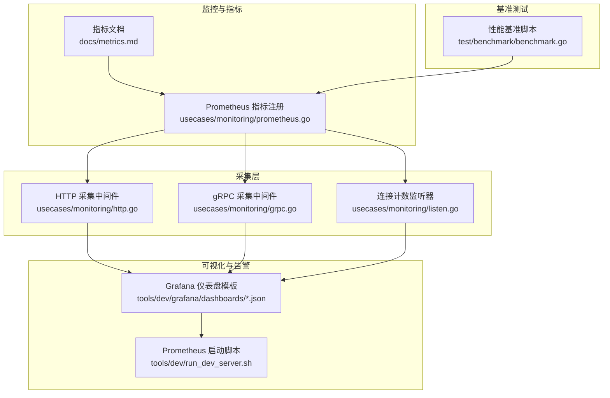
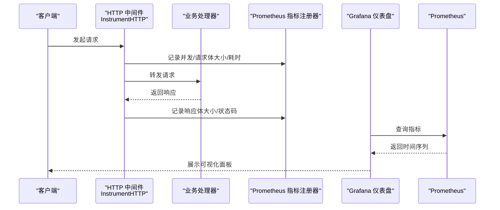
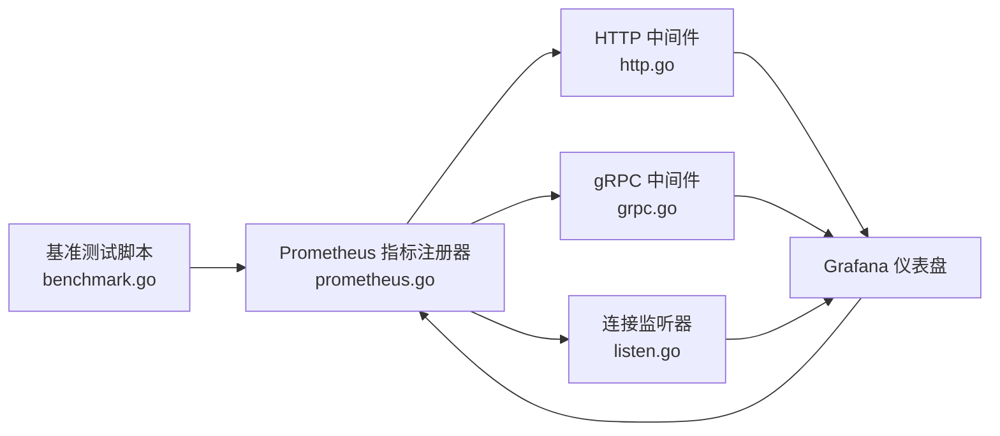

# 性能监控

<cite>
**本文引用的文件**
- [docs/metrics.md](file://docs/metrics.md)
- [usecases/monitoring/prometheus.go](file://usecases/monitoring/prometheus.go)
- [usecases/monitoring/http.go](file://usecases/monitoring/http.go)
- [usecases/monitoring/grpc.go](file://usecases/monitoring/grpc.go)
- [usecases/monitoring/listen.go](file://usecases/monitoring/listen.go)
- [usecases/config/environment.go](file://usecases/config/environment.go)
- [adapters/handlers/grpc/v1/batch/queues.go](file://adapters/handlers/grpc/v1/batch/queues.go)
- [usecases/telemetry/telemetry.go](file://usecases/telemetry/telemetry.go)
- [usecases/modulecomponents/usage/base_module.go](file://usecases/modulecomponents/usage/base_module.go)
- [test/benchmark/benchmark.go](file://test/benchmark/benchmark.go)
- [tools/dev/run_dev_server.sh](file://tools/dev/run_dev_server.sh)
- [tools/dev/grafana/dashboards/dynamic.json](file://tools/dev/grafana/dashboards/dynamic.json)
- [tools/dev/grafana/dashboards/lsm.json](file://tools/dev/grafana/dashboards/lsm.json)
- [tools/dev/grafana/dashboards/objects.json](file://tools/dev/grafana/dashboards/objects.json)
- [usecases/memwatch/monitor_test.go](file://usecases/memwatch/monitor_test.go)
</cite>

## 目录
1. [简介](#简介)
2. [项目结构](#项目结构)
3. [核心组件](#核心组件)
4. [架构总览](#架构总览)
5. [详细组件分析](#详细组件分析)
6. [依赖关系分析](#依赖关系分析)
7. [性能考量](#性能考量)
8. [故障排查指南](#故障排查指南)
9. [结论](#结论)
10. [附录](#附录)

## 简介
本指南面向 Weaviate 的性能监控落地实践，目标是帮助运维与开发团队建立完善的性能观测体系，覆盖关键性能指标（KPI）、瓶颈定位方法、容量规划与扩容策略、监控工具配置（Prometheus/Grafana）、以及性能基准测试流程。文档中的所有指标与实现均以仓库内现有代码与文档为依据，确保可追溯与可复现。

## 项目结构
Weaviate 的性能监控能力由“指标定义”“采集接入”“可视化与告警”“基准测试”四部分组成：
- 指标定义与分类：统一在官方指标文档中明确指标类别、标签与用途，控制标签基数与成本。
- 采集接入：通过 HTTP/gRPC 统一中间件与监听器包装，自动采集请求时延、并发、请求体大小等。
- 可视化与告警：提供 Grafana 仪表盘模板与 Prometheus 配置脚本，快速搭建动态可用指标面板。
- 基准测试：内置性能跟踪脚本，支持压力/负载/回归测试，输出结果并进行回归判定。

图表来源
- [docs/metrics.md](file://docs/metrics.md#L1-L395)
- [usecases/monitoring/prometheus.go](file://usecases/monitoring/prometheus.go#L1-L957)
- [usecases/monitoring/http.go](file://usecases/monitoring/http.go#L1-L115)
- [usecases/monitoring/grpc.go](file://usecases/monitoring/grpc.go#L1-L197)
- [usecases/monitoring/listen.go](file://usecases/monitoring/listen.go#L1-L55)
- [tools/dev/grafana/dashboards/dynamic.json](file://tools/dev/grafana/dashboards/dynamic.json#L1-L62)
- [tools/dev/grafana/dashboards/lsm.json](file://tools/dev/grafana/dashboards/lsm.json#L1-L64)
- [tools/dev/grafana/dashboards/objects.json](file://tools/dev/grafana/dashboards/objects.json#L1-L50)
- [tools/dev/run_dev_server.sh](file://tools/dev/run_dev_server.sh#L1139-L1178)
- [test/benchmark/benchmark.go](file://test/benchmark/benchmark.go#L1-L263)

章节来源
- [docs/metrics.md](file://docs/metrics.md#L1-L395)
- [usecases/monitoring/prometheus.go](file://usecases/monitoring/prometheus.go#L1-L957)
- [usecases/monitoring/http.go](file://usecases/monitoring/http.go#L1-L115)
- [usecases/monitoring/grpc.go](file://usecases/monitoring/grpc.go#L1-L197)
- [usecases/monitoring/listen.go](file://usecases/monitoring/listen.go#L1-L55)
- [tools/dev/grafana/dashboards/dynamic.json](file://tools/dev/grafana/dashboards/dynamic.json#L1-L62)
- [tools/dev/grafana/dashboards/lsm.json](file://tools/dev/grafana/dashboards/lsm.json#L1-L64)
- [tools/dev/grafana/dashboards/objects.json](file://tools/dev/grafana/dashboards/objects.json#L1-L50)
- [tools/dev/run_dev_server.sh](file://tools/dev/run_dev_server.sh#L1139-L1178)
- [test/benchmark/benchmark.go](file://test/benchmark/benchmark.go#L1-L263)

## 核心组件
- 指标分类与清单：官方指标文档定义了“活跃仪表板/运营/告警/分析/废弃”等类别，并给出各指标的类型、标签与高基数提示，便于控制标签基数与成本。
- Prometheus 指标注册与命名空间：集中注册各类指标（批处理、对象、查询、LSM、向量索引、启动、队列、模块使用、HTTP/gRPC 服务器等），并支持命名空间与分组开关。
- HTTP/gRPC 采集中间件：自动统计请求耗时、请求/响应体大小、并发请求数、错误码分布等，统一打点到 Prometheus。
- 连接计数监听器：对 TCP 连接接入/关闭进行计数，辅助观察连接级负载。
- Grafana 仪表盘模板：提供动态可用指标面板、LSM 与对象相关面板，结合 Prometheus 数据源即可快速可视化。
- 基准测试脚本：支持 SIFT 数据集的压力/负载测试，输出各阶段耗时与总体变化，并可配置回归阈值。

章节来源
- [docs/metrics.md](file://docs/metrics.md#L40-L395)
- [usecases/monitoring/prometheus.go](file://usecases/monitoring/prometheus.go#L27-L184)
- [usecases/monitoring/http.go](file://usecases/monitoring/http.go#L31-L97)
- [usecases/monitoring/grpc.go](file://usecases/monitoring/grpc.go#L48-L158)
- [usecases/monitoring/listen.go](file://usecases/monitoring/listen.go#L21-L54)
- [tools/dev/grafana/dashboards/dynamic.json](file://tools/dev/grafana/dashboards/dynamic.json#L1-L62)
- [tools/dev/grafana/dashboards/lsm.json](file://tools/dev/grafana/dashboards/lsm.json#L1-L64)
- [tools/dev/grafana/dashboards/objects.json](file://tools/dev/grafana/dashboards/objects.json#L1-L50)
- [test/benchmark/benchmark.go](file://test/benchmark/benchmark.go#L39-L128)

## 架构总览
Weaviate 的性能监控采用“指标定义—采集—存储—可视化”的标准链路。HTTP/gRPC 中间件与连接监听器在服务入口处埋点，Prometheus 指标注册器统一收集，Grafana 通过数据源展示，Prometheus 启动脚本提供本地开发环境。

图表来源
- [usecases/monitoring/http.go](file://usecases/monitoring/http.go#L63-L97)
- [usecases/monitoring/prometheus.go](file://usecases/monitoring/prometheus.go#L215-L242)
- [tools/dev/grafana/dashboards/dynamic.json](file://tools/dev/grafana/dashboards/dynamic.json#L1-L62)
- [tools/dev/run_dev_server.sh](file://tools/dev/run_dev_server.sh#L1155-L1175)

章节来源
- [usecases/monitoring/http.go](file://usecases/monitoring/http.go#L1-L115)
- [usecases/monitoring/prometheus.go](file://usecases/monitoring/prometheus.go#L214-L289)
- [tools/dev/grafana/dashboards/dynamic.json](file://tools/dev/grafana/dashboards/dynamic.json#L1-L62)
- [tools/dev/run_dev_server.sh](file://tools/dev/run_dev_server.sh#L1139-L1178)

## 详细组件分析

### 指标体系与关键 KPI
- 活跃仪表板类（Dashboard）：聚焦核心可观测性，如批处理耗时、对象数量、并发查询数、查询耗时直方图、LSM 段与内存表大小、队列长度、向量索引大小与墓碑清理、启动进度与磁盘 I/O 吞吐、文本向量化并发与请求耗时等。
- 运营类（Operational）：后台任务与运行状态，如向量索引墓碑清理周期、租户离线操作耗时、模块使用延迟与上传文件大小、分片加载限流、复制引擎状态、分布式任务运行数、HTTP/gRPC 请求耗时与并发、集群状态机应用耗时与索引等。
- 告警类（Alerting）：以症状为导向的最小化指标集合，当前主要关注查询耗时直方图。
- 分析类（Analytical）：用于调试与分析，建议移出 Prometheus 长期保留，避免高基数与成本上升。
- 废弃类（Deprecated）：已移除或计划移除的指标，需及时迁移。

章节来源
- [docs/metrics.md](file://docs/metrics.md#L40-L395)

### Prometheus 指标注册与命名空间
- 配置项：启用开关、端口、是否按类/分片分组、仅关键桶、指标命名空间等。
- 全局指标注册器：集中注册各类指标向量，包括批处理、对象、查询、LSM、向量索引、启动、队列、模块使用、HTTP/gRPC 服务器、校验等。
- 删除类/分片指标：支持在多租户场景下删除特定分片或类的指标，避免误判。

章节来源
- [usecases/monitoring/prometheus.go](file://usecases/monitoring/prometheus.go#L27-L184)
- [usecases/monitoring/prometheus.go](file://usecases/monitoring/prometheus.go#L398-L424)
- [usecases/monitoring/prometheus.go](file://usecases/monitoring/prometheus.go#L438-L800)

### HTTP 采集中间件
- 功能：对请求进行静态路由标签化，统计并发请求数、请求/响应体大小、耗时直方图，并记录状态码分布。
- 关键点：使用 httpsnoop 捕获耗时与写入字节数；请求体大小通过自定义 ReadCloser 统计；并发计数在进入/退出时增减。

章节来源
- [usecases/monitoring/http.go](file://usecases/monitoring/http.go#L31-L97)

### gRPC 采集中间件
- 功能：基于 stats.Handler 与拦截器，统计 gRPC 服务/方法维度的请求耗时、请求/响应体大小、并发请求数与状态码。
- 关键点：拆分 FullMethodName 获取服务名与方法名；根据错误类型映射为 gRPC 状态码。

章节来源
- [usecases/monitoring/grpc.go](file://usecases/monitoring/grpc.go#L48-L158)

### 连接计数监听器
- 功能：包装底层 Listener，统计连接接入与关闭次数，避免重复计数。
- 关键点：连接关闭时仅一次性递减，保证并发计数准确。

章节来源
- [usecases/monitoring/listen.go](file://usecases/monitoring/listen.go#L21-L54)

### Grafana 仪表盘与 Prometheus 启动
- Grafana 仪表盘模板：提供动态可用指标面板、LSM 与对象相关面板，支持 Prometheus 数据源。
- Prometheus 启动脚本：一键拉起 Prometheus 与 Grafana 容器，挂载数据源与仪表盘配置，便于本地开发验证。

章节来源
- [tools/dev/grafana/dashboards/dynamic.json](file://tools/dev/grafana/dashboards/dynamic.json#L1-L62)
- [tools/dev/grafana/dashboards/lsm.json](file://tools/dev/grafana/dashboards/lsm.json#L1-L64)
- [tools/dev/grafana/dashboards/objects.json](file://tools/dev/grafana/dashboards/objects.json#L1-L50)
- [tools/dev/run_dev_server.sh](file://tools/dev/run_dev_server.sh#L1155-L1175)

### 批处理吞吐与自适应
- 批处理统计：维护处理时长指数滑动平均、吞吐指数滑动平均，并根据理想处理时长动态调整批大小范围，保障吞吐稳定性。
- 关键点：吞吐与批大小存在负相关关系，通过 EMA 自适应调节。

章节来源
- [adapters/handlers/grpc/v1/batch/queues.go](file://adapters/handlers/grpc/v1/batch/queues.go#L212-L238)

### 模块使用与 Telemetry
- 模块使用：周期性收集模块使用数据，记录采集耗时直方图与成功/失败计数，便于评估模块开销。
- Telemetry：定期上报节点状态与使用情况，包含推送间隔、失败重试与终止流程。

章节来源
- [usecases/modulecomponents/usage/base_module.go](file://usecases/modulecomponents/usage/base_module.go#L167-L246)
- [usecases/telemetry/telemetry.go](file://usecases/telemetry/telemetry.go#L98-L199)

### 内存映射与内存估算
- 内存映射上限：通过环境变量控制最大内存映射数，避免 Linux 系统限制导致异常。
- 对象删除内存估算：通过环境变量设置估算值，用于限流与容量评估。

章节来源
- [usecases/memwatch/monitor_test.go](file://usecases/memwatch/monitor_test.go#L98-L123)

## 依赖关系分析
- 指标注册器与采集中间件解耦：HTTP/gRPC 中间件仅依赖注册器接口，便于扩展与替换。
- 监听器与指标耦合度低：连接计数监听器独立于业务逻辑，仅对并发连接进行统计。
- 仪表盘与数据源解耦：Grafana 通过 Prometheus 数据源查询，无需改动业务代码。
- 基准测试与指标解耦：基准脚本独立运行，仅消费 HTTP API 并输出统计结果。

图表来源
- [usecases/monitoring/prometheus.go](file://usecases/monitoring/prometheus.go#L214-L289)
- [usecases/monitoring/http.go](file://usecases/monitoring/http.go#L63-L97)
- [usecases/monitoring/grpc.go](file://usecases/monitoring/grpc.go#L48-L158)
- [usecases/monitoring/listen.go](file://usecases/monitoring/listen.go#L21-L54)
- [tools/dev/grafana/dashboards/dynamic.json](file://tools/dev/grafana/dashboards/dynamic.json#L1-L62)
- [test/benchmark/benchmark.go](file://test/benchmark/benchmark.go#L39-L128)

章节来源
- [usecases/monitoring/prometheus.go](file://usecases/monitoring/prometheus.go#L1-L957)
- [usecases/monitoring/http.go](file://usecases/monitoring/http.go#L1-L115)
- [usecases/monitoring/grpc.go](file://usecases/monitoring/grpc.go#L1-L197)
- [usecases/monitoring/listen.go](file://usecases/monitoring/listen.go#L1-L55)
- [tools/dev/grafana/dashboards/dynamic.json](file://tools/dev/grafana/dashboards/dynamic.json#L1-L62)
- [test/benchmark/benchmark.go](file://test/benchmark/benchmark.go#L1-L263)

## 性能考量
- 标签基数控制：遵循指标文档的“高基数/低基数”标注，避免每租户/每类/每路由的标签爆炸。
- 桶设置优化：默认延迟与尺寸桶适用于大多数场景，生产部署可根据实际数据调优。
- 分组与命名空间：通过环境变量开启分组与设置命名空间，降低指标命名复杂度与冲突风险。
- 连接与并发：结合连接计数与并发指标，识别连接风暴与过载风险。

章节来源
- [docs/metrics.md](file://docs/metrics.md#L25-L36)
- [usecases/monitoring/prometheus.go](file://usecases/monitoring/prometheus.go#L374-L392)
- [usecases/config/environment.go](file://usecases/config/environment.go#L72-L107)
- [usecases/monitoring/listen.go](file://usecases/monitoring/listen.go#L21-L54)

## 故障排查指南
- 查询延迟异常
  - 现象：查询耗时直方图尾部显著上移。
  - 排查：检查并发查询数、LSM 段数量与内存表大小、向量索引维护耗时、启动阶段磁盘 I/O 吞吐。
  - 建议：减少高基数标签、优化查询路径、检查索引重建与清理周期。
- 批处理吞吐下降
  - 现象：批处理耗时增加、吞吐波动。
  - 排查：查看批处理时长与批大小自适应调整、队列长度与分区处理耗时。
  - 建议：调整批大小范围、优化后端 I/O、检查队列积压。
- 内存/映射问题
  - 现象：内存占用过高或 mmap 失败。
  - 排查：检查内存映射上限、对象删除内存估算、mmap 操作计数与 /proc/self/maps 条目数。
  - 建议：调整 MAX_MEMORY_MAPPINGS、优化删除策略、减少映射碎片。
- Telemetry/模块使用异常
  - 现象：采集失败或耗时异常。
  - 排查：查看采集周期、成功/失败计数、推送间隔与消费者返回状态。
  - 建议：缩短失败重试间隔、检查消费者可达性与限流策略。

章节来源
- [docs/metrics.md](file://docs/metrics.md#L208-L395)
- [adapters/handlers/grpc/v1/batch/queues.go](file://adapters/handlers/grpc/v1/batch/queues.go#L212-L238)
- [usecases/memwatch/monitor_test.go](file://usecases/memwatch/monitor_test.go#L98-L123)
- [usecases/telemetry/telemetry.go](file://usecases/telemetry/telemetry.go#L98-L199)
- [usecases/modulecomponents/usage/base_module.go](file://usecases/modulecomponents/usage/base_module.go#L167-L246)

## 结论
Weaviate 的性能监控体系以“指标文档—采集中间件—Prometheus—Grafana”为主线，辅以基准测试脚本，形成闭环的可观测性方案。通过严格的标签基数控制与桶设置优化，可在保证观测精度的同时控制成本。建议在生产环境中结合容量规划与告警策略，持续迭代监控与告警阈值，提升系统稳定性与可维护性。

## 附录

### 关键性能指标与监控要点
- 查询延迟与吞吐
  - 指标：查询耗时直方图、并发查询数、请求总数、请求耗时直方图。
  - 监控要点：区分类/查询类型标签，关注尾部延迟与并发峰值。
- 批处理与队列
  - 指标：批处理耗时、批大小、队列长度、分区处理耗时。
  - 监控要点：观察批大小自适应与吞吐波动，避免队列积压。
- LSM 与向量索引
  - 指标：LSM 段数量/大小、内存表大小、向量索引大小/墓碑、维护耗时。
  - 监控要点：关注段分裂/合并频率与墓碑清理周期。
- 启动与磁盘 I/O
  - 指标：启动进度、启动耗时、启动阶段磁盘 I/O 吞吐。
  - 监控要点：冷启动与热更新的 I/O 行为差异。
- 模块使用与 Telemetry
  - 指标：模块请求耗时/次数、上传文件大小、Telemetry 推送状态。
  - 监控要点：模块外部 API 的错误与限流统计。

章节来源
- [docs/metrics.md](file://docs/metrics.md#L40-L395)
- [usecases/monitoring/prometheus.go](file://usecases/monitoring/prometheus.go#L438-L800)

### 监控工具配置与使用
- Prometheus 集成
  - 启用方式：通过环境变量开启监控、设置端口、命名空间与分组。
  - 指标暴露：HTTP/gRPC 中间件与连接监听器自动注册。
- Grafana 仪表盘
  - 使用：导入动态可用指标面板、LSM 与对象面板，绑定 Prometheus 数据源。
- 告警规则
  - 建议：以查询耗时尾部延迟、批处理耗时、队列积压、模块错误率等为核心阈值。

章节来源
- [usecases/config/environment.go](file://usecases/config/environment.go#L72-L107)
- [tools/dev/grafana/dashboards/dynamic.json](file://tools/dev/grafana/dashboards/dynamic.json#L1-L62)
- [tools/dev/grafana/dashboards/lsm.json](file://tools/dev/grafana/dashboards/lsm.json#L1-L64)
- [tools/dev/grafana/dashboards/objects.json](file://tools/dev/grafana/dashboards/objects.json#L1-L50)
- [tools/dev/run_dev_server.sh](file://tools/dev/run_dev_server.sh#L1155-L1175)

### 性能基准测试方法
- 压力测试
  - 方法：使用基准脚本对指定数据集执行批量插入，输出各阶段耗时与总体变化。
  - 回归判定：可配置百分比阈值，超过则失败并提示更新历史结果。
- 负载测试
  - 方法：调整批次数与并发度，观察吞吐与延迟曲线，识别瓶颈。
- 回归测试
  - 方法：对比历史结果文件，若总体耗时显著上升则触发失败。

章节来源
- [test/benchmark/benchmark.go](file://test/benchmark/benchmark.go#L39-L128)