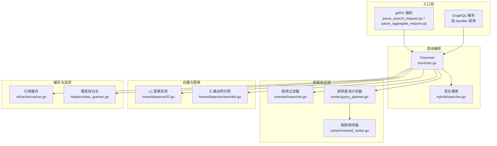
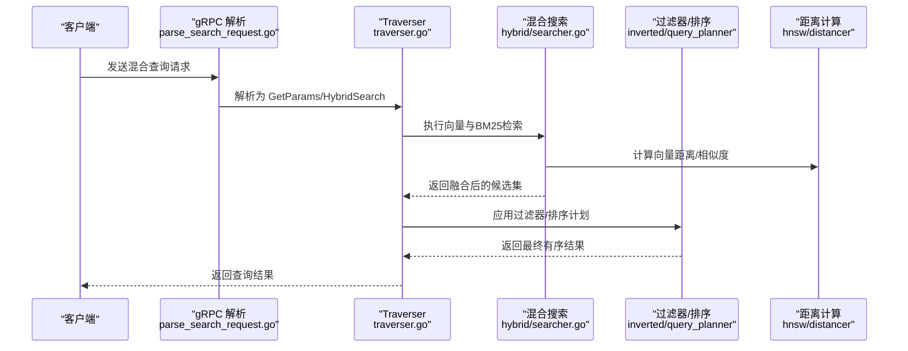
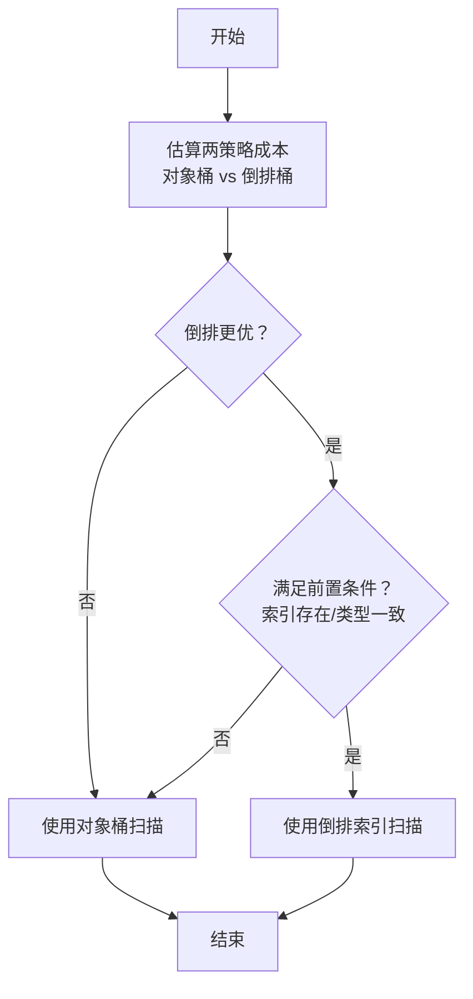
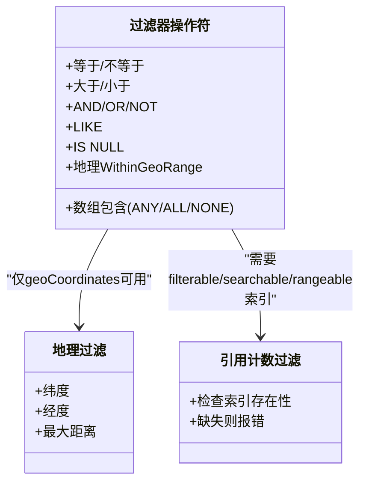
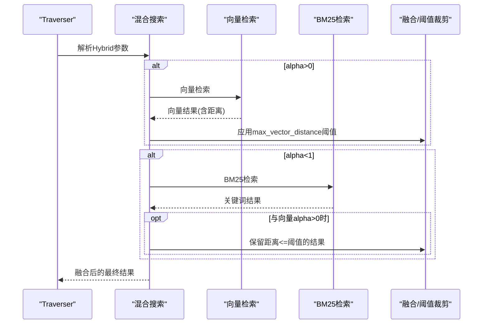
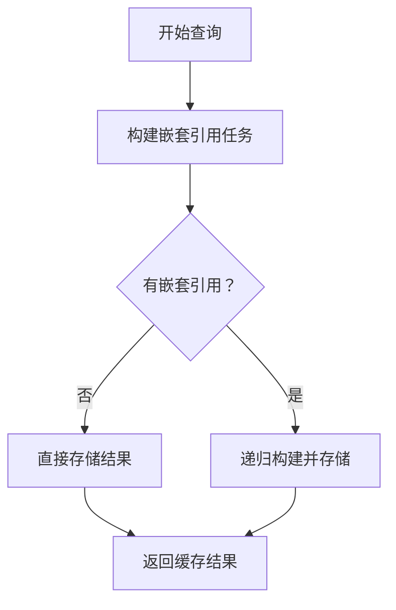
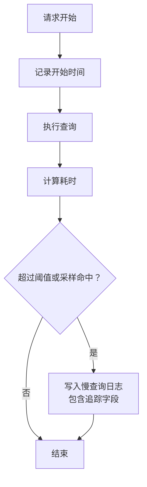
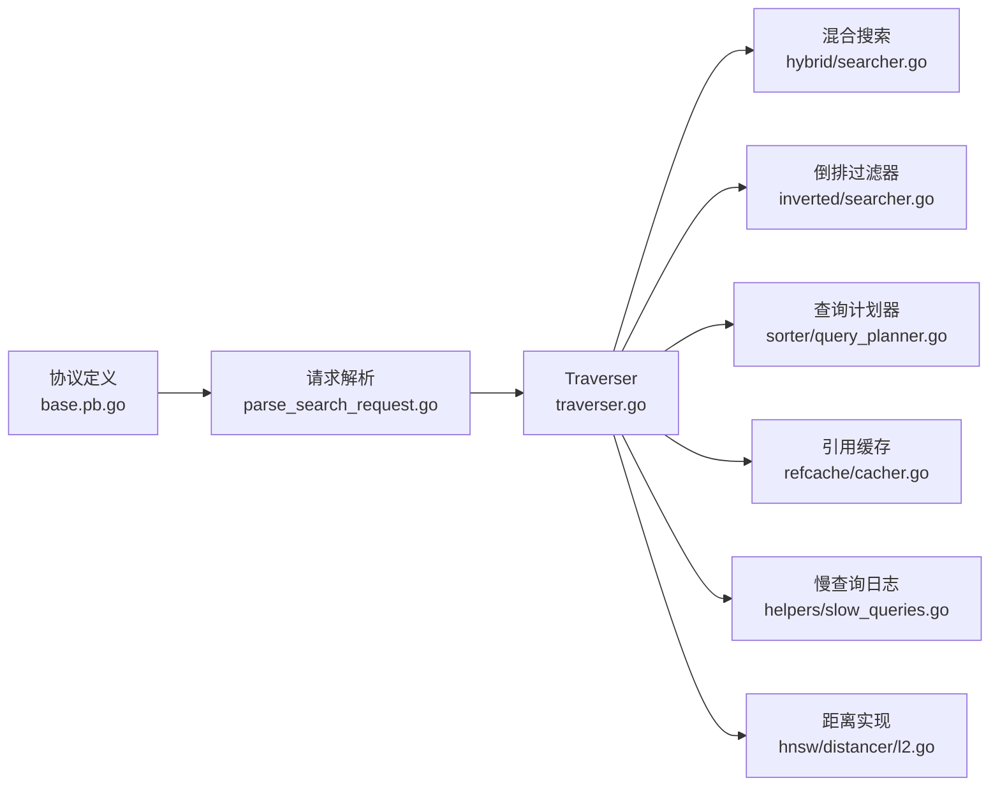

# 查询优化

<cite>
**本文引用的文件**
- [adapters/repos/db/sorter/query_planner.go](file://adapters/repos/db/sorter/query_planner.go)
- [adapters/repos/db/sorter/inverted_sorter.go](file://adapters/repos/db/sorter/inverted_sorter.go)
- [adapters/repos/db/inverted/searcher.go](file://adapters/repos/db/inverted/searcher.go)
- [entities/filters/filters.go](file://entities/filters/filters.go)
- [grpc/generated/protocol/v1/base.pb.go](file://grpc/generated/protocol/v1/base.pb.go)
- [adapters/handlers/grpc/v1/parse_search_request.go](file://adapters/handlers/grpc/v1/parse_search_request.go)
- [adapters/handlers/grpc/v1/parse_aggregate_request.go](file://adapters/handlers/grpc/v1/parse_aggregate_request.go)
- [usecases/traverser/hybrid/searcher.go](file://usecases/traverser/hybrid/searcher.go)
- [adapters/repos/db/refcache/cacher.go](file://adapters/repos/db/refcache/cacher.go)
- [adapters/repos/db/helpers/slow_queries.go](file://adapters/repos/db/helpers/slow_queries.go)
- [adapters/repos/db/vector/hnsw/distancer/l2.go](file://adapters/repos/db/vector/hnsw/distancer/l2.go)
- [adapters/repos/db/vector/hnsw/distancer/asm/dot.go](file://adapters/repos/db/vector/hnsw/distancer/asm/dot.go)
- [adapters/repos/db/aggregator/filtered.go](file://adapters/repos/db/aggregator/filtered.go)
- [adapters/repos/db/bm25f_test.go](file://adapters/repos/db/bm25f_test.go)
- [adapters/repos/db/bm25f_block_test.go](file://adapters/repos/db/bm25f_block_test.go)
- [test/acceptance_with_python/test_hybrid.py](file://test/acceptance_with_python/test_hybrid.py)
- [usecases/traverser/traverser.go](file://usecases/traverser/traverser.go)
</cite>

## 目录
1. [简介](#简介)
2. [项目结构](#项目结构)
3. [核心组件](#核心组件)
4. [架构总览](#架构总览)
5. [组件详解](#组件详解)
6. [依赖关系分析](#依赖关系分析)
7. [性能考量](#性能考量)
8. [故障排查指南](#故障排查指南)
9. [结论](#结论)
10. [附录](#附录)

## 简介
本技术指南聚焦 Weaviate 的查询优化，围绕以下主题展开：查询计划优化（执行路径选择、索引利用最大化、查询重写）、过滤器最佳实践（布尔/范围/地理过滤器）、混合搜索参数调优（向量权重、BM25 权重、距离阈值）、查询缓存机制（结果缓存、嵌套引用缓存、失效策略）、查询性能监控（慢查询识别、统计分析、瓶颈定位），并结合具体测试用例展示优化案例与效果对比。

## 项目结构
Weaviate 的查询路径从 gRPC/GraphQL 入口解析请求，进入 Traverser 层，随后根据查询类型分派到向量检索、BM25 检索或聚合/排序等子系统；过滤器在倒排索引层进行高效匹配；混合搜索对向量与关键词结果进行融合；查询计划器在排序场景下选择最优执行路径；缓存模块负责结果与嵌套引用的缓存；慢查询日志用于性能观测与诊断。

图示来源
- [adapters/handlers/grpc/v1/parse_search_request.go](file://adapters/handlers/grpc/v1/parse_search_request.go#L258-L303)
- [adapters/handlers/grpc/v1/parse_aggregate_request.go](file://adapters/handlers/grpc/v1/parse_aggregate_request.go#L263-L307)
- [usecases/traverser/traverser.go](file://usecases/traverser/traverser.go#L30-L76)
- [usecases/traverser/hybrid/searcher.go](file://usecases/traverser/hybrid/searcher.go#L91-L136)
- [adapters/repos/db/inverted/searcher.go](file://adapters/repos/db/inverted/searcher.go#L451-L486)
- [adapters/repos/db/sorter/query_planner.go](file://adapters/repos/db/sorter/query_planner.go#L56-L193)
- [adapters/repos/db/sorter/inverted_sorter.go](file://adapters/repos/db/sorter/inverted_sorter.go#L422-L439)
- [adapters/repos/db/vector/hnsw/distancer/l2.go](file://adapters/repos/db/vector/hnsw/distancer/l2.go#L27-L77)
- [adapters/repos/db/vector/hnsw/distancer/asm/dot.go](file://adapters/repos/db/vector/hnsw/distancer/asm/dot.go#L21-L106)
- [adapters/repos/db/refcache/cacher.go](file://adapters/repos/db/refcache/cacher.go#L340-L406)
- [adapters/repos/db/helpers/slow_queries.go](file://adapters/repos/db/helpers/slow_queries.go#L52-L95)

章节来源
- [adapters/handlers/grpc/v1/parse_search_request.go](file://adapters/handlers/grpc/v1/parse_search_request.go#L258-L303)
- [adapters/handlers/grpc/v1/parse_aggregate_request.go](file://adapters/handlers/grpc/v1/parse_aggregate_request.go#L263-L307)
- [usecases/traverser/traverser.go](file://usecases/traverser/traverser.go#L30-L76)

## 核心组件
- 查询计划器：基于成本估算在“直接扫描对象桶”与“利用倒排索引”之间做二选一，支持 DESC 反向扫描与量化评估。
- 倒排过滤器：针对布尔/范围/地理等操作符进行索引化匹配，缺失索引时给出明确错误提示。
- 混合搜索：按 alpha 权重融合向量与 BM25 结果，支持向量距离阈值裁剪与二次过滤。
- 引用缓存：对嵌套引用结果进行异步构建与存储，减少重复拉取。
- 慢查询日志：统一采样与阈值控制，输出耗时与追踪字段，便于定位瓶颈。
- 向量距离实现：提供 L2 平方等实现，并可扩展至汇编加速（如点积）。

章节来源
- [adapters/repos/db/sorter/query_planner.go](file://adapters/repos/db/sorter/query_planner.go#L56-L193)
- [adapters/repos/db/sorter/inverted_sorter.go](file://adapters/repos/db/sorter/inverted_sorter.go#L422-L439)
- [adapters/repos/db/inverted/searcher.go](file://adapters/repos/db/inverted/searcher.go#L451-L486)
- [usecases/traverser/hybrid/searcher.go](file://usecases/traverser/hybrid/searcher.go#L91-L136)
- [adapters/repos/db/refcache/cacher.go](file://adapters/repos/db/refcache/cacher.go#L340-L406)
- [adapters/repos/db/helpers/slow_queries.go](file://adapters/repos/db/helpers/slow_queries.go#L52-L95)
- [adapters/repos/db/vector/hnsw/distancer/l2.go](file://adapters/repos/db/vector/hnsw/distancer/l2.go#L27-L77)

## 架构总览
下面以一次混合搜索为例，展示端到端流程：gRPC 请求解析 → Traverser 编排 → 混合搜索融合 → 过滤器与排序 → 结果返回。

图示来源
- [adapters/handlers/grpc/v1/parse_search_request.go](file://adapters/handlers/grpc/v1/parse_search_request.go#L258-L303)
- [usecases/traverser/traverser.go](file://usecases/traverser/traverser.go#L30-L76)
- [usecases/traverser/hybrid/searcher.go](file://usecases/traverser/hybrid/searcher.go#L91-L136)
- [adapters/repos/db/sorter/query_planner.go](file://adapters/repos/db/sorter/query_planner.go#L56-L193)
- [adapters/repos/db/vector/hnsw/distancer/l2.go](file://adapters/repos/db/vector/hnsw/distancer/l2.go#L27-L77)

## 组件详解

### 查询计划优化：执行路径选择与索引利用
- 成本估算维度：对象桶随机 I/O、倒排桶顺序扫描、内存中 Top-N 排序、反向扫描代价。
- 决策条件：当倒排策略更优且属性具备相应索引、逻辑类型与字节序一致时启用；否则回退对象桶扫描。
- 追踪与采样：决策过程写入慢查询日志，便于事后复盘。

图示来源
- [adapters/repos/db/sorter/query_planner.go](file://adapters/repos/db/sorter/query_planner.go#L77-L122)
- [adapters/repos/db/sorter/query_planner.go](file://adapters/repos/db/sorter/query_planner.go#L163-L193)
- [adapters/repos/db/sorter/inverted_sorter.go](file://adapters/repos/db/sorter/inverted_sorter.go#L422-L439)

章节来源
- [adapters/repos/db/sorter/query_planner.go](file://adapters/repos/db/sorter/query_planner.go#L77-L122)
- [adapters/repos/db/sorter/query_planner.go](file://adapters/repos/db/sorter/query_planner.go#L163-L193)
- [adapters/repos/db/sorter/inverted_sorter.go](file://adapters/repos/db/sorter/inverted_sorter.go#L422-L439)

### 过滤器使用最佳实践
- 支持的操作符：等于/不等于、大于/小于、AND/OR/NOT、LIKE、IS NULL、数组包含 ANY/ALL/NONE、地理 WithinGeoRange。
- 地理过滤：仅 geoCoordinates 类型可使用地理范围过滤，需提供经纬度与最大距离。
- 引用计数过滤：对引用计数属性进行过滤时，要求具备可过滤/可搜索/可范围索引之一，否则报错提示缺少索引。

图示来源
- [grpc/generated/protocol/v1/base.pb.go](file://grpc/generated/protocol/v1/base.pb.go#L95-L133)
- [grpc/generated/protocol/v1/base.pb.go](file://grpc/generated/protocol/v1/base.pb.go#L1312-L1319)
- [adapters/repos/db/inverted/searcher.go](file://adapters/repos/db/inverted/searcher.go#L451-L486)
- [entities/filters/filters.go](file://entities/filters/filters.go#L21-L109)

章节来源
- [grpc/generated/protocol/v1/base.pb.go](file://grpc/generated/protocol/v1/base.pb.go#L95-L133)
- [grpc/generated/protocol/v1/base.pb.go](file://grpc/generated/protocol/v1/base.pb.go#L1312-L1319)
- [adapters/repos/db/inverted/searcher.go](file://adapters/repos/db/inverted/searcher.go#L451-L486)
- [entities/filters/filters.go](file://entities/filters/filters.go#L21-L109)

### 混合搜索参数调优
- 参数构成：查询文本、属性列表、向量、alpha 权重、融合算法、目标向量、阈值与是否启用距离。
- 融合策略：alpha=0 仅 BM25，alpha=1 仅向量；alpha∈(0,1) 时先向量后 BM25，支持向量距离阈值裁剪与二次过滤。
- 测试验证：通过测试用例验证仅 BM25 对象、最大向量距离裁剪等行为。

图示来源
- [adapters/handlers/grpc/v1/parse_search_request.go](file://adapters/handlers/grpc/v1/parse_search_request.go#L258-L303)
- [adapters/handlers/grpc/v1/parse_aggregate_request.go](file://adapters/handlers/grpc/v1/parse_aggregate_request.go#L263-L307)
- [usecases/traverser/hybrid/searcher.go](file://usecases/traverser/hybrid/searcher.go#L91-L136)
- [test/acceptance_with_python/test_hybrid.py](file://test/acceptance_with_python/test_hybrid.py#L182-L215)

章节来源
- [adapters/handlers/grpc/v1/parse_search_request.go](file://adapters/handlers/grpc/v1/parse_search_request.go#L258-L303)
- [adapters/handlers/grpc/v1/parse_aggregate_request.go](file://adapters/handlers/grpc/v1/parse_aggregate_request.go#L263-L307)
- [usecases/traverser/hybrid/searcher.go](file://usecases/traverser/hybrid/searcher.go#L91-L136)
- [test/acceptance_with_python/test_hybrid.py](file://test/acceptance_with_python/test_hybrid.py#L182-L215)

### 查询缓存机制
- 结果缓存：对查询结果进行标识化存储，命中即返回，避免重复检索。
- 嵌套引用缓存：递归构建嵌套引用，完成后批量存储，减少后续重复拉取。
- 失效策略：当前实现未见显式 TTL 或失效回调，建议结合业务场景在上层控制缓存生命周期或按需重建。

图示来源
- [adapters/repos/db/refcache/cacher.go](file://adapters/repos/db/refcache/cacher.go#L340-L406)

章节来源
- [adapters/repos/db/refcache/cacher.go](file://adapters/repos/db/refcache/cacher.go#L340-L406)

### 查询性能监控
- 慢查询采样：按阈值采样输出日志，包含耗时与追踪字段，便于定位慢查询。
- 追踪字段：计划器在决策过程中追加人类可读的追踪信息，辅助复盘。

图示来源
- [adapters/repos/db/helpers/slow_queries.go](file://adapters/repos/db/helpers/slow_queries.go#L52-L95)
- [adapters/repos/db/sorter/query_planner.go](file://adapters/repos/db/sorter/query_planner.go#L178-L184)

章节来源
- [adapters/repos/db/helpers/slow_queries.go](file://adapters/repos/db/helpers/slow_queries.go#L52-L95)
- [adapters/repos/db/sorter/query_planner.go](file://adapters/repos/db/sorter/query_planner.go#L178-L184)

### 向量距离与加速
- L2 距离：提供 L2 平方实现，校验向量长度一致性。
- 汇编加速：示例包含汇编点积实现模板，可用于高性能场景（需按平台生成）。

章节来源
- [adapters/repos/db/vector/hnsw/distancer/l2.go](file://adapters/repos/db/vector/hnsw/distancer/l2.go#L27-L77)
- [adapters/repos/db/vector/hnsw/distancer/asm/dot.go](file://adapters/repos/db/vector/hnsw/distancer/asm/dot.go#L21-L106)

## 依赖关系分析
- 入口解析依赖 gRPC 协议定义，将请求映射为内部参数结构。
- Traverser 作为编排中心，协调混合搜索、过滤器与排序计划器。
- 混合搜索依赖向量距离计算与外部模块能力。
- 缓存与慢查询日志贯穿查询链路，提供可观测性与性能保障。

图示来源
- [grpc/generated/protocol/v1/base.pb.go](file://grpc/generated/protocol/v1/base.pb.go#L95-L133)
- [adapters/handlers/grpc/v1/parse_search_request.go](file://adapters/handlers/grpc/v1/parse_search_request.go#L258-L303)
- [usecases/traverser/traverser.go](file://usecases/traverser/traverser.go#L30-L76)
- [usecases/traverser/hybrid/searcher.go](file://usecases/traverser/hybrid/searcher.go#L91-L136)
- [adapters/repos/db/inverted/searcher.go](file://adapters/repos/db/inverted/searcher.go#L451-L486)
- [adapters/repos/db/sorter/query_planner.go](file://adapters/repos/db/sorter/query_planner.go#L56-L193)
- [adapters/repos/db/refcache/cacher.go](file://adapters/repos/db/refcache/cacher.go#L340-L406)
- [adapters/repos/db/helpers/slow_queries.go](file://adapters/repos/db/helpers/slow_queries.go#L52-L95)
- [adapters/repos/db/vector/hnsw/distancer/l2.go](file://adapters/repos/db/vector/hnsw/distancer/l2.go#L27-L77)

## 性能考量
- 索引优先：确保排序/过滤字段具备相应索引（filterable/searchable/rangeable），以触发倒排路径。
- 过滤器前置：尽量在向量检索前应用过滤器缩小候选集，降低向量空间搜索压力。
- 混合权重权衡：alpha 偏向向量时，适当设置 max_vector_distance 阈值，减少无效向量比较。
- 排序成本：大 limit 或 DESC 反向扫描会增加成本，必要时考虑分页或预过滤。
- 距离计算：在高维向量场景，优先使用硬件/汇编加速的距离实现，减少 CPU 开销。

## 故障排查指南
- 慢查询定位：开启慢查询日志，关注采样与阈值配置，结合追踪字段分析瓶颈阶段。
- 过滤器报错：若出现“缺少可过滤索引”类错误，检查属性是否标记为可过滤/可搜索/可范围。
- 地理过滤异常：确认字段类型为 geoCoordinates，且提供经纬度与距离。
- 混合搜索结果异常：核对 alpha、阈值与融合算法设置，参考测试用例验证预期行为。

章节来源
- [adapters/repos/db/helpers/slow_queries.go](file://adapters/repos/db/helpers/slow_queries.go#L52-L95)
- [adapters/repos/db/inverted/searcher.go](file://adapters/repos/db/inverted/searcher.go#L451-L486)
- [test/acceptance_with_python/test_hybrid.py](file://test/acceptance_with_python/test_hybrid.py#L182-L215)

## 结论
通过成本驱动的查询计划、倒排索引的高效过滤、混合搜索的权重与阈值调优、以及缓存与慢查询监控体系，Weaviate 能够在复杂查询场景下获得稳定且可预测的性能表现。建议在生产环境中结合业务特征持续迭代索引策略与混合参数，并配合慢查询日志进行长期观测与优化。

## 附录

### 查询优化案例与效果对比
- 案例一：仅 BM25 检索对象
  - 行为：当 alpha=0 时，仅通过 BM25 检索返回对象。
  - 验证：测试用例断言返回数量与排序正确。
  - 章节来源
    - [test/acceptance_with_python/test_hybrid.py](file://test/acceptance_with_python/test_hybrid.py#L190-L211)

- 案例二：最大向量距离裁剪
  - 行为：设置 max_vector_distance 后，仅保留向量距离不超过阈值的对象。
  - 验证：测试用例断言裁剪后的结果数量与 UUID。
  - 章节来源
    - [test/acceptance_with_python/test_hybrid.py](file://test/acceptance_with_python/test_hybrid.py#L182-L215)

- 案例三：BM25F 与过滤器组合
  - 行为：BM25F 在多属性上进行打分，结合过滤器进一步缩小候选集。
  - 验证：测试用例断言结果排序与分数符合预期。
  - 章节来源
    - [adapters/repos/db/bm25f_test.go](file://adapters/repos/db/bm25f_test.go#L521-L559)
    - [adapters/repos/db/bm25f_block_test.go](file://adapters/repos/db/bm25f_block_test.go#L77-L107)